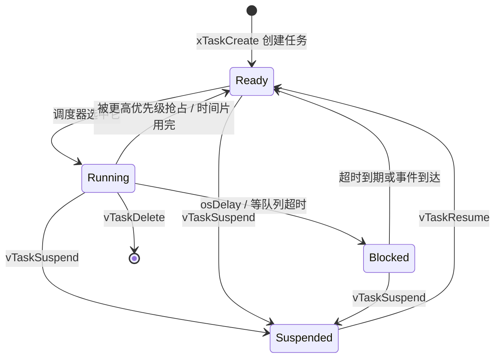
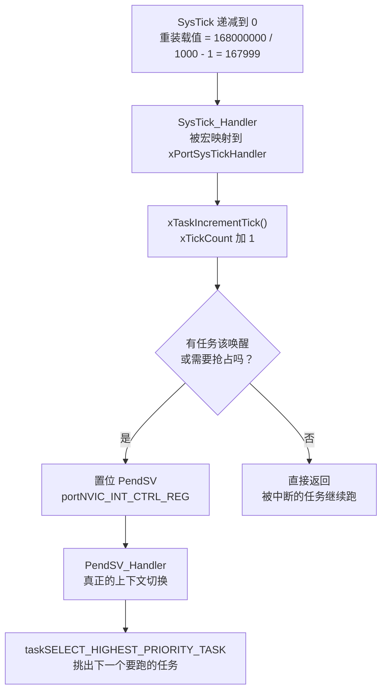
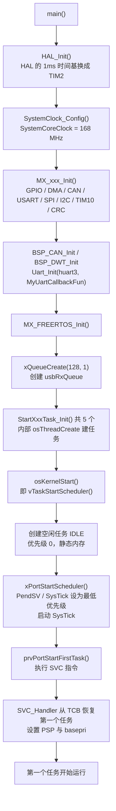

# 任务与调度基础

云台板固件（`/home/wyx/rm/2026SentriOmeniGimbal/2026OmniSentryGimbal`）跑着 FreeRTOS Kernel V10.3.1，同时要处理几件节奏完全不同的事：1 kHz 读 IMU、1 kHz 算云台 PID、200 Hz 处理遥控器、100 Hz 跟视觉小电脑收发包，还有随时可能来的 CAN 报。本文先说明“任务”这个抽象，再解释 1 ms 节拍的来源，最后给出调度器启动的全过程。

> 源码索引（本单元引用的固件路径都相对于固件仓库根目录）

| 文件 | 作用 |
| --- | --- |
| `Core/Inc/FreeRTOSConfig.h` | 全部 FreeRTOS 配置数值 |
| `Core/Src/freertos.c` | 队列与任务创建入口 `MX_FREERTOS_Init()` |
| `Core/Src/main.c` | 时钟树、外设初始化、`osKernelStart()` |
| `Core/Src/stm32f4xx_hal_timebase_tim.c` | HAL 的 1 ms 时间基（TIM2） |
| `Task/TaskBase.h`、`Task/Src/*.cpp` | 6 个应用任务的 C++ 实现 |
| `Middlewares/Third_Party/FreeRTOS/Source/` | FreeRTOS 内核源码（可查证每一句结论） |

## 1. 云台需要 RTOS 的原因

“前后台”结构的写法是：`main()` 里一个 `while(1)`，把所有事按顺序做一遍。放到云台上，问题立刻出来：

| 要做的事 | 期望周期 | 顺序执行的后果 |
| --- | --- | --- |
| 读 BMI088 陀螺仪并跑 AHRS 融合 | 1 ms | 融合算法偶尔超时，后面所有事情跟着抖 |
| 云台 yaw / pitch 双环 PID | 1 ms | PID 周期不均，微分项 D 变成噪声放大器 |
| 读 DBUS 遥控器、算控制目标 | 5 ms | 遥控手感取决于最慢的那个任务 |
| USB CDC 与视觉小电脑收发 43 / 29 字节帧 | 10 ms | 帧率高时来不及解析，丢帧 |
| CAN 收电机反馈 / 发电流指令 | 事件驱动 | 轮询就要么浪费 CPU、要么丢报文 |

矛盾在于：不同事务对“延迟”和“周期”的要求差两个数量级，而前后台架构的执行流只有一个。三种典型解法：

| 方案 | 机制 | 优点 | 代价 | 适用 |
| --- | --- | --- | --- | --- |
| 前后台（超级循环） | `while(1)` + 中断改标志位 | 零调度开销、无栈切换 | 最坏响应时间 = 一轮循环总耗时 | 只有一两个软实时事务 |
| 时间片轮询 | 定时器中断里切“软件状态机” | 无任务栈、RAM 省 | 状态机拆解繁琐，不能阻塞等待 | 中小规模、RAM 极紧 |
| RTOS 多任务 | 每个事务一个任务 + 抢占式调度 | 可以用“阻塞等待”写同步逻辑，延迟可算 | 每个任务一套栈，上下文切换开销 | 本项目：5～7 个并发事务 |

判断标准是：当需求里出现“这个东西必须每 1 ms 跑一次，那个东西慢一点没关系”时，就已经在用 RTOS 的思维。RTOS 把这种优先级显式化，并保证最坏响应时间可推导：

$$T_{响应} \le T_{任务周期} + T_{调度延迟} + T_{执行时间}$$

其中调度延迟由调度器（确定性，微秒级）决定，执行时间由任务自身代码决定。前后台方案里这个不等式右边是“整轮循环时间”，不可控。

## 2. 任务与任务控制块（Task Control Block, TCB）

任务（Task）在 FreeRTOS 里就是“一个死循环的 C 函数 + 一套独立的栈 + 一个 TCB”。

- 函数的签名固定：接收一个 `void *` 参数、永不返回（要退出必须 `vTaskDelete(NULL)`）；
- 栈是私有的，任务里的局部变量、函数调用链、寄存器现场都在里面；
- TCB 是内核给这个任务建的“档案”，调度器只认 TCB，不认函数。

`Middlewares/Third_Party/FreeRTOS/Source/tasks.c` 里的 `tskTaskControlBlock` 按我们这份配置（`configUSE_MUTEXES = 1`、`configUSE_TASK_NOTIFICATIONS = 1`、静态与动态分配同时打开）实际有效的成员如下：

| 成员 | 类型 | 作用 | 为什么重要 |
| --- | --- | --- | --- |
| `pxTopOfStack` | `StackType_t *` | 保存任务被换出时的栈顶 | 必须是结构体第一个成员，移植层汇编直接按偏移 0 取它 |
| `xStateListItem` | `ListItem_t` | 挂在就绪 / 阻塞 / 挂起链表上 | 内核靠双向链表组织任务，不是数组 |
| `xEventListItem` | `ListItem_t` | 挂在“事件链表”上（队列、信号量…） | 阻塞在队列上时按优先级排序 |
| `uxPriority` | `UBaseType_t` | 当前优先级，0 最低 | 抢占比较的就是它 |
| `pxStack` | `StackType_t *` | 栈的起始（低地址） | 栈溢出检查、高水位统计都从这里往上扫 |
| `pcTaskName` | `char[configMAX_TASK_NAME_LEN]` | 任务名，我们配的是 16 字节 | 调试器 / `vTaskList()` 里看到的名字 |
| `uxBasePriority` | `UBaseType_t` | 被互斥量“优先级继承”抬升前的原始优先级 | 只有 `configUSE_MUTEXES = 1` 才有 |
| `uxMutexesHeld` | `UBaseType_t` | 持有互斥量的个数 | 优先级继承的引用计数 |
| `ulNotifiedValue`、`ucNotifyState` | `uint32_t`、`uint8_t` | 任务通知的载荷与状态 | 我们这份配置默认开启 |
| `ucStaticallyAllocated` | `uint8_t` | 标记 TCB / 栈来自静态还是动态内存 | 静态和动态分配同时打开时才存在 |

注意 `pcTaskName` 只有 16 字节：我们给任务起名 `StartControlCenterTask`（`Task/Src/ControlCenterTask.cpp:149`）是 22 个字符，会被截断，调试器里看到的是前 15 个字符加结束符。名字只给人看，不影响功能，但排查问题时别被截断的名字误导。

> 术语：栈大小的单位在 FreeRTOS API 里是 `configSTACK_DEPTH_TYPE`（默认 `uint16_t`），计的是字（word）而不是字节。Cortex-M4 上一个 `StackType_t` 是 4 字节，所以 `2048` 意味着 8 KB。这一点在 `Task/TaskBase.h` 里被原样透传给了 `xTaskCreate`，第三章专门算这次栈占用。

## 3. 任务的四个状态

FreeRTOS 的任务状态只有四个（外加“不存在”），全部由 TCB 挂在哪个链表上决定：

- **运行（Running）**：正在用 CPU 的那个任务。单核上同一时刻只有一个。
- **就绪（Ready）**：万事俱备，只等 CPU。挂在 `pxReadyTasksLists[优先级]` 上。
- **阻塞（Blocked）**：在等时间或等事件（`osDelay`、带超时的 `xQueueReceive`）。有超时的会进延时链表，到点自动回就绪。
- **挂起（Suspended）**：被 `vTaskSuspend()` 显式停住，没有超时，只能靠 `vTaskResume()` 回来。



固件里实际会走到的迁移：

- 每个任务被创建后进 Ready，`osKernelStart()` 之后由调度器挑一个进 Running；
- `ImuTask` 用的是 `DWT_Delay_ms(1)`（`Task/Src/ImuTask.cpp:100`），这是忙等，任务不会进 Blocked，一直停在 Running 烧 CPU（第五章算它的代价）；
- `GimbalTask`（`osDelay(1)`）、`FireTask`（`osDelay(1)`）、`ControlCenterTask`（`osDelay(5)`）、`UsbConnectTask`（`osDelay(10)`）都会周期性地 Running → Blocked → Ready；
- `UsbConnectTask` 还会额外阻塞在 `xQueueReceive` 上等 USB 字节（`Task/Src/UsbConnectTask.cpp:48`）；
- Suspended 状态全项目没人用：`INCLUDE_vTaskSuspend` 虽然配成 1，但没有任何任务被挂起过。


## 4. 1 ms 节拍：tick 从哪来

`configTICK_RATE_HZ` 是（`Core/Inc/FreeRTOSConfig.h:64`）：

```c
#define configTICK_RATE_HZ                       ((TickType_t)1000)
```

于是节拍周期与 tick 分辨率是：

$$T_{tick} = \frac{1}{configTICK\_RATE\_HZ} = \frac{1}{1000}\ \text{s} = 1\ \text{ms}$$

$$portTICK\_PERIOD\_MS = \frac{1000}{configTICK\_RATE\_HZ} = 1$$

`portTICK_PERIOD_MS` 定义在移植层 `Middlewares/Third_Party/FreeRTOS/Source/portable/GCC/ARM_CM4F/portmacro.h:74`，是整数除法。这就是 `osDelay(5)` 恰好等于 5 ms 的原因：CMSIS 包装层把毫秒换算成 tick 时除的就是它（`CMSIS_RTOS/cmsis_os.c` 的 `osDelay()`）：

```c
osStatus osDelay (uint32_t millisec)
{
  TickType_t ticks = millisec / portTICK_PERIOD_MS;   /* 1000 Hz 时 = millisec */
  vTaskDelay(ticks ? ticks : 1);                      /* 最小延迟 1 tick */
  return osOK;
}
```

如果哪天把 `configTICK_RATE_HZ` 改成 100，`osDelay(5)` 里的 5 就会被整数除法吞掉变成 0，然后被兜底成 1 个 tick = 10 ms。这类“改配置不改调用点”的问题很难查，所以约定：要么全项目只用 tick 数传参，要么保证 `configTICK_RATE_HZ` 一直是 1000 且不再改动。

还有两个边界行为（读 `cmsis_os.c` 就能确认）：

- `osDelay(0)` 会被兜底成 `vTaskDelay(1)`，至少让出 1 个 tick；
- `osDelay()` 在 tick 单位上只进不退地取整，所以它保证“至少延迟这么久”，不保证精确周期（要精确周期得用 `vTaskDelayUntil()`，而本项目把它关掉了，见第五章）。

### 4.1 我们有两套“1 ms”

这是 STM32 + FreeRTOS 项目里最容易混淆的一点，我们的固件是分开的：

| 时间基 | 由谁产生 | 谁在维护 | 用途 |
| --- | --- | --- | --- |
| SysTick | Cortex-M4 内核定时器，`xPortSetupTimerInterrupt()` 里配置 | FreeRTOS 内核的 `xTickCount` | `vTaskDelay` / `osDelay` / 超时 / 时间片 |
| TIM2 | 挂在 APB1 上的通用定时器 | HAL 的 `uwTick` | `HAL_GetTick()`、`HAL_Delay()` |

`FreeRTOSConfig.h` 末尾把内核的中断向量名映射成了 CMSIS 标准名（`Core/Inc/FreeRTOSConfig.h:127-133`）：

```c
#define vPortSVCHandler    SVC_Handler
#define xPortPendSVHandler PendSV_Handler
#define xPortSysTickHandler SysTick_Handler
```

这三行的含义是：FreeRTOS 移植层里那几个 `naked` 汇编函数直接顶替掉了启动文件里的弱符号，所以 `SysTick_Handler` 里跑的是 `xPortSysTickHandler()`。而 HAL 那边被换成了 TIM2 时间基（`Core/Src/stm32f4xx_hal_timebase_tim.c` 实现了 `HAL_InitTick()`，覆盖 HAL 库里的弱定义），TIM2 中断走 `TIM2_IRQHandler()` → `HAL_TIM_IRQHandler()` → `HAL_TIM_PeriodElapsedCallback()`（`Core/Src/main.c:206`）→ `HAL_IncTick()`。

必须分开的原因：如果 HAL 也用 SysTick，那么 `SysTick_Handler` 里要同时给 FreeRTOS 加 tick 和给 HAL 加 `uwTick`，而 `HAL_Delay()` 忙等 `uwTick`：任务里一调用它就不让出 CPU，一旦它等的 tick 又依赖被它占住的东西，就会锁死。分开之后规则很清晰：

> 任务里等时间用 `osDelay()`；`HAL_Delay()` 只允许在调度器启动之前（`main()` 里）使用。

`Core/Src/main.c` 的顺序也印证了这一点：`HAL_Init()` → `SystemClock_Config()` → 各外设 `MX_xxx_Init()` → `MX_FREERTOS_Init()` → `osKernelStart()`。注意 `HAL_InitTick()` 会被调用两次：一次在 `HAL_Init()`（此时 `SystemCoreClock` 还是 16 MHz 的 HSI，TIM2 预分频算的是错的），一次在 `SystemClock_Config()` 内部 `HAL_RCC_ClockConfig()` 的末尾（`Drivers/STM32F4xx_HAL_Driver/Src/stm32f4xx_hal_rcc.c:722`），第二次才按真实的 168 MHz 重算。这是 CubeMX 代码的正常行为，不是 bug。

### 4.2 SysTick 的重装载值计算

`xPortSetupTimerInterrupt()` 里的关键一行（`portable/GCC/ARM_CM4F/port.c`）：

```c
portNVIC_SYSTICK_LOAD_REG = ( configSYSTICK_CLOCK_HZ / configTICK_RATE_HZ ) - 1UL;
portNVIC_SYSTICK_CTRL_REG = ( portNVIC_SYSTICK_CLK_BIT | portNVIC_SYSTICK_INT_BIT | portNVIC_SYSTICK_ENABLE_BIT );
```

`configSYSTICK_CLOCK_HZ` 未定义时默认等于 `configCPU_CLOCK_HZ`，而（`Core/Inc/FreeRTOSConfig.h:63`）：

```c
#define configCPU_CLOCK_HZ                       ( SystemCoreClock )
```

我们的时钟树是 HSE 12 MHz（`Core/Inc/stm32f4xx_hal_conf.h` 里 `HSE_VALUE = 12000000`）经 PLL：`PLLM = 6`、`PLLN = 168`、`PLLP = 2`（`Core/Src/main.c:170-173`），即

$$f_{SYSCLK} = \frac{12\ \text{MHz}}{6} \times 168 \div 2 = 168\ \text{MHz}$$

于是

$$\text{SysTick 重装载值} = \frac{168\,000\,000}{1000} - 1 = 167999$$

SysTick 是 24 位递减计数器，167999 远小于 $2^{24}-1$，合法。每次减到 0 触发一次 `SysTick_Handler`，内核的 `xTaskIncrementTick()` 把 `xTickCount` 加一，这就是 1 ms 节拍的物理来源。



时序上要注意：tick 中断本身不切任务，它只把 PendSV 挂起（pend）。PendSV 的优先级被设成最低（数值 15），这样它能等所有高优先级中断处理完再切上下文，不会在中断嵌套中途去动任务的栈。

## 5. 调度器启动流程

从 `main()` 到第一个任务开始运行，中间经过一串容易记混的步骤。完整链路如下：



几个容易被忽略的细节：

（1）空闲任务（Idle Task）在 `osKernelStart()` 里创建，不在 `MX_FREERTOS_Init()` 里。我们这份配置同时打开了静态和动态分配（`FreeRTOSConfig.h:59-60`）：

```c
#define configSUPPORT_STATIC_ALLOCATION          1
#define configSUPPORT_DYNAMIC_ALLOCATION         1
```

`vTaskStartScheduler()` 里 `configSUPPORT_STATIC_ALLOCATION == 1` 的分支优先，于是它向应用层回调索要内存：

```c
StaticTask_t *pxIdleTaskTCBBuffer = NULL;
StackType_t  *pxIdleTaskStackBuffer = NULL;
uint32_t      ulIdleTaskStackSize;
vApplicationGetIdleTaskMemory( &pxIdleTaskTCBBuffer, &pxIdleTaskStackBuffer, &ulIdleTaskStackSize );
xIdleTaskHandle = xTaskCreateStatic( prvIdleTask, configIDLE_TASK_NAME, ulIdleTaskStackSize, ... );
```

我们在 `Core/Src/freertos.c:77-86` 提供了这个回调：

```c
static StaticTask_t xIdleTaskTCBBuffer;
static StackType_t  xIdleStack[configMINIMAL_STACK_SIZE];

void vApplicationGetIdleTaskMemory( StaticTask_t **ppxIdleTaskTCBBuffer,
                                    StackType_t **ppxIdleTaskStackBuffer,
                                    uint32_t *pulIdleTaskStackSize )
{
  *ppxIdleTaskTCBBuffer   = &xIdleTaskTCBBuffer;      /* 静态 TCB */
  *ppxIdleTaskStackBuffer = &xIdleStack[0];           /* 静态栈 */
  *pulIdleTaskStackSize   = configMINIMAL_STACK_SIZE; /* 256 words = 1 KB */
}
```

IDLE 的 TCB 和 1 KB 栈是编译期就定下来的 `.bss` 变量，不占那 40 KB 堆。`configMINIMAL_STACK_SIZE = 256`（`FreeRTOSConfig.h:66`）只服务于空闲任务；云台板是 256 words，底盘板改成了 512 words（两个 `FreeRTOSConfig.h` 只差这一行）。

（2）空闲任务优先级是 0，最低。它的工作是：回收被 `vTaskDelete` 掉的任务的 TCB / 栈（动态分配时）、执行 `configUSE_IDLE_HOOK` 勾子（我们关掉了）。如果所有任务都在阻塞，空闲任务就跑，所以“空闲任务几乎跑不到”就是 CPU 被占满的最直观信号。我们的 `ImuTask` 忙等 1 ms，空闲任务基本没机会跑满一个 tick。

（3）第一个任务从预置的假栈帧里恢复出来。创建任务时内核会在任务栈顶预置一个和“中断压栈”格式一致的假现场（`pxPortInitialiseStack()`，`portable/GCC/ARM_CM4F/port.c`）：

| 栈内位置（从高到低） | 内容 | 含义 |
| --- | --- | --- |
| xPSR | `portINITIAL_XPSR` | 让 Thumb 位为 1 |
| PC | 任务入口函数的地址 | 任务“返回”到这里开始执行 |
| LR | `portTASK_RETURN_ADDRESS` → `prvTaskExitError()` | 任务函数万一 return 就会进入错误分支 |
| R12, R3, R2, R1 | 不初始化（省代码） | — |
| R0 | `pvParameters` | 任务函数的第一个参数 |
| EXC_RETURN | `portINITIAL_EXC_RETURN` | 指示用 PSP 返回、且 FPU 惰性保存 |
| R11 … R4 | 不初始化 | 被换出时才真正保存 |

`vPortSVCHandler()`（被映射成 `SVC_Handler`）用一条 `ldmia r0!, {r4-r11, r14}` 把这套现场弹进寄存器、`msr psp, r0` 设好任务栈指针、把 `basepri` 清 0 打开可屏蔽中断，最后 `bx r14` 返回到任务入口。第一个任务的启动就是这样骗过 CPU 的。

（4）中断优先级在 `xPortStartScheduler()` 里统一设定：

```c
/* Make PendSV and SysTick the lowest priority interrupts. */
portNVIC_SYSPRI2_REG |= portNVIC_PENDSV_PRI;
portNVIC_SYSPRI2_REG |= portNVIC_SYSTICK_PRI;
```

配合 `Core/Inc/FreeRTOSConfig.h` 里的两个数：

```c
#define configLIBRARY_LOWEST_INTERRUPT_PRIORITY      15
#define configLIBRARY_MAX_SYSCALL_INTERRUPT_PRIORITY 5
```

内核中断（PendSV、SysTick）被压到最低（数值 15）；数值 5 是能调用 `xxxFromISR()` 这类中断安全 API 的最低门槛（数值越小优先级越高，所以门槛是不许比 5 更紧急）。我们的外设中断全设成 5：CAN1 / CAN2 的 RX0 / RX1（`Core/Src/can.c`）、DMA 五个流（`Core/Src/dma.c`）、USART3 / USART6（`Core/Src/usart.c`）、USB OTG FS（`USB_DEVICE/Target/usbd_conf.c`）、TIM1_UP_TIM10（`Core/Src/tim.c`），刚好卡在允许调用的边界上。这是 CubeMX 的默认值正好落在 FreeRTOS 的规则线上，改动任何一个都要重新核对。


## 6. 落到我们的固件：`MX_FREERTOS_Init()`

`Core/Src/freertos.c` 是 CubeMX 生成的骨架加手写代码，逐段看：

```c
void MX_FREERTOS_Init(void) {
  /* USER CODE BEGIN RTOS_QUEUES */
  // 创建USB接收队列
  usbRxQueue = xQueueCreate(128, sizeof(uint8_t));
  if (usbRxQueue == NULL) {
    // 队列创建失败，可以添加错误处理
    // 这里简单标记，实际产品需要更健壮的处理
  }
  /* USER CODE END RTOS_QUEUES */

  /* definition and creation of defaultTask */
  osThreadDef(defaultTask, StartDefaultTask, osPriorityNormal, 0, 256);
  defaultTaskHandle = osThreadCreate(osThread(defaultTask), NULL );

  /* USER CODE BEGIN RTOS_THREADS */
  StartFireTask_Init();
  StartImuTask_Init();
  StartGimbalTask_Init();
  StartControlCenterTask_Init();
  StartUsbConnectTask_Init();
  //StartTestTask_Init();
  /* USER CODE END RTOS_THREADS */
}
```

四件事需要留意：

1. 队列先于任务创建。`usbRxQueue` 是一条生产者-消费者通道：生产者是 USB 中断里的 `CDC_Receive_FS()`（`USB_DEVICE/App/usbd_cdc_if.c:261`，用 `xQueueSendFromISR` 逐字节入队），消费者是 `UsbConnectTask`（`xQueueReceive`）。中断随时可能来，所以队列必须在 `osKernelStart()` 之前就存在；代码里那个 `if (usbRxQueue == NULL)` 的空分支说明作者知道失败要处理，但还没写。
2. `defaultTask` 是 CubeMX 留下的启动任务：优先级 `osPriorityNormal`、栈 256 words，它的全部工作是在内核起来后调用 `MX_USB_DEVICE_Init()`，然后 `osDelay(1)` 空转。
3. `TestTask` 被注释掉了。所以“本项目 6 个任务”指源文件层面的 6 个任务类；运行时实际只有 5 个应用任务，加上 `defaultTask` 和 IDLE 共 7 个。第四章会逐一列出。
4. 每个 `StartXxxTask_Init()` 都是 `extern "C"` 的 C 函数，内部调用 C++ 基类 `TaskBase::start()`。这样既用 C++ 类写任务，又保持 CubeMX 的 C 入口，第三章展开说明。

## 7. 小结

### 核心概念

- 任务 = 函数 + 私有栈 + TCB；调度器只认 TCB。
- TCB 的第一个成员必须是 `pxTopOfStack`，因为移植层汇编按偏移 0 访问它。
- 四个状态：Running / Ready / Blocked / Suspended，由 TCB 挂在哪个链表决定。`DWT_Delay_ms()` 忙等不进 Blocked，属于假阻塞。
- `configTICK_RATE_HZ = 1000` 对应 1 tick = 1 ms；`portTICK_PERIOD_MS = 1000 / configTICK_RATE_HZ = 1`，`osDelay(ms)` 的换算靠它，改成低频 tick 会让所有 `osDelay` 的语义跟着改变。
- 本项目有两套 1 ms：内核的 SysTick（`xTickCount`）和 HAL 的 TIM2（`uwTick`）。任务里等时间只能 `osDelay()`。
- 空闲任务在 `osKernelStart()` 里用静态内存创建，栈是 `configMINIMAL_STACK_SIZE = 256` words。
- 第一个任务靠预置的假栈帧加 `SVC_Handler` 启动；tick 中断只 pend PendSV，真正的切换在 PendSV 里做。
- `configLIBRARY_MAX_SYSCALL_INTERRUPT_PRIORITY = 5` 是能否在中断里调 FreeRTOS API 的门槛，本项目所有外设中断都在 5。

### 设计权衡

| 选择 | 我们怎么选的 | 代价 / 收益 |
| --- | --- | --- |
| 用不用 RTOS | 用 | 每个任务一套栈（本项目应用任务合计约 27 KB），换来延迟可推导 |
| tick 频率 | 1000 Hz | 1 ms 分辨率，够 1 kHz 控制；tick 中断开销约每秒 1000 次，可接受 |
| HAL 时间基 | 独立的 TIM2 | 多占一个定时器，但避免与内核 tick 纠缠 |
| 空闲任务内存 | 静态 | 不占 40 KB 堆；代价是必须提供 `vApplicationGetIdleTaskMemory` |
| 任务优先级 | 全部 `osPriorityNormal` | 实现最简单；代价是同优先级只能靠时间片加阻塞让出，实时性靠“谁先阻塞”的运气（第 2、5 章详述） |
| 任务退出 | 全是 `for(;;)` 死循环，不退出 | 不需要 `vTaskDelete` 与内存回收；代价是任务栈永久占用 |

## 8. 练习

基础题

1. 计算把 `configTICK_RATE_HZ` 改成 500 后，`GimbalTask` 里 `osDelay(1)` 的实际延迟毫秒数，并判断它是否还能维持 1 kHz。
2. 说明把 `configMINIMAL_STACK_SIZE` 从 256 改成 128 的后果，并判断空闲任务是否会立刻崩溃（提示：先想空闲任务到底要跑什么）。
3. 计算 `static StackType_t xIdleStack[configMINIMAL_STACK_SIZE];` 这一行占多少字节，并说明它位于 Flash 还是 RAM。

挑战题

4. 说明在 `main()` 里、`osKernelStart()` 之前调用 `xTaskGetTickCount()` 的返回值及其原因。
5. 外设中断优先级都是 5，`configLIBRARY_MAX_SYSCALL_INTERRUPT_PRIORITY` 也是 5。说明把 CAN1_RX0 改成 4 会发生什么（提示：`vPortValidateInterruptPriority()` 里那句 `configASSERT( ucCurrentPriority >= ucMaxSysCallPriority )`）。
6. 说明把 `ImuTask` 的 `DWT_Delay_ms(1)` 换成 `osDelay(1)` 后功能上的变化，并判断 AHRS 融合构造时传的 1000 Hz 是否需要跟着改。
7. `defaultTask` 的栈只有 256 words，而它只做一件事：调用 `MX_USB_DEVICE_Init()`。说明这个“只调一次初始化”的任务为什么需要独立任务，而不是直接在 `main()` 里调用。
