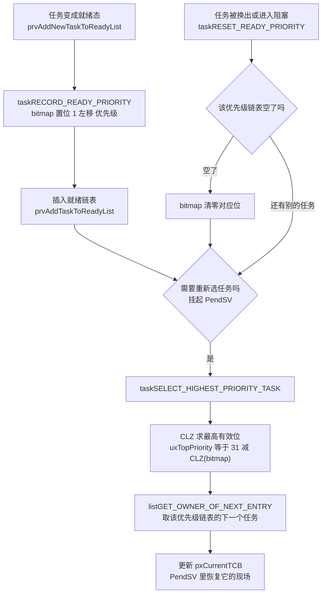
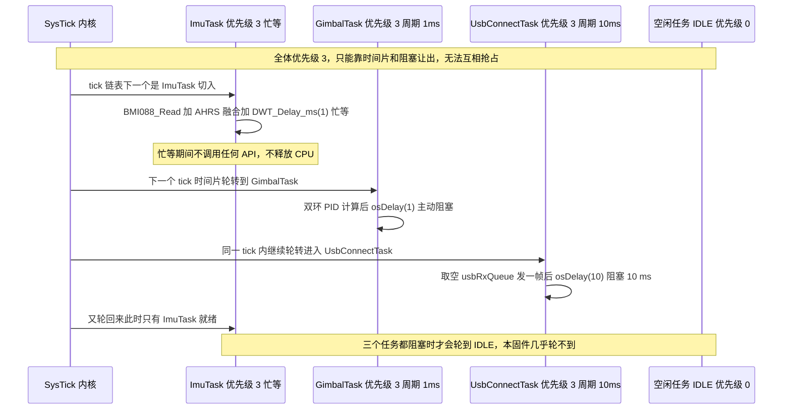
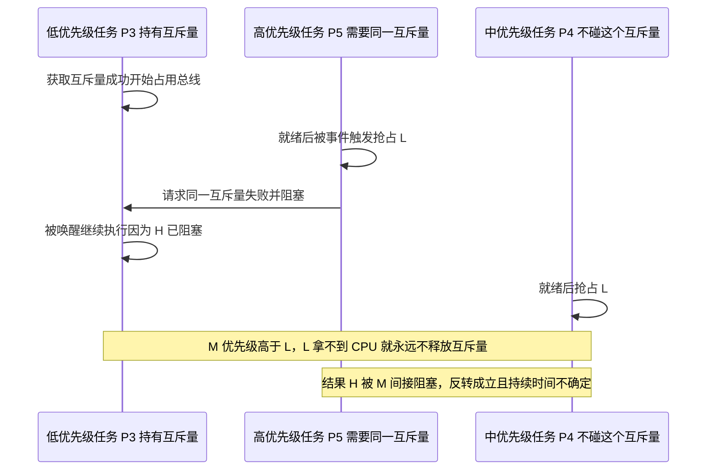

# 优先级与抢占式调度

上一章说明了任务是什么，接下来看调度顺序。FreeRTOS 的调度规则可以压缩成两句话：

1. 总是运行就绪态里优先级最高的那个任务（优先级数值越大越高）；
2. 同优先级的任务平分 CPU（时间片轮转）；一旦有更高优先级任务就绪，立刻抢占。

规则本身简单，但“优先级”在 STM32 加 CMSIS 包装层里被翻译了三道，很容易配错。下面把三道翻译拆开，最后说明固件里“所有任务都是 `osPriorityNormal`”的代价。

## 1. 优先级是个整数：越大越高

`Core/Inc/FreeRTOSConfig.h:65`：

```c
#define configMAX_PRIORITIES                     ( 7 )
```

它定义的是优先级的个数，所以合法优先级是 $0, 1, \dots, 6$：

$$P \in [0,\ configMAX\_PRIORITIES - 1]$$

| 优先级 | 谁会用 | 说明 |
| --- | --- | --- |
| 0 | 空闲任务 Idle Task | 内核强制的最低级。同级的普通任务会和 IDLE 抢时间片 |
| 1 ~ 2 | 本项目没人用 | 预留给“低优先级后台任务” |
| 3 | 本项目全部 6 个应用任务加 `defaultTask` | `osPriorityNormal` 映射过来的（见第 2 节） |
| 4 ~ 5 | 本项目没人用 | 本可以给 `ImuTask` / `GimbalTask` 这类硬实时任务 |
| 6 | 无人使用 | 留给“必须在 1 ms 内响应”的任务 |

数值越大优先级越高的规则和 Cortex-M 中断优先级正好相反（中断里数值越小越紧急）。这是最容易配错的地方，写代码时留意：任务优先级 6 比 3 高，中断优先级 3 比 6 紧急。

### 1.1 `configMAX_PRIORITIES` 的代价

这个值并不是越大越好：内核为每一个优先级都维护一个就绪链表。

```c
PRIVILEGED_DATA static List_t pxReadyTasksLists[ configMAX_PRIORITIES ];
```

`List_t` 按我们这份配置（`configUSE_LIST_DATA_INTEGRITY_CHECK_BYTES` 未定义，即 0）是 20 字节：`uxNumberOfItems`（4）加 `pxIndex`（4）加 `xListEnd` 这个 `MiniListItem_t`（4 加 4 加 4）。于是：

$$内存 = 7 \times 20\ \text{B} = 140\ \text{B（常量级，可忽略）}$$

需要关心的是位数上限：用位图选任务（第 3 节）时 `configMAX_PRIORITIES` 不能超过 32，否则 FreeRTOS 直接编译报错：

```c
#if( configMAX_PRIORITIES > 32 )
    #error configUSE_PORT_OPTIMISED_TASK_SELECTION can only be set to 1 when configMAX_PRIORITIES is less than or equal to 32. ...
#endif
```

## 2. 三道翻译：从 `osPriorityNormal` 到数字 3

代码里写的是 CMSIS-RTOS 的枚举 `osPriorityNormal`，内核看到的是一个整数。中间的翻译在 `Middlewares/Third_Party/FreeRTOS/Source/CMSIS_RTOS/cmsis_os.c:103`：

```c
/* Convert from CMSIS type osPriority to FreeRTOS priority number */
static unsigned portBASE_TYPE makeFreeRtosPriority (osPriority priority)
{
  unsigned portBASE_TYPE fpriority = tskIDLE_PRIORITY;

  if (priority != osPriorityError) {
    fpriority += (priority - osPriorityIdle);
  }

  return fpriority;
}
```

CMSIS-RTOS v1 的枚举带负数（`CMSIS_RTOS/cmsis_os.h:173-180`）：`osPriorityIdle = -3`、`osPriorityLow = -2`、`osPriorityBelowNormal = -1`、`osPriorityNormal = 0`、`osPriorityAboveNormal = +1`、`osPriorityHigh = +2`、`osPriorityRealtime = +3`，另外 `osPriorityError = 0x84`。

而 `tskIDLE_PRIORITY = 0`，所以换算公式是：

$$P_{FreeRTOS} = tskIDLE\_PRIORITY + \left(P_{CMSIS} - osPriorityIdle\right) = 0 + \left(P_{CMSIS} + 3\right) = P_{CMSIS} + 3$$

完整对照表：

| CMSIS-RTOS 枚举 | 枚举值 | 得到的 FreeRTOS 优先级 | 本项目是否使用 |
| --- | --- | --- | --- |
| `osPriorityIdle` | -3 | 0 | 底盘板的 `defaultTask` 用了 |
| `osPriorityLow` | -2 | 1 | 没用 |
| `osPriorityBelowNormal` | -1 | 2 | 没用 |
| `osPriorityNormal` | 0 | 3 | 云台板全部任务 |
| `osPriorityAboveNormal` | +1 | 4 | 没用 |
| `osPriorityHigh` | +2 | 5 | 没用 |
| `osPriorityRealtime` | +3 | 6 | 没用 |
| `osPriorityError` | 0x84 | 0（特殊：不累加偏移） | 不应出现 |

所以“`osPriorityNormal` 映射到第几级”的答案是 3。

这顺带解释了 `configMAX_PRIORITIES` 至少要 7 的原因：CMSIS 的 7 个有效级别（-3 ~ +3）会被翻译成 0 ~ 6，一个不多一个不少。如果谁把 `configMAX_PRIORITIES` 改成 5，`osPriorityRealtime` 就会变成优先级 6，越界。`vTaskPrioritySet()` 里那句 `configASSERT( uxPriority < configMAX_PRIORITIES )` 会当场把系统停住（见第五章“`configASSERT` 命中后为什么是死循环”）。

### 2.1 固件里的实际写法

云台板 `Core/Src/freertos.c:123`：

```c
osThreadDef(defaultTask, StartDefaultTask, osPriorityNormal, 0, 256);
```

6 个应用任务清一色（`Task/Src/*.cpp`）：

```c
controlcenterTask.start((char*)"StartControlCenterTask", 1024, osPriorityNormal); // ControlCenterTask.cpp:149
imuTask.start       ((char*)"imuTask",                    1024, osPriorityNormal); // ImuTask.cpp:112
gimbalTask.start    ((char*)"gimbalTask",                 2048, osPriorityNormal); // GimbalTask.cpp:120
fireTask.start      ((char*)"StartFireTask",               512, osPriorityNormal); // FireTask.cpp:217
usbconnectTask.start((char*)"StartUsbConnectTask",        2048, osPriorityNormal); // UsbConnectTask.cpp:118
testTask.start      ((char*)"TestTask",                    256, osPriorityNormal); // TestTask.cpp:31（未创建）
```

底盘板 `2026OmniSentryChassis` 的 `defaultTask` 用的是 `osPriorityIdle`（翻译后等于 0，和 IDLE 同级），而 `ChassisTask` / `ControlCenterTask` / `UsbConnectTask` 依然是 `osPriorityNormal`（等于 3）。两个板子的优先级策略一致：不做分级。

## 3. 最高优先级任务的选取：CLZ 位图

如果 `configUSE_PORT_OPTIMISED_TASK_SELECTION` 是 0，内核得从最高优先级往下逐个链表检查是否为空（`tasks.c:133-148`）：

```c
UBaseType_t uxTopPriority = uxTopReadyPriority;
while( listLIST_IS_EMPTY( &( pxReadyTasksLists[ uxTopPriority ] ) ) )
{
    configASSERT( uxTopPriority );
    --uxTopPriority;
}
listGET_OWNER_OF_NEXT_ENTRY( pxCurrentTCB, &( pxReadyTasksLists[ uxTopPriority ] ) );
```

最坏情况要查 7 次。我们把它换成了 Cortex-M4 的硬件指令（`Core/Inc/FreeRTOSConfig.h:72`）：

```c
#define configUSE_PORT_OPTIMISED_TASK_SELECTION  1
```

机制是：把“哪些优先级上有就绪任务”压成一个 32 位位图 `uxTopReadyPriority`，然后一条 `CLZ`（Count Leading Zeros，前导零计数）指令就能算出最高位在哪。移植层实现（`portable/GCC/ARM_CM4F/portmacro.h:130-149`）：

```c
static inline uint8_t ucPortCountLeadingZeros( uint32_t ulBitmap )
{
    __asm volatile ( "clz %0, %1" : "=r" ( ucReturn ) : "r" ( ulBitmap ) : "memory" );
    return ucReturn;
}

#define portRECORD_READY_PRIORITY( uxPriority, uxReadyPriorities ) ( uxReadyPriorities ) |= ( 1UL << ( uxPriority ) )
#define portRESET_READY_PRIORITY( uxPriority, uxReadyPriorities ) ( uxReadyPriorities ) &= ~( 1UL << ( uxPriority ) )
#define portGET_HIGHEST_PRIORITY( uxTopPriority, uxReadyPriorities ) uxTopPriority = ( 31UL - ( uint32_t ) ucPortCountLeadingZeros( ( uxReadyPriorities ) ) )
```

于是选任务变成：

$$P_{top} = 31 - \mathrm{CLZ}(bitmap)$$

手工算两个例子：

| 场景 | 位图（二进制） | `CLZ` | $31 - CLZ$ | 结论 |
| --- | --- | --- | --- | --- |
| 只有优先级 3 上有就绪任务（本固件的常态） | `0b1000` | 28 | 3 | 选中优先级 3 链表 |
| 优先级 5 和 3 都有就绪任务 | `0b101000` | 26 | 5 | 选中优先级 5 |
| 只有 IDLE（优先级 0） | `0b1` | 31 | 0 | 选中 IDLE |

注意 `CLZ(0)` 在 ARM 上不产生异常，返回 32，于是 $31 - 32 = -1$ 会变成 0xFFFFFFFF。这是 FreeRTOS 里少数几个“依赖调用者保证位图非零”的地方（`xTaskIncrementTick` / `taskSELECT_HIGHEST_PRIORITY_TASK` 里总有 IDLE 兜底，所以不会真发生）。



两种选择算法的对比：

| 维度 | 通用算法（配成 0） | 端口优化（配成 1，本项目） |
| --- | --- | --- |
| 实现 | `while` 循环逐个链表判空 | 一条 `CLZ` 指令 |
| 最坏耗时 | 最多 `configMAX_PRIORITIES` 次链表判空 | 常数（1 条指令加少量位运算） |
| 对中断延迟的影响 | 随优先级个数线性增长 | 几乎恒定 |
| 限制 | 无 | `configMAX_PRIORITIES <= 32` |
| 适用 | 优先级很多或非 ARM 核 | Cortex-M3 / M4 / M7（有 `CLZ`） |

这也解释了 RTOS 调度延迟为何是微秒级且可预测：选任务是常数时间，不由任务数量决定。


## 4. 抢占与时间片

`Core/Inc/FreeRTOSConfig.h:58`：

```c
#define configUSE_PREEMPTION                     1
```

`configUSE_TIME_SLICING` 在 `FreeRTOSConfig.h` 里没有定义，于是取 `FreeRTOS.h:793` 的默认值：

```c
#ifndef configUSE_TIME_SLICING
    #define configUSE_TIME_SLICING 1
#endif
```

两者合起来决定 `xTaskIncrementTick()` 里的行为（`tasks.c:2821`）：

```c
#if ( ( configUSE_PREEMPTION == 1 ) && ( configUSE_TIME_SLICING == 1 ) )
{
    if( listCURRENT_LIST_LENGTH( &( pxReadyTasksLists[ pxCurrentTCB->uxPriority ] ) ) > ( UBaseType_t ) 1 )
    {
        xSwitchRequired = pdTRUE;   /* 同一优先级上还有别的任务，本 tick 换人 */
    }
}
#endif
```

也就是说：

| 情形 | 何时切换 |
| --- | --- |
| 更高优先级任务就绪（队列收到数据、`vTaskResume` 唤醒等） | 立刻，不等 tick（靠 `taskYIELD_IF_USING_PREEMPTION()` 或 PendSV） |
| 更高优先级任务被 tick 唤醒 | 该 tick 结束时 |
| 同优先级、都有就绪任务 | 每个 tick 轮换一次，即 1 ms |
| 同优先级、只有一个就绪 | 不切换，一直跑 |

这就是“时间片等于 1 个 tick”的来历：tick 是 1 ms，所以同优先级时间片就是 1 ms。



这里有个反直觉的结论：同优先级之间不会互相抢占，一个忙等的任务会把它同优先级的其他任务统统拖慢。`ImuTask` 就在做这件事：它用 `DWT_Delay_ms(1)` 忙等 1 ms，而时间片也是 1 ms，所以它几乎把每个 tick 都吃满；`GimbalTask`、`FireTask`、`ControlCenterTask` 只能在这 1 ms 的缝隙里被轮到。如果云台 PID 偶尔停一拍，优先怀疑 `ImuTask` 的忙等，而不是 PID 本身。

## 5. 优先级反转：平等优先级不等于安全

`Core/Inc/FreeRTOSConfig.h:70` 打开了互斥量支持：

```c
#define configUSE_MUTEXES                        1
```

但 `Core/Src/freertos.c` 的 `RTOS_MUTEX` 段是空的（CubeMX 的注释 `/* add mutexes, ... */` 还留着），整个固件一个互斥量都没创建。这意味着共享数据（`control_target`、`vision_data`、`yaw` / `pitch` / `roll`、`motor_1` 到 `motor_6`）全靠共享全局变量互通。没有互斥量，暂时也没有优先级反转；一旦补上互斥量（比如保护 I2C 或 CAN 总线），反转会立刻出现，所以先把机制想清楚。

优先级反转（Priority Inversion）指：高优先级任务被一个中优先级任务间接堵住，而堵住它的原因只是一个低优先级任务抱着它需要的资源。



FreeRTOS 的解法是**优先级继承（Priority Inheritance）**，就藏在 TCB 的那两个字段里（`uxBasePriority`、`uxMutexesHeld`）：

- 高优先级任务阻塞在互斥量上时，内核把持有者（低优先级任务）的优先级临时抬到和高优先级任务一样（P3 抬到 P5）；
- 于是中优先级任务 M 抢不过它，L 能尽快跑完临界区并释放互斥量；
- 释放后 L 的优先级恢复成 `uxBasePriority`（回到 P3）。

三个边界要留意：

| 机制 | 我们这份配置 | 后果 |
| --- | --- | --- |
| 优先级继承 | `configUSE_MUTEXES = 1`，已打开 | 用 `osMutexCreate()` 创建的互斥量自带继承 |
| 递归互斥量 | `configUSE_RECURSIVE_MUTEXES = 0`（默认） | 同一任务重复 `osMutexWait` 会自己把自己锁死，需要递归属性时得打开它 |
| 优先级天花板 / 关中断保护 | 无 | 想彻底避免反转，只能在临界区 `taskENTER_CRITICAL()` 里操作（见第 03 单元） |

另一个反直觉点：互斥量（Mutex）和二值信号量（Binary Semaphore）在 FreeRTOS 里都由 `xSemaphoreCreateBinary()` 那一支的对象承载，但只有互斥量有优先级继承。用二值信号量当锁，就等于放弃继承。


## 6. 清一色 `osPriorityNormal` 下的实际执行情况

把真实执行情况列成表：

| 任务 | 优先级（FreeRTOS） | 让出 CPU 的方式 | 实际占用 |
| --- | --- | --- | --- |
| `ImuTask` | 3 | 无，靠 `DWT_Delay_ms(1)` 忙等 | 几乎吃满一个时间片 |
| `GimbalTask` | 3 | `osDelay(1)` | 每个 tick 里算完双环 PID 就阻塞 |
| `FireTask` | 3 | `osDelay(1)` | 同上 |
| `ControlCenterTask` | 3 | `osDelay(5)` | 每 5 ms 跑一次 |
| `UsbConnectTask` | 3 | `osDelay(10)` 与 `xQueueReceive` | 每 10 ms 一次 |
| `defaultTask` | 3（云台）/ 0（底盘） | `osDelay(1)` | 基本空转 |
| IDLE | 0 | 天然最低 | 几乎轮不到 |

关键问题不在“谁忙”，而是没有任何机制保证“1 ms 的云台 PID”比“10 ms 的 USB 收发”先跑。当前能跑通，依赖一系列前提：`UsbConnectTask` 主动 `osDelay(10)`、`ControlCenterTask` 主动 `osDelay(5)`、CAN 报文在中断里收。只要有人给某个任务加一句 `HAL_Delay()` 或者一次阻塞式的 SPI 读，整个系统的时间行为就会变。

一个合理的分层（不需要改内核，只改 `start()` 的第三个参数）：

| 任务 | 建议优先级 | 建议理由 |
| --- | --- | --- |
| `ImuTask` | `osPriorityRealtime`（6） | 姿态是整条控制链的输入，晚一拍所有环都错 |
| `GimbalTask` | `osPriorityHigh`（5） | 1 kHz 硬实时，且要读 CAN 反馈 |
| `FireTask` | `osPriorityAboveNormal`（4） | 1 kHz，但堵转判定有几百毫秒余量 |
| `ControlCenterTask` | `osPriorityNormal`（3） | 200 Hz 人机接口 |
| `UsbConnectTask` | `osPriorityBelowNormal`（2） | 100 Hz 通信，丢了可重发 |
| `defaultTask` | `osPriorityLow`（1） | 只做一次 USB 初始化 |

> 这个建议有一个前置条件，必须一起做：`ImuTask` 的 `DWT_Delay_ms(1)` 必须换成 `osDelay(1)`。
> 否则一个优先级 6 的忙等任务会把它下面所有任务全部饿死，`GimbalTask`（5）连一次都跑不上，
> 云台会直接失控。提优先级和消除忙等必须同时做，只做一半不行。
>
> 这也是本节最重要的结论：优先级只能决定“谁先跑”，不能解决“谁不让出”。

> 另一个细节：CMSIS 枚举最高只到 `osPriorityRealtime`（对应 6），和 `configMAX_PRIORITIES = 7` 恰好一对一绑死。
> 想用比 CMSIS 更细的分级（比如区分 6 和 7），就得绕开 `osThreadCreate` 直接用原生 `xTaskCreate` 传整数优先级，
> 同时把 `configMAX_PRIORITIES` 调大。这也是第 03 单元里“原生 API 与 CMSIS 包装”对比表的一行。

## 7. 小结

### 核心概念

- 任务优先级数值越大越高；合法范围 $0$ 到 `configMAX_PRIORITIES - 1`，本项目是 0 ~ 6。方向与中断优先级相反。
- CMSIS 到 FreeRTOS 的换算：`P_FreeRTOS = P_CMSIS + 3`。`osPriorityNormal` 得到 3，`osPriorityIdle` 得到 0，`osPriorityRealtime` 得到 6。
- 本项目全部应用任务都是 `osPriorityNormal`（等于 3），没有优先级分层。
- `configUSE_PORT_OPTIMISED_TASK_SELECTION = 1` 时用 32 位位图加 `CLZ` 选任务：`P_top = 31 - CLZ(bitmap)`，常数时间，限制 `configMAX_PRIORITIES <= 32`。
- 抢占由 `configUSE_PREEMPTION = 1` 打开；同优先级时间片由默认的 `configUSE_TIME_SLICING = 1` 打开，时间片长度等于 1 个 tick，即 1 ms。
- 优先级反转只在用互斥量时才有解（优先级继承）。本项目 `configUSE_MUTEXES = 1` 但一个互斥量都没建。
- 优先级只决定“谁先跑”，不保证“谁能跑”：一个忙等的高优先级任务会把下面所有任务饿死。

### 设计权衡

| 选择 | 我们怎么选的 | 代价 / 收益 |
| --- | --- | --- |
| 优先级分级 | 全平等（等于 3） | 代码简单、无优先级反转风险；代价是实时性靠“大家都自觉阻塞”，不可证明 |
| 任务选择算法 | `CLZ` 位图 | 调度延迟常数、中断响应更稳；代价是优先级数上限 32 |
| 时间片 | 打开（1 ms） | 同优先级不会饿死；代价是每 tick 一次上下文切换开销 |
| 互斥量 | 内核支持打开，实际没用 | 无死锁风险；代价是共享数据无保护，只能靠“32 位读写原子”的假设 |
| `configMAX_PRIORITIES = 7` | 与 CMSIS 枚举一一对应 | 省 RAM、够用；代价是想细分就得改 CMSIS 枚举或改用原生 API |

## 8. 练习

基础题

1. 计算用 `osPriorityAboveNormal` 创建的任务实际跑在 FreeRTOS 的第几级，并与 `ImuTask`（第 3 级）比较优先级。
2. 位图 `uxTopReadyPriority` 的值是 `0b00101000`。指出当前会选中的优先级，并写出 `CLZ` 的计算过程。
3. `configUSE_TIME_SLICING` 显式设为 0 后，说明 `GimbalTask` 和 `FireTask`（同为优先级 3）会怎样互相影响。

挑战题

4. `ImuTask` 忙等 1 ms 且优先级 3。说明只把它改成优先级 6、仍然忙等的后果，以及系统是否还能运行。
5. 给 `GimbalTask`（提到优先级 5）和 `ControlCenterTask`（3）加一个 `osMutexCreate()` 保护 `control_target`。画出可能出现的优先级反转时序，并指出 FreeRTOS 的哪两个 TCB 字段参与解决它。
6. `configMAX_PRIORITIES` 改成 5 之后编译能否通过，运行时哪一句断言会先命中，以及它为什么先命中。
7. 用 `uxTaskPriorityGet()` 可以在运行时读回优先级（`INCLUDE_uxTaskPriorityGet = 1` 已打开）。写一段调试代码，在 `osKernelStart()` 之后遍历所有任务并打印它们的 CMSIS 优先级名。（提示：看 `makeCmsisPriority()`）
