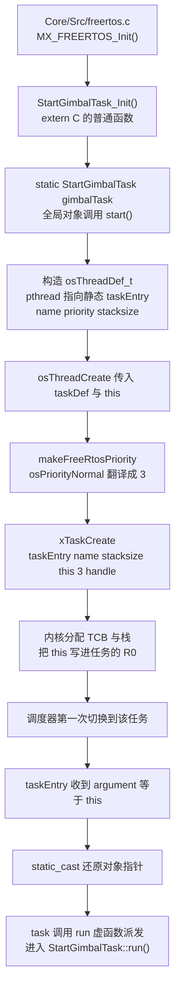
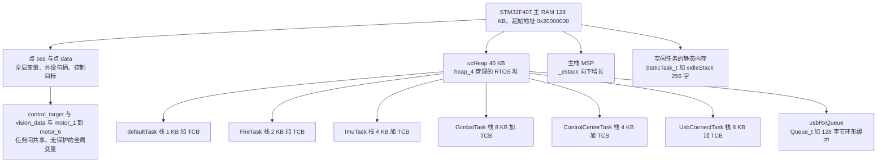

# 任务创建与栈分配

上一章讲过优先级的翻译，接下来处理三个更具体的问题：

1. 任务是 `xTaskCreate` 还是 `osThreadCreate` 创建的，两者差别在哪；
2. 任务逻辑写在 C++ 类的成员函数里，而 FreeRTOS 只接受 C 函数指针，中间如何衔接；
3. `2048` 这个栈参数是 2 KB 还是 8 KB，40 KB 的堆够不够。

## 1. 两条创建路径：原生 API 与 CMSIS 包装

FreeRTOS 原生接口是 `Middlewares/Third_Party/FreeRTOS/Source/include/task.h:330` 的：

```c
BaseType_t xTaskCreate( TaskFunction_t pxTaskCode,
                        const char * const pcName,
                        const configSTACK_DEPTH_TYPE usStackDepth,
                        void * const pvParameters,
                        UBaseType_t uxPriority,
                        TaskHandle_t * const pxCreatedTask );
```

它的返回值是 `pdPASS` 或 `errCOULD_NOT_ALLOCATE_REQUIRED_MEMORY`，失败不会触发断言，只返回错误码。堆不够是很现实的失败模式，这一点需要留意。文档里那行注释（`task.h:275-278`）如下：

> `usStackDepth` The size of the task stack specified as the number of variables the stack can hold - not the number of bytes. For example, if the stack is 16 bits wide and `usStackDepth` is defined as 100, 200 bytes will be allocated for stack storage.

我们用的是 ST 提供的 CMSIS-RTOS v1 包装层（`Source/CMSIS_RTOS/cmsis_os.c`），入口是 `osThreadCreate`。它需要先有一个“任务定义对象” `osThreadDef_t`，标准写法是宏（`cmsis_os.h:414-416`）：

```c
#if( configSUPPORT_STATIC_ALLOCATION == 1 )
#define osThreadDef(name, thread, priority, instances, stacksz)  \
const osThreadDef_t os_thread_def_##name = \
{ #name, (thread), (priority), (instances), (stacksz), NULL, NULL }
#endif
```

而 `osThreadCreate()` 的实现（`cmsis_os.c:202`）会根据 `buffer` 与 `controlblock` 是否为空，决定走静态还是动态分配：

```c
osThreadId osThreadCreate (const osThreadDef_t *thread_def, void *argument)
{
  TaskHandle_t handle;

#if( configSUPPORT_STATIC_ALLOCATION == 1 ) && ( configSUPPORT_DYNAMIC_ALLOCATION == 1 )
  if((thread_def->buffer != NULL) && (thread_def->controlblock != NULL)) {
    handle = xTaskCreateStatic((TaskFunction_t)thread_def->pthread, thread_def->name,
              thread_def->stacksize, argument, makeFreeRtosPriority(thread_def->tpriority),
              thread_def->buffer, thread_def->controlblock);
  }
  else {
    if (xTaskCreate((TaskFunction_t)thread_def->pthread, thread_def->name,
              thread_def->stacksize, argument, makeFreeRtosPriority(thread_def->tpriority),
              &handle) != pdPASS)  {
      return NULL;
    }
  }
#endif
  return handle;
}
```

我们两个开关都是 1（`FreeRTOSConfig.h:59-60`），而 `osThreadDef` 展开时把 `buffer` 与 `controlblock` 填成 `NULL`，所以云台板所有任务走动态分支 `xTaskCreate`，从 40 KB 堆里切内存。静态分配只被空闲任务使用（第 01 章第 5 节）。

### 1.1 对比表

| 维度 | `xTaskCreate`（原生） | `osThreadCreate`（CMSIS-RTOS v1） |
| --- | --- | --- |
| 头文件 | `task.h` | `cmsis_os.h` |
| 前置对象 | 无 | 需要 `osThreadDef_t`（宏 `osThreadDef` 或手工构造） |
| 优先级参数 | 整数 `0 ~ configMAX_PRIORITIES-1` | `osPriority` 枚举（会做 +3 翻译） |
| 栈参数含义 | word 数 | 注释写“bytes”，实际也是 word 数（见第 3 节） |
| 失败返回 | `pdPASS` 或 `errCOULD_NOT_ALLOCATE_REQUIRED_MEMORY` | `TaskHandle_t` 句柄，失败返回 `NULL` |
| 静态分配 | `xTaskCreateStatic`（需自备 `StaticTask_t` 与栈数组） | 同一个 `osThreadCreate`，靠 `buffer` 与 `controlblock` 切换 |
| 参数校验 | `configASSERT` | 无额外校验（参数原样转发） |
| 换内核 | 改代码 | 理论上不改代码（CMSIS 的卖点） |
| 本项目用法 | 没有直接用（只在内核内部） | `defaultTask` 用宏，其余 6 个用 `TaskBase` 手工构造 |

结论：CMSIS 包装的价值是“跨 RTOS 可移植”与“优先级语义统一”，代价是多一层间接，并且把“字节还是字”的歧义留给了注释。固件同时用两套写法，两套注意点都得知道。

## 2. `TaskBase`：用 `this` 指针加静态入口把成员函数变成任务

FreeRTOS 只接受 `void (*)(void *)` 这样的普通 C 函数指针。而任务逻辑是类成员函数 `StartGimbalTask::run()`，它是非静态成员函数：调用时需要一个隐含的 `this` 参数，类型也对不上。直接把 `&StartGimbalTask::run` 传给 `xTaskCreate` 编译都过不了。

`Task/TaskBase.h` 给出的解法是“静态入口加 `this` 指针作为任务参数”：

```cpp
// Task/TaskBase.h
#pragma once
#include "cmsis_os.h"

class TaskBase {
public:
    virtual ~TaskBase() = default;

    // 每个任务必须实现的函数，即逻辑部分
    virtual void run() = 0;

    // 启动任务，包装 osThreadCreate
    void start(char* name, uint32_t stackSize, osPriority priority) {
        osThreadDef_t taskDef = {};

        taskDef.name      = name;       // 任务名称
        taskDef.pthread   = taskEntry;  // 静态入口函数
        taskDef.tpriority = priority;   // 任务优先级
        taskDef.instances = 1;          // 任务实例数
        taskDef.stacksize = stackSize;  // 任务栈大小

        handle_ = osThreadCreate(&taskDef, this);  // this 指针传递给静态入口
    }

protected:
    osThreadId handle_ = nullptr;  // 保存 FreeRTOS 任务句柄

private:
    // 静态入口函数，实际调用对象的 run()
    static void taskEntry(void const* argument) {
        auto* task = static_cast<TaskBase*>(const_cast<void*>(argument));
        task->run();
    }
};
```

关键在四行：

- `taskDef.pthread = taskEntry;` 取的是静态成员函数的地址。静态成员函数没有 `this`，类型就是普通函数指针 `void (*)(void const*)`，能对上 `os_pthread`。
- `osThreadCreate(&taskDef, this)` 的第二个参数是 `void *argument`，塞进去的是这个任务对象自己的地址。
- `static_cast<TaskBase*>(const_cast<void*>(argument))` 把 `argument` 还原成对象指针。`const_cast` 是必需的，因为 FreeRTOS 的签名是 `void const *`。
- `task->run();` 通过虚函数表调用派生类的 `run()`。

调用链：



### 2.1 为什么不能直接把成员函数指针交出去

| 障碍 | 说明 |
| --- | --- |
| 类型不兼容 | 成员函数指针不是 `void*`，在 ARM EABI 上它可能是“函数地址加 this 调整量”的结构体 |
| 隐含参数 | 非静态成员函数第一个参数是隐含的 `this`，而 `xTaskCreate` 只会塞一个 `void*` |
| 需要在 C 上下文里调用 | 任务入口是内核从汇编里 `bx` 过去的，编译器没有机会补 `this` |
| C++ 对象生命周期 | 内核对任务函数的地址一无所知，只认函数指针的值 |

通用规律：任何“把 C++ 对象方法塞进 C 回调”的场合（FreeRTOS 任务、中断回调、pthread、GUI 事件），都是这个套路，即一个静态 trampoline 函数加一个 `void*` 上下文指针。名字叫 trampoline（蹦床），因为它跳到目标成员函数上。

### 2.2 三个实际问题

问题一：`osThreadDef_t taskDef = {};` 里的 `{}` 不能省。因为打开了 `configSUPPORT_STATIC_ALLOCATION`，结构体里有 `buffer` 与 `controlblock` 两个指针。如果写成 `osThreadDef_t taskDef;`，这两个字段就是栈上的垃圾值，`osThreadCreate()` 里那个 `if` 判断大概率成立，于是走到 `xTaskCreateStatic()` 并拿野指针当 TCB 和栈用，结果是随机的 HardFault。`TaskBase.h` 写的是 `= {}`，是对的。

问题二：任务对象必须一直存活。6 个任务的实例都是文件作用域的 `static` 全局对象：

```cpp
static StartGimbalTask gimbalTask;
void StartGimbalTask_Init() {
    gimbalTask.start((char*)"gimbalTask", 2048, osPriorityNormal);
}
```

如果哪天有人把它改成局部变量 `StartGimbalTask tmp; tmp.start(...);`，函数返回后对象就析构了，而内核对任务的调用还会继续，`task->run()` 会通过一个悬空的虚表指针调用，直接跑飞。

问题三：`start()` 不是虚函数，重复调用会创建多个任务。第二次 `start()` 会用新句柄覆盖 `handle_`，第一个任务从此失联，但还在跑。没有“同一个 `TaskBase` 只能启动一次”的保护。

### 2.3 `handle_` 存了但没人用

`TaskBase::start()` 把返回值存进了 `handle_`，可是整个项目没有任何地方用它，没有 `vTaskSuspend(handle_)`，也没有 `uxTaskGetStackHighWaterMark(handle_)`。这是第 05 章调试手段可以直接利用的点：把 `handle_` 暴露出来（比如加个 `getHandle()`），就能在运行时查这个任务的栈水位。


## 3. 栈的单位：word，不是 byte

`Middlewares/Third_Party/FreeRTOS/Source/portable/GCC/ARM_CM4F/portmacro.h:55`：

```c
typedef portSTACK_TYPE StackType_t;   /* portSTACK_TYPE 在 32 位 ARM 上是 uint32_t */
#define portSTACK_GROWTH  ( -1 )      /* 栈从高地址向低地址增长 */
```

所以 `StackType_t` 等于 `uint32_t`，4 字节，于是：

$$S_{bytes} = S_{words} \times \operatorname{sizeof}(StackType_t) = S_{words} \times 4$$

这里有一个文档问题需要注意：`CMSIS_RTOS/cmsis_os.h:285` 给 `osThreadDef_t` 的 `stacksize` 字段的注释写的是

```c
uint32_t  stacksize;   ///< stack size requirements in bytes; 0 is default stack size
```

“in bytes”是错的。`osThreadCreate()` 把这个值原样传给了 `xTaskCreate()` 的 `usStackDepth`，而后者按 `task.h` 的定义是 word 数。ST 的注释不能直接信，要顺着代码看它最终传给了谁。这类“包装层注释与实现不一致”的问题，正是读包装层源码与只读注释的差别。

固件里 6 个任务的栈占用如下：

| 任务类 | `start()` 里的 stackSize | 实际字节 | 调用点 | 备注 |
| --- | --- | --- | --- | --- |
| `StartControlCenterTask` | 1024 | 4 KB | `ControlCenterTask.cpp:149` | 200 Hz 控制目标 |
| `StartImuTask` | 1024 | 4 KB | `ImuTask.cpp:112` | AHRS 加 BMI088 |
| `StartGimbalTask` | 2048 | 8 KB | `GimbalTask.cpp:120` | 栈最大，因为局部 PID 对象多 |
| `StartFireTask` | 512 | 2 KB | `FireTask.cpp:217` | 最小的应用任务，但里面有 6 个 PID 对象 |
| `StartUsbConnectTask` | 2048 | 8 KB | `UsbConnectTask.cpp:118` | 协议帧结构体加 CDC 缓冲 |
| `StartTestTask` | 256 | 1 KB | `TestTask.cpp:31` | 未被创建 |
| `defaultTask` | 256 | 1 KB | `Core/Src/freertos.c:123` | CubeMX 启动任务 |
| IDLE | 256（`configMINIMAL_STACK_SIZE`） | 1 KB | 内核 | 静态内存，不占堆 |

已创建的任务（`defaultTask` 加 5 个应用任务）栈合计：

$$(256 + 1024 + 1024 + 2048 + 512 + 2048)\ \text{words} = 6912\ \text{words} = 27\,648\ \text{B} \approx 27\ \text{KB}$$

有个容易被忽略的点：每个任务的栈占用只申请不释放。任务全部是 `for(;;)` 死循环、从不退出，所以这 27 KB 在运行期恒定，`osDelay` 不会让它变小。


### 3.1 40 KB 的堆怎么分

`Core/Inc/FreeRTOSConfig.h:67`：

```c
#define configTOTAL_HEAP_SIZE                    ((size_t)40960)
```

`heap_4.c` 里它就是一个静态数组（`configAPPLICATION_ALLOCATED_HEAP` 未定义）：

```c
static uint8_t ucHeap[ configTOTAL_HEAP_SIZE ];
```

`ucHeap` 落在 `.bss` 段。链接脚本给 RAM 128 KB（`STM32F407XX_FLASH.ld:58`，起始 0x20000000），另外 CCM RAM 还有 64 KB。40 KB 的堆占了主 RAM 的三分之一，这个比例决定了还能不能再多开几个任务。

| 占用者 | 计算方式 | 估算大小 |
| --- | --- | --- |
| 6 个任务的栈（5 应用加 `defaultTask`） | `6912 words × 4` | 27 648 B |
| 6 个任务的 TCB | 每个约 84 B（按字段累加，含对齐） | 约 504 B |
| `usbRxQueue` | `Queue_t` 约 72 B 加 128 字节缓冲 | 约 200 B |
| 小计 | | 约 28.4 KB |
| heap_4 块头 | 每次分配多一个 8 字节 `BlockLink_t` | 约 64 B |
| 合计 | | 约 28.5 KB / 40 KB，占用率约 70%，余量约 11.5 KB |

这些数字的可靠程度不同，需要分清：

- 精确：栈占用（`stacksize × 4`，没有歧义）；heap_4 的块头（`xHeapStructSize` = 8 B，由 `sizeof(BlockLink_t) = 8` 与 `portBYTE_ALIGNMENT = 8` 决定）。
- 估算：TCB 约 84 B、`Queue_t` 约 72 B，按源码字段逐个累加得到，编译器的对齐与填充可能带来几字节差异。要确认真值，运行时调 `xPortGetFreeHeapSize()`（第 4.3 节），它返回当前剩余字节数。
- 完全没算：C 库 `malloc` 和 `printf` 若被使用，它们走的是另一套堆（`sysmem.c` 里的 `_sbrk` 加链接脚本的 `_Min_Heap_Size`），与本 RTOS 堆无关。

还有一个隐性风险：任务按顺序动态申请，堆不够时 `xTaskCreate` 会失败，而代码没有检查返回值（第 2 章的 `osThreadCreate` 在失败时返回 `NULL`，`TaskBase::start()` 只把它存进 `handle_`）。后果是某个任务静默地不存在，表现出来是某个功能整个不工作，却没有任何报错。所以余量必须留够。



## 4. 栈深度怎么估

栈不够不会报错，结果是踩掉相邻内存：FreeRTOS 的栈向下增长，溢出会写到栈底以下的地址，那里可能是另一个任务的 TCB、另一个任务的栈，或某个全局变量。症状千奇百怪：PID 突然输出乱值、队列莫名其妙满、HardFault 在毫不相干的地方。

所以栈大小需要估算，不能拍脑袋。一个任务的栈需求由六部分组成：

| 组成 | 量级 | 说明 |
| --- | --- | --- |
| 初始假栈帧 | 固定 16 words（64 B） | `pxPortInitialiseStack()` 预置的现场，见第 01 章第 5 节 |
| 函数调用链的返回地址与保存寄存器 | 每层 8 到 20 words | 每层调用至少压 LR；编译器觉得需要时还会压被调用者保存寄存器 |
| 局部变量 | 看代码 | 数组、结构体、浮点中间量都在这里，这是差异最大的部分 |
| 被调函数的栈帧 | 看库 | `sprintf` / `printf` 一类格式化函数动辄吃几百字节 |
| 中断嵌套 | 每次进入中断硬件压 8 words | Cortex-M 自动压 xPSR、PC、LR、R12、R3 到 R0 |
| FPU 惰性保存 | 额外 17 到 18 words | 见下面的说明 |

FPU 这件事需要单独说明：`FreeRTOSConfig.h:55` 写着 `configENABLE_FPU 0`，但这个宏是 CubeMX 生成的，对 `ARM_CM4F` 这个移植层不起作用（在 `port.c` 里搜索不到它）。实际情况是 `xPortStartScheduler()` 会调用 `vPortEnableVFP()` 打开协处理器访问，并设置 `portASPEN_AND_LSPEN_BITS` 打开“惰性保存”。于是只要任务里用到浮点，上下文切换时 FPU 寄存器（S0 到 S15 加 FPSCR 等，共 17 到 18 words）会被额外压进这个任务的栈。固件里的任务全是浮点运算，这笔开销是实打实的。

> 这一条需要在板子上自行确认：`configENABLE_FPU` 在 ST 的 `ARM_CM4F` 移植层里没有引用，
> 而 `port.c` 又无条件启用了 FPU。这个宏属于写了但没用的配置项，以 `port.c` 的实际行为为准。

### 4.1 用 `FireTask` 实战估一遍

`StartFireTask::run()`（`Task/Src/FireTask.cpp:22`）的局部对象最密集：

```cpp
SpeedPID motor_LEFT_PID (20.0f, 0.11f, 0.09f, 8000.0f, -8000.0f, 250.0f, -250.0f);
SpeedPID motor_RIGHT_PID(20.0f, 0.11f, 0.09f, 8000.0f, -8000.0f, 250.0f, -250.0f);
AnglePID motor_SUPPLY_ANGLE_PID(5.0f, 0.5f, 0.0f, 5000.0f, 3000.0f);
SpeedPID motor_SUPPLY_PID(30.0f, 0.5f, 0.0f, 30000.0f, -30000.0f, 2500.0f, -2500.0f);
SpeedPID diffPID(15.0f, 0.5f, 0.05f, 300.0f, -300.0f, 150.0f, -150.0f);
```

五个 PID 对象常驻在任务栈上（它们是局部变量，不在循环里重新构造）。假设每个 PID 对象含 8 到 12 个 `float` 成员，就是 32 到 48 字节，五个合计约 200 字节；再加上二十多个 `int32_t` / `float` 局部量、`HAL_GetTick()` 的调用链、以及 `SpeedPID::Calculate()` 内部的浮点中间量，粗算 300 到 500 字节。留给中断嵌套与 FPU 惰性保存的余量按 200 字节算：

$$S_{需要} \approx 500 + 200 = 700\ \text{B} < 512 \times 4 = 2048\ \text{B}$$

结论：`FireTask` 的 2 KB 目前够用，但它是全项目余量最小的应用任务，因为栈只有 512 words 而里面放了 5 个 PID 对象。如果以后往 `FireTask::run()` 里加一个 `char buf[512]` 之类的缓冲，就要立刻警惕。

### 4.2 三个看起来不占栈、实际占栈的写法

| 写法 | 为什么危险 |
| --- | --- |
| `printf` / `sprintf` | 格式化函数的栈帧很厚（几百字节），而且 `%f` 会拉进浮点格式化 |
| 大数组当局部变量 | `uint8_t buf[1024]` 直接吃 1 KB 栈，改成 `static` 或全局就换到 `.bss` 里 |
| 递归 | 深度不可预测，栈需求随输入变化，实时系统里应避免 |
| 按值传大结构体 | C++ 里形参按值传递会复制一份到栈上（改成 `const &` 就没了） |

顺带看一眼 `UsbConnectTask` 为什么给到 2048 words：它里面有 `USBProtocol::GimbalToVision` 这类协议结构体、`USBDecode usb_decoder` 的解析缓冲，还有 `CDC_Transmit_FS` 的调用链。栈是没法事后补的资源，一旦不够就是内存踩踏，不如一开始给宽一点。

### 4.3 验证手段

| 手段 | 需要什么 | 能看到什么 |
| --- | --- | --- |
| `xPortGetFreeHeapSize()` | `heap_4.c` 自带，无需配置 | 当前堆剩余字节数（判断还够开几个任务） |
| `uxTaskGetStackHighWaterMark(handle)` | 需要把 `INCLUDE_uxTaskGetStackHighWaterMark` 设成 1（目前是 0） | 该任务历史上栈最多用到哪里（单位 word） |
| 调试器直接看栈内存 | 一个能暂停的调试会话 | 栈底向下扫 `0xA5` 填充模式（需要先打开栈填充） |

后两个手段在当前配置下都用不了：`configCHECK_FOR_STACK_OVERFLOW` 是 0、`INCLUDE_uxTaskGetStackHighWaterMark` 是 0（`2026sentriomeni.ioc:95` 与 `:114` 都是 0），而 `tasks.c:86` 的栈填充 `memset` 被这个条件门控着：

```c
#if( ( configCHECK_FOR_STACK_OVERFLOW > 1 ) || ( configUSE_TRACE_FACILITY == 1 ) || \
     ( INCLUDE_uxTaskGetStackHighWaterMark == 1 ) || ( INCLUDE_uxTaskGetStackHighWaterMark2 == 1 ) )
    #define tskSET_NEW_STACKS_TO_KNOWN_VALUE 1
#else
    #define tskSET_NEW_STACKS_TO_KNOWN_VALUE 0
#endif
```

不开这些开关，栈就不会被填成 `0xA5`，也就无法用扫描填充值的方法测量水位。第 05 章的调试手段一节从这里开始。


## 5. 小结

### 核心概念

- 两条创建路径：`xTaskCreate` 是原生接口（栈参数明确是 word）；`osThreadCreate` 是 CMSIS-RTOS v1 包装，需要 `osThreadDef_t` 定义对象，并做优先级翻译（`+3`）。
- 我们两个分配开关都是 1，但 `osThreadDef` 宏把 `buffer` 与 `controlblock` 填成 `NULL`，所以全部任务走动态分配 `xTaskCreate`，从 40 KB 堆里切。
- `TaskBase` 用静态 trampoline（`taskEntry`）加 `this` 指针把 C++ 成员函数变成任务：`osThreadCreate(&taskDef, this)` 把对象地址作为 `argument` 传进去，入口里 `static_cast` 还原再调虚函数 `run()`。
- `osThreadDef_t taskDef = {}` 的 `{}` 不能省，否则 `buffer` 与 `controlblock` 是垃圾值，会误入静态分配分支。
- `StackType_t` = 4 字节，栈参数是 word 数。`cmsis_os.h:285` 写的 “in bytes” 是错的，实际字节数要乘 4。
- 栈需求由六部分组成：16 words 初始帧、调用链、局部变量、库函数栈帧、中断嵌套 8 words、FPU 惰性保存 17 到 18 words。
- 40 KB 堆里，已创建任务的栈占 27 648 B，加上 TCB 与队列后约 28.5 KB，占用率约 70%。
- 当前配置下既没有栈溢出检查（`configCHECK_FOR_STACK_OVERFLOW = 0`），也没有高水位接口（`INCLUDE_uxTaskGetStackHighWaterMark = 0`），所以栈水位无法测量。

### 设计权衡

| 选择 | 我们怎么选的 | 代价 / 收益 |
| --- | --- | --- |
| 创建 API | CMSIS 包装 | 优先级语义统一、便于换内核；代价是多一层间接，且注释与实现不一致 |
| C++ 任务封装 | 静态 trampoline 加 `this` | 逻辑可以写在类的成员函数里（能访问私有成员）；代价是对象必须永久存活 |
| 动态分配 | 全部任务动态 | 不写死内存、创建顺序灵活；代价是失败只能在运行时发现，且没有检查返回值 |
| 空闲任务 | 静态内存 | 不占堆；代价是要多写一个回调函数 |
| 栈大小 | 512 到 2048 words | 余量充足、不会踩内存；代价是约 70% 的堆被栈吃掉 |
| 栈检查 | 全关 | 省 RAM、省启动时间；代价是溢出时症状随机、几乎无法定位 |

## 6. 练习

基础题

1. 计算 `TaskBase::start(name, 2048, osPriorityNormal)` 实际申请的栈字节数，并说明按 `cmsis_os.h` 注释里的 “bytes” 理解会少算多少倍。
2. 说明把 `defaultTask` 的栈从 256 words 改成 128 words 的后果（提示：它只调一次 `MX_USB_DEVICE_Init()`，但那个调用链很深）。
3. 计算已创建任务的栈合计字节数与堆剩余量，并判断再加一个 1024 words 的任务是否还够。

挑战题

4. 写一个 `printTaskStack(TaskHandle_t h)`，用 `uxTaskGetStackHighWaterMark()` 打印某个任务的栈余量，并指出需要同时改哪些配置文件、返回值的单位是什么。
5. 在「不改动任何任务的 `run()` 实现」的前提下，设计一个“遍历所有 `TaskBase` 实例并打印句柄”的方案。（提示：静态成员列表加在构造函数里注册）
6. 现在 `ImuTask` 的栈是 1024 words，而它里面有 `FusionAHRS ahrs(1000.0f)` 这个全局静态对象（不在栈上）。通过阅读 `Task/Src/ImuTask.cpp` 与 `BSP` 目录下被它调用的函数，判断 4 KB 够不够，并给出估算依据。
7. 假设把 `configTOTAL_HEAP_SIZE` 减到 `20480`（20 KB），指出 `MX_FREERTOS_Init()` 里哪一个 `StartXxxTask_Init()` 会最先失败、失败后的现象，以及这个现象为什么比 HardFault 更难查。
