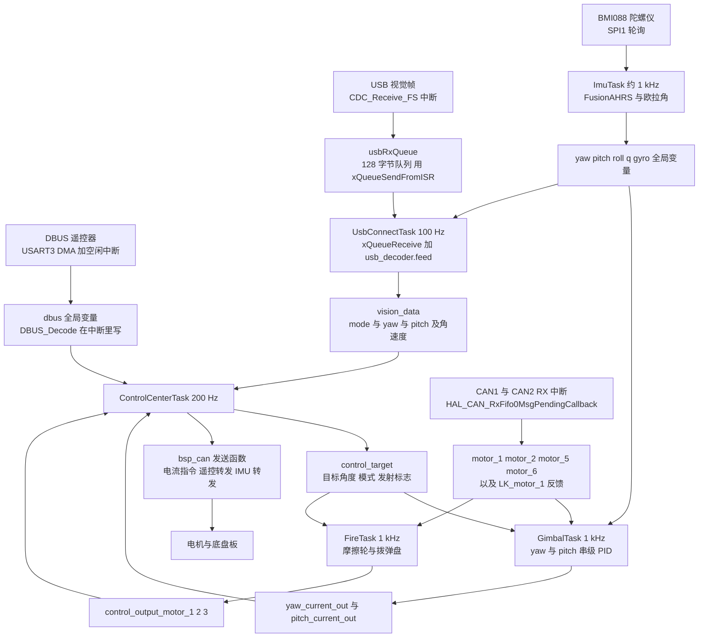
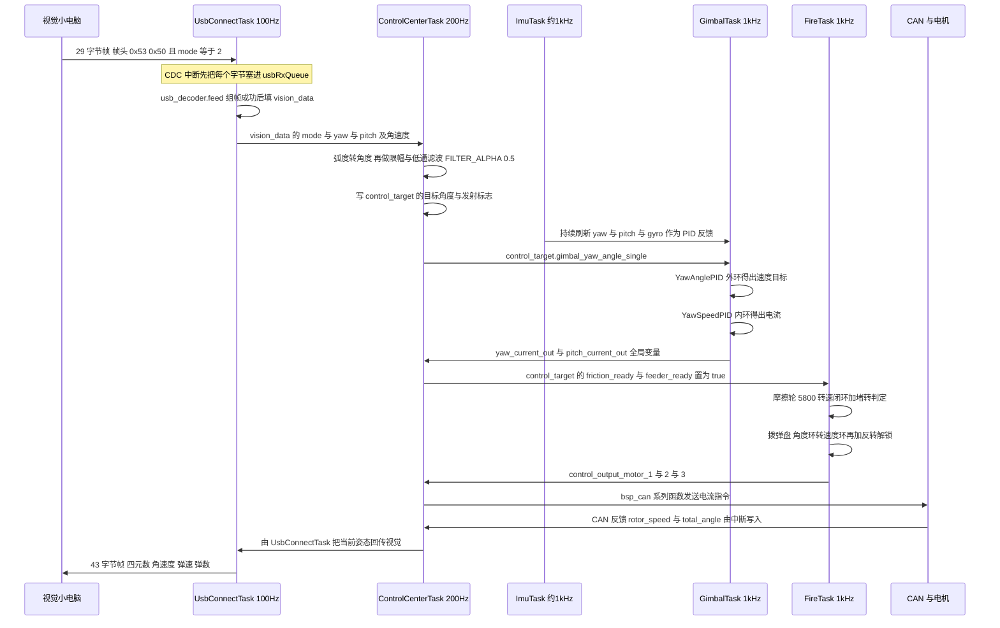

# 本项目任务划分

前三章讲的是 FreeRTOS 的工作方式，接下来回到工程本身：系统被切成了几块、为什么这么切、它们之间怎么交换数据。

任务划分的通用依据是三条：每个任务只等一件事，阻塞点尽量单一；周期由最紧的那条实时约束决定，而不是照抄别人的分法；任务之间只通过明确定义的数据对象交换。下面用本工程的分法作为例证。

云台板的应用任务全部写在 `Task/Src/*.cpp`，每个 `.cpp` 是一个 `TaskBase` 派生类，文件末尾还有一个 `extern "C"` 的 `StartXxxTask_Init()` 供 `Core/Src/freertos.c` 调用。

## 1. 六个任务是谁

`Core/Src/freertos.c` 的真实创建顺序：

```c
/* USER CODE BEGIN RTOS_THREADS */
StartFireTask_Init();
StartImuTask_Init();
StartGimbalTask_Init();
StartControlCenterTask_Init();
StartUsbConnectTask_Init();
//StartTestTask_Init();
/* USER CODE END RTOS_THREADS */
```

| 任务类 | 任务名字符串 | 优先级 | 栈 | 文件与调用点 | 职责 |
| --- | --- | --- | --- | --- | --- |
| `StartImuTask` | `imuTask` | `osPriorityNormal`（3） | 1024 words | `Task/Src/ImuTask.cpp` | 读 BMI088、跑 FusionAHRS、输出欧拉角与四元数 |
| `StartGimbalTask` | `gimbalTask` | 3 | 2048 words | `Task/Src/GimbalTask.cpp` | yaw 与 pitch 串级 PID，算出电机电流 |
| `StartFireTask` | `StartFireTask` | 3 | 512 words | `Task/Src/FireTask.cpp` | 摩擦轮转速环、拨弹盘角度 / 速度环与堵转反转 |
| `StartControlCenterTask` | `StartControlCenterTask` | 3 | 1024 words | `Task/Src/ControlCenterTask.cpp` | 读遥控器与视觉帧、维护 `control_target`、统一下发 CAN |
| `StartUsbConnectTask` | `StartUsbConnectTask` | 3 | 2048 words | `Task/Src/UsbConnectTask.cpp` | 与视觉小电脑收发协议帧 |
| `StartTestTask` | `TestTask` | 3 | 256 words | `Task/Src/TestTask.cpp` | 空循环，未被创建 |

加上内核与 CubeMX 的产物，运行时的任务清单是：

| 任务 | 优先级 | 来源 |
| --- | --- | --- |
| IDLE | 0 | 内核在 `osKernelStart()` 里创建，静态内存 |
| `defaultTask` | 3 | `Core/Src/freertos.c`，做 `MX_USB_DEVICE_Init()` 后空转 |
| 上面 5 个应用任务 | 3 | 应用层 |

所以“6 个任务”指源码层面的 6 个任务类，运行时是 7 个任务实例。这个区别在排查“任务数量不对”时很关键：用调试器看任务列表，看到的是 7 个。

## 2. 每个任务的真实周期

每个任务的循环体末尾都有一句延时，它决定了标称频率：

| 任务 | 循环末尾的延时 | 标称周期 | 标称频率 | 代码位置 |
| --- | --- | --- | --- | --- |
| `StartImuTask` | `DWT_Delay_ms(1)`（忙等） | 1 ms 加执行时间 | 约 1 kHz 偏慢 | `ImuTask.cpp` |
| `StartGimbalTask` | `osDelay(2)` | 2 ms 加执行时间 | 约 500 Hz | `GimbalTask.cpp` |
| `StartFireTask` | `osDelay(1)` | 1 ms 加执行时间 | 约 1 kHz 偏慢 | `FireTask.cpp` |
| `StartControlCenterTask` | `osDelay(1)` | 1 ms 加执行时间 | 约 1 kHz 偏慢 | `ControlCenterTask.cpp` |
| `StartUsbConnectTask` | `osDelay(10)` | 10 ms 加执行时间 | 约 100 Hz | `UsbConnectTask.cpp` |
| `defaultTask` | `osDelay(1)` | 1 ms | 1 kHz | `Core/Src/freertos.c` |

通用的周期公式是：

$$T_{loop} = T_{delay} + T_{exec}$$

$$f_{real} = \frac{1}{T_{delay} + T_{exec}} < f_{标称}$$

`osDelay(n)` 只保证至少 n 个 tick，不保证正好 n 个 tick：延时之外还有执行时间，任务被抢占时唤醒还会再晚一点。所以 1 kHz 任务实际跑成 950 Hz 是正常的，`osDelay` 不是周期定时器。想要严格周期必须用 `vTaskDelayUntil()`，而我们的 `INCLUDE_vTaskDelayUntil = 0`（`Core/Inc/FreeRTOSConfig.h`）根本没编进去。


> ### 关于“50 Hz 控制频率”的核对
>
> 两块板的源码里都没有找到 50 Hz（20 ms）的控制循环。实际周期是：云台 `ControlCenterTask` 1 ms（约 1 kHz）、
> `GimbalTask` 2 ms（500 Hz）、`FireTask` 1 ms、`UsbConnectTask` 10 ms（100 Hz）；底盘 `ChassisTask` 与 `ControlCenterTask`
> 都是 `osDelay(1)`（约 1 kHz）。
>
> 如果上层文档里出现“50 Hz 控制频率”，它大概指的是别的链路（某个外部设备的输出率、视觉端帧率，或者早期版本的参数），
> 本单元一律以源码为准。顺便把换算关系放在这里，方便日后核对：
>
> | 目标频率 | 周期 | 需要的 tick 数（1 tick = 1 ms） |
> | --- | --- | --- |
> | 50 Hz | 20 ms | 20 |
> | 100 Hz | 10 ms | 10（`UsbConnectTask` 就是这个） |
> | 200 Hz | 5 ms | 5 |
> | 500 Hz | 2 ms | 2（`GimbalTask` 就是这个） |
> | 1 kHz | 1 ms | 1（`FireTask` 与 `ControlCenterTask`） |
>
> 注意 `osDelay()` 的粒度就是 1 tick：50 Hz 用 `osDelay(20)` 是准的，但如果想要 3 kHz，1 ms 的 tick 根本表达不出来。

### 2.1 一个真实的内在不一致：`FireTask` 的 PID 周期

`GimbalTask` 很注意这件事（`Task/Src/GimbalTask.cpp`）：

```cpp
float dt = 0.001f; // 1ms控制周期
```

然后每一处 PID 调用都传 `dt`。但 `FireTask` 的循环是 `osDelay(1)`（1 ms），它调用 PID 时传的却是 `0.01f`（`Task/Src/FireTask.cpp` 等十余处）：

```cpp
control_output_motor_1 = feed_forward_left
                       + motor_LEFT_PID.Calculate(5800, motor_1.rotor_speed, 0.01f)
                       + diff_output;
```

`dt` 参与 PID 里的积分累加与微分计算：如果 PID 内部按 $I \mathrel{+}= e \cdot dt$ 实现，那么以 1 ms 的实际周期传入 0.01 s 的 `dt`，等效积分增益只有整定时假设的十分之一，微分项同样偏小。这不是崩溃级 bug，但意味着：

- `FireTask` 里那些“调好的” PID 参数，实际工作点与理论计算差了 10 倍；
- 将来改 `osDelay` 的值（比如从 1 改成 2）不会自动改变 `dt` 传参，两者从此彻底脱钩。

这类“参数与实际周期各说各话”的错位，是嵌入式控制代码里最常见也最难发现的问题，因为它在现象上只表现为“PID 有点软”。

### 2.2 `ImuTask` 的 1 kHz 是“忙等出来的”

`Task/Src/ImuTask.cpp` 的循环（省略细节）：

```cpp
for (;;) {
    BMI088_Read(gyro, accel, &temp);          // SPI 读传感器
    ImuTempControl_Update(45, temp, 0.001f);  // 温控到 45 摄氏度
    ahrs.update(gyro[0], gyro[1], gyro[2], accel[0], accel[1], accel[2]);
    q = ahrs.getQuaternion();
    // 四元数转欧拉角，写入 roll / pitch / yaw
    DWT_Delay_ms(1);                          // 1ms —— 这是忙等
}
```

`DWT_Delay_ms()` 的实现（`BSP/Src/bsp_dwt.cpp`）就是纯忙等：

```cpp
void DWT_Delay_ms(uint32_t ms)
{
    while (ms--)
        DWT_Delay_us(1000);
}

void DWT_Delay_us(uint32_t us)
{
    uint32_t start = DWT->CYCCNT;
    uint32_t cycles = (HAL_RCC_GetHCLKFreq() / 1000000) * us;
    while ((DWT->CYCCNT - start) < cycles);   // 空转，不让出 CPU
}
```

它做的事是读 DWT 周期计数器直到过了一毫秒，期间不调用任何 FreeRTOS API，因此任务不进入 Blocked，内核也没有机会把 CPU 让给别人。因为所有任务优先级都是 3（同优先级不抢占），这一毫秒只能靠时间片轮转来分，于是 `ImuTask` 实际吃掉了每个 tick 的很大一部分。

可行的写法是 `osDelay(1)`：它会调用 `vTaskDelay()` 把任务挂到延时链表上，让出 CPU 给同优先级的其他任务，1 ms 后由 tick 唤醒。唯一的代价是采样周期有 1 ms 的 tick 量化抖动，而 `FusionAHRS` 构造时写的是 `ahrs(1000.0f)`（`ImuTask.cpp`），换成 `osDelay(1)` 后平均频率会略低于 1000 Hz，融合的尺度参数应同步调整。


## 3. 数据流：谁生产、谁消费

整个固件的数据流是：中断负责收货，任务负责加工，`ControlCenterTask` 负责发货。



几个需要留意的点：

- `ImuTask` 是唯一的数据源：姿态、角速度、四元数都从它流向 `GimbalTask`（PID 反馈）、`UsbConnectTask`（发给视觉）、`ControlCenterTask`（转发给底盘）。
- `ControlCenterTask` 是唯一的 CAN 发送者：`bsp_can2_djimotorcmd`、`bsp_can1_djimotorcmdfive2eight`、`bsp_can1_lkmotortorquecmd`、`bsp_can1_sendremotecontrolcmd`、`bsp_can1_sendimudata`（`Task/Src/ControlCenterTask.cpp`）全部在这里。它是整条链路的瓶颈：它一慢，电机就收不到新电流。
- CAN 反馈在中断里写进 `motor_*`（`BSP/Src/bsp_can.cpp` 的 `HAL_CAN_RxFifo0MsgPendingCallback`），任务只读。这带来一个隐含假设：读一个 `int16_t` 是原子的。对 32 位 MCU 上按字对齐的 `int16_t` / `int32_t` 确实成立，但 `float` 与结构体整体赋值不成立（`vision_data` 有 7 个 `float` 成员，`ControlCenterTask` 可能读到半新半旧的一组值）。这是第 02 单元“同步与 IPC”的主战场。
- `ImuTask` 也参与发送：`GimbalTask.cpp` 每轮调用 `bsp_can1_lkreadstatus2()` 主动请求一次 LK 电机状态。也就是说 1 kHz 的 `GimbalTask` 每秒往 CAN 上发 1000 个请求帧。
- USB 回传走的是同一条任务：`UsbConnectTask` 一边收视觉帧，一边把当前四元数、角速度、弹速、弹数打包成 43 字节帧发回去（`Task/Src/UsbConnectTask.cpp`）。


## 4. 一次“自瞄开火”的完整时序

把上面所有箭头串起来，一次 `vision_data.mode == 2`（控制且开火）的处理过程是：



这条链路暴露了三个“跨任务耦合”：

1. `GimbalTask` 算出的电流，由 `ControlCenterTask` 发出去。两个任务必须都跑得动，缺一个电机就没有新指令。好处是发送时序集中可控，坏处是延迟叠加：`GimbalTask` 写完，等到 `ControlCenterTask` 下一次循环才发出去，最坏要等 5 ms。
2. `FireTask` 同理，它的三个电流输出也由 `ControlCenterTask` 发送。
3. `ControlCenterTask` 还负责模式判定（`dbus.s1` 决定 `MODE_RC` / `MODE_RC_follow` / `MODE_AI`，`vision_data.mode` 决定是否允许开火），所以它同时是人机逻辑与执行器的汇合点。

## 5. 依赖清单与风险

把任务之间的耦合关系列成表，方便日后加锁或拆分：

| 共享数据 | 生产者 | 消费者 | 风险 |
| --- | --- | --- | --- |
| `dbus`（遥控器通道） | USART3 中断（`DBUS_Decode`） | `ControlCenterTask` | 结构体多字节，读时可能被中断改 |
| `usbRxQueue` | USB 中断（`xQueueSendFromISR`） | `UsbConnectTask` | 全项目唯一做了同步的通道：队列自带临界区保护，满时丢字节 |
| `vision_data`（7 个 `float`） | `UsbConnectTask` | `ControlCenterTask` | 无保护，可能读到“半新半旧”的一组值 |
| `control_target`（结构体） | `ControlCenterTask` | `GimbalTask`、`FireTask` | 无保护，但只有一个写者，读侧容忍瞬时不一致 |
| `yaw` / `pitch` / `roll` / `gyro` | `ImuTask` | `GimbalTask`、`UsbConnectTask`、`ControlCenterTask` | `float` 赋值非原子，可能被抢占 |
| `q`（四元数，4 个 `float`） | `ImuTask` | `UsbConnectTask` | 同上，而且是 16 字节的整体读取 |
| `motor_1` 到 `motor_6` / `LK_motor_1` | CAN 中断 | `GimbalTask`、`FireTask` | 中断写、任务读，字段多为 `int16_t` / `int32_t` |
| `yaw_current_out` / `pitch_current_out` | `GimbalTask` | `ControlCenterTask` | `int16_t`，单次读写原子 |
| `control_output_motor_1` 到 `3` | `FireTask` | `ControlCenterTask` | `int`，单次读写原子 |
| `TotalAmmoShooted` / `AmmoSpeed` / `hot_17mm` | CAN 中断（裁判 / 底盘转发） | `FireTask`、`UsbConnectTask` | `AmmoSpeed` 是 `float`，由 `reinterpret_cast` 从字节拼出 |

只有 `usbRxQueue` 一条通道有正式的同步原语，其余全靠无保护的全局变量。这在功能上能跑，但一旦有人把某个任务提到不同优先级、或者把 `ControlCenterTask` 的 `osDelay` 改小，竞态窗口就会变大。第 02 单元会给出队列、信号量、互斥量三种改造方案。


## 6. 小结

### 核心概念

- 云台板源码里有 6 个任务类，运行时创建 5 个应用任务加 `defaultTask` 加 IDLE 共 7 个（`StartTestTask_Init()` 被注释掉）。
- 全部任务优先级都是 `osPriorityNormal`（翻译后是 3），没有分层。
- 真实周期：`ImuTask` 忙等约 1 kHz、`GimbalTask` 1 kHz、`FireTask` 1 kHz、`ControlCenterTask` 200 Hz、`UsbConnectTask` 100 Hz。
- `osDelay(n)` 只保证至少 n 个 tick，真实周期要加上执行时间：$f_{real} = 1/(T_{delay} + T_{exec})$。
- 源码里没有 50 Hz 循环；换算上 50 Hz 对应 `osDelay(20)`，而 `osDelay` 的粒度就是 1 tick。
- `FireTask` 的 PID 传入 `dt = 0.01f` 但循环是 1 ms，参数与实际周期脱钩 10 倍。
- `ImuTask` 用 `DWT_Delay_ms(1)` 忙等，不让出 CPU，是同优先级任务被拖慢的首要原因。
- 数据流骨架：中断收货 → 任务加工 → `ControlCenterTask` 统一发货（CAN）。算与发分离，代价是最坏 5 ms 的额外延迟。
- 任务间共享几乎全是无保护的全局变量，只有 `usbRxQueue` 一条通道有正式同步。

### 设计权衡

| 选择 | 我们怎么选的 | 代价 / 收益 |
| --- | --- | --- |
| 任务粒度 | 按“数据来源”切（IMU / USB / CAN 执行 / 人机） | 职责清晰、文件独立；代价是共享数据跨任务无保护 |
| 算与发分离 | PID 在 `GimbalTask` / `FireTask`，CAN 在 `ControlCenterTask` | 发送顺序集中、便于统一限幅；代价是额外 0 到 5 ms 延迟 |
| 周期实现 | 全部 `osDelay` | 简单、不易写错；代价是周期有抖动且不可精确控制 |
| IMU 采样 | DWT 忙等 | 采样间隔最均匀（不依赖 tick）；代价是独占 CPU 时间片 |
| 通信同步 | 只有 USB 用队列 | 其余零开销（单写者多读者）；代价是 `float` 与结构体存在竞态 |

## 7. 练习

基础题

1. 统计 `Core/Src/freertos.c` 里实际调用的 `StartXxxTask_Init()` 数量，再加上 `defaultTask` 与 IDLE，得出运行时的任务总数。
2. 已知 `ControlCenterTask` 的循环体执行时间是 1.5 ms，计算它的标称频率与真实频率。
3. 底盘板 `ChassisTask` 与 `ControlCenterTask` 都用了 `osDelay(1)`。计算标称频率，并与云台板的 `GimbalTask`（`osDelay(2)`）比较相差的倍数。

挑战题

4. 把 `ImuTask` 的 `DWT_Delay_ms(1)` 改成 `osDelay(1)`，说明：(a) 采样周期的变化；(b) `FusionAHRS` 构造函数里的 `1000.0f` 是否需要改；(c) 这个改动对 `GimbalTask` 的 PID 反馈的影响。
5. 说明把 `ControlCenterTask` 的 `osDelay(5)` 改成 `osDelay(1)` 的正面与负面效果（提示：它是唯一的 CAN 发送者）。
6. `vision_data` 有 7 个 `float` 成员，`ControlCenterTask` 一次要用到 `mode`、`yaw`、`pitch` 三个。设计一种“要么全读到新值、要么全读到旧值”的同步方案，并说明它给 `ControlCenterTask` 增加了多少延迟。
7. 画出「`ControlCenterTask` 卡住 100 ms」时的连锁反应：哪些数据会停止更新，哪些硬件会保持最后一次指令。
8. `GimbalTask` 每 1 ms 调一次 `bsp_can1_lkreadstatus2()`，也就是每秒 1000 个 CAN 请求帧。查阅 `BSP/Src/bsp_can.cpp` 里这个函数的实现，估算它对 CAN 总线带宽的占用，并讨论降到 100 Hz 是否可行。
