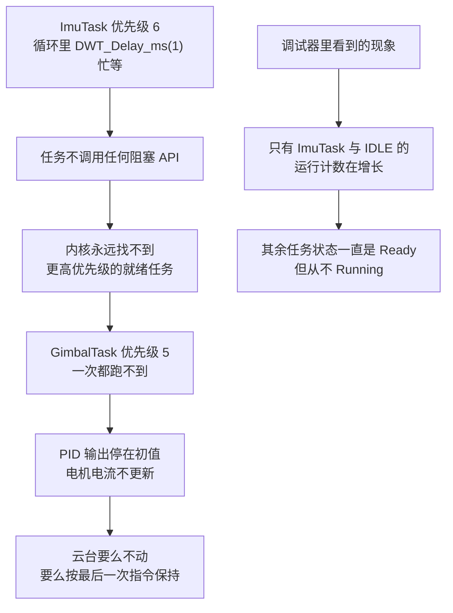
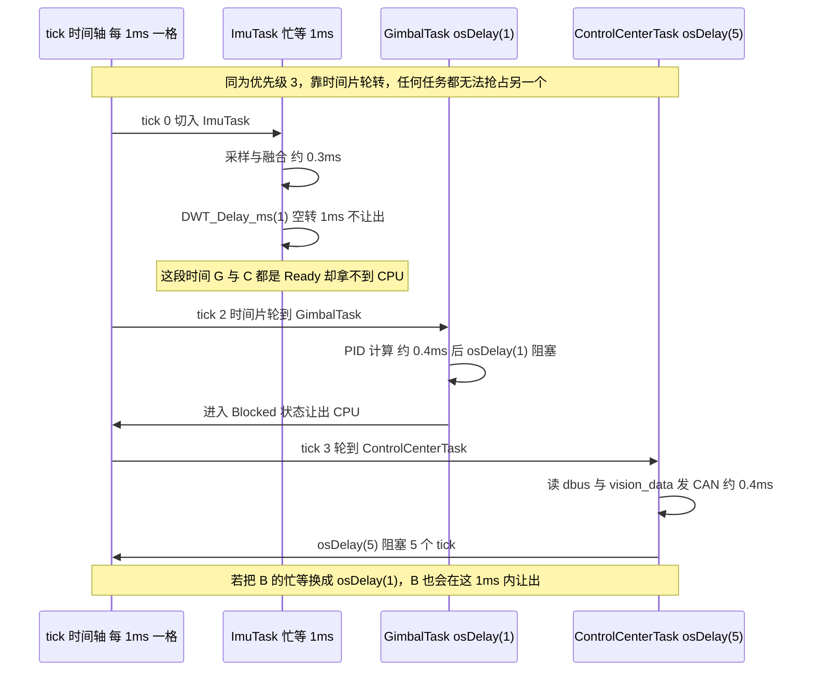
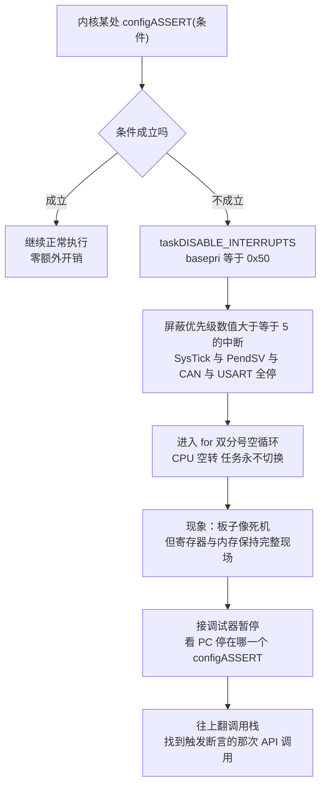

# 调度常见陷阱与调试

前四章讲的是怎么用，接下来讲怎么出错、怎么定位。五个易错点按从最常见到最隐蔽排序，每个都给出固件里的实际证据。

## 1. 陷阱一：优先级配错导致饿死

饿死（Starvation）指某个任务永远拿不到 CPU。在抢占式调度里，成因只有一个：有更高优先级（或同优先级但总不阻塞）的任务一直占着 CPU。

两个变体：

| 变体 | 成因 | 现象 |
| --- | --- | --- |
| 高优先级忙等 | 高优先级任务里死循环 / 忙等，从不阻塞 | 所有低优先级任务完全不跑 |
| 同优先级霸占 | 同优先级任务不阻塞，但时间片是 1 ms，其他任务还能跑 | 只表现为“变慢”，不表现为“死掉” |

`ImuTask` 目前属于第二种（优先级 3 加 `DWT_Delay_ms(1)` 忙等），所以系统还能跑，只是别的任务都被拖慢。但只要有人把它提到 `osPriorityRealtime`（6）而不改忙等，就会立刻变成第一种：



定位手段（本项目目前可用的很有限，见第 6 章）：

1. 在可疑任务的循环体里放一个 `volatile uint32_t counter;` 每次加一，用调试器看它是否增长，不增长就是被饿死；
2. 用 `uxTaskGetSystemState()` 或 `vTaskList()` 打印任务状态（需要打开 `configUSE_TRACE_FACILITY`，我们没有打开）；
3. 在 Debug 模式暂停，看 `pxCurrentTCB` 指向哪个任务，反复暂停几次；如果每次都停在同一处 `for(;;)`，基本可以定性。

一个反直觉但很常见的组合：任务优先级排了，但优先级数值最大的那个任务里有 `HAL_Delay()`。`HAL_Delay()` 忙等 `uwTick`，不让出 CPU，效果等同于最高优先级无限占 CPU，这是 STM32 项目里最典型的饿死源。

## 2. 陷阱二：忙等 vs `vTaskDelay`

第一章已经提过这个对比，这里把几种等 1 毫秒的写法列在一起：

| 写法 | 是否让出 CPU | 任务状态 | 周期精度 | 本项目可用性 |
| --- | --- | --- | --- | --- |
| `DWT_Delay_ms(1)` | 否（纯空转） | 一直 Running | 最精确（不依赖 tick） | `ImuTask` 正在用 |
| `osDelay(1)` | 是 | Running → Blocked → Ready | 1 tick 量化（1 ms） | 所有其他任务在用 |
| `vTaskDelayUntil(&t, 20)` | 是 | 同上 | 严格周期、不累积漂移 | 不可用：`INCLUDE_vTaskDelayUntil = 0` |
| `HAL_Delay(1)` | 否（忙等 `uwTick`） | 一直 Running | 差 | 任务里应该禁用 |

忙等代码的实际实现（`BSP/Src/bsp_dwt.cpp`）：

```cpp
void DWT_Delay_us(uint32_t us)
{
    uint32_t start = DWT->CYCCNT;
    uint32_t cycles = (HAL_RCC_GetHCLKFreq() / 1000000) * us;
    while ((DWT->CYCCNT - start) < cycles);   // 不让出 CPU
}
```

它的 CPU 代价可以直接算出来：若任务周期为 $T$，其中执行时间为 $T_{exec}$，等待时间为 $T_{wait}$，则

$$\text{CPU 占用率} = \frac{T_{exec} + T_{wait}^{忙等}}{T}
\qquad
\text{阻塞式等待的占用率} = \frac{T_{exec}}{T}$$

`ImuTask` 的 $T_{wait}$ 就是 1 ms，$T$ 也差不多是 1 ms 加 $T_{exec}$，也就是说它接近 100% 地占着一个时间片。换成 `osDelay(1)` 后，同一时间片就还给了 `GimbalTask` / `FireTask` / `ControlCenterTask`。

### 2.1 `vTaskDelayUntil` 不可用的后果：周期漂移

我们关掉了 `vTaskDelayUntil`（`Core/Inc/FreeRTOSConfig.h:90`，`INCLUDE_vTaskDelayUntil = 0`），`tasks.c:1255` 整个函数被 `#if` 掉，链接时根本不存在。于是所有任务只能用 `osDelay`，而 `osDelay` 的语义是从当前时刻再等 n 个 tick，不是从上一周期起点再等 n 个 tick。每轮都会累积一次执行时间：

$$T_{loop} = T_{delay} + T_{exec}
\qquad
\text{漂移率} = \frac{T_{exec}}{T_{delay} + T_{exec}}$$

举例：如果 `ControlCenterTask` 的执行时间是 0.4 ms，那么每轮实际周期是 5.4 ms，真实频率是 185 Hz 而不是 200 Hz，并且这个偏差永远不修正。对读遥控器、发 CAN 这类任务无所谓；但如果哪天要做精确 50 Hz 的定时上报，或者用 tick 累加积分做控制环，就必须先把 `INCLUDE_vTaskDelayUntil` 打开。



### 2.2 一个看起来像忙等、实际不是的写法

`UsbConnectTask` 里有一段（`Task/Src/UsbConnectTask.cpp:90`）：

```cpp
while (CDC_Transmit_FS(reinterpret_cast<uint8_t*>(&tx_pkt),
                       USBProtocol::GIMBAL_TO_VISION_LEN) == USBD_BUSY) {
    osDelay(5);
}
```

这不是忙等：每次失败都 `osDelay(5)` 让出 CPU，比 `while(!flag);` 好得多。但它有两个问题：

1. 延迟不可预测：USB 忙一次就多等 5 ms，最坏情况会把 100 Hz 的循环拖到 20 Hz；
2. 没有退出条件：如果 USB 一直忙（比如主机没在读），这个循环会把整个任务卡在这里，`osDelay(10)` 那句也执行不到，于是收视觉帧的 `xQueueReceive` 也停了。表现为视觉数据突然不再更新，而根因是发送侧卡住。

更稳的写法是给它加一个尝试次数上限，或者改成“发送失败就丢弃本帧、下一轮再传”。

## 3. 陷阱三：栈太小

栈溢出是嵌入式里最难定位的一类 bug，因为症状出现在别的地方：栈从高地址向低地址增长，溢出会写到栈底以下的地址，那里可能是另一个任务的 TCB、别人的栈，或者某个全局变量。

| 看到的症状 | 可能的原因 |
| --- | --- |
| HardFault 出现在毫不相干的函数里 | 某个任务栈溢出踩坏了返回地址 |
| 某个全局变量莫名其妙变了值 | 相邻任务的栈溢出写到了 `.bss` |
| PID 输出突然乱跳又自己好了 | 溢出只在高负载（深调用链）时发生 |
| 队列 `xQueueReceive` 返回错误数据 | 队列结构体被栈溢出踩了 |

### 3.1 我们当前根本测不到栈水位

三个开关的实际状态（`Core/Src/freertos.c` 与 `2026sentriomeni.ioc`）：

| 配置项 | 我们的值 | 影响 |
| --- | --- | --- |
| `configCHECK_FOR_STACK_OVERFLOW` | 0（`ioc:114`） | 不做栈溢出检测 |
| `INCLUDE_uxTaskGetStackHighWaterMark` | 0（`ioc:95`） | `uxTaskGetStackHighWaterMark()` 没编进去 |
| `configUSE_TRACE_FACILITY` | 0（`ioc:145`） | 没有 `vTaskList()` / `uxTaskGetSystemState()` |

更关键的是栈不会被填成已知值，所以连用调试器扫内存这条办法也失效了（`tasks.c:86`）：

```c
#if( ( configCHECK_FOR_STACK_OVERFLOW > 1 ) || ( configUSE_TRACE_FACILITY == 1 ) || \
     ( INCLUDE_uxTaskGetStackHighWaterMark == 1 ) || ( INCLUDE_uxTaskGetStackHighWaterMark2 == 1 ) )
    #define tskSET_NEW_STACKS_TO_KNOWN_VALUE 1
#else
    #define tskSET_NEW_STACKS_TO_KNOWN_VALUE 0
#endif
```

只有 `tskSET_NEW_STACKS_TO_KNOWN_VALUE` 是 1，`prvInitialiseNewTask()` 里那句 `memset(pxNewTCB->pxStack, 0xA5, ...)` 才会执行（`tasks.c:854`）。它是 `prvTaskCheckFreeStackSpace()` 测量的前提：那个函数从栈底往上数还是不是 `0xA5`，数出来就是历史最少剩余空间。

结论：现在的固件既不检查栈溢出，也测不到水位。要查栈，必须先改配置。


### 3.2 怎么把它打开，怎么读返回值

打开方式（二选一，不要两边都改）：

- 推荐：改 `2026sentriomeni.ioc` 里的 `FREERTOS.INCLUDE_uxTaskGetStackHighWaterMark=1` 与 `FREERTOS.configCHECK_FOR_STACK_OVERFLOW=2`，用 CubeMX 重新生成，这样以后重新生成代码不会把手改覆盖掉；
- 临时：直接在 `Core/Inc/FreeRTOSConfig.h` 的 `USER CODE` 区里补 `#define`，但下次 CubeMX 生成时要小心丢失。

打开后 `uxTaskGetStackHighWaterMark(handle)` 的返回值单位是 word（不是字节），含义是该任务从创建到现在栈最少还剩多少空闲 word。它是历史最小值，返回值越大越安全。

```c
/* 需要 INCLUDE_uxTaskGetStackHighWaterMark = 1 */
#include "task.h"

void report_stack(const char *name, TaskHandle_t h)
{
    UBaseType_t left = uxTaskGetStackHighWaterMark(h);   /* 单位：word */
    /* 用 UART / RTT 输出，注意别用 printf 加重本任务栈负担 */
    debug_printf("%-22s 剩余 %u words (%u bytes)\r\n",
                 name, (unsigned)left, (unsigned)(left * 4));
}
```

判断标准（经验值，不是硬规定）：

| 剩余水位 | 判断 |
| --- | --- |
| 大于总栈的 50% | 明显给多了，可以往下调 |
| 20% 到 50% | 健康 |
| 小于 20% | 危险，尤其是调用链会随输入变深的场合 |
| 0 或个位数 | 已经贴底，随时可能溢出 |

以 `FireTask` 为例：总栈 512 words，如果高水位显示只剩 60 words（不到 12%），那就必须加大，它里面有 5 个常驻的 PID 对象（见第 03 单元第 4.1 节）。改的办法很简单：`fireTask.start((char*)"StartFireTask", 1024, osPriorityNormal);` 把 512 改成 1024，代价只是堆里多花 2 KB。

### 3.3 一个现成的反面教材

底盘板 `2026OmniSentryChassis` 的 `Task/Src/TestTask.cpp:31` 写着：

```c
testTask.start((char*)"TestTask", 0, osPriorityNormal);   /* 栈大小 0！ */
```

栈大小传 0 的后果不可预测：`xTaskCreate` 并不会校验它，`prvInitialiseNewTask()` 会算出 `pxStack[-1]` 这样的栈顶，之后每次压栈都在写别的内存。目前这段代码没被调用（`StartTestTask_Init()` 在两个板子的 `freertos.c` 里都注释掉了），所以暂时无害，但这是一个随时会被启用的隐患。这也说明栈大小参数没有合法性检查，改动时需要注意。

## 4. 陷阱四：在中断里用错 API

规则：中断服务函数里只能调用名字以 `...FromISR()` 结尾的 FreeRTOS API，并且中断的优先级数值必须不小于 `configLIBRARY_MAX_SYSCALL_INTERRUPT_PRIORITY`。

我们的配置是（`Core/Inc/FreeRTOSConfig.h:110`）：

```c
#define configLIBRARY_MAX_SYSCALL_INTERRUPT_PRIORITY 5
```

而所有外设中断都恰好设成了 5：CAN1 / CAN2 的 RX0 与 RX1（`Core/Src/can.c`）、五个 DMA 流（`Core/Src/dma.c`）、USART3 与 USART6（`Core/Src/usart.c`）、USB OTG FS（`USB_DEVICE/Target/usbd_conf.c`）、TIM1_UP_TIM10（`Core/Src/tim.c`）。

5 这个数字刚好合法：规则要求中断优先级数值大于等于 5（数值越大越不紧急），5 满足；如果把它改成 4（更紧急），FreeRTOS 就会在调用 `xQueueSendFromISR` 时命中断言（`port.c` 的 `vPortValidateInterruptPriority()`）：

```c
configASSERT( ucCurrentPriority >= ucMaxSysCallPriority );
```

必须这样限制的原因：内核保护临界区的手段是把 `basepri` 设成 `configMAX_SYSCALL_INTERRUPT_PRIORITY`（=`5 << 4`=0x50）。数值比 5 更小的中断不受 `basepri` 屏蔽，它们可以在内核修改链表的过程中插进来，把链表改坏。

### 4.1 固件里做对的地方

USB 中断里的 `CDC_Receive_FS()`（`USB_DEVICE/App/usbd_cdc_if.c`）是标准写法：

```c
static int8_t CDC_Receive_FS(uint8_t* Buf, uint32_t *Len)
{
  BaseType_t xHigherPriorityTaskWoken = pdFALSE;

  if (usbRxQueue == NULL) {
    goto exit;    // 安全，避免先初始化 usbRxQueue 而不是 freertos
  }

  for (uint32_t i = 0; i < *Len; i++) {
    if (xQueueSendFromISR(usbRxQueue, &Buf[i], &xHigherPriorityTaskWoken) != pdPASS) {}
    // 队列满丢弃
  }

exit:
  USBD_CDC_SetRxBuffer(&hUsbDeviceFS, Buf);
  USBD_CDC_ReceivePacket(&hUsbDeviceFS);
  portYIELD_FROM_ISR(xHigherPriorityTaskWoken);   // 让高优先级任务立刻跑
  return USBD_OK;
}
```

三个正确点：用了 `xQueueSendFromISR`；把 `xHigherPriorityTaskWoken` 交给了 `portYIELD_FROM_ISR`；并且在队列还没创建时先做了 NULL 检查（`MX_FREERTOS_Init()` 之前 USB 中断就可能来）。

### 4.2 一个实际隐患：队列满时丢字节

`usbRxQueue = xQueueCreate(128, sizeof(uint8_t))` 是 `uint8_t` 粒度的队列，容量 128 字节。而视觉帧是 29 字节。问题在于：

- 入队是逐字节 `xQueueSendFromISR`，满了就丢；
- 出队也是逐字节 `xQueueReceive(usbRxQueue, &byte, 0)` 直到空（`UsbConnectTask.cpp:48`）；
- 一旦丢了一个字节，整帧 CRC 就废了，协议必须能重新同步（找 `0x53 0x50` 帧头）。

如果视觉端以 100 Hz 发 29 字节帧，就是 2900 字节每秒；而 `UsbConnectTask` 每 10 ms 才取一次队列，两次取之间最多进来 29 字节，128 字节的缓冲是够的。但如果哪天视觉端提速到 500 Hz，队列就会周期性溢出。判断方法：在丢包分支里加一个计数器，看它是否增长，目前那里是空的 `{}`：

```c
if (xQueueSendFromISR(usbRxQueue, &Buf[i], &xHigherPriorityTaskWoken) != pdPASS) {} // 队列满丢弃
```

这是一个留了空位但没填的调试钩子，建议填上 `drop_count++`。

### 4.3 ISR 安全 API 速查

| 想做的事 | 任务里用 | 中断里用 |
| --- | --- | --- |
| 队列发 / 收 | `xQueueSend` / `xQueueReceive` | `xQueueSendFromISR` / `xQueueReceiveFromISR` |
| 释放信号量 | `xSemaphoreGive` | `xSemaphoreGiveFromISR` |
| 唤醒任务 | `vTaskResume` | `xTaskResumeFromISR`（需要 `INCLUDE_xTaskResumeFromISR = 1`，我们已开） |
| 延时 | `osDelay` / `vTaskDelay` | 绝对不能调用 |
| 创建删除对象 | `xTaskCreate` / `vQueueDelete` | 绝对不能调用 |
| 取 tick | `xTaskGetTickCount` | `xTaskGetTickCountFromISR` |
| 让出 CPU | `taskYIELD()` | `portYIELD_FROM_ISR(x)` |


## 5. 陷阱五：`configASSERT` 命中后进入死循环

`Core/Inc/FreeRTOSConfig.h:122` 只有一行，但它决定了程序出错时的表现：

```c
#define configASSERT( x ) if ((x) == 0) {taskDISABLE_INTERRUPTS(); for( ;; );}
```

内核里遍布 `configASSERT(pxQueue)`、`configASSERT(uxPriority < configMAX_PRIORITIES)` 这样的检查。任何一条不成立，执行流就进入这个 `for(;;)` 空循环：板子看起来死了，实际是停在原地等待排查。

逐段拆开看：

| 片段 | 实际动作 | 后果 |
| --- | --- | --- |
| `if ((x) == 0)` | 条件不成立就无事发生 | 断言是零成本的（除非开了额外的优先级校验） |
| `taskDISABLE_INTERRUPTS()` | 把 `basepri` 写成 `configMAX_SYSCALL_INTERRUPT_PRIORITY`（0x50） | 屏蔽所有优先级数值大于等于 5 的中断 |
| `for( ;; );` | 空循环，永不退出 | CPU 100% 空转，任务全部停摆 |

关键在第二行：`basepri = 0x50` 只屏蔽不紧急的中断。SysTick 与 PendSV 的优先级是 15（最不紧急），它们会被屏蔽掉，于是

$$\text{tick 停止} \Rightarrow xTickCount\ \text{不再增长} \Rightarrow \text{所有延时永不结束} \Rightarrow \text{任务全部停摆}$$

而 CAN、USART、DMA 这些优先级为 5 的中断也被屏蔽了，所以连串口还在刷数据这种假活现象都不会有，整个系统完全静止。数值小于 5 的中断（我们没有）仍然会进来，这是设计上的取舍：宁可牺牲实时性，也要保证现场不被继续破坏。



### 5.1 不用 `assert()`、也不复位的原因

| 方案 | 好处 | 为什么没选 |
| --- | --- | --- |
| `assert()` + `assert_failed()` | 标准、可打印文件名行号 | 依赖 `newlib` 与 `assert.h`，嵌入式里 `printf` 又会加重栈负担；CubeMX 默认不启用 `USE_FULL_ASSERT` |
| 直接复位（`NVIC_SystemReset()`） | 自恢复 | 现场全丢，而且如果是必现的逻辑错误会无限重启，更难查 |
| 死循环加屏蔽中断（我们选的） | 现场完整保留，调试器一挂就能看；不会因看门狗外的干扰继续跑 | 板子必须人工介入；如果没接调试器，就等于永久死机 |

对比赛用板来说这个取舍是合适的：赛场上板子不动了，操作者会立即接调试器；而在实验室里，它避免了重启后现象消失的尴尬。

### 5.2 命中后怎么定位

1. 暂停并看 PC：`for(;;)` 是紧挨着的一句，`PC` 一定落在 `configASSERT` 展开的位置附近；调试器通常显示为所在函数名（例如 `xQueueGenericCreate` 或 `vTaskPrioritySet`）。
2. 往上翻调用栈：即使编译优化把部分栈帧吃掉了，通常还能看到调用者的名字。断言所在函数的名字已经能定位大半问题（例如在 `xTaskCreate` 里断言，那多半是栈大小或优先级参数非法）。
3. 看参数：在栈帧里找到传进该函数的实参，比对 §5.3 的表格。
4. 如果栈帧被优化掉了：把出问题的模块单独用 `-O0` 编译，或者把 `for( ;; );` 改成 `while (1) { __asm volatile("nop"); }` 避免不可达代码被折叠。

### 5.3 本项目最容易命中的断言清单

| 断言位置 | 触发条件 | 我们项目里怎么会犯 |
| --- | --- | --- |
| `vTaskPrioritySet` / `xTaskCreate` 里 `uxPriority < configMAX_PRIORITIES` | 优先级数值越界 | 用 `osPriorityRealtime`（翻译成 6）而 `configMAX_PRIORITIES` 被改小 |
| `vPortValidateInterruptPriority` 里 `ucCurrentPriority >= ucMaxSysCallPriority` | 在高优先级中断里调用了 `xxxFromISR()` | 把某个中断优先级从 5 改成 4 却仍在里面发队列 |
| `xQueueGenericCreate` 里 `configASSERT( ( uxItemSize * uxQueueLength ) ... )` | 队列申请的内存算不出来 | `xQueueCreate(128, sizeof(uint8_t))` 本身正常，但如果长度乘元素大小溢出就会有 |
| `prvInitialiseNewTask` 里 `configASSERT( pxTopOfStack 对齐 )` | 栈顶地址未按 8 字节对齐 | 手工传了一个奇怪的栈数组地址（我们用动态分配，不会遇到） |
| `vTaskStartScheduler` / `xPortStartScheduler` 里 `configASSERT( configMAX_SYSCALL_INTERRUPT_PRIORITY )` | 该宏被设成 0 | 抄配置时改错 |
| `pvPortMalloc` 里 `configASSERT( ( xWantedSize & xBlockAllocatedBit ) == 0 )` | 申请大小超过堆容量的一半 | `configTOTAL_HEAP_SIZE` 被改小之后 |

### 5.4 这行宏本身的一个瑕疵：没有 `do { } while(0)`

标准写法是把多语句宏包起来：

```c
#define configASSERT( x ) do { if ((x) == 0) { taskDISABLE_INTERRUPTS(); for(;;); } } while (0)
```

而我们的写法就是一个单独的 `if`。后果是悬空 else（dangling else）：如果内核里有 `if (a) configASSERT(b); else do_something();`，展开后 `else` 会绑定到 `configASSERT` 里的 `if` 上，逻辑静默改变。FreeRTOS 官方文档里给的默认写法恰好也是单独的 `if`，官方内核代码里避开了这种用法，所以实践中没出问题；但知道这个隐患存在，就不至于在将来自己写的代码里遇到。

## 6. 调试工具箱

把前面提到的手段汇总成一张表，标清现在能不能用：

| 手段 | 需要的配置 | 能看到什么 | 本项目当前状态 |
| --- | --- | --- | --- |
| `xPortGetFreeHeapSize()` | 无（`heap_4.c` 自带） | 堆剩余字节数 | 可用（直接在调试器 Watch 里调） |
| `xPortGetMinimumEverFreeHeapSize()` | 无 | 历史最少剩余堆 | 可用 |
| `uxTaskGetStackHighWaterMark(h)` | `INCLUDE_uxTaskGetStackHighWaterMark = 1` | 任务栈历史最少剩余（word） | 不可用，需改配置 |
| `configCHECK_FOR_STACK_OVERFLOW = 2` | 同左（并需实现 `vApplicationStackOverflowHook`） | 溢出瞬间就把系统停住 | 不可用，需改配置 |
| `vApplicationMallocFailedHook` | `configUSE_MALLOC_FAILED_HOOK = 1` | 堆耗尽时立即停住 | 不可用（`ioc:134` 为 0） |
| `vTaskList(buf)` | `configUSE_TRACE_FACILITY = 1` 与 `configUSE_STATS_FORMATTING_FUNCTIONS = 1` | 每个任务的状态、优先级、栈水位 | 不可用 |
| `uxTaskGetSystemState()` | `configUSE_TRACE_FACILITY = 1` | 任务状态数组（可自己格式化） | 不可用 |
| 运行时间统计（CPU 占用率） | `configGENERATE_RUN_TIME_STATS = 1` 加两个回调 | 每个任务吃了多少 CPU | 不可用 |
| `uxTaskGetTickCount()` | 无 | 当前 tick（ms） | 可用 |
| `eTaskGetState(h)` / `uxTaskPriorityGet(h)` | 后者需要 `INCLUDE_uxTaskPriorityGet = 1`（已开） | 任务状态 / 优先级 | 部分可用（`INCLUDE_eTaskGetState = 0`） |
| 调试器看 `pxCurrentTCB` | 无 | 当前在跑哪个任务 | 可用（最好装 FreeRTOS 的调试器插件，能直接显示任务列表） |
| `volatile` 计数器 | 无 | 某段代码到底跑没跑 | 可用，简单但有效 |

### 6.1 给这个项目的最小改动建议

为了在不破坏 CubeMX 工作流的前提下打开调试能力，只需改 `.ioc` 里这几行然后重新生成：

```bash
FREERTOS.INCLUDE_uxTaskGetStackHighWaterMark=1
FREERTOS.configCHECK_FOR_STACK_OVERFLOW=2
FREERTOS.configUSE_TRACE_FACILITY=1
FREERTOS.configUSE_STATS_FORMATTING_FUNCTIONS=1
FREERTOS.configUSE_MALLOC_FAILED_HOOK=1
```

代价是 Flash 与 RAM 用量增加几 KB、每 tick 多一点点检查开销；收益是所有偶发随机 HardFault 都能变成明确的一次停住加一个任务名。另外需要注意：栈填充（`0xA5`）只有在这些开关打开后才会发生，而且已经在运行的任务栈会被重新填成 0xA5，所以要在开发阶段就打开，不要等出了问题再打开（那时历史水位已经没意义）。

### 6.2 顺序：先量，再改

一个实用顺序：

1. 打开高水位与栈检查，跑一遍典型工况（遥控、自瞄、连续发射）；
2. 打印 `uxTaskGetStackHighWaterMark`，把栈余量小于 20% 的任务加大；
3. 用 `xPortGetFreeHeapSize()` 确认堆还有余量；
4. 打印任务列表，确认没有任务长期处于 Ready 却从不 Running（饿死）；
5. 这时才可以考虑动优先级，并且要同时消除忙等。


## 7. 小结

### 五个易错点速查

| 易错点 | 根因 | 症状 | 抓法 |
| --- | --- | --- | --- |
| 优先级配错导致饿死 | 高优先级任务不阻塞（忙等） | 低优先级任务完全不跑 | `volatile` 计数器不增长；`pxCurrentTCB` 反复停在同处 |
| 忙等 vs 阻塞 | 用 `DWT_Delay_ms` / `HAL_Delay` 代替 `osDelay` | 同优先级任务被拖慢、CPU 占用接近 100% | 搜代码里的 `Delay`；算 $T_{wait}/T$ |
| 栈太小 | 栈参数拍脑袋，且检查全关 | 随机 HardFault、全局变量被踩 | 打开高水位与栈检查；看 `uxTaskGetStackHighWaterMark` |
| 中断里用错 API | 用了非 `FromISR` 版本，或中断优先级数值小于 5 | 断言停住 / 链表被改坏 | 检查中断优先级与 API 后缀 |
| `configASSERT` 死循环 | 断言不成立后 `basepri = 0x50` 加 `for(;;)` | 板子完全静止但不复位 | 接调试器看 PC 与调用栈 |

### 核心概念

- 饿死的唯一成因是有任务一直占着 CPU，优先级写反不会直接导致饿死；优先级只决定谁先跑，不保证谁能跑。
- `osDelay(n)` 只保证至少 n 个 tick，真实周期是 $T_{delay} + T_{exec}$，且会累积漂移；`vTaskDelayUntil` 才能做严格周期，而我们把它关掉了。
- 忙等的代价可以量化：CPU 占用率从 $T_{exec}/T$ 上升到 $(T_{exec}+T_{wait})/T$。
- 栈溢出会踩别处的内存，症状随机；要测栈必须先打开 `INCLUDE_uxTaskGetStackHighWaterMark` 或 `configCHECK_FOR_STACK_OVERFLOW`（否则连 `0xA5` 填充都不会发生）。
- ISR 里只能用 `...FromISR()` 系列，且中断优先级数值必须大于等于 `configLIBRARY_MAX_SYSCALL_INTERRUPT_PRIORITY`（我们是 5，所有外设中断都卡在 5）。
- `configASSERT` 展开成关可屏蔽中断加死循环，保留现场、牺牲自动恢复；tick 被屏蔽所以整个系统静止。

### 设计权衡

| 选择 | 我们怎么选的 | 代价 / 收益 |
| --- | --- | --- |
| 断言行为 | 死循环加屏蔽中断 | 现场完整、便于调试；代价是没接调试器就等于死机 |
| 栈检查 | 全关 | 省 Flash / RAM 与启动时间；代价是栈问题无法定位 |
| 周期实现 | 只用 `osDelay` | 简单；代价是漂移不可控 |
| IMU 采样延时 | DWT 忙等 | 采样间隔均匀；代价是独占时间片 |
| USB 队列 | 逐字节 `uint8_t` 队列加丢弃 | 实现简单、无需重同步；代价是丢一个字节废一帧，且丢弃计数还是空的 |
| 中断优先级 | 统一 5 | 与 FreeRTOS 规则刚好兼容；代价是任何一次提优先级都可能命中断言 |

## 8. 练习

基础题

1. 一个任务循环体执行 0.6 ms，末尾 `osDelay(2)`。计算它的真实周期、真实频率与漂移率。
2. `configASSERT` 命中后，串口调试输出也会一起停掉。说明原因（提示：看 `basepri` 被设成了多少，以及 USART 中断的优先级）。
3. 已知 `xPortGetFreeHeapSize()` 返回 11 000 字节，判断还能不能再开一个 1024 words 的任务（提示：别忘了一个 TCB 的开销）。

挑战题

4. 给 `ImuTask` 的忙等写一个改动最小的替代方案：不用 `osDelay`，但仍要让出 CPU，并且保持采样间隔尽量均匀。（提示：`vTaskDelayUntil` 不可用的情况下，`xTaskDelayUntil` 也不存在；考虑 `taskYIELD()` 或者把 DWT 忙等改成分片的短忙等加 `osDelay(1)`）
5. 把 `configCHECK_FOR_STACK_OVERFLOW` 设为 2，并实现 `vApplicationStackOverflowHook(TaskHandle_t, char*)`，要求：不用 `printf`（栈不够）、直接点亮一个 LED 并记录任务名到全局变量。写完之后说明为什么这个 Hook 里不能调用任何可能阻塞的 API。
6. 假设 `ControlCenterTask` 在高负载下偶尔读到 `vision_data` 的 `mode` 是新值而 `yaw` 是旧值，导致云台突然转向一个错误的绝对角度。设计三种修复方案（从代价最低到最高），并说明各自的延迟代价。
7. 把 `INCLUDE_vTaskDelayUntil` 打开，并把 `GimbalTask` 的 `osDelay(1)` 改成 `vTaskDelayUntil(&last, 1)`。说明这样做的好处，以及为什么在这个任务上收益不大、而在 `ControlCenterTask`（200 Hz）上收益明显。
8. 阅读 `BSP/Src/bsp_can.cpp` 的 `HAL_CAN_RxFifo0MsgPendingCallback`，说明它在哪个优先级的中断里执行、它更新的 `motor_1.rotor_speed` 是 `int16_t` 还是 `int32_t`，以及 `GimbalTask` 正在读这个变量的同时中断写入会不会读到半个值及其原因。
