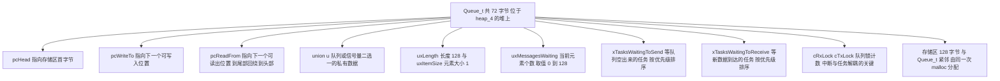
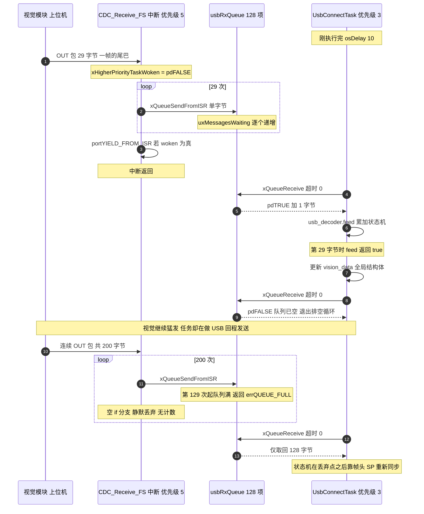

# 队列 Queue 与 usbRxQueue 实测

> 本单元的对象是云台板固件 `2026OmniSentryGimbal`。结论如下，后面的讨论都以它为前提：
>
> 整个工程只用了 1 个 FreeRTOS 同步对象：一个队列。0 个信号量（Semaphore）、0 个互斥量（Mutex）、0 次任务通知、0 处 `taskENTER_CRITICAL()`。
>
> 两块板子的 `Task/ BSP/ Communication/ Message_Bus/ USB_DEVICE/ Algorithm/ PID/` 全树做过穷举匹配（`osMutexCreate|xSemaphoreCreate|xTaskNotify|taskENTER_CRITICAL|__disable_irq` 等），命中数为 0。所以本单元不能写成"项目里信号量怎么用"，那是不存在的。写法是：以这一个真队列为样本，把每一种原语讲透，然后逐条回答"如果要用，在这块板子上该怎么写、会遇到什么问题"。

---

## 0. 开篇：同步原语是 RTOS 的分水岭

bare-metal（无 RTOS）程序里，函数之间靠"调用顺序"确定因果关系。一旦引入 RTOS，任务被调度器随时切断又随时恢复，两个函数之间的时间关系不再由代码顺序决定，而由调度器和中断共同决定。

于是出现三类新的问题，它们对应三类不同的原语：

| 问题 | 本质 | 对应的原语 |
| --- | --- | --- |
| A 要按顺序传一段数据，且接收方还没准备好时不能丢 | 数据所有权跨上下文转移 + 背压 | 队列 Queue |
| B 要告诉另一个任务"事件发生了"，不传数据 | 事件计数 / 唤醒 | 二值信号量、计数信号量、任务通知 |
| C 要保证同一时刻只有一个任务碰某段共享数据 | 互斥（所有权）+ 时间上界 | 互斥量（Mutex，带优先级继承 Priority Inheritance） |

这三类问题在本工程里都存在（`usbRxQueue` 属 A，`control_target` 的读写属 C，`ImuTask` 每毫秒出新数据属 B），但只有 A 被完整解决。队列恰好是 A 的完整解法，而 A 的实现又构成了 B 和 C 的基础：FreeRTOS 里信号量和互斥量全部是 `Queue_t` 的特例。理解队列，等于同时理解了另外两个。

### 0.1 本工程的同步现状盘点（实测）

| 项目 | 事实 | 证据位置 |
| --- | --- | --- |
| 队列 | 仅 `usbRxQueue = xQueueCreate(128, sizeof(uint8_t))` | `Core/Src/freertos.c:115` |
| 信号量 | 无 | 全树 grep 0 命中 |
| 互斥量 | 无（但 `configUSE_MUTEXES 1` 已使能） | `Core/Inc/FreeRTOSConfig.h:69` |
| 任务通知 | 无（但 `configUSE_TASK_NOTIFICATIONS` 默认 1 已使能） | `FreeRTOS.h:833-835` |
| 临界区 Critical Section | 应用层无 `taskENTER_CRITICAL()` | 全树 grep 0 命中 |
| 队列注册表 | `configQUEUE_REGISTRY_SIZE 8`，占 64 字节 `.bss`，但从未调用 `vQueueAddToRegistry()` | `.bss.xQueueRegistry = 0x40` |

最后一行来自构建产物的实测：`build/Debug/sentriomeni2026.map` 中 `.bss.xQueueRegistry` 段大小 `0x40`，即 8 项 × 8 字节 = 64 字节。它只服务于内核感知调试器（kernel aware debugger），不注册就纯粹是 64 字节的浪费。这是"开了配置不等于用了功能"的第一个例子，后面还会遇到更隐蔽的版本。

---

## 1. 逐参数拆解 `xQueueCreate(128, sizeof(uint8_t))`

### 1.1 这行代码到底申请了什么

```c
// Core/Src/freertos.c:114-120
/* USER CODE BEGIN RTOS_QUEUES */
usbRxQueue = xQueueCreate(128, sizeof(uint8_t));
if (usbRxQueue == NULL) {
  // 队列创建失败，可以添加错误处理
}
/* USER CODE END RTOS_QUEUES */
```

`xQueueCreate(uxQueueLength, uxItemSize)` 的两个参数含义容易误读：

- 参数 1 `uxQueueLength = 128` 是"能装多少个元素"，不是"能装多少字节"。
- 参数 2 `uxItemSize = 1` 是"每个元素多少字节"。

所以这一行创建的是长度 128、元素大小 1 字节的字节流 FIFO，最多缓存 128 个 `uint8_t`。把它读成一条 128 字节的消息队列，容量估算会错得很远。

这个区别在业务上立刻产生后果。协议规定视觉→云台的一帧是 29 字节（`Communication/Inc/usb_protocol.h:20`，`VISION_TO_GIMBAL_LEN = 29`，且 `static_assert(sizeof(VisionToGimbal) == 29)`），于是：

$$\text{队列最多能缓存的完整帧数} = \left\lfloor \frac{128}{29} \right\rfloor = 4 \text{ 帧}$$

容量是 4 帧，不是 128 帧。把 `128` 读成 128 条视觉数据，缓冲深度就会估错 30 倍。

### 1.2 内存占用：这个队列吃掉了多少堆

FreeRTOS 队列是按值拷贝的（queue 的注释原文：*Items are queued by copy, not by reference*），所以队列对象和存储区必须一起分配。`xQueueGenericCreate()` 的分配逻辑是（`Source/queue.c:368-397`）：

```c
xQueueSizeInBytes = ( size_t ) ( uxQueueLength * uxItemSize );
pxNewQueue = ( Queue_t * ) pvPortMalloc( sizeof( Queue_t ) + xQueueSizeInBytes );
pucQueueStorage = ( uint8_t * ) pxNewQueue;
pucQueueStorage += sizeof( Queue_t );
```

即存储区紧跟在 `Queue_t` 后面，一次 malloc 拿两块。两个常数可以在构建产物里坐实：

- `sizeof(Queue_t) = 72` 字节。证据：`sentriomeni2026.elf` 的 DWARF 里 `xSTATIC_QUEUE = 72`，而 `queue.c` 自己的 `configASSERT( xSize == sizeof( Queue_t ) )` 保证 `StaticQueue_t` 与 `Queue_t` 同尺寸。
- heap_4 的每次分配附加开销 8 字节（`BlockLink_t` 4+4），并按 `portBYTE_ALIGNMENT = 8` 向上对齐（`portable/GCC/ARM_CM4F/portmacro.h:75`、`portable/MemMang/heap_4.c:143-151`）。

于是通用公式是：

$$B_{\text{heap}} = 8\cdot\left\lceil \frac{72 + uxLength \cdot uxItemSize + 8}{8} \right\rceil \quad \text{（字节）}$$

代入本工程：

$$B_{\text{heap}} = 8\cdot\left\lceil \frac{72 + 128 \times 1 + 8}{8} \right\rceil = 8 \times 26 = 208 \text{ 字节}$$

`usbRxQueue` 总共吃掉 208 字节堆。这是后面第 3 节比较"队列 / 信号量 / 任务通知"成本时的基准数字。

### 1.3 顺带把 40 KB 堆的占用算清楚

`configTOTAL_HEAP_SIZE = 40960`（`FreeRTOSConfig.h:67`），且构建里只有 `heap_4.c` 参与编译（`Middlewares/.../portable/MemMang/` 目录下只有这一个文件，`build/Debug/sentriomeni2026.map` 里也是 `heap_4.c.obj` 提供的 `pvPortMalloc`）。在 ELF 里量到 `ucHeap` 符号大小正好是 `0xa000 = 40960` 字节，可以确认该数值准确。

静态分配的部分不占堆（空闲任务 Idle Task 走静态内存，见 `Core/Src/freertos.c:73-84`）：

| 对象 | 分配方式 | 实测大小 | 证据 |
| --- | --- | --- | --- |
| `ucHeap` | `.bss` | 40960 B | `nm` 符号 `ucHeap 0xa000` |
| `xIdleTaskTCBBuffer` | `.bss` 静态 | 84 B | `nm` 符号 `0x54` |
| `xIdleStack[256]` | `.bss` 静态 | 1024 B | `nm` 符号 `0x400` |
| `xQueueRegistry[8]` | `.bss` | 64 B | map 中 `.bss.xQueueRegistry 0x40` |

动态部分（6 个任务 + 1 个队列）的估算：

| 对象 | 请求字节 | heap_4 实占 | 说明 |
| --- | --- | --- | --- |
| TCB × 6 | 84 × 6 | 96 × 6 = 576 | 84+8=92 → 对齐到 96 |
| `defaultTask` 栈 256 words | 1024 | 1032 | `freertos.c:123` |
| `FireTask` 栈 512 words | 2048 | 2056 | `FireTask.cpp:217` |
| `ImuTask` 栈 1024 words | 4096 | 4104 | `ImuTask.cpp:112` |
| `ControlCenterTask` 栈 1024 words | 4096 | 4104 | `ControlCenterTask.cpp:149` |
| `UsbConnectTask` 栈 2048 words | 8192 | 8200 | `UsbConnectTask.cpp:118` |
| `GimbalTask` 栈 2048 words | 8192 | 8200 | `GimbalTask.cpp:120` |
| `usbRxQueue` | 200 | 208 | 本节 |
| 合计 | | 28480 | |
| 剩余 | | ≈ 12480 B | 约 30.5% |

> "栈大小单位"这个易错点在这里需要点明。`cmsis_os.h:284` 的注释写着 `stacksize` 是 *stack size requirements in bytes*，但 `cmsis_os.c` 的 `osThreadCreate()` 把 `thread_def->stacksize` 直接传给了 `xTaskCreate()`，而 `xTaskCreate` 的形参是 `usStackDepth`，单位是字（word）。所以在本工程的 ST 版 CMSIS-RTOS v1 包装里，`2048` 实际是 2048 words = 8192 字节栈，不是 2048 字节。上表的算法就是按"字"来的。这也是 40 KB 堆能装下 6 个任务却还剩 12 KB 的原因：若按注释的"字节"理解，总栈只有 6.75 KB，数值就对不上。（此条标注为基于源码推断：注释与实现的矛盾在源码中客观存在，但"设计者本意是字还是字节"无法从代码确证。）

---

## 2. `Queue_t` 的内部结构

队列不是"一个数组加两个下标"那么简单。`Source/queue.c:96-135` 定义的 `xQUEUE` 结构（72 字节）里，同时装着数据缓冲、两个等待链表和一把轻量锁：



设计细节里有几处需要展开：

（1）读写指针是"环形"的，靠 `pcReadFrom` 多退一个元素实现。
`xQueueGenericReset()` 里初始化成：

```c
pxQueue->u.xQueue.pcTail = pxQueue->pcHead + ( pxQueue->uxLength * pxQueue->uxItemSize );
pxQueue->pcWriteTo = pxQueue->pcHead;
pxQueue->u.xQueue.pcReadFrom = pxQueue->pcHead + ( ( pxQueue->uxLength - 1U ) * pxQueue->uxItemSize );
```

读指针初始指向最后一个元素的起始位置而不是首位置，这样"读一个"的操作可以统一写成"先把读指针前进一步（越界则回到 `pcHead`），再从新位置取值"。这是 FreeRTOS 避免分支的技巧，也解释了一个常见困惑：空队列时读指针不等于写指针。

（2）两个等待链表按优先级排序，这是"阻塞唤醒"能实现优先级抢占的根。
`xTasksWaitingToReceive` 是"数据到了该唤醒谁"的候选表；`xTasksWaitingToSend` 是"队列有空位了该唤醒谁"的候选表。`vTaskPlaceOnEventList()` 会按任务优先级把`xStateListItem`插入到正确位置，因此唤醒时 `xTaskRemoveFromEventList()` 取出的一定是优先级最高的那个等待者。

（3）`cRxLock / cTxLock` 解决"任务正在改结构时中断也想动它"的问题。
`prvLockQueue()` 把两个锁置为 `queueLOCKED_UNMODIFIED`，此后中断里调用 `xQueueSendFromISR` / `xQueueReceiveFromISR` 只搬运数据、只改锁计数，绝不碰事件链表；等任务侧 `prvUnlockQueue()` 时再统一按锁计数去摘任务。注释原文很直白：

> *Locking a queue does not prevent an ISR from adding or removing items to the queue, but does prevent an ISR from removing tasks from the queue event lists.*

这是队列在中断里安全、代码里却几乎看不到关中断动作的原因：中断路径被压缩到了最短。

---

## 3. 发送 / 接收 API 与阻塞语义

FreeRTOS 队列的 API 家族看起来很多，实际是"发送位置 × 上下文"两个维度的笛卡尔积：

| API | 上下文 | 队列满时 | 用途 |
| --- | --- | --- | --- |
| `xQueueSend()` / `xQueueSendToBack()` | 任务 | 按 `xTicksToWait` 阻塞 | 默认入队到尾部 |
| `xQueueSendToFront()` | 任务 | 按 `xTicksToWait` 阻塞 | 插队到头部，用于高优先消息 |
| `xQueueOverwrite()` | 任务 | 永不失败，直接覆盖唯一元素 | 只对 `uxLength == 1` 的队列合法 |
| `xQueueReceive()` | 任务 | 队列空时按 `xTicksToWait` 阻塞 | 取值并移除 |
| `xQueuePeek()` | 任务 | 同上 | 取值但不移除 |
| `xQueueSendFromISR()` | 中断 | 立刻返回 `errQUEUE_FULL` | ISR 里唯一合法的入队方式 |
| `xQueueReceiveFromISR()` | 中断 | 立刻返回 `errQUEUE_EMPTY` | ISR 里唯一合法的出队方式 |
| `xQueuePeekFromISR()` | 中断 | 同上 | 只窥视 |

阻塞与超时有三条约束：

1. 超时参数单位是 tick，不是毫秒。本工程 `configTICK_RATE_HZ = 1000`（`FreeRTOSConfig.h:64`），所以 1 tick = 1 ms，二者数值相等，这是巧合，不是保证。换一块板子 `configTICK_RATE_HZ = 100` 时，`xQueueReceive(q, &b, 10)` 就变成 100 ms 了。稳妥写法是 `pdMS_TO_TICKS(10)`。
2. `0` 表示"绝不阻塞"，`portMAX_DELAY` 表示"永远等"。若 `INCLUDE_vTaskSuspend == 1`（本工程为 1，`FreeRTOSConfig.h:88`），`portMAX_DELAY` 会无限期挂起，不会周期性超时。
3. 超时返回失败不代表没发生。经典竞态：超时到期的同时数据也到了。FreeRTOS 的 `xQueueSemaphoreTake` 里专门处理了这种情况（先检查队列是否已非空，非空则继续尝试），但调用方仍必须在超时返回后检查一次队列，否则可能丢掉"最后一刻到达"的数据。

---

## 4. 生产者侧：`CDC_Receive_FS` 的真实写法

这是全工程唯一一处中断里调用 FreeRTOS API。原文在 `USB_DEVICE/App/usbd_cdc_if.c:261-286`：

```c
static int8_t CDC_Receive_FS(uint8_t* Buf, uint32_t *Len)
{
  /* USER CODE BEGIN 6 */
  BaseType_t xHigherPriorityTaskWoken = pdFALSE;

  if (usbRxQueue == NULL) {
    goto exit;    //安全，避免先初始化usbRxQueue而不是freertos
  }

  for (uint32_t i = 0; i < *Len; i++) {
    if (xQueueSendFromISR(usbRxQueue,
                          &Buf[i],
                          &xHigherPriorityTaskWoken) != pdPASS) {} //队列满丢弃
  }

exit:
  USBD_CDC_SetRxBuffer(&hUsbDeviceFS, Buf);
  USBD_CDC_ReceivePacket(&hUsbDeviceFS);

  portYIELD_FROM_ISR(xHigherPriorityTaskWoken);

  return USBD_OK;
  /* USER CODE END 6 */
}
```

逐条解读，每一句都有非平凡的理由：

① 先判空 `usbRxQueue == NULL`。队列在 `MX_FREERTOS_Init()` 里创建，USB 设备初始化 `MX_USB_DEVICE_Init()` 在 `StartDefaultTask` 里（`freertos.c:143`）。当前顺序是"先建队列、后起调度器、再初始化 USB"，理论上安全。但代码作者显然不确定这个顺序会不会变，所以加了一道防御。代价是每次中断多一次指针判空，这个代价可以接受。

② 逐字节入队，而不是整包入队。`*Len` 是本次 OUT 包实际收到的字节数，可能 1 字节也可能 64 字节。逐字节发送的后果是：一个 OUT 包里的字节可能部分入队成功、部分失败（队列不够大时）。第 5 节会看到这个选择对解析器意味着什么。

③ `xHigherPriorityTaskWoken` 必须初始化，且必须传地址。它由内核在"确实唤醒了更高优先级任务"时置 `pdTRUE`；初始化为 `pdFALSE` 是契约。

④ `portYIELD_FROM_ISR` 是整个模式的关键。没有它，被唤醒的任务要等到下一个 tick 才能运行，最坏多等 1 ms；更糟的情况是，如果 `configUSE_PREEMPTION = 0`，它将永远等不到，直到当前任务主动让出。本工程 `configUSE_PREEMPTION = 1`（`FreeRTOSConfig.h:58`）。`portmacro.h:92-93` 里它只是 `portYIELD()` 的别名：

```c
#define portEND_SWITCHING_ISR( xSwitchRequired ) if( xSwitchRequired != pdFALSE ) portYIELD()
#define portYIELD_FROM_ISR( x ) portEND_SWITCHING_ISR( x )
```

⑤ 中断优先级必须低于（数值上不小于）`configMAX_SYSCALL_INTERRUPT_PRIORITY`。这是 Cortex-M 上最经典的"能编译、能跑、偶发死锁"错误来源。本工程：

| 量 | 值 | 出处 |
| --- | --- | --- |
| `configLIBRARY_MAX_SYSCALL_INTERRUPT_PRIORITY` | 5 | `FreeRTOSConfig.h:107` |
| `configPRIO_BITS` | `__NVIC_PRIO_BITS` = 4（STM32F407） | `FreeRTOSConfig.h:96-100` |
| 内核实际使用的 `configMAX_SYSCALL_INTERRUPT_PRIORITY` | $5 \ll (8-4) = 0\text{x}50$ | `FreeRTOSConfig.h:117` |
| `OTG_FS_IRQn` 优先级 | 5 | `USB_DEVICE/Target/usbd_conf.c:94` |

数值 5 = 边界值，处于合法边界（FreeRTOS 要求 ISR 优先级数值 ≥ `configLIBRARY_MAX_SYSCALL_INTERRUPT_PRIORITY`）。同时它是所有"允许调用 `FromISR` API"的中断里最紧急的一个，也即是说 USB 中断拿到了规则允许范围内的最高实时性。这个安排是有意为之的。

但这条边界很容易被破坏：把 `HAL_NVIC_SetPriority(OTG_FS_IRQn, 4, 0)` 改成 4，`CDC_Receive_FS` 里的 `xQueueSendFromISR` 就会踩到 `portASSERT_IF_INTERRUPT_PRIORITY_INVALID()`，而在 `configASSERT` 被定义成本工程那个"关中断死循环"版本时（`FreeRTOSConfig.h:122`），板子会直接卡死且没有任何输出：

```c
#define configASSERT( x ) if ((x) == 0) {taskDISABLE_INTERRUPTS(); for( ;; );}
```

同类风险还有 CAN 与 UART：`dma.c`、`can.c`、`usart.c` 里全部是 `HAL_NVIC_SetPriority(..., 5, 0)`，都压在同一个边界上。

---

## 5. 消费者侧：`UsbConnectTask` 的排空循环

`Task/Src/UsbConnectTask.cpp:43-62`：

```cpp
void StartUsbConnectTask::run() {
    uint8_t byte;
    for (;;) {
        // 视觉-->云台
        if (usbRxQueue != NULL) {
            while (xQueueReceive(usbRxQueue, &byte, 0) == pdTRUE)
            {
                if (usb_decoder.feed(byte))
                {
                    const auto& pkt = usb_decoder.packet();
                    vision_data.mode = pkt.mode;
                    vision_data.yaw  = remainderf(pkt.yaw, 360);
                    // ... 其余字段 ...
                }
            }
        }
        // 云台-->视觉（略）
        osDelay(10);
    }
}
```

这是"超时 0 + while 排空"模式。它与"超时 `portMAX_DELAY` + 每次收 1 字节"模式的差别体现在唤醒次数与延迟上：

| 模式 | 唤醒次数 | 延迟 | 适合 |
| --- | --- | --- | --- |
| `xQueueReceive(q,&b,portMAX_DELAY)` | 每来 1 字节唤醒 1 次 | 最低（中断后立刻跑） | 低频、事件型 |
| `xQueueReceive(q,&b,0)` 在循环里 | 每轮排空所有积压 | 最高一个循环周期 | 高频流式、批量处理 |

本项目选了后者，因为它要在同一轮里把积压字节全部喂给状态机，避免"1 字节 1 次上下文切换"的开销；代价是最坏延迟 = 一个循环周期。第 4 节的 `osDelay(10)` 就是这个周期，即 10 tick = 10 ms。

### 5.1 完整时序（含队列满）



### 5.2 队列满 / 队列空到底发生了什么

队列满（`errQUEUE_FULL`）时：
- `xQueueGenericSendFromISR()` 不做任何拷贝，直接返回失败；
- `pxHigherPriorityTaskWoken` 不会被修改（安全）；
- 队列内容保持原样，最早的数据仍在，新数据被丢，即丢弃的是新数据，不是旧数据。

这最后一点的后果是：`usbRxQueue` 是"丢新留旧"的 FIFO，不是"覆写最新的环形缓冲"。对本项目意味着视觉数据的延迟会累积而不是"只丢最新一帧"。如果要"只要最新一帧"，正确做法是把 `uxLength` 设为 29、每帧整体入队，并用 `xQueueOverwrite()` 语义（或干脆用一个只有 1 个元素的队列 + 直接覆盖）。

队列空（`errQUEUE_EMPTY`）时：
- 超时为 0 → 立即返回 `pdFALSE`，任务不进入阻塞态，不产生上下文切换；
- 超时 >0 → 任务被挂在 `xTasksWaitingToReceive` 链表上，状态转 Blocked，不消耗 CPU，被唤醒时按优先级决定是否抢占。

静默丢字节的后果：`CDC_Receive_FS` 那个空的 `if` 分支意味着丢包完全不可观测。没有计数、没有日志、没有错误标志。在调试"视觉数据偶尔异常"这类问题时，这是最难查的一类原因。改进只需两行：

```c
static volatile uint32_t usb_rx_overflow_cnt = 0;   // 可在 Debug_vars 里暴露给上位机

for (uint32_t i = 0; i < *Len; i++) {
    if (xQueueSendFromISR(usbRxQueue, &Buf[i], &xHigherPriorityTaskWoken) != pdPASS) {
        usb_rx_overflow_cnt++;      // 丢一个字节记一次
    }
}
```

注意 `volatile` 只保证"不被优化掉、每次都实际读写内存"，不保证原子性；`uint32_t` 在 Cortex-M4 上对齐的 32 位读写确实是单指令原子的，但中断里 `++` 是"读-改-写"三步，与任务侧读计数存在撕裂窗口。要精确统计，应改成中断里只置一个 `flag`，或接受 ±1 的统计误差（工程上通常足够）。

丢字节最终仍能恢复，原因在于帧头 + CRC 提供了帧级重同步能力。`Communication/Src/usb_decode.cpp:45-108` 的状态机在 `WAIT_HEAD_0` 上无条件丢弃非 `'S'` 字节，只有连续看到 `'S'`、`'P'` 才进入 `COLLECT`，收满 29 字节后用 `crc16_calc(buffer_, 27, 0xFFFF)` 校验。所以丢一个字节的代价是"当前这一帧报废"，下一帧头会重新对齐。这是"字节流协议 + 队列"能容忍丢字节的根本原因：如果协议没有自同步能力，丢 1 字节就等于永久乱码。

---

## 6. 常见易错点清单（每条都落在本工程）

| # | 易错点 | 本工程的具体表现 |
| --- | --- | --- |
| 1 | 把 `uxQueueLength` 当成字节数 | 以为 `usbRxQueue` 能存 128 条消息；实际是 128 字节 = 4.4 帧 |
| 2 | 队列满了不处理也不计数 | `usbd_cdc_if.c:275` 的 `{}` 空分支，丢包不可观测 |
| 3 | 在 ISR 里用非 `FromISR` 版本 | 一旦对 `usbRxQueue` 误用 `xQueueSend`，会触发断言或破坏事件链表 |
| 4 | 忘记 `portYIELD_FROM_ISR` | 唤醒延迟从"立即"退化为"最多 1 ms"（甚至永不调度） |
| 5 | ISR 优先级高于 syscall 上限 | `OTG_FS_IRQn = 5` 已是边界，改成 4 且 `configASSERT` 开启 → 静默死循环 |
| 6 | 超时参数当成毫秒 | `configTICK_RATE_HZ = 1000` 时巧合成立，换板子即错；应统一写 `pdMS_TO_TICKS()` |
| 7 | 忘了检查 `usbRxQueue == NULL` | 若队列创建失败（堆不足），`xQueueSendFromISR(NULL,...)` 在 `configASSERT` 下死循环 |
| 8 | 开启 `configQUEUE_REGISTRY_SIZE` 却从不注册 | 白占 64 字节 `.bss`，调试器里看不到队列 |
| 9 | 用队列传大结构体 | 队列按值拷贝，`memcpy` 在临界区内完成，大元素会拉长关中断时间；大块数据应传指针 |
| 10 | 认为"队列创建成功就一定能收发" | `xQueueCreate` 失败返回 `NULL`，本工程的失败处理是个空块 |

---

## 7. 小结

### 7.1 核心概念

- 队列 = 环形字节缓冲 + 两个按优先级排序的等待链表 + 一把只对中断计数的轻量锁。它同时解决了"数据转移"和"任务唤醒"两个问题，所以能成为 FreeRTOS 所有同步原语的实现基座。
- `xQueueCreate(L, c)` 的语义是"L 个 c 字节的元素"，不是"L 字节"。本工程 `(128, 1)` 是最容易被误读的形态：它是字节 FIFO。
- 队列是"按值拷贝"的。拷贝发生在临界区内，因此元素越大，"关中断时间"越长。这是队列不适合传大块数据的量化原因。
- 中断侧与任务侧的 API 是分离的（`FromISR` 后缀）。分离的出发点是速度：ISR 版本不碰事件链表，只改锁计数。
- `pxHigherPriorityTaskWoken` + `portYIELD_FROM_ISR` 是"中断到任务"延迟从 1 ms 降到 0 的唯一手段。
- ISR 优先级数值必须 ≥ `configLIBRARY_MAX_SYSCALL_INTERRUPT_PRIORITY`。本工程所有中断都设在 5，即边界值。

### 7.2 设计权衡

| 权衡点 | 本工程的选择 | 代价 | 若反过来会怎样 |
| --- | --- | --- | --- |
| 队列粒度 | 元素 = 1 字节（`sizeof(uint8_t)`） | 128 字节只装 4.4 帧；OUT 包可能被部分丢弃 | 若元素 = 29 字节整帧：容量 4 帧但不允许部分入队，丢就丢整帧，语义更干净 |
| 消费模式 | 超时 0 排空循环 | 最坏延迟 = 一个循环周期 | 若用 `portMAX_DELAY`：延迟最低但每字节一次上下文切换 |
| 队列满策略 | 丢新留旧 | 延迟累积 | 若丢旧留新（覆写）：延迟恒定但会丢帧 |
| 失败可观测性 | 无（空 `if`） | 现场问题无法定位 | 加 `volatile` 计数，几字节成本换来可诊断性 |
| 队列创建时机 | 调度器启动前 | 必须防 `NULL` | 若在任务里创建：需处理并发创建 |
| 内存来源 | heap_4 动态 | 208 字节 + 碎片 | `xQueueCreateStatic`：无堆、可离线算清，但需自行提供 `StaticQueue_t` |

这个队列的设计取向是：用能容忍丢字节的自同步协议，换取 ISR 里最省事的单字节入队。代价是把丢包风险集中到队列容量这一个数字上，而这个数字（128）目前是经验取值，没有针对视觉帧率做过核算。第 8 题要求完成这项核算。

---

## 8. 练习题

### 基础题

1. 容量核算。假设视觉模块以 $f$ Hz 发送 29 字节的帧，`UsbConnectTask` 每 10 ms 排空一次队列。请给出"不丢字节"所要求的最小 `uxQueueLength`（用 $f$ 表示），并算出 $f = 100, 200, 500, 1000$ 时的取值。
2. 单位辨析。现有 `xQueueReceive(q, &b, 10)`。若把本工程 `configTICK_RATE_HZ` 从 1000 改成 100，这行的实际超时变成多少毫秒？请写出不依赖 `configTICK_RATE_HZ` 取值的等价写法。
3. 内存计算。用第 1.2 节的公式计算 `xQueueCreate(4, sizeof(VisionToGimbal))`（`sizeof(VisionToGimbal) = 29`）所需的堆字节数，并与 `usbRxQueue` 的 208 字节比较。请比较哪一个更省，并说明理由。
4. 中断优先级。若把 `OTG_FS_IRQn` 的优先级改成 3，`CDC_Receive_FS` 里的 `xQueueSendFromISR` 请指出会发生什么、具体哪一行代码先被触发，以及现场看不到任何打印的原因。

### 挑战题

5. 改成"整帧入队"。把 `usbRxQueue` 改造成"元素 = 29 字节整帧"的队列：写出创建代码、ISR 端的改造思路（提示：ISR 里不能等 29 字节，需要一个 ISR 内的小暂存区），并说明这样做之后 `UsbConnectTask` 的循环可以简化成什么样。注意保持 `xHigherPriorityTaskWoken` 语义正确。
6. 可观测的丢包。设计一套"丢包可观测"的方案：要求在 ISR 里零阻塞、零临界区、不引入撕裂读；在任务侧能读到"累计丢弃字节数"与"最近一次丢弃时刻"，并通过 `Debug_vars` 暴露给上位机。给出代码。
7. 压力反推。本工程堆剩余约 12.5 KB。若要把 `usbRxQueue` 的容量扩大到能承受 1 kHz 帧率、且留出 3 倍余量，请给出所需字节数，并判断在不动其他任务栈的前提下该改动是否可行；若不可行，列出两条替代路径（提示：其中一条是降低元素粒度的反面做法）。

---

### 附：本页引用的固件路径

| 路径 | 用途 |
| --- | --- |
| `/home/wyx/rm/2026SentriOmeniGimbal/2026OmniSentryGimbal/Core/Src/freertos.c` | 队列创建（:115）、空闲任务静态内存（:73-84）、任务创建顺序（:123-134） |
| `/home/wyx/rm/2026SentriOmeniGimbal/2026OmniSentryGimbal/Core/Inc/FreeRTOSConfig.h` | 全部配置数值（:58-122） |
| `/home/wyx/rm/2026SentriOmeniGimbal/2026OmniSentryGimbal/USB_DEVICE/App/usbd_cdc_if.c` | ISR 生产者（:261-286）、`CDC_Transmit_FS`（:299-315） |
| `/home/wyx/rm/2026SentriOmeniGimbal/2026OmniSentryGimbal/USB_DEVICE/Target/usbd_conf.c` | `OTG_FS_IRQn` 优先级 = 5（:94） |
| `/home/wyx/rm/2026SentriOmeniGimbal/2026OmniSentryGimbal/Task/Src/UsbConnectTask.cpp` | 消费者排空循环（:43-101） |
| `/home/wyx/rm/2026SentriOmeniGimbal/2026OmniSentryGimbal/Communication/Src/usb_decode.cpp` | 帧级重同步状态机（:45-108） |
| `/home/wyx/rm/2026SentriOmeniGimbal/2026OmniSentryGimbal/Communication/Inc/usb_protocol.h` | 帧长常量与 `static_assert`（:18-77） |
| `/home/wyx/rm/2026SentriOmeniGimbal/2026OmniSentryGimbal/Middlewares/Third_Party/FreeRTOS/Source/queue.c` | `Queue_t` 定义（:96-135）、`xQueueGenericCreate`（:368-408）、`prvLockQueue`（:239-251）、`xQueueGiveFromISR`（:1112-1150） |
| `/home/wyx/rm/2026SentriOmeniGimbal/2026OmniSentryGimbal/Middlewares/Third_Party/FreeRTOS/Source/portable/MemMang/heap_4.c` | 块头与对齐规则（:143-151） |
| `/home/wyx/rm/2026SentriOmeniGimbal/2026OmniSentryGimbal/Middlewares/Third_Party/FreeRTOS/Source/CMSIS_RTOS/cmsis_os.c` | `osThreadCreate` 的 stacksize 透传（:108-139） |
| `/home/wyx/rm/2026SentriOmeniGimbal/2026OmniSentryGimbal/build/Debug/sentriomeni2026.map` / `.elf` | `ucHeap = 0xa000`、`xIdleTaskTCBBuffer = 0x54`、`xQueueRegistry = 0x40`、`sizeof(Queue_t) = 72` 的实测证据 |
