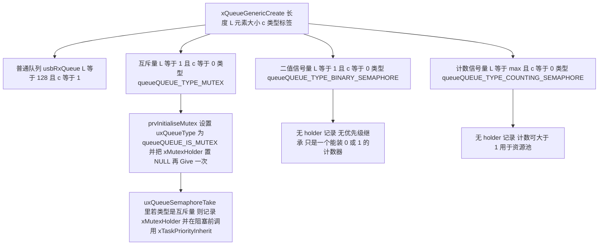
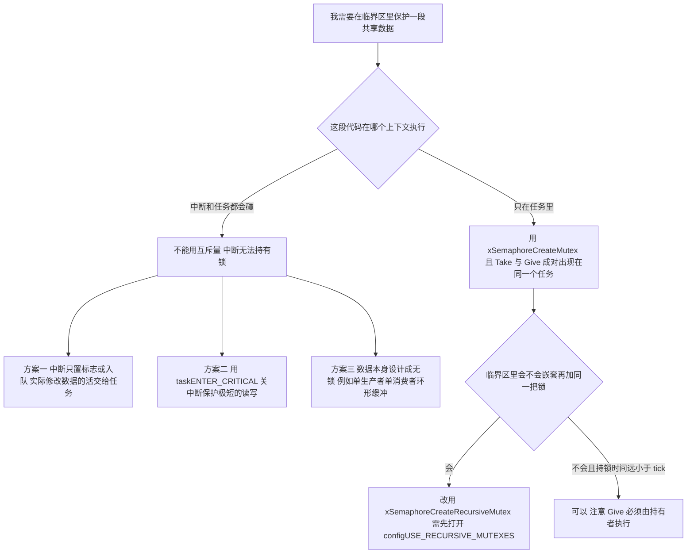

# 信号量与互斥量

> 先把最反直觉的事实说清楚：本工程的信号量与互斥量使用量都是 0。
>
> `configUSE_MUTEXES` 是 1（`Core/Inc/FreeRTOSConfig.h`），构建产物里 `xQueueCreateMutex`、`prvInitialiseMutex` 两个函数确实被编译进来了（`build/Debug/sentriomeni2026.map` 中 `.text.xQueueCreateMutex = 0x30`、`.text.prvInitialiseMutex = 0x34`），但两块板子的应用代码里没有任何一处 `xSemaphoreCreate*` 或 `osMutexCreate`。
>
> 同时有一个更危险的默认值：`configUSE_COUNTING_SEMAPHORES` 没有被定义，于是取默认值 0（`FreeRTOS.h`）。构建产物里 `xQueueCreateCountingSemaphore` 的出现次数是 0——这个函数根本没被编译，原因是用不了，而不是没用到。它失败得很静默，第 3 节展开。

---

## 1. 三种原语都是 `Queue_t` 的特例

FreeRTOS 没有为信号量（Semaphore）写独立的数据结构。它把队列的 `uxItemSize` 设为 0，"队列里元素的个数"就退化成"信号量的计数值"。这是整个 FreeRTOS 同步机制的设计基石。



二值信号量（Binary Semaphore）、计数信号量（Counting Semaphore）与互斥量（Mutex）三者的创建路径逐字对照：

| 原语 | 创建宏/函数 | 展开后 | 初始计数值 |
| --- | --- | --- | --- |
| 二值信号量 | `xSemaphoreCreateBinary()` | `xQueueGenericCreate(1, 0, queueQUEUE_TYPE_BINARY_SEMAPHORE)` | 0（不可用） |
| 二值信号量（旧） | `vSemaphoreCreateBinary(sem)` | 同上，随后额外 `xSemaphoreGive(sem)` | 1（可用） |
| 计数信号量 | `xSemaphoreCreateCounting(max, init)` | `xQueueCreateCountingSemaphore(max, init)` | `init` |
| 互斥量 | `xSemaphoreCreateMutex()` | `xQueueCreateMutex(queueQUEUE_TYPE_MUTEX)` | 1（可用，且带 holder 记录） |

出处：`include/semphr.h`（旧二值）、`semphr.h`（新二值）、`semphr.h`（互斥量）、`semphr.h`（计数）；`queue.c`（`xQueueCreateMutex` + `prvInitialiseMutex`）。

"初始计数值"这一列是三个原语最容易出错的地方：

- `xSemaphoreCreateBinary()` 建出来的信号量是空的，必须先 `Give` 一次才能 `Take`。这是"ISR 给、任务取"模式能成立的前提。
- `vSemaphoreCreateBinary()` 和 `xSemaphoreCreateMutex()` 建出来就是可用的。
- 互斥量"可用"是指"当前没人持有"，语义正确。

### 1.1 统一的内存公式

因为存储区大小是 $uxLength \times uxItemSize$，而信号量/互斥量的 `uxItemSize` 都是 0，所以：

$$B_{\text{heap}} = 8\cdot\left\lceil \frac{72 + uxLength \times uxItemSize + 8}{8} \right\rceil$$

| 对象 | 代入 | 实占堆 |
| --- | --- | --- |
| 二值信号量 | $8\lceil(72+0+8)/8\rceil$ | 80 字节 |
| 互斥量 | 同上 | 80 字节 |
| 计数信号量 | 同上（长度不影响） | 80 字节 |
| 本工程的 `usbRxQueue` | $8\lceil(200+8)/8\rceil$ | 208 字节 |

注意最后一行：`uxItemSize = 0` 意味着存储区尺寸为 0，所以"长度 1 的信号量"和"长度 255 的计数信号量"占用完全相同的 80 字节。计数上限不花内存。

---

## 2. 二值信号量：只做"事件发生了"这一个语义

二值信号量能表达的只有两种状态：有令牌 / 没有令牌。因此它适合"一次性事件提醒"：某一件事发生了，请另一个任务去处理。

标准用法（本项目风格的可运行代码）：

```c
/* --- 某 BSP 模块（例如 usart_dma.cpp 的空闲中断）--- */
static SemaphoreHandle_t s_uart_idle_sem = NULL;

void Uart_Idle_Init(void) {
    s_uart_idle_sem = xSemaphoreCreateBinary();   /* 注意：建出来是空的 */
    configASSERT(s_uart_idle_sem != NULL);
}

/* 在 USART 空闲中断里 */
void USART3_IRQHandler(void) {
    BaseType_t xHigherPriorityTaskWoken = pdFALSE;
    if (__HAL_UART_GET_FLAG(&huart3, UART_FLAG_IDLE)) {
        __HAL_UART_CLEAR_IDLEFLAG(&huart3);
        xSemaphoreGiveFromISR(s_uart_idle_sem, &xHigherPriorityTaskWoken);
    }
    HAL_UART_IRQHandler(&huart3);
    portYIELD_FROM_ISR(xHigherPriorityTaskWoken);
}

/* --- 任务侧 --- */
void StartRxTask::run() {
    for (;;) {
        /* portMAX_DELAY：没有事件就永远睡，不占 CPU */
        if (xSemaphoreTake(s_uart_idle_sem, portMAX_DELAY) == pdTRUE) {
            bsp_uart_idle_handler();     /* 处理这一帧 */
        }
    }
}
```

二值信号量有三个固有缺陷，因此它只适合做事件提醒：

1. 不能计数。若中断在任务处理之前发生了 10 次，令牌数仍是 1，即有 9 次事件丢失。要计次必须用计数信号量或 `ulTaskNotifyTake(pdFALSE, ...)`。
2. 没有所有权。任何任务都能 `Give`，也不需要是`Take`过它的那个任务。所以它不能用来保护共享数据（因为"谁持有"无从判断）。
3. 没有优先级继承。用它做互斥会造成无界优先级反转——这是火星探路者号事故的直接机制，本单元的第 4 篇专门讲。

### 2.1 本项目的易错点：CMSIS 包装把"空"变成了"满"

本工程的 CMSIS-RTOS v1 包装（`Middlewares/Third_Party/FreeRTOS/Source/CMSIS_RTOS/cmsis_os.c`）对 `count == 1` 的处理是：

```c
osSemaphoreId osSemaphoreCreate (const osSemaphoreDef_t *semaphore_def, int32_t count)
{
  if (semaphore_def->controlblock != NULL) {
    if (count == 1) {
      return xSemaphoreCreateBinaryStatic( semaphore_def->controlblock );
    } else {
#if (configUSE_COUNTING_SEMAPHORES == 1 )
      return xSemaphoreCreateCountingStatic( count, count, semaphore_def->controlblock );
#else
      return NULL;
#endif
    }
  }
  else {
    if (count == 1) {
      vSemaphoreCreateBinary(sema);      /* 旧宏！建完立刻 Give 一次 = 初始可用 */
      return sema;
    } else {
#if (configUSE_COUNTING_SEMAPHORES == 1 )
      return xSemaphoreCreateCounting(count, count);
#else
      return NULL;
#endif
    }
  }
}
```

请对照看这两条分岔：

- `controlblock != NULL`（静态分配）→ `xSemaphoreCreateBinaryStatic()` → 空的；
- `controlblock == NULL`（动态分配，也是本项目唯一可能的走法，因为 `osSemaphoreDef(name)` 把 controlblock 初始化为 `NULL`）→ `vSemaphoreCreateBinary()` → 一开始就是满的。

于是：

```c
osSemaphoreId sem = osSemaphoreCreate(osSemaphore(sem), 1);
/* 在 ST 版 CMSIS-RTOS v1 的 FreeRTOS 移植里，这个信号量此刻已经"可用"了。
   如果你的任务第一次 xSemaphoreTake 会立刻成功返回——它等不到任何事件！ */
```

这就是"ISR 给、任务取"模式在本工程里直接用 CMSIS 包装会失效的原因。规避方式有三种，按推荐度排序：

```c
/* 方案 A（最推荐）：绕过 CMSIS 包装，直接用 FreeRTOS 原生 API —— 语义明确无歧义 */
static SemaphoreHandle_t s_sem;
s_sem = xSemaphoreCreateBinary();              /* 明确是空的 */
configASSERT(s_sem != NULL);

/* 方案 B：用 CMSIS 包装，但创建后立刻"消耗"掉那枚多余的令牌 */
osSemaphoreId sem = osSemaphoreCreate(osSemaphore(sem), 1);
osSemaphoreWait(sem, 0);                        /* 吃掉初始令牌 */

/* 方案 C：改用任务通知（见第 3 篇），它天生是"计数式"的，没有这个歧义 */
```

> 说明：CMSIS-RTOS v1 规范把 `osSemaphoreCreate` 的 `count` 定义为"初始可用资源数"，所以 `count = 1` → 初始可用，从规范角度 vSemaphoreCreateBinary 的行为是对的。问题在于"静态分配走 `xSemaphoreCreateBinaryStatic`（空）、动态分配走 `vSemaphoreCreateBinary`（满）"这两条路径语义不一致，同一个 API 用不同方式调用会得到相反的初始状态。这是本工程 CMSIS 包装层一个客观存在的不一致性，此条按源码如实标注。

---

## 3. 计数信号量：资源池与事件计数

计数信号量的计数值可以大于 1，所以它能表达两种新语义：

1. 资源池：有 $N$ 个等价资源（例如 DMA 通道、CAN 发送邮箱），初始给 $N$ 个令牌，用掉一个取一个。
2. 事件计数：中断发生 10 次就累计 10 个令牌，任务可以逐个消费而不丢事件。

```c
/* 例：本工程有 2 路 CAN（CAN1/CAN2）+ 若干 UART，用信号量管理"可用发送通道" */
#define TX_SLOT_MAX 4
static SemaphoreHandle_t s_tx_slots = NULL;

void TxSlots_Init(void) {
    /*  最大计数 4，初始计数 4  */
    s_tx_slots = xSemaphoreCreateCounting(TX_SLOT_MAX, TX_SLOT_MAX);
    configASSERT(s_tx_slots != NULL);
}

bool TxSlots_Acquire(uint32_t timeout_ms) {
    return xSemaphoreTake(s_tx_slots, pdMS_TO_TICKS(timeout_ms)) == pdTRUE;
}

void TxSlots_Release(void) {
    xSemaphoreGive(s_tx_slots);   /* 归还一个令牌 */
}
```

### 3.1 本项目不可用，且两条路径的失败方式不同

`xQueueCreateCountingSemaphore` 被两层 `#if` 包着（`queue.c`、`queue.c`）：

```c
#if( ( configUSE_COUNTING_SEMAPHORES == 1 ) && ( configSUPPORT_DYNAMIC_ALLOCATION == 1 ) )
	QueueHandle_t xQueueCreateCountingSemaphore( const UBaseType_t uxMaxCount, const UBaseType_t uxInitialCount )
	{ ... }
#endif
```

本工程 `FreeRTOSConfig.h` 没有定义 `configUSE_COUNTING_SEMAPHORES`，所以它取 `FreeRTOS.h` 的默认值 0。后果分两条路径，都很难查：

| 调用方式 | 编译 | 链接 | 运行 |
| --- | --- | --- | --- |
| 直接 `xSemaphoreCreateCounting(4, 4)` | 通过（宏照展开） | 失败：`undefined reference to xQueueCreateCountingSemaphore` | —— |
| 走 CMSIS：`osSemaphoreCreate(osSemaphore(sem), 4)` | 通过 | 通过 | 返回 `NULL`，不报错、不断言、不打印 |

第二条路径是本工程最隐蔽的一个问题：函数签名是 `osSemaphoreId`，返回 `NULL` 是"合法的失败返回值"，调用方如果没有 `if (sem == NULL)` 检查，就会一路带着 `NULL` 走，直到第一次 `osSemaphoreWait(NULL, ...)` 才在 `cmsis_os.c` 里返回 `osErrorParameter`，而那个返回值同样经常被忽略。

构建产物可以核实：`build/Debug/sentriomeni2026.map` 里字符串 `xQueueCreateCountingSemaphore` 出现 0 次（`grep -c` 结果为 0），而 `xQueueCreateMutex` 出现且带 `.text` 段，由此确证了"互斥量可用、计数信号量不可用"这个非对称状态。

要启用计数信号量，只需在 `FreeRTOSConfig.h` 里补一行，代价是零 RAM（第 1.1 节的公式：长度不进内存）：

```c
#define configUSE_COUNTING_SEMAPHORES 1
```

---

## 4. 互斥量：唯一带"所有权"的原语

互斥量 = "长度 1、元素大小 0、类型标记为 `queueQUEUE_IS_MUTEX`"的队列 + 三件事：

```c
/* queue.c，prvInitialiseMutex 的核心 */
pxNewQueue->uxQueueType = queueQUEUE_IS_MUTEX;          /* ① 打上类型标记 */
pxNewQueue->u.xSemaphore.xMutexHolder = NULL;           /* ② 记录"谁持有" */
pxNewQueue->u.xSemaphore.uxRecursiveCallCount = 0;      /* ③ 递归计数（递归互斥量用） */
( void ) xQueueGenericSend( pxNewQueue, NULL, 0U, queueSEND_TO_BACK );  /* 初始可用 */
```

以及 `xQueueSemaphoreTake` 成功取到时的这一句（`queue.c`）：

```c
#if ( configUSE_MUTEXES == 1 )
{
    if( pxQueue->uxQueueType == queueQUEUE_IS_MUTEX )
    {
        /* Record the information required to implement
        priority inheritance should it become necessary. */
        pxQueue->u.xSemaphore.xMutexHolder = pvTaskIncrementMutexHeldCount();
    }
}
#endif
```

这一句就是"所有权"的全部实现，也是互斥量与二值信号量的唯一分水岭。有了 `xMutexHolder`，内核才可能知道"该把优先级借给谁"。二值信号量没有这个字段的写入路径，所以它在原理上就不可能支持优先级继承：缺的是承载该信息的字段，而不是一个开关。

互斥量的四条使用纪律：

| 纪律 | 原因 |
| --- | --- |
| 只能在任务里 `Take`，绝不能在 ISR 里 | 见第 5 节 |
| 谁 `Take` 谁 `Give` | `xSemaphoreGive` 会对 `xMutexHolder` 做 `xTaskPriorityDisinherit`，非持有者调用会破坏优先级记录 |
| 不要嵌套持有同一个互斥量 | 非递归互斥量重复 `Take` 会死锁（要嵌套请用 `xSemaphoreCreateRecursiveMutex()`） |
| 持有时间要短 | 优先级继承只是"让出优先级"，不能让临界区 Critical Section 变快；持锁期间会阻塞所有等它的人 |

### 4.1 本工程的递归互斥量也用不了

`xSemaphoreCreateRecursiveMutex()` 被 `#if( ( configSUPPORT_DYNAMIC_ALLOCATION == 1 ) && ( configUSE_RECURSIVE_MUTEXES == 1 ) )` 包着（`semphr.h`），而 `configUSE_RECURSIVE_MUTEXES` 默认 0（`FreeRTOS.h`）。所以本项目互斥量只能创建非递归的那一种。若要递归（例如 `GimbalTask` 的 PID 更新里再调用一个也会加锁的函数），需要：

```c
#define configUSE_RECURSIVE_MUTEXES 1
```

---

## 5. 互斥量不能在中段（中断）里使用的原因

"中段"指中断服务程序（ISR，Interrupt Service Routine），ARM 术语里叫 Handler Mode。

先说 FreeRTOS 内核层面的答案：优先级继承的对象是"任务"，中断没有优先级可继承。

优先级继承的物理含义是"临时把低优先级任务的优先级抬高，让它赶紧跑完、赶紧放锁"。中断不是任务，它不在就绪链表里，没有 `uxPriority` 字段可抬，也永远不会被别的任务抢占。所以"中断持有互斥量"这件事在内核模型里无意义。

内核在 ISR 版 API 里用断言阻止这种用法：

```c
/* queue.c，xQueueGiveFromISR 里 */
/* Normally a mutex would not be given from an interrupt, especially if
there is a mutex holder, as priority inheritance makes no sense for an
interrupts, only tasks. */
configASSERT( !( ( pxQueue->uxQueueType == queueQUEUE_IS_MUTEX ) && ( pxQueue->u.xSemaphore.xMutexHolder != NULL ) ) );
```

而在 `configASSERT` 被定义成本工程那种"关中断死循环"时（`FreeRTOSConfig.h`），违规的后果是板子卡死且无任何输出。

然后是"取"这一侧，这里有个更隐蔽的问题。`xQueueReceiveFromISR` 里根本没有 `xMutexHolder` 的赋值语句——它只做 `prvCopyDataFromQueue`（元素大小为 0 时是空操作）和 `uxMessagesWaiting--`：

```c
if( uxMessagesWaiting > ( UBaseType_t ) 0 )
{
    prvCopyDataFromQueue( pxQueue, pvBuffer );      /* 元素大小 0，什么都不做 */
    pxQueue->uxMessagesWaiting = uxMessagesWaiting - 1;   /* 只是减了个计数 */
    ...
}
```

所以在中断里对互斥量调用 `xSemaphoreTakeFromISR` 不会触发任何断言，它"成功"了，但它绕过了所有权记录。后果链条是：

1. `xMutexHolder` 从未被设置；
2. 后来任务 A 去 `Take` 同一个互斥量时，看到计数为 0，于是阻塞；
3. 阻塞前内核执行 `xTaskPriorityInherit( pxQueue->u.xSemaphore.xMutexHolder )`，而 holder 是 `NULL`；

```c
/* queue.c */
if( pxQueue->uxQueueType == queueQUEUE_IS_MUTEX )
{
    taskENTER_CRITICAL();
    {
        xInheritanceOccurred = xTaskPriorityInherit( pxQueue->u.xSemaphore.xMutexHolder );
    }
    taskEXIT_CRITICAL();
}
```

4. 若"持有者"是中断（或某个任务），优先级继承指向了错误对象或空对象 → 锁永远放不回来，系统死锁。

最后是本项目 CMSIS 包装层的一个真实缺陷，必须点名。

`cmsis_os.c` 的 `osMutexWait()` 里有这样一个分支：

```c
osStatus osMutexWait (osMutexId mutex_id, uint32_t millisec)
{
  ...
  if (inHandlerMode()) {
    if (xSemaphoreTakeFromISR(mutex_id, &taskWoken) != pdTRUE) {
      return osErrorOS;
    }
    portEND_SWITCHING_ISR(taskWoken);
  }
  else if (xSemaphoreTake(mutex_id, ticks) != pdTRUE) {
    return osErrorOS;
  }
  return osOK;
}
```

包装层主动在中断里对互斥量调用了 `xSemaphoreTakeFromISR`。也就是说，本工程里只要有人写出"在中断里 `osMutexWait`"这种代码，不但不会被拦住，还会被包装层"帮助"完成，而且正如上面分析的，这会绕过所有权记录。`osMutexRelease()` 同样有 `inHandlerMode()` 分支调用 `xSemaphoreGiveFromISR()`，那个分支会撞上 `configASSERT`。



---

## 6. 三者对比与选型

| 维度 | 二值信号量 | 计数信号量 | 互斥量 |
| --- | --- | --- | --- |
| 底层 | `Queue_t`，L=1, c=0 | `Queue_t`，L=max, c=0 | `Queue_t`，L=1, c=0 + 类型标记 |
| 初始状态 | 空（新 API）/ 满（旧 API） | 由 `init` 决定 | 可用 |
| 计数上限 | 1 | `uxMaxCount` | 1 |
| 记录持有者 | 否 | 否 | 是（`xMutexHolder`） |
| 优先级继承 | 否 | 否 | 是 |
| ISR 中可用 | 可以 `Give` | 可以 `Give` | 不可以 |
| 堆占用（heap_4） | 80 B | 80 B | 80 B |
| 本工程可用 | 是 | 否（`configUSE_COUNTING_SEMAPHORES` 未定义） | 是（`configUSE_MUTEXES = 1`） |
| 典型用途 | ISR→任务事件提醒 | 资源池 / 事件计数 | 保护共享数据 |

选型结论：

1. 要传数据 → 队列（不要用信号量 + 全局变量，那是自找竞态）。
2. 只是"发生了" → 二值信号量，或更好的任务通知（第 3 篇会证明通知能省下 80 字节和一次上下文切换）。
3. 要数次数或管资源池 → 计数信号量（本工程需先补 `configUSE_COUNTING_SEMAPHORES 1`）。
4. 要保护共享数据 → 互斥量，不用二值信号量；只有在所有相关任务优先级相同时才没有反转风险，本项目就是这种情况，见第 7 节。

---

## 7. 本项目该怎么做：给 `control_target` 加锁

本工程的跨任务共享数据全部走 `Message_Bus` 里的全局结构体（`Message_Bus/message_bus.cpp` 就是几行全局变量定义）：

```c
ControlTarget control_target;
MotorOutputData motor_output;
uint16_t TotalAmmoShooted = 0;
float AmmoSpeed = 0;
```

写入者与读取者：

| 全局量 | 写者 | 读者 | 保护 |
| --- | --- | --- | --- |
| `control_target` | `ControlCenterTask`（`ControlCenterTask.cpp`） | `GimbalTask`、`FireTask`、`UsbConnectTask` | 无 |
| `vision_data` | `UsbConnectTask`（`UsbConnectTask.cpp`） | `ControlCenterTask`、`GimbalTask` | 无 |
| `q` / `gyro` / `yaw` / `pitch` | `ImuTask`（`ImuTask.cpp`） | `GimbalTask`、`UsbConnectTask`、`ControlCenterTask` | 无 |
| `TotalAmmoShooted` / `AmmoSpeed` | `FireTask` / 裁判系统 | `UsbConnectTask` | 无 |

至今没有暴露故障，原因是在 ST 版 CMSIS 包装下，所有任务都是 `osPriorityNormal`，而 `makeFreeRtosPriority()`（`cmsis_os.c`）把它映射成：

$$p_{\text{FreeRTOS}} = p_{\text{CMSIS}} - p_{\text{CMSIS,Idle}} = p_{\text{CMSIS}} + 3 \;\Rightarrow\; \text{osPriorityNormal}(0) \to 3$$

6 个任务全部在 FreeRTOS 优先级 3，加上默认开启的 `configUSE_TIME_SLICING = 1`（`FreeRTOS.h`），它们之间只存在"每个 tick 轮转"的关系，不存在优先级抢占。于是共享变量的读写虽然交错，却没有"高优先级任务被低优先级任务反复插队"的放大效应，出错概率低到没被发现。

这个前提是有条件的，也并不稳固：把 `ImuTask` 改成 `osPriorityRealtime`（→ FreeRTOS 6 = `configMAX_PRIORITIES - 1`）就会同时引入抢占式优先级体系。届时：

- 如果同时引入互斥量保护 `control_target`，必须用 `xSemaphoreCreateMutex()`（二值信号量救不了）；
- 如果没有引入互斥量，那些"多字段不一致的读"会从"偶尔"变成"可复现"。

加锁的可运行写法（保持本工程的 TaskBase + 全局句柄风格）：

```cpp
/* 在 Message_Bus/message_bus.h 里声明 */
extern SemaphoreHandle_t control_target_mutex;

/* 新增一个访问层，禁止直接读写全局结构体 */
bool ControlTarget_Write(const ControlTarget& src, uint32_t timeout_ms);
bool ControlTarget_Read(ControlTarget* dst, uint32_t timeout_ms);
```

```cpp
/* 在 Message_Bus/message_bus.cpp 里实现 */
#include "FreeRTOS.h"
#include "semphr.h"

SemaphoreHandle_t control_target_mutex = NULL;

void MessageBus_Init(void) {                 /* 必须在 vTaskStartScheduler 之前调用 */
    control_target_mutex = xSemaphoreCreateMutex();    /* 天生带优先级继承 */
    configASSERT(control_target_mutex != NULL);
}

bool ControlTarget_Write(const ControlTarget& src, uint32_t timeout_ms) {
    if (control_target_mutex == NULL) return false;
    if (xSemaphoreTake(control_target_mutex, pdMS_TO_TICKS(timeout_ms)) != pdTRUE) {
        return false;                        /* 拿不到锁时不做无保护写入 */
    }
    control_target = src;                    /* 结构体按值整体覆盖，读侧只会看到旧值或新值 */
    xSemaphoreGive(control_target_mutex);    /* 谁 Take 谁 Give */
    return true;
}

bool ControlTarget_Read(ControlTarget* dst, uint32_t timeout_ms) {
    if (control_target_mutex == NULL || dst == nullptr) return false;
    if (xSemaphoreTake(control_target_mutex, pdMS_TO_TICKS(timeout_ms)) != pdTRUE) {
        return false;                        /* 读失败时保留上一次的值更安全 */
    }
    *dst = control_target;                   /* 得到一致快照，避免多字段撕裂 */
    xSemaphoreGive(control_target_mutex);
    return true;
}
```

这里有一处容易忽略的细节：`float` 在 Cortex-M4 上是 32 位且 4 字节对齐的，单次读写是原子的，所以"读 `gimbal_pitch_angle` 读到旧值"不会出问题。问题在于多字段的一致性：`ControlCenterTask` 先写 `gimbal_pitch_angle`（`ControlCenterTask.cpp`）再写 `gimbal_yaw_angle`，`GimbalTask` 若在这两条之间读走整个结构，就会拿到"新 pitch + 旧 yaw"的混合态。对云台控制而言，这可能造成一次异常角速度指令。互斥量解决的是快照一致性，不是单变量原子性，这个区别在上锁之后才会显现。

---

## 8. 常见易错点清单

| # | 易错点 | 本工程的具体表现 |
| --- | --- | --- |
| 1 | 以为 `configUSE_MUTEXES 1` 就等于"用了互斥量" | 配置开了，代码里 0 处使用 |
| 2 | 以为计数信号量随时可用 | `configUSE_COUNTING_SEMAPHORES` 未定义；直接调用链接失败，CMSIS 包装静默返回 `NULL` |
| 3 | CMSIS 包装的初始状态不一致 | `osSemaphoreCreate(def, 1)` 动态分配走 `vSemaphoreCreateBinary` → 一开始就可用 |
| 4 | 在中断里 `osMutexWait` / `osMutexRelease` | 包装层有 `inHandlerMode()` 分支，不会拦截这种调用；Take 绕过 owner 记录，Give 撞断言 |
| 5 | 用二值信号量保护共享数据 | 无 owner 记录 → 无优先级继承 → 第 4 篇的优先级反转 |
| 6 | 非持有者 `Give` 互斥量 | 会对错误的 holder 做 `xTaskPriorityDisinherit`，优先级记录错乱 |
| 7 | 把 `xSemaphoreTake(q, 0)` 的失败当"没事" | 返回 `pdFALSE` 时不持有锁，若继续写数据等于没保护 |
| 8 | 用 `osSemaphoreWait` 的返回值当布尔值 | 它是 `int32_t`，成功返回剩余令牌数（可能是 0），`if (osSemaphoreWait(...)) ` 在最后一个令牌时会误判为失败 |
| 9 | 忘记 `configASSERT(sem != NULL)` | `xSemaphoreCreateMutex` 失败返回 `NULL`，堆不足时静默失效 |
| 10 | 在 `configMAX_PRIORITIES = 7` 下用 `osPriorityRealtime + 互斥量优先继承` | 继承后的优先级不会超过 6，但递归继承链会放大阻塞时间（第 4 篇详解） |

> 第 8 条需要单独说明：`cmsis_os.c` 的 `osSemaphoreWait` 在成功时返回 `osSemaphoreGetCount()` 的结果，即取走一个令牌后剩下的令牌数。"最后一个令牌被取走"时它返回 0，因此 `if (osSemaphoreWait(sem, 0)) ` 会把它判成失败。这是 CMSIS-RTOS v1 与 v2 的一个重要语义差异（v2 的 `osSemaphoreAcquire` 返回 `osStatus_t`）。

---

## 9. 小结

### 9.1 核心概念

- 一切同步原语都是 `Queue_t` 的特例。信号量与互斥量把 `uxItemSize` 置 0，"队列里的元素个数"就是"计数值"。这解释了为什么它们的堆占用与长度无关，恒为 80 字节。
- 二值信号量 / 计数信号量 / 互斥量的分水岭是 `xMutexHolder`。只有互斥量会写这个字段，因此只有它能做优先级继承。这是"能力差异"，不是"配置差异"。
- 互斥量的本质是"所有权"，所有权只在任务语境下存在。中断没有可被继承的优先级，所以中断用互斥量在内核模型里就是错的；FreeRTOS 只在 `Give` 侧断言，`Take` 侧不拦（本项目 CMSIS 包装甚至连 `Give` 侧都会替调用方调用）。
- 本工程处于"配置开了、功能没用"的状态。`configUSE_MUTEXES = 1`（互斥量可用）、`configUSE_COUNTING_SEMAPHORES` 未定义（计数信号量不可用）、`configUSE_RECURSIVE_MUTEXES` 未定义（递归互斥量不可用）。三者的可用性必须分开记。
- 所有任务同优先级（FreeRTOS 3）使本工程暂时没有优先级反转风险，但同时也意味着不存在实际的实时优先级抢占；下一个改动（给某个任务提优先级）会立刻改变这个现状。

### 9.2 设计权衡

| 权衡点 | 本工程现状 | 若引入互斥量 | 若不引入而提优先级 |
| --- | --- | --- | --- |
| 共享数据一致性 | 无保护，靠全同优先级加时间片轮转维持 | 一致快照，但每次访问多一次 `Take/Give`（约几十个周期） | 混合态读到概率显著上升 |
| 堆开销 | 0 | +80 字节/把锁 | 0 |
| 实时性 | 轮转，最坏延迟 = 任务周期之和 | 临界区串行化，若持锁过久会拉长 `GimbalTask` 的 1 ms 周期 | 抢占生效，但反转风险出现 |
| 死锁风险 | 0 | 引入"忘记 Give"和"嵌套 Take"两类风险 | 0 |
| 可诊断性 | 极差（无锁、无计数、无日志） | 可用 `xQueueGetMutexHolder`（需开 `INCLUDE_xSemaphoreGetMutexHolder`）定位持锁者 | —— |
| 计数信号量 | 不可用 | 需补一行 `configUSE_COUNTING_SEMAPHORES 1`，零 RAM 代价 | —— |

这个取舍的结论是：本工程用所有任务同优先级这一个隐含前提，换来了不需要任何互斥量的简单结构。在当前功能下这个交换是划算的，但它只是把复杂性推迟，没有消除。一旦有人开始调整优先级，第 1、4、7 条易错点会同时暴露。

---

## 10. 练习题

### 基础题

1. 初始状态。分别写出 `xSemaphoreCreateBinary()`、`vSemaphoreCreateBinary(s)`、`xSemaphoreCreateMutex()`、`osSemaphoreCreate(osSemaphore(s), 1)` 创建后立刻 `Take`（超时 0），哪一个会成功？说明理由。
2. 内存。用第 1.1 节的公式计算 `xSemaphoreCreateCounting(255, 0)` 的堆占用，并解释为什么它和 `xSemaphoreCreateBinary()` 一样大。
3. 可用性推断。只提供 `FreeRTOSConfig.h`（本工程那份）时，如何在不编译的情况下判断"计数信号量能不能用"？请给出判断依据链（提示：`configUSE_COUNTING_SEMAPHORES` → `FreeRTOS.h` 默认值 → `queue.c` 的 `#if`）。
4. 中断纪律。解释为什么 `xSemaphoreTakeFromISR(mutex, ...)` 不会触发 `configASSERT`，而 `xSemaphoreGiveFromISR(mutex, ...)` 在某些情况下会。请分别引用对应的源码行。

### 挑战题

5. 把 `vision_data` 也保护起来。参照第 7 节的 `ControlTarget_Read/Write`，为 `vision_data` 设计同样的访问层。要求：(a) 写侧只在 CRC 校验通过后整体覆盖；(b) 读侧提供一致快照；(c) 说明为什么用"值拷贝"而不是"返回指针"。
6. 无锁替代方案。`ImuTask` 每 1 ms 产出 `q`（4 个 float）、`gyro[3]`、`roll/pitch/yaw`，其特征是"单生产者、多消费者、每次全量覆盖"。请设计一个不用互斥量的安全方案，并论证它为什么在本场景下等价安全（提示：双缓冲 / 序列号 / 结构体整体赋值在 32 位对齐下的原子性边界）。
7. 修复 CMSIS 包装的不一致。修改 `cmsis_os.c` 的 `osSemaphoreCreate`，让动态分配路径与静态分配路径的初始状态语义一致（都返回"空"的二值信号量），并说明这个改动会破坏什么兼容性。

---

### 附：本页引用的固件路径

| 路径 | 用途 |
| --- | --- |
| `/home/wyx/rm/2026SentriOmeniGimbal/2026OmniSentryGimbal/Core/Inc/FreeRTOSConfig.h` | `configUSE_MUTEXES 1`、无 `configUSE_COUNTING_SEMAPHORES`、无 `configUSE_RECURSIVE_MUTEXES`、`configASSERT` |
| `/home/wyx/rm/2026SentriOmeniGimbal/2026OmniSentryGimbal/Middlewares/Third_Party/FreeRTOS/Source/queue.c` | `prvInitialiseMutex`、`xQueueCreateMutex`、`xQueueCreateCountingSemaphore` 的 `#if`、`xQueueGiveFromISR` 断言、`xQueueSemaphoreTake`、优先级继承调用点 |
| `/home/wyx/rm/2026SentriOmeniGimbal/2026OmniSentryGimbal/Middlewares/Third_Party/FreeRTOS/Source/include/semphr.h` | `vSemaphoreCreateBinary`、`xSemaphoreCreateBinary`、`xSemaphoreCreateMutex`、计数信号量、递归互斥量 |
| `/home/wyx/rm/2026SentriOmeniGimbal/2026OmniSentryGimbal/Middlewares/Third_Party/FreeRTOS/Source/CMSIS_RTOS/cmsis_os.c` | `makeFreeRtosPriority`、`osMutexCreate`、`osMutexWait` 的 `inHandlerMode` 分支、`osMutexRelease`、`osSemaphoreCreate` |
| `/home/wyx/rm/2026SentriOmeniGimbal/2026OmniSentryGimbal/Message_Bus/message_bus.cpp` | 全局共享数据定义 |
| `/home/wyx/rm/2026SentriOmeniGimbal/2026OmniSentryGimbal/Task/Src/ControlCenterTask.cpp` | `control_target` 写入点 |
| `/home/wyx/rm/2026SentriOmeniGimbal/2026OmniSentryGimbal/build/Debug/sentriomeni2026.map` | `xQueueCreateMutex` 存在、`xQueueCreateCountingSemaphore` 不存在的实测证据 |
