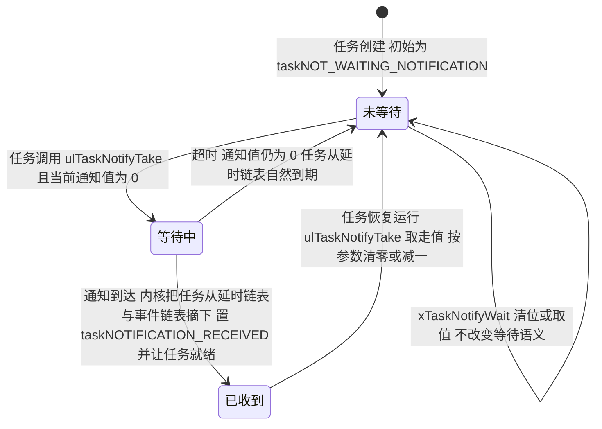
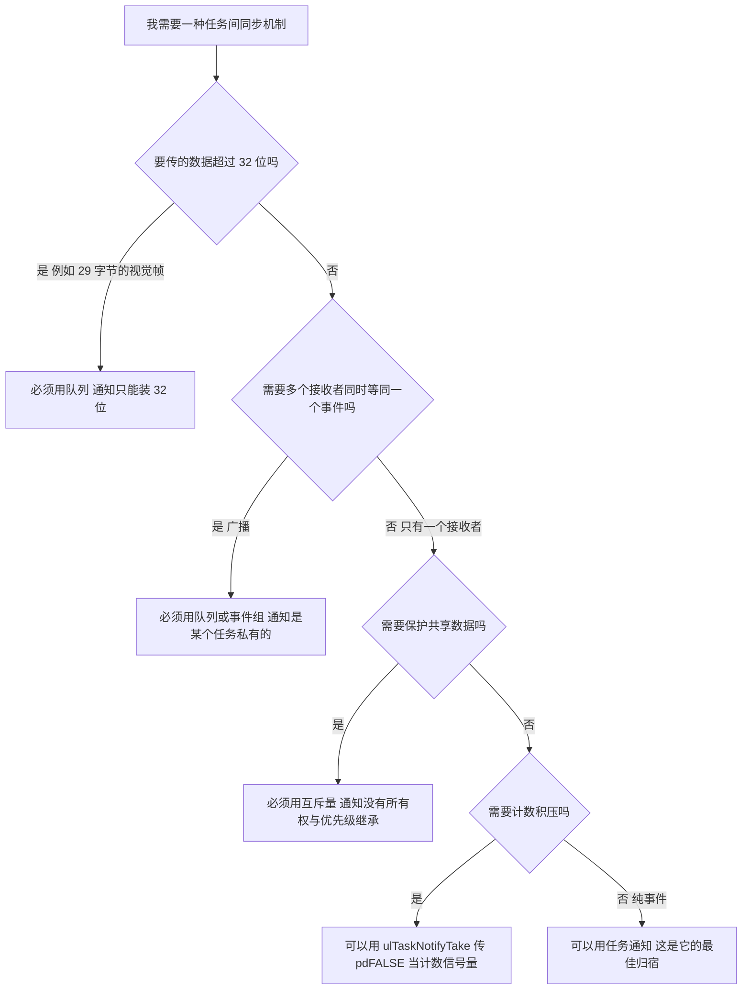
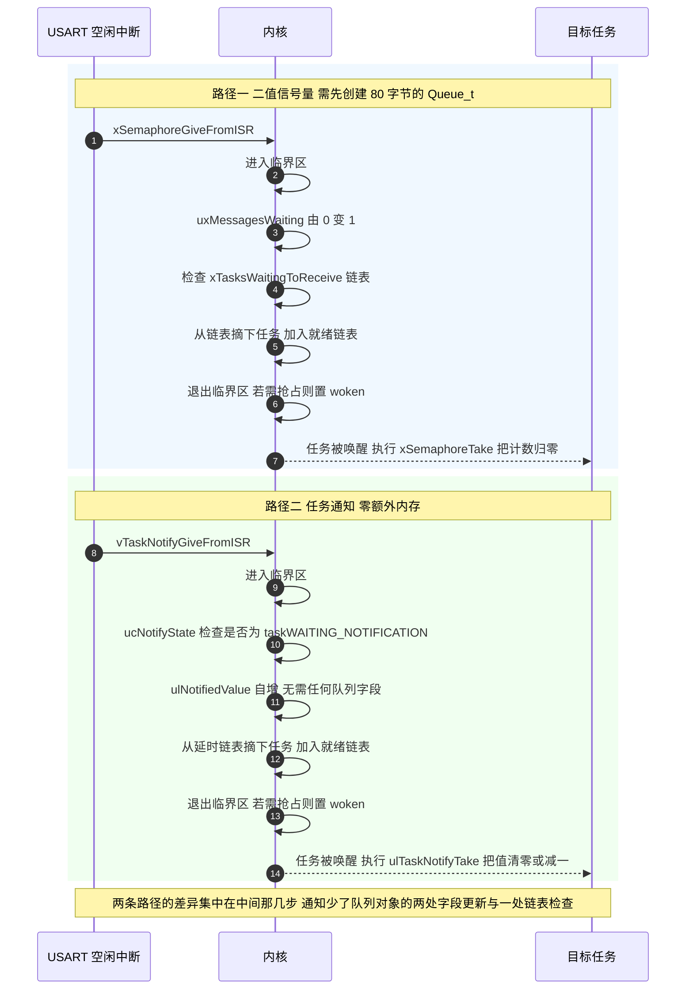

# 任务通知 Task Notification

> 任务通知（Task Notification）是 FreeRTOS 里唯一一个不创建任何内核对象的 IPC 原语。它把"通知值"直接存进目标任务的任务控制块 TCB（Task Control Block）里，用的时候取出来，不用的时候不额外占一个字节——因为那个字节本来就是 TCB 的一部分。
>
> 本工程没有使用它。但构建产物里它的函数全都在：`build/Debug/sentriomeni2026.map` 里有 `.text.ulTaskNotifyTake`、`.text.vTaskNotifyGiveFromISR`、`.text.xTaskGenericNotify`、`.text.xTaskGenericNotifyFromISR`、`.text.xTaskNotifyWait`、`.text.xTaskNotifyStateClear`、`.text.ulTaskNotifyValueClear`。原因是 `configUSE_TASK_NOTIFICATIONS` 在本工程没有被显式定义，于是取 `FreeRTOS.h:833-835` 的默认值 1。也就是说：它随时可用，只是没人用。

---

## 1. 原理：同步信息藏在 TCB 里

### 1.1 只有两个字段

`Source/tasks.c:310-313` 的 TCB 结构里：

```c
#if( configUSE_TASK_NOTIFICATIONS == 1 )
    volatile uint32_t ulNotifiedValue;
    volatile uint8_t ucNotifyState;
#endif
```

一共 5 字节（4 + 1，加上结构体对齐实际占用会并入 TCB 的填充）。这就是任务通知的全部存储成本。

对比一下第 1、2 篇算出的数字：

| 原语 | 额外堆占用 | 需要 `pvPortMalloc` | 本工程是否可用 |
| --- | --- | --- | --- |
| 任务通知 | 0 字节（复用 TCB） | 否 | 是（默认开启） |
| 二值信号量 | 80 字节 | 是 | 是 |
| 互斥量 | 80 字节 | 是 | 是 |
| 计数信号量 | 80 字节 | 是 | 否 |
| `usbRxQueue`（128 字节） | 208 字节 | 是 | 是 |

### 1.2 `ucNotifyState` 是一个三态机

`tasks.c:67-70`：

```c
/* Values that can be assigned to the ucNotifyState member of the TCB. */
#define taskNOT_WAITING_NOTIFICATION    ( ( uint8_t ) 0 )
#define taskWAITING_NOTIFICATION        ( ( uint8_t ) 1 )
#define taskNOTIFICATION_RECEIVED       ( ( uint8_t ) 2 )
```

它和 `ulNotifiedValue` 一起构成发送方与接收方之间的"握手协议"：



"已收到"这一态的作用是让内核能区分"通知在等待之前到达"和"通知在等待期间到达"。前者只需要累加 `ulNotifiedValue`，后者还额外要把任务从阻塞态里捞出来。这个区分用一个字节就完成了，也是任务通知比信号量便宜的根本原因：信号量必须用一个完整的 `Queue_t`（含两个 `List_t`）来表达同样的信息。

### 1.3 发送侧做了什么

`xTaskGenericNotify()`（`tasks.c:4783-4885`）的核心只有三件事：

```c
pxTCB = xTaskToNotify;
taskENTER_CRITICAL();
{
    ucOriginalNotifyState = pxTCB->ucNotifyState;

    /* ① 按 eAction 更新 pxTCB->ulNotifiedValue */
    switch( eAction ) { case eSetBits: ... case eIncrement: ... }

    /* ② 如果对方正在等，就把它弄就绪 */
    if( ucOriginalNotifyState == taskWAITING_NOTIFICATION )
    {
        listREMOVE_ITEM( &( pxTCB->xStateListItem ) );
        prvAddTaskToReadyList( pxTCB );
        pxTCB->ucNotifyState = taskNOTIFICATION_RECEIVED;

        /* ③ 对方优先级更高就立刻让出 CPU */
        if( pxTCB->uxPriority > pxCurrentTCB->uxPriority )
        {
            taskYIELD_IF_USING_PREEMPTION();
        }
    }
}
taskEXIT_CRITICAL();
```

对比队列的发送路径：`xQueueGenericSend` 要先算环形写指针、`memcpy` 元素、递增 `uxMessagesWaiting`，再检查 `xTasksWaitingToReceive` 链表、必要时还要处理 `cRxLock/cTxLock`。任务通知把这一整套都省掉了，它没有缓冲区要搬，没有链表要挂（除非对方在等）。

这就是"通知更快"的量化含义：省掉了元素拷贝 + 队列对象的字段更新 + 一次链表操作。官方文档给出的量级是"比二值信号量快约 45%"，本页不重复那个数字，因为本工程没有在这块板子上实测过；机制上的差异就是上面这些。

---

## 2. API：五种动作 + 两种退出语义

### 2.1 发送方的五种动作（`task.h:92-97`）

```c
typedef enum
{
    eNoAction = 0,              /* Notify the task without updating its notify value. */
    eSetBits,                   /* Set bits in the task's notification value. */
    eIncrement,                 /* Increment the task's notification value. */
    eSetValueWithOverwrite,     /* Set the value even if the previous value has not yet been read. */
    eSetValueWithoutOverwrite   /* Set the value only if the previous value has been read. */
} eNotifyAction;
```

| 动作 | 语义 | 类比 | 本工程可能用在哪 |
| --- | --- | --- | --- |
| `eNoAction` | 只唤醒，不改值 | 纯二值信号量 | "有新数据了，去取" |
| `eIncrement` | 值 +1 | 计数信号量 | 中断计数，`xTaskNotifyGive` 走这条 |
| `eSetBits` | 按位或 | 事件组（Event Group） | 位标志：`BIT_IMU_READY` \| `BIT_VISION_OK` |
| `eSetValueWithOverwrite` | 直接赋值，不管旧值读没读 | 覆写式寄存器 | 传一个 16 位的 `TotalAmmoShooted` |
| `eSetValueWithoutOverwrite` | 旧值未被读则失败（返回 `pdFAIL`） | 有背压的单槽队列 | 不想丢任何一次采样时 |

`eIncrement` 有专用宏，也是最常用的形式（`task.h:2067`）：

```c
#define xTaskNotifyGive( xTaskToNotify ) \
        xTaskGenericNotify( ( xTaskToNotify ), ( 0 ), eIncrement, NULL )

/* 中断版本是独立函数（不是宏），因为要处理 yield 语义 */
void vTaskNotifyGiveFromISR( TaskHandle_t xTaskToNotify,
                             BaseType_t *pxHigherPriorityTaskWoken );   /* tasks.c:5026 */
```

### 2.2 接收方的两种退出语义（`tasks.c:4635-4692`）

```c
uint32_t ulTaskNotifyTake( BaseType_t xClearCountOnExit, TickType_t xTicksToWait )
{
    /* ... 若当前 ulNotifiedValue == 0 则进入阻塞 ... */

    ulReturn = pxCurrentTCB->ulNotifiedValue;
    if( ulReturn != 0UL )
    {
        if( xClearCountOnExit != pdFALSE )
        {
            pxCurrentTCB->ulNotifiedValue = 0UL;              /* 清零 */
        }
        else
        {
            pxCurrentTCB->ulNotifiedValue = ulReturn - 1U;    /* 减一 */
        }
    }
    pxCurrentTCB->ucNotifyState = taskNOT_WAITING_NOTIFICATION;
    return ulReturn;
}
```

| 参数 | 行为 | 等价于 |
| --- | --- | --- |
| `xClearCountOnExit = pdTRUE` | 退出时清零 | 二值信号量 |
| `xClearCountOnExit = pdFALSE` | 退出时减一 | 计数信号量 |

注意返回值：它返回的是"取走之前"的值。`ulTaskNotifyTake(pdTRUE, portMAX_DELAY) != 0` 才是"收到了通知"的正确判断；只关心有没有时用 `pdTRUE` 版本，此时返回值非 0 恒成立。计数模式下返回 2 表示积压了 2 次事件，这是一个免费的积压深度指示器，信号量没有这个便利。

### 2.3 阻塞与超时：一个需要区分的差异

`ulTaskNotifyTake` 的阻塞不进事件链表，它用的是延时链表（`prvAddCurrentTaskToDelayedList`）：

```c
if( xTicksToWait > ( TickType_t ) 0 )
{
    prvAddCurrentTaskToDelayedList( xTicksToWait, pdTRUE );
    portYIELD_WITHIN_API();
}
```

这带来一个重要后果：`portMAX_DELAY` 在任务通知里是"真无限"，而在信号量里依赖 `INCLUDE_vTaskSuspend == 1` 才能无限。本工程 `INCLUDE_vTaskSuspend = 1`（`FreeRTOSConfig.h:88`），所以两者行为一致。

---

## 3. 本工程可用的三个候选场景

### 候选 A：`ImuTask` → `GimbalTask` 的"新数据就绪"

`ImuTask` 每 1 ms 完成一次 BMI088 读取 + AHRS 融合，产出 `q`、`gyro[3]`、`roll/pitch/yaw`（`ImuTask.cpp:43-77`）。`GimbalTask` 在同一个 1 ms 节奏上做 PID（`GimbalTask.cpp:104` 的 `osDelay(1)`）。

两者现在是"各跑各的 1 ms 周期"，靠时间片对齐，没有任何同步关系。改成通知驱动后：

```cpp
/* ImuTask 末尾，融合完成之后 */
extern TaskHandle_t gimbal_task_handle;   /* 在 StartGimbalTask_Init 里保存 */

void StartImuTask::run() {
    /* ... 初始化 ... */
    for (;;) {
        BMI088_Read(gyro, accel, &temp);
        ahrs.update(gyro[0], gyro[1], gyro[2], accel[0], accel[1], accel[2]);
        q = ahrs.getQuaternion();
        /* ... 欧拉角计算 ... */

        if (gimbal_task_handle != NULL) {
            xTaskNotifyGive(gimbal_task_handle);   /* 零字节成本，比 Give 信号量便宜 */
        }
        DWT_Delay_ms(1);
    }
}

void StartGimbalTask::run() {
    for (;;) {
        /* 阻塞等 IMU 通知；被唤醒即意味着 gyro/yaw/pitch 已被更新 */
        if (ulTaskNotifyTake(pdTRUE, pdMS_TO_TICKS(5)) != 0) {
            /* ... 原来的 PID 计算 ... */
        } else {
            /* 5 ms 没等到 IMU，说明 ImuTask 掉链子了 —— 这是免费的看门狗！ */
            imu_timeout_cnt++;
        }
    }
}
```

这个改造带来两件事：① 控制周期与 IMU 采样周期严格对齐，消除了"用旧数据算新 PID"的抖动；② 超时返回天然成为一个"IMU 任务健康度"探针。

但必须说清它的前提：本工程所有任务都是 FreeRTOS 优先级 3。在同一个优先级上，任务通知不会带来任何抢占收益——`GimbalTask` 被唤醒后不会立刻运行，仍要等当前任务让出 CPU 或时间片走完。所以这个改造的收益是"语义清晰 + 对齐周期 + 超时探针"，不是"更低的延迟"。要让通知发挥全部威力，必须先把 `GimbalTask` 提到比 `ImuTask` 更高的优先级——而那会引入第 4 篇讨论的优先级反转风险。这两个改动必须一起做，或者都不做。

### 候选 B：中断 → 任务的"单事件"通知

例如裁判系统（`referee`）在 UART 空闲中断里收完一整帧后通知解析任务。这种场景不传数据、只传"事件发生了"，是任务通知的最佳归宿：

```c
/* 中断里：注意必须用 FromISR 版本 */
void Referee_Uart_Idle_ISR(void) {
    BaseType_t xHigherPriorityTaskWoken = pdFALSE;
    vTaskNotifyGiveFromISR(referee_task_handle, &xHigherPriorityTaskWoken);
    portYIELD_FROM_ISR(xHigherPriorityTaskWoken);
}

/* 任务里 */
void StartRefereeTask::run() {
    for (;;) {
        if (ulTaskNotifyTake(pdTRUE, portMAX_DELAY) != 0) {
            referee_decode(rx_dma_buffer, rx_len);
        }
    }
}
```

这里的收益很实在：省掉 80 字节的信号量内存 + 一次队列对象的字段更新，而语义与二值信号量完全等价。

### 候选 C：跨任务传一个 16 位标量

`UsbConnectTask` 需要把 `TotalAmmoShooted`（`uint16_t`）和 `AmmoSpeed`（`float`）发给视觉（`UsbConnectTask.cpp:84-85`）。这些量"只看最新值、丢了也没关系"，正好适合 `eSetValueWithOverwrite`：

```c
/* FireTask 侧：子弹打出一发就更新一次 */
xTaskNotify(usb_task_handle, (uint32_t)TotalAmmoShooted, eSetValueWithOverwrite);

/* UsbConnectTask 侧：不阻塞地取最新值，取不到也要继续发上一帧 */
uint32_t ammo_now;
if (ulTaskNotifyTake(pdTRUE, 0) != 0) {
    /* 这里的返回值就是刚写进去的 TotalAmmoShooted */
    /* 注意：ulTaskNotifyTake 会把值清 0，所以下面要立刻存一份 */
}
```

> 候选 C 有一个问题：`ulTaskNotifyTake` 是消费式的，它把值清零或减一。用通知传当前值时，语义与事件计数不匹配（调用方没法区分"值是 0"和"值没变"）。要传状态值，正确工具是 `xTaskNotifyWait()` 配合 `eSetValueWithOverwrite`，或者干脆用一个长度为 1 的队列。这一点第 4 节会详述。

---

## 4. 什么时候不能替代队列 / 信号量

任务通知被过度使用会带来隐蔽的 bug，因为它的便宜是有代价的：



逐条展开：

### 4.1 载荷不能超过 32 位：`usbRxQueue` 就是反例

`ulNotifiedValue` 是 `uint32_t`，这是硬上限。视觉→云台一帧是 29 字节（`usb_protocol.h:20`），云台→视觉一帧 43 字节（:21）。把它们塞进 32 位是不可能的。

把指针当通知值传出去是错的，而且错得严重：

```c
/* 危险写法：ISR 里把 DMA 缓冲地址当通知值发出去 */
vTaskNotifyGiveFromISR(task, &woken);          /* 值=0，没用 */
xTaskNotifyFromISR(task, (uint32_t)&dma_buf, eSetValueWithOverwrite, &woken);
```

指针的有效性必须由外部机制保证（缓冲区不被覆写、生命周期覆盖消费时刻）。在 USB 场景里 `CDC_Receive_FS` 的 `Buf` 是 USBD 驱动管理的缓冲区，`USBD_CDC_SetRxBuffer(&hUsbDeviceFS, Buf); USBD_CDC_ReceivePacket(...)` 之后就会被复用，指针一发出就悬空了。这正是"队列按值拷贝"存在的意义。

### 4.2 只能有一个等待者，无法广播

任务通知是任务私有的：接收对象是某个具体的 `TaskHandle_t`。若有 3 个任务都想在"IMU 出新数据"时动作，就必须对 3 个 handle 各发一次通知：

```c
xTaskNotifyGive(task_a);
xTaskNotifyGive(task_b);
xTaskNotifyGive(task_c);   /* 三次调用，且三份通知值 */
```

而一个二值信号量给一次，三个等待者会被依次唤醒（每次 `Give` 唤醒一个）。语义不同，别混用。

### 4.3 没有所有权，不能当互斥量

任务通知没有"持有者"概念：任何任务/中断都能给任何任务发通知，也不需要"先 Take 再 Give"。因此：

- 不能保护共享数据（没有互斥语义）；
- 没有优先级继承（没有可继承的 holder 记录）。

### 4.4 `configTASK_NOTIFICATION_ARRAY_ENTRIES` 在本版本里不存在

FreeRTOS 从 10.4.0 起支持"每个任务多个通知槽"（`xTaskNotifyIndexed` 等 `*Indexed` API + `configTASK_NOTIFICATION_ARRAY_ENTRIES`）。本工程用的是 V10.3.1，在 `task.h` 和 `FreeRTOS.h` 里搜索 `configTASK_NOTIFICATION_ARRAY_ENTRIES` 为零命中，`tasks.c` 里也只有单个 `ulNotifiedValue`。

这意味着本工程每个任务只有 1 个通知槽。若需要两路独立的通知（例如"IMU 就绪"和"视觉帧到达"都发给 `GimbalTask`），一个槽不够；除非用 `eSetBits` 把它们编码成不同的位，但那会把"值"和"标志"混在同一个 32 位空间里，容易冲突。升级到 10.4+ 或在 10.3.1 里改用事件组（Event Group）是两条出路。

### 4.5 接收侧不能从 ISR 调用

这一点容易被忽略：发送可以从 ISR（`vTaskNotifyGiveFromISR` / `xTaskNotifyFromISR`），接收不行。没有 `ulTaskNotifyTakeFromISR` 这样的 API，因为"等待"本身就意味着阻塞，而 ISR 不能阻塞。

对应的合法替代是 `xTaskNotifyWait(0, 0, &value, 0)`：它可以在任务里非阻塞地查询。但在 ISR 里没有等价物；若数据流是"中断产生、中断消费"，那根本不该用任何任务级 IPC。

### 4.6 `eNoAction` 与"忘记检查返回值"的组合问题

`xTaskNotify(h, 0, eNoAction)` 只置 `ucNotifyState`，不改 `ulNotifiedValue`。于是 `ulTaskNotifyTake(pdTRUE, portMAX_DELAY)` 在收到这种通知后返回的值是 0。若用 `if (ulTaskNotifyTake(...)) ` 判断"收到没收到"，会把一次成功的通知判成失败。

正确写法（区分"用 eIncrement"和"用 eNoAction"）：

```c
/* 若发送方用 xTaskNotifyGive（即 eIncrement），返回值必然 >= 1 */
if (ulTaskNotifyTake(pdTRUE, portMAX_DELAY) != 0) { /* 收到 */ }

/* 若发送方用 eNoAction 或 eSetValueWithOverwrite，必须用 xTaskNotifyWait 判断状态 */
uint32_t value = 0;
if (xTaskNotifyWait(0, 0, &value, portMAX_DELAY) == pdTRUE) { /* 收到，value 是通知值 */ }
```

`xTaskNotifyWait(ulBitsToClearOnEntry, ulBitsToClearOnExit, pulNotificationValue, xTicksToWait)` 才是"既关心事件又关心值"的正确 API，它的返回 `pdTRUE/pdFALSE` 才是可靠的"收到没"判据。

---

## 5. 一条完整的对比时序

下面把"中断通知任务"这件事在两种原语下的路径并排画出来。注意信号量路径多出的 `Queue_t` 字段更新，就是任务通知省下的东西：



---

## 6. 常见易错点清单

| # | 易错点 | 后果 | 正确做法 |
| --- | --- | --- | --- |
| 1 | 用 `eNoAction` 发送，却用 `if (ulTaskNotifyTake(...))` 判断 | 返回值为 0，把成功判成失败 | 发送用 `xTaskNotifyGive`（`eIncrement`），或接收改用 `xTaskNotifyWait` |
| 2 | 以为可以传指针（"反正 32 位够"） | 队列/驱动缓冲区被复用后悬空指针 | 超过 32 位的数据用队列按值拷贝 |
| 3 | 以为一个通知能让多个任务都收到 | 只有一个任务被唤醒 | 广播场景用队列或事件组 |
| 4 | 用通知保护共享数据 | 无互斥语义，无优先级继承 | 用互斥量 |
| 5 | 在 ISR 里等通知 | 没有 `ulTaskNotifyTakeFromISR`，编译期就会报错 | ISR 只发送不接收 |
| 6 | 以为通知值可以当"状态寄存器"读 | `ulTaskNotifyTake` 是消费式的，清零/减一 | 状态值用 `xTaskNotifyWait` + `eSetValueWithOverwrite` |
| 7 | 期待多通知槽 | 10.3.1 只有 1 个槽，`configTASK_NOTIFICATION_ARRAY_ENTRIES` 不存在 | 多路事件用 `eSetBits` 或改用事件组 |
| 8 | 忘记 `taskENTER_CRITICAL` 的代价 | 通知发送本身在临界区 Critical Section 内，不可重入地长时间持有 | 别在通知里做重活 |
| 9 | 提了接收任务优先级却保留共享全局变量 | 立刻产生优先级反转风险 | 见第 4 篇 |
| 10 | 认为"零内存"就是"零成本" | 每个任务的 TCB 都多 5 字节（`configUSE_TASK_NOTIFICATIONS = 1` 时） | 若完全不用，可在 `FreeRTOSConfig.h` 里 `#define configUSE_TASK_NOTIFICATIONS 0` 省下这 5 字节 × 任务数 |

> 第 10 条是可以量化的：本工程 6 个任务的 TCB 每个 84 字节（实测：`nm` 显示 `xIdleTaskTCBBuffer` 大小 `0x54 = 84`），其中包含通知用的 5 字节。关掉 `configUSE_TASK_NOTIFICATIONS` 大约能省 6 × 5 ≈ 30 字节（受对齐影响实际可能为 0，因为 TCB 的对齐填充可能本来就吸收掉了这 5 字节）。省下的 RAM 微乎其微，收益远小于失去一个调试利器的代价——所以本工程保持默认开启是合理的选择。

---

## 7. 小结

### 7.1 核心概念

- 任务通知的做法是把同步状态放进 TCB。两个字段（`ulNotifiedValue` 4 字节 + `ucNotifyState` 1 字节）承担了二值信号量、计数信号量、轻量事件组三种语义。
- "零额外内存"来自复用而不是节省：TCB 无论如何都要分配，通知只是使用了里面本来就闲置的空间。代价是每个任务只有一个槽、载荷只有 32 位、只能有一个等待者。
- `eNotifyAction` 的五种取值决定了接收侧该用哪个 API：用 `eIncrement` 配 `ulTaskNotifyTake`；用 `eSetValue*` 或 `eNoAction` 配 `xTaskNotifyWait`。配错不会编译报错，只会静默给出错误结果。
- 本工程所有任务同优先级，所以任务通知的收益是"语义与内存"，不是"延迟"。想要延迟收益必须同时改优先级，而那会引入反转风险。
- `usbRxQueue` 不能被任务通知替代，因为一帧 29 字节超过 32 位，且 USB 驱动缓冲区不能被当作稳定载荷传递。

### 7.2 设计权衡

| 权衡点 | 任务通知 | 二值信号量 | 队列 `usbRxQueue` |
| --- | --- | --- | --- |
| 内存 | 0 | 80 B | 208 B |
| 载荷 | 32 位 | 无 | 128 字节（4.4 帧） |
| 等待者数量 | 1 | 多个 | 多个 |
| 广播 | 不支持 | 不支持（需逐个 Give） | 单个元素只唤醒一个 |
| ISR 可发送 | 是 | 是 | 是 |
| ISR 可接收 | 否 | 是（`xSemaphoreTakeFromISR`） | 是（`xQueueReceiveFromISR`） |
| 能否保护共享数据 | 否 | 否（无继承） | 否 |
| 计数积压 | 支持（`pdFALSE`） | 二值版不支持 | 天然支持 |
| 多路事件 | 需挤进同一个 32 位 | 需多个对象 | 需多个队列 |
| 本工程现状 | 可用未用 | 可用未用 | 唯一在用 |

小结：任务通知适合"一个事件、一个接收者、载荷不超过 32 位、不需要所有权"的场景，而这些场景本工程目前都没有。它的价值会在两个时机显现：① 给某个任务提了优先级、需要最低延迟的唤醒；② 想给系统加"任务健康度看门狗"（利用 `ulTaskNotifyTake` 的超时返回）。在这两件事发生之前，引入任务通知只会增加代码复杂度而不带来收益。

---

## 8. 练习题

### 基础题

1. 等价替换。写出与 `xSemaphoreCreateBinary()` + `xSemaphoreGiveFromISR` + `xSemaphoreTake(portMAX_DELAY)` 完全等价的"任务通知"版本代码（三处都要写），并说明需要保存什么额外变量。
2. 判断语义。某任务收到 3 次 `xTaskNotifyGive`，然后调用 `ulTaskNotifyTake(pdFALSE, 0)` 三次。每次的返回值分别是多少？如果换成 `pdTRUE`，结果是什么？
3. 返回值判断。解释为什么 `if (ulTaskNotifyTake(pdTRUE, portMAX_DELAY))` 在接收 `eNoAction` 通知时会判断失败，并给出两种修法。
4. 内存占用核算。本工程 6 个任务，TCB 各 84 字节。若把 `configUSE_TASK_NOTIFICATIONS` 设为 0，请给出理论上最多能省的字节数，并说明实际可能只省 0 字节的原因。（提示：结构体对齐）

### 挑战题

5. 给本工程加一个"IMU 健康度看门狗"。用任务通知 + `ulTaskNotifyTake` 的超时返回实现：要求能统计"IMU 超时次数"与"最长连续超时"，在 `GimbalTask` 里触发后不阻塞控制循环，并说明为什么这个方案比"在 `GimbalTask` 里读 `HAL_GetTick()` 差值"更可靠。
6. 一个槽塞两路事件。在 V10.3.1（单通知槽）下，如何用 `eSetBits` 让 `GimbalTask` 同时响应"IMU 就绪"和"视觉帧到达"两路事件？请给出位分配、发送侧两种写法、接收侧 `xTaskNotifyWait` 的清位策略，并分析这种设计在什么情况下会出错。
7. 升级到多通知槽。描述从 V10.3.1 升级到 10.4+ 才能获得的 `xTaskNotifyIndexed` 系列 API 的语义差异，并说明升级会带来哪些需要回归测试的风险点（提示：`uxTaskGetSystemState` 的返回结构、`configTASK_NOTIFICATION_ARRAY_ENTRIES` 的默认值、以及现有 `ulTaskNotifyTake` 的行为是否改变）。

---

### 附：本页引用的固件路径

| 路径 | 用途 |
| --- | --- |
| `/home/wyx/rm/2026SentriOmeniGimbal/2026OmniSentryGimbal/Middlewares/Third_Party/FreeRTOS/Source/tasks.c` | 通知状态常量（:67-70）、TCB 字段（:310-313）、`ulTaskNotifyTake`（:4635-4692）、`xTaskGenericNotify`（:4783-4885）、`vTaskNotifyGiveFromISR`（:5026） |
| `/home/wyx/rm/2026SentriOmeniGimbal/2026OmniSentryGimbal/Middlewares/Third_Party/FreeRTOS/Source/include/task.h` | `eNotifyAction` 枚举（:92-97）、`xTaskNotifyGive` 宏（:2067）、`xTaskNotify` / `xTaskNotifyFromISR` 宏（:1854、:1945） |
| `/home/wyx/rm/2026SentriOmeniGimbal/2026OmniSentryGimbal/Middlewares/Third_Party/FreeRTOS/Source/include/FreeRTOS.h` | `configUSE_TASK_NOTIFICATIONS` 默认 1（:833-835）、`configUSE_TIME_SLICING` 默认 1（:793-795） |
| `/home/wyx/rm/2026SentriOmeniGimbal/2026OmniSentryGimbal/Task/Src/ImuTask.cpp` | 1 ms 周期的数据产出（:43-77）、任务创建（:112） |
| `/home/wyx/rm/2026SentriOmeniGimbal/2026OmniSentryGimbal/Task/Src/GimbalTask.cpp` | 1 ms 周期的 PID 控制（:46-105）、任务创建（:120） |
| `/home/wyx/rm/2026SentriOmeniGimbal/2026OmniSentryGimbal/Task/Src/UsbConnectTask.cpp` | `TotalAmmoShooted` / `AmmoSpeed` 的使用（:84-85） |
| `/home/wyx/rm/2026SentriOmeniGimbal/2026OmniSentryGimbal/Communication/Inc/usb_protocol.h` | 帧长 29 / 43 与 `static_assert`（:20-77） |
| `/home/wyx/rm/2026SentriOmeniGimbal/2026OmniSentryGimbal/build/Debug/sentriomeni2026.map` | `ulTaskNotifyTake` / `vTaskNotifyGiveFromISR` 已编译、`configTASK_NOTIFICATION_ARRAY_ENTRIES` 不存在的实测证据 |
