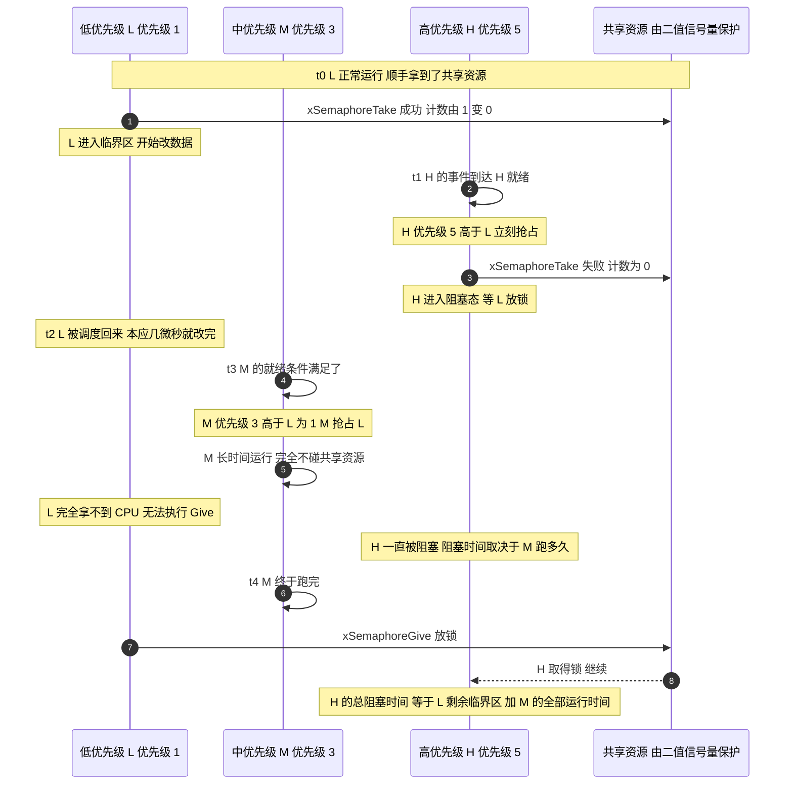
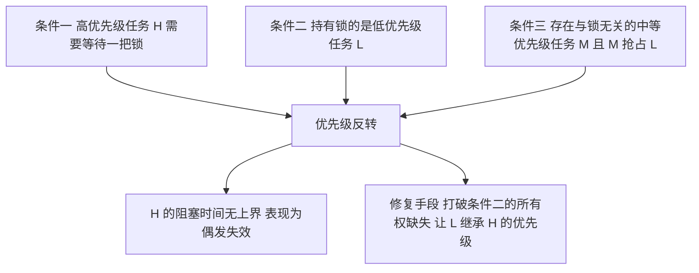
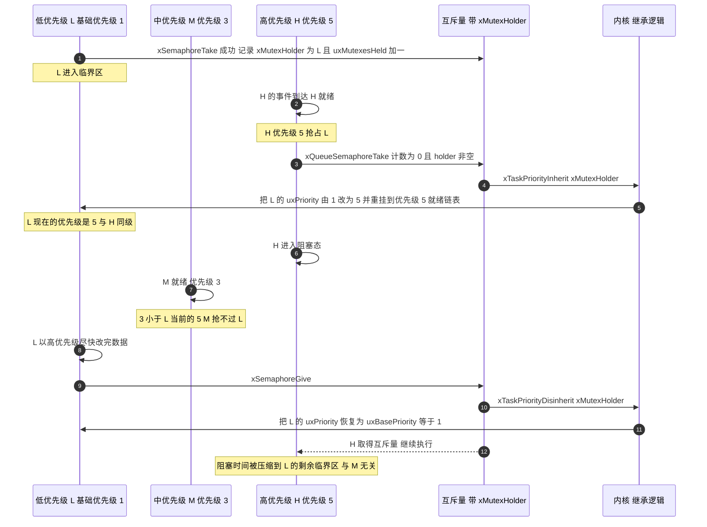
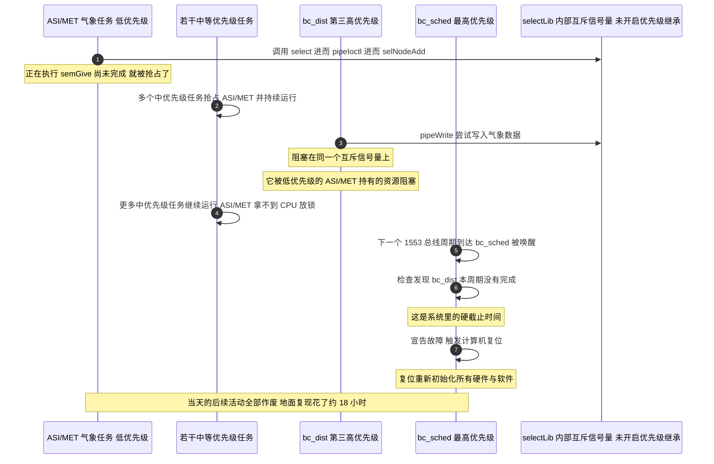
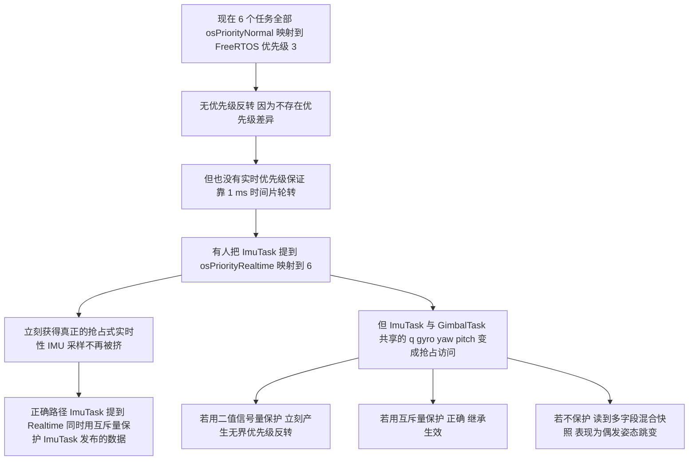

# 优先级反转与优先级继承

> 优先级反转（Priority Inversion）是一类"代码完全正确、逻辑没有 bug、但系统仍然会失效"的实时系统故障。它不需要任何一行代码写错：只要"高优先级任务会等一把锁"、"拿锁的是低优先级任务"、"中间存在一个与锁无关的中等优先级任务"这三个条件同时成立，故障就会发生。
>
> 本工程目前不会发生它，因为 6 个任务全部是同一个 FreeRTOS 优先级（下一节会给出实测映射）。但这也意味着本工程实际上没有实际的实时优先级体系，一旦有人开始区分优先级，本页的所有内容立刻从理论变成必须遵守的约束。

---

## 1. 三个任务的最小模型

为了把问题说清楚，只保留三个任务和一个共享资源：

| 任务 | 名字 | 优先级（数值越大越高） | 行为 |
| --- | --- | --- | --- |
| L | 低优先级任务 | 1 | 周期性地获取共享资源 → 改数据 → 释放。临界区 Critical Section 很短（本应几微秒） |
| M | 中优先级任务 | 3 | 与共享资源毫无关系，但计算量大、运行时间长 |
| H | 高优先级任务 | 5 | 也需要同一个共享资源，有硬截止时间 |

注意 M 与这个共享资源没有任何关系。这是优先级反转的异常之处：一个不碰锁的任务成了阻断高优先级任务的原因。

### 1.1 无界优先级反转的时序

使用二值信号量（注意是信号量，不是互斥量）保护共享资源：



在这个时序里，H 的阻塞时间是：

$$T_{\text{H,block}} = T_{L,\text{剩余临界区}} + T_{M} + \cdots$$

$T_M$ 这一项是无界的：它取决于 M 要跑多久、M 会被唤醒几次、在这期间还有多少个别的中等优先级任务被唤醒。理论上 $T_M \to \infty$。这叫做无界优先级反转（Unbounded Priority Inversion），是实时系统里最严重的一类故障：它会表现为"偶发、无法复现、负载高时才出现"。

### 1.2 三个必要条件

故障发生当且仅当以下三条同时成立：



只有打破"条件二"能根治：条件一是业务需求（高优先级任务确实要访问共享数据），条件三是系统负载（中等优先级任务的存在无法禁止）。所以唯一的出路是：让 L 在持有锁期间，暂时拥有 H 的优先级，这样 M（优先级 3）就抢不过"变成优先级 5 的 L"了。这就是优先级继承。

---

## 2. 二值信号量无法支持继承的原因

上一页讲过二值信号量没有所有权。把结论落到代码上可以看出，它在数据结构层面就不可能支持优先级继承。

### 2.1 二值信号量缺少承载体

二值信号量的创建路径（`include/semphr.h:162`）：

```c
#define xSemaphoreCreateBinary() \
    xQueueGenericCreate( ( UBaseType_t ) 1, semSEMAPHORE_QUEUE_ITEM_LENGTH, queueQUEUE_TYPE_BINARY_SEMAPHORE )
```

它的类型标签是 `queueQUEUE_TYPE_BINARY_SEMAPHORE`，不是 `queueQUEUE_IS_MUTEX`。而整个内核里，唯一能写入 `xMutexHolder` 的地方只有这一处（`queue.c:1465-1474`）：

```c
#if ( configUSE_MUTEXES == 1 )
{
    if( pxQueue->uxQueueType == queueQUEUE_IS_MUTEX )     /* ← 这里！二值信号量永远进不来 */
    {
        pxQueue->u.xSemaphore.xMutexHolder = pvTaskIncrementMutexHeldCount();
    }
}
#endif
```

而优先级继承的唯一调用点又长这样（`queue.c:1554-1562`）：

```c
if( pxQueue->uxQueueType == queueQUEUE_IS_MUTEX )
{
    taskENTER_CRITICAL();
    {
        xInheritanceOccurred = xTaskPriorityInherit( pxQueue->u.xSemaphore.xMutexHolder );
    }
    taskEXIT_CRITICAL();
}
```

两道 `if` 都是 `uxQueueType == queueQUEUE_IS_MUTEX`。二值信号量的类型标签永远不满足这个条件，所以：

- `xMutexHolder` 永远保持 `NULL`；
- `xTaskPriorityInherit(NULL)` 的第一句就是 `if( pxMutexHolder != NULL )`（`tasks.c:4023`），直接跳过。

"二值信号量能不能开启优先级继承"这个提法本身不成立：缺的是可以继承的字段，而不是一个开关。它唯一的机制是那个 0/1 的计数，而计数无法回答"谁该被继承"。

| 对比项 | 二值信号量 | 互斥量 |
| --- | --- | --- |
| 类型标签 | `queueQUEUE_TYPE_BINARY_SEMAPHORE` | `queueQUEUE_IS_MUTEX` |
| `xMutexHolder` 是否被写入 | 永不（保持 `NULL`） | 每次成功 Take 都写 |
| `xTaskPriorityInherit` 是否被调用 | 永不 | 阻塞前调用 |
| 优先级继承 | 不可能 | 内建，且无法关闭 |
| 释放者要求 | 任意任务/中断 | 必须是持有者 |
| 用于保护数据 | 错误用法 | 正确用法 |

关键结论：在 FreeRTOS 里，互斥量的优先级继承没有开关：`xSemaphoreCreateMutex()` 建出来的那一刻它就永久开启。这与 VxWorks 不同（VxWorks 的 `semMCreate` 有一个 `options` 参数决定是否继承），而那个差异正是火星探路者号事故的技术根源。

### 2.2 换用互斥量后的时序



---

## 3. 优先级继承的实现细节

### 3.1 两个字段

`tasks.c:262` 与 `tasks.c:280`：

```c
UBaseType_t uxPriority;        /*< The priority of the task.  0 is the lowest priority. */
...
UBaseType_t uxBasePriority;    /*< The priority last assigned to the task - used by the priority inheritance mechanism. */
```

- `uxPriority` 是"当前生效的优先级"，可能被临时抬高；
- `uxBasePriority` 是"用户当初设定的优先级"，继承结束后要恢复到它。

这两个字段必须在 TCB 里同时存在，这是优先级继承的第二个承载体。二值信号量没有 `xMutexHolder` 是第一重缺失，即便人为给任务加了 `uxBasePriority`，也没有"锁被谁持有"的信息去驱动恢复。

### 3.2 继承的条件与动作

`tasks.c:4014-4060` 的 `xTaskPriorityInherit()` 核心：

```c
BaseType_t xTaskPriorityInherit( TaskHandle_t const pxMutexHolder )
{
TCB_t * const pxMutexHolderTCB = pxMutexHolder;
BaseType_t xReturn = pdFALSE;

    if( pxMutexHolder != NULL )                     /* ① 无持有者则直接返回 */
    {
        if( pxMutexHolderTCB->uxPriority < pxCurrentTCB->uxPriority )   /* ② 只在"我比你高"时继承 */
        {
            /* 调整事件链表项的值 */
            listSET_LIST_ITEM_VALUE( &( pxMutexHolderTCB->xEventListItem ),
                ( TickType_t ) configMAX_PRIORITIES - ( TickType_t ) pxCurrentTCB->uxPriority );

            /* ③ 若持有者当前在就绪链表里 要先摘出来 */
            if( listIS_CONTAINED_WITHIN( &( pxReadyTasksLists[ pxMutexHolderTCB->uxPriority ] ),
                                         &( pxMutexHolderTCB->xStateListItem ) ) != pdFALSE )
            {
                uxListRemove( &( pxMutexHolderTCB->xStateListItem ) );
                portRESET_READY_PRIORITY( pxMutexHolderTCB->uxPriority, uxTopReadyPriority );
                ...
            }

            /* ④ 真正抬高优先级 */
            pxMutexHolderTCB->uxPriority = pxCurrentTCB->uxPriority;
            prvAddTaskToReadyList( pxMutexHolderTCB );

            xReturn = pdTRUE;
        }
    }
    return xReturn;
}
```

四个动作缺一不可，其中 ③ 需要注意：因为 FreeRTOS 的就绪任务是按优先级分链表的（`pxReadyTasksLists[uxPriority]`），一旦 `uxPriority` 变了，任务必须从旧链表摘下来、挂到新链表。这也解释了 `configUSE_PORT_OPTIMISED_TASK_SELECTION = 1`（`FreeRTOSConfig.h:70`）在这里的作用：它用一条 `CLZ`（计数前导零）指令从位图中找出最高就绪优先级，而不是遍历 7 个链表，优先级继承的额外开销因此很小。

### 3.3 恢复的条件更严苛

`tasks.c:4100-4145` 的 `xTaskPriorityDisinherit()`：

```c
BaseType_t xTaskPriorityDisinherit( TaskHandle_t const pxMutexHolder )
{
TCB_t * const pxTCB = pxMutexHolder;

    if( pxMutexHolder != NULL )
    {
        /* A task can only have an inherited priority if it holds the mutex.
        If the mutex is held by a task then it cannot be given from an
        interrupt, and if a mutex is given by the holding task then it must
        be the running state task. */
        configASSERT( pxTCB == pxCurrentTCB );        /* ① 释放者必须是当前任务 */
        configASSERT( pxTCB->uxMutexesHeld );         /* ② 必须真的持有 */
        ( pxTCB->uxMutexesHeld )--;

        if( pxTCB->uxPriority != pxTCB->uxBasePriority )   /* ③ 只对"被抬过"的任务恢复 */
        {
            if( pxTCB->uxMutexesHeld == ( UBaseType_t ) 0 ) /* ④ 必须已释放全部互斥量 */
            {
                /* ... 从旧优先级链表摘出 恢复 uxPriority = uxBasePriority 再挂回 ... */
            }
        }
    }
}
```

四个检查串起来说明一件事：优先级继承的正确性完全依赖"所有权记录准确"。谁 Take 谁 Give、Give 时必须是当前任务、必须等所有互斥量都释放才恢复。

这也直接说明了为什么"在中断里操作互斥量"会彻底破坏它：中断不是 `pxCurrentTCB`，`configASSERT( pxTCB == pxCurrentTCB )` 必然失败。上一页提到，本工程的 CMSIS 包装层 `osMutexRelease()` 在 `inHandlerMode()` 时会调用 `xSemaphoreGiveFromISR()` 绕过这个断言。绕过断言的代价是优先级记录彻底失效。

### 3.4 FreeRTOS 的优先级继承不是万能的

它有三个局限：

| 局限 | 说明 | FreeRTOS 的对策 |
| --- | --- | --- |
| 链式阻塞 Chained Blocking | 若一个任务持有 N 把锁，H 可能被阻塞 N 次（每次一把锁），最坏阻塞时间是各临界区之和 | 无对策，只有 PIP 没有 PCP |
| 不防死锁 | A 等 B 的锁、B 等 A 的锁 → 永久死锁。优先级继承不能避免 | 无对策，靠编码纪律（固定加锁顺序） |
| 等待超时后的恢复 | 若阻塞方超时了，持有者不该继续保留被抬高（已无人在等待）的优先级 | 有对策：`prvGetDisinheritPriorityAfterTimeout()`（`queue.c:2050-2070`）+ `vTaskPriorityDisinheritAfterTimeout()`（`tasks.c:4184`），会把优先级降到"仍在等这把锁的最高优先级" |

第三点需要单独说明。超时路径上的注释写得很直接：

```c
/* This task blocking on the mutex caused another task to inherit this
task's priority.  Now this task has timed out the priority should be
disinherited again, but only as low as the next highest priority task
that is waiting for the same mutex. */
uxHighestWaitingPriority = prvGetDisinheritPriorityAfterTimeout( pxQueue );
vTaskPriorityDisinheritAfterTimeout( pxQueue->u.xSemaphore.xMutexHolder, uxHighestWaitingPriority );
```

这说明 `xSemaphoreTake` 带超时（而不是 `portMAX_DELAY`）时，内核要多做一次"降到哪一档"的计算。这是"超时参数"在 RTOS 里并非"免费的保险"的一个例子。

---

## 4. 产业案例研究：火星探路者号（Mars Pathfinder, 1997）

这是优先级反转最著名的真实事故。下面引用 JPL 飞行软件团队负责人 Glenn E. Reeves 在 1997 年 12 月 15 日发出的第一手说明 *"What really happened on Mars?"*（权威版本，见文末链接）。

### 4.1 硬件与软件架构

- 单 CPU + VME 总线，上面挂着无线电、相机和一块 1553 总线接口卡。1553 总线连接"巡航级"与"着陆器"两部分硬件。
- 1553 接口卡的继承设计范式是"以 8 Hz 调度活动"（每周期 0.125 s）。这个硬件约束决定了软件架构。
- 软件实现为两个任务：
  - `bc_sched`（bus scheduler）：负责为下一个 1553 周期设置事务。系统最高优先级（仅次于 VxWorks 的 `tExec` 任务）。
  - `bc_dist`（distribution）：负责收集事务结果并分发数据。第三高优先级（第二高是一个控制进入/着陆的任务）。
- 大部分任务通过双缓冲共享内存从 `bc_dist` 取数据。唯一的例外是 ASI/MET 气象科学任务，它通过 IPC 机制（VxWorks 的 `pipe()`）接收数据。
- `bc_sched` 和 `bc_dist` 每周期互相检查对方是否完成了执行。

### 4.2 故障链



Reeves 的原文对根因的表述（按原文转述）：出问题的资源是 `select()` 机制内部用于保护文件描述符"等待列表"的互斥信号量。VxWorks 的 `pipe()` 是一种支持 `select` 的设备，而他们的 IPC 正是基于 `pipe`。ASI/MET 调用 `select` → `pipeIoctl()` → `selNodeAdd()`，正在执行 `semGive()` 时被抢占，于是 `semGive` 没完成。若干中等优先级任务运行；`bc_dist` 被唤醒后通过 IPC 发送气象数据 → `pipeWrite()` → 阻塞在这个互斥信号量上。更多中等优先级任务继续运行，ASI/MET 仍得不到 CPU；直到 `bc_sched` 被唤醒，发现 `bc_dist` 未完成它的周期，宣告错误并触发复位。

### 4.3 三个容易被二手叙述搞错的细节

细节一：那个信号量是"互斥量"，但优先级继承选项没开。

Reeves 原文：

> *Once we understood the problem the fix appeared obvious: change the creation flags for the semaphore so as to enable priority inheritance.*

以及：

> *The Wind River folks, for many of their services, supply global configuration variables for parameters such as the "options" parameter for the semMCreate used by the select service... The priority inheritance option was deliberately left out by Wind River in the default selectLib() service for optimum performance.*

所以事故的根因是用了正确的类型却关掉了它的关键选项，而不是用错了信号量类型。常见的简化说法"用了二值信号量所以不支持继承"并不准确：Reeves 明确写的是 `semMCreate`（VxWorks 的互斥量创建函数）的 `options` 参数。这一点和上一节讲的 FreeRTOS 形成了有价值的对照：FreeRTOS 的 `xSemaphoreCreateMutex()` 没有这个选项，永远开启继承；VxWorks 当年有，而默认是关的。

细节二：准确的表述是系统检测到硬截止时间违反后主动复位，而不是看门狗超时复位。

原文：*The failure was identified by the spacecraft as a failure of the bc_dist task to complete its execution before the bc_sched task started. The reaction to this by the spacecraft was to reset the computer.* 很多科普文章把它写成"看门狗复位"，虽然效果相似，但机制不同：主动复位是设计好的容错策略，不是失控。

细节三：事故前已经见过，但复现不了。

原文：*We did see the problem before landing but could not get it to repeat when we tried to track it down.* 着陆后在实验室里用了不到 18 小时才复现出来，靠的是飞行软件里本来就保留着的一套 trace/log 工具（他们遵循 "test what you fly and fly what you test"）。原文里最有名的一句评价是关于工具：

> *Mike is quite correct in saying that we could not have figured this out ever if we did not have the tools to give us the insight.*

### 4.4 修复与教训

修复：修改 `selectLib` 使用的那个全局配置变量，把优先级继承选项打开。Reeves 列出了这个修复不显然的四个原因，其中两条与工程直接相关：

1. 该代码在 `selectLib()` 里、对所有设备创建通用，改全局变量会让此后创建的所有 select 信号量都带继承，无法只改"气象数据管道"那一个；
2. Wind River 当初为了性能故意默认不开继承，所以必须评估性能影响与行为变化。

教训（对嵌入式开发直接可用）：

| 教训 | 对本工程的映射 |
| --- | --- |
| COTS/中间件的默认配置必须逐项确认，"能跑"不等于"配置正确" | `configUSE_COUNTING_SEMAPHORES` 未定义 → 计数信号量静默不可用 |
| 默认值可能是为性能而非为安全选的 | `configUSE_TIME_SLICING` 默认 1、`configCHECK_FOR_STACK_OVERFLOW` 默认 0、`configUSE_TRACE_FACILITY` 默认 0 |
| 必须有"能看到现场"的工具，否则偶发故障永远查不出 | 本工程的 `configASSERT` 是"关中断死循环"，即"能看到的最坏形式"；`configUSE_TRACE_FACILITY = 0` 意味着没有 `uxTaskGetSystemState` |
| 负载越高越容易出，测试不能只跑"最好情况" | 视觉帧率与云台跟随速度取最大值时才是需要测的工况 |
| 包装层会隐藏底层语义 | 本项目 CMSIS-RTOS v1 包装把 `osMutexWait` 做成"中断里也能调" |

---

## 5. 本工程的风险评估

### 5.1 当前状态：没有优先级差异

按第 2 篇算过的映射：

$$p_{\text{FreeRTOS}} = p_{\text{CMSIS}} - p_{\text{CMSIS,Idle}} = p_{\text{CMSIS}} + 3$$

`makeFreeRtosPriority()` 全文只有三行（`cmsis_os.c:102-112`）：

```c
static unsigned portBASE_TYPE makeFreeRtosPriority (osPriority priority)
{
  unsigned portBASE_TYPE fpriority = tskIDLE_PRIORITY;
  if (priority != osPriorityError) {
    fpriority += (priority - osPriorityIdle);
  }
  return fpriority;
}
```

`osPriorityIdle = -3`（`cmsis_os.h:173`），所以：

| CMSIS 优先级 | 数值 | 映射到的 FreeRTOS 优先级 |
| --- | --- | --- |
| `osPriorityIdle` | −3 | 0（= 空闲任务） |
| `osPriorityLow` | −2 | 1 |
| `osPriorityBelowNormal` | −1 | 2 |
| `osPriorityNormal`（本工程全部 6 个任务） | 0 | 3 |
| `osPriorityAboveNormal` | +1 | 4 |
| `osPriorityHigh` | +2 | 5 |
| `osPriorityRealtime` | +3 | 6（= `configMAX_PRIORITIES − 1`） |

全部 6 个任务的创建代码都是 `osPriorityNormal`：

| 任务 | 优先级参数 | 栈（words） | 出处 |
| --- | --- | --- | --- |
| `defaultTask` | `osPriorityNormal` | 256 | `Core/Src/freertos.c:123` |
| `StartFireTask` | `osPriorityNormal` | 512 | `Task/Src/FireTask.cpp:217` |
| `imuTask` | `osPriorityNormal` | 1024 | `Task/Src/ImuTask.cpp:112` |
| `StartControlCenterTask` | `osPriorityNormal` | 1024 | `Task/Src/ControlCenterTask.cpp:149` |
| `gimbalTask` | `osPriorityNormal` | 2048 | `Task/Src/GimbalTask.cpp:120` |
| `StartUsbConnectTask` | `osPriorityNormal` | 2048 | `Task/Src/UsbConnectTask.cpp:118` |

（`StartTestTask_Init()` 定义在 `Task/Src/TestTask.cpp:30-32`，但调用被注释掉了，见 `Core/Src/freertos.c:134`，所以 `TestTask` 实际未运行。）

结论：6 个任务全在优先级 3，因此当前不存在"高优先级任务等低优先级任务"的拓扑，优先级反转不可能发生。

### 5.2 本工程同时也没有实际的实时性

另一半情况也需要说清楚。全部同优先级 + `configUSE_TIME_SLICING = 1`（默认值，本工程未覆盖，`FreeRTOS.h:793-795`）意味着：

- 任务之间只按 tick 轮转（`configTICK_RATE_HZ = 1000` → 1 ms 一片）；
- `GimbalTask` 想跑 1 ms 控制周期（`GimbalTask.cpp:104` 的 `osDelay(1)`），但它的实际调度时刻取决于同优先级队列里其他任务的排队情况；
- `ImuTask` 用的是 `DWT_Delay_ms(1)`（`ImuTask.cpp:100`），这是忙等（`BSP/Src/bsp_dwt.cpp:32-36` 就是一个 `while` 递减循环），它不让出 CPU，只能靠 tick 中断把它切走；
- 于是 6 个任务都靠"被 tick 抢走"来轮流运行。这套系统能工作，靠的是"每个任务都很短"这一隐含假设，而不是调度器的优先级保证。

### 5.3 何时会变成实际问题



具体的风险数据流（本工程真实存在的共享）：

| 共享量 | 发布者 | 订阅者 | 若 ImuTask 提优先级后的风险 |
| --- | --- | --- | --- |
| `q`（`std::array<float,4>`） | `ImuTask.cpp:60` | `UsbConnectTask.cpp:79` | 4 个 float 分 4 次写，订阅者可能读到"新 q[0] + 旧 q[3]"→ 非法四元数 → 姿态突变 |
| `gyro[3]` | `ImuTask.cpp:43`（BMI088_Read 直接写） | `GimbalTask.cpp:78,98` | 3 个分量撕裂 → PID 微分项尖峰 |
| `yaw/pitch/roll` | `ImuTask.cpp:67-69` | `ControlCenterTask.cpp:76,80`、`UsbConnectTask.cpp:80-83` | 角度与角速度来自不同时刻 → 视觉解算的目标角错 |

注意 `gyro[3]` 这一行：它是被 `BMI088_Read(gyro, accel, &temp)` 直接写入的（`ImuTask.cpp:43`），也就是说 SPI 读取过程中这 3 个 float 会逐个、跨越较长时间被覆盖。这个窗口比"任务被抢占"要宽得多：即便在 bare-metal 环境下，中断里读 `gyro` 也会拿到混合值。

---

## 6. 常见易错点清单

| # | 易错点 | 本工程的具体表现 |
| --- | --- | --- |
| 1 | 用二值信号量保护共享数据 | 无 `xMutexHolder` → 无继承 → 无界反转（第 2 节） |
| 2 | 以为"优先级继承能关闭" | FreeRTOS 互斥量的继承是内建的、无开关；VxWorks 有开关（Pathfinder 案例） |
| 3 | 以为优先级继承能防死锁 | 不能。A/B 互相等锁照样死，只有固定加锁顺序能防 |
| 4 | 以为优先级继承能防链式阻塞 | 不能。持 N 把锁可能被阻塞 N 次，只有 PCP（FreeRTOS 没有）能消除 |
| 5 | 在中断里 Give/Take 互斥量 | `xTaskPriorityDisinherit` 里 `configASSERT( pxTCB == pxCurrentTCB )` 必失败；本项目 CMSIS 包装还会"帮"调用方调用 |
| 6 | 非持有者 Give 互斥量 | 会对错误的 holder 做 disinherit，`uxBasePriority` 记录错乱 |
| 7 | 用 `xSemaphoreTake` 带超时后不检查返回值 | 超时意味着没拿到锁，此时访问共享数据等于没保护 |
| 8 | 忘记"超时后要降到次高等待者" | 内核已处理（`vTaskPriorityDisinheritAfterTimeout`），但只有 `configUSE_MUTEXES = 1` 时这段代码才存在 |
| 9 | 靠"所有任务同优先级"来回避问题，却不记录这个前提 | 本工程正是如此；一旦有人改优先级，前提失效而无人察觉 |
| 10 | 提了优先级却忘了 `configMAX_PRIORITIES = 7` 的上限 | CMSIS 的 `osPriorityRealtime` → 6 已是上限；再想提只能改 `configMAX_PRIORITIES` |
| 11 | 以为忙等不影响别人 | `DWT_Delay_ms(1)` 是忙等，在同优先级下靠 tick 才能被切走；它同时占满了 CPU |
| 12 | 没有可观测手段 | `configUSE_TRACE_FACILITY = 0`（未定义，默认 0）→ 没有 `uxTaskGetSystemState`，看不到谁在跑、谁持锁 |

---

## 7. 小结

### 7.1 核心概念

- 优先级反转 = 高优先级任务被中等优先级任务间接阻塞，且阻塞时间无上界。三个必要条件：H 要等锁、锁在 L 手里、M 能与锁无关地抢占 L。只能通过打破"所有权缺失"来根治。
- 二值信号量在数据结构层面就不可能支持优先级继承。它没有 `xMutexHolder`，而写入该字段的代码被 `uxQueueType == queueQUEUE_IS_MUTEX` 挡住。缺的是一个承载体，而不是一个开关。
- FreeRTOS 的互斥量优先级继承永久开启、无法关闭。这与 VxWorks 的 `semMCreate(options)` 形成对照：探路者号事故的根因是用了互斥量但关掉了继承选项，不是用错了锁的类型。
- 继承的动作包含四个步骤：保存 `uxBasePriority` → 改 `uxPriority` → 从旧优先级就绪链表摘出 → 挂到新链表。恢复的条件更严：释放者必须是当前任务、必须持有该锁、必须已释放全部互斥量。
- FreeRTOS 只实现了优先级继承协议（PIP），没有优先级天花板协议（PCP），所以链式阻塞与死锁仍然可能出现。
- 本工程当前无反转风险：6 个任务全在 FreeRTOS 优先级 3。代价是不存在实际的实时优先级抢占，实际靠 1 ms 时间片轮转加每个任务都很短来维持。

### 7.2 设计权衡

| 权衡点 | 现状（全同优先级） | 提出 IMU 优先级 + 互斥量 | 提出 IMU 优先级 + 无锁 |
| --- | --- | --- | --- |
| 优先级反转风险 | 无 | 无（继承生效） | 无（无锁） |
| 实时性 | 无保证，最坏延迟 = 各任务周期之和 | 好（IMU 可抢占） | 好 |
| 数据一致性 | 靠交错概率低维持 | 一致快照 | 取决于无锁设计正确性 |
| 每次访问开销 | 0 | `Take/Give` + 可能的继承/恢复（数十字节周期） | 近乎 0 |
| 引入的新风险 | — | 忘记 Give、嵌套 Take、链式阻塞 | 内存序 / 编译器重排 / 需要 `volatile` 或屏障 |
| 可验证性 | 无法验证 | 可用 `xQueueGetMutexHolder` 定位持锁者 | 难以验证，须靠形式化或代码评审 |

小结：所有任务同优先级是一个用实时性换取实现简易度的取舍。它在当前功能规模下是合理的，但只是把数据竞争从"会发生"降为"概率低"，并没有消除。做这个取舍时必须把前提写进代码注释和文档（本页就是那份文档），否则后来者在没有防备的情况下改掉优先级，就会继承一份自己不知道的技术债。

---

## 8. 练习题

### 基础题

1. 条件判定。给出三个任务的优先级和它们对同一把锁的使用情况，判断是否存在优先级反转风险；若风险存在，指出 M 是哪一位。
2. 映射计算。用 `makeFreeRtosPriority()` 的公式算出 `osPriorityAboveNormal` 与 `osPriorityHigh` 对应的 FreeRTOS 优先级，并判断它们是否在 `configMAX_PRIORITIES = 7` 的合法范围内。
3. 字段作用。解释为什么 TCB 里必须同时有 `uxPriority` 与 `uxBasePriority`，只保留其中一个会出现什么问题。请分别分析"只保留 `uxPriority`"和"只保留 `uxBasePriority`"两种情形。
4. 二值信号量不行的原因。用本页引用的两段源码（`queue.c:1465-1474` 与 `queue.c:1554-1562`）说明：如果给二值信号量加一个"holder"字段，还需要改动哪些代码路径才能实现优先级继承？（提示：至少要改创建、Take、Give、以及超时四处。）

### 挑战题

5. 构造一个真实的反转。在本工程的代码风格下（`TaskBase` 派生 + `osPriorityNormal`），写出一个三任务的最小复现程序：L 用二值信号量保护 `control_target`，M 做长计算，H 读 `control_target`。要求：(a) 能稳定复现 H 超时；(b) 把信号量改成互斥量后故障消失；(c) 说明 H 的超时阈值需要设在什么量级才能稳定复现。
6. 链式阻塞的算例。任务 H 需要依次获取互斥量 $\mu_1$ 与 $\mu_2$；任务 L1 先持有 $\mu_1$，任务 L2 先持有 $\mu_2$。请画出最坏情况的时序图（Mermaid），计算出 H 的最坏阻塞时间的表达式，并与"只用一把锁"的情形对比。
7. 给本工程设计一个"优先级安全"的 IMU 发布方案。要求同时满足：(a) `ImuTask` 可以提到 `osPriorityRealtime`；(b) `GimbalTask`（1 ms 周期）与 `UsbConnectTask`（10 ms 周期）都能读到一致的 `q` / `gyro` / 欧拉角快照；(c) 不使用互斥量（从而完全不引入反转与死锁风险）。给出数据结构、读写协议与内存序要求，并论证正确性。提示：单生产者多消费者 + 每次全量覆盖 + 序号校验（seqlock 思想）。

---

### 附：本页引用的固件与外部资料

| 来源 | 用途 |
| --- | --- |
| `/home/wyx/rm/2026SentriOmeniGimbal/2026OmniSentryGimbal/Middlewares/Third_Party/FreeRTOS/Source/tasks.c` | `uxPriority` / `uxBasePriority`（:262、:280）、`xTaskPriorityInherit`（:4014-4060）、`xTaskPriorityDisinherit`（:4100-4145）、`vTaskPriorityDisinheritAfterTimeout`（:4184）、`pvTaskIncrementMutexHeldCount`（:4618） |
| `/home/wyx/rm/2026SentriOmeniGimbal/2026OmniSentryGimbal/Middlewares/Third_Party/FreeRTOS/Source/queue.c` | `xMutexHolder` 写入点（:1465-1474）、继承调用点（:1554-1562）、`prvGetDisinheritPriorityAfterTimeout`（:2050-2070） |
| `/home/wyx/rm/2026SentriOmeniGimbal/2026OmniSentryGimbal/Middlewares/Third_Party/FreeRTOS/Source/CMSIS_RTOS/cmsis_os.c` | `makeFreeRtosPriority`（:102-112）、`osMutexRelease` 的 `inHandlerMode` 分支（:666-684） |
| `/home/wyx/rm/2026SentriOmeniGimbal/2026OmniSentryGimbal/Middlewares/Third_Party/FreeRTOS/Source/CMSIS_RTOS/cmsis_os.h` | `osPriority` 枚举数值（:171-181） |
| `/home/wyx/rm/2026SentriOmeniGimbal/2026OmniSentryGimbal/Core/Src/freertos.c` | `defaultTask` 优先级（:123）、`TestTask` 被注释（:134） |
| `/home/wyx/rm/2026SentriOmeniGimbal/2026OmniSentryGimbal/Task/Src/{FireTask,ImuTask,ControlCenterTask,GimbalTask,UsbConnectTask}.cpp` | 全部任务的 `osPriorityNormal` 与栈大小 |
| `/home/wyx/rm/2026SentriOmeniGimbal/2026OmniSentryGimbal/BSP/Src/bsp_dwt.cpp` | `DWT_Delay_ms` 是忙等而非阻塞延时（:32-36） |
| [What really happened on Mars?：Glenn E. Reeves 的权威说明（1997-12-15）](https://www.cs.unc.edu/~anderson/teach/comp790/papers/mars_pathfinder_long_version.html) | 案例的硬件架构、任务名（`bc_sched` / `bc_dist` / ASI/MET）、根因（`semMCreate` 的 options 未开继承）、修复方式与教训 |
| [What really happened on Mars?：短版本（Mike Jones 整理）](https://www.cs.unc.edu/~anderson/teach/comp790/papers/mars_pathfinder_short_version.html) | 同一事件的简要版本，可与长版本交叉验证 |
| [Dr. Dobb's 1999 年 11 月：Priority Inversion：How We Found It, How We Fixed It](https://jacobfilipp.com/DrDobbs/articles/DDJ/1999/9911/9911a/9911as1.html) | 同一事件的补充叙述与 Wind River 的视角 |
