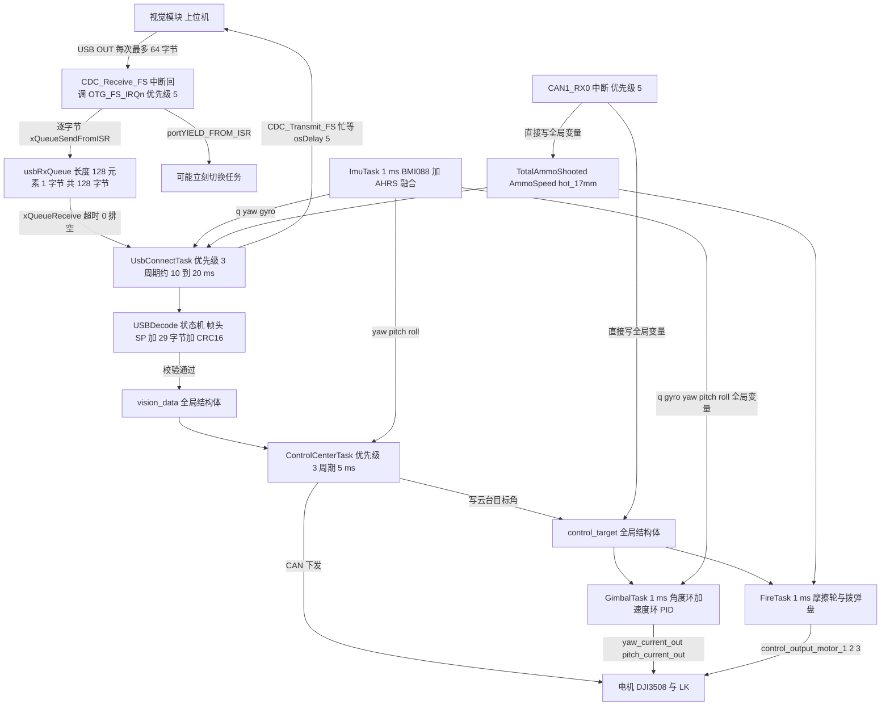
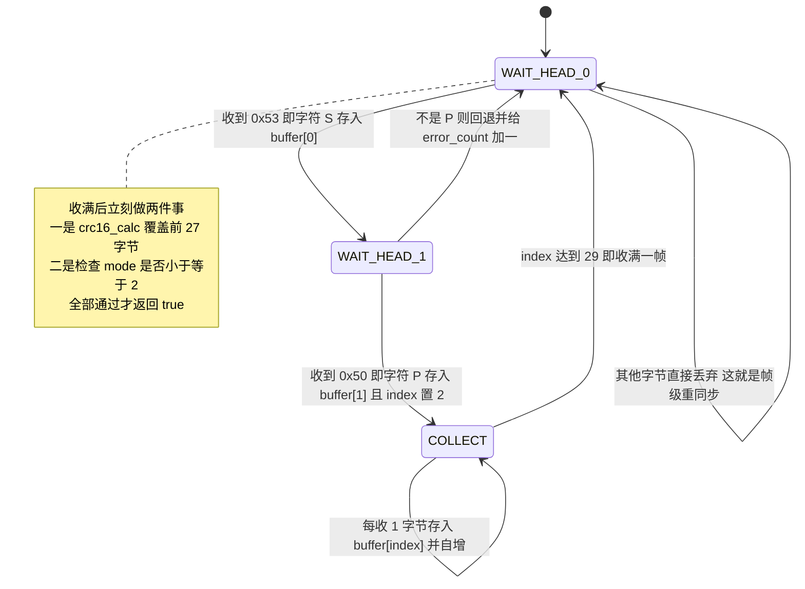
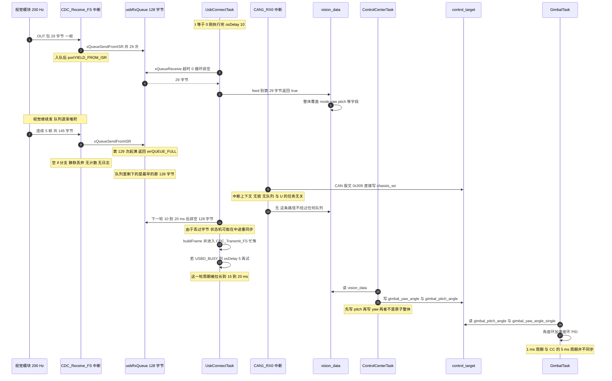
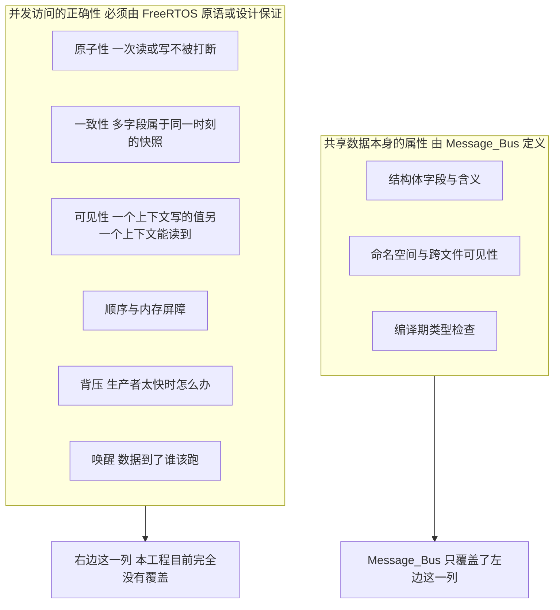

# 本项目通信实例 —— usbRxQueue 全链路与 Message_Bus 的边界

> 队列、信号量/互斥量、任务通知与优先级反转在本工程里各自有适用边界，这些边界只有放到真实数据链路上才看得清：
>
> 对象是 `Message_Bus/message_bus.cpp` 里那几行全局变量与 FreeRTOS 同步原语之间的边界。
>
> 结论是：`Message_Bus` 这个名字里没有一行代码在做"总线"该做的事，它只是一个全局变量表。本工程唯一实际的"总线"行为（可靠地把字节从中断送到任务）由 `usbRxQueue` 这一个队列完成，与 `Message_Bus` 无关。

---

## 1. 全链路总览



这张图里有一处明显的对比：

- USB 的数据入站走的是队列（中间有同步、有缓冲、有背压）；
- CAN 的数据入站直接从中断写全局变量（无同步、无缓冲、无背压）。

两种做法在同一个工程里并存。第 6 节会把它算成一份"跨上下文写者清单"。

---

## 2. 关键路径逐段拆解

### 2.1 第一段：中断里的生产者（Producer）

`USB_DEVICE/App/usbd_cdc_if.c`：

```c
static int8_t CDC_Receive_FS(uint8_t* Buf, uint32_t *Len)
{
  BaseType_t xHigherPriorityTaskWoken = pdFALSE;

  if (usbRxQueue == NULL) {
    goto exit;    //安全，避免先初始化usbRxQueue而不是freertos
  }

  for (uint32_t i = 0; i < *Len; i++) {
    if (xQueueSendFromISR(usbRxQueue, &Buf[i], &xHigherPriorityTaskWoken) != pdPASS) {}
  }
exit:
  USBD_CDC_SetRxBuffer(&hUsbDeviceFS, Buf);
  USBD_CDC_ReceivePacket(&hUsbDeviceFS);
  portYIELD_FROM_ISR(xHigherPriorityTaskWoken);
  return USBD_OK;
}
```

关键点（第 1 篇已详述，这里只列结论）：

| 事实 | 值 | 出处 |
| --- | --- | --- |
| 中断优先级 | 5 | `USB_DEVICE/Target/usbd_conf.c` |
| `configLIBRARY_MAX_SYSCALL_INTERRUPT_PRIORITY` | 5 | `Core/Inc/FreeRTOSConfig.h` |
| 是否合法调用 `FromISR` API | 恰好合法（边界值） | 同上 |
| 队列失败处理 | 空 `if` 分支，静默丢弃 | `usbd_cdc_if.c` |

### 2.2 第二段：队列

`Core/Src/freertos.c`：`usbRxQueue = xQueueCreate(128, sizeof(uint8_t))`

| 量 | 值 |
| --- | --- |
| 元素 | `uint8_t`，1 字节 |
| 长度 | 128 个元素 = 128 字节 |
| 堆占用 | 208 字节（`sizeof(Queue_t) = 72` + 128 + 8 字节 heap_4 块头） |
| 能装完整帧数 | $\lfloor 128/29 \rfloor = 4$ 帧 |
| 创建时机 | `MX_FREERTOS_Init()`，调度器启动之前 |
| 队列满 | 丢新数据，保留旧数据（延迟累积） |

### 2.3 第三段：任务侧的排空 + 解码

`Task/Src/UsbConnectTask.cpp`：

```cpp
void StartUsbConnectTask::run() {
    uint8_t byte;
    for (;;) {
        if (usbRxQueue != NULL) {
            while (xQueueReceive(usbRxQueue, &byte, 0) == pdTRUE)
            {
                if (usb_decoder.feed(byte))
                {
                    const auto& pkt = usb_decoder.packet();
                    vision_data.mode = pkt.mode;
                    vision_data.yaw  = remainderf(pkt.yaw, 360);
                    vision_data.yaw_vel = pkt.yaw_vel;
                    /* ... 其余字段 ... */
                }
            }
        }
        /* 云台 -> 视觉（见 2.5） */
        osDelay(10);
    }
}
```

解码状态机 `usb_decoder` 完全在任务上下文运行，这一点在设计上是有利的。中断只做"把字节塞进队列"这一件事，不做 CRC、不做状态判断、不做结构体赋值。这是把中断路径压到最短的做法：如果让中断去做 29 字节的 CRC16 校验，USB 中断的驻留时间会从几微秒涨到几十微秒，并且会阻挡所有优先级更低的中断。

### 2.4 第四段：解码状态机

`Communication/Src/usb_decode.cpp` 是一个三态机：



这个状态机的两个特性决定了整条链路的健壮性上界：

1. 帧级重同步：`WAIT_HEAD_0` 无条件丢弃非 `'S'` 字节，所以任何一次字节丢失最多报废当前这一帧，下一帧头会重新对齐。这是第 1 篇里"丢字节为什么还能恢复"的答案。
2. 双重校验：CRC16（`usb_decode.cpp`）加 `mode <= 2` 的值域检查。但注意：队列溢出导致丢字节时，这两种校验都只能"拒收"，无法"通知上层发生了丢包"，`error_count_` 会被累加，但本工程里没有任何地方读取过 `errorCount()`（两块板子的全树搜索结果：只有定义没有调用）。

### 2.5 第五段：回程发送（`CDC_Transmit_FS` 忙等）

`Task/Src/UsbConnectTask.cpp`：

```cpp
if (hUsbDeviceFS.dev_state == USBD_STATE_CONFIGURED)
{
    uint8_t gimbal_mode = 0;
    if (control_target.friction_ready) { gimbal_mode = 1; }   /* 读共享全局量 */

    USBProtocol::buildFrame(tx_pkt, gimbal_mode, q, /* ... */);

    while (CDC_Transmit_FS(reinterpret_cast<uint8_t*>(&tx_pkt),
                          USBProtocol::GIMBAL_TO_VISION_LEN) == USBD_BUSY) {
        osDelay(5);
    }
}
osDelay(10);
```

这里有一个真实的实时性问题：`CDC_Transmit_FS` 在 USB 上一包还没发完时返回 `USBD_BUSY`，于是任务最多要等 5 ms（一次 `osDelay(5)`）再试。如果 USB IN 端点持续繁忙，这个 `while` 会循环多次，把整个 `UsbConnectTask` 的循环周期从 10 ms 拉到 15、20 ms 甚至更长。

而这个周期的延长会直接影响入站队列的溢出概率，因为队列的排空频率就是这个周期。这个耦合关系在第 4 节会定量算出来。

---

## 3. 完整链路时序

把 USB 入站、任务调度、CAN 入站三条线画在同一张时间轴上。假设视觉以 200 Hz 发送 29 字节帧，队列在某一刻溢出：



---

## 4. 时延与缓冲深度核算

### 4.1 端到端时延

从"视觉发出某一帧的最后一个字节"到"`GimbalTask` 用上这个信息"，最坏时延是四段之和：

$$T_{\text{lat}} \le \underbrace{T_{\text{drain}}}_{\text{等 UsbConnectTask 排空}} + \underbrace{T_{\text{tx}}}_{\text{回程发送忙等}} + \underbrace{T_{\text{cc}}}_{\text{等 ControlCenterTask}} + \underbrace{T_{\text{gimbal}}}_{\text{等 GimbalTask}}$$

代入本工程的实际周期参数：

| 环节 | 周期来源 | 典型 | 最坏 |
| --- | --- | --- | --- |
| `T_drain` | `UsbConnectTask.cpp` `osDelay(10)` | 10 ms | 10 ms |
| `T_tx` | `UsbConnectTask.cpp` `osDelay(5)`，`while` 可能多次 | 0 ms | 5 ms+ |
| `T_cc` | `ControlCenterTask.cpp` `osDelay(1)` | 1 ms | 1 ms |
| `T_gimbal` | `GimbalTask.cpp` `osDelay(2)` | 2 ms | 2 ms |
| 合计 | | ≈ 13 ms | ≥ 18 ms |

这里有一处看起来矛盾的地方：`GimbalTask` 的周期是 1 ms，但它在整条链路里的时延贡献只有 1 ms，瓶颈在前面三段。把云台控制周期从 1 ms 优化到 0.5 ms 对端到端时延几乎没有改善；要降低时延必须改 `UsbConnectTask` 的 10 ms 排空周期。这是一个典型的"优化错了地方"的例子。

### 4.2 缓冲深度与最大可承受帧率

队列不丢字节的条件是：在一个排空周期内到达的字节数不超过队列容量。

$$f \cdot L_{\text{frame}} \cdot T_{\text{loop}} \le uxLength \cdot uxItemSize$$

代入 $L_{\text{frame}} = 29$、$uxLength \cdot uxItemSize = 128$：

$$f_{\max} = \frac{128}{29 \cdot T_{\text{loop}}}$$

| 排空周期 $T_{\text{loop}}$ | 来源 | $f_{\max}$ |
| --- | --- | --- |
| 10 ms | 无回程阻塞（`T_tx = 0`） | 441 Hz |
| 15 ms | 回程忙等一次（`T_tx = 5`） | 294 Hz |
| 20 ms | 回程忙等两次 | 221 Hz |
| 25 ms | 回程忙等三次 + USB 抖动 | 177 Hz |

对照另一侧的缓冲时长：

$$T_{\text{buf}} = \frac{\lfloor 128/29 \rfloor}{f} = \frac{4}{f}$$

| 视觉帧率 $f$ | 缓冲时长 $T_{\text{buf}}$ | 相对 10 ms 排空周期 |
| --- | --- | --- |
| 100 Hz | 40 ms | 安全（4 倍余量） |
| 200 Hz | 20 ms | 可接受（2 倍余量） |
| 441 Hz | 9 ms | 临界（缓冲时长 < 排空周期） |
| 500 Hz | 8 ms | 危险 |
| 1000 Hz | 4 ms | 必然溢出 |

结论：在"视觉 200 Hz + 无回程阻塞"的常见配置下，128 字节的队列有约 2 倍余量，够用但不宽裕。一旦视觉帧率提到 400 Hz 以上，或者 USB 主机端接收速度变慢导致回程频繁 `USBD_BUSY`，队列就会开始静默丢字节，而由于 `error_count_` 从未被读取，现场不会有任何提示。

> 这里的 $f$ 是上表的假设值。仓库的 `云台串口协议.md` 和 `Communication_Summary.md` 里都没有明确的发送频率约定，所以上表按参数化给出。实际的 $f$ 需要用实测（例如在 `UsbConnectTask` 里统计每秒成功解帧次数）来确定。这一条标注为"待实测"。

---

## 5. `Message_Bus` 的实际内容：一次完整核对

`Message_Bus/` 目录下共有两个文件、82 行，内容如下：

```cpp
/* Message_Bus/message_bus.h（去掉注释后的有效内容） */
struct ControlTarget { float chassis_vx, chassis_vy, chassis_wz; /* ... */ };
struct MotorOutputData { int16_t feeder_current, friction_left, friction_right; };
extern ControlTarget control_target;
extern MotorOutputData motor_output;
extern uint16_t TotalAmmoShooted;
extern float AmmoSpeed;
extern uint16_t hot_17mm;
```

```cpp
/* Message_Bus/message_bus.cpp（全部 17 行，去掉注释后） */
#include "message_bus.h"
ControlTarget   control_target;
MotorOutputData motor_output;
uint16_t TotalAmmoShooted = 0;
float    AmmoSpeed = 0;
uint16_t hot_17mm = 0;
```

事实清单：

| 一个"消息总线"通常应该有 | `Message_Bus` 有没有 |
| --- | --- |
| 队列 / 缓冲 / 背压 | 没有 |
| 互斥量 / 信号量 / 临界区 | 没有 |
| 发布（publish）/ 订阅（subscribe）API | 没有（一个函数都没有） |
| 消息序列化 / 反序列化 | 没有 |
| 消息 ID / 路由 / 分发 | 没有 |
| 内存屏障 Memory Barrier / `volatile` / 原子类型 | 没有 |
| 生命周期管理 | 没有 |
| 数据结构定义（`struct`） | 有（2 个） |
| 全局实例定义 | 有（5 个） |
| 跨文件可见性（`extern` 声明） | 有 |

所以 `Message_Bus` 的真实身份是：一个"共享全局变量 + 头文件里放 `extern` 声明"的约定。它提供的是编译期的命名与可见性，不提供运行期的任何同步保证。

最能说明问题的一条证据：`motor_output` 这个结构体在全工程里只有两处出现：`extern` 声明（`message_bus.h`）和定义（`message_bus.cpp`），没有人写它，也没有人读它。一个实际的总线不会存在从未被收发的"消息"，这恰好说明这个文件只承担数据声明职责。

### 5.1 边界表：该由谁来保证什么



| 属性 | 由谁保证 | 本工程现状 |
| --- | --- | --- |
| 结构体字段定义 | `Message_Bus`（`message_bus.h`） | 有 |
| 单字段（对齐的 32 位）读写的原子性 | ARM Cortex-M4 架构 | 天然成立（`float` / `uint32_t` 单次访问） |
| 多字段快照一致性 | 需要互斥量或双缓冲 | 无 |
| 一个上下文写的值另一个上下文的可见性 | 需要 `volatile` 或屏障 | 无（除 `roll_out` 等少数 `volatile` 变量） |
| 数据的产生与消费节奏匹配 | 需要队列或信号量 | 仅 USB 入站有（`usbRxQueue`）；CAN 入站没有 |
| 唤醒 | 需要队列/信号量/通知 | 仅 USB 入站有（`portYIELD_FROM_ISR`） |
| 生产者过快的处理 | 队列满策略 | 仅 USB 入站有（且是静默丢弃） |

### 5.2 真实的跨上下文写者清单

"边界"的落地形式是把每一处写和读都标上执行上下文：

| 共享量 | 写者 | 写者上下文 | 读者 | 保护 | 风险 |
| --- | --- | --- | --- | --- | --- |
| `control_target.chassis_wz` | `bsp_can.cpp`（CAN 报文 `0x309`） | 中断（优先级 5） | `ControlCenterTask.cpp` | 无 | 中断与任务并发写读同一字段 |
| `control_target` 其余字段 | `ControlCenterTask.cpp` | 任务 | `GimbalTask`、`FireTask`、`UsbConnectTask` | 无 | 多字段快照不一致 |
| `TotalAmmoShooted`、`AmmoSpeed` | `bsp_can.cpp,681`（`0x303`） | 中断 | `UsbConnectTask.cpp` | 无 | 非 `volatile`，编译器可见性无保证 |
| `hot_17mm` | `bsp_can.cpp`（`0x309`） | 中断 | `FireTask.cpp` | 无 | 同上 |
| `vision_data` | `UsbConnectTask.cpp` | 任务 | `ControlCenterTask.cpp`、`GimbalTask` | 无 | 多字段快照不一致 |
| `q` / `gyro` / `yaw` / `pitch` / `roll` | `ImuTask.cpp` | 任务 | `GimbalTask`、`UsbConnectTask`、`ControlCenterTask` | 无 | 多字段快照不一致；`gyro[3]` 由 `BMI088_Read` 逐个写 |
| `motor_output` | 无人写 | 无 | 无人读 | 无 | 死代码 |

表中前四行反映了同一种做法：CAN 中断在直接写全局变量。

由此得到一个结论：

> 第 2 篇给出的"给 `control_target` 加互斥量"的方案，对本工程并不完全适用。
>
> 因为 `control_target.chassis_wz` 存在一个中断写者（`bsp_can.cpp`，CAN1_RX0 中断，优先级 5）。而第 2 篇和第 4 篇都已经论证过：互斥量不能在中断里使用：中断没有可被继承的优先级，`xTaskPriorityDisinherit` 里的 `configASSERT( pxTCB == pxCurrentTCB )` 必然失败。
>
> 所以如果只是"给 `control_target` 加一把互斥量"，保护就是假的：任务侧以为加了锁，中断侧照样绕过它直接写。这类"加了锁但没锁全"的 bug 比完全不加锁更难查。

正确的做法只有三条路：

| 方案 | 做法 | 代价 |
| --- | --- | --- |
| A. 中断只入队 | CAN 中断里 `xQueueSendFromISR` 把报文原样送进队列，由任务解析并写 `control_target` | 需要新增一个 CAN 接收队列（208 字节级别），并改造 `bsp_can.cpp` 的整个分发逻辑 |
| B. 关中断临界区 | 对 `chassis_wz` 这个单字段用 `taskENTER_CRITICAL()` / `portENTER_CRITICAL()` 保护极短的读写 | 只适合单个对齐 32 位字段，不能保护多字段一致性 |
| C. 拆字段 | 把"中断写的量"与"任务写的量"拆成两个独立变量，让每个变量都只有单一写者 | 需要重构 `ControlTarget` 的字段归属，改动面最大但最干净 |

注意方案 B 的一个细节：因为写者是中断，任务侧必须用带中断保护的版本（`taskENTER_CRITICAL()` 会屏蔽到 `configMAX_SYSCALL_INTERRUPT_PRIORITY` 为止），而不是"互斥量"。而 `taskENTER_CRITICAL()` 会屏蔽所有优先级数值 ≥ 5 的中断，包括 USB 中断（也是 5）。所以任何在临界区里做重活的写法都会直接伤害 USB 收包。这又是一个"选择即代价"的例子。

---

## 6. 与底盘板的对比：同一个问题，两种答案

两块板子的 USB 接收路径是同构硬件上的两种不同实现，把它们的差异列出来，就能看清楚"队列"到底解决了什么。

| 维度 | 云台板（`2026OmniSentryGimbal`） | 底盘板（`2026OmniSentryChassis`） |
| --- | --- | --- |
| 中断回调 | `CDC_Receive_FS`（`usbd_cdc_if.c`） | `CDC_Receive_FS`（`usbd_cdc_if.c`） |
| 中断里做什么 | 逐字节 `xQueueSendFromISR` | 调用 `USB_Data_Received(Buf, *Len)` |
| 数据的去向 | FreeRTOS 队列 `usbRxQueue` | 普通数组成员 `rx_buffer[APP_RX_DATA_SIZE]` |
| 索引变量 | 内核维护（`pcWriteTo` / `pcReadFrom`） | 自己维护 `unsigned short rx_index` |
| 索引是否 `volatile` | 不适用 | 否（`Task/Inc/UsbConnectTask.h`） |
| 溢出处理 | 队列满 → 丢新数据 | `rx_index = 0` 后从头开始覆盖（`UsbConnectTask.cpp`） |
| 是否有临界区 | 内核在队列内部保证 | 无 |
| 是否有唤醒机制 | `portYIELD_FROM_ISR`，可立即切换 | 无，任务靠 `osDelay(10)` 轮询 |
| 帧边界处理 | 任务侧状态机，与队列解耦 | 任务侧检查 `rx_index > 0` 后整块解析 |

底盘板这套实现存在三个客观的技术风险（按代码如实列出）：

1. 数据竞争（Data Race）：`rx_buffer` 由中断写入、由任务读取，中间没有任何同步。若中断在任务 `memcpy`/解析期间写入新数据，任务会读到被覆盖到一半的内容。
2. `rx_index` 非 `volatile`：`RxTask` 循环里的 `if (rx_index > 0)` 在编译器看来，`rx_index` 在循环体内没有可观察的修改点，编译器有权把它提升到寄存器里只读一次（尤其是在 `-O2` 下）。一旦发生，任务就会永远看到旧值或 0。
3. 缓冲区重置语义危险：`if (length > sizeof(rx_buffer) - rx_index) { rx_index = 0; }` 在溢出时把已经收到的部分数据直接丢弃并从头开始，而不是丢最新的，这会让一个正在解析中的半帧和后续帧头混在一起，只能靠上层协议自己重新同步。

云台板用队列把这三个问题一次性解决：内核维护读写指针（不需要用户变量）、队列内部有临界区（不需要用户加锁）、`portYIELD_FROM_ISR` 提供唤醒（不需要轮询）。这正是"用 208 字节换掉三类并发 bug"的收益。

> 说明：底盘板的代码里 `USB_Data_Received` 确实被 `CDC_Receive_FS` 调用（`usbd_cdc_if.c`），`addDataToBuffer` 也确实在中断上下文执行（`UsbConnectTask.cpp`）。这两点在源码里逐一确认过，不是推测。

---

## 7. 改进方案（可直接落地的代码）

### 7.1 让丢包可观测（最小改动，收益最大）

```c
/* usbd_cdc_if.c 顶部 */
static volatile uint32_t g_usb_rx_overflow_bytes = 0;   /* 中断里只做自增计数 */
static volatile uint32_t g_usb_rx_last_drop_tick  = 0;  /* 最近一次丢弃的 tick */

/* CDC_Receive_FS 内的循环改成 */
for (uint32_t i = 0; i < *Len; i++) {
    if (xQueueSendFromISR(usbRxQueue, &Buf[i], &xHigherPriorityTaskWoken) != pdPASS) {
        g_usb_rx_overflow_bytes++;
        g_usb_rx_last_drop_tick = xTaskGetTickCountFromISR();   /* ISR 专用版本 */
    }
}

/* 供任务侧/上位机读取 */
uint32_t UsbRxOverflowBytes(void)   { return g_usb_rx_overflow_bytes; }
uint32_t UsbRxLastDropTick(void)    { return g_usb_rx_last_drop_tick; }
```

为什么用 `volatile` 而不是 `taskENTER_CRITICAL()`：中断路径上不能用 `taskENTER_CRITICAL()`（它只保证任务侧屏蔽中断，中断里调用无意义），而 `volatile` 保证每次访问都实际读写内存。$\pm 1$ 的统计误差在这个场景下完全可接受。

### 7.2 把 CAN 的解析搬到任务里（消除中断写全局变量）

```c
/* BSP/Src/bsp_can.cpp */
static QueueHandle_t can_rx_queue = NULL;

typedef struct { uint32_t id; uint8_t data[8]; } CanFrame_t;

void bsp_can_rx_queue_init(void) {                 /* 必须在调度器启动前调用 */
    can_rx_queue = xQueueCreate(16, sizeof(CanFrame_t));   /* 16 帧 × 12 字节 */
    configASSERT(can_rx_queue != NULL);
}

/* 中断回调：只入队，不解析、不写全局变量 */
void HAL_CAN_RxFifo0MsgPendingCallback(CAN_HandleTypeDef *hcan) {
    BaseType_t xHigherPriorityTaskWoken = pdFALSE;
    CAN_RxHeaderTypeDef rx_header;
    uint8_t rx_data[8];
    CanFrame_t frame;

    if (HAL_CAN_GetRxMessage(hcan, CAN_RX_FIFO0, &rx_header, rx_data) != HAL_OK) return;

    frame.id = rx_header.StdId;
    memcpy(frame.data, rx_data, 8);
    if (xQueueSendFromISR(can_rx_queue, &frame, &xHigherPriorityTaskWoken) == pdPASS) {
        portYIELD_FROM_ISR(xHigherPriorityTaskWoken);
    } else {
        /* 队列满：CAN 报文本身有硬件重传与后续周期，丢一帧可接受，但要计数 */
    }
}

/* 新增一个 CanRxTask（或在既有任务里）解析并写 control_target */
void StartCanRxTask::run() {
    CanFrame_t frame;
    for (;;) {
        if (xQueueReceive(can_rx_queue, &frame, portMAX_DELAY) == pdTRUE) {
            can_dispatch(frame.id, frame.data);   /* 原来中断里 switch 的内容搬到这里 */
        }
    }
}
```

这一步做完之后，`control_target` 就只剩任务上下文的写者了，第 2 篇的互斥量方案才可用。

内存占用：16 帧 × (4 + 8) = 192 字节请求 → `sizeof(Queue_t) = 72` → 72 + 192 = 264 → heap_4 实占 272 字节。当前堆剩余约 12.5 KB，这个改动代价很小。

### 7.3 给 `vision_data` 加一致快照

按第 2 篇的 `ControlTarget_Read/Write` 模式复制一份即可。注意一个前提：`vision_data` 的唯一写者是 `UsbConnectTask`（任务上下文），所以互斥量在这里是完全适用的，这与 `control_target` 的情形不同（后者有中断写者）。这个区别必须在动手前确认，否则会给一个"锁不住中断"的量加无用的锁。

---

## 8. 常见易错点清单

| # | 易错点 | 本工程的具体表现 |
| --- | --- | --- |
| 1 | 以为"名字叫 Bus"就是同步机制 | `Message_Bus` 零函数、零锁、零队列，只有一个从未被使用的 `motor_output` |
| 2 | 给有中断写者的变量加互斥量 | `control_target.chassis_wz` 由 CAN 中断写（`bsp_can.cpp`），互斥量保护不到 |
| 3 | 只保护单字段却声称"保护了结构体" | `float` 单次读写天然原子，但 `ControlCenterTask` 先写 pitch 后写 yaw，中间可被抢占 |
| 4 | 队列溢出静默丢弃且无计数 | `usbd_cdc_if.c` 的空 `if`；`USBDecode::errorCount()` 定义了但从无人读 |
| 5 | 优化了非瓶颈环节 | 把 `GimbalTask` 从 1 ms 改到 0.5 ms，端到端时延几乎不变（瓶颈在 `UsbConnectTask` 的 10 ms） |
| 6 | 回程忙等拉长入站排空周期 | `UsbConnectTask.cpp` 的 `while (CDC_Transmit_FS(...) == USBD_BUSY) osDelay(5);` 会让 $f_{\max}$ 从 441 Hz 降到 221 Hz |
| 7 | 在中断里做重活 | 本工程的 USB 中断只入队（这是正确做法）；如果有人把 `usb_decoder.feed` 搬进中断，中断驻留时间会暴涨 |
| 8 | 跨上下文读非 `volatile` 变量 | `TotalAmmoShooted` / `AmmoSpeed` / `hot_17mm` 由中断写、任务读，均非 `volatile` |
| 9 | 用"轮询 + 普通数组"代替队列 | 底盘板的 `rx_buffer` + 非 `volatile` 的 `rx_index`（`Task/Inc/UsbConnectTask.h`） |
| 10 | 没有区分"单写者"和"多写者"就上锁 | `vision_data` 是单写者（可用互斥量）；`control_target` 是多写者跨上下文（不可用） |
| 11 | 忽略队列创建可能失败 | `freertos.c` 的失败处理是空块；若堆不足，`usbRxQueue` 为 `NULL`，所有数据静默丢弃 |
| 12 | 忘记 `osDelay(10)` 是 10 ms（tick = 1 ms） | 如果 `configTICK_RATE_HZ` 被改成 100，这个 10 会变成 100 ms，队列必然溢出 |

---

## 9. 小结

### 9.1 核心概念

- 本工程唯一实际的"总线"行为由 `usbRxQueue` 提供：128 字节的字节 FIFO + 中断安全入队 + 任务排空 + `portYIELD_FROM_ISR` 唤醒 + 帧级重同步。这 208 字节换掉了"数据竞争 / 非 volatile 索引 / 无唤醒"三类并发 bug。
- `Message_Bus` 不是总线，是全局变量表。它提供编译期的数据结构与可见性，不提供任何运行期的原子性、一致性、可见性与顺序保证。这也是判断"能不能靠加锁解决"的前提。
- 一个变量能不能用互斥量保护，先看它的写者有没有中断。`vision_data` 是单任务写者 → 互斥量适用；`control_target.chassis_wz` 有 CAN 中断写者 → 互斥量不适用，必须用"中断只入队"或"关中断临界区"。
- 端到端时延由最慢的那一段决定。本工程的链路是 10 ms（排空）+ 0~5 ms（回程忙等）+ 5 ms（控制中心）+ 1 ms（云台）= 约 16~21 ms，瓶颈在 `UsbConnectTask`，不在 1 ms 的 `GimbalTask`。
- 缓冲深度是一个可以算出来的数。$f \cdot 29 \cdot T_{\text{loop}} \le 128$，在 10 ms 排空周期下允许的最大帧率是 441 Hz；回程忙等会把排空周期拉到 15~20 ms，阈值降到 221~294 Hz。
- 可观测性与同步同等重要。本工程有两处"丢了东西却不说"：队列溢出（空 `if`）与解码错误计数（`errorCount()` 无人调用）。这在现场调试时意味着"现象只能靠猜"。

### 9.2 设计权衡

| 权衡点 | 现状 | 改成"中断只入队 + 任务解析" | 改成"关中断临界区" |
| --- | --- | --- | --- |
| 堆开销 | 208 B（仅 USB 入站） | +272 B（CAN 入站队列） | 0 |
| 中断驻留时间 | 逐字节入队，微秒级 | 逐帧入队（`memcpy` 8 字节），微秒级 | 临界区内的代码全部屏蔽中断 |
| `control_target` 能否安全加锁 | 不能（有中断写者） | 能 | 不需要（已用临界区） |
| 多字段一致性 | 无保证 | 可用互斥量保证 | 临界区可保证，但代价是屏蔽 USB/CAN 中断 |
| 解析逻辑位置 | 中断里（`bsp_can.cpp` 的 switch） | 任务里 | 不动 |
| 可观测性 | 无 | 队列满可计数 | 无法观测 |
| 改动面 | 不适用 | `bsp_can.cpp` + 新增任务 + 队列初始化 | 仅局部几行 |

小结：本工程在 USB 入站上做出了正确的选择（队列），却没有把这个经验推广到 CAN 入站（中断直接写全局变量）。`Message_Bus` 这个名字制造了一种"消息已经过总线了、所以是安全的"的错觉，实际上它一行同步代码都没有。下一步的优先改动是先把 CAN 中断里的解析搬进任务，而不是加互斥量，因为只有在那之后互斥量才锁得住。

---

## 10. 练习题

### 基础题

1. 链路盘点。按第 5.2 节的方式，列出 `vision_data` 的全部字段、每个字段的写者/读者与执行上下文，并判断它能否用互斥量保护。
2. 容量计算。若把 `usbRxQueue` 改成"元素 = 29 字节整帧、长度 6"的队列，请算出它的 heap_4 实占字节数，并说明这样改之后"丢包"的语义发生了什么变化。
3. 时延分解。已知 `T_drain = 10`、`T_tx ∈ {0, 5, 10}`、`T_cc = 5`、`T_gimbal = 1`（单位 ms）。请给出端到端时延的最小值、典型值与最坏值，并指出若要把最坏值压到 10 ms 以内，必须改哪一处。
4. 不能直接上锁的原因。请说明"给 `control_target` 加互斥量"在本工程里是假保护的原因，并指出具体是哪个字段、哪一行中断代码造成了这个后果。

### 挑战题

5. 把 CAN 解析搬进任务。按第 7.2 节的方案完整实现：写出 `CanFrame_t` 的定义、队列创建、中断回调改造、以及新的解析任务（可以用 `TaskBase` 派生风格）。要求：(a) 队列满时可计数；(b) 不改变任何既有字段的语义；(c) 论证改造后 `control_target` 的所有写者都在任务上下文。
6. 给本工程做一次"并发审计"。把两块板子上的所有全局可变状态列成表，标出每个变量的写者集合与执行上下文，并输出一份"需要同步的变量清单"与"可以用无锁解决的变量清单"。要求给出判定规则（例如"单写者且对齐 32 位 → 无需锁"）。
7. 设计一个可观测的 USB 链路健康面板。要求能通过 `Debug_vars` 或云台→视觉的 43 字节回程帧暴露至少 5 个指标：累计丢字节数、最近丢包时刻、每秒成功解帧数、队列当前深度、`UsbConnectTask` 最长循环周期。给出实现方案，并说明"队列当前深度"应该怎么读（提示：`uxQueueMessagesWaiting`）以及为什么它不适合在中断里读。

---

### 附：本页引用的固件路径

| 路径 | 用途 |
| --- | --- |
| `/home/wyx/rm/2026SentriOmeniGimbal/2026OmniSentryGimbal/Core/Src/freertos.c` | `usbRxQueue` 创建、队列创建失败处理、任务创建顺序 |
| `/home/wyx/rm/2026SentriOmeniGimbal/2026OmniSentryGimbal/Core/Inc/FreeRTOSConfig.h` | `configTICK_RATE_HZ = 1000`、`configLIBRARY_MAX_SYSCALL_INTERRUPT_PRIORITY = 5` |
| `/home/wyx/rm/2026SentriOmeniGimbal/2026OmniSentryGimbal/USB_DEVICE/App/usbd_cdc_if.c` | `CDC_Receive_FS` 中断生产者、`CDC_Transmit_FS` |
| `/home/wyx/rm/2026SentriOmeniGimbal/2026OmniSentryGimbal/USB_DEVICE/Target/usbd_conf.c` | `OTG_FS_IRQn` 优先级 5 |
| `/home/wyx/rm/2026SentriOmeniGimbal/2026OmniSentryGimbal/Task/Src/UsbConnectTask.cpp` | 排空循环、回程发送与忙等、`osDelay(10)` |
| `/home/wyx/rm/2026SentriOmeniGimbal/2026OmniSentryGimbal/Communication/Src/usb_decode.cpp` | 三态解码机与 CRC 校验 |
| `/home/wyx/rm/2026SentriOmeniGimbal/2026OmniSentryGimbal/Communication/Inc/usb_protocol.h` | 帧长 29 / 43、`static_assert` |
| `/home/wyx/rm/2026SentriOmeniGimbal/2026OmniSentryGimbal/BSP/Src/bsp_can.cpp` | CAN 中断回调 `HAL_CAN_RxFifo0MsgPendingCallback`、`0x303` 写 `TotalAmmoShooted`/`AmmoSpeed`、`0x309` 写 `hot_17mm` 与 `control_target.chassis_wz` |
| `/home/wyx/rm/2026SentriOmeniGimbal/2026OmniSentryGimbal/Core/Src/stm32f4xx_it.c` | `CAN1_RX0_IRQHandler` → `HAL_CAN_IRQHandler(&hcan1)` |
| `/home/wyx/rm/2026SentriOmeniGimbal/2026OmniSentryGimbal/Core/Src/can.c` | `CAN1_RX0_IRQn` 优先级 5 |
| `/home/wyx/rm/2026SentriOmeniGimbal/2026OmniSentryGimbal/Message_Bus/message_bus.{h,cpp}` | `Message_Bus` 的全部内容（hcpp:1-17） |
| `/home/wyx/rm/2026SentriOmeniGimbal/2026OmniSentryGimbal/Task/Src/ControlCenterTask.cpp` | 读 `vision_data`、写 `control_target`、`osDelay(5)` |
| `/home/wyx/rm/2026SentriOmeniGimbal/2026OmniSentryGimbal/Task/Src/GimbalTask.cpp` | 读 `control_target`、1 ms PID |
| `/home/wyx/rm/2026SentriOmeniGimbal/2026OmniSentryGimbal/Task/Src/FireTask.cpp` | 读 `control_target.friction_ready`/`feeder_ready`、读 `hot_17mm` |
| `/home/wyx/rm/2026SentriOmeniGimbal/2026OmniSentryGimbal/Task/Src/ImuTask.cpp` | `q`/`gyro`/欧拉角发布、`DWT_Delay_ms(1)` |
| `/home/wyx/rm/2026SentriOmeniChassis/2026OmniSentryChassis/Task/Src/UsbConnectTask.cpp` | 底盘板 `rx_buffer` + `rx_index` 方案 |
| `/home/wyx/rm/2026SentriOmeniChassis/2026OmniSentryChassis/Task/Inc/UsbConnectTask.h` | `rx_buffer` / `rx_index` 成员声明 |
| `/home/wyx/rm/2026SentriOmeniChassis/2026OmniSentryChassis/USB_DEVICE/App/usbd_cdc_if.c` | 底盘板中断回调调用 `USB_Data_Received` |
