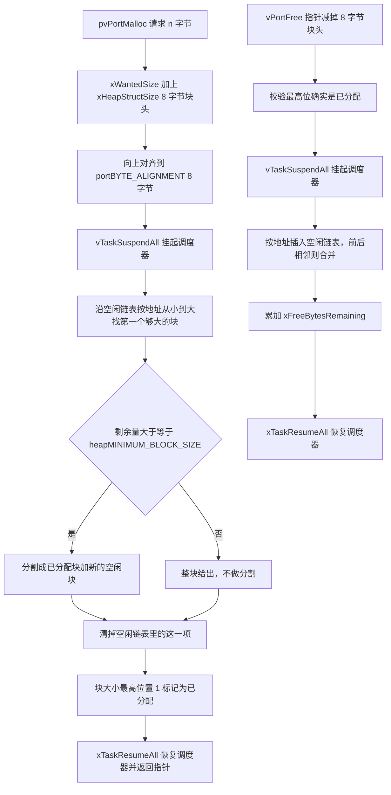

# FreeRTOS 内存方案对比

> 本单元属于 `docs/01-FreeRTOS/03-内存管理与临界区/`，全部素材取自哨兵机器人云台板固件
> `2026OmniSentryGimbal`（STM32F407，FreeRTOS Kernel V10.3.1，应用层走 CMSIS-RTOS v1 包装）。
> 底盘板 `2026OmniSentryChassis` 与它同构，两块板不一样的地方本文都会点出来。

## 1. RTOS 不用 libc `malloc` 的三条原因

在不带 RTOS 的程序里 `malloc` 尚可使用，接入 RTOS 后它直接不可用，原因有三条：

1. 不确定性。newlib 的 `malloc` 走 `_sbrk`，堆边界是运行期推的，最坏耗时不可预测。RTOS 要求"分配 200 字节"这句话的耗时有个上界，哪怕上界是 O(n)。
2. 不可重入。`malloc` 内部的空闲链表是全局状态。任务 A 正在改链表时被任务 B 抢走，堆就烂了。FreeRTOS 的 `pvPortMalloc` 用 `vTaskSuspendAll()` 把调度器挂起，天然对多任务安全；`malloc` 不具备这个特性。
3. 不可诊断。需要知道"还剩多少堆""历史最低水位是多少""哪次分配失败了"，libc 不提供这些，FreeRTOS 有三套 API 可以查。

本工程里这两套堆同时存在，服务对象互不相同：

| 堆 | 谁提供 | 大小 | 给谁用 |
| --- | --- | --- | --- |
| FreeRTOS 堆 `ucHeap` | `heap_4.c` 的静态数组 | `configTOTAL_HEAP_SIZE = 40960` B | 任务栈、TCB、队列、信号量、互斥量 |
| newlib 堆 | 链接脚本 `_Min_Heap_Size` + `sysmem.c` 的 `__sbrk_heap_end` | `0x200` = 512 B | `printf` / `malloc` / C++ `operator new` |

最直接的证据是本工程的 `MemMang` 目录里只有一个文件。

```bash
$ ls Middlewares/Third_Party/FreeRTOS/Source/portable/MemMang/
heap_4.c
```

CubeMX 生成工程时把 `heap_1.c` ~ `heap_5.c` 全给裁掉了，只留 heap_4.c。所以下文关于分配算法的讨论都会收敛到同一个实现上，这是理解本单元的前提。

## 2. 分配算法与内存来源两条维度

### 2.1 两个正交的维度

下面两件事常被混为一件事，它们互相独立：

- 维度 A，分配算法：`pvPortMalloc` / `vPortFree` 怎么工作。五个候选 heap_1 到 heap_5，编译期选一个。
- 维度 B，对象内存来源：某个内核对象（任务、队列等）的内存是运行时从 `ucHeap` 里切，还是调用者事先提供。这是逐个对象选的。

维度 B 由两个开关控制，本工程两个都打开了：

```c
/* Core/Inc/FreeRTOSConfig.h */
#define configSUPPORT_STATIC_ALLOCATION          1
#define configSUPPORT_DYNAMIC_ALLOCATION         1
```

这意味着同一份固件里可以混用 `xTaskCreate()` 和 `xTaskCreateStatic()`。第 2.5 节会看到，本工程的空闲任务是静态的，其余全是动态的。

### 2.2 heap_1：只会加，不会减

`heap_1.c` 里没有空闲链表，只有一个单调递增的游标 `xNextFreeByte`：

- 分配：`pvReturn = &ucHeap[xNextFreeByte]; xNextFreeByte += xWantedSize;`
- 释放：`vPortFree()` 是空函数

优点：O(1)、绝对无碎片、代码最小。
缺点：不能释放。一旦调用了 `vTaskDelete()`、`vSemaphoreDelete()`、`vQueueDelete()`，内存就永久泄漏。

本工程不用它，因为 `FreeRTOSConfig.h` 明确打开了删除功能：

```c
#define INCLUDE_vTaskDelete                  1
```

在 heap_1 上，这行开关没有实际作用：编译能过，删任务时内存回不来。这是配置项互相冲突的典型案例。

### 2.3 heap_2：首次适配，但不合并（已被淘汰）

`heap_2` 引入了空闲链表，支持释放，但释放时不会把相邻的空闲块合并。它的设计前提是所有分配的大小都一样，那样不合并也无所谓。

现实中只要出现"申请 100 字节、申请 200 字节、释放 100 字节、再申请 150 字节"这种混合序列，空闲链表就会高度碎片化：总空闲量足够，却没有一块够大的连续空间。

FreeRTOS 10.x 的官方文档已经把 heap_2 标为历史遗留，建议新工程用 heap_4。本工程目录里连 `heap_2.c` 都没有。

### 2.4 heap_3：只是给 libc 的 `malloc` 加了一把锁

`heap_3.c` 做的事很薄：把 `pvPortMalloc` 实现成"挂起调度器 + `malloc()` + 恢复调度器"。

它解决线程安全问题，不解决确定性问题：底层还是 libc 的堆，还是走 `_sbrk`，还是要配置 `_Min_Heap_Size`。只有在必须让 RTOS 对象和 `printf` 共用同一个堆时才选它。

### 2.5 heap_4：首次适配 + 相邻合并（本工程的选择）

heap_4 是目前嵌入式领域的事实标准，它的设计要点如下（第 02 篇展开讲实现）：

- 空闲块按内存地址升序挂在链表上，不按大小排序；
- 分配走 first fit（首次适配）：从地址最小的空闲块开始扫，遇到第一块够大的就用；
- 够大就 split（分割），前提是剩余部分不少于 `heapMINIMUM_BLOCK_SIZE`；
- 释放时按地址插回链表，并向前、向后合并相邻空闲块（coalescence）；
- 借用块大小字段的最高位当作"已分配"标志（`xBlockAllocatedBit`）。

按地址排序加相邻合并这一对组合，是 heap_4 能把碎片压到很低的根本原因。代价是分配最坏 O(n)（要遍历链表），释放也是 O(n)。

### 2.6 heap_5：heap_4 加多段内存注册

`heap_5` 的分配算法和 heap_4 相同，唯一区别是多了一个 `vPortDefineHeapRegions()`，允许把几段物理上不连续的内存拼成同一个堆。

典型场景是 STM32H7/F7：内部 SRAM 切成好几块（DTCM / AXI SRAM / SRAM1~4），想让同一个堆横跨它们。

本工程用不上。STM32F407 确实有 128 KB SRAM 加 64 KB CCMRAM，但链接脚本里 `CCMRAM` 段虽然定义了，实际占用是 0：

```bash
$ arm-none-eabi-size -A build/Debug/sentriomeni2026.elf | grep -E "ccmram|bss"
.ccmram        0   268435456      # 64 KB CCMRAM 一个字节都没用
.bss       54668   536871332      # 含 ucHeap 的 40960 B
```

FreeRTOS 堆待在 SRAM 里（map 里 `ucHeap` 落在 `0x200005d4`），一整段连续内存，heap_4 完全够用。

### 2.7 决策图

把上面五条判断串起来，就是选型时该走的决策路径：

```mermaid
flowchart TD
  S["要为一个 FreeRTOS 工程选内存方案"] --> Q1{"运行期需要释放吗<br/>vTaskDelete 或 vQueueDelete"}
  Q1 -->|"不需要，对象创建后终身不变"| H1["heap_1<br/>单调游标，O(1)，绝不碎片"]
  Q1 -->|"需要"| Q2{"必须和 libc 的 malloc 共用同一个堆吗"}
  Q2 -->|"是，例如要频繁 printf 大量数据"| H3["heap_3<br/>包一层 newlib malloc 加调度器锁"]
  Q2 -->|"否"| Q3{"物理内存是连续的一整段吗"}
  Q3 -->|"连续，例如 F407 的 128 KB SRAM"| H4["heap_4<br/>首次适配加相邻块合并"]
  Q3 -->|"多段不连续，例如 H7 的 DTCM 加 AXI SRAM"| H5["heap_5<br/>vPortDefineHeapRegions 注册多段"]
  H4 --> R["本项目结论 heap_4<br/>ucHeap 等于 40960 字节"]
  H1 --> Z["更极端的方向 全静态<br/>xTaskCreateStatic 完全不走堆"]
  H3 --> Z
  H5 --> Z
```



最后一步要注意：无论选哪个 heap，都可以再叠加静态分配这条正交路径。heap 方案管堆怎么切，静态分配管的是完全不碰堆。

### 2.8 静态分配换来的确定性

静态分配指内核对象的存储由调用者在编译期提供：一个 `StaticTask_t` 装 TCB，一个 `StackType_t[]` 当栈。

本工程唯一的静态使用者是空闲任务（Idle Task）。这段代码在 `Core/Src/freertos.c` 里，由 CubeMX 模板加手写填空组成：

```c
/* Core/Src/freertos.c，一字未改 */
void vApplicationGetIdleTaskMemory( StaticTask_t **ppxIdleTaskTCBBuffer,
                                    StackType_t **ppxIdleTaskStackBuffer,
                                    uint32_t *pulIdleTaskStackSize );

static StaticTask_t xIdleTaskTCBBuffer;
static StackType_t  xIdleStack[configMINIMAL_STACK_SIZE];

void vApplicationGetIdleTaskMemory( StaticTask_t **ppxIdleTaskTCBBuffer,
                                    StackType_t **ppxIdleTaskStackBuffer,
                                    uint32_t *pulIdleTaskStackSize )
{
  *ppxIdleTaskTCBBuffer  = &xIdleTaskTCBBuffer;
  *ppxIdleTaskStackBuffer = &xIdleStack[0];
  *pulIdleTaskStackSize   = configMINIMAL_STACK_SIZE;
}
```

它的效果在链接 map 里可见：这两块内存独立于 `ucHeap`，是 `.bss` 里的符号：

```text
.bss.xIdleTaskTCBBuffer   0x2000ce84   0x54    # 84 字节 = sizeof(StaticTask_t)
.bss.xIdleStack           0x2000ced8   0x400   # 1024 字节 = 256 words × 4
```

空闲任务单独做静态，原因是它的存在由内核强制：只要调用 `vTaskStartScheduler()`，空闲任务就必然被创建。如果它也从 `ucHeap` 里切，就会出现一种尴尬局面：堆小到连空闲任务都创建不出来，于是调度器直接起不来。用静态内存把空闲任务固定在 `.bss` 里，这个失败模式就被排除了。

> 易错点：`configSUPPORT_STATIC_ALLOCATION = 1` 时，内核会把提供静态内存的钩子函数变成链接期强依赖。
> 本工程 `configUSE_TIMERS` 没有定义（默认 0），所以只需要 `vApplicationGetIdleTaskMemory` 一个。
> 一旦把 `configUSE_TIMERS` 打开，就必须补一个 `vApplicationGetTimerTaskMemory`，否则报 `undefined reference to 'vApplicationGetTimerTaskMemory'`。

## 3. heap_4 里一次分配的完整路径

heap_4 碎片少的直观解释先看一遍分配与释放路径，详细推导放在 `02-heap_4与40KB堆`。



## 4. 产业案例：电控固件普遍选择 heap_4

同类固件的做法可以印证三点。

第一，CubeMX 的默认值就是 heap_4。ST 的 FreeRTOS 中间件模板把 `configTOTAL_HEAP_SIZE` 默认设成 15360（15 KB），本工程把它改成了 40960。选 heap_4 常常是沿用默认值，未必经过主动比较；能说清自己为什么不改，才算读懂了配置。

第二，RoboMaster 这类电控固件的实际内存行为是启动期一次性分配、运行期零分配。本工程的 `MX_FREERTOS_Init()` 就是例子：1 个队列 + 6 个任务，全部在 `osKernelStart()` 之前创建完，运行期再没有一次 `pvPortMalloc`。

heap_4 的碎片风险完全来自释放后再分配，而本工程运行期一次都不释放，所以实际上既保留了 heap_4 能删任务的余量，又承担零碎片风险，是最划算的组合。

第三，安全等级越高的场景越偏向静态分配甚至完全禁用动态。AUTOSAR OS 直接不允许运行期动态创建对象，航电领域的 MISRA 也常见禁止 `malloc` 的条款。原因在于分配失败这个分支在认证里很难证明，与 heap_4 本身好不好用无关。本工程的对照是空闲任务静态化，属于同一思路的一个小切片。

两块板的差异（同构但不完全一样）：

| 配置项 | 云台板 `2026OmniSentryGimbal` | 底盘板 `2026OmniSentryChassis` |
| --- | --- | --- |
| 堆方案 | `heap_4.c`（目录里仅此一个） | `heap_4.c`（目录里仅此一个） |
| `configTOTAL_HEAP_SIZE` | 40960 | 40960 |
| `configMINIMAL_STACK_SIZE` | 256 words | 512 words |
| 静态空闲任务 | 有 | 有 |
| 应用任务栈（words） | 512 / 1024 / 1024 / 2048 / 2048 | 512 / 1024 / 1024 / 1024 / 0 |

底盘板有一处真实的笔误：`TestTask` 的栈被写成了 `0`。

```cpp
// 底盘板 Task/Src/TestTask.cpp —— 危险的一行
testTask.start((char*)"TestTask", 0, osPriorityNormal);
```

栈深 0 会让 `pvPortMalloc(0)` 直接返回 `NULL`，`xTaskCreate` 返回 `errCOULD_NOT_ALLOCATE_REQUIRED_MEMORY`，而 `TaskBase::start()` 不检查返回值（见第 5 节易错点 4）。任务静默地没有创建。云台板这一行写的是 256，是正确的。

## 5. 高级话题与常见问题

### 易错点 1：`pvPortMalloc` 和 `malloc` 混用

```c
uint8_t *p = (uint8_t *)pvPortMalloc(64);
// ...
free(p);            // 崩溃：p 来自 ucHeap，而 free 去找 newlib 的堆
```

两个堆的内存互不认识。规则很简单：谁分配谁释放，`pvPortMalloc` 配 `vPortFree`，`malloc` 配 `free`。

### 易错点 2：heap_1 和 `INCLUDE_vTaskDelete` 互相打架

开了删除开关却选了 heap_1，编译期没有提示，运行期静默泄漏。这类配置项互相冲突的问题，只能靠读懂每个开关的隐含前提来避免。

### 易错点 3：`xPortGetFreeHeapSize()` 在第一次分配之前没有意义

heap_4 的 `prvHeapInit()` 是懒初始化，只在第一次 `pvPortMalloc()` 里执行：

```c
/* heap_4.c（节选） */
vTaskSuspendAll();
{
    if( pxEnd == NULL )
    {
        prvHeapInit();          /* 只在这里初始化一次 */
    }
```

所以在 `main()` 一开头打印 `xPortGetFreeHeapSize()`，拿到的可能是 0。本工程第一次分配发生在 `MX_FREERTOS_Init()` 里的 `xQueueCreate()`，在那之后打印才有意义。

### 易错点 4：`TaskBase::start()` 不检查返回值

本工程所有任务都通过 C++ 基类 `TaskBase` 启动。`Task/TaskBase.h` 的核心是这么几行：

```cpp
void start(char* name, uint32_t stackSize, osPriority priority) {
    osThreadDef_t taskDef = {};
    taskDef.name      = name;
    taskDef.pthread   = taskEntry;   // 静态入口
    taskDef.tpriority = priority;
    taskDef.instances = 1;
    taskDef.stacksize = stackSize;
    handle_ = osThreadCreate(&taskDef, this);   // this 传给静态入口
}
```

`handle_` 保存了句柄，但没有任何一处检查它是否为 `NULL`。堆被占满、栈深写 0、优先级越界，任何一种失败都会让任务不启动，现象是某个功能完全没反应，排查方向却容易被带到外设上。

配套的 `taskEntry` 是 C++ 与 C 风格 RTOS API 的经典衔接方式：

```cpp
static void taskEntry(void const* argument) {
    auto* task = static_cast<TaskBase*>(const_cast<void*>(argument));
    task->run();      // 静态入口，实际逻辑在虚函数 run() 里
}
```

### 易错点 5：别用 `new` 创建任务对象

`TaskBase` 的派生类实例全部是全局静态对象，例如 `static StartControlCenterTask controlcenterTask;`，没有用 `new`。

```cpp
// Core/Src/../Task/Src/ControlCenterTask.cpp 结尾
static StartControlCenterTask controlcenterTask;

void StartControlCenterTask_Init() {
    controlcenterTask.start((char*)"StartControlCenterTask", 1024, osPriorityNormal);
}
```

如果改成 `new`，走的会是 libc 那 512 字节的小堆（`_Min_Heap_Size = 0x200`），很容易在别处 `printf` 时突然失败。这是双堆结构带来的第二个问题。

## 6. 小结

### 核心概念总结

| 概念 | 要点 |
| --- | --- |
| heap_1 | 只分配不释放，O(1)，零碎片；不能删任务 |
| heap_2 | 能释放但不合并相邻块，会碎片；已淘汰 |
| heap_3 | 给 libc `malloc` 加锁，不解决确定性 |
| heap_4 | 首次适配 + 相邻合并；嵌入式事实标准，本工程选择 |
| heap_5 | heap_4 加多段内存注册；本工程用不到 |
| 静态分配 | 对象内存由调用者提供，编译期确定；本工程只有空闲任务用它 |
| 双堆结构 | `ucHeap`（40960 B，RTOS 对象）与 newlib 堆（512 B，`printf`）互不相通 |

### 设计权衡

| 权衡点 | 偏向 heap_4 的理由 | 反面代价 |
| --- | --- | --- |
| 通用性 vs 极致精简 | 保留释放能力，将来加 `vTaskDelete` 不用改配置 | 代码体积比 heap_1 大，分配最坏 O(n) |
| 碎片 vs 确定性 | 相邻合并把碎片压到极低 | 分配耗时不再是常数，无法给出严格 WCET |
| 动态 vs 静态 | 启动期一次分配完，代码短、改动快 | 分配失败在编译期看不出来，只能运行期排查 |
| 默认值 vs 主动决策 | CubeMX 默认 heap_4，不改最省事 | 不懂就改不动，`configTOTAL_HEAP_SIZE` 改错会很难查 |

### 结论

heap_4 的价值在于：在启动期一次性分配、运行期零分配这种最常见的电控固件模式下，它把碎片风险降到零，付出的代价只是一次 O(n) 的启动期开销。

## 7. 练习

### 基础题

1. 本工程 `MemMang` 目录只有一个 `heap_4.c`。如果把 `INCLUDE_vTaskDelete` 改成 0，能不能顺手把实现换成 heap_1？换成 heap_1 之后 `configTOTAL_HEAP_SIZE` 还需要 40960 吗？
2. 找出本工程里所有会调用 `pvPortMalloc` 的地方（提示：从 `MX_FREERTOS_Init()` 顺着看）。运行期还有吗？
3. `StaticTask_t` 在 map 里占 84 字节，而 `StackType_t xIdleStack[256]` 占 1024 字节。为什么前者是 4 字节对齐而后者没有额外的块头开销？

### 挑战题

4. 本工程 `configSUPPORT_STATIC_ALLOCATION` 和 `configSUPPORT_DYNAMIC_ALLOCATION` 都是 1。把这套配置整体改成"全静态"（`configSUPPORT_DYNAMIC_ALLOCATION 0`），需要改动哪些文件？`xQueueCreate(128, sizeof(uint8_t))` 那一行要换成什么？
5. 底盘板的 `TestTask` 栈深写成了 0。请写一段排查代码：在 `StartTestTask_Init()` 之后检查 `handle_` 是否为 `NULL`，并把失败原因分类打印出来（栈深为 0 / 堆不足 / 优先级非法）。注意 `osThreadCreate` 只返回句柄，需要设计一个不依赖它的判据。
