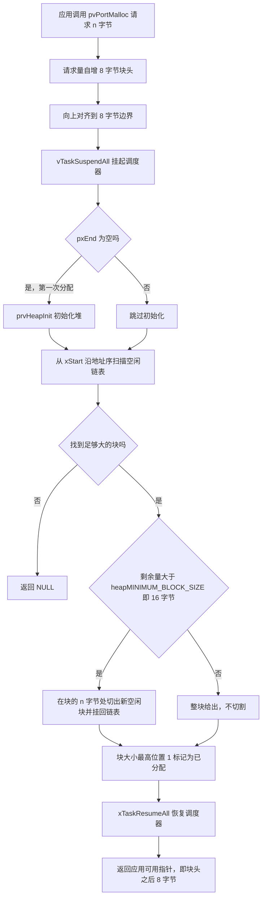
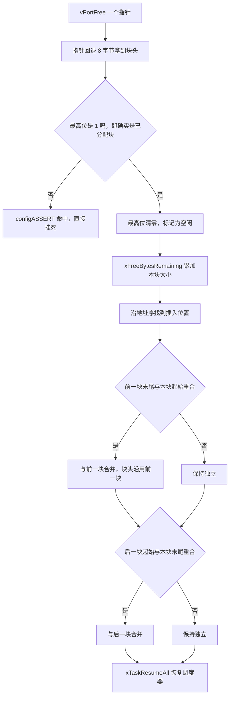

# heap_4 与 40 KB 堆

> 续 `01-内存方案对比`。本文把 `configTOTAL_HEAP_SIZE = 40960` 这一个数字彻底拆开：
> 先说 heap_4 的块结构和算法，再把 40 KB 里"能实际发给应用"的部分算到字节，
> 最后给出一张本工程真实的堆预算表。
>
> 本文所有尺寸都是实测值，来自工具链探针：`sizeof(TCB_t)`、`sizeof(Queue_t)` 是用
> `arm-none-eabi-gcc` 拿本工程的 `FreeRTOSConfig.h` 和 port 头文件编译探针量出来的；
> 堆地址和 `ucHeap` 大小取自 `build/Debug/sentriomeni2026.map`。

## 1. 开篇：40 KB 从哪来

`Core/Inc/FreeRTOSConfig.h` 第 67 行：

```c
#define configTOTAL_HEAP_SIZE                    ((size_t)40960)
```

40960 = 40 × 1024，也就是 40 KB。它就是 heap_4 里这个数组的长度：

```c
/* heap_4.c:59-65 */
#if( configAPPLICATION_ALLOCATED_HEAP == 1 )
	extern uint8_t ucHeap[ configTOTAL_HEAP_SIZE ];
#else
	static uint8_t ucHeap[ configTOTAL_HEAP_SIZE ];
#endif
```

本工程没有定义 `configAPPLICATION_ALLOCATED_HEAP`（默认 0），所以 `ucHeap` 是 heap_4.c 内部的 `static` 数组，落在 `.bss` 段。链接 map 里能看到它：

```text
.bss.ucHeap    0x200005d4     0xa000    heap_4.c.obj
```

最后一列 `0xa000` 就是 40960，配置里的数字和链接后的实际大小对得上。

这块内存只占 RAM，不占 Flash。本工程 STM32F407 有 128 KB SRAM（链接脚本 `RAM ORIGIN = 0x20000000, LENGTH = 128K`，栈顶 `_estack = 0x20020000`）。整块 `.bss` 是 54668 字节，其中 `ucHeap` 就占了 40960，也就是 75%。

下面要看的是这 40 KB 装下了什么、还剩多少、够不够。

## 2. 核心概念：heap_4 的块结构

### 2.1 每个块前面都有 8 字节的块头

heap_4 把整块内存切成一段段"块"（block），每个块的开头都放一个 `BlockLink_t`：

```c
/* heap_4.c:69-73 */
typedef struct A_BLOCK_LINK
{
	struct A_BLOCK_LINK *pxNextFreeBlock;	/* 下一个空闲块 */
	size_t xBlockSize;						/* 本块大小 */
} BlockLink_t;
```

在 32 位 Cortex-M 上，两个 4 字节成员 = 8 字节。再向上对齐到 `portBYTE_ALIGNMENT`：

```c
/* heap_4.c:95 */
static const size_t xHeapStructSize = ( sizeof( BlockLink_t ) + ( portBYTE_ALIGNMENT - 1 ) ) & ~( portBYTE_ALIGNMENT_MASK );
```

本工程的 `portBYTE_ALIGNMENT` 是 8（`portable/GCC/ARM_CM4F/portmacro.h:75`），而 8 本身已经对齐，所以：

$$S_{\text{link}} = \text{sizeof}(\text{BlockLink\_t}) = 8 \ \text{bytes}$$

这 8 字节是每次分配都要付出的固定开销。申请 84 字节的 TCB，实际从堆里挖走的是 $84 + 8 = 92$ 字节。本工程一共 13 次分配，光是块头就吃掉 $13 \times 8 = 104$ 字节。

### 2.2 空闲链表：按地址升序，两端有哨兵

heap_4 维护一条空闲块链表，关键特征是它按内存地址从小到大排序，不按大小排序：

```c
/* heap_4.c:98 */
static BlockLink_t xStart, *pxEnd = NULL;
```

- `xStart` 是链表头哨兵，本身不是一块内存；
- `pxEnd` 指向堆的最末尾，是一块大小为 0 的假块，只用来标记"扫到底了"。

按地址排序有两个后果：

1. 分配只能线性扫描（first fit），不像按大小排序可以更快挑块；
2. 释放时可以 O(1) 判断前后相邻，因为链表本身就是地址序，前一项的地址加大小就是后一项。

第 2 条正是 heap_4 能合并相邻空闲块的前提。

### 2.3 用最高位当"已分配"标志

heap_4 不给每个块额外加标志位，而是借用 `xBlockSize` 的最高位：

```c
/* heap_4.c:107-111 */
static size_t xBlockAllocatedBit = 0;
/* prvHeapInit 末尾： */
xBlockAllocatedBit = ( ( size_t ) 1 ) << ( ( sizeof( size_t ) * heapBITS_PER_BYTE ) - 1 );
```

- 最高位 = 0：这块空闲，在空闲链表上；
- 最高位 = 1：这块已分配，属于应用；
- 真实大小要 `xBlockSize & ~xBlockAllocatedBit` 取回来。

代价是块大小不能超过 $2^{31}$ 字节。对 40 KB 的堆来说这不构成问题，但这解释了为什么 `pvPortMalloc` 开头有这么一句：

```c
/* heap_4.c:137 */
if( ( xWantedSize & xBlockAllocatedBit ) == 0 )   /* 申请的太大就直接放弃 */
```

### 2.4 最小块：16 字节

```c
/* heap_4.c:53 */
#define heapMINIMUM_BLOCK_SIZE	( ( size_t ) ( xHeapStructSize << 1 ) )   /* = 8 << 1 = 16 */
```

分割（split）只在剩余量大于 16 字节时才做。如果一块 100 字节的空闲块被申请走 90 字节，剩下的 10 字节不会被单独切出来：太小了，切出来光块头就占 8 字节，还得额外维护链表项。整块 100 字节都归这次申请。

这条规则叫"不许出现小于 `heapMINIMUM_BLOCK_SIZE` 的碎片"，是 heap_4 抑制碎片的第二道防线。

## 3. 机制/原理

### 3.1 分配：首次适配 + 分割



```c
/* heap_4.c:165-186（节选，删掉了 coverage 标记） */
pxPreviousBlock = &xStart;
pxBlock = xStart.pxNextFreeBlock;
while( ( pxBlock->xBlockSize < xWantedSize ) && ( pxBlock->pxNextFreeBlock != NULL ) )
{
	pxPreviousBlock = pxBlock;
	pxBlock = pxBlock->pxNextFreeBlock;
}

if( pxBlock != pxEnd )            /* 没扫到 pxEnd 说明找到了 */
{
	pvReturn = ( void * ) ( ( ( uint8_t * ) pxPreviousBlock->pxNextFreeBlock ) + xHeapStructSize );
	pxPreviousBlock->pxNextFreeBlock = pxBlock->pxNextFreeBlock;
```

注意 `pvReturn` 那一行：返回给应用的指针 = 块地址 + 8。这就是 `xHeapStructSize` 在运行期的体现。

### 3.2 释放：按地址插回 + 相邻合并

合并是 heap_4 的核心机制。看真实实现：

```c
/* heap_4.c:398-425（节选） */
static void prvInsertBlockIntoFreeList( BlockLink_t *pxBlockToInsert )
{
	BlockLink_t *pxIterator;
	uint8_t *puc;

	/* 按地址序找到插入位置 */
	for( pxIterator = &xStart; pxIterator->pxNextFreeBlock < pxBlockToInsert; pxIterator = pxIterator->pxNextFreeBlock )
	{
	}

	/* 与前面的块相邻吗 */
	puc = ( uint8_t * ) pxIterator;
	if( ( puc + pxIterator->xBlockSize ) == ( uint8_t * ) pxBlockToInsert )
	{
		pxIterator->xBlockSize += pxBlockToInsert->xBlockSize;
		pxBlockToInsert = pxIterator;
	}
	/* 后面还有一段：与后面的块相邻则再合并一次 */
```

"前面的块末尾地址 == 本块起始地址"这个判断能成立，完全依赖链表按地址排序。这正是第 2.2 节那个设计选择带来的收益。



### 3.3 碎片的产生条件与本工程的情况

碎片指空闲总量够、但没有一块连续空间够大的情况，与内存是否用尽无关。heap_4 的合并能治好相邻碎片，治不了被已分配块隔开的碎片。


结论很清楚：heap_4 的碎片风险只来自释放之后再申请一个介于两者之间的大小。

本工程运行期一次都不释放。看 `Core/Src/freertos.c` 的创建顺序：1 个队列 + 6 个任务全在 `osKernelStart()` 之前完成，之后再没有任何一次 `pvPortMalloc` 或 `vPortFree`。

所以，尽管代码链接的是带合并功能的 heap_4，本工程在运行期实际上退化成 heap_1 的行为：堆里只有"已分配区"和"一整块尾部空闲区"，永不碎片。这是最理想的组合，既保留 heap_4 随时能加任务的余量，又承担零碎片风险。

> 运行期一旦加入 `vTaskDelete()` 加 `osThreadCreate()` 的循环，
> 或者用队列传递不定大小的堆块，碎片就会回来。这时 `xPortGetMinimumEverFreeHeapSize()` 就是报警器（见第 5 节）。

## 4. 40960 里有 40944 可用：prvHeapInit 的三次截断

配置里写 40960，并不等于实际能拿到 40960。`prvHeapInit()` 会砍掉三部分：

```c
/* heap_4.c:333-372（节选） */
static void prvHeapInit( void )
{
	size_t uxAddress;
	size_t xTotalHeapSize = configTOTAL_HEAP_SIZE;

	uxAddress = ( size_t ) ucHeap;
	if( ( uxAddress & portBYTE_ALIGNMENT_MASK ) != 0 )      /* 截断一：头部对齐 */
	{
		uxAddress += ( portBYTE_ALIGNMENT - 1 );
		uxAddress &= ~( portBYTE_ALIGNMENT_MASK );
		xTotalHeapSize -= uxAddress - ( size_t ) ucHeap;
	}
	pucAlignedHeap = ( uint8_t * ) uxAddress;

	uxAddress = ( ( size_t ) pucAlignedHeap ) + xTotalHeapSize;
	uxAddress -= xHeapStructSize;                            /* 截断二：pxEnd 块头 */
	uxAddress &= ~( portBYTE_ALIGNMENT_MASK );               /* 截断三：尾部对齐 */
	pxEnd = ( void * ) uxAddress;
	...
	pxFirstFreeBlock->xBlockSize = uxAddress - ( size_t ) pxFirstFreeBlock;
	xMinimumEverFreeBytesRemaining = pxFirstFreeBlock->xBlockSize;
	xFreeBytesRemaining = pxFirstFreeBlock->xBlockSize;      /* 这就是可用量的初始值 */
}
```

代入本工程的实际地址。`ucHeap` 落在 `0x200005d4`，$0x200005d4 \bmod 8 = 4$，所以头部要浪费 4 字节对齐：

$$U = H - a_{\text{head}} - S_{\text{link}} - a_{\text{tail}} = 40960 - 4 - 8 - 4 = 40944 \ \text{bytes}$$

| 项 | 字节数 | 为什么会丢 |
| --- | --- | --- |
| `configTOTAL_HEAP_SIZE` 声明值 | 40960 | — |
| 头部对齐截断 $a_{\text{head}}$ | −4 | `ucHeap` 起始地址 `0x200005d4` 不是 8 字节对齐，`prvHeapInit` 向上取整到 `0x200005d8` |
| `pxEnd` 哨兵块头 | −8 | 堆末尾必须放一个 `BlockLink_t` 标记链表终点 |
| 尾部对齐截断 $a_{\text{tail}}$ | −4 | `pxEnd` 地址又做了一次 `&~7` |
| 实际可用 $U$ | 40944 | 也就是 `xFreeBytesRemaining` 的初始值 |

真实可用量是 40944 字节，比声明值少 16 字节。它同时给出一个方法论：凡是配置里写的容量，都要往下算到实际可用，否则会在"为什么剩下 12488 而我以为是 12504"这种问题上浪费半小时。

> 这 16 字节不是固定的。换个编译选项、加个源文件，链接器就可能把 `ucHeap` 挪到别的地址，
> 头部对齐开销会在 0~7 字节之间变。所以结论要写成公式，不能只背一个数。

## 5. 真实堆预算表

现在可以算本工程实际吃掉了多少。本工程一共 13 次分配。

### 5.1 逐次分配的实测参数

| 参数 | 实测值 | 来源 |
| --- | --- | --- |
| `sizeof(StackType_t)` | 4 | `portmacro.h`，Cortex-M 字长 |
| `sizeof(TCB_t)` | 84 | 工具链探针实测（`StaticTask_t` 也是 84，map 里 `xIdleTaskTCBBuffer` 为 `0x54`） |
| `sizeof(Queue_t)` | 72 | 工具链探针实测 |
| `xHeapStructSize` | 8 | `heap_4.c:95` |
| 每个 TCB 的堆开销 | $84 + 8 = 92$ | TCB 单独一次 `pvPortMalloc( sizeof(TCB_t) )` |
| 每个任务栈的堆开销 | $4 d + 8$ | `pvPortMalloc( d * sizeof(StackType_t) )`，$d$ 为栈深（words） |

`TCB_t` 与栈是两次独立分配（`tasks.c:770-780`，因为 `portSTACK_GROWTH = -1` 走的是先栈后 TCB 的分支），所以每个任务要承担两次 8 字节块头开销。

### 5.2 预算表

队列先创建（`freertos.c:114`），随后 `defaultTask`（`freertos.c:123-124`），再是 5 个应用任务（`freertos.c:129-133`）。

| # | 对象 | 创建位置 | 栈深 words | 栈字节 | 栈+块头 | TCB+块头 | 小计 |
| --- | --- | --- | --- | --- | --- | --- | --- |
| 1 | `usbRxQueue` | `freertos.c:114` | — | 128 | — | — | 208 |
| 2 | `defaultTask` | `freertos.c:123` | 256 | 1024 | 1032 | 92 | 1124 |
| 3 | `StartFireTask` | `FireTask.cpp:217` | 512 | 2048 | 2056 | 92 | 2148 |
| 4 | `imuTask` | `ImuTask.cpp:112` | 1024 | 4096 | 4104 | 92 | 4196 |
| 5 | `gimbalTask` | `GimbalTask.cpp:120` | 2048 | 8192 | 8200 | 92 | 8292 |
| 6 | `StartControlCenterTask` | `ControlCenterTask.cpp:149` | 1024 | 4096 | 4104 | 92 | 4196 |
| 7 | `StartUsbConnectTask` | `UsbConnectTask.cpp:118` | 2048 | 8192 | 8200 | 92 | 8292 |
| | 合计 | | 6912 | 27648 | 27696 | 552 | 28456 |

其中队列的 208 字节是这样来的：队列体大小 = `sizeof(Queue_t)` + 消息存储 = $72 + (128 \times 1) = 200$，再加上 8 字节块头 = 208。

用公式写一遍：

$$C = \underbrace{208}_{\text{queue}} + \sum_{i=1}^{6}\left(\underbrace{4 d_i + 8}_{\text{stack}} + \underbrace{92}_{\text{TCB}}\right) = 208 + 27648 + 48 + 552 = 28456 \ \text{bytes}$$

$$U - C = 40944 - 28456 = 12488 \ \text{bytes} \approx 12.19 \ \text{KiB}$$

结论：6 个任务 + 1 个队列一共吃掉 28456 字节，占真实可用量的 69.5%，还剩 12488 字节（约 12.2 KB，30.5%）。

### 5.3 不在堆里的部分

别把这两块算进上面的预算：

| 对象 | 大小 | 位置 |
| --- | --- | --- |
| 空闲任务栈 `xIdleStack[256]` | 1024 B | `.bss.xIdleStack`，静态 |
| 空闲任务 TCB `xIdleTaskTCBBuffer` | 84 B | `.bss.xIdleTaskTCBBuffer`，静态 |
| 定时器任务 | 不存在 | `configUSE_TIMERS` 未定义，默认 0 |

如果哪天把 `configUSE_TIMERS` 打开，堆会立刻多出 `configTIMER_TASK_STACK_DEPTH` 字节的栈 + 92 字节 TCB + 定时器队列，而且必须补写 `vApplicationGetTimerTaskMemory()`。

## 6. xPortGetFreeHeapSize / xPortGetMinimumEverFreeHeapSize 怎么用

heap_4 提供两个查询函数，实现只有一行：

```c
/* heap_4.c:315-323 */
size_t xPortGetFreeHeapSize( void )
{
	return xFreeBytesRemaining;          /* 当前还剩多少 */
}

size_t xPortGetMinimumEverFreeHeapSize( void )
{
	return xMinimumEverFreeBytesRemaining;   /* 历史最低水位 */
}
```

这两个数的区别决定了用法：

| 函数 | 含义 | 用途 |
| --- | --- | --- |
| `xPortGetFreeHeapSize()` | 此刻空闲字节数 | 看当前余量，但会随任务删建、队列增删而波动，可能误导 |
| `xPortGetMinimumEverFreeHeapSize()` | 自开机以来出现过的最小空闲字节数（水位） | 判断"最坏那一刻够不够"，这才是容量判据 |

`xMinimumEverFreeBytesRemaining` 在 `prvHeapInit()` 里被初始化成初始空闲量（本工程 40944），之后只降不升。所以它不会因为某个模块释放了内存而变好看，这正是判断容量需要的性质。

### 6.1 在本工程里怎么打印

本工程有 `Debug_vars` 与 `debug.h`，也可以直接借 USB CDC 或串口。最省事的做法是临时塞进 `StartDefaultTask`：

```c
/* 放在 Core/Src/freertos.c 的 StartDefaultTask 里，仅用于排查 */
#include <stdio.h>
#include "task.h"

void StartDefaultTask(void const * argument)
{
  MX_USB_DEVICE_Init();
  for(;;)
  {
    size_t freeNow = xPortGetFreeHeapSize();
    size_t freeMin = xPortGetMinimumEverFreeHeapSize();
    /* 40960 - freeMin 得到的是"总占用"，含 heap_4 的 16 字节结构开销 */
    printf("[heap] now=%u min=%u consumed=%u\r\n",
           (unsigned)freeNow,
           (unsigned)freeMin,
           (unsigned)(40960u - freeMin));
    osDelay(2000);
  }
}
```

第一次打印应该是 `now=12488 min=12488`，和上表算的完全一致，这是验证理解是否正确的最快方法。

> 注意 `printf` 走的是哪个堆：`printf` 的缓冲和内部结构走 newlib 那 512 字节小堆（`_Min_Heap_Size = 0x200`），
> 不走 `ucHeap`。而且 `printf` 本身不是线程安全的。排查时用一次没问题，
> 但别把它塞进 1 kHz 的控制循环，那会拖慢控制周期，还会把 newlib 堆搅乱。

### 6.2 三个必须知道的前提

1. 必须在第一次 `pvPortMalloc` 之后调用。因为 `prvHeapInit()` 是懒初始化的（`heap_4.c:124-127`），在那之前 `xFreeBytesRemaining` 还是 0。
2. 返回值单位是字节，不是字。`uxTaskGetStackHighWaterMark()` 的单位是字，两者别混（见 `04-栈溢出检测与断言`）。
3. 不要用 `xPortGetFreeHeapSize` 做业务判断。它是瞬时值，会被无关的分配/释放带偏；要判断容量是否安全，看 `xPortGetMinimumEverFreeHeapSize`。

## 7. 40 KB 对 6 个任务栈的余量

### 7.1 静态结论：够用，只占 69.5%

按第 5 节的预算：栈本身 27648 字节 + 块头 48 + TCB 552 + 队列 208 = 28456 字节，占 40944 的 69.5%，剩 12488 字节。

这个答案成立的前提是每个任务的栈用量都不超过声明值。声明值只是预留，写小了就是栈溢出（见 `04`）。所以"够不够"这个问题，严格来说要分两步答：

1. 静态判据：所有声明栈之和 + 开销 ≤ 可用堆，本工程 69.5%，合格；
2. 动态判据：每个任务的实际峰值 ≤ 自己的声明栈，需要水位实测，本工程 `configCHECK_FOR_STACK_OVERFLOW` 关了（默认 0），所以第 2 条目前没有在守。

### 7.2 还能撑多少：余量的几种用法

12488 字节的余量对应下面几种选择：

| 想加的东西 | 需要的堆 | 余下 |
| --- | --- | --- |
| 现状（基线） | 28456 | 12488 |
| 再加一个 1024 words 的同款任务 | 4196 | 8292 |
| 再加两个 1024 words 的任务 | 8392 | 4096 |
| 再加一个 2048 words 的任务 | 8292 | 4196 |
| 把 6 个任务的栈全部翻倍 | +27648 | −15160，不够 |
| 打开 `configUSE_TIMERS`（默认 256 words 栈） | 1024 + 92 + 定时器队列 | 约 11000 |

最后两行是两个要点：

- 栈翻倍是撑不住的。因为 40 KB 里绝大部分已经是栈（27648/40944 = 67.5%）。本工程把 `configTOTAL_HEAP_SIZE` 定成 40960 而不是 CubeMX 默认的 15360，原因就是 6 个任务的栈加起来已经 27 KB，15360 根本创建不完任务。
- 加定时器任务比想象中贵。它不只是栈，还有定时器命令队列，而且 `configUSE_TIMERS = 1` 会强制要求实现 `vApplicationGetTimerTaskMemory()`。

### 7.3 底盘板 `configMINIMAL_STACK_SIZE` 取 512 的原因

| | 云台板 | 底盘板 |
| --- | --- | --- |
| `configMINIMAL_STACK_SIZE` | 256 words = 1024 B | 512 words = 2048 B |
| 影响对象 | 静态空闲任务栈 `xIdleStack` | 静态空闲任务栈 `xIdleStack` |
| 是否占用 `ucHeap` | 否，走 `.bss` | 否，走 `.bss` |

注意 `configMINIMAL_STACK_SIZE` 在本工程只影响空闲任务（因为所有应用任务都显式传了栈深）。底盘板把它翻倍，说明底盘的空闲任务承担的工作更多（`vApplicationIdleHook` 之类，或者只是保守）。因为空闲任务栈是静态的，这个改动不消耗 `ucHeap`，只影响 `.bss` 里的 1 KB → 2 KB。

> 一个容易记错的细节：`configMINIMAL_STACK_SIZE` 的单位是 words，不是字节。声明里的写法是
> `#define configMINIMAL_STACK_SIZE ((uint16_t)256)`，那个 `uint16_t` 只是类型转换，
> `freertos.c` 里 `StackType_t xIdleStack[configMINIMAL_STACK_SIZE]` 展开成 `xIdleStack[256]` = 1024 字节。
> 写成 `256` 时如果误以为是字节，就会以为空闲任务只有 256 字节栈，那会直接崩溃。

## 8. 小结

### 核心概念总结

| 概念 | 要点 |
| --- | --- |
| `ucHeap` | heap_4.c 里的静态数组，`.bss.ucHeap`，40960 字节，不占 Flash |
| `xHeapStructSize` = 8 | 每次分配的固定块头开销，13 次分配共 104 字节 |
| 首次适配 | 按地址序扫第一个够大的块；最坏 O(n) |
| 相邻合并 | 释放时与地址相邻的空闲块合并，依赖链表按地址排序 |
| `heapMINIMUM_BLOCK_SIZE` = 16 | 不许切出小于 16 字节的碎片 |
| 最高位标志 | 块大小最高位当已分配位，省掉额外标志字段 |
| 真实可用量 | 40944，不是 40960（头部对齐 4 + `pxEnd` 8 + 尾部对齐 4） |
| 本工程用量 | 28456 / 40944 = 69.5%，余 12488 字节 |
| 碎片风险 | 本工程运行期零释放，实际是 heap_1 的行为，零碎片 |
| 水位 | `xPortGetMinimumEverFreeHeapSize()` 只降不升，才是容量判据 |

### 设计权衡

| 决策 | 好处 | 代价 |
| --- | --- | --- |
| 用 heap_4 而不是 heap_1 | 保留 `vTaskDelete` 余量，未来改动不用重选方案 | 多 100 行代码；分配耗时不再是常数 |
| 堆定 40960 而不是默认 15360 | 6 个任务的栈（27648 B）才有地方放 | 吃掉 75% 的 `.bss`，RAM 余量变紧 |
| 空闲任务静态化 | 杜绝"堆小到连空闲任务都建不出来" | `configSUPPORT_STATIC_ALLOCATION = 1` 会带来链接期钩子强依赖 |
| 运行期不释放 | 零碎片风险 | 失去了动态伸缩任务的灵活性 |
| 不开 `configCHECK_FOR_STACK_OVERFLOW` | 省一次 27648 字节的 `memset` 与少量代码 | 栈溢出完全没有保护，这是本工程最大的监控盲区 |

### 结论

`configTOTAL_HEAP_SIZE = 40960` 这句话的真实含义是可用 40944 字节，其中 28456 字节被 6 个任务和 1 个队列一次性占掉，剩 12488 字节。把这个数算清楚，比背任何 API 都更有助于改配置时不慌。

## 9. 练习题

### 基础题

1. 用第 5 节的公式复算一遍：如果 `gimbalTask` 的栈从 2048 降到 1536，堆用量变成多少？余量变成多少？
2. `xPortGetFreeHeapSize()` 和 `xPortGetMinimumEverFreeHeapSize()` 在本工程启动后第一次调用时，为什么两个值相等？之后会不会同时下降？
3. 队列的 208 字节是怎么构成的？如果改成 `xQueueCreate(128, sizeof(uint16_t))`，会变成多少？

### 挑战题

4. 本工程运行期不释放，所以零碎片。请设计一个实验来证明这个结论：在 `StartTestTask` 里循环创建并删除一个 256 words 的任务（`osThreadCreate` + `vTaskDelete`），每隔 100 次打印 `xPortGetMinimumEverFreeHeapSize()`，预测曲线形状并解释为什么它会单调下降而不是立刻耗尽。
5. 假设在 `ucHeap` 后面又定义了一个大数组，导致链接器把 `ucHeap` 挪到了 `0x200005dc`（8 字节对齐）。此时真实可用量 $U$ 会变成 40952 还是 40944？请把 `prvHeapInit` 的三次截断逐行代入算一遍。
6. 本工程 `configUSE_TIMERS` = 0。如果改成 1，需要新增哪些内存开销？`vApplicationGetTimerTaskMemory()` 和 `vApplicationGetIdleTaskMemory()` 有什么结构上的不同？
