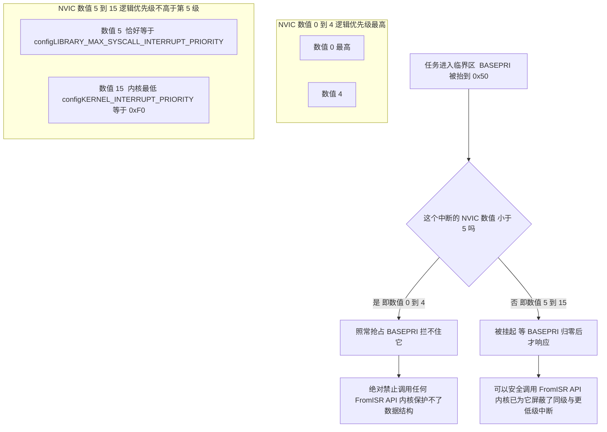
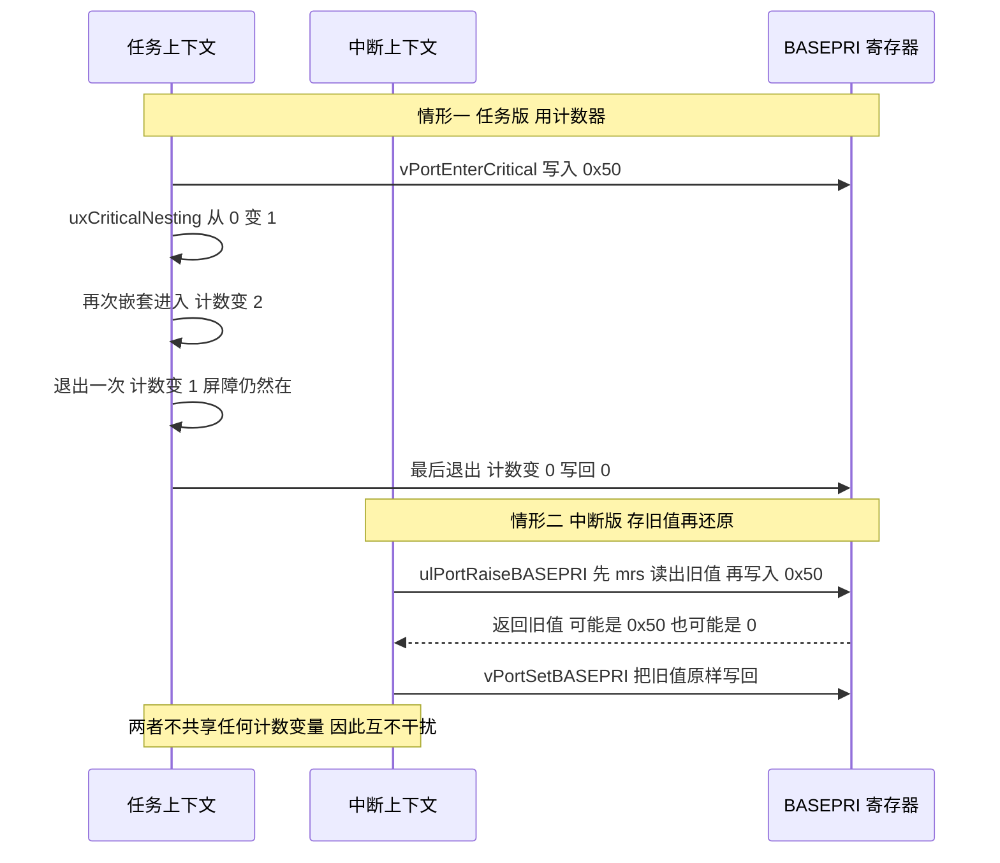
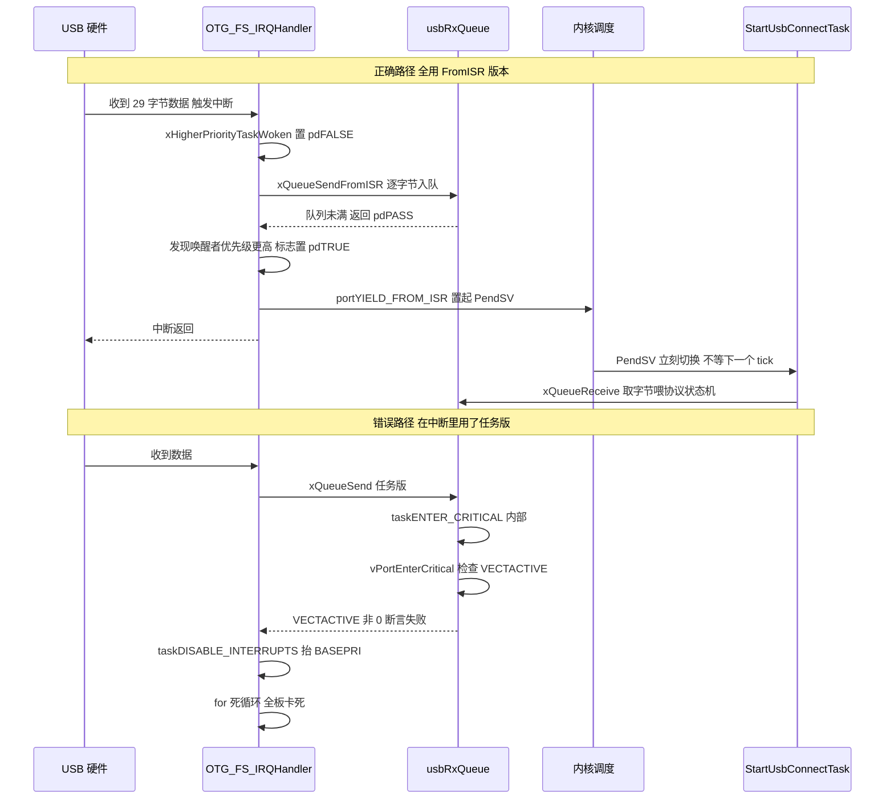
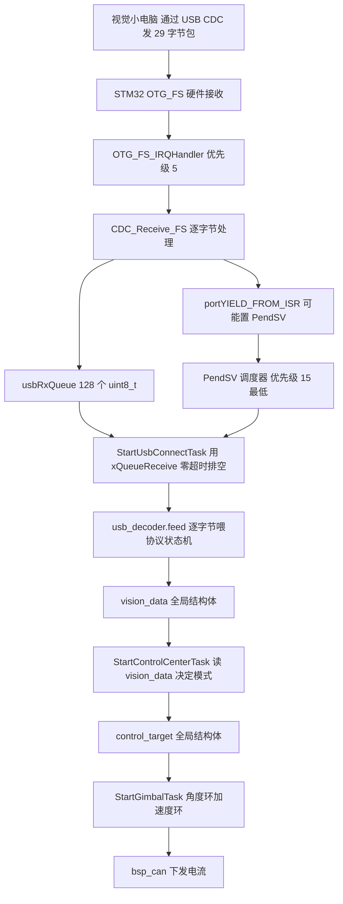
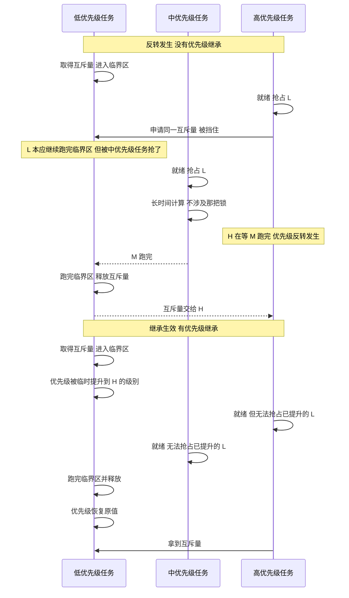

# 临界区与中断安全

> 本文是 `03-内存管理与临界区` 单元的核心。所有结论都对着本工程的两份源码：
> `portable/GCC/ARM_CM4F/portmacro.h`（BASEPRI 汇编）、`port.c`（临界区实现），
> 以及真实应用代码 `USB_DEVICE/App/usbd_cdc_if.c` 里唯一一处 ISR 调用队列的地方。

## 1. 开篇：临界区每毫秒都在跑

多数人第一次听到"临界区"是在教程里看到 `taskENTER_CRITICAL()`。但在本工程里，应用层从来没有写过这个宏，它却每毫秒都在跑。

证据：`Core/Src/freertos.c` 建了一个队列，`USB_DEVICE/App/usbd_cdc_if.c` 在 USB 中断里往里塞字节：

```c
/* Core/Src/freertos.c:114 */
usbRxQueue = xQueueCreate(128, sizeof(uint8_t));

/* USB_DEVICE/App/usbd_cdc_if.c:264-282（节选） */
static int8_t CDC_Receive_FS(uint8_t* Buf, uint32_t *Len)
{
  BaseType_t xHigherPriorityTaskWoken = pdFALSE;

  if (usbRxQueue == NULL) {
    goto exit;
  }

  for (uint32_t i = 0; i < *Len; i++) {
    if (xQueueSendFromISR(usbRxQueue, &Buf[i], &xHigherPriorityTaskWoken) != pdPASS) {} // 队列满丢弃
  }

exit:
  USBD_CDC_SetRxBuffer(&hUsbDeviceFS, Buf);
  USBD_CDC_ReceivePacket(&hUsbDeviceFS);

  portYIELD_FROM_ISR(xHigherPriorityTaskWoken);

  return USBD_OK;
}
```

`xQueueSendFromISR()` 内部必然要操作队列的读写指针和等待任务链表，这是典型的临界区。如果它在改链表时被另一个中断打断、那个中断也来改同一个队列，链表就断了。

FreeRTOS 保护它的方式是抬高中断屏蔽门槛（BASEPRI），并没有关掉所有中断。本文把这件事讲透：抬到多高、抬的时候谁还能进来、以及中断里只能用 `FromISR` 版本的原因。

## 2. 核心概念：Cortex-M 的优先级是"数值越小越优先"

这一节先立规矩，否则第 4 节容易看晕。

### 2.1 两套说法，必须分清

Cortex-M 的 NVIC 用数值表示优先级：数值越小，优先级越高。`0` 是最高，`15` 是最低（STM32F407 用了 4 个位，`configPRIO_BITS = 4`）。

于是同一件事有两种说法，日常对话里全都用"优先级高/低"，极易混淆。本文统一用两个词：

| 说法 | 含义 | 例子 |
| --- | --- | --- |
| NVIC 数值 | 寄存器里实际写进去的数，0~15 | `5` |
| 逻辑优先级 | "谁能打断谁"的直觉等级，数值越小越高 | NVIC 数值 5 对应"第 5 级"；0 是第 0 级，最高 |

所以 `configLIBRARY_MAX_SYSCALL_INTERRUPT_PRIORITY = 5` 这句配置，准确的读法是：

> NVIC 数值 ≥ 5 的中断，也就是逻辑优先级不高于第 5 级的中断，属于"内核可管理"范围。

本文后面凡是写"数值"，一律指 NVIC 数值。

### 2.2 优先级分组必须和 `configPRIO_BITS` 对齐

STM32 的 4 个优先级位可以切成"抢占位 + 子优先级位"。本工程的分组由 HAL 设置：

```c
/* Drivers/STM32F4xx_HAL_Driver/Src/stm32f4xx_hal.c:173，HAL_Init 内部 */
HAL_NVIC_SetPriorityGrouping(NVIC_PRIORITYGROUP_4);   /* 4 位全是抢占优先级，0 位子优先级 */
```

而 FreeRTOS 这边通过 CMSIS 拿到同样的位数：

```c
/* Core/Inc/FreeRTOSConfig.h:95-100 */
#ifdef __NVIC_PRIO_BITS
 #define configPRIO_BITS         __NVIC_PRIO_BITS     /* STM32F407 上是 4 */
#else
 #define configPRIO_BITS         4
#endif
```

两者必须一致。如果哪天把分组改成 `NVIC_PRIORITYGROUP_2`（2 位抢占 + 2 位子优先级），却没把 `configPRIO_BITS` 改成 2，FreeRTOS 换算出的 `configMAX_SYSCALL_INTERRUPT_PRIORITY` 就会写错位，屏障关系整个错位。这是移植时最容易出错的一步。

## 3. 机制：taskENTER_CRITICAL 到底做了什么

### 3.1 宏的链路

`taskENTER_CRITICAL()` 在 `task.h` 里只是一层转发：

```c
/* include/task.h:187-222（节选） */
#define taskENTER_CRITICAL()              portENTER_CRITICAL()
#define taskENTER_CRITICAL_FROM_ISR()     portSET_INTERRUPT_MASK_FROM_ISR()
#define taskEXIT_CRITICAL()               portEXIT_CRITICAL()
#define taskEXIT_CRITICAL_FROM_ISR( x )   portCLEAR_INTERRUPT_MASK_FROM_ISR( x )
#define taskDISABLE_INTERRUPTS()          portDISABLE_INTERRUPTS()
#define taskENABLE_INTERRUPTS()           portENABLE_INTERRUPTS()
```

再往下到 ARM_CM4F 的 port：

```c
/* portable/GCC/ARM_CM4F/portmacro.h:99-104 */
#define portSET_INTERRUPT_MASK_FROM_ISR()		ulPortRaiseBASEPRI()
#define portCLEAR_INTERRUPT_MASK_FROM_ISR(x)	vPortSetBASEPRI(x)
#define portDISABLE_INTERRUPTS()				vPortRaiseBASEPRI()
#define portENABLE_INTERRUPTS()					vPortSetBASEPRI(0)
#define portENTER_CRITICAL()					vPortEnterCritical()
#define portEXIT_CRITICAL()						vPortExitCritical()
```

注意 `portDISABLE_INTERRUPTS()` 的名字有误导性：它并不等同于 `__disable_irq()`（那个是 PRIMASK，关掉除 NMI/HardFault 外的一切），只是抬高 BASEPRI。

### 3.2 实现细节

```c
/* portable/GCC/ARM_CM4F/port.c:403-428 */
void vPortEnterCritical( void )
{
	portDISABLE_INTERRUPTS();          /* 把 BASEPRI 抬到 configMAX_SYSCALL_INTERRUPT_PRIORITY */
	uxCriticalNesting++;

	/* 这一句是给"在中断里误用非 FromISR 版本"准备的 */
	if( uxCriticalNesting == 1 )
	{
		configASSERT( ( portNVIC_INT_CTRL_REG & portVECTACTIVE_MASK ) == 0 );
	}
}

void vPortExitCritical( void )
{
	configASSERT( uxCriticalNesting );
	uxCriticalNesting--;
	if( uxCriticalNesting == 0 )
	{
		portENABLE_INTERRUPTS();       /* BASEPRI 归零，屏障解除 */
	}
}
```

三个要点：

1. `uxCriticalNesting` 是嵌套计数。`taskENTER_CRITICAL()` 可以嵌套调用，只有最外层退出时才真的解除屏障。
2. `uxCriticalNesting` 是全局变量，不是每任务一份。因为在临界区里不可能发生任务切换（切换靠 PendSV，而 PendSV 的优先级恰好等于内核最低优先级，会被 BASEPRI 挡住）。所以"当前只有一个任务在临界区里"是成立的。
3. `configASSERT( ( portNVIC_INT_CTRL_REG & portVECTACTIVE_MASK ) == 0 )` 这一句检查 VECTACTIVE 是否为 0，也就是"当前是不是在中断上下文"。如果在 ISR 里误调 `taskENTER_CRITICAL()`，这里直接命中 `configASSERT`，而本工程的 `configASSERT` 是死循环（见 `04`）。

### 3.3 BASEPRI 原理

抬 BASEPRI 用的是这段内联汇编：

```c
/* portable/GCC/ARM_CM4F/portmacro.h:191-203 */
portFORCE_INLINE static void vPortRaiseBASEPRI( void )
{
uint32_t ulNewBASEPRI;

	__asm volatile
	(
		"	mov %0, %1												\n"	\
		"	msr basepri, %0											\n" \
		"	isb														\n" \
		"	dsb														\n" \
		:"=r" (ulNewBASEPRI) : "i" ( configMAX_SYSCALL_INTERRUPT_PRIORITY ) : "memory"
	);
}
```

BASEPRI 的硬件语义只有一句：当前中断的优先级数值 ≥ BASEPRI 时，不被允许进入（挂起等待）；数值 < BASEPRI 的中断照常抢占。

FreeRTOS 把 `configMAX_SYSCALL_INTERRUPT_PRIORITY` 写进 BASEPRI。它由库级配置左移得到：

```c
/* Core/Inc/FreeRTOSConfig.h:104-117 */
#define configLIBRARY_LOWEST_INTERRUPT_PRIORITY       15
#define configLIBRARY_MAX_SYSCALL_INTERRUPT_PRIORITY  5

#define configKERNEL_INTERRUPT_PRIORITY \
        ( configLIBRARY_LOWEST_INTERRUPT_PRIORITY << (8 - configPRIO_BITS) )
        /* = 15 << 4 = 240 = 0xF0 */

#define configMAX_SYSCALL_INTERRUPT_PRIORITY \
        ( configLIBRARY_MAX_SYSCALL_INTERRUPT_PRIORITY << (8 - configPRIO_BITS) )
        /* = 5 << 4 = 80 = 0x50 */
```

左移的原因：STM32F407 只用优先级寄存器的高 4 位，NVIC 把 `5` 存成 `5 << 4 = 0x50`。CMSIS 的 `NVIC_SetPriority()` 完成了这个移位（所以在 `HAL_NVIC_SetPriority()` 里写的是 `5`，不是 `0x50`），而 FreeRTOS 的 port 直接写寄存器，必须自己移位。

### 3.4 屏蔽关系图



这张图的结论是：

> BASEPRI = 0x50 屏蔽的是 NVIC 数值 ≥ 5 的中断；数值 0~4 的中断仍然能随时进来，因此它们绝不允许调用 FreeRTOS API。

> 术语提醒：网上常看到"它屏蔽的是优先级 ≤ 5 的中断"。这句话用的是逻辑优先级口径
> （"第 5 级及更低"），此时对应的 NVIC 数值是 `≥ 5`。两种口径说的是同一批中断。
> 但如果把"优先级 ≤ 5"理解成"NVIC 数值 ≤ 5"，结论就正好反了，那会把 0~4 也说成被屏蔽。
> 写代码时一律用 NVIC 数值和 `≥` 符号，不要用"高/低"。

### 3.5 一张表看全

| NVIC 数值 | 逻辑优先级 | 临界区里会被屏蔽吗 | 允许调用 FromISR API 吗 | 本工程有没有这样的中断 |
| --- | --- | --- | --- | --- |
| 0 | 最高 | 否，照常抢占 | 绝对禁止 | 没有 |
| 1~4 | 很高 | 否，照常抢占 | 绝对禁止 | 没有 |
| 5 | 第 5 级（阈值） | 是 | 可以 | 全部外设中断都在这里 |
| 6~14 | 更低 | 是 | 可以 | 没有 |
| 15 | 最低（`configKERNEL_INTERRUPT_PRIORITY`） | 是 | 可以 | PendSV 是 15；HAL 时基 TIM2 是 15 |

## 4. 中断版的临界区：portSET_INTERRUPT_MASK_FROM_ISR

在 ISR 里不能用 `taskENTER_CRITICAL()`（第 3.2 节的 `configASSERT` 会拦），要用 `FromISR` 系列。它的实现是同一个汇编，但多返回一个值：

```c
/* portable/GCC/ARM_CM4F/portmacro.h:207-233 */
portFORCE_INLINE static uint32_t ulPortRaiseBASEPRI( void )
{
uint32_t ulOriginalBASEPRI, ulNewBASEPRI;

	__asm volatile
	(
		"	mrs %0, basepri											\n" \  /* 先把旧值读出来 */
		"	mov %1, %2												\n"	\
		"	msr basepri, %1											\n" \
		"	isb														\n" \
		"	dsb														\n" \
		:"=r" (ulOriginalBASEPRI), "=r" (ulNewBASEPRI)
		: "i" ( configMAX_SYSCALL_INTERRUPT_PRIORITY ) : "memory"
	);

	return ulOriginalBASEPRI;
}

portFORCE_INLINE static void vPortSetBASEPRI( uint32_t ulNewMaskValue )
{
	__asm volatile
	(
		"	msr basepri, %0	" :: "r" ( ulNewMaskValue ) : "memory"
	);
}
```

中断版返回值、任务版用计数器的原因：计数器 `uxCriticalNesting` 是任务上下文的全局状态，而中断可能在任何时刻、任何任务正在临界区里的时候发生。这时候 ISR 里的临界区如果也用计数器，恢复时就会把值搞错，提前解除屏障。

所以中断版采取保存现场、原样恢复的策略：进入时返回当时的 BASEPRI 旧值，退出时把它写回去。这样无论嵌套多少层、外面有没有任务在临界区里，都能精确还原。



## 5. 本工程的真实中断优先级表

这张表给出本工程全部中断的优先级。`configLIBRARY_MAX_SYSCALL_INTERRUPT_PRIORITY = 5` 之所以定成 5，是因为本工程所有外设中断都被设成了 5：

| 中断 | NVIC 数值 | 设置位置 | 会调 FreeRTOS API 吗 |
| --- | --- | --- | --- |
| `OTG_FS_IRQn`（USB） | 5 | `USB_DEVICE/Target/usbd_conf.c:94` | 会：`xQueueSendFromISR` + `portYIELD_FROM_ISR` |
| `CAN1_RX0_IRQn` / `CAN1_RX1_IRQn` | 5 | `Core/Src/can.c:125,127` | 否 |
| `CAN2_RX0_IRQn` / `CAN2_RX1_IRQn` | 5 | `Core/Src/can.c:158,160` | 否 |
| `DMA1_Stream1_IRQn`（USART3 RX，DBUS 遥控） | 5 | `Core/Src/dma.c:48` | 否 |
| `DMA2_Stream1_IRQn`（USART6 RX） | 5 | `Core/Src/dma.c:51` | 否 |
| `DMA2_Stream2/3/6_IRQn`（SPI1 RX/TX、USART6 TX） | 5 | `Core/Src/dma.c:54,57,60` | 否 |
| `USART3_IRQn` / `USART6_IRQn` | 5 | `Core/Src/usart.c:198,262` | 否 |
| `TIM1_UP_TIM10_IRQn` | 5 | `Core/Src/tim.c:83` | 否 |
| `PendSV_IRQn` | 15 | `Core/Src/stm32f4xx_hal_msp.c:75` | 内核自己用 |
| `TIM2_IRQn`（HAL 时基） | `TICK_INT_PRIORITY = 15` | `Core/Src/stm32f4xx_hal_timebase_tim.c:100` + `stm32f4xx_hal_conf.h:151` | 否 |
| `SysTick_IRQn` | 由 `xPortSysTickHandler` 接管 | `FreeRTOSConfig.h:133` | 内核滴答 |

`Core/Src/stm32f4xx_it.c` 里能看到这些处理函数的写法，它们只转发给 HAL：

```c
/* Core/Src/stm32f4xx_it.c:331-337 */
void OTG_FS_IRQHandler(void)
{
  HAL_PCD_IRQHandler(&hpcd_USB_OTG_FS);   /* 内部最终会调到 CDC_Receive_FS */
}
```

### 5.1 零裕量警告

USB 中断优先级恰好等于阈值 5：

$$\text{NVIC}_{\text{OTG\_FS}} = 5 = \text{configLIBRARY\_MAX\_SYSCALL\_INTERRUPT\_PRIORITY}$$

这是合法但零裕量的配置。`xQueueSendFromISR()` 在临界区里把 BASEPRI 抬到 0x50，正好能挡住 USB 中断自己（数值 5 ≥ 5），所以队列是安全的。

但如果为了让 USB 更及时，把 `usbd_conf.c` 里那个 `5` 改成 `4`：

```c
/* 千万别这么改 */
HAL_NVIC_SetPriority(OTG_FS_IRQn, 4, 0);   /* 现在 BASEPRI 0x50 挡不住它了 */
```

改动带来的后果与"USB 更快"无关：USB 中断现在能在任何临界区中间插进来，包括 `xQueueSendFromISR` 自己内部的临界区。它在改队列读写指针时被打断，中断里又去改同一个队列，结果就是数据结构损坏，现象是队列里出现重复或丢失的字节，而且极难复现。

同一块板上的底盘固件 `2026OmniSentryChassis` 用的是同一套值（阈值 5，所有外设中断也是 5），所以这个零裕量是两块板共同的特征，改一处就得改两处。

### 5.2 改阈值会怎样

| 动作 | 后果 |
| --- | --- |
| 阈值从 5 改成 6 | BASEPRI = 0x60，屏蔽数值 ≥ 6 的中断。本工程中断都在 5，5 就不再被屏蔽，USB 队列立刻不安全 |
| 阈值从 5 改成 4 | BASEPRI = 0x40，屏蔽数值 ≥ 4。本工程中断都在 5，仍被屏蔽，表面上还能跑。但"内核可管理"的范围放大了，以后把某个中断设到 4 就会出问题 |
| 阈值改成 0 | `configMAX_SYSCALL_INTERRUPT_PRIORITY` 变 0，BASEPRI 写 0 = 完全不屏蔽，所有临界区形同虚设。FreeRTOSConfig.h 里对此有明确警告 |

`FreeRTOSConfig.h` 第 115-116 行的原文警告就是为这一条准备的：

```c
/* !!!! configMAX_SYSCALL_INTERRUPT_PRIORITY must not be set to zero !!!!
See http://www.FreeRTOS.org/RTOS-Cortex-M3-M4.html. */
```

## 6. ISR 里不能用非 FromISR 版本的原因

这里有三条独立理由，任意一条都足以让系统失效。

### 理由 1：`FromISR` 版本才接受"唤醒标志"这个出参

`xQueueSendFromISR()` 的第三个参数是 `BaseType_t *pxHigherPriorityTaskWoken`。当这次发送唤醒了一个优先级高于被中断任务的等待者时，内核把它置为 `pdTRUE`，然后在 ISR 结尾调用 `portYIELD_FROM_ISR()`：

```c
/* Core/Src/../USB_DEVICE/App/usbd_cdc_if.c 的实际写法 */
BaseType_t xHigherPriorityTaskWoken = pdFALSE;
...
xQueueSendFromISR(usbRxQueue, &Buf[i], &xHigherPriorityTaskWoken);
...
portYIELD_FROM_ISR(xHigherPriorityTaskWoken);
```

`portYIELD_FROM_ISR()` 展开后是"如果参数为真，就置起 PendSV 挂起位"：

```c
/* portable/GCC/ARM_CM4F/portmacro.h 中的 portYIELD_FROM_ISR */
#define portYIELD_FROM_ISR( x ) if( ( x ) != pdFALSE ) portYIELD()
/* portYIELD() 就是写 portNVIC_INT_CTRL_REG = portNVIC_PENDSVSET_BIT */
```

这是一个延迟切换机制：ISR 不在中途切换上下文（那样太危险），而是先做完，在退出的瞬间由 PendSV 完成切换。非 `FromISR` 版本根本没有这个出参，也就无法触发这套机制，于是"高优先级任务被唤醒"这件事要等到下一个滴答才生效，实时性直接丢掉一个 tick（本工程 1 ms）。

### 理由 2：非 FromISR 版本会调用任务态的临界区，直接命中 `configASSERT`

`xQueueSend()` 内部用 `taskENTER_CRITICAL()`。而第 3.2 节看到了，`vPortEnterCritical()` 里有：

```c
configASSERT( ( portNVIC_INT_CTRL_REG & portVECTACTIVE_MASK ) == 0 );
```

在 ISR 里 `VECTACTIVE` 非 0，断言失败。而本工程的 `configASSERT` 是死循环：

```c
/* Core/FreeRTOSConfig.h:122 */
#define configASSERT( x ) if ((x) == 0) {taskDISABLE_INTERRUPTS(); for( ;; );}
```

所以误用 `xQueueSend()` 的现场表现是：USB 一收到数据，整块板子直接卡死，且中断大部分被屏蔽。这个现象和"USB 硬件坏了"很像，很容易查错方向。

### 理由 3：非 FromISR 版本会试图阻塞

`xQueueSend()` 的第二个参数是要等多久（`xTicksToWait`）。队列满时它会把当前任务挂到等待链表上。而在中断里根本没有"当前任务"这个概念可挂，它挂的是被中断的那个任务，语义完全错乱。

### 正确与错误路径对照



### 唯一一处真实调用

本工程里 `FromISR` 的调用点只有这一处：

```bash
$ grep -rn "FromISR" --include=*.c --include=*.cpp --include=*.h . | grep -v Middlewares | grep -v Drivers
./USB_DEVICE/App/usbd_cdc_if.c:264:  BaseType_t xHigherPriorityTaskWoken = pdFALSE;
./USB_DEVICE/App/usbd_cdc_if.c:273:    if (xQueueSendFromISR(usbRxQueue,
./USB_DEVICE/App/usbd_cdc_if.c:275:                          &xHigherPriorityTaskWoken) != pdPASS) {} // 队列满丢弃
./USB_DEVICE/App/usbd_cdc_if.c:282:  portYIELD_FROM_ISR(xHigherPriorityTaskWoken);
```

同时也能确认：应用层没有任何一处在自己写临界区。

```bash
$ grep -rn "taskENTER_CRITICAL" --include=*.c --include=*.cpp --include=*.h . | grep -v Middlewares | grep -v Drivers
(无输出)
```

这是设计取向：所有跨上下文的数据交换都收敛到"队列 + FromISR"这一条通道上，不散落手写临界区，跨上下文同步全部由内核负责。

## 7. 完整的跨上下文数据流

把上面所有零件串起来，就是本工程 USB 链路的真实全貌：



注意这张图里的上下文边界：`usbRxQueue` 左边是中断上下文，右边是任务上下文。整条链路只有这一个跨上下文接口，而它由 FreeRTOS 的队列负责保护，这就是"中断安全"在本工程的具体落点。

## 8. 优先级反转与优先级继承

临界区保护的是"同时访问"，还有一个问题叫优先级反转（Priority Inversion）：高优先级任务因为等一个被低优先级任务占着的锁，实际表现得比中优先级任务还慢。

本工程开了互斥量支持，正是为了有优先级继承可用：

```c
/* Core/Inc/FreeRTOSConfig.h:70 */
#define configUSE_MUTEXES                        1
```

（注意：本工程目前没有实际使用任何互斥量，`MX_FREERTOS_Init()` 里 `RTOS_MUTEX` 段是空的。所以下面是一个"能力已备好但尚未启用"的场景。一旦按 `02-同步与IPC` 的建议加锁，就必须用互斥量，不能用二值信号量。）



关键区别在于：优先级继承把低优先级任务的优先级临时抬到等待者的级别，于是中优先级任务抢不进来，持锁时间被压缩到最短。这只有在用互斥量（`xSemaphoreCreateMutex()`）时才有；二值信号量（`xSemaphoreCreateBinary()`）没有这个机制。

## 9. 高级话题与常见问题

### 易错点 1：在临界区里做耗时操作

临界区抬高了 BASEPRI，意味着数值 ≥ 5 的所有中断都被推迟。本工程里那意味着 CAN 接收、串口 DMA、USB 全部被推迟。在临界区里放一句 `HAL_Delay(1)`，就等于让整个系统丢 1 ms 的中断。

规则：临界区里只放几行内存操作，不调用任何可能耗时或有阻塞语义的函数。

### 易错点 2：`HAL_Delay()` 在任何中断里都是错的

`HAL_Delay()` 依赖 `HAL_GetTick()`，而后者依赖 HAL 的时基中断（本工程是 TIM2，优先级 15）。在优先级 5 的中断里调用 `HAL_Delay()`，因为 BASEPRI 的关系它等不到时基更新，直接死循环。本工程在 `usbd_cdc_if.c` 的发送路径上用 `osDelay(5)` 轮询 `USBD_BUSY`（`UsbConnectTask.cpp:90-96`），那是任务上下文，没问题；但把同样的代码挪进 ISR，立刻挂死。

### 易错点 3：`osDelay()` 和 `HAL_Delay()` 分不清

| | 上下文 | 单位 | 依赖 |
| --- | --- | --- | --- |
| `osDelay(n)` / `vTaskDelay(n)` | 只能任务 | tick（本工程 1 tick = 1 ms） | 内核调度器 |
| `HAL_Delay(n)` | 任务和低优先级中断都可，但中断里应避免 | ms | HAL 时基中断 |

在本工程里两者数值恰好都是"毫秒"，因为 `configTICK_RATE_HZ = 1000`。这个巧合很容易掩盖错误：哪天把滴答改成 500，`osDelay(1)` 就变成 2 ms 了，而 `HAL_Delay(1)` 还是 1 ms。

### 易错点 4：临界区嵌套不对称

```c
taskENTER_CRITICAL();
if (cond) {
    return;               /* 忘了 taskEXIT_CRITICAL —— 屏障永久抬高 */
}
taskEXIT_CRITICAL();
```

症状是"整块板子时基还在跑但所有外设中断都不响应"，而且因为 `uxCriticalNesting` 是全局变量，一旦泄漏就再也不会归零。用 `goto` 或 RAII 风格保证配对。

### 易错点 5：把 `configASSERT` 当无害的调试开关

本工程的 `configASSERT` 是"关中断 + 死循环"：

```c
#define configASSERT( x ) if ((x) == 0) {taskDISABLE_INTERRUPTS(); for( ;; );}
```

这里有一个容易忽略的细节：`taskDISABLE_INTERRUPTS()` 在这套 port 上只是抬 BASEPRI 到 0x50，并不等同于 `__disable_irq()`。所以断言挂死时，NVIC 数值 0~4 的中断仍然会继续进来。本工程没有 0~4 的中断，所以现象就是彻底安静；但在别的工程里，如果有高优先级中断，就会看到"主循环死了但某个中断还在跑"这种反常现象。

本工程还有另一条挂死路径，现象几乎一样，注意区分：

```c
/* Core/Src/main.c:226-232 */
void Error_Handler(void)
{
  __disable_irq();        /* 这个才是真关中断，PRIMASK */
  while (1) { }
}
```

| 挂死路径 | 关的是什么 | 还有中断能进来吗 |
| --- | --- | --- |
| `configASSERT` 命中 | BASEPRI = 0x50 | 数值 0~4 的中断仍会进来 |
| `Error_Handler()` | PRIMASK（`__disable_irq`） | 只有 NMI 和 HardFault |

调试时用调试器读一下 `BASEPRI` 和 `PRIMASK` 寄存器，就能快速区分是哪条路径挂的。

### 易错点 6：在 ISR 里用 `printf`

`printf` 内部有锁、走 newlib 堆、可能长时间占用。放进优先级 5 的 ISR 会严重拉长中断时间，还会因为堆不可重入和任务里的 `printf` 打架。

## 10. 小结

### 核心概念总结

| 概念 | 要点 |
| --- | --- |
| `configPRIO_BITS` = 4 | STM32F407 有 4 个优先级位；必须与 `NVIC_PRIORITYGROUP_4` 对齐 |
| BASEPRI | 写入后，NVIC 数值 ≥ 该值的中断被挂起 |
| `configKERNEL_INTERRUPT_PRIORITY` | $15 \ll 4 = 0\text{xF0}$，内核最低优先级 |
| `configMAX_SYSCALL_INTERRUPT_PRIORITY` | $5 \ll 4 = 0\text{x50}$，临界区屏蔽门槛 |
| `taskENTER_CRITICAL()` | 抬 BASEPRI + `uxCriticalNesting++`；在 ISR 里调用会命中断言 |
| `portSET_INTERRUPT_MASK_FROM_ISR()` | 中断版，返回旧 BASEPRI，退出时原样恢复，不共享计数器 |
| `FromISR` 版本 | 提供唤醒标志出参 + 配合 `portYIELD_FROM_ISR()` 实现延迟切换 |
| 本工程中断分布 | 所有外设中断都是 NVIC 数值 5，恰好等于阈值，零裕量 |
| 应用层临界区 | 一处都没有，全部走"队列 + FromISR"通道 |

### 设计权衡

| 决策 | 好处 | 代价 |
| --- | --- | --- |
| 阈值定 5，外设中断也定 5 | 全部外设中断都能合法调用 FreeRTOS API，配置统一好记 | 零裕量，改任何一个外设优先级都可能破坏队列安全 |
| 用 BASEPRI 而不是 PRIMASK | 高优先级中断（0~4）不受临界区影响，实时性可控 | 要求工程师理解"哪些中断不能调 API"这条隐含约束 |
| 应用层不手写临界区 | 同步逻辑集中，可靠性高 | 跨上下文交互必须凑够"队列入队"这种形态，灵活性低 |
| 开 `configUSE_MUTEXES` 但暂不使用 | 需要时可以立刻上锁并享受优先级继承 | 少一个二值信号量能用的场景（多任务同时给出信号的语义） |
| `configASSERT` 死循环 | 立刻停在现场，便于调试 | 无任何日志，且只屏蔽 BASEPRI 级别，现场现象可能误导 |

### 结论

`configLIBRARY_MAX_SYSCALL_INTERRUPT_PRIORITY = 5` 的含义是 NVIC 数值 ≥ 5 的中断（逻辑优先级不高于第 5 级）才允许调用 FreeRTOS API；临界区并不关中断，它只是把 BASEPRI 抬到 0x50，让 5~15 的中断排队等待，而 0~4 的中断依旧畅通，所以那批中断里绝不能碰内核数据结构。

## 11. 练习题

### 基础题

1. 本工程 `configPRIO_BITS = 4`，请手算 `configKERNEL_INTERRUPT_PRIORITY` 和 `configMAX_SYSCALL_INTERRUPT_PRIORITY` 的十进制值，并说明为什么 `HAL_NVIC_SetPriority(OTG_FS_IRQn, 5, 0)` 里写的是 5 而 BASEPRI 里写的是 0x50。
2. `portDISABLE_INTERRUPTS()` 和 `__disable_irq()` 有什么区别？各自对应哪个寄存器？
3. 本工程里 `PendSV` 的优先级是多少？为什么它必须是最低的？

### 挑战题

4. `configLIBRARY_MAX_SYSCALL_INTERRUPT_PRIORITY` 从 5 改成 4 后，本工程表面上仍能正常跑。请解释为什么，并列出至少两个后续会暴露的问题。
5. 假设要新增一个"优先级极高的紧急制动中断"，它必须在 1 μs 内响应，且不能等任何临界区。请设计它的优先级并说明：它绝对不允许做什么？它的 ISR 与任务之间如果要传数据，应当怎么设计（提示：不能直接用队列的 FromISR 版本）？
6. `uxCriticalNesting` 是一个全局变量。请从"临界区里为什么不会发生任务切换"这个角度证明它的正确性，并指出在什么配置下这个前提会被打破（提示：`configUSE_TICKLESS_IDLE`，以及 `configASSERT` 里那段 `taskDISABLE_INTERRUPTS` 之后系统还活着这件事）。
