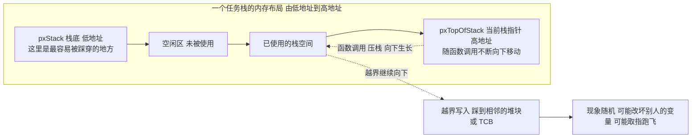
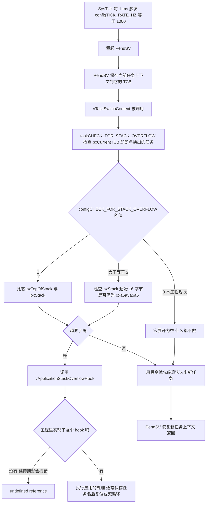
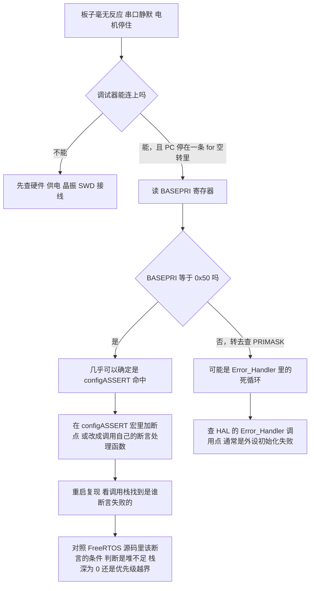
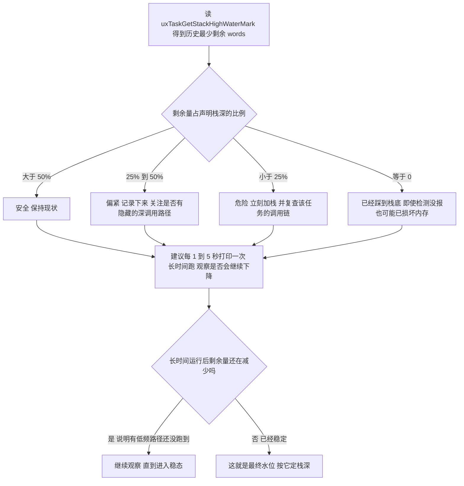

# 栈溢出检测与断言

> 一个贯穿全文的事实：
> 本工程的 `configCHECK_FOR_STACK_OVERFLOW` 根本没有被定义。
> FreeRTOS 把它默认成 0，栈溢出检测处于关闭状态。
> 下文先把两种检测模式的内核实现讲清楚，再讲怎么在本工程里把它打开并正确使用。

## 1. 一个被忽略的开关

在 `Core/Inc/FreeRTOSConfig.h` 里搜 `STACK_OVERFLOW`：

```bash
$ grep -n "STACK_OVERFLOW" Core/Inc/FreeRTOSConfig.h
(无输出)
```

没有定义，于是走内核默认值：

```c
/* include/FreeRTOS.h:397-399 */
#ifndef configCHECK_FOR_STACK_OVERFLOW
	#define configCHECK_FOR_STACK_OVERFLOW 0
#endif
```

再确认一下配套的钩子函数有没有人实现：

```bash
$ grep -rn "vApplicationStackOverflowHook" --include=*.c --include=*.h --include=*.cpp . \
    | grep -v "Middlewares/Third_Party/FreeRTOS/Source/include" | grep -v Drivers
./Middlewares/Third_Party/FreeRTOS/Source/tasks.c:407:	extern void vApplicationStackOverflowHook( TaskHandle_t xTask, char *pcTaskName );
(仅内核内部的 extern 声明，应用层没有实现)
```

同理，这几个钩子在本工程里一个都没有实现：

| 钩子 | 由哪个开关触发 | 本工程状态 |
| --- | --- | --- |
| `vApplicationStackOverflowHook` | `configCHECK_FOR_STACK_OVERFLOW > 0` | 未定义开关，未实现 |
| `vApplicationMallocFailedHook` | `configUSE_MALLOC_FAILED_HOOK = 1` | 未定义开关（默认 0），未实现 |
| `vApplicationIdleHook` | `configUSE_IDLE_HOOK = 1` | 显式设成 0 |
| `vApplicationTickHook` | `configUSE_TICK_HOOK = 1` | 显式设成 0 |

所以现状是：6 个任务、6912 words 的栈全部"声明式"地跑着，没有任何机制在验证"声明得够不够"。这是本工程最大的监控盲区，也是下面要解决的问题。

## 2. 栈往哪边长

Cortex-M 的栈向下生长（从高地址往低地址）。ARM_CM4F 的 port 明确声明了这一点：

```c
/* portable/GCC/ARM_CM4F/portmacro.h:73 */
#define portSTACK_GROWTH			( -1 )
```

这个 `-1` 会决定后面所有代码走哪个分支，非常关键。任务栈的内存布局因此是：



`pxStack` 是栈的最低地址（malloc 返回的基址），`pxTopOfStack` 是当前保存的栈指针。溢出 = `pxTopOfStack` 掉到 `pxStack` 以下。

这就是栈溢出在本工程里后果严重的原因：栈是从 `ucHeap` 里切的，紧挨着栈的很可能是另一个任务的 TCB 或另一个任务的栈。越界写入不会立刻报错，而是把别人的数据改坏，现象是某个完全无关的功能偶尔抽风。

## 3. 两种内核检测模式

FreeRTOS 的检测逻辑全部集中在 `include/StackMacros.h` 的 `taskCHECK_FOR_STACK_OVERFLOW()` 宏里，它由 `configCHECK_FOR_STACK_OVERFLOW` 的值选择不同实现。

### 3.1 模式 1：只检查当时的栈指针

```c
/* include/StackMacros.h:52-62（portSTACK_GROWTH < 0 分支） */
#if( ( configCHECK_FOR_STACK_OVERFLOW == 1 ) && ( portSTACK_GROWTH < 0 ) )

	#define taskCHECK_FOR_STACK_OVERFLOW()																\
	{																									\
		/* Is the currently saved stack pointer within the stack limit? */								\
		if( pxCurrentTCB->pxTopOfStack <= pxCurrentTCB->pxStack )										\
		{																								\
			vApplicationStackOverflowHook( ( TaskHandle_t ) pxCurrentTCB, pxCurrentTCB->pcTaskName );	\
		}																								\
	}

#endif
```

只做一次比较：`pxTopOfStack <= pxStack`。

优点：零成本，不需要填充栈，不需要 `memset`，每次检查就一条比较。
缺点：只在任务切换的那一刻看得见。如果某个任务深调用了一次之后正常返回了，栈指针又回到安全区，那么这次越界不会被发现，尽管它可能已经踩坏了别人的内存。

### 3.2 模式 2：填充魔数 + 检查栈底的 4 个字

模式 2 不看寄存器，而是回看栈的起点有没有被动过：

```c
/* include/StackMacros.h:82-99（portSTACK_GROWTH < 0 分支） */
#if( ( configCHECK_FOR_STACK_OVERFLOW > 1 ) && ( portSTACK_GROWTH < 0 ) )

	#define taskCHECK_FOR_STACK_OVERFLOW()																\
	{																									\
		const uint32_t * const pulStack = ( uint32_t * ) pxCurrentTCB->pxStack;							\
		const uint32_t ulCheckValue = ( uint32_t ) 0xa5a5a5a5;											\
																										\
		if( ( pulStack[ 0 ] != ulCheckValue ) ||														\
			( pulStack[ 1 ] != ulCheckValue ) ||														\
			( pulStack[ 2 ] != ulCheckValue ) ||														\
			( pulStack[ 3 ] != ulCheckValue ) )															\
		{																								\
			vApplicationStackOverflowHook( ( TaskHandle_t ) pxCurrentTCB, pxCurrentTCB->pcTaskName );	\
		}																								\
	}

#endif
```

检查的是 `pxStack[0]` 到 `pxStack[3]`，也就是栈最低地址处的 16 个字节是否还保持创建时填的 `0xa5a5a5a5`。

只要这个任务曾经把栈用到穿底，这 16 个字节一定被改写，而且不会自己恢复（因为已经写在那儿的字节是真实数据）。所以模式 2 能抓住"曾经发生过"的溢出，即使当时已经返回。

代价是创建任务时要多一次 `memset`（下面 3.4 节会看到这个 memset 的条件很微妙）。

### 3.3 对比表

| | 模式 1（`= 1`） | 模式 2（`>= 2`） |
| --- | --- | --- |
| 判据 | 切换瞬间 `pxTopOfStack <= pxStack` | 栈底 16 字节是否还是 `0xa5a5a5a5` |
| 抓到"当时越界" | 能 | 能（只要越界深度 ≥ 16 字节） |
| 抓到"曾经越界但已返回" | 不能 | 能 |
| 额外内存开销 | 无 | 无（只是填充既有栈） |
| 额外启动开销 | 无 | 每个任务一次 `memset`，共 27648 字节 |
| 检查时机 | 每次任务切换 | 每次任务切换 |
| 误报/漏报 | 漏报较多 | 漏报少，但越界深度 < 16 字节时仍可能漏 |
| 官方推荐 | 调试期可用 | 调试期首选 |

严格来说两种都可能漏报：模式 2 只检查 16 字节，如果溢出只是一瞬间踩了 4 字节就回来，也抓不到。所以在 `StackMacros.h` 的注释里，内核作者自己写明了：

> `Note this second test does not guarantee that an overflowed stack will always be recognised.`

### 3.4 模式 2 的三重连锁条件

模式 2 依赖"栈被填充成 `0xa5`"。但这个填充并不只取决于 `configCHECK_FOR_STACK_OVERFLOW`：

```c
/* tasks.c:83-90 */
/* If any of the following are set then task stacks are filled with a known
value so the high water mark can be determined.  If none of the following are
set then don't fill the stack so there is no unnecessary dependency on memset. */
#if( ( configCHECK_FOR_STACK_OVERFLOW > 1 ) || ( configUSE_TRACE_FACILITY == 1 ) || ( INCLUDE_uxTaskGetStackHighWaterMark == 1 ) || ( INCLUDE_uxTaskGetStackHighWaterMark2 == 1 ) )
	#define tskSET_NEW_STACKS_TO_KNOWN_VALUE	1
#else
	#define tskSET_NEW_STACKS_TO_KNOWN_VALUE	0
#endif
```

填充发生在任务创建时：

```c
/* tasks.c:850-856（节选） */
	/* Avoid dependency on memset() if it is not required. */
	#if( tskSET_NEW_STACKS_TO_KNOWN_VALUE == 1 )
	{
		/* Fill the stack with a known value to assist debugging. */
		( void ) memset( pxNewTCB->pxStack, ( int ) tskSTACK_FILL_BYTE,
		                 ( size_t ) ulStackDepth * sizeof( StackType_t ) );
	}
	#endif
```

而 `tskSTACK_FILL_BYTE` 就是 `0xa5`：

```c
/* tasks.c:76 */
#define tskSTACK_FILL_BYTE	( 0xa5U )
```

本工程的情况是四个条件全部不满足。

| 条件 | 本工程 |
| --- | --- |
| `configCHECK_FOR_STACK_OVERFLOW > 1` | 未定义 → 0 |
| `configUSE_TRACE_FACILITY == 1` | 未定义 → 0 |
| `INCLUDE_uxTaskGetStackHighWaterMark == 1` | 未定义 → 0 |
| `INCLUDE_uxTaskGetStackHighWaterMark2 == 1` | 未定义 → 0 |

所以 `tskSET_NEW_STACKS_TO_KNOWN_VALUE = 0`，本工程的栈一个字节都没有被填充。这直接导致两个后果：

1. 模式 2 的检测即使打开了开关也不立即生效，必须重新烧录、任务重新创建后栈才有 `0xa5` 哨兵；
2. `uxTaskGetStackHighWaterMark()` 即使打开了开关，也要等重启后才开始有意义（见第 6 节）。

> 一个容易误判的细节："打开了 `configCHECK_FOR_STACK_OVERFLOW = 2` 但没抓到"，
> 最可能的原因是栈根本没被填充，或者填充与检测不是同一次上电。改配置必须整机重启，不支持热改。

## 4. 检查在什么时候发生

两种模式的 `taskCHECK_FOR_STACK_OVERFLOW()` 都只有一个调用点：

```c
/* tasks.c:3026-3032（节选，位于 vTaskSwitchContext 内部） */
		#endif /* configGENERATE_RUN_TIME_STATS */

		/* Check for stack overflow, if configured. */
		taskCHECK_FOR_STACK_OVERFLOW();
```

调用点在 `vTaskSwitchContext()` 里，此时 `pxCurrentTCB` 还指向即将被换出的那个任务。也就是说，检查发生在任务被切走的那一刻。



有一个有利条件：检查频率很高。因为本工程 `configTICK_RATE_HZ = 1000`（1 tick = 1 ms），而且 `configUSE_TIME_SLICING` 默认是 1（`FreeRTOS.h:793-794`），6 个同优先级任务每毫秒都会轮转一次。也就是说模式 1 的检查最快每毫秒就会对每个任务做一次，捕捉概率并不低。

## 5. vApplicationStackOverflowHook 怎么写

### 5.1 函数签名

从内核的 extern 声明就能看到签名：

```c
/* tasks.c:407 */
extern void vApplicationStackOverflowHook( TaskHandle_t xTask, char *pcTaskName );
```

第一个参数是溢出任务的 TCB 句柄，第二个是任务名字符串。`configMAX_TASK_NAME_LEN = 16`，而本工程有任务名超过了这个长度（见第 8 节易错点 2），会被截断。

### 5.2 它运行在什么上下文

它运行在中断上下文。因为调用链是 `SysTick → PendSV → xPortPendSVHandler → vTaskSwitchContext`。所以 hook 里：

- 不能调用 `osDelay()`、`vTaskDelay()` 等阻塞 API；
- 不能调用 `printf`（newlib 堆不可重入，且可能长时间占用）；
- 可以操作寄存器、写一个全局变量、点亮 LED、直接复位。

### 5.3 一个能用的实现

在 `Core/Src/freertos.c` 里加上（记得打开 `configCHECK_FOR_STACK_OVERFLOW`）：

```c
#include "stm32f4xx_hal.h"

/* 溢出现场，供调试器查看 */
volatile char     g_overflowTaskName[ configMAX_TASK_NAME_LEN ];
volatile uint32_t g_overflowCount = 0;

void vApplicationStackOverflowHook( TaskHandle_t xTask, char *pcTaskName )
{
    ( void ) xTask;

    /* 保存任务名：只做内存拷贝，不依赖任何外设或堆 */
    for( uint32_t i = 0; i < ( uint32_t )( configMAX_TASK_NAME_LEN - 1 ); i++ )
    {
        g_overflowTaskName[ i ] = pcTaskName[ i ];
        if( pcTaskName[ i ] == '\0' ) { break; }
    }
    g_overflowTaskName[ configMAX_TASK_NAME_LEN - 1 ] = '\0';

    g_overflowCount++;

    /* 断点打在这一行：调试器里可以直接看 g_overflowTaskName */
    __asm volatile ( "nop" );

    /* 现场固化后复位，避免带着损坏的内存继续跑 */
    HAL_NVIC_SystemReset();
}
```

这个 hook 是必需的。只要 `configCHECK_FOR_STACK_OVERFLOW > 0`，内核就会引用它；不实现就是链接错误：

```text
undefined reference to vApplicationStackOverflowHook
```

### 5.4 任务名被截断


`configMAX_TASK_NAME_LEN = 16`，而本工程有任务名超过了这个长度：

| 任务名 | 字符数 | 会怎样 |
| --- | --- | --- |
| `"StartControlCenterTask"` | 21 | 被截断成 15 字符加结束符 |
| `"StartUsbConnectTask"` | 19 | 被截断 |
| `"StartFireTask"` | 13 | 完整 |
| `"imuTask"` / `"gimbalTask"` | 8 / 10 | 完整 |

所以在 `vApplicationStackOverflowHook` 里看到 `pcTaskName` 是 `"StartControlCent"` 这种半截名字时，不要以为是内存被改坏了，那只是名字长度限制。想看到完整名字就把 `configMAX_TASK_NAME_LEN` 调大（每个任务多占几个字节的 TCB 空间）。

## 6. configASSERT：命中即死循环

### 6.1 本工程的真实定义

```c
/* Core/Inc/FreeRTOSConfig.h:119-123 */
/* Normal assert() semantics without relying on the provision of an assert.h
header file. */
/* USER CODE BEGIN 1 */
#define configASSERT( x ) if ((x) == 0) {taskDISABLE_INTERRUPTS(); for( ;; );}
/* USER CODE END 1 */
```

这是 CubeMX 模板给的默认写法，本工程一字未改。它的行为是：

1. `x` 为 0（断言失败）→ 抬 BASEPRI；
2. 然后 `for( ;; );` 永久空转。

没有日志、没有闪烁、没有复位，整块板子安静地停住。

### 6.2 它没有关中断，只是抬高了 BASEPRI

`taskDISABLE_INTERRUPTS()` 展开成 `portDISABLE_INTERRUPTS()`，在这个 port 上就是 `vPortRaiseBASEPRI()`，只是抬高 BASEPRI，不涉及 `__disable_irq()`（详见 `03-临界区与中断安全` 第 3 节）。

所以断言挂死时：

| 中断的 NVIC 数值 | 断点挂住后还会进来吗 |
| --- | --- |
| 0 ~ 4 | 会（BASEPRI = 0x50 挡不住它们） |
| 5 ~ 15 | 不会 |

本工程所有外设中断都是 5，所以现象就是完全安静。但若照着 `03` 的建议加了一个"紧急制动"高优先级中断（数值 ≤ 4），就会看到"主逻辑死了但那个中断还在跑"的反常现象，这时候不能以为板子还能继续运行。

对照 `Core/Src/main.c` 里另一条挂死路径，两者现象几乎一样：

```c
/* Core/Src/main.c:226-232 */
void Error_Handler(void)
{
  __disable_irq();       /* 这个是真关中断 PRIMASK */
  while (1) { }
}
```

| | `configASSERT` 命中 | `Error_Handler()` |
| --- | --- | --- |
| 屏蔽机制 | BASEPRI = 0x50 | PRIMASK（`__disable_irq`） |
| 数值 0~4 的中断 | 仍会进来 | 进不来 |
| 数值 5~15 的中断 | 进不来 | 进不来 |
| NMI / HardFault | 能进 | 能进 |

调试器里读一下 `BASEPRI` 和 `PRIMASK` 就能快速区分。

### 6.3 命中断言时怎么定位



实操上，最省事的做法是把 `configASSERT` 改成带上下文的版本，这样断言一命中就能立刻知道原因：

```c
/* 把 FreeRTOSConfig.h 里的 configASSERT 换成这个版本 */
void vAssertFailed( const char *pcFile, uint32_t ulLine );

#define configASSERT( x )                                       \
    if( ( x ) == 0 )                                            \
    {                                                           \
        vAssertFailed( __FILE__, __LINE__ );                    \
    }
```

```c
/* 实现：保存文件与行号，然后死循环等着被调试器看到 */
volatile const char *g_assertFile = 0;
volatile uint32_t    g_assertLine = 0;

void vAssertFailed( const char *pcFile, uint32_t ulLine )
{
    g_assertFile = pcFile;
    g_assertLine = ulLine;
    taskDISABLE_INTERRUPTS();
    for( ;; ) { }
}
```

代价是 `__FILE__` 是字符串常量，每个断言点都会往 Flash 里加一个文件名字符串。本工程 Flash 只用 92 KB（共 1 MB），完全放得下，可以采用这个方案。

### 6.4 断言处理函数里别再触发断言


如果把 `configASSERT` 改成调用 `vAssertFailed()`，而这个函数内部又用了 `printf` 或任何带临界区的 API，就可能递归触发断言。`vPortEnterCritical()` 里的注释专门提到了这一点：

```c
/* port.c:408-412 */
	/* This is not the interrupt safe version of the enter critical function so
	assert() if it is being called from an interrupt context.  Only API
	functions that end in "FromISR" can be used in an interrupt.  Only assert if
	the critical nesting count is 1 to protect against recursive calls if the
	assert function also uses a critical section. */
```

内核已经用 `if( uxCriticalNesting == 1 )` 保护了自己，但 `vAssertFailed()` 也得同样克制：只做寄存器级操作和内存写，别调外设。

## 7. uxTaskGetStackHighWaterMark 实战

### 7.1 本工程默认用不了

```bash
$ grep -n "INCLUDE_uxTaskGetStackHighWaterMark" Core/Inc/FreeRTOSConfig.h
(无输出)
```

于是走默认值 0，函数根本不存在：

```c
/* include/FreeRTOS.h:155-157 */
#ifndef INCLUDE_uxTaskGetStackHighWaterMark
	#define INCLUDE_uxTaskGetStackHighWaterMark 0
#endif
```

要用，必须在 `FreeRTOSConfig.h` 里加一行：

```c
/* 加在 FreeRTOSConfig.h 的 INCLUDE 段里 */
#define INCLUDE_uxTaskGetStackHighWaterMark   1
```

> 注意：这一行加完，第 3.4 节的 `tskSET_NEW_STACKS_TO_KNOWN_VALUE` 会自动变成 1，
> 于是栈会被 `memset` 填充，水位才有意义。
> 也就是说"打开水位统计"和"打开模式 2 检测"共享同一套填充机制，
> 两个开关开哪一个都能让另一个具备工作前提。

### 7.2 它的实现与单位

实现就是把栈底残留的填充字节数出来：

```c
/* tasks.c:3799-3814 */
static configSTACK_DEPTH_TYPE prvTaskCheckFreeStackSpace( const uint8_t * pucStackByte )
{
uint32_t ulCount = 0U;

	while( *pucStackByte == ( uint8_t ) tskSTACK_FILL_BYTE )
	{
		pucStackByte -= portSTACK_GROWTH;    /* 向下生长 所以是自减 */
		ulCount++;
	}

	ulCount /= ( uint32_t ) sizeof( StackType_t );

	return ( configSTACK_DEPTH_TYPE ) ulCount;
}
```

原理很直白：从栈底开始数，数还有多少字节仍然是 `0xa5`，除以 4（`sizeof(StackType_t)`）就是剩余字数。

所以：

- 单位是 words，不是字节。返回值 64 意味着还剩 64 words = 256 字节；
- 返回的是历史最小值（自任务创建以来剩余最少时的值），这正是它的价值所在；
- 返回类型 `configSTACK_DEPTH_TYPE` 默认是 `uint16_t`（`FreeRTOS.h:855-858`），最大 65535 words，对本工程绰绰有余。

返回值容易被误读：它给的是历史最少剩余量，不是当前值。所以：

- `used = declared - free` 算出来的是历史峰值用量；
- 当前用量可能远小于峰值；
- 这个特性正是它的价值：需要的就是"最坏那一刻"。

单位也要分清。

| API 或配置 | 单位 | 本工程 512 对应 |
| --- | --- | --- |
| `uxTaskGetStackHighWaterMark()` | words | 512 words |
| `xPortGetFreeHeapSize()` | bytes | 2048 字节 |
| `configMINIMAL_STACK_SIZE` | words | — |
| `xTaskCreate` 的 `usStackDepth` | words | — |

把 words 当 bytes 会低估 4 倍风险，把 bytes 当 words 会虚报 4 倍余量。这类错误最容易犯，也最难发现。

### 7.3 方案 A：任务自己查自己

改动最小，不需要任何句柄管理。`uxTaskGetStackHighWaterMark(NULL)` 里的 `NULL` 表示"当前任务"：

```cpp
/* Task/Src/TestTask.cpp —— 把空闲的 TestTask 改造成排查任务 */
#include "TestTask.h"
#include "cmsis_os.h"
#include <cstdio>

void StartTestTask::run()
{
    for (;;)
    {
        /* NULL = 当前任务；返回值单位是 words */
        UBaseType_t hw = uxTaskGetStackHighWaterMark( NULL );

        std::printf( "[stack] TestTask declared=256 free=%u words (%u bytes)\r\n",
                     (unsigned)hw, (unsigned)( hw * 4 ) );

        osDelay( 5000 );
    }
}
```

记得在 `freertos.c` 里把 `//StartTestTask_Init();` 的注释取消，否则这个任务根本不会被创建。方案 A 有个明显缺陷：它要求每个任务都改代码，而且启用 `TestTask` 意味着多一个 256 words 的栈开销（1124 字节，见 `02` 第 5 节）。

### 7.4 方案 B：集中统计（推荐）

给 `Task/TaskBase.h` 加一个只读访问器，就可以在任何地方遍历所有任务：

```cpp
/* Task/TaskBase.h —— 加一个句柄访问器 */
class TaskBase {
public:
    virtual ~TaskBase() = default;
    virtual void run() = 0;

    /* 新增：让外部能拿到 FreeRTOS 任务句柄 */
    osThreadId handle() const { return handle_; }

    void start(char* name, uint32_t stackSize, osPriority priority);  /* 原样不动 */

protected:
    osThreadId handle_ = nullptr;
private:
    static void taskEntry(void const* argument);
};
```

再在 `TaskBase::start()` 里顺手把自己登记到一张全局表，这样连"任务是否创建成功"都能一起看到：

```cpp
/* Task/TaskBase.h —— 自动登记，改动最小 */
struct TaskRegistry {
    static constexpr uint32_t kMaxTasks = 10;
    static const char*   names[kMaxTasks];
    static osThreadId    handles[kMaxTasks];
    static uint32_t      count;

    static void add( const char* n, osThreadId h ) {
        if( count < kMaxTasks ) { names[count] = n; handles[count] = h; count++; }
    }
};

/* start() 末尾加一行 */
handle_ = osThreadCreate(&taskDef, this);
TaskRegistry::add( name, handle_ );
```

之后统计就是一个循环：

```cpp
#include "task.h"
#include <cstdio>

extern "C" void StackProbe_Report()
{
    static const uint32_t declaredWords[TaskRegistry::kMaxTasks] = {
        /* 与创建顺序一致：见 Core/Src/freertos.c:114-133 */
        256,   /* defaultTask            */
        512,   /* StartFireTask          */
        1024,  /* imuTask                */
        2048,  /* gimbalTask             */
        1024,  /* StartControlCenterTask */
        2048,  /* StartUsbConnectTask    */
    };

    for( uint32_t i = 0; i < TaskRegistry::count; i++ )
    {
        osThreadId h = TaskRegistry::handles[i];
        if( h == nullptr )
        {
            std::printf( "[stack] %s  CREATE FAILED\r\n", TaskRegistry::names[i] );
            continue;
        }

        UBaseType_t freeWords = uxTaskGetStackHighWaterMark( h );
        uint32_t    declared  = ( i < TaskRegistry::kMaxTasks ) ? declaredWords[i] : 0;
        uint32_t    used      = ( declared > freeWords ) ? ( declared - freeWords ) : 0;

        /* 用量超过声明值的 75% 就算危险 */
        bool risky = ( declared != 0 ) && ( used * 4 > declared * 3 );

        std::printf( "[stack] %-24s declared=%4u used=%4u free=%4u %s\r\n",
                     TaskRegistry::names[i], (unsigned)declared,
                     (unsigned)used, (unsigned)freeWords,
                     risky ? "RISKY" : "" );
    }
}
```

这个方案顺带解决了 `01-内存方案对比` 里提到的"`TaskBase::start()` 不检查返回值"的问题，运行期就能知道哪个任务没被创建出来（`handle` 为 `NULL`）。

### 7.5 判据：余量多少才算安全



用本工程的声明值给出各项任务的观察重点：

| 任务 | 声明 words | 最占栈的原因 | 观察重点 |
| --- | --- | --- | --- |
| `defaultTask` | 256 | 只有 `MX_USB_DEVICE_Init()` + `osDelay` | 启动后水位应该很高 |
| `StartFireTask` | 512 | PID + `HAL_GetTick`，全工程最小栈 | 余量最容易不足，第一个怀疑对象 |
| `imuTask` | 1024 | `FusionAHRS` 更新 + 三角函数 + 浮点 | 融合算法的局部变量是主要消耗 |
| `StartGimbalTask` | 2048 | 角度环 + 速度环 PID + 浮点 | 声明最宽裕的两个之一 |
| `StartControlCenterTask` | 1024 | 遥控器映射 + 视觉数据处理 | 中等 |
| `StartUsbConnectTask` | 2048 | `CDC_Transmit_FS` 调用栈较深 | 声明最宽裕的两个之一 |

`StartFireTask` 是 512 words（2 KB），全工程最小，而它的 `run()` 里有多个 `SpeedPID` / `AnglePID` 对象和浮点运算。统计水位时它应当是第一个被怀疑的对象。本文的实战价值主要在于给出判断"512 到底够不够"的依据。

### 7.6 没报错不等于没问题


本工程 `configCHECK_FOR_STACK_OVERFLOW = 0`，所以栈溢出既不会报错也不会复位，它只会静默地改坏别人的内存。这是本文开头强调那个事实的原因。

## 8. 小结

### 核心概念总结

| 概念 | 要点 |
| --- | --- |
| `configCHECK_FOR_STACK_OVERFLOW` | 本工程未定义 → 默认 0 → 检测完全关闭 |
| 模式 1 | 比较 `pxTopOfStack <= pxStack`；零开销，但只能抓"切换瞬间已越界" |
| 模式 2 | 检查 `pxStack` 起始 16 字节是否仍是 `0xa5a5a5a5`；能抓"曾经越界" |
| `tskSET_NEW_STACKS_TO_KNOWN_VALUE` | 填充 `0xa5` 的连锁条件；本工程四个条件全关 → 栈根本没被填充 |
| 检查时机 | `vTaskSwitchContext()` 里，针对即将被换出的任务；本工程最快每 1 ms 一次 |
| `vApplicationStackOverflowHook` | 运行在 PendSV 中断上下文，不能阻塞、不能 `printf` |
| `configASSERT` | 本工程是"抬 BASEPRI 加死循环"；抬 BASEPRI 不等于关中断 |
| 区分两条挂死路径 | 读 `BASEPRI`（0x50 → 断言）还是 `PRIMASK`（→ `Error_Handler`） |
| `uxTaskGetStackHighWaterMark` | 默认不可用；单位是 words；返回历史最少剩余量 |
| 本工程监视空白 | `StartFireTask` 只有 512 words，是全工程最需要统计水位的任务 |

### 设计权衡

| 决策 | 好处 | 代价 |
| --- | --- | --- |
| 不开 `configCHECK_FOR_STACK_OVERFLOW` | 省 27648 字节的 `memset`，启动更快 | 栈溢出完全无保护，故障现象随机且难复现 |
| `configASSERT` 用死循环而非复位 | 停在现场，调试器能看到调用栈 | 无日志、无现场保存；只屏蔽 BASEPRI，现象可能误导 |
| 不在启动期打印堆栈水位 | 启动流程干净，不被调试代码污染 | 交付前无法证明栈深够用 |
| `configMAX_TASK_NAME_LEN = 16` | 每个 TCB 省几个字节 | 长任务名被截断，调试时容易误判 |

### 结论

本工程当前对栈没有保护：`configCHECK_FOR_STACK_OVERFLOW` 没定义、`INCLUDE_uxTaskGetStackHighWaterMark` 没开、栈连 `0xa5` 填充都没有。要让 `StartFireTask` 那 512 words 的栈有依据，只需要三步：打开 `configCHECK_FOR_STACK_OVERFLOW = 2`、实现 `vApplicationStackOverflowHook`、打开 `INCLUDE_uxTaskGetStackHighWaterMark = 1` 并周期性打印水位，然后整机重启。

## 9. 练习

### 基础题

1. `configCHECK_FOR_STACK_OVERFLOW` 模式 1 和模式 2 分别检查什么？为什么模式 2 能抓到"已经返回的越界"，而模式 1 不能？
2. 本工程 `tskSET_NEW_STACKS_TO_KNOWN_VALUE` 的值是多少？它是怎么被决定的？请列出全部四个使它为 1 的条件。
3. `uxTaskGetStackHighWaterMark(NULL)` 返回 64，请说明这代表多少字节，以及它是历史值还是当前值。

### 挑战题

4. `taskCHECK_FOR_STACK_OVERFLOW()` 只在 `vTaskSwitchContext()` 里被调用。请构造一个场景：一个任务发生了严重的栈溢出，却从未被两种模式中的任何一种抓到。说明需要满足哪些条件。
5. 本工程的 `configASSERT` 是"抬 BASEPRI 加死循环"。请解释：如果按照 `03-临界区与中断安全` 的建议新增一个 NVIC 数值为 3 的紧急中断，断言挂死后会发生什么？这个现象为什么比"彻底安静"更难排查？
6. 假设统计发现 `StartFireTask` 的水位只剩 30 words。请写出处理方案，并说明不能简单地把它从 512 改成 1024 的原因：总堆余量是多少（见 `02-heap_4与40KB堆` 第 7.2 节）？还有哪些替代办法？
7. `prvTaskCheckFreeStackSpace()` 用 `while( *pucStackByte == tskSTACK_FILL_BYTE )` 逐字节计数。如果某个任务在栈里正好用了 `0xa5` 作为正常数据，水位统计会怎样误报？这属于高估还是低估风险？

