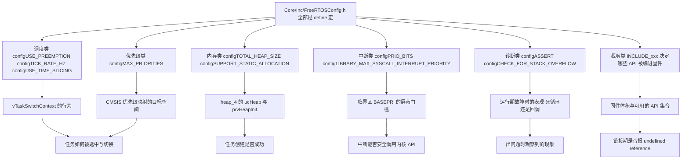
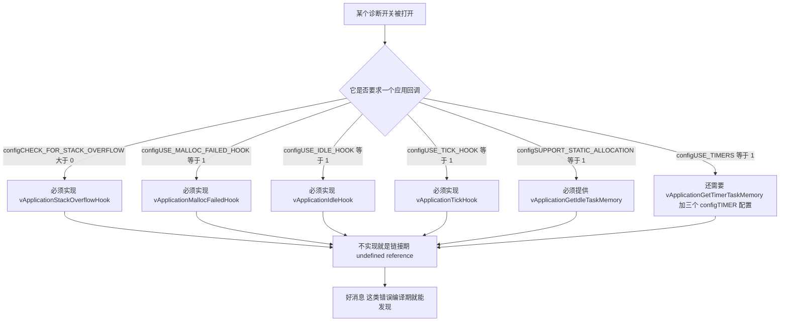
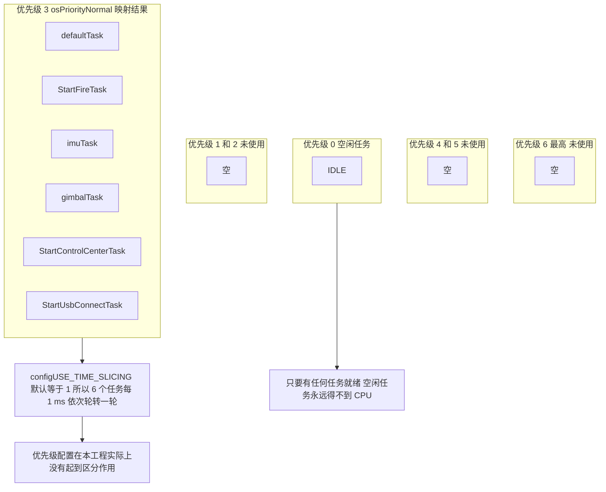

# 本项目 FreeRTOSConfig 逐项解读

> 本单元最后一篇，把 `Core/Inc/FreeRTOSConfig.h` 从头到尾读完。
> 素材是云台板 `2026OmniSentryGimbal` 的真实文件（139 行），底盘板 `2026OmniSentryChassis` 的差异会单独标出。
> 背配置没有意义，需要的是能回答"改这一行，系统会变成什么样"。

## 1. 一份编译期契约

FreeRTOS 的配置方式和大多数库都不一样：没有运行期的配置结构体，没有 `vTaskConfigure()`。所有配置都是 `#define`，在编译时就被嵌进内核代码。这带来三个后果：

1. 改配置必须重新编译、重新烧录。没有"热改配置"这回事。
2. 配置错了编译期不一定报错。很多组合会安安静静地编译通过，然后在运行期以奇怪的方式失败（比如 `01` 里 heap_1 加 `INCLUDE_vTaskDelete = 1`）。
3. 配置项之间有"连锁条件"。打开 A 就必须提供 B，否则链接失败；打开 C 会让 D 自动生效（`04` 里的 `tskSET_NEW_STACKS_TO_KNOWN_VALUE` 就是典型）。

所以需要建立的能力是：看到一个配置项，能说出它影响哪几处内核行为、牵动哪些别的配置项。



## 2. 逐项解读

按配置文件的原有顺序列出，条目名对应 `Core/Inc/FreeRTOSConfig.h`。

### 2.1 基础开关与调度

| 行 | 配置项 | 本工程值 | 含义与影响 |
| --- | --- | --- | --- |
| 55 | `configENABLE_FPU` | 0 | 装饰性配置，见 3.7 节 |
| 56 | `configENABLE_MPU` | 0 | 装饰性配置，见 3.7 节 |
| 58 | `configUSE_PREEMPTION` | 1 | 抢占式调度：高优先级就绪立刻抢占 |
| 59 | `configSUPPORT_STATIC_ALLOCATION` | 1 | 允许 `xTaskCreateStatic` 等静态创建 API |
| 60 | `configSUPPORT_DYNAMIC_ALLOCATION` | 1 | 允许 `xTaskCreate` 等从 `ucHeap` 分配 |
| 61 | `configUSE_IDLE_HOOK` | 0 | 不使用 `vApplicationIdleHook` |
| 62 | `configUSE_TICK_HOOK` | 0 | 不使用 `vApplicationTickHook` |
| 63 | `configCPU_CLOCK_HZ` | `SystemCoreClock` | 由 `SystemClock_Config()` 设置后的实际主频 |
| 64 | `configTICK_RATE_HZ` | `((TickType_t)1000)` | 1 tick = 1 ms，系统时间粒度 |
| 65 | `configMAX_PRIORITIES` | `( 7 )` | 合法任务优先级为 0~6 |
| 66 | `configMINIMAL_STACK_SIZE` | `((uint16_t)256)` | 空闲任务栈深 256 words = 1024 字节 |
| 67 | `configTOTAL_HEAP_SIZE` | `((size_t)40960)` | heap_4 的 `ucHeap` = 40 KB |
| 68 | `configMAX_TASK_NAME_LEN` | `( 16 )` | 任务名最长 15 字符 + 结束符 |
| 69 | `configUSE_16_BIT_TICKS` | 0 | `TickType_t` 是 32 位（推荐） |
| 70 | `configUSE_MUTEXES` | 1 | 启用互斥量与优先级继承 |
| 71 | `configQUEUE_REGISTRY_SIZE` | 8 | 最多 8 个队列可注册名字做调试 |
| 72 | `configUSE_PORT_OPTIMISED_TASK_SELECTION` | 1 | 用 Cortex-M 的 `CLZ` 指令选任务（更快） |
| 76 | `configMESSAGE_BUFFER_LENGTH_TYPE` | `size_t` | 消息缓冲区长度用 `size_t` |

### 2.2 协程（历史遗留）

| 行 | 配置项 | 本工程值 | 含义 |
| --- | --- | --- | --- |
| 80 | `configUSE_CO_ROUTINES` | 0 | 协程功能已废弃，保持 0 |
| 81 | `configMAX_CO_ROUTINE_PRIORITIES` | `( 2 )` | 只在协程启用时有意义，本工程无影响 |

### 2.3 API 裁剪开关（Flash 体积）

| 行 | 配置项 | 本工程值 | 作用 |
| --- | --- | --- | --- |
| 85 | `INCLUDE_vTaskPrioritySet` | 1 | 可运行期改优先级 |
| 86 | `INCLUDE_uxTaskPriorityGet` | 1 | 可读优先级，CMSIS 的 `osThreadGetPriority` 需要它 |
| 87 | `INCLUDE_vTaskDelete` | 1 | 可删除任务（`01` 里 heap_1 讨论的关键前提） |
| 88 | `INCLUDE_vTaskCleanUpResources` | 0 | 不包含已废弃的清理函数 |
| 89 | `INCLUDE_vTaskSuspend` | 1 | 可挂起/恢复任务 |
| 90 | `INCLUDE_vTaskDelayUntil` | 0 | 不包含绝对延时 API |
| 91 | `INCLUDE_vTaskDelay` | 1 | 包含相对延时（`osDelay` 的底层） |
| 92 | `INCLUDE_xTaskGetSchedulerState` | 1 | 可查询调度器状态 |

### 2.4 中断（Cortex-M 专有）

| 行 | 配置项 | 本工程值 | 含义 |
| --- | --- | --- | --- |
| 97 | `configPRIO_BITS` | `__NVIC_PRIO_BITS`（= 4） | 优先级位数，必须与 HAL 的分组一致 |
| 104 | `configLIBRARY_LOWEST_INTERRUPT_PRIORITY` | 15 | 库级最低优先级 |
| 110 | `configLIBRARY_MAX_SYSCALL_INTERRUPT_PRIORITY` | 5 | 可调用内核 API 的最低门槛 |
| 114 | `configKERNEL_INTERRUPT_PRIORITY` | $15 \ll 4 = 240$ | 内核自身（PendSV）用的优先级 |
| 117 | `configMAX_SYSCALL_INTERRUPT_PRIORITY` | $5 \ll 4 = 80$（`0x50`） | 写进 BASEPRI 的值 |

### 2.5 断言与端口映射

| 行 | 配置项 | 本工程值 | 含义 |
| --- | --- | --- | --- |
| 122 | `configASSERT( x )` | `if ((x) == 0) {taskDISABLE_INTERRUPTS(); for( ;; );}` | 断言失败 = 抬 BASEPRI 加死循环（见 `04`） |
| 127 | `vPortSVCHandler` | `SVC_Handler` | 内核启动第一个任务用 |
| 128 | `xPortPendSVHandler` | `PendSV_Handler` | 上下文切换的实现 |
| 133 | `xPortSysTickHandler` | `SysTick_Handler` | 内核滴答源 |

最后三项需要特别注意：本工程把 `SysTick_Handler` 交给了 FreeRTOS，而 HAL 的时基改用 TIM2：

```c
/* Core/Inc/FreeRTOSConfig.h */
/* IMPORTANT: This define is commented when used with STM32Cube firmware, when the timebase source is SysTick,
              to prevent overwriting SysTick_Handler defined within STM32Cube HAL */

#define xPortSysTickHandler SysTick_Handler
```

对应的是 `Core/Src/stm32f4xx_hal_timebase_tim.c`。HAL 的时基由 TIM2 提供，优先级 `TICK_INT_PRIORITY = 15`（`stm32f4xx_hal_conf.h`）。这是正确的设计：SysTick 必须给 RTOS 用，HAL 另找定时器，否则 `HAL_GetTick()` 和内核滴答会互相覆盖。

### 2.6 本工程没有定义、但很重要的项

这些项不在文件里，走内核默认值。它们对系统行为的影响不比上面小：

| 配置项 | 默认值 | 本工程实际效果 |
| --- | --- | --- |
| `configCHECK_FOR_STACK_OVERFLOW` | 0 | 栈溢出检测完全关闭（见 `04`） |
| `INCLUDE_uxTaskGetStackHighWaterMark` | 0 | 栈水位 API 不可用 |
| `configUSE_TIME_SLICING` | 1 | 同优先级任务按 tick 轮转。本工程运行期创建的 6 个任务（`defaultTask` + 5 个应用任务，不含内核 IDLE；`StartTestTask_Init()` 在 `freertos.c` 被注释掉）全是优先级 3，这条决定调度行为 |
| `configUSE_TIMERS` | 0 | 没有定时器任务，不需要 `vApplicationGetTimerTaskMemory` |
| `configUSE_MALLOC_FAILED_HOOK` | 0 | 分配失败不会回调，静默返回 `NULL` |
| `configUSE_TRACE_FACILITY` | 0 | 无 `uxTaskGetSystemState`，也没有运行时间统计 |
| `configUSE_TICKLESS_IDLE` | 0 | 不做低功耗，滴答不停 |
| `configUSE_RECURSIVE_MUTEXES` | 0 | 无递归互斥量 |
| `configUSE_COUNTING_SEMAPHORES` | 0 | 无计数信号量 |
| `configUSE_QUEUE_SETS` | 0 | 无队列集 |
| `configUSE_APPLICATION_TASK_TAG` | 0 | 任务无自定义标签 |
| `configGENERATE_RUN_TIME_STATS` | 0 | 无 CPU 占用率统计 |
| `configAPPLICATION_ALLOCATED_HEAP` | 0 | `ucHeap` 由 heap_4.c 内部定义 |
| `configIDLE_TASK_NAME` | `"IDLE"` | 空闲任务名 |

## 3. 三块最容易出事的配置

上面的表是全的，最容易出问题的是这三块。逐个说清"为什么这个值是这个值"。

### 3.1 调度与时钟：1000 Hz 意味着什么

```c
#define configTICK_RATE_HZ                       ((TickType_t)1000)
#define configUSE_PREEMPTION                     1
#define configUSE_PORT_OPTIMISED_TASK_SELECTION  1
```

`configTICK_RATE_HZ = 1000` 的直接含义：`SysTick` 每 1 ms 中断一次，`osDelay(1)` 就是 1 ms，`portTICK_PERIOD_MS` 恰好等于 1。

这个值在整个工程里留下的指纹：

| 现象 | 来自哪一行代码 |
| --- | --- |
| `osDelay(1)` 就是 1 ms | `FireTask.cpp`、`ControlCenterTask.cpp` 的控制周期；`gimbalTask` 用的是 `osDelay(2)`（`GimbalTask.cpp`） |
| `osDelay(5)` = 5 ms | `UsbConnectTask.cpp` 轮询 `USBD_BUSY` 的间隔 |
| `osDelay(10)` = 10 ms | `UsbConnectTask.cpp` USB 任务主循环周期 |
| `1.0f / 1000.0f` 当 dt | `ImuTask.cpp` 里 `1kHz` 的融合频率 |
| `configTICK_RATE_HZ = 1000` 与 `HAL_Delay(1)` 数值相同 | 两个时基恰好都是 1 ms，见 `03` 易错点 3 |

最后一行只是巧合，不是设计保证。`osDelay` 的单位是 tick，`HAL_Delay` 的单位是 ms。两者数值相同仅仅因为 `configTICK_RATE_HZ = 1000`。改滴答频率时，所有 `osDelay(n)` 的语义都会跟着变，而 `HAL_Delay(n)` 不变。

`configUSE_PREEMPTION = 1` 决定"高优先级任务就绪时是否立刻抢"。本工程 6 个任务同优先级，所以抢占主要发生在"任务 vs 空闲任务"之间：只要有任务就绪，空闲任务（优先级 0）就永远不会被运行。

### 3.2 内存：两个 `1` 带来的双轨制

```c
#define configSUPPORT_STATIC_ALLOCATION          1
#define configSUPPORT_DYNAMIC_ALLOCATION         1
#define configTOTAL_HEAP_SIZE                    ((size_t)40960)
#define configMINIMAL_STACK_SIZE                 ((uint16_t)256)
```

两个 `1` 意味着内核里 `tskSTATIC_AND_DYNAMIC_ALLOCATION_POSSIBLE` 为真（`FreeRTOS.h`），于是 CMSIS 的 `osThreadCreate` 会走双分支：

```c
/* CMSIS_RTOS/cmsis_os.c（节选） */
#if( configSUPPORT_STATIC_ALLOCATION == 1 ) &&  ( configSUPPORT_DYNAMIC_ALLOCATION == 1 )
  if((thread_def->buffer != NULL) && (thread_def->controlblock != NULL)) {
    handle = xTaskCreateStatic( ... );
  }
  else {
    if (xTaskCreate( ... ) != pdPASS)  {
      return NULL;
    }
  }
```

而本工程的 `TaskBase::start()` 用的是这行：

```cpp
osThreadDef_t taskDef = {};        /* 全零初始化 */
```

`{}` 让 `buffer` 和 `controlblock` 都是 `NULL`，所以永远走 `xTaskCreate` 那条动态分支。这就是"配置说支持静态，实际却全动态"的机制所在：唯一的静态对象是空闲任务，它是内核自己调 `vApplicationGetIdleTaskMemory()` 拿内存的，跟 `osThreadCreate` 这条路径无关。

`configMINIMAL_STACK_SIZE = 256` 在本工程只影响空闲任务（因为所有任务都显式传了栈深）。底盘板是 `512`，比云台板大一倍。这个改动不消耗 `ucHeap`（空闲任务是静态的），只让 `.bss` 多 1 KB。

### 3.3 优先级：7 这个数字刚好卡在边界

```c
#define configMAX_PRIORITIES                     ( 7 )
```

"刚刚好"的含义要结合第 4 节的 CMSIS 映射才能看出来，结论是：CMSIS-RTOS v1 的 7 个有效优先级恰好需要 `configMAX_PRIORITIES >= 7`，本工程正好取到边界值。少一个，最高优先级就会被截断。

### 3.4 中断：5 和 15 是一对

```c
#define configLIBRARY_LOWEST_INTERRUPT_PRIORITY       15
#define configLIBRARY_MAX_SYSCALL_INTERRUPT_PRIORITY  5
```

这对数字的完整含义已经在 `03-临界区与中断安全` 里展开。这里只补一个配置一致性检查清单，改中断相关的任何一行时都应该过一遍：

| 检查项 | 本工程 | 不一致会怎样 |
| --- | --- | --- |
| `configPRIO_BITS` 是否等于 HAL 的抢占位数 | 4 = `NVIC_PRIORITYGROUP_4` 的 4 | BASEPRI 值错位，屏蔽关系全错 |
| `configLIBRARY_LOWEST_INTERRUPT_PRIORITY` 是否等于工程里最低的中断优先级 | 15 = `TICK_INT_PRIORITY` = PendSV | 内核最低优先级与配置不符 |
| 所有调用 `FromISR` API 的中断，其 NVIC 数值是否 `>=` 阈值 | USB = 5，阈值 = 5 | 队列可能被并发破坏（见 `03` 第 5.1 节） |
| 是否有中断的 NVIC 数值 `< 5` | 没有 | 若有，绝对禁止在其中调用内核 API |

### 3.5 断言与钩子：一开就要配

```c
#define configASSERT( x ) if ((x) == 0) {taskDISABLE_INTERRUPTS(); for( ;; );}
```

这一行是本工程的"最后防线"，细节见 `04`。配置层面要掌握的是成对关系：



本工程当前的状态：`configSUPPORT_STATIC_ALLOCATION = 1` 且已提供 `vApplicationGetIdleTaskMemory()`（`freertos.c`），其余开关都是关的，所以不需要任何别的回调。上面这张图的 6 条依赖里，本工程目前只需要满足第 5 条（静态分配的空闲任务内存）。

### 3.6 INCLUDE 裁剪：在省 Flash 和留余地之间

本工程 Flash 占用 92948 字节（`.text`，共 1 MB），没有裁剪的必要。但 CubeMX 模板保守地关掉了几个：

| 关掉的 | 影响 |
| --- | --- |
| `INCLUDE_vTaskDelayUntil = 0` | 不能用"绝对时刻延时"。对 1 ms 级的固定周期控制，`vTaskDelayUntil` 比 `osDelay` 更抗漂移。本工程三个控制任务都用 `osDelay`，周期会累积漂移 |
| `INCLUDE_vTaskCleanUpResources = 0` | 本来就已废弃，无所谓 |
| `INCLUDE_uxTaskGetStackHighWaterMark` 未定义 | 栈水位不可用（见 `04`） |

`INCLUDE_vTaskDelayUntil = 0` 需要单独说明。本工程 `GimbalTask` 在循环末尾调用 `osDelay(2)`（`GimbalTask.cpp`，源码注释写的是 1 ms 控制周期）：

```cpp
/* Task/Src/GimbalTask.cpp */
osDelay(2); // 1ms控制周期
```

`osDelay` 是相对延时：它在"本次调用时刻"基础上加 2 tick。每轮的 PID 计算、CAN 收发耗时都会叠加到周期里，于是实际周期是 $2\ \text{ms} + \epsilon$。而 `vTaskDelayUntil` 是绝对延时：它保存上次唤醒的绝对时刻，下一轮按 `上次 + 2 tick` 唤醒，误差不累积。

对云台这种角度环加 1 kHz 速度环的场合，累积漂移会直接变成相位滞后。要改成 `vTaskDelayUntil` 需要三步：把 `INCLUDE_vTaskDelayUntil` 置 1、在循环外记录 `TickType_t xLastWakeTime = xTaskGetTickCount()`、循环内换成 `vTaskDelayUntil(&xLastWakeTime, pdMS_TO_TICKS(2))`。这是本工程一个明确的可优化点。

### 3.7 两个装饰性配置：configENABLE_FPU / configENABLE_MPU

```c
#define configENABLE_FPU                         0
#define configENABLE_MPU                         0
```

这两行看起来很重要，但在本工程实际不产生任何效果。理由：它们只在 `FreeRTOS.h` 里有默认定义，而本工程用的移植层是 `portable/GCC/ARM_CM4F`，这个 port 的 `port.c` / `portmacro.h` 里没有任何代码引用它们：

```bash
$ grep -rn "configENABLE_FPU\|configENABLE_MPU" --include=*.c --include=*.h Middlewares/ Core/
Middlewares/Third_Party/FreeRTOS/Source/include/FreeRTOS.h:#ifndef configENABLE_MPU
Middlewares/Third_Party/FreeRTOS/Source/include/FreeRTOS.h:	#define configENABLE_MPU 0
Middlewares/Third_Party/FreeRTOS/Source/include/FreeRTOS.h:/* Set configENABLE_FPU to 1 to enable FPU support and 0 to disable it. ...
Middlewares/Third_Party/FreeRTOS/Source/include/FreeRTOS.h:#ifndef configENABLE_FPU
Middlewares/Third_Party/FreeRTOS/Source/include/FreeRTOS.h:	#define configENABLE_FPU 1
Core/Inc/FreeRTOSConfig.h:#define configENABLE_FPU                         0
Core/Inc/FreeRTOSConfig.h:#define configENABLE_MPU                         0
```

命中的全是"默认定义处"和本工程的定义处，没有一处使用。

而且这里有个反直觉的地方：`FreeRTOS.h` 的默认值是 1，本工程把它改成了 0。如果 `configENABLE_FPU` 真能关掉 FPU 支持，那本工程那些满屏的 `float` 运算（`FusionAHRS`、PID、三角函数）就会出问题。事实是：ARM_CM4F port 是否保存 FPU 上下文（S16~S31）由 `EXC_RETURN` 的值决定，与 `configENABLE_FPU` 无关。硬件会在使用 FPU 后自动置位 `CONTROL.FPCA`，异常返回时 LR 的 bit 4 就会指示"要恢复 FPU 上下文"，port 的汇编会照着做。

结论与操作建议：这两行在本工程里是无害的噪音，可以留着。但要知道它们是 CubeMX 模板从别的 port（如 ARMv8-M / ST 自己的定制 port）带过来的。如果换了移植层，就必须重新确认它们有没有被使用。配置项看起来生效与配置项真的生效是两件不同的事。

## 4. CMSIS-RTOS v1 的优先级映射

本工程的 `osThreadDef` / `osThreadCreate` 是 CMSIS-RTOS v1 的 API，它和 FreeRTOS 原生优先级之间存在一层整数换算。这一层经常被忽略，而它恰好解释了本工程一个很特别的现象。

### 4.1 换算公式的真实实现

```c
/* CMSIS_RTOS/cmsis_os.c */
static unsigned portBASE_TYPE makeFreeRtosPriority (osPriority priority)
{
  unsigned portBASE_TYPE fpriority = tskIDLE_PRIORITY;

  if (priority != osPriorityError) {
    fpriority += (priority - osPriorityIdle);
  }

  return fpriority;
}
```

CMSIS 的枚举从 -3 开始：

```c
/* CMSIS_RTOS/cmsis_os.h */
  osPriorityIdle          = -3,          ///< priority: idle (lowest)
  osPriorityLow           = -2,          ///< priority: low
  /* osPriorityBelowNormal = -1 */
  osPriorityNormal        =  0,          ///< priority: normal (default)
  /* osPriorityAboveNormal = +1 */
  osPriorityHigh          = +2,          ///< priority: high
  osPriorityRealtime      = +3,          ///< priority: realtime (highest)
  osPriorityError         =  0x84        ///< system cannot determine priority
```

代入 `tskIDLE_PRIORITY = 0` 和 `osPriorityIdle = -3`：

$$f_{\text{FreeRTOS}} = 0 + \left(p_{\text{CMSIS}} - (-3)\right) = p_{\text{CMSIS}} + 3$$

CMSIS 优先级等于 0 的 `osPriorityNormal`，在 FreeRTOS 里是优先级 3，不是 0。这一点如果搞错，就会得出"本工程任务都在最低优先级"的错误结论。

### 4.2 完整映射表

| CMSIS `osPriority` | 枚举值 | FreeRTOS 优先级 | `configMAX_PRIORITIES = 7` 下是否合法 | 本工程是否使用 |
| --- | --- | --- | --- | --- |
| `osPriorityIdle` | −3 | 0 | 合法（但那是空闲任务的级别） | 否 |
| `osPriorityLow` | −2 | 1 | 合法 | 否 |
| `osPriorityBelowNormal` | −1 | 2 | 合法 | 否 |
| `osPriorityNormal` | 0 | 3 | 合法 | 是，全部 6 个任务 |
| `osPriorityAboveNormal` | +1 | 4 | 合法 | 否 |
| `osPriorityHigh` | +2 | 5 | 合法 | 否 |
| `osPriorityRealtime` | +3 | 6 | 合法，恰好等于 6 = 7 − 1 | 否 |
| `osPriorityError` | 0x84 | 0（`tskIDLE_PRIORITY`） | — | 否 |

`configMAX_PRIORITIES = 7` 的边界性就体现在这里：`osPriorityRealtime` 映射到 6，需要 `configMAX_PRIORITIES >= 7`。如果这个值被改小（比如 6），`xTaskCreate` 里会执行钳位：

```c
/* tasks.c（节选） */
	if( uxPriority >= ( UBaseType_t ) configMAX_PRIORITIES )
	{
		uxPriority = ( UBaseType_t ) configMAX_PRIORITIES - ( UBaseType_t ) 1U;
	}
	pxNewTCB->uxPriority = uxPriority;
```

于是 `osPriorityRealtime` 和 `osPriorityHigh` 都会被压到 5，CMSIS 的优先级阶梯被削掉一层，而且不会有任何报错。

### 4.3 本工程的真实调度格局

所有任务创建时传的都是 `osPriorityNormal`：

| 任务 | 创建位置 | 传入优先级 | 实际 FreeRTOS 优先级 |
| --- | --- | --- | --- |
| `defaultTask` | `freertos.c` | `osPriorityNormal` | 3 |
| `StartFireTask` | `FireTask.cpp` | `osPriorityNormal` | 3 |
| `imuTask` | `ImuTask.cpp` | `osPriorityNormal` | 3 |
| `gimbalTask` | `GimbalTask.cpp` | `osPriorityNormal` | 3 |
| `StartControlCenterTask` | `ControlCenterTask.cpp` | `osPriorityNormal` | 3 |
| `StartUsbConnectTask` | `UsbConnectTask.cpp` | `osPriorityNormal` | 3 |
| 空闲任务 | 内核自动创建 | `tskIDLE_PRIORITY` | 0 |



结论有三条：

1. `osPriorityNormal` 是 7 个档位里的第 4 档（优先级 3），不是最低档。
2. 6 个任务全部同优先级，所以它们之间是时间片轮转（`configUSE_TIME_SLICING` 默认为 1，`FreeRTOS.h`），每 1 ms 轮一圈。这也是为什么 `GimbalTask` 里的 `osDelay(1)` 能让出 CPU：它主动阻塞 1 tick，正好和其他任务的轮转节奏对上。
3. 优先级配置在本工程实际上是装饰性的。唯一真实的优先级差别是"任务（3）与空闲任务（0）"。如果想让某个任务更及时（比如 `imuTask` 必须在 1 ms 内完成），必须显式把它的优先级提到 `osPriorityAboveNormal` 或 `osPriorityHigh`。当前配置下这 6 个任务的优先级改不改都一样。

> 顺带一个真实的隐患：`osPriorityNormal` 映射到 3，而 `configMAX_PRIORITIES = 7`，
> 意味着优先级 3 之上还有 3 个档位可用，但本工程一个都没用。
> 结果是：6 个 1 kHz 量级的任务共享同一个时间片，
> `StartUsbConnectTask` 的 `CDC_Transmit_FS` 轮询和 `imuTask` 的 AHRS 融合会互相打断，
> 这在调试"偶发的控制抖动"时是优先怀疑的方向。

## 5. 改哪个值会发生什么

这张表是本文的核心交付物。危险度按改错后排查难度排序。

| 配置项 | 当前值 | 改小的后果 | 改大的后果 | 危险度 |
| --- | --- | --- | --- | --- |
| `configTOTAL_HEAP_SIZE` | 40960 | 6 个任务建不完，`osThreadCreate` 返回 `NULL` 但 `TaskBase` 不检查，任务静默消失 | 挤占 `.bss`；超过 128 KB SRAM 就链接失败 | 极高 |
| `configLIBRARY_MAX_SYSCALL_INTERRUPT_PRIORITY` | 5 | 改成 4 表面仍能跑，但"允许调 API 的中断"范围缩小到数值 ≥ 4 | 改成 6 及以上，本工程数值为 5 的中断不再被 BASEPRI 屏蔽，USB 队列随时可能被破坏 | 极高 |
| `configPRIO_BITS` | `__NVIC_PRIO_BITS`（4） | 与 HAL 的 `NVIC_PRIORITYGROUP_4` 不符，BASEPRI 值错位 | 同上 | 极高 |
| `configUSE_TIME_SLICING`（未定义，默认 1） | 1 | 定义成 0，6 个同优先级任务不再轮转，一个任务可以独占 CPU 直到主动阻塞 | 已是默认行为 | 高 |
| `configUSE_PREEMPTION` | 1 | 改成 0，变协作式调度，必须显式 `taskYIELD()` | — | 高 |
| `configUSE_16_BIT_TICKS` | 0 | — | 改成 1，`TickType_t` 变 16 位，最长阻塞 65535 tick = 65.5 s，且与 32 位滴答计数不匹配 | 高 |
| `configMAX_PRIORITIES` | 7 | 改成 6，`osPriorityRealtime` 被钳位到 5 | 每档就绪链表多占 RAM（7 档已足够） | 中高 |
| `configTICK_RATE_HZ` | 1000 | 改成 500，`osDelay(1)` 变 2 ms，所有控制周期翻倍 | 改大则 `SysTick` 开销上升，CPU 有效算力下降 | 中高 |
| `configCHECK_FOR_STACK_OVERFLOW`（未定义，默认 0） | 0 | — | 改成 1 或 2，必须实现 `vApplicationStackOverflowHook`，否则链接失败；且需整机重启才生效 | 中 |
| `configASSERT` | 死循环版本 | — | 改成调用函数时，注意别在函数里用会再次断言的 API | 中 |
| `configUSE_MUTEXES` | 1 | 改成 0，不能用互斥量，也没优先级继承 | — | 中 |
| `configUSE_TIMERS`（未定义，默认 0） | 0 | — | 改成 1，必须补 `configTIMER_TASK_PRIORITY` / `configTIMER_QUEUE_LENGTH` / `configTIMER_TASK_STACK_DEPTH` 和 `vApplicationGetTimerTaskMemory` | 中 |
| `configMINIMAL_STACK_SIZE` | 256 words | 空闲任务栈不足（静态区，不占堆） | 只让 `.bss` 变大，不影响 `ucHeap` | 低 |
| `configUSE_PORT_OPTIMISED_TASK_SELECTION` | 1 | 改成 0，用通用 C 实现替代 `CLZ` 指令，稍慢但可移植 | — | 低 |
| `configMAX_TASK_NAME_LEN` | 16 | 长任务名截断更严重，调试困难 | 每个 TCB 多占几个字节 | 低 |
| `INCLUDE_vTaskDelete` | 1 | 改成 0，省一点 Flash，但 `01` 里 heap_1 讨论的前提会变 | — | 低 |
| `INCLUDE_vTaskDelayUntil` | 0 | — | 改成 1，可用绝对延时消除周期漂移（推荐改进） | 低（正向） |
| `INCLUDE_uxTaskGetStackHighWaterMark`（未定义，默认 0） | 0 | — | 改成 1，可用栈水位，同时触发 `0xa5` 栈填充（见 `04`） | 低（正向） |
| `configUSE_IDLE_HOOK` / `configUSE_TICK_HOOK` | 0 | — | 改成 1，必须实现对应 hook，否则链接失败 | 低 |
| `configENABLE_FPU` / `configENABLE_MPU` | 0 | 无效果 | 无效果（本 port 不引用，见 3.7 节） | 无（装饰） |
| `configQUEUE_REGISTRY_SIZE` | 8 | 减少可注册队列数 | 只增加少量 RAM，本工程未用 | 无 |
| `configMESSAGE_BUFFER_LENGTH_TYPE` | `size_t` | 改成 `uint16_t` 可省内存，但限制单条消息长度 | — | 无 |

## 6. 当前配置总览（速查）

| 维度 | 本工程配置 | 结论 |
| --- | --- | --- |
| 内核版本 | FreeRTOS Kernel V10.3.1 | CubeMX 生成 |
| 移植层 | `portable/GCC/ARM_CM4F` | 硬浮点，`portSTACK_GROWTH = -1` |
| 堆方案 | `heap_4.c`（目录里仅此一个） | 首次适配 + 相邻合并 |
| 堆大小 | 40960 声明 / 40944 可用 | 6 任务 + 1 队列用掉 28456，余 12488 |
| 静态分配 | 开启，仅空闲任务使用 | 空闲任务栈 1024 B + TCB 84 B 都在 `.bss` |
| 滴答 | 1000 Hz | 1 tick = 1 ms |
| 优先级 | `configMAX_PRIORITIES = 7` | 6 个任务全在 `osPriorityNormal` → 优先级 3 → 时间片轮转 |
| 中断门槛 | `configLIBRARY_MAX_SYSCALL_INTERRUPT_PRIORITY = 5` | 所有外设中断都是 5，零裕量 |
| 内核最低优先级 | 15 | PendSV 与 HAL 时基 TIM2 都在 15 |
| 断言 | 抬 BASEPRI + 死循环 | 出问题就安静地停住 |
| 栈溢出检测 | 关闭（未定义，默认 0） | 最大监控盲区 |
| 栈水位 | 不可用（未定义，默认 0） | 无法证明栈深够用 |
| 互斥量 | 开启但未使用 | 能力已备，`MX_FREERTOS_Init()` 里没有互斥量 |
| 定时器任务 | 不存在 | `configUSE_TIMERS` 默认 0 |
| 协程 | 关闭 | 历史遗留配置 |
| 装饰性配置 | `configENABLE_FPU / MPU` | 本 port 不引用，无效果 |

## 7. 小结

### 核心概念总结

| 概念 | 要点 |
| --- | --- |
| 配置即契约 | 所有配置都是编译期 `#define`，改配置必须重编译重烧录 |
| 连锁条件 | 打开诊断开关就必须实现对应 hook，否则链接失败（编译期可发现） |
| 静默失败 | `configMAX_PRIORITIES` 过小会钳位优先级、`configTOTAL_HEAP_SIZE` 过小会让任务静默消失，两者都不报错 |
| `configMAX_PRIORITIES = 7` | 恰好容纳 CMSIS 的 7 档（`osPriorityIdle` ~ `osPriorityRealtime`） |
| CMSIS 映射 | $f_{\text{FreeRTOS}} = p_{\text{CMSIS}} + 3$，`osPriorityNormal` → 优先级 3 |
| 实际调度格局 | 6 个任务全在优先级 3，靠 `configUSE_TIME_SLICING`（默认 1）每 1 ms 轮转 |
| 中断一致性 | `configPRIO_BITS` 必须等于 HAL 分组位数；阈值必须 ≤ 所有调 API 的中断数值 |
| 装饰性配置 | `configENABLE_FPU / configENABLE_MPU` 在本 port 不生效，默认值 1 被改成 0 也没影响 |
| 时基分工 | SysTick 给内核，HAL 用 TIM2（`TICK_INT_PRIORITY = 15`） |

### 设计权衡

| 决策 | 好处 | 代价 |
| --- | --- | --- |
| 沿用 CubeMX 默认配置，只改堆大小 | 风险低，与 CubeMX 重新生成时不会冲突 | 保留了若干不适用本工程的项（`configENABLE_FPU`、协程配置） |
| 6 个任务同优先级 | 简单，不用担心优先级反转与饥饿 | 实时性无法区分；USB 轮询和 IMU 融合互相打断 |
| 阈值与所有中断都定 5 | 配置统一，全部中断都能安全调用内核 API | 零裕量，改任何一个外设优先级都可能破坏队列安全 |
| 不开栈溢出检测与水位 | 启动快、省 27 KB `memset` | 栈深无据可依，`StartFireTask` 的 512 words 全靠信任 |
| `configUSE_TIMERS = 0` | 少一个任务和一个队列，省约 1.5 KB 堆 | 不能用内核软件定时器，只能用 HAL 的 TIM |
| `INCLUDE_vTaskDelayUntil = 0` | 省少量 Flash | 周期控制有累积漂移，1 kHz 控制受影响 |

### 结论

读 `FreeRTOSConfig.h` 的关键不在背下每个值，而在于掌握三件事：哪些配置有连锁条件（打开就要补回调）、哪些配置会静默失败（钳位与分配失败都不报错）、以及哪些配置在本工程实际上不生效（`configENABLE_FPU` 与"所有任务同优先级"）。

## 8. 练习

### 基础题

1. 本工程 `osPriorityNormal` 对应 FreeRTOS 的哪个优先级？请从 `makeFreeRtosPriority()` 的公式推导，并说明为什么 `configMAX_PRIORITIES = 7` 是这个 CMSIS 映射的最小值。
2. 列出本工程"打开就必须补回调"的全部配置项，并指出当前哪些已经满足。
3. `configENABLE_FPU = 0` 为什么在本工程没有效果？请给出验证方法（提示：`grep` 的范围要覆盖移植层）。

### 挑战题

4. `configUSE_TIME_SLICING` 在本工程没有显式定义（默认 1）。如果把它显式定义成 0，请描述系统的实际调度行为会发生什么变化，特别注意 `GimbalTask` 与 `StartUsbConnectTask` 之间的相互影响，并预测 `StartUsbConnectTask` 里那个 `while (CDC_Transmit_FS(...) == USBD_BUSY) { osDelay(5); }` 循环会不会变成问题。
5. 假设要把 `configTICK_RATE_HZ` 从 1000 改成 2000。请列出所有需要同步修改的应用代码位置（提示：搜索 `osDelay`、`HAL_Delay`、以及所有写死 `0.001f` 的 `dt`），并说明为什么 `DWT_Delay_ms`（`ImuTask` 里用的）不受影响。
6. 请设计一套配置检查清单，用 `grep` 和 `arm-none-eabi-size` 就能在每次改配置后自动验证：堆够不够、中断一致性是否保持、有没有遗漏的回调。至少给出 5 条可执行的检查命令。

