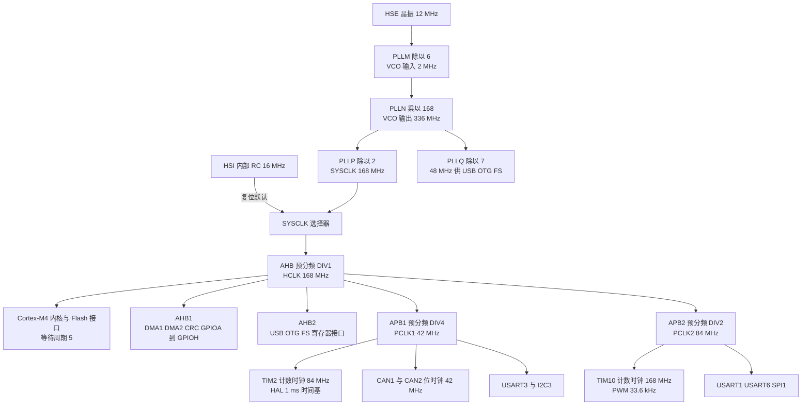
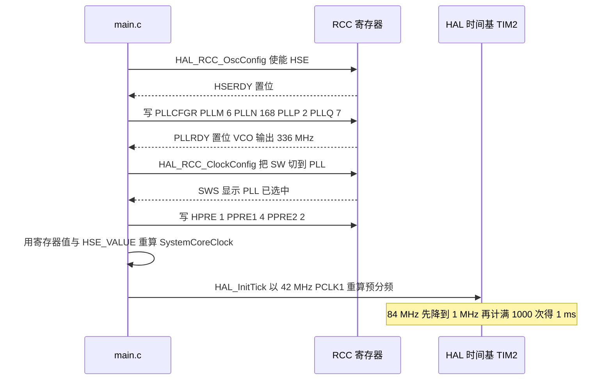

# 时钟树与 PLL

STM32F407 复位后由内部 RC 振荡器 HSI 提供 16 MHz 系统时钟。这个频率带不动云台 1 kHz 的控制循环，也满足不了 USB 与 CAN 对时序的要求。`Core/Src/main.c` 在 `HAL_Init()` 之后立刻调用 `SystemClock_Config()`，把时钟切到外部晶振 HSE 经锁相环 PLL 倍频后的 168 MHz。

时钟树上的每一个参数都同时影响多个外设。PLLM、PLLN、PLLP 决定内核与两条 APB 的频率，PLLQ 单独决定 USB 时钟；APB1 的分频系数又同时决定 CAN 位时钟与 HAL 时间基的计数频率。改一个数字，受影响的往往是三四个看起来无关的模块。

两块哨兵板的取值完全一致，因此下面的推导对云台板与底盘板通用。

## 1. 源码索引

路径相对固件仓库根目录；云台板 `/home/wyx/rm/2026SentriOmeniGimbal/2026OmniSentryGimbal`，底盘板 `/home/wyx/rm/2026SentriOmeniChassis/2026OmniSentryChassis`。

| 文件 | 作用 |
| --- | --- |
| `Core/Src/main.c` | `SystemClock_Config()`，PLL 与总线分频的全部参数 |
| `Core/Inc/stm32f4xx_hal_conf.h` | `HSE_VALUE`、`HSI_VALUE`、`TICK_INT_PRIORITY` |
| `Core/Src/stm32f4xx_hal_timebase_tim.c` | TIM2 时间基，按 APB1 频率反算预分频 |
| `Core/Src/system_stm32f4xx.c` | `SystemCoreClockUpdate()`，按 `HSE_VALUE` 重算主频 |
| `Drivers/STM32F4xx_HAL_Driver/Src/stm32f4xx_hal_rcc.c` | `HAL_RCC_OscConfig()` 与 `HAL_RCC_ClockConfig()` |
| `2026sentriomeni.ioc` | CubeMX 侧的同一组时钟参数 |

## 2. 振荡源、倍频与分频四层

时钟树是从振荡源到外设的一条定向通路，每一层只做两件事之一：选源，或者分频。自下而上分四层。

1. 振荡源。HSI 是芯片内部 16 MHz RC 振荡器，复位后默认使用；HSE 是板上晶振，本工程按 12 MHz 配置；另有 LSI（约 32 kHz）与 LSE（32.768 kHz），本工程未使用。系统时钟只能从 HSI、HSE、PLL 三者中选一个。
2. PLL 倍频。压控振荡器 VCO 先对输入源做除法，再乘法，最后除法得到系统时钟。输入源固定为 HSE 或 HSI。
3. 总线分频。系统时钟经 AHB 预分频得到 HCLK；HCLK 再经两个独立预分频分别得到 PCLK1（APB1）与 PCLK2（APB2）。Cortex-M4 内核、Flash 接口、DMA 与 GPIO 挂在 AHB 上，慢速外设分挂两条 APB。
4. 专用支路。PLLQ 分频器的输出不参与系统时钟选择，直接供 USB OTG FS 使用，要求 48 MHz。



## 3. PLL 四个参数怎么算出 168 MHz

PLL 的四段关系如下，PLLM 与 PLLP 是除法，PLLN 是乘法，PLLQ 输出另走一路。

$$f_{VCOin} = \frac{f_{HSE}}{PLLM} = \frac{12\ \text{MHz}}{6} = 2\ \text{MHz}$$

$$f_{VCOout} = f_{VCOin} \times PLLN = 2\ \text{MHz} \times 168 = 336\ \text{MHz}$$

$$f_{SYSCLK} = \frac{f_{VCOout}}{PLLP} = \frac{336\ \text{MHz}}{2} = 168\ \text{MHz}$$

$$f_{USB} = \frac{f_{VCOout}}{PLLQ} = \frac{336\ \text{MHz}}{7} = 48\ \text{MHz}$$

各参数的取值区间来自 STM32F407 数据手册与参考手册：

| 参数 | 约束 | 本工程取值 | 说明 |
| --- | --- | --- | --- |
| VCO 输入 | 1 至 2 MHz | 2 MHz | 顶到上限，PLLM 不能再小 |
| VCO 输出 | 100 至 432 MHz | 336 MHz | 位于区间中部 |
| PLLM | 2 至 63 | 6 | 12 MHz 除以 6 得到 2 MHz |
| PLLN | 64 至 432 | 168 | `Core/Src/main.c` |
| PLLP | 2、4、6、8 | 2 | 只有 2 能让 SYSCLK 达到上限 168 MHz |
| PLLQ | 2 至 15 | 7 | 336 MHz 除以 7 恰好得到 48 MHz |
| SYSCLK | 不超过 168 MHz | 168 MHz | 顶到上限 |
| AHB 预分频 | 1 至 512 | 1 | HCLK 与 SYSCLK 同频 |
| APB1 预分频 | 1 至 16 | 4 | PCLK1 上限 42 MHz |
| APB2 预分频 | 1 至 16 | 2 | PCLK2 上限 84 MHz |

PLLM 在 12 MHz 输入下有两个常用取值：除以 6 得 2 MHz，除以 8 得 1.5 MHz。选 2 MHz 让 VCO 输出 336 MHz 更居中，而 336 能被 7 整除，USB 的 48 MHz 因此不需要另配晶振。

四段关系里只有一个自由度被浪费的空间：VCO 输出 336 MHz 同时要满足能被 2 整除得到 168 MHz、能被 7 整除得到 48 MHz。336 的最小公倍数条件是 2 与 7 互素，所以只要 PLLN 取 7 的倍数就自动满足。PLLN 取 168 恰好是 7 的 24 倍。

## 4. SystemClock_Config 逐段读

`Core/Src/main.c` 的原文：

```c
void SystemClock_Config(void)
{
  RCC_OscInitTypeDef RCC_OscInitStruct = {0};
  RCC_ClkInitTypeDef RCC_ClkInitStruct = {0};

  __HAL_RCC_PWR_CLK_ENABLE();
  __HAL_PWR_VOLTAGESCALING_CONFIG(PWR_REGULATOR_VOLTAGE_SCALE1);

  RCC_OscInitStruct.OscillatorType = RCC_OSCILLATORTYPE_HSE;
  RCC_OscInitStruct.HSEState = RCC_HSE_ON;
  RCC_OscInitStruct.PLL.PLLState = RCC_PLL_ON;
  RCC_OscInitStruct.PLL.PLLSource = RCC_PLLSOURCE_HSE;
  RCC_OscInitStruct.PLL.PLLM = 6;
  RCC_OscInitStruct.PLL.PLLN = 168;
  RCC_OscInitStruct.PLL.PLLP = RCC_PLLP_DIV2;
  RCC_OscInitStruct.PLL.PLLQ = 7;
  if (HAL_RCC_OscConfig(&RCC_OscInitStruct) != HAL_OK)
  {
    Error_Handler();
  }

  RCC_ClkInitStruct.ClockType = RCC_CLOCKTYPE_HCLK|RCC_CLOCKTYPE_SYSCLK
                              |RCC_CLOCKTYPE_PCLK1|RCC_CLOCKTYPE_PCLK2;
  RCC_ClkInitStruct.SYSCLKSource = RCC_SYSCLKSOURCE_PLLCLK;
  RCC_ClkInitStruct.AHBCLKDivider = RCC_SYSCLK_DIV1;
  RCC_ClkInitStruct.APB1CLKDivider = RCC_HCLK_DIV4;
  RCC_ClkInitStruct.APB2CLKDivider = RCC_HCLK_DIV2;

  if (HAL_RCC_ClockConfig(&RCC_ClkInitStruct, FLASH_LATENCY_5) != HAL_OK)
  {
    Error_Handler();
  }
}
```

四件事按顺序看。

第一，电压等级与 PWR 时钟。168 MHz 属于 F407 的最高频段，必须先把内部稳压器切到 `PWR_REGULATOR_VOLTAGE_SCALE1`，而写这个字段前要先开 PWR 时钟。缺这一步，`HAL_RCC_ClockConfig()` 在高主频下会返回 `HAL_ERROR`。

第二，晶振源与 PLL 参数由 `HAL_RCC_OscConfig()` 一次写入。

该函数先置位 `RCC->CR` 的 `HSEON` 并轮询 `HSERDY`（超时按 `HSE_STARTUP_TIMEOUT` 计，取 100 ms，`Core/Inc/stm32f4xx_hal_conf.h`），再写 `RCC->PLLCFGR` 的 `PLLM`、`PLLN`、`PLLP`、`PLLQ`、`PLLSRC` 字段，使能 PLL 后轮询 `PLLRDY`。任何一步超时或参数越界，函数返回非 `HAL_OK`，`Error_Handler()` 关中断并停在那里（`main.c`）。

第三，系统时钟切换与 `SystemCoreClock` 更新由 `HAL_RCC_ClockConfig()` 完成。

它按传入的 `FLatency` 写 `FLASH->ACR`（`main.c` 传 `FLASH_LATENCY_5`），设置 `CFGR` 的 `HPRE`、`PPRE1`、`PPRE2`，把 `SW` 切到 PLL 并轮询 `SWS` 确认，最后用寄存器值与 `HSE_VALUE` 重算全局变量 `SystemCoreClock`（`Drivers/STM32F4xx_HAL_Driver/Src/stm32f4xx_hal_rcc.c`），并紧接着调用 `HAL_InitTick(uwTickPrio)`。

第四，`HAL_InitTick()` 在本工程里被调用两次。

第一次在 `HAL_Init()` 内部（`Drivers/STM32F4xx_HAL_Driver/Src/stm32f4xx_hal.c`），此时 `SystemCoreClock` 还是复位值 16 MHz，TIM2 预分频按这个频率计算；第二次由上面的 `HAL_RCC_ClockConfig()` 触发，才按真实的 42 MHz PCLK1 重算。

时间基的实现见 `Core/Src/stm32f4xx_hal_timebase_tim.c`：它用 `HAL_RCC_GetPCLK1Freq()` 反算预分频，再把 Period 固定为 999。

## 5. 时钟切完才重算的时间基

时间基重算的时序决定了 `HAL_GetTick()` 在启动阶段是否准确：



第一次调用按 16 MHz 算出的预分频在切钟后立即被覆盖，因此 HAL 计时不会永久偏差；但在两次调用之间若执行了依赖 `HAL_GetTick()` 的等待，等待时长与预期不符。`HAL_Init()` 到 `SystemClock_Config()` 之间的代码只有电压等级与 PWR 时钟两行，没有延时调用，所以这段窗口在实践中不构成问题。

## 6. 派生时钟与它们各自的服务对象

| 派生时钟 | 公式 | 值 | 直接受影响的对象 |
| --- | --- | --- | --- |
| HCLK | 168 MHz 除以 1 | 168 MHz | 内核、Flash 接口、DMA、GPIO、CRC |
| PCLK1 | 168 MHz 除以 4 | 42 MHz | TIM2、CAN1、CAN2、USART3、I2C3 |
| PCLK2 | 168 MHz 除以 2 | 84 MHz | TIM10、USART1、USART6、SPI1 |
| APB1 定时器时钟 | 2 乘以 42 MHz | 84 MHz | TIM2 计数时钟 |
| APB2 定时器时钟 | 2 乘以 84 MHz | 168 MHz | TIM10 计数时钟 |
| USB 时钟 | 336 MHz 除以 7 | 48 MHz | USB OTG FS |

两条 APB 的定时器时钟有个共同规律：当 APB 预分频不为 1 时，定时器时钟是该 APB 时钟的两倍。APB1 分频为 4，所以 TIM2 拿到 84 MHz；APB2 分频为 2，所以 TIM10 拿到 168 MHz。CAN 不享受这个加倍，它的位时钟就是 PCLK1 的 42 MHz。

`HAL_Init()` 另外两件与时钟相关的事写在 `Drivers/STM32F4xx_HAL_Driver/Src/stm32f4xx_hal.c`：一处把 NVIC 优先级分组设为 `NVIC_PRIORITYGROUP_4`，另一处以 `TICK_INT_PRIORITY`（`Core/Inc/stm32f4xx_hal_conf.h` 定义为 15）初始化时间基。

## 7. HSE_VALUE 与实物晶振不一致的连锁反应

这类问题不改变任何寄存器写入：PLLM、PLLN、PLLP 照写，硬件按真实晶振倍频，软件却按 `HSE_VALUE` 计算主频。设实物晶振为 8 MHz 而 `HSE_VALUE` 仍写 12000000，实际频率是

$$f_{SYSCLK实际} = \frac{8\ \text{MHz}}{6} \times 168 \div 2 = 112\ \text{MHz}$$

而 `SystemCoreClock` 仍然报 168 MHz。连带后果有三处：TIM2 的 1 ms 实际变成约 1.5 ms，`HAL_GetTick()` 与所有 `HAL_Delay()` 同步偏慢；CAN 位时钟从 42 MHz 降到 28 MHz，1 Mbps 的位时序参数算出来是 666.7 kbps，总线上没有节点能应答；PLLQ 输出只有 32 MHz，USB 枚举失败。

三处后果里 CAN 最容易被误判为硬件故障，因为发送函数会返回成功而后没有任何反馈。判别方法是读 `HAL_RCC_GetPCLK1Freq()` 的返回值与实际波特率对照，而不是看位定时寄存器的数值。

## 8. 易错点：常见判断偏差

| # | 判断偏差 | 表现 | 依据 |
| --- | --- | --- | --- |
| 1 | 认为 `HSE_VALUE` 只影响注释 | 所有依赖频率的计算都按它取值 | `stm32f4xx_hal_rcc.c` |
| 2 | 认为 VCO 输入可以取到 3 MHz | 上限为 2 MHz，PLLM=6 已是边界 | 参考手册的 PLL 约束 |
| 3 | 认为 PLLP 可以取任意偶数 | 只有 2、4、6、8 | 同表 |
| 4 | 只改 PLLN 不看 PLLQ | USB 时钟随之改变，枚举失败 | 两者共用 VCO 输出 |
| 5 | 认为 Flash 等待周期可以留 0 | 取指错误，随机进 `HardFault_Handler()` | `main.c` |
| 6 | 认为时间基预分频在切钟后仍是 16 MHz 的值 | `HAL_RCC_ClockConfig` 会重算一次 | `stm32f4xx_hal_rcc.c` |
| 7 | 把 APB 定时器时钟当成 APB 时钟 | 预分频不为 1 时定时器时钟翻倍 | TIM2 为 84 MHz |
| 8 | 在 CubeMX 生成区外改时钟代码 | 重新生成后被覆盖 | `USER CODE` 区之外不保留 |
| 9 | 认为 CAN 位时钟是 84 MHz | CAN 不做定时器加倍，取 42 MHz | 见第 6 节派生表 |

## 9. 小结

### 核心概念

- 复位后系统跑在 HSI 16 MHz；`main.c` 的 `SystemClock_Config()` 把源切到 HSE 12 MHz 经 PLL 倍频的 168 MHz。
- 推导链：HSE 12 MHz 除以 PLLM 6 得 2 MHz，乘以 PLLN 168 得 336 MHz，除以 PLLP 2 得 SYSCLK 168 MHz；PLLQ 7 另得 48 MHz 供 USB。
- 总线分频：AHB DIV1 得 168 MHz，APB1 DIV4 得 42 MHz，APB2 DIV2 得 84 MHz。
- 168 MHz 需要 `PWR_REGULATOR_VOLTAGE_SCALE1` 与 `FLASH_LATENCY_5` 两个前提。
- `SystemCoreClock` 由 `HAL_RCC_ClockConfig()` 在切换完成后按寄存器值与 `HSE_VALUE` 重算（`stm32f4xx_hal_rcc.c`）。
- `HAL_InitTick()` 被调用两次：`HAL_Init()` 里按 16 MHz 算一次，切钟后按 42 MHz 重算一次。
- HAL 的 1 ms 时间基用 TIM2 实现，计数时钟 84 MHz，预分频 83，Period 999。

### 设计权衡

| 选择 | 本工程取值 | 代价与收益 |
| --- | --- | --- |
| 振荡源 | HSE 12 MHz | 精度远高于 HSI 的百分之一量级；代价是板上必须有晶振，起振失败要走 `Error_Handler()` |
| PLLM | 6 | VCO 输入取到上限 2 MHz，VCO 输出居中；代价是更换晶振后必须同步调整 |
| PLLP | 2 | 唯一能让 SYSCLK 达到 168 MHz 的分频比 |
| PLLQ | 7 | 复用同一个 336 MHz VCO 输出得到 48 MHz，省一路时钟 |
| APB1 分频 | 4 | 42 MHz 是 PCLK1 上限；代价是 CAN 与 TIM2 的时钟被这条链路绑定 |
| APB2 分频 | 2 | 84 MHz 让 SPI1 与串口留有余量 |
| Flash 等待周期 | 5 | 满足 168 MHz 的取指时序；代价是每次取指多等 5 拍 |

## 10. 练习

### 基础题

1. 写出 HSE 换成 8 MHz 晶振后，为保持 SYSCLK 168 MHz，PLLM 与 PLLN 可以取哪些整数组合（要求 VCO 输入落在 1 至 2 MHz、VCO 输出落在 100 至 432 MHz）。
2. 计算把 `APB1CLKDivider` 改成 `RCC_HCLK_DIV8` 后 PCLK1 的值，并判断 CAN 在这种配置下能否得到 1 Mbps。
3. 说明 `SystemCoreClock` 在 `HAL_Init()` 之后、`SystemClock_Config()` 之前的取值。
4. 写出 TIM2 计数时钟的由来，并算出它的预分频与周期设置。

### 挑战题

5. 查阅 `system_stm32f4xx.c` 的 `SystemCoreClockUpdate()`，说明它与 `HAL_RCC_ClockConfig()` 内那次重算在输入来源上的差异。
6. 把 `FLASH_LATENCY_5` 误写成 `FLASH_LATENCY_0`，预测现象，并说明为什么在 `main()` 里加串口打印未必看得见。
7. PLLQ 必须给出 48 MHz。给出 VCO 输出改为 384 MHz 时 `PLLN`、`PLLP`、`PLLQ` 的一组取值，并验证 SYSCLK 不超过 168 MHz。
8. 说明为什么 `HAL_InitTick()` 第一次按 16 MHz 计算预分频不会导致 HAL 计时永久错误。

## 附：本页引用的固件路径

| 路径 | 用途 |
| --- | --- |
| `/home/wyx/rm/2026SentriOmeniGimbal/2026OmniSentryGimbal/Core/Src/main.c` | `SystemClock_Config()`、电压等级与 PWR 时钟、`FLASH_LATENCY_5`、`Error_Handler()` |
| `/home/wyx/rm/2026SentriOmeniGimbal/2026OmniSentryGimbal/Core/Inc/stm32f4xx_hal_conf.h` | `HSE_VALUE` 与 `HSE_STARTUP_TIMEOUT`、`TICK_INT_PRIORITY` |
| `/home/wyx/rm/2026SentriOmeniGimbal/2026OmniSentryGimbal/Core/Src/stm32f4xx_hal_timebase_tim.c` | TIM2 预分频反算与 Period |
| `/home/wyx/rm/2026SentriOmeniGimbal/2026OmniSentryGimbal/Core/Src/system_stm32f4xx.c` | `SystemCoreClockUpdate()` |
| `/home/wyx/rm/2026SentriOmeniGimbal/2026OmniSentryGimbal/Drivers/STM32F4xx_HAL_Driver/Src/stm32f4xx_hal_rcc.c` | `SystemCoreClock` 重算与 `HAL_InitTick` |
| `/home/wyx/rm/2026SentriOmeniGimbal/2026OmniSentryGimbal/Drivers/STM32F4xx_HAL_Driver/Src/stm32f4xx_hal.c` | 优先级分组与首次 `HAL_InitTick` |
| `/home/wyx/rm/2026SentriOmeniGimbal/2026OmniSentryGimbal/2026sentriomeni.ioc` | CubeMX 侧的时钟树参数 |
