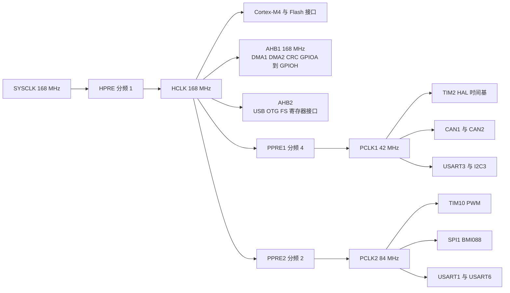
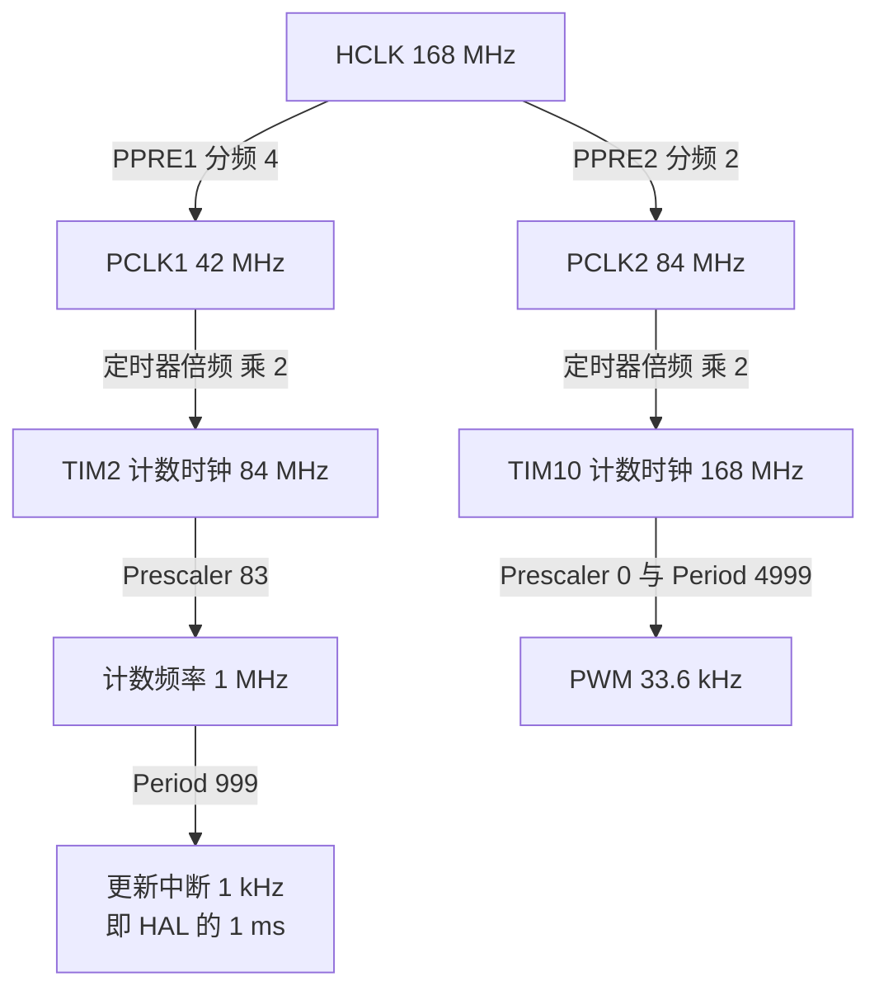

# 总线拓扑与预分频

168 MHz 只有一个，需要它的外设却有十几类。STM32F407 把总线分成三层，每层频率由 `HPRE`、`PPRE1`、`PPRE2` 三个字段决定。外设实际拿到的时钟决定了它的位定时，CAN 的波特率完全由 APB1 频率反推。

分频系数看起来只是几个整数，但每一条都绑着若干外设：改动 APB1 的分频会同时影响 CAN 位时钟、I2C3 速率、USART3 波特率与 HAL 的 1 ms 时间基。下面给出两块板共用的总线拓扑、各外设的实得频率，以及三条能被直接核对的算式。

## 源码索引

路径相对固件仓库根目录；云台板 `/home/wyx/rm/2026SentriOmeniGimbal/2026OmniSentryGimbal`，底盘板 `/home/wyx/rm/2026SentriOmeniChassis/2026OmniSentryChassis`。

| 文件 | 作用 |
| --- | --- |
| `Core/Src/main.c` | 三个预分频字段的取值 |
| `Core/Src/gpio.c` | 端口时钟使能（AHB1） |
| `Core/Src/dma.c` | DMA1 与 DMA2 时钟使能（AHB1）与五个流的中断 |
| `Core/Src/can.c` | CAN1 与 CAN2 的位时序参数与 APB1 时钟使能 |
| `Core/Src/usart.c`、`Core/Src/spi.c`、`Core/Src/i2c.c`、`Core/Src/tim.c` | 各外设的时钟使能与波特率 |
| `Core/Src/stm32f4xx_hal_timebase_tim.c` | 按 PCLK1 反算 TIM2 预分频 |
| `2026sentriomeni.ioc` | CubeMX 算出的各外设频率（`RCC.AHB1Freq_Value` 等） |

## 三条总线的外设归属

- AHB：Cortex-M4 内核、Flash 接口、DMA1、DMA2、CRC、GPIOA 至 GPIOH、USB OTG FS 寄存器接口。频率记作 HCLK，与 SYSCLK 同频。
- APB1：TIM2 至 TIM7、CAN1、CAN2、I2C1 至 I2C3、USART2、USART3、UART4、UART5、PWR、DAC。频率记作 PCLK1，上限 42 MHz。
- APB2：TIM1、TIM8 至 TIM11、USART1、USART6、SPI1、SYSCFG、ADC、SDIO。频率记作 PCLK2，上限 84 MHz。

预分频字段是整数分频，AHB 取 1 至 512，APB 取 1 至 16。另有一条规则只作用于定时器：APB 预分频系数不为 1 时，挂在该总线上定时器的计数时钟是 PCLK 的两倍。这条规则让定时器在慢总线上仍能获得较高分辨率，代价是计算定时器频率时必须先判断分频系数。

## APB 分频与定时器倍频两条规则

$$f_{HCLK} = \frac{f_{SYSCLK}}{HPRE} = \frac{168\ \text{MHz}}{1} = 168\ \text{MHz}$$

$$f_{PCLK1} = \frac{f_{HCLK}}{PPRE1} = \frac{168\ \text{MHz}}{4} = 42\ \text{MHz}$$

$$f_{PCLK2} = \frac{f_{HCLK}}{PPRE2} = \frac{168\ \text{MHz}}{2} = 84\ \text{MHz}$$

定时器的计数时钟还要再乘一次倍频：

$$f_{TIM} = \begin{cases} f_{PCLK} & PPRE = 1 \\ 2 \times f_{PCLK} & PPRE \ne 1 \end{cases}$$

代入本工程得 $f_{TIM2} = 84\ \text{MHz}$、$f_{TIM10} = 168\ \text{MHz}$。这两个数字是后面所有定时参数的基准。

## 从 168 MHz 到各外设实得频率

| 外设 | 总线 | 时钟来源 | 关键参数 | 落地结果 |
| --- | --- | --- | --- | --- |
| TIM2 | APB1 | 定时器倍频 84 MHz | Prescaler 83、Period 999 | 1 kHz 更新中断，HAL 的 1 ms |
| CAN1、CAN2 | APB1 | 42 MHz | Prescaler 2、BS1 15TQ、BS2 5TQ、SJW 1TQ | 1 Mbps |
| USART3 | APB1 | 42 MHz | 100000 波特、8E1、仅接收 | DBUS 遥控器 |
| I2C3 | APB1 | 42 MHz | 400 kHz | 板载低速外设 |
| TIM10 | APB2 | 定时器倍频 168 MHz | Prescaler 0、Period 4999、PWM1 | 33.6 kHz，IMU 加热 |
| SPI1 | APB2 | 84 MHz | 预分频 64 | 1.3125 MHz，BMI088 |
| USART1 | APB2 | 84 MHz | 115200 波特、8N1 | 调试串口 |
| USART6 | APB2 | 84 MHz | 115200 波特、8N1 | 云台未启用，底盘接裁判系统 |
| USB OTG FS | AHB2 与 PLLQ | 48 MHz | 全速 12 Mbps | 与视觉小电脑的 CDC |
| DMA1、DMA2、CRC、GPIO | AHB1 | 168 MHz | 五条 DMA 流 | 见 `Core/Src/dma.c:47-61` |

## CAN 与 SPI 的算式核对

CAN 的波特率是这条链上最直接的算式。位时间由同步段、BS1、BS2 三段组成，总长 1+15+5=21 个时间份额（Time Quantum, TQ）：

$$Baud = \frac{f_{PCLK1}}{Prescaler \times (1 + BS1 + BS2)} = \frac{42\ \text{MHz}}{2 \times 21} = 1\ \text{Mbps}$$

$$TQ = \frac{Prescaler}{f_{PCLK1}} = \frac{2}{42\ \text{MHz}} = 47.619\ \text{ns}$$

这两个数字在 CubeMX 的 `.ioc` 里被原样记录：`2026sentriomeni.ioc:9` 的 `CAN1.CalculateBaudRate=1000000`、`:11` 的 `CAN1.CalculateTimeQuantum=47.61904761904762`。参数原文在 `Core/Src/can.c:42-46`（CAN1）与 `:74-78`（CAN2），两者完全一致。

SPI1 的预分频同样可以直接核对：84 MHz 除以 64 得 1.3125 MHz，与 `2026sentriomeni.ioc:405` 的 `SPI1.CalculateBaudRate=1.3125 MBits/s` 相符。TIM10 的算式是 168 MHz 除以 `(0+1)` 再除以 `(4999+1)`，得 33.6 kHz。

三组算式覆盖了两条 APB：CAN 与 SPI 分别落在 42 MHz 与 84 MHz 上，TIM10 走的还是倍频后的 168 MHz。

## 串口分频的两个推导值

USART 的波特率由 `BRR` 决定，16 倍过采样下：

$$USARTDIV = \frac{f_{PCLK}}{16 \times Baud}$$

两个串口的推导值如下：

| 串口 | 时钟 | 目标波特率 | USARTDIV | 最近可表示值 | 实际波特率 |
| --- | --- | --- | --- | --- | --- |
| USART1 | 84 MHz | 115200 | 45.5729 | 45 + 9/16 | 115226 |
| USART3 | 42 MHz | 100000 | 26.25 | 26 + 4/16 | 100000 |

USART3 的 26.25 能被 1/16 整除，误差为 0；USART1 的 45.5729 只能取到 45.5625，误差约 0.02%，远低于串口允许的 2% 到 3%。表中数值是按公式反推的推导值，用于核对 CubeMX 生成的 `BRR` 是否合理，源码里的实际初值以 `Core/Src/usart.c` 为准。

## 时钟门控落在哪几个寄存器

外设时钟使能的落点分散在各初始化文件里，端口与 DMA 在 AHB1，外设自身在对应的 APB：

- `Core/Src/gpio.c:48-54`：GPIOB、GPIOG、GPIOA、GPIOD、GPIOC、GPIOH、GPIOF 七个端口。
- `Core/Src/dma.c:43-44`：DMA2 与 DMA1。
- `Core/Src/can.c:109`、`:139-143`：CAN1 与 CAN2，其中 CAN2 使能时代码还会再确保一次 CAN1 时钟（`HAL_RCC_CAN1_CLK_ENABLED` 计数）。
- `Core/Src/usart.c:132`、`:164`、`:210`：USART1、USART3、USART6。
- `Core/Src/spi.c:74`、`Core/Src/i2c.c:90`、`Core/Src/tim.c:80`：SPI1、I2C3、TIM10。

CAN2 那一处需要展开：在 F4 系列里 CAN1 与 CAN2 共用滤波器资源，滤波器寄存器的时钟挂在 CAN1 上，因此使能 CAN2 时必须先保证 CAN1 时钟已开。`HAL_RCC_CAN1_CLK_ENABLED` 是一个引用计数，两次使能不会互相关掉。

## 改动 APB1 分频的连带效应

PCLK1 同时决定 CAN 位时钟、I2C3 的速率、USART3 的波特率和 TIM2 的 1 ms。把 `APB1CLKDivider` 从 `RCC_HCLK_DIV4` 改成 `RCC_HCLK_DIV8`，PCLK1 变成 21 MHz，CAN 位时序不变而实际速率减半，USART3 的 `BRR` 需要重算，TIM2 的预分频要重算。工作记录里的那次 CAN 故障就是这条链断掉的表现，第 05 章有复盘。

四条连带项里，只有 CAN 的失效是"没有报错"的：发送函数照样返回成功，帧进邮箱，总线上却无人应答。USART3 与 TIM2 的偏差会直接体现在数据错乱与计时变慢上，相对容易发现。

## 常见判断偏差

| # | 判断偏差 | 表现 | 依据 |
| --- | --- | --- | --- |
| 1 | 把 APB 分频系数当成定时器分频 | TIM2 预分频会算成 41 而不是 83 | `Core/Src/stm32f4xx_hal_timebase_tim.c:60-67` |
| 2 | 认为外设时钟使能也管引脚 | CAN1 在 APB1，PD0/PD1 在 AHB1，两处都要开 | `can.c:109` 与 `gpio.c:48-54` |
| 3 | 认为 CAN 也享受定时器倍频 | CAN 位时钟就是 PCLK1 的 42 MHz | `can.c:42-46` |
| 4 | 认为端口时钟未开会报错 | `HAL_GPIO_Init()` 返回 `void`，写入被丢弃 | 静默失效 |
| 5 | 认为 APB1 改动只影响 CAN | USART3、I2C3、TIM2 都要重算 | 见第 8 节 |
| 6 | 把 DMA 当成 APB 外设 | DMA1 与 DMA2 在 AHB1，168 MHz | `dma.c:43-44` |
| 7 | 认为 SPI1 频率可直接取 84 MHz | 需经预分频，本工程为 64 | `ioc:405` |
| 8 | 认为 CAN2 可以单独开时钟 | 滤波器资源挂在 CAN1，需先开 CAN1 | `can.c:139-143` |

## 小结

### 核心概念

- 三条总线：AHB 168 MHz、APB1 42 MHz、APB2 84 MHz，由 `HPRE`、`PPRE1`、`PPRE2` 三个字段决定。
- 本工程 AHB DIV1、APB1 DIV4、APB2 DIV2，对应 168 / 42 / 84 MHz。
- 定时器计数时钟在 APB 分频系数不为 1 时是 PCLK 的两倍：TIM2 得 84 MHz，TIM10 得 168 MHz。
- 时间基 TIM2 用 Prescaler 83 与 Period 999 得到 1 ms。
- CAN 波特率 `Baud = f_{PCLK1} / (Prescaler × 21)`，代入 42 MHz 与 Prescaler 2 得 1 Mbps，TQ 为 47.619 ns。
- SPI1 在 84 MHz 下用预分频 64 得到 1.3125 MHz，与 `.ioc` 的计算值一致。
- 端口时钟在 AHB1，DMA 与 CRC 也在 AHB1，外设自身的时钟门控在 APB1 或 APB2，两者要分别使能。

### 设计权衡

| 选择 | 本工程取值 | 代价与收益 |
| --- | --- | --- |
| APB1 分频 | 4 | 42 MHz 是上限，CAN 与 TIM2 都吃这条链的余量；代价是 PCLK1 被压到 AHB 的四分之一 |
| APB2 分频 | 2 | 84 MHz 让 SPI1 与串口有余量；代价是 PCLK2 与 PCLK1 相差两倍，两条总线的外设不能混算 |
| 定时器倍频 | 使用 | TIM2 得到 84 MHz，1 ms 时间基的预分频只有 83；代价是算频率时必须先判断分频系数 |
| SPI1 预分频 | 64 | 1.3125 MHz 远低于 BMI088 的 10 MHz 上限，读数稳定；代价是单次事务时间变长 |
| DMA 归属 | AHB1 | 与内核同频，搬运快；代价是与取指争用总线带宽 |

## 练习

### 基础题

1. 由 168 MHz 与 `APB1CLKDivider` 取值，写出 PCLK1 与 TIM2 计数时钟的算式，并说明为什么后者是前者的两倍。
2. 计算把 SPI1 预分频从 64 改成 8 后的 SCK 频率，并对照 BMI088 手册判断是否超限。
3. 计算 I2C3 在 PCLK1 为 42 MHz 时配置 400 kHz 所需的 `CCR` 量级（标准模式与快速模式分别讨论）。
4. 用第 7 节的公式核对 USART1 与 USART3 的最近可表示分频值。

### 挑战题

5. 已知 CAN 位时间是 21 TQ，采样点在 16/21。说明把 BS1 改为 13TQ、BS2 改为 7TQ 后波特率与采样点的变化。
6. 把 `APB1CLKDivider` 改成 `RCC_HCLK_DIV8`，列出需要同步修改的四处参数（CAN、USART3、I2C3、TIM2），并写出各自的修正值。
7. 云台板同时使用 DMA1 与 DMA2。查阅 `Core/Src/dma.c`，说明哪几条流属于哪条控制器，以及它们分别服务于哪个外设。
8. 说明 `HAL_RCC_GetPCLK1Freq()` 与 `HAL_RCC_GetHCLKFreq()` 的返回值在 `HAL_Init()` 之后、`SystemClock_Config()` 之前分别是多少。

## 附：本页引用的固件路径

| 路径 | 用途 |
| --- | --- |
| `/home/wyx/rm/2026SentriOmeniGimbal/2026OmniSentryGimbal/Core/Src/main.c` | 三个预分频字段的取值 |
| `/home/wyx/rm/2026SentriOmeniGimbal/2026OmniSentryGimbal/Core/Src/gpio.c` | 端口时钟使能（:48-54） |
| `/home/wyx/rm/2026SentriOmeniGimbal/2026OmniSentryGimbal/Core/Src/dma.c` | DMA 时钟使能（:43-44）与五条流（:47-61） |
| `/home/wyx/rm/2026SentriOmeniGimbal/2026OmniSentryGimbal/Core/Src/can.c` | 位时序（:42-46、:74-78）、时钟使能（:109、:139-143） |
| `/home/wyx/rm/2026SentriOmeniGimbal/2026OmniSentryGimbal/Core/Src/usart.c` | 时钟使能与波特率（:132、:164、:210） |
| `/home/wyx/rm/2026SentriOmeniGimbal/2026OmniSentryGimbal/Core/Src/spi.c` | SPI1 预分频（:74） |
| `/home/wyx/rm/2026SentriOmeniGimbal/2026OmniSentryGimbal/Core/Src/i2c.c` | I2C3 时钟（:90） |
| `/home/wyx/rm/2026SentriOmeniGimbal/2026OmniSentryGimbal/Core/Src/tim.c` | TIM10 时钟（:80） |
| `/home/wyx/rm/2026SentriOmeniGimbal/2026OmniSentryGimbal/Core/Src/stm32f4xx_hal_timebase_tim.c` | APB1 分频判断（`Core/Src/stm32f4xx_hal_timebase_tim.c:60-67`） |
| `/home/wyx/rm/2026SentriOmeniGimbal/2026OmniSentryGimbal/2026sentriomeni.ioc` | CAN 与 SPI1 计算值（:9、:11、:405） |
