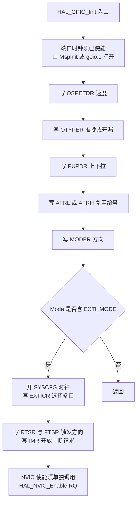
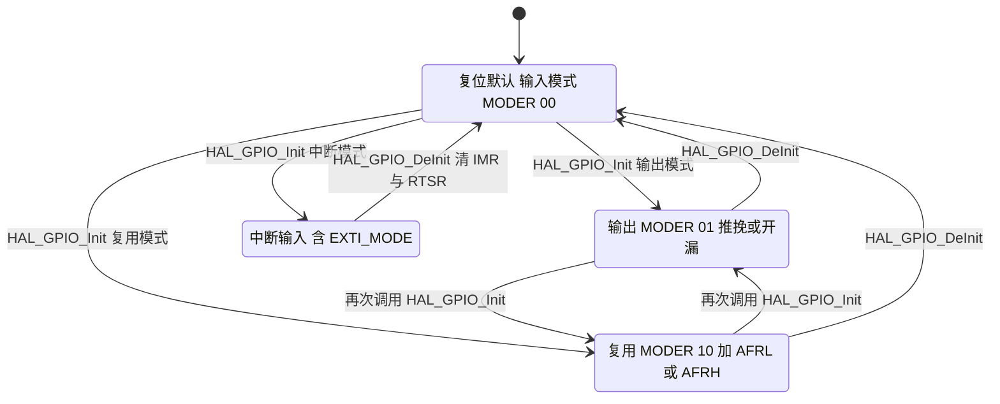

# GPIO 模式与复用

引脚在复位后默认是浮空输入（`MODER` 为 `00`），调试口占用的 PA13 至 PA15 与 PB3 与 PB4 例外，它们复位即为复用模式。未配置的引脚既不驱动输出也读不到有效电平。`MX_GPIO_Init()` 与各外设的 `HAL_xxx_MspInit()` 把用到的引脚逐个配置成输出、复用或中断输入。配置字段只有六个：方向、输出类型、速度、上下拉、复用编号、初始电平。本单元按 `HAL_GPIO_Init()` 的写入顺序解释这六个字段落到哪些寄存器，再对照两块板实际用到的模式。

> 源码索引（路径相对固件仓库根目录；云台板 `/home/wyx/rm/2026SentriOmeniGimbal/2026OmniSentryGimbal`，底盘板 `/home/wyx/rm/2026SentriOmeniChassis/2026OmniSentryChassis`）

| 文件 | 作用 |
| --- | --- |
| `Core/Src/gpio.c` | 端口时钟使能与纯 GPIO 配置 |
| `Core/Src/stm32f4xx_hal_msp.c` | `HAL_MspInit()`，SYSCFG 与 PWR 时钟 |
| `Core/Src/can.c`、`usart.c`、`spi.c`、`i2c.c`、`tim.c` | 各外设的 GPIO 复用配置 |
| `USB_DEVICE/Target/usbd_conf.c` | USB OTG FS 的 PA11 与 PA12 |
| `Drivers/STM32F4xx_HAL_Driver/Src/stm32f4xx_hal_gpio.c` | `HAL_GPIO_Init()` 的实现 |
| `BMI088/Src/BMI088.cpp` | 片选引脚的使用者 |

## 1. 概念

- 端口与引脚：GPIOA 至 GPIOH，每个端口 16 个引脚。端口时钟挂在 AHB1，由 `RCC->AHB1ENR` 的 `GPIOxEN` 位门控。
- 配置寄存器：`GPIOx_MODER`（方向）、`GPIOx_OTYPER`（推挽或开漏）、`GPIOx_OSPEEDR`（压摆率）、`GPIOx_PUPDR`（上下拉）、`GPIOx_AFRL` 与 `GPIOx_AFRH`（复用编号）。
- 数据寄存器：`GPIOx_IDR` 读引脚电平，`GPIOx_ODR` 写输出电平。
- 复用（Alternate Function, **AF**）：每个引脚有 16 个可选功能，编号 0 至 15。`AFRL` 管 0 至 7 号引脚，`AFRH` 管 8 至 15 号引脚，每个引脚占 4 bit。
- 原子置位：`GPIOx_BSRR` 用一次写操作置位或复位单个引脚，不需要读改写，中断里改引脚不会破坏同端口其他位的电平。

## 2. HAL_GPIO_Init 的写入顺序

`HAL_GPIO_Init()` 从 `Drivers/STM32F4xx_HAL_Driver/Src/stm32f4xx_hal_gpio.c:164` 开始，按固定顺序写寄存器：

1. 速度。读 `OSPEEDR` 的 2 bit，按 `GPIO_InitStruct.Speed` 写入（第 194 至 197 行）。
2. 输出类型。读 `OTYPER` 的 1 bit，按 `Mode` 是否含 `GPIO_MODE_OUTPUT_OD` 或 `GPIO_MODE_AF_OD` 决定推挽还是开漏（第 200 至 203 行）。
3. 上下拉。读 `PUPDR` 的 2 bit，写入 `GPIO_NOPULL`、`GPIO_PULLUP` 或 `GPIO_PULLDOWN`（第 212 至 215 行）。
4. 复用编号。写 `AFR[position >> 3]`，位置由引脚号决定，值取 `GPIO_InitStruct.Alternate` 的低 4 bit（第 224 至 227 行）。
5. 方向。最后写 `MODER` 的 2 bit（第 231 至 234 行）。输入对应 `0b00`，输出对应 `0b01`，复用对应 `0b10`，模拟对应 `0b11`。
6. 中断线。若 `Mode` 含 `EXTI_MODE`，先使能 SYSCFG 时钟，再写 `SYSCFG->EXTICR` 选择端口（第 240 至 246 行），然后按触发方向写 `EXTI->RTSR` 与 `EXTI->FTSR`，最后写 `EXTI->IMR` 开放该线的中断请求（第 249 至 280 行）。

方向放在复用编号之后写，是为了让引脚在速度与上下拉就位之前不切到复用输出，避免配置期间输出一段无效波形。中断线只配到 SYSCFG 与 EXTI 两级，NVIC 的使能必须另外调用 `HAL_NVIC_EnableIRQ(EXTIx_IRQn)`。

## 3. 落到本项目

两块板的引脚配置完全相同，下表列出云台板的全部非虚拟引脚：

| 引脚 | 模式 | 输出类型 | 速度 | 上下拉 | 复用编号 | 配置位置 |
| --- | --- | --- | --- | --- | --- | --- |
| PD0、PD1 | 复用 | 推挽 | 很高 | 无 | AF9 | `Core/Src/can.c:117-122` |
| PB5、PB6 | 复用 | 推挽 | 很高 | 无 | AF9 | `Core/Src/can.c:150-155` |
| PC11、PC10 | 复用 | 推挽 | 很高 | 无 | AF7 | `Core/Src/usart.c:171-176` |
| PA9、PB7 | 复用 | 推挽 | 很高 | 无 | AF7 | `Core/Src/usart.c:140-152` |
| PG14、PG9 | 复用 | 推挽 | 很高 | 无 | AF8 | `Core/Src/usart.c:217-222` |
| PB4、PB3、PA7 | 复用 | 推挽 | 很高 | 无 | AF5 | `Core/Src/spi.c:83-95` |
| PC9、PH7 | 复用 | 开漏 | 很高 | 无 | AF4 | `Core/Src/i2c.c:75-87` |
| PA11、PA12 | 复用 | 推挽 | 很高 | 无 | AF10 | `USB_DEVICE/Target/usbd_conf.c:83-88` |
| PF6 | 复用 | 推挽 | 低 | 无 | AF3 | `Core/Src/tim.c:104-109` |
| PA4、PB0 | 输出 | 推挽 | 低 | 无 | 未使用 | `Core/Src/gpio.c:94-106` |
| PG6、PH11 | 输出 | 推挽 | 低 | 无 | 未使用 | `Core/Src/gpio.c:68-86` |
| PG3 | 中断 | 未使用 | 未设置 | 上拉 | 未使用 | `Core/Src/gpio.c:75-79` |
| PA0 | 中断 | 未使用 | 未设置 | 上拉 | 未使用 | `Core/Src/gpio.c:88-92` |
| PH0、PH1 | 复位默认 | 代码不配置 | 代码不配置 | 代码不配置 | 未使用 | HSE 使能后由振荡器电路使用 |
| PA13、PA14 | 复用 | 推挽 | 很高 | 上拉 | AF0 | 由调试端口默认配置 |

四组细节需要展开。

片选引脚由 GPIO 层配置，不由驱动配置。`Core/Src/gpio.c:63` 与 `:66` 在配置成输出之前先把 ODR 写成高电平，保证 SPI 通信开始前 PA4 与 PB0 已经是高电平的空闲状态。驱动只负责拉低与拉高，配置见 `BMI088/Src/BMI088.cpp:181-193`，引脚编号在 `:343-345` 传入构造函数。把 `HAL_GPIO_WritePin()` 移到 `HAL_GPIO_Init()` 之后，片选会先出现一段低电平。

PF6 的配置不在 `gpio.c` 里，而在 `HAL_TIM_MspPostInit()`（`Core/Src/tim.c:90-116`）。CubeMX 把带引脚的定时器通道单独生成到 post-init 函数，由 `MX_TIM10_Init()` 末尾第 67 行调用。查找定时器通道引脚时，只看 `gpio.c` 会漏掉它。

I2C3 用开漏加外部上拉。`Core/Src/i2c.c:77` 与 `:84` 都写 `GPIO_NOPULL`，片内上下拉不使能，400 kHz 总线的上拉电阻在板上。把这里改成 `GPIO_PULLUP` 不会提高总线质量，只会叠加一组弱上拉。

速度分两档。所有复用引脚用 `GPIO_SPEED_FREQ_VERY_HIGH`，纯输出与 TIM10 通道用 `GPIO_SPEED_FREQ_LOW`。加热 PWM 的边沿速率不影响控制精度，低速档可以少一些开关噪声。

## 4. 易错点

（1）端口时钟未开导致静默失效。`HAL_GPIO_Init()` 返回 `void`，端口时钟未使能时寄存器写入被丢弃，不产生错误码。引脚停在复位默认的浮空输入状态，现象是既读不到有效电平也没有输出。检查时应先读回 `GPIOx_MODER` 确认。

（2）复用编号写错。`Alternate` 字段是 4 bit，`AFRL` 与 `AFRH` 按引脚号奇偶分界。写错编号后引脚的电平由另一个外设驱动，现象是外设寄存器状态正常而物理线上没有信号。

（3）同一引脚被两处配置。`main.c:110` 先调用 `MX_GPIO_Init()`，各外设的 MspInit 在 `MX_xxx_Init()` 内部随后执行，后写覆盖先写。若把某个复用引脚同时在 `gpio.c` 里配成输出，最终生效的是 `gpio.c` 之外的那次调用。查找引脚冲突时应当按调用顺序核对，而不是只看一个文件。

（4）EXTI 配了但 NVIC 没使能。`.ioc` 里 PA0 与 PG3 都标了 EXTI 配置，但 NVIC 列表中没有 `EXTI0_IRQn` 与 `EXTI3_IRQn`，`Core/Src/stm32f4xx_it.c` 里也没有对应的中断服务函数，工程内没有实现 `HAL_GPIO_EXTI_Callback()`。这两根引脚的中断因此不会触发，寄存器层面 `EXTI->IMR` 却已经打开，读寄存器会得到与实际行为相反的印象。

（5）片选初始电平的顺序。初始电平必须在 `HAL_GPIO_Init()` 之前写，原因见上一节。这类顺序问题在功能上表现为首次 SPI 事务偶发读回全零。

（6）上下拉与外部电路的重复。PG3 与 PA0 启用片内上拉，对应外部电路不应再挂上拉；两处并联后下拉能力增强，边沿变缓。

## 5. 小结

### 核心概念

- 引脚复位默认是浮空输入（`MODER` 为 `00`），调试口相关的 PA13、PA14、PA15 与 PB3、PB4 复位即为复用模式；`MX_GPIO_Init()` 与各 MspInit 负责把用到的引脚改成输出、复用或中断输入。
- 六个配置字段分别写 `OSPEEDR`、`OTYPER`、`PUPDR`、`AFRL/`AFRH`、`MODER`，中断模式还要写 `SYSCFG->EXTICR` 与 `EXTI->IMR/RTSR/FTSR`。
- `HAL_GPIO_Init()` 的写入顺序是速度、输出类型、上下拉、复用编号、方向、中断线，顺序本身有作用。
- NVIC 的使能不在 `HAL_GPIO_Init()` 内，要单独调用 `HAL_NVIC_EnableIRQ()`。
- `GPIOx_BSRR` 提供原子置位，中断里改引脚安全。
- 本工程复用引脚统一用 `GPIO_SPEED_FREQ_VERY_HIGH`，纯输出用 LOW；I2C3 用开漏且不启用片内上下拉。
- TIM10 的 PF6 配置在 `HAL_TIM_MspPostInit()`，不在 `gpio.c`。

### 设计权衡

| 选择 | 本工程取值 | 代价与收益 |
| --- | --- | --- |
| 复用引脚速度 | 很高 | 边沿陡，满足 CAN 与 SPI 时序；代价是开关噪声略高 |
| 输出引脚速度 | 低 | 噪声低；片选与加热使能不需要快速边沿 |
| I2C 输出类型 | 开漏 | I2C 电气规范要求；代价是必须依赖板上上拉电阻 |
| I2C 上下拉 | 不启用片内 | 避免与板上电阻并联；代价是板上电阻缺失时总线无上拉 |
| 中断引脚上下拉 | 上拉 | 悬空时电平确定；代价是与外部上拉并联 |
| 片选初值位置 | 配置之前写 | 空闲电平从第一刻起正确；代价是代码顺序不能随意调整 |

## 6. 练习

基础题

1. 写出 `GPIO_InitStruct.Mode` 取 `GPIO_MODE_AF_PP` 时 `MODER` 对应引脚两位的取值，以及 `OTYPER` 对应位的取值。
2. 说明 `HAL_GPIO_Init()` 为什么要先写 `AFRL/AFRH` 再写 `MODER`。
3. 计算把 CAN2 的 PB5、PB6 复用编号从 AF9 写成 AF7 的后果（提示：查 STM32F407 数据手册的复用功能表）。

挑战题

4. 说明 `GPIOx_BSRR` 与直接写 `GPIOx_ODR` 在中断上下文里的差异，并指出本工程里哪些代码属于后者。
5. 写出为一个新的 EXTI 引脚补齐中断所需的全部步骤，从 `.ioc` 配置一直列到中断服务函数。
6. 说明把 PA4 改成 `GPIO_MODE_OUTPUT_OD` 后 BMI088 通信是否仍然可用，以及需要什么外部条件。
7. 已知 `HAL_GPIO_Init()` 不返回状态。设计一种在启动阶段检查端口时钟是否使能的办法。
