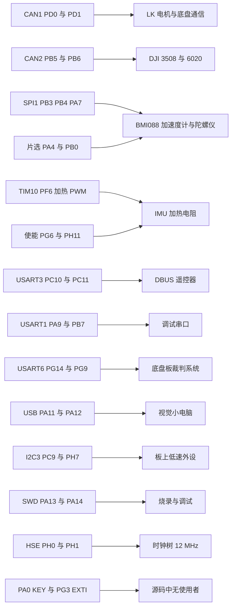
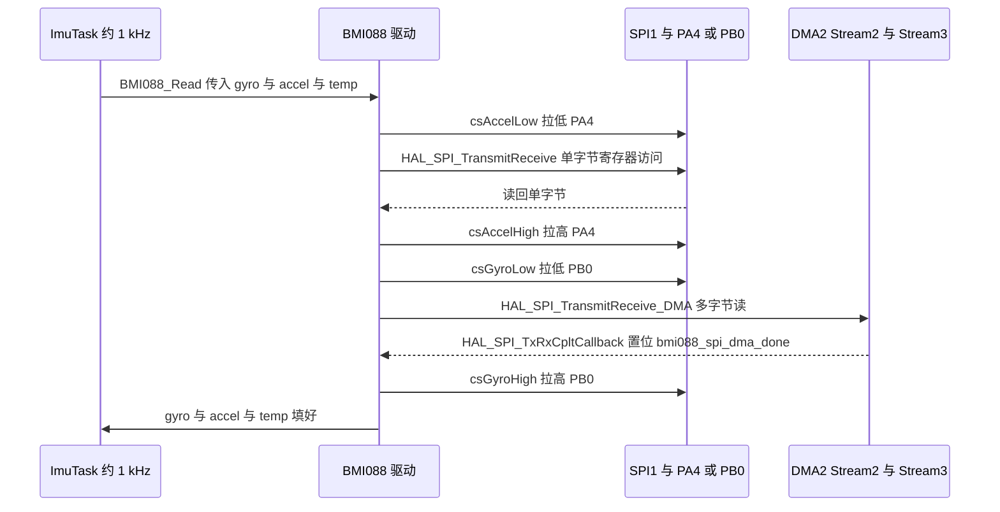

# 本项目引脚分配

引脚分配的事实源是 `.ioc`，运行时的配置结果分散在 `gpio.c` 与五个外设的 MspInit 里。三处描述的是同一批引脚，但表达方式不同：`.ioc` 用编号与信号名，生成代码用寄存器字段，驱动用片选函数名。

把三处配置对齐成一张表，每个引脚归谁使用、在哪一行被配置、两块板差在哪里就都能对上。查引脚时最容易走偏的地方是 `.ioc` 的 `Mcu.PinN` 编号：它只是 CubeMX 的内部顺序，同一功能的引脚编号往往不相邻。

## 源码索引

路径相对固件仓库根目录；云台板 `/home/wyx/rm/2026SentriOmeniGimbal/2026OmniSentryGimbal`，底盘板 `/home/wyx/rm/2026SentriOmeniChassis/2026OmniSentryChassis`。

| 文件 | 作用 |
| --- | --- |
| `2026sentriomeni.ioc` | `Mcu.PinN` 编号与每个引脚的 `Signal` |
| `Core/Src/gpio.c` | 纯 GPIO 与端口时钟 |
| `Core/Src/can.c`、`usart.c`、`spi.c`、`i2c.c`、`tim.c` | 复用引脚的 AF 配置 |
| `USB_DEVICE/Target/usbd_conf.c` | USB 引脚与 OTG FS 时钟 |
| `Core/Src/main.c` | 初始化调用顺序 |
| `BMI088/Src/BMI088.cpp`、`BMI088/Src/ImuTempControl.cpp` | 片选与加热引脚的运行时使用者 |

## .ioc 编号、生成代码与运行时三处怎么对齐

`.ioc` 里的 `Mcu.PinN` 只是编号，表示这个引脚被占用，实际模式由同一文件里的 `引脚名.Signal` 与 `引脚名.Mode` 决定。生成代码时 CubeMX 把纯 GPIO 写进 `gpio.c`，把复用功能按外设拆进各自的 MspInit 函数。运行时的覆盖顺序由 `main.c:110-120` 决定：

```c
MX_GPIO_Init();
MX_DMA_Init();
MX_CAN1_Init();
MX_USART3_UART_Init();
MX_USART6_UART_Init();
MX_CAN2_Init();
MX_SPI1_Init();
MX_I2C3_Init();
MX_TIM10_Init();
MX_USART1_UART_Init();
MX_CRC_Init();
```

同一个引脚若同时出现在 `gpio.c` 与某个 MspInit 里，先执行 `MX_GPIO_Init()`，后执行的外设配置生效。云台板的 `Mcu.PinsNb` 为 33，底盘板为 34，差异只有一个引脚。

## 引脚与外设的对应



## 云台板引脚总表

| `.ioc` 编号 | 引脚 | 信号 | 配置位置 | 使用者 |
| --- | --- | --- | --- | --- |
| Pin8、Pin13 | PD0、PD1 | CAN1_RX、CAN1_TX | `can.c:117-122` | `bsp_can1` 系列函数 |
| Pin0、Pin7 | PB5、PB6 | CAN2_RX、CAN2_TX | `can.c:150-155` | `bsp_can2` 系列函数 |
| Pin10、Pin9 | PC10、PC11 | USART3_TX、USART3_RX | `usart.c:171-176` | DBUS 遥控器，DMA1_Stream1 通道 4 循环模式 |
| Pin15、Pin6 | PA9、PB7 | USART1_TX、USART1_RX | `usart.c:140-152` | 调试串口，115200 波特 |
| Pin1、Pin12 | PG14、PG9 | USART6_TX、USART6_RX | `usart.c:217-222` | 云台板未注册回调，底盘板接裁判系统 |
| Pin3、Pin2、Pin26 | PB3、PB4、PA7 | SPI1_SCK、SPI1_MISO、SPI1_MOSI | `spi.c:83-95` | BMI088，1.3125 MHz |
| Pin24、Pin27 | PA4、PB0 | GPIO_Output | `gpio.c:94-106` | BMI088 加速度计与陀螺仪的片选 |
| Pin20 | PF6 | S_TIM10_CH1 | `tim.c:104-109` | IMU 加热 PWM，33.6 kHz |
| Pin19、Pin22 | PG6、PH11 | GPIO_Output | `gpio.c:68-86` | `ImuTempControl.cpp:12-13` 拉高使能加热 |
| Pin21 | PG3 | GPXTI3 | `gpio.c:75-79` | 源码中无使用者，NVIC 未使能 |
| Pin23 | PA0 | GPXTI0、标签 KEY | `gpio.c:88-92` | 源码中无使用者，NVIC 未使能 |
| Pin14、Pin11 | PA11、PA12 | USB_OTG_FS_DM、DP | `usbd_conf.c:83-88` | 与视觉小电脑的 CDC 虚拟串口 |
| Pin16、Pin25 | PC9、PH7 | I2C3_SDA、I2C3_SCL | `i2c.c:75-87` | 板上低速外设，400 kHz |
| Pin17、Pin18 | PH0、PH1 | RCC_OSC_IN、RCC_OSC_OUT | 时钟树 | HSE 12 MHz 晶振 |
| Pin4、Pin5 | PA14、PA13 | SYS_JTCK-SWCLK、SWDIO | 复位默认的调试端口配置 | 烧录与调试 |
| Pin28 至 Pin32 | 虚拟引脚 | VP_CRC、VP_FREERTOS、VP_SYS、VP_TIM10、VP_USB_DEVICE | 各外设初始化 | 不占物理引脚 |

其中 USART6 在两块板的用法不同：云台板的 `main.c` 只调用 `Uart_Init(&huart3, MyUartCallbackFun)`，`huart6` 的 DMA 与中断都配置好但没有注册接收回调；底盘板额外调用 `Uart_Init(&huart6, RefereeUartCallback)`，把 USART6 用作裁判系统链路。

底盘板与云台板的 `Mcu.PinN` 差异只有一个引脚：底盘板多出 `PA10`，信号为 `USB_OTG_FS_ID`，因此 `PinsNb` 是 34。其余 `Signal` 完全一致。

## 两条串口链路的差异

USART3 与 USART6 都配了 DMA 循环接收，区别在通道与回调：

| 项 | USART3（遥控器） | USART6（云台未用，底盘接裁判系统） |
| --- | --- | --- |
| 接收 DMA | DMA1_Stream1，通道 4 | DMA2_Stream1，通道 5 |
| 发送 DMA | 无 | DMA2_Stream6，通道 5 |
| 外设对齐 | `DMA_PDATAALIGN_BYTE` | `DMA_PDATAALIGN_BYTE` |
| 模式 | `DMA_CIRCULAR` | `DMA_CIRCULAR` |
| 回调注册 | 两块板都注册 `MyUartCallbackFun` | 只有底盘板注册 `RefereeUartCallback` |
| 空闲中断 | 用于按包切分 | 用于按包切分 |

两条链路都采用循环 DMA 加空闲中断的组合：DMA 持续把字节写进缓冲区，空闲中断表示一包结束。云台板的 USART6 在硬件层配置完整，只是没有回调，因此接收到的数据不会被处理。

两条链路还有一个共同点：发送侧的对齐与接收侧一致，都是按字节搬运。DBUS 与裁判系统的帧长都不超过几十字节，按字节搬运足够，不需要改成半字或字对齐。

USART6 多出的发送 DMA 是因为底盘板要主动回帧，而遥控器链路只收不发。

## 一次 BMI088 读取的引脚时序



单字节访问走轮询（`BMI088/Src/BMI088.cpp:263`），多字节读走 DMA（`:295`），完成标志在回调里置位（`:356-361`）。PA4 与 PB0 的配置本身由 `gpio.c` 完成，驱动只操作电平。

## 编号与功能的三个常见误判

把 `Mcu.PinN` 当成分组依据。编号只是 CubeMX 内部顺序，同一功能的引脚编号不相邻，例如 USART6 的 PG14 是 Pin1 而 PG9 是 Pin12。按编号读表会得出错误的分组。

遗漏 MspInit 里的配置。PF6 的复用配置在 `tim.c` 的 `HAL_TIM_MspPostInit()` 里，不在 `gpio.c`。只查 `gpio.c` 会认为 TIM10 没有引脚。

把 USART6 的配置当成已启用。两块板的 `usart.c` 相同，都有 DMA2_Stream1 与 DMA2_Stream6 与 USART6 中断使能，但云台板没有注册回调。看到 DMA 已配置就认为链路可用，会在排查时走偏。

| # | 判断偏差 | 表现 | 依据 |
| --- | --- | --- | --- |
| 1 | 按 `Mcu.PinN` 分组 | 同功能引脚编号不相邻 | USART6 的 Pin1 与 Pin12 |
| 2 | 只查 `gpio.c` | 漏掉 TIM10 的 PF6 | `tim.c:104-109` |
| 3 | 认为两块板引脚表可互换 | 底盘板多一个 PA10 | `PinsNb` 33 与 34 |
| 4 | 认为 USART6 已启用 | 云台板无回调 | `main.c` 只注册 `huart3` |
| 5 | 认为片选名在 `gpio.c` 里 | 注释只写 PA4 与 PB0 | `BMI088.cpp:343-345` |
| 6 | 认为 PA0 与 PG3 的 EXTI 会触发 | NVIC 未使能，也无服务函数 | 工程内无实现 |

## 小结

### 核心概念

- `.ioc` 是引脚分配的事实源，`Mcu.PinN` 只是编号，模式由 `Signal` 与 `Mode` 决定。
- 纯 GPIO 配置在 `Core/Src/gpio.c`，复用功能配置在各外设的 MspInit，定时器通道在 `HAL_TIM_MspPostInit()`。
- 初始化顺序 `MX_GPIO_Init()` 在先，外设 MspInit 在后，同一引脚以后者为准。
- 云台板 33 个引脚，底盘板 34 个，差异是底盘板多一个 PA10 的 USB ID。
- CAN1 用 PD0、PD1，CAN2 用 PB5、PB6，都是 AF9。
- USART3 用 PC10、PC11（DBUS），USART1 用 PA9、PB7（调试），USART6 用 PG14、PG9（底盘接裁判系统）。
- SPI1 用 PB3、PB4、PA7，片选是 PA4 与 PB0；TIM10 通道 1 是 PF6。
- PG3 与 PA0 配了 EXTI 但没有使用者，NVIC 也没有使能对应中断。

### 设计权衡

| 选择 | 本工程取值 | 代价与收益 |
| --- | --- | --- |
| 片选方式 | 软件片选，占用两个 GPIO | 时序完全可控；代价是每个 SPI 从设备多占一根引脚 |
| USART6 | 两块板都生成，只有底盘注册回调 | 共用一套外设代码；代价是云台板的 DMA 与中断空转 |
| 加热使能 | 两根使能引脚加一根 PWM | 可独立控制两路加热元件；代价是配置分散在两个文件 |
| 引脚表来源 | 单一 `.ioc` | 两块板差异可对比；代价是编号顺序与功能无关，需按 `Signal` 读 |
| 串口接收 | 循环 DMA 加空闲中断 | 不丢字节且按包切分；代价是每条链路各占一条 DMA 流 |

## 练习

### 基础题

1. 按 `Signal` 重新分组云台板的 33 个引脚，列出属于 SPI1 与属于 USART3 的引脚编号。
2. 写出 USART3 与 USART6 的 DMA 流与通道号，并说明为什么两条链路都用循环模式。
3. 说明 PH0 与 PH1 在 `gpio.c` 里没有出现的原因。
4. 列出 PA4 与 PB0 在 `gpio.c` 与 `BMI088.cpp` 中各自的角色。

### 挑战题

5. 对比两块板的 `.ioc`，列出引脚分配的全部差异，并说明 USB ID 引脚在 Device_Only 模式下的作用。
6. 云台板把 USART6 用作第三路串口，需要补哪些代码（参考 `Uart_Init()` 的签名与底盘板的调用方式）。
7. 说明在底盘板上把 `RefereeUartCallback` 换成 `MyUartCallbackFun` 的后果。
8. 已知 SPI1 的片选由软件控制。设计一种在同一总线上增加第二个 SPI 从设备的片选方案，并指出需要改动的文件。

## 附：本页引用的固件路径

| 路径 | 用途 |
| --- | --- |
| `/home/wyx/rm/2026SentriOmeniGimbal/2026OmniSentryGimbal/2026sentriomeni.ioc` | `Mcu.PinN` 编号与 `Signal` |
| `/home/wyx/rm/2026SentriOmeniGimbal/2026OmniSentryGimbal/Core/Src/main.c` | 初始化调用顺序（:110-120）与 `Uart_Init` 调用 |
| `/home/wyx/rm/2026SentriOmeniGimbal/2026OmniSentryGimbal/Core/Src/gpio.c` | 输出引脚（:68-86、:94-106）与中断引脚（:75-79、:88-92） |
| `/home/wyx/rm/2026SentriOmeniGimbal/2026OmniSentryGimbal/Core/Src/can.c` | CAN1 与 CAN2 复用（:117-122、:150-155） |
| `/home/wyx/rm/2026SentriOmeniGimbal/2026OmniSentryGimbal/Core/Src/usart.c` | USART1、USART3、USART6 复用（:140-152、:171-176、:217-222）与 DMA |
| `/home/wyx/rm/2026SentriOmeniGimbal/2026OmniSentryGimbal/Core/Src/spi.c` | SPI1 复用（:83-95） |
| `/home/wyx/rm/2026SentriOmeniGimbal/2026OmniSentryGimbal/Core/Src/i2c.c` | I2C3 复用（:75-87） |
| `/home/wyx/rm/2026SentriOmeniGimbal/2026OmniSentryGimbal/Core/Src/tim.c` | TIM10 通道引脚（:104-109） |
| `/home/wyx/rm/2026SentriOmeniGimbal/2026OmniSentryGimbal/USB_DEVICE/Target/usbd_conf.c` | USB 引脚（:83-88） |
| `/home/wyx/rm/2026SentriOmeniGimbal/2026OmniSentryGimbal/BMI088/Src/BMI088.cpp` | 单字节轮询（:263）、DMA 多字节（:295）、完成回调（:356-361）、片选编号（:343-345） |
| `/home/wyx/rm/2026SentriOmeniGimbal/2026OmniSentryGimbal/BMI088/Src/ImuTempControl.cpp` | 加热使能（:12-13） |
