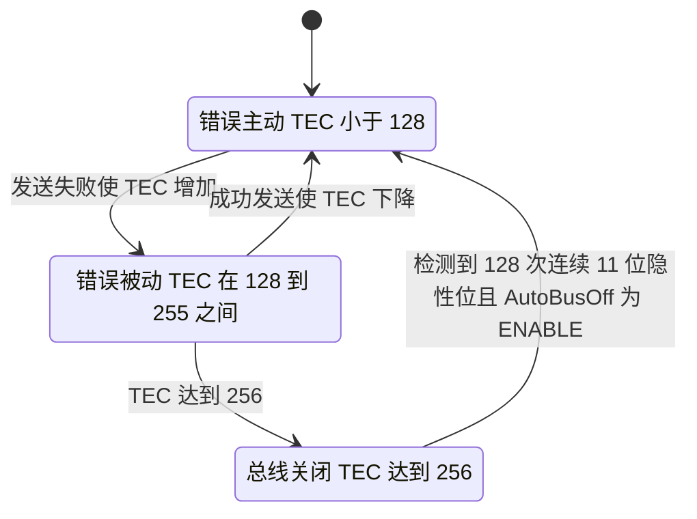
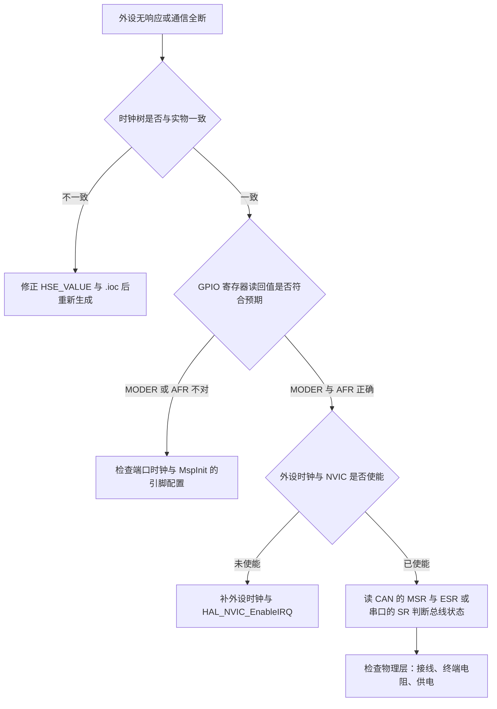

# 易错点与排查

时钟与 GPIO 这条链上的问题分三类：频率类（软件算出的时钟与实际不符）、引脚类（配置了但没生效）、生成类（改动手写代码后被覆盖）。三类的现象常常混在一起，例如 CAN 收不到报文既可能来自波特率算错，也可能来自 PD0、PD1 的复用没生效。本单元给出判据与排查顺序，并用一次真实故障复盘。

> 源码索引（路径相对固件仓库根目录；云台板 `/home/wyx/rm/2026SentriOmeniGimbal/2026OmniSentryGimbal`，底盘板 `/home/wyx/rm/2026SentriOmeniChassis/2026OmniSentryChassis`）

| 文件 | 作用 |
| --- | --- |
| `2026sentriomeni.ioc` | 时钟树与各外设频率的计算结果，含 `CAN1.CalculateBaudRate` |
| `Core/Src/can.c` | 位时序参数与 CAN1 与 CAN2 的 GPIO |
| `Core/Src/gpio.c` | 端口时钟与纯 GPIO |
| `Core/Src/main.c` | 初始化顺序与 `Error_Handler()` |
| `Core/Inc/stm32f4xx_hal_conf.h` | `HSE_VALUE` 与 `HSE_STARTUP_TIMEOUT` |
| `/home/wyx/Work-Summary-and-Diary/工作记录/can通信波特率问题.md` | 故障记录原文 |

## 1. 三类问题的判据

| 类别 | 典型现象 | 直接判据 | 优先检查项 |
| --- | --- | --- | --- |
| 频率类 | 通信全断、计时偏快或偏慢、USB 枚举失败 | `.ioc` 算出的频率、寄存器读回值与实物晶振 | 晶振频率、`HSE_VALUE`、三个预分频字段 |
| 引脚类 | 引脚电平恒定、复用外设无波形 | `GPIOx_MODER` 与 `GPIOx_AFR` 的读回值、端口时钟位 | 端口时钟、MspInit 的引脚配置、配置顺序 |
| 生成类 | 改动在下次生成后消失 | 代码是否位于 USER CODE 区 | `.ioc` 是否为唯一事实源 |

三类的共同点是都不产生编译错误。判断属于哪一类，先看现象是全局的还是单点的：所有外设一起异常先查频率，只有一路外设异常先查引脚。

## 2. 频率类问题的机制

CAN 波特率由 PCLK1 与位时序参数共同决定：

$$Baud = \frac{f_{PCLK1}}{Prescaler \times (1 + BS1 + BS2)}$$

$$f_{PCLK1} = \frac{f_{SYSCLK}}{HPRE \times PPRE1}$$

把第二式代入第一式可以看出，波特率对 SYSCLK 是线性的：晶振频率、PLL 参数、AHB 与 APB1 分频中的任何一项改变，都会按同一比例改变波特率。位时序参数不变而 PCLK1 改变，等价于波特率改变；此时 CAN 控制器照常发送，总线上却没有节点能应答。

应答缺失会把控制器推进错误状态，状态迁移由发送错误计数（Transmit Error Counter, TEC）驱动：

本工程把 `AutoBusOff` 配成 `ENABLE`（`Core/Src/can.c:48` 与 `:80`），总线关闭后控制器会自动恢复，不需要软件干预。这一点让故障现象表现为持续重试而不是永久停摆。

排查顺序按代价从低到高排：

## 3. 落到本项目：一次 CAN 通信故障的复盘

工作记录 `/home/wyx/Work-Summary-and-Diary/工作记录/can通信波特率问题.md` 记载的故障与排查过程如下。

现象与寄存器读回值：

| 项目 | 记录内容 |
| --- | --- |
| 现象 | 底盘 CAN1 与 CAN2 都收不到报文，进入不了接收回调 |
| 发送返回值 | 第一次 `HAL_CAN_AddTxMessage()` 返回 `HAL_OK`，之后持续返回 `HAL_ERROR` |
| `hcan2.ErrorCode` | `0x00200000`，记录标注为 `HAL_CAN_ERROR_NOT_STARTED`；本仓库头文件里这一位是 `HAL_CAN_ERROR_PARAM` |
| `MSR` | `0x0C08`，错误中断挂起位 ERRI 置位 |
| `TSR` | `0x82000004`，发送邮箱被占用 |
| 记录给出的计算 | Prescaler 2、BS1 15TQ、BS2 5TQ 时算得 857142 Hz |

记录把根因定为时钟树配置被改动，导致 APB1 频率与 CAN 位时序参数不匹配，修正 `.ioc` 后重新生成代码恢复。代码层面的初始化、过滤器、中断与回调在故障期间都正确，只检查它们不会得到结论。

记录对错误码的标注与源码有一处出入。`0x00200000` 在本仓库的 HAL 里对应 `HAL_CAN_ERROR_PARAM`（`Drivers/STM32F4xx_HAL_Driver/Inc/stm32f4xx_hal_can.h:314`），`HAL_CAN_ERROR_NOT_STARTED` 是 `0x00100000`（同文件第 313 行）。`HAL_CAN_AddTxMessage()` 在三个发送邮箱全满时置 `HAL_CAN_ERROR_PARAM` 并返回 `HAL_ERROR`（`Drivers/STM32F4xx_HAL_Driver/Src/stm32f4xx_hal_can.c:1327-1332`），判据是 `TSR` 的 `TME0` 至 `TME2` 三位（同文件第 1277 至 1279 行）。记录里的 `TSR` 读数是 `0x82000004`，这三位（bit26 至 bit28）都是 0，三个邮箱都没有空位，与该分支吻合。`HAL_CAN_ERROR_NOT_STARTED` 由 `HAL_CAN_Stop()` 在状态不符时置位（同文件第 1128 行），与本次现象无关。

复核这一步计算：857142 Hz 与 21 个时间份额、Prescaler 2 对应

$$f_{PCLK1} = 857142 \times 2 \times 21 = 36\ \text{MHz}$$

本工程当前的 PCLK1 是 42 MHz（`2026sentriomeni.ioc:364` 的 `RCC.APB1Freq_Value=42000000`），因此故障期间的 APB1 分频或 PLL 参数与现在不同。36 MHz 对应 SYSCLK 144 MHz 配 APB1 分频 4，属于另一套时钟树。

当前配置的正确性可以用 `.ioc` 自身的计算值交叉核对：`:9` 的 `CAN1.CalculateBaudRate=1000000`、`:11` 的 `CAN1.CalculateTimeQuantum=47.61904761904762` 与 `Core/Src/can.c:42-46` 的 Prescaler 2、BS1 15TQ、BS2 5TQ 一致，42 MHz 除以 2 得 47.619 ns，21 个时间份额组成 1000 ns 的位时间。

## 4. 易错点

（1）只看代码不看寄存器。故障期间 CAN 的初始化、过滤器、中断激活、回调与发送函数全部正确，逐行读代码得不到结论。`hcan->ErrorCode`、`MSR`、`TSR`、`ESR` 与 `BTR` 是外设当前状态的直接来源，应当先读它们再读代码。

（2）只测第一次发送的返回值。CAN 控制器在首次发送时会先把报文放进邮箱，此时返回 `HAL_OK`；报文发不出去、ACK 缺失之后才进入错误状态并持续返回 `HAL_ERROR`。记录里正是这个差异把方向从软件引向了总线与时钟。

（3）用编译通过当作配置正确。`HAL_GPIO_Init()` 与 `HAL_RCC_ClockConfig()` 的参数都是编译期常量，写错值也能通过编译。时钟与引脚类的错误全部属于这一类。

（4）改生成代码而不改 `.ioc`。CubeMX 只保留 USER CODE 区内的内容，手改 `SystemClock_Config()` 或 CubeMX 生成的引脚配置在下次生成时被覆盖，故障会在下一次改动后重新出现。

（5）忽略物理层。总线没有终端电阻、接线接反、共地缺失都会产生与波特率错误一致的现象。排查顺序里把物理层放在最后，是因为修改它的成本最高，但它必须在结论成立前被排除。

（6）把 `.ioc` 与生成代码当成两个事实源。两处不一致时以 `.ioc` 为准并重新生成；直接改生成代码会让差异长期存在。

## 5. 小结

### 核心概念

- 三类问题：频率类改变所有外设的时序，引脚类只影响一路，生成类的特征是改动会消失。
- 频率类不产生编译错误，判据是 `.ioc` 的计算值、寄存器读回值与实物晶振三者是否一致。
- CAN 波特率 `Baud = f_{PCLK1} / (Prescaler \times (1 + BS1 + BS2))`，对 SYSCLK 线性，位时序参数不变时 PCLK1 改变等于波特率改变。
- ACK 缺失会推动控制器进入错误被动与总线关闭状态；本工程 `AutoBusOff` 为 `ENABLE`，总线关闭后可自动恢复。
- 记录中的 857142 Hz 反推 PCLK1 为 36 MHz，与本工程当前的 42 MHz 不同，说明故障期间的时钟树是另一套参数。
- 记录里的 `hcan2.ErrorCode = 0x00200000` 在本仓库 HAL 里是 `HAL_CAN_ERROR_PARAM`，对应发送邮箱全满；记录标注的 `NOT_STARTED` 是另一个位 `0x00100000`。
- 当前配置的正确性由 `.ioc` 的 `CalculateBaudRate=1000000` 与 `CalculateTimeQuantum=47.619 ns` 交叉验证。
- 排查顺序：时钟树一致性、GPIO 寄存器读回值、外设时钟与 NVIC、总线状态寄存器、物理层。

### 设计权衡

| 排查手段 | 使用时机 | 代价与收益 |
| --- | --- | --- |
| 读 `.ioc` 计算值 | 第一步 | 零成本，只能验证软件侧的意图，不能验证硬件 |
| 读外设寄存器 | 软件侧无异常时 | 直接反映外设状态；代价是需要调试器与芯片手册 |
| 逐行读初始化代码 | 怀疑配置遗漏时 | 覆盖 `HAL_GPIO_Init()` 这类无返回值的调用；代价是慢 |
| 示波器测总线 | 排除寄存器问题后 | 唯一能直接观察到物理层的手段；代价是需要仪器与接线 |
| 对比测试首次与后续发送 | 怀疑总线应答时 | 区分邮箱写入成功与总线发送成功；代价是结论依赖对控制器的理解 |
| 检查物理层 | 最后 | 成本最高；但不排除它则前面的结论都不成立 |

## 6. 练习

基础题

1. 已知位时间为 21 个时间份额、采样点在 16/21。写出 PCLK1 为 42 MHz、Prescaler 为 2 时的波特率与单个时间份额的纳秒数。
2. 说明 `HAL_CAN_ERROR_NOT_STARTED` 与 `HAL_CAN_ERROR_ACK` 分别对应什么状态。
3. 列出读回 `GPIOx_MODER` 可以判断出的两种引脚配置错误。

挑战题

4. 记录中 857142 Hz 反推的 PCLK1 是 36 MHz。给出两套能产生 36 MHz PCLK1 的 SYSCLK 与 APB1 分频组合，并说明各自对应的 PLL 参数。
5. 设计一个上电自检流程：在 `main()` 里 `osKernelStart()` 之前检查时钟、CAN 位时序与关键引脚配置，并把结果以最少的代码量暴露出来。
6. 说明 `AutoBusOff = ENABLE` 与 `DISABLE` 在故障现象上的差异，并判断哪种配置更适合调试阶段。
7. 把 `HSE_VALUE` 从 12000000 改成 8000000 而硬件晶振仍是 12 MHz，预测 SYSCLK、TIM2 的 1 ms 与 CAN 波特率的变化，并说明为什么 USB 会先失败。
