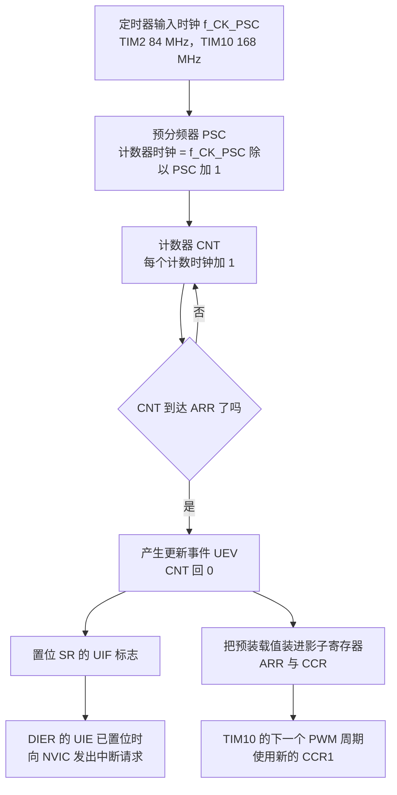
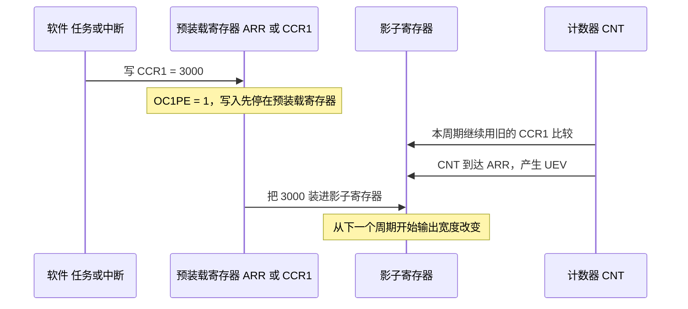
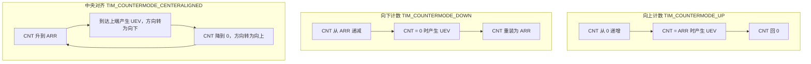

# 定时器结构与计数模式

云台板固件（`/home/wyx/rm/2026SentriOmeniGimbal/2026OmniSentryGimbal`）与底盘板固件（`/home/wyx/rm/2026SentriOmeniChassis/2026OmniSentryChassis`）各用到两个定时器实例：TIM2 为 HAL 提供 1 ms 时基，TIM10 为 BMI088 的加热电阻输出 PWM。两块板的 `Core/Src/tim.c` 与 `Core/Src/stm32f4xx_hal_timebase_tim.c` 逐字节相同，差别只来自时钟树给出的输入频率。

> 源码索引（本单元引用的固件路径都相对于固件仓库根目录，两块板路径一致）

| 路径 | 作用 |
| --- | --- |
| `Core/Src/tim.c` | TIM10 的初始化与 GPIO 复用配置 |
| `Core/Src/stm32f4xx_hal_timebase_tim.c` | 用 TIM2 实现 `HAL_InitTick()` |
| `Core/Src/main.c` | `SystemClock_Config()` 与 `HAL_TIM_PeriodElapsedCallback()` |
| `Core/Src/stm32f4xx_it.c` | `TIM2_IRQHandler()` 与 `TIM1_UP_TIM10_IRQHandler()` |
| `BMI088/Src/ImuTempControl.cpp` | PWM 通道的启动与比较值更新 |
| `2026sentriomeni.ioc` | 时钟树与 TIM10 参数的源头 |

## 1. 定时器分档与本工程用到的两个

STM32F407 的定时器按功能分三档：高级定时器 TIM1 与 TIM8（带互补输出、死区、刹车输入），通用定时器 TIM2 至 TIM5 与 TIM9 至 TIM14，基本定时器 TIM6 与 TIM7。功能越多的档位占用越多寄存器和中断向量。

本工程只用到两个通用定时器：

| 实例 | 总线 | 计数器位宽 | 定时器输入时钟 | 本工程用途 | 配置位置 |
| --- | --- | --- | --- | --- | --- |
| TIM2 | APB1 | 32 位 | 84 MHz | HAL 时基，1 ms 一次更新中断 | `stm32f4xx_hal_timebase_tim.c` |
| TIM10 | APB2 | 16 位 | 168 MHz | 通道 1 输出 PWM，驱动加热电阻 | `tim.c` |

两个数值来自 `2026sentriomeni.ioc` 的 `RCC.APB1TimFreq_Value=84000000` 与 `RCC.APB2TimFreq_Value=168000000`，第 5 节给出推导。TIM2 本工程连通道都没用，只开了更新中断；TIM10 只配置了通道 1。

## 2. 时基单元：PSC、CNT、ARR

时基单元（time base unit）由三个寄存器构成：

- **预分频器**（Prescaler, PSC）把定时器输入时钟 $f_{CK\_PSC}$ 分频成计数器时钟 $f_{CK\_CNT}$，分频系数是 $PSC+1$，写 0 表示 1 分频；
- 计数器（Counter, CNT）每个计数器时钟加 1，位宽决定计数上限；
- **自动重装寄存器**（Auto-Reload Register, ARR）是 CNT 的终点，CNT 从 0 数到 ARR 时产生一次更新事件，然后回到 0 重新开始。

$$f_{CK\_CNT}=\frac{f_{CK\_PSC}}{PSC+1}$$

$$f_{UEV}=\frac{f_{CK\_PSC}}{(PSC+1)(ARR+1)}$$

代入本工程的两组数字：

| 实例 | $f_{CK\_PSC}$ | PSC | $f_{CK\_CNT}$ | ARR | 更新事件周期 |
| --- | --- | --- | --- | --- | --- |
| TIM2 | 84 MHz | 83 | 1 MHz | 999 | 1 ms |
| TIM10 | 168 MHz | 0 | 168 MHz | 4999 | $29.76\ \mu s$ |

TIM2 的分频值是 `stm32f4xx_hal_timebase_tim.c` 的 `uwPrescalerValue = (uwTimclock / 1000000U) - 1U = 83`，重装值是同文件 81 行的 `(1000000U / 1000U) - 1U = 999`。计数器时钟 1 MHz，每 1000 个计数一次更新事件，即 1 kHz。TIM10 是 `tim.c` 的 `Prescaler = 0`、`Period = 4999`，计数器时钟 168 MHz，每 5000 个计数一个周期：

$$f_{TIM10}=\frac{168\times10^6}{(0+1)(4999+1)}=33.6\ \text{kHz}$$

两个式子里都出现 `+1`，原因是 PSC 与 ARR 的复位值都是 0：写 0 表示 1 分频、写 0 表示周期为 1 个计数。上电默认状态 PSC=0、ARR=0 时，计数器每来一个时钟就产生一次更新事件，所以初始化代码必须显式写这两个字段。



## 3. 更新事件与影子寄存器

时基单元的同步点是**更新事件**（Update Event, UEV），一次 UEV 同时做四件事：CNT 回到起点；若 `CR1.ARPE = 1` 就把 ARR 的预装载值装进影子寄存器；若 `CCMR1.OC1PE = 1` 就把 CCR1 的预装载值装进影子寄存器；置位 `SR` 的 `UIF`，并在 `DIER.UIE` 已置位时向 NVIC 发中断请求。

CNT 实际比较的对象是**影子寄存器**（shadow register）。软件写入的是预装载寄存器，硬件比较用的是影子寄存器，两者之间是否隔一次 UEV 由预装载开关决定：

| 寄存器 | 预装载开关 | 本工程取值 | 写入后何时生效 |
| --- | --- | --- | --- |
| ARR | `CR1.ARPE` | DISABLE（`tim.c`、`stm32f4xx_hal_timebase_tim.c`） | 立即 |
| PSC | 无开关，始终缓冲 | 83 与 0 | 下一次 UEV |
| CCR1 | `CCMR1.OC1PE` | ENABLE（`stm32f4xx_hal_tim.c` 强制置位） | 下一次 UEV |

PSC 没有预装载开关这一项，写入的新值总是在下一次 UEV 生效。HAL 在配置 PWM 通道 1 时无条件置位 `CCMR1.OC1PE`（`Drivers/STM32F4xx_HAL_Driver/Src/stm32f4xx_hal_tim.c`），所以本工程对 CCR1 的每次写入都滞后一个 UEV。

初始化路径也依赖这一点。`TIM_Base_SetConfig()` 先写 `ARR` 和 `PSC`，再置位 `CR1.URS` 并通过 `EGR.UG` 产生一次更新事件，把参数装入影子寄存器（`stm32f4xx_hal_tim.c`）。`URS = 1` 让这次更新只装载参数而不置 `UIF`，所以初始化过程不会触发中断。



具体到本工程：`ImuTempControl::update()` 在 1 kHz 的 IMU 任务里写比较值（`BMI088/Src/ImuTempControl.cpp`），TIM10 的 UEV 是 33.6 kHz，比任务周期快约 33 倍，一次写入最多等 29.76 µs 生效。如果 PWM 频率只有几百赫兹，写入滞后就会和任务周期同一量级。

## 4. 计数模式

计数器有三种计数方向，区别在于 UEV 在哪个位置产生：

| 模式 | CNT 轨迹 | UEV 位置 | 一个完整周期 |
| --- | --- | --- | --- |
| 向上计数 | 0 递增到 ARR | CNT = ARR | $ARR+1$ 个计数时钟 |
| 向下计数 | ARR 递减到 0 | CNT = 0 | $ARR+1$ 个计数时钟 |
| 中央对齐（center-aligned） | 0 升到 ARR 再降回 1 | 到达两端时各产生一次 | $2\times ARR$ 个计数时钟 |

中央对齐时一个周期是往返一趟，计数时钟相同时输出频率约为边沿对齐的一半：

$$f_{UEV,center}=\frac{f_{CK\_PSC}}{(PSC+1)\cdot 2\cdot ARR}$$

换模式时要注意 ARR 的算法也跟着变：边沿对齐的周期是 $ARR+1$，中央对齐的周期是 $2\times ARR$，同一个 ARR 值算出的频率差一倍。



本工程两个定时器都写的是 `TIM_COUNTERMODE_UP`（`tim.c`、`stm32f4xx_hal_timebase_tim.c`），因此后面几章的所有公式都按边沿对齐的 $ARR+1$ 计算。计数方向由 `CR1.DIR` 与 `CR1.CMS` 决定，HAL 在 `TIM_Base_SetConfig()` 里按 `CounterMode` 字段写入（`stm32f4xx_hal_tim.c`）。

## 5. 落到两个定时器的实际配置

### 5.1 TIM2：HAL 时基

`stm32f4xx_hal_timebase_tim.c` 覆盖了 HAL 库里的弱定义 `HAL_InitTick()`，整个函数分三段：

```c
/* Enable TIM2 clock */
__HAL_RCC_TIM2_CLK_ENABLE();

/* Get APB1 prescaler */
uwAPB1Prescaler = clkconfig.APB1CLKDivider;
if (uwAPB1Prescaler == RCC_HCLK_DIV1) {
  uwTimclock = HAL_RCC_GetPCLK1Freq();
} else {
  uwTimclock = 2UL * HAL_RCC_GetPCLK1Freq();   /* APB1 = 42 MHz 时得到 84 MHz */
}

uwPrescalerValue = (uint32_t) ((uwTimclock / 1000000U) - 1U);   /* = 83 */
htim2.Init.Period = (1000000U / 1000U) - 1U;                    /* = 999 */
```

这段代码对应源文件 `stm32f4xx_hal_timebase_tim.c`。定时器的输入时钟不是总线时钟本身：APB 预分频系数不为 1 时，定时器时钟是 $2\times PCLK$，所以 APB1 上的 42 MHz 变成 84 MHz。这个 `2` 倍规则是 F4 的硬件行为，第 3 章会给出本项目所有时间资源的完整分配。

### 5.2 TIM10：PWM 输出

`MX_TIM10_Init()` 的时基部分只有两行有效参数（`tim.c`）：

```c
htim10.Instance = TIM10;
htim10.Init.Prescaler = 0;
htim10.Init.CounterMode = TIM_COUNTERMODE_UP;
htim10.Init.Period = 4999;
htim10.Init.ClockDivision = TIM_CLOCKDIVISION_DIV1;
htim10.Init.AutoReloadPreload = TIM_AUTORELOAD_PRELOAD_DISABLE;
```

`ClockDivision` 只影响数字滤波器的采样时钟，不参与分频，改它不会改变 PWM 频率。定时器输入时钟是 APB2 定时器时钟 168 MHz，PSC=0、ARR=4999，输出频率 33.6 kHz，占空比分辨率为 $1/5000 = 0.02\%$。

## 6. 易错点

（1）`+1` 漏掉。`PSC` 与 `ARR` 都是从 0 开始计数，分频系数是 $PSC+1$、周期是 $ARR+1$。按 `ARR = f/(PSC+1)/f_{PWM}` 直接除会把频率算高一档。

（2）把 PSC 当成立即生效。运行时改 `PSC` 要等下一个 UEV 才起作用，改 `ARR` 在 `ARPE = 0` 时立即起作用。写 `ARR` 的瞬间若 CNT 已经超过新值，计数器要等溢出才归零，本周期会异常拉长。

（3）16 位与 32 位计数器的量程差别。TIM10 的 ARR 最大 65535，在 168 MHz 下最长定时 $65536/168\times10^6 = 390\ \mu s$；TIM2 是 32 位，在 1 MHz 计数时钟下最长 $2^{32}/10^6 \approx 4295\ s$。需要长周期时只能选 32 位实例或再加一级软件计数。

（4）中央对齐的频率公式。换到中央对齐时周期是 $2\times ARR$，沿用边沿对齐的 $ARR+1$ 会让实际频率差一倍。

## 7. 小结

### 核心概念

- 时基单元的三个寄存器是 PSC、CNT、ARR，更新事件频率 $f_{UEV}=f_{CK\_PSC}/((PSC+1)(ARR+1))$。
- 定时器输入时钟不等于总线时钟：APB 预分频不为 1 时定时器时钟是 $2\times PCLK$。本工程 TIM2 得到 84 MHz，TIM10 得到 168 MHz。
- UEV 是装载点和中断源：它装载 ARR 与 CCR 的影子寄存器，并置位 `UIF`。
- 预装载开关决定写入何时生效：`ARPE` 关时 ARR 立即生效，`OC1PE` 开时 CCR 在下一个 UEV 生效，PSC 永远缓冲。
- HAL 配置 PWM 通道时强制打开 `OC1PE`，所以 PWM 比较值的更新天然滞后一个周期。
- 本工程两个定时器都是向上计数，PSC 与 ARR 分别是 83/999 与 0/4999。

### 设计权衡

| 选择 | 本工程怎么选 | 代价与收益 |
| --- | --- | --- |
| 时基实例 | TIM2（32 位通用定时器） | 占用一个 32 位定时器与一个中断向量，换来独立的 1 ms 时基 |
| 预分频值 | 1 MHz 计数时钟 | 计数器时钟不整除 HCLK，靠 `2\times PCLK1` 规则得到整数 |
| PWM 分辨率 | $PSC=0$、$ARR=4999$ | 分辨率 0.02%，代价是频率固定在 33.6 kHz，想降频就要增大 PSC 并牺牲分辨率 |
| ARR 预装载 | DISABLE | 初始化简单，代价是运行时改频率可能产生一个异常周期 |
| CCR 预装载 | ENABLE（HAL 默认） | 占空比更新不会产生毛刺，代价是滞后一个 PWM 周期 |

## 8. 练习

基础题

1. TIM10 的 PSC 与 ARR 都不改，把 `PSC` 改成 1，计算新的 PWM 频率与周期，并说明占空比分辨率变成多少。
2. TIM2 的 `Period` 从 999 改成 1999，说明 `HAL_IncTick()` 的调用频率变成多少，以及 `HAL_GetTick()` 返回值的时间单位变成什么。
3. 写出 TIM10 在 168 MHz 输入、PSC=0、ARR=65535 时的输出频率，并判断这个配置能否继续当作加热 PWM 使用。

挑战题

4. 用 `DWT_GetMicroseconds()` 测量 TIM10 的实际 PWM 周期，设计一个不需要示波器的验证方案（提示：连续两次读 `CNT` 并配合已知的计数器时钟）。
5. `ImuTempControl::update()` 每秒写 1000 次 CCR1，TIM10 每秒产生 33600 次 UEV。说明哪些写入会被后一次覆盖，以及这种覆盖对控制精度的影响。
6. 把 TIM10 换成中央对齐模式并保持 33.6 kHz，计算需要的 ARR 值；再说明中央对齐相比边沿对齐在这种加热应用里是否有收益。
