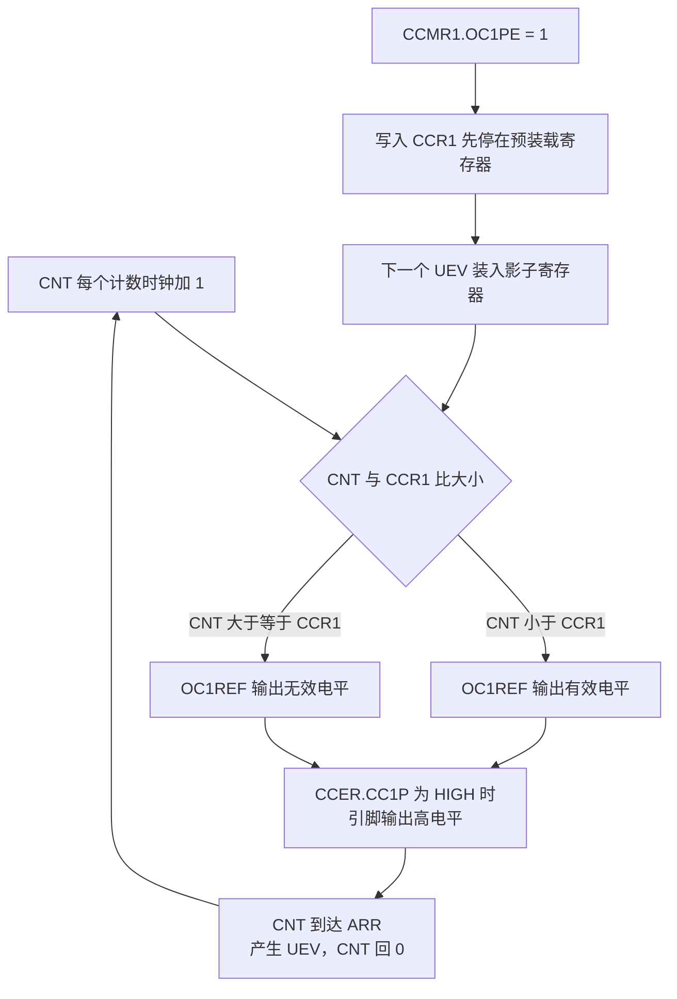
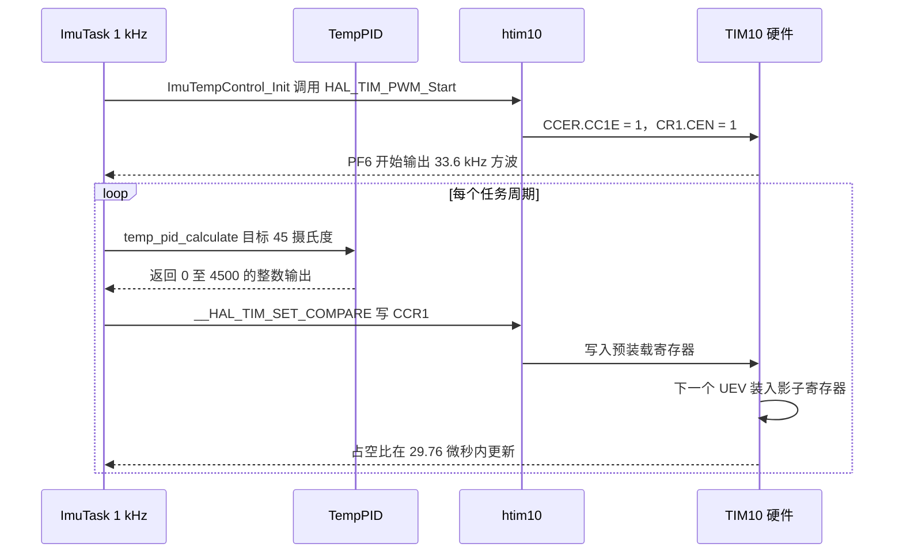

# PWM 原理与配置

本工程只有一路 PWM：TIM10 的通道 1，从 PF6 输出，驱动 BMI088 的加热电阻（`Core/Src/tim.c:100-109`）。这一路信号的频率固定为 33.6 kHz，占空比由 1 kHz 的 IMU 任务按温度环输出更新（`BMI088/Src/ImuTempControl.cpp:15-23`）。

> 源码索引

| 路径 | 作用 |
| --- | --- |
| `Core/Src/tim.c` | `MX_TIM10_Init()`，通道 1 的 PWM1 配置与 PF6 复用 |
| `Core/Inc/tim.h` | `htim10` 与 `MX_TIM10_Init()` 的声明 |
| `BMI088/Src/ImuTempControl.cpp` | `HAL_TIM_PWM_Start()` 与 `__HAL_TIM_SET_COMPARE()` |
| `BMI088/Inc/ImuTempControl.h` | 温控类的接口 |
| `Task/Src/ImuTask.cpp` | 1 kHz 循环里调用 `ImuTempControl_Update()` |
| `Drivers/STM32F4xx_HAL_Driver/Src/stm32f4xx_hal_tim.c` | HAL 的 PWM 配置与启动实现 |

## 1. PWM 的输出逻辑

脉冲宽度调制（Pulse Width Modulation, PWM）用固定周期、可变高电平时间方波表达一个连续量。定时器用 CNT 与 CCR 的比较结果直接驱动引脚，不占用 CPU：

| 模式 | 输出为高的条件（向上计数） | 适用 |
| --- | --- | --- |
| PWM1 | $CNT < CCR$ | 本工程 TIM10 通道 1 |
| PWM2 | $CNT \ge CCR$ | 需要反相输出时 |

引脚上的最终极性还受 `CCER.CCxP` 影响：`OCPolarity = HIGH` 时 PWM1 的高电平就是引脚的高电平，写 LOW 则整体反相。本工程是 `TIM_OCPOLARITY_HIGH`（`tim.c:58`）。



## 2. 频率与占空比

边沿对齐、向上计数时的两个基本公式：

$$f_{PWM}=\frac{f_{CK\_PSC}}{(PSC+1)(ARR+1)}$$

$$D=\frac{CCR}{ARR+1}$$

周期固定后，$CCR$ 从 0 到 $ARR+1$ 的每一个整数值对应一档占空比，所以占空比分辨率为 $1/(ARR+1)$，一个计数时钟对应的时间是 $1/f_{CK\_CNT}$。

代入本工程 TIM10 的三组数字：

| 参数 | 值 | 含义 |
| --- | --- | --- |
| $f_{CK\_PSC}$ | 168 MHz | APB2 定时器时钟 |
| PSC | 0 | 1 分频，计数器时钟 168 MHz |
| ARR | 4999 | 一个周期 5000 个计数 |
| 周期 | 29.76 µs | $5000/168\times10^6$ |
| 频率 | 33.6 kHz | 加热电路的开关频率 |
| 占空比分辨率 | 0.02% | 一个计数时钟 5.952 ns |
| 比较值 | 0 至 4999 | 0 为恒低，5000 及以上为恒高 |

中央对齐模式下一个完整周期包含往返两趟，同样的计数时钟下频率约为边沿对齐的一半：

$$f_{PWM,center}=\frac{f_{CK\_PSC}}{(PSC+1)\cdot 2\cdot ARR}$$

中央对齐的 UEV 在 CNT 到达两端时各产生一次，CCR 的预装载值也随之装两次，所以同一个比较值在上下行两个半周期里都会被使用。

## 3. HAL 的配置链路

从 CubeMX 生成的代码到引脚出波形，一共四步，顺序不能颠倒：

| 步骤 | 调用 | 做的事 |
| --- | --- | --- |
| 1 | `HAL_TIM_Base_Init(&htim10)`（`tim.c:48`） | 调用 `TIM_Base_SetConfig()` 写 PSC、ARR、计数方向与预装载开关 |
| 2 | `HAL_TIM_PWM_Init(&htim10)`（`tim.c:52`） | 内部再次调用 `TIM_Base_SetConfig()`，并把四个通道状态置为 READY |
| 3 | `HAL_TIM_PWM_ConfigChannel()`（`tim.c:60`） | 写 `CCMR1` 的 OC1M、OC1PE、OC1FE 与 `CCER` 的极性 |
| 4 | `HAL_TIM_MspPostInit()`（`tim.c:67`） | 配置 PF6 为复用推挽输出，`GPIO_AF3_TIM10` |

第 4 步放在最后，是因为引脚复用配置要等通道参数齐备后再改。`HAL_TIM_PWM_ConfigChannel()` 对通道 1 无条件置位 `CCMR1.OC1PE`（`stm32f4xx_hal_tim.c:4245`），这一点与 `.ioc` 里的 `TIM10.OC1Preload_PWM=ENABLE` 一致。

让引脚出波形的是运行期的 `HAL_TIM_PWM_Start()`：

```c
/* Enable the Capture compare channel */
TIM_CCxChannelCmd(htim->Instance, Channel, TIM_CCx_ENABLE);   /* CCER.CC1E = 1 */

if (IS_TIM_BREAK_INSTANCE(htim->Instance) != RESET) {
  __HAL_TIM_MOE_ENABLE(htim);                                 /* 仅高级定时器有 MOE */
}
__HAL_TIM_ENABLE(htim);                                       /* CR1.CEN = 1 */
```

这段对应 `stm32f4xx_hal_tim.c:1470-1491`。TIM10 不是带刹车输入的实例，所以 `MOE` 那一步被跳过。启动前 `TIM_CHANNEL_STATE_GET()` 必须是 READY，否则 `HAL_TIM_PWM_Start()` 直接返回 `HAL_ERROR`（同文件 1462-1468 行），重复启动同一个通道不会报错但也不会起作用。

本工程的启动点只有一个，在 IMU 任务的开头（`BMI088/Src/ImuTempControl.cpp:15`）：

```cpp
void ImuTempControl::init() {
    HAL_GPIO_WritePin(GPIOG, GPIO_PIN_6, GPIO_PIN_SET);   // 拉高 PG6 尝试使能
    HAL_GPIO_WritePin(GPIOH, GPIO_PIN_11, GPIO_PIN_SET);  // 拉高 PH11 尝试使能
    HAL_TIM_PWM_Start(htim_, channel_);
}
```

调用链是 `ImuTask::run()` → `ImuTempControl_Init()`（`Task/Src/ImuTask.cpp:36`），早于温控更新循环。



## 4. 比较值的写入

CCR 的写入在 HAL 里是一个宏，直接写寄存器，没有函数调用开销（`Drivers/STM32F4xx_HAL_Driver/Inc/stm32f4xx_hal_tim.h:1394-1398`）：

```c
#define __HAL_TIM_SET_COMPARE(__HANDLE__, __CHANNEL__, __COMPARE__) \
  (((__CHANNEL__) == TIM_CHANNEL_1) ? ((__HANDLE__)->Instance->CCR1 = (__COMPARE__)) : \
   ((__CHANNEL__) == TIM_CHANNEL_2) ? ((__HANDLE__)->Instance->CCR2 = (__COMPARE__)) : \
   ((__CHANNEL__) == TIM_CHANNEL_3) ? ((__HANDLE__)->Instance->CCR3 = (__COMPARE__)) : \
   ((__HANDLE__)->Instance->CCR4 = (__COMPARE__)))
```

本工程的调用点（`BMI088/Src/ImuTempControl.cpp:18-24`）：

```cpp
void ImuTempControl::update(float targetTemp, float currentTemp, float dt) {
    uint32_t duty = temp_pid_calculate(targetTemp, currentTemp, dt);
    auto compare = static_cast<uint32_t>(htim_->Init.Period * duty);
    __HAL_TIM_SET_COMPARE(htim_, channel_, compare);
}
```

`htim_->Init.Period` 是 4999，`duty` 是 `temp_pid_calculate()` 的返回值。该函数声明为 `int16_t`（`PID/Inc/temp_pid.h:29`），输出被限幅在 0 到 4500（`PID/Src/temp_pid.cpp:41` 的 `TempPID(1600.0f, 0.2f, 0.0f, 4500.0f, 4400.0f)`，其中第四个参数是输出限幅）。于是 `compare` 的取值范围是 0 或 4999 到 22 495 500 之间的值：

| `duty` | `compare = 4999 × duty` | 相对 ARR = 4999 的占空比 |
| --- | --- | --- |
| 0 | 0 | 0% |
| 1 | 4999 | 100% |
| 20 | 99 980 | 100% |
| 4500 | 22 495 500 | 100% |

比较值的满量程应当是 `ARR+1 = 5000`，而这里的换算用的是 `Period` 本身，也没有除以 PID 的满量程。结果是只要温度环输出非零，写进去的比较值就已经达到或超过 ARR，引脚输出恒定为高电平，加热电路按通断方式工作。这一处在第 5 章与温控环一起分析。

## 5. 易错点

（1）`CCR = 0` 与 `CCR \ge ARR+1` 是两个边界。PWM1 下 CCR 为 0 时输出恒低，CCR 大于 ARR 时输出恒高，两者都不再是调制波形。写比较值前要先确认量纲。

（2）PWM1 与 PWM2 弄反。两者占空比互补，写反了表现为加热电流始终满值或者始终为零，而寄存器读回来都是"合法值"，不容易从寄存器上看出来。

（3）启动顺序。`CCER.CC1E` 与 `CR1.CEN` 未置位时，即使 CCR 写得正确，引脚也没有波形；反过来，先写 CCR 再启动不会丢失参数，因为预装载寄存器一直保留这个值。

（4）改 ARR 等于同时改频率和占空比。CCR 不变时改变 ARR 会让占空比跟着变，所以调 PWM 时应当先确定周期再调占空比。

（5）把 `ClockDivision` 当成额外的分频器。`CR1.CKD` 只影响滤波采样，不改变计数器时钟，改它不会改变输出频率。

## 6. 小结

### 核心概念

- PWM1 模式下输出为高的条件是 $CNT < CCR$，PWM2 相反；引脚极性由 `CCER.CCxP` 决定。
- 边沿对齐频率 $f_{PWM}=f_{CK\_PSC}/((PSC+1)(ARR+1))$，占空比 $D=CCR/(ARR+1)$，分辨率 $1/(ARR+1)$。
- 中央对齐的周期是 $2\times ARR$ 个计数时钟，频率约为边沿对齐的一半。
- HAL 的配置顺序是 Base_Init、PWM_Init、PWM_ConfigChannel、MspPostInit，运行期再由 `HAL_TIM_PWM_Start()` 置位 `CC1E` 与 `CEN`。
- `HAL_TIM_PWM_ConfigChannel()` 强制打开 `OC1PE`，所以 CCR 的写入在下一个 UEV 生效。
- 本工程的比较值没有除以满量程，输出非零时占空比即为 100%，加热实际是通断控制。

### 设计权衡

| 选择 | 本工程怎么选 | 代价与收益 |
| --- | --- | --- |
| 输出模式 | PWM1 加高电平有效 | 逻辑直观，改极性需要同时改硬件接法 |
| 频率 | 33.6 kHz | 高于音频范围且开关损耗可控，代价是分辨率只有 0.02% |
| 通道数 | 只用通道 1 | 引脚与代码都最少，代价是以后要加第二路加热只能换实例 |
| 启动时机 | 在 IMU 任务开头启动一次 | 初始化集中在任务里，代价是启动前若调用 `update()` 只改寄存器不出波形 |
| 比较值换算 | `Period × duty` | 代码短，代价是量纲不匹配导致占空比饱和 |

## 7. 练习

基础题

1. TIM10 保持 168 MHz 输入，要输出 1 kHz 的 PWM 且占空比分辨不低于 0.1%，给出一组 PSC 与 ARR。
2. 写出 `ARR = 4999`、`CCR = 1250` 时的占空比与高电平时间。
3. 说明 `OCPolarity` 从 HIGH 改成 LOW 后，同一组寄存器值下 PF6 的波形如何变化。

挑战题

4. `ImuTempControl::update()` 里的 `compare` 换算改成 `(htim_->Init.Period + 1) * duty / 4500`，说明这样能覆盖的占空比范围，以及 4500 这个常数从哪里来。
5. 用 `DWT_GetMicroseconds()` 测量 PF6 高电平宽度需要外部接线或示波器；在不改硬件的前提下，设计一个只用寄存器读回值间接判断占空比的方案（提示：读 `CCR1` 与 `CNT`）。
6. 把 TIM10 的 `Prescaler` 从 0 改成 167，保持 `ARR = 4999`，计算新的频率；再说明这种改法对 PF6 上加热电路的开关损耗有什么影响。
