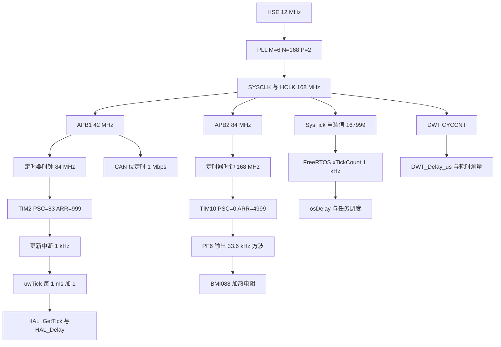
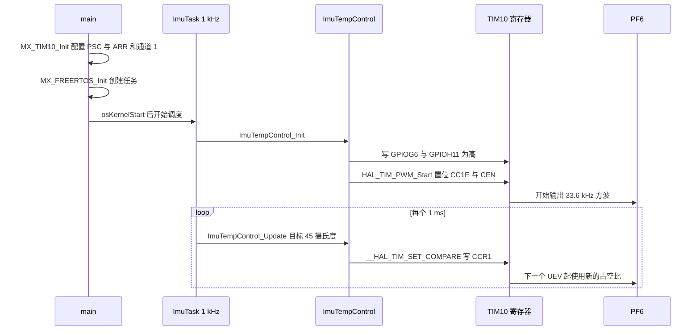
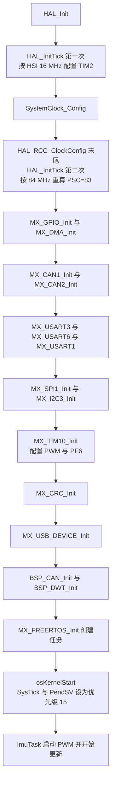

# 本项目定时器分配

两块板的时间来源一共四类：FreeRTOS 占用 SysTick 产生调度节拍，TIM2 给 HAL 提供 1 ms 时基，TIM10 输出加热 PWM，DWT 的 `CYCCNT` 提供周期级计时。除此之外的时间量都由外设自己分频得到，例如 USART 的 `USARTDIV` 与 CAN 的位定时寄存器，它们不占用定时器实例。

> 源码索引

| 路径 | 作用 |
| --- | --- |
| `Core/Src/main.c` | `SystemClock_Config()` 与外设初始化顺序 |
| `Core/Src/tim.c` | TIM10 的完整配置与 PF6 复用 |
| `Core/Src/stm32f4xx_hal_timebase_tim.c` | TIM2 的完整配置 |
| `Core/Src/stm32f4xx_it.c` | 两个定时器的中断入口 |
| `BSP/Src/bsp_dwt.cpp` | `CYCCNT` 的启动与延时实现 |
| `Task/Src/ImuTask.cpp` | 温控 PWM 的启动与更新调用点 |
| `BMI088/Src/ImuTempControl.cpp` | PWM 通道的封装 |
| `2026sentriomeni.ioc` | 时钟树、NVIC 与 TIM10 参数的源头 |

## 1. 时间资源全景

时钟树先在 `SystemClock_Config()` 里定下来（`Core/Src/main.c:153-192`）：HSE 12 MHz 经 `PLLM=6`、`PLLN=168`、`PLLP=DIV2` 得到 168 MHz 的 SYSCLK，`AHBCLKDivider = DIV1`、`APB1CLKDivider = DIV4`、`APB2CLKDivider = DIV2`，于是 HCLK 168 MHz、PCLK1 42 MHz、PCLK2 84 MHz。APB 预分频不为 1 时定时器时钟是 $2\times PCLK$，所以 TIM2 看到 84 MHz、TIM10 看到 168 MHz。

| 时间来源 | 时钟 | 配置 | 周期 | 本工程用途 |
| --- | --- | --- | --- | --- |
| SysTick | HCLK 168 MHz | 重装值 167999，优先级 15 | 1 ms | FreeRTOS 的 `xTickCount`，`osDelay` 与调度 |
| TIM2 | APB1 定时器时钟 84 MHz | PSC=83、ARR=999，优先级 15 | 1 ms | `uwTick`，`HAL_GetTick()` 与 `HAL_Delay()` |
| TIM10 | APB2 定时器时钟 168 MHz | PSC=0、ARR=4999，通道 1 | 29.76 µs | PF6 输出 PWM，驱动加热电阻 |
| DWT `CYCCNT` | HCLK 168 MHz | 使能 `DEMCR.TRCENA` 与 `DWT.CTRL.CYCCNTENA` | 5.952 ns | `DWT_Delay_us()` 与耗时测量 |

SysTick 的重装值来自 FreeRTOS 移植层 `port.c:695` 的 `configSYSTICK_CLOCK_HZ / configTICK_RATE_HZ - 1`，其中 `configSYSTICK_CLOCK_HZ` 未定义时默认等于 `configCPU_CLOCK_HZ`，即 `SystemCoreClock = 168 MHz`。DWT 由 `BSP_DWT_Init()` 启动（`BSP/Src/bsp_dwt.cpp:7-22`），在主函数里于 `BSP_CAN_Init()` 之后调用（`Core/Src/main.c:123-124`）。



## 2. TIM2：给 HAL 用的时基

TIM2 没有出现在 `main()` 的 `MX_xxx_Init()` 调用列表里，它的初始化在 `HAL_InitTick()` 内部完成（`Core/Src/stm32f4xx_hal_timebase_tim.c:41-112`）：

| 项目 | 值 | 位置 |
| --- | --- | --- |
| 时钟使能 | `__HAL_RCC_TIM2_CLK_ENABLE()` | 第 52 行 |
| 预分频 | 83（1 MHz 计数时钟） | 第 70、82 行 |
| 重装值 | 999 | 第 81 行 |
| 计数方向 | `TIM_COUNTERMODE_UP` | 第 84 行 |
| ARR 预装载 | `TIM_AUTORELOAD_PRELOAD_DISABLE` | 第 85 行 |
| 启动方式 | `HAL_TIM_Base_Start_IT()` | 第 91 行 |
| 中断优先级 | `TickPriority`，本工程为 15 | 第 100 行 |

TIM2 没有 MSP 回调。`Core/Src/tim.c:71-89` 的 `HAL_TIM_Base_MspInit()` 只判断 TIM10，TIM2 的时钟与 NVIC 由 timebase 文件自己处理。这是 CubeMX 把时基源选成 TIM2 时的固定结构，改动时不要往 `tim.c` 里搬。

TIM2 用到的 NVIC 资源只有一个：`TIM2_IRQn`，优先级 15，与 PendSV、SysTick 同档。`Core/Src/stm32f4xx_it.c:233-242` 的 `TIM2_IRQHandler()` 把中断交给 `HAL_TIM_IRQHandler(&htim2)`，第 4 章展开这条链路。

## 3. TIM10：加热 PWM

TIM10 的占用情况：

| 项目 | 值 | 位置 |
| --- | --- | --- |
| 时钟使能 | `__HAL_RCC_TIM10_CLK_ENABLE()`（APB2） | `tim.c:80` |
| 引脚 | PF6，`GPIO_AF3_TIM10`，推挽输出 | `tim.c:100-109` |
| 通道 | `TIM_CHANNEL_1` | `tim.c:60` |
| 通道模式 | `TIM_OCMODE_PWM1` | `tim.c:56` |
| 初始比较值 | `Pulse = 0` | `tim.c:57` |
| NVIC | `TIM1_UP_TIM10_IRQn`，优先级 5，已使能 | `tim.c:83-84` |

NVIC 里使能了 `TIM1_UP_TIM10_IRQn`，但工程代码没有打开 TIM10 的更新中断：`MX_TIM10_Init()` 只调用 `HAL_TIM_Base_Init()`、`HAL_TIM_PWM_Init()` 与 `HAL_TIM_PWM_ConfigChannel()`，没有调用 `HAL_TIM_Base_Start_IT()`，所以 `DIER.UIE` 一直为 0，`TIM1_UP_TIM10_IRQHandler()` 不会被触发。它在 `Core/Src/stm32f4xx_it.c:219-228` 里是个只调用 `HAL_TIM_IRQHandler(&htim10)` 的空壳，读代码时不要因为存在这个函数就认为 TIM10 有中断。

PWM 的调用链跨三个文件，全部集中在 1 kHz 的 IMU 任务里：

```cpp
void StartImuTask::run() {
    BMI088_Init();
    ImuTempControl_Init();          // 内部 HAL_TIM_PWM_Start(&htim10, TIM_CHANNEL_1)
    DWT_Delay_ms(1000);
    for (;;) {
        BMI088_Read(gyro, accel, &temp);
        ImuTempControl_Update(45, temp, 0.001f);
        ahrs.update(...);
    }
}
```

云台板对应 `Task/Src/ImuTask.cpp:36` 与第 47 行，底盘板对应 `Task/Src/ImuTask.cpp:35` 与第 56 行。底盘板的 1 kHz 循环里插入了功率控制与裁判系统相关的调用，所以两个行号相差 9 行，逻辑相同。



## 4. 初始化顺序

`main()` 里的初始化顺序（`Core/Src/main.c:95-134`）对定时器有直接影响：TIM2 在 `HAL_Init()` 与 `SystemClock_Config()` 内部配置两次，TIM10 在 `MX_TIM10_Init()` 配置一次，DWT 在 `BSP_DWT_Init()` 启动，最后 `osKernelStart()` 才开始调度。



TIM10 排在 `MX_I2C3_Init()` 之后、`MX_USART1_UART_Init()` 之前，与 `.ioc` 里 `ProjectManager.functionlistsort` 的顺序一致。这个顺序只影响 `MX_TIM10_Init()` 内部对 GPIOF 时钟的使能时机，不影响 PWM 参数。

## 5. 其余外设为什么不需要定时器

| 外设 | 时间量从哪里来 | 是否占定时器 |
| --- | --- | --- |
| USART3 / USART6 / USART1 | `USARTDIV` 由 PCLK 分频得到波特率 | 否 |
| CAN1 / CAN2 | `BTR` 的 Prescaler 与 BS1/BS2 由 APB1 时钟分频 | 否 |
| SPI1 | 由分频系数从 PCLK 得到，本身是同步总线 | 否 |
| USB OTG FS | 需要 48 MHz 时钟，由 PLLQ=7 分出 | 否 |
| DMA | 由外设的请求信号驱动，没有自己的时钟 | 否 |
| FreeRTOS | 借用 Cortex-M4 内核的 SysTick | 否 |
| 软件延迟 | `DWT.CYCCNT` 或 `osDelay()` | 否 |

这也是两块板只配了两个定时器的原因：只要不需要硬件产生波形或独立的更新中断，就不必占定时器实例。

## 6. 易错点

（1）把 TIM2 当通用定时器用。TIM2 已经被 HAL 时基占用，再加一路 PWM 或中断会与 `HAL_IncTick()` 抢同一个更新中断标志。

（2）以为 TIM10 有中断。NVIC 里使能了 `TIM1_UP_TIM10_IRQn`，但 `DIER.UIE` 未置位，中断永远不会进；要使用它需要显式调用 `HAL_TIM_Base_Start_IT()`。

（3）漏掉时基文件的第二次配置。`HAL_InitTick()` 会被调用两次，把 TIM2 的初始化搬出 `HAL_InitTick()` 就会丢掉按 168 MHz 重算的那一次。

（4）两块板的差异被忽略。`tim.c` 与 `stm32f4xx_hal_timebase_tim.c` 完全相同，但 `Task/Src/ImuTask.cpp` 与 `Core/Src/main.c` 有差异，跨板核对代码时要按文件比对。

（5）DWT 与定时器的混用。`DWT_Delay_us()` 是忙等，不依赖任何中断；`osDelay()` 依赖 SysTick；`HAL_Delay()` 依赖 TIM2。三者混用时要清楚各自在什么条件下会失准。

## 7. 小结

### 核心概念

- 两块板一共四类时间来源：SysTick（调度节拍）、TIM2（HAL 时基）、TIM10（加热 PWM）、DWT `CYCCNT`（周期级计时）。
- 定时器时钟是 $2\times PCLK$：TIM2 得到 84 MHz，TIM10 得到 168 MHz。
- TIM2 的初始化在 `HAL_InitTick()` 里，不在 `MX_xxx_Init()` 里，因此 `tim.c` 里看不到 TIM2。
- TIM10 只用到通道 1，配置为 PWM1、高电平有效，引脚是 PF6 的 AF3。
- `TIM1_UP_TIM10_IRQn` 已使能但没有中断源，TIM10 目前不产生任何中断。
- `CYCCNT` 由 `BSP_DWT_Init()` 打开，`DWT_Delay_us()` 是忙等，不依赖中断与 tick。

### 设计权衡

| 选择 | 本工程怎么选 | 代价与收益 |
| --- | --- | --- |
| HAL 时基源 | 独立 TIM2 | 占一个定时器与一个中断向量，换来与内核 tick 完全解耦 |
| 加热 PWM 实例 | TIM10 通道 1 | 引脚与代码最少，代价是频率与分辨率被绑死 |
| 采样延时 | DWT 忙等 1 s | 初始化阶段不依赖调度器，代价是这段时间 CPU 空转 |
| 调试计时 | `CYCCNT` | 168 MHz 分辨率，代价是 25.57 s 回绕一次且代码未处理 |
| 其余外设计时 | 外设自身分频 | 不占定时器，代价是改变时钟树会同时影响所有波特率 |

## 8. 练习

基础题

1. 统计两块板一共占用了几个定时器实例、几个定时器相关的中断向量，并列出其中实际会被触发的。
2. 说明 `Main.c` 里 `MX_TIM10_Init()` 的位置往前挪到 `MX_I2C3_Init()` 之前会产生什么差别。
3. `DWT_GetMicroseconds()` 的返回值在板子连续运行 30 s 后会怎样，说明原因。

挑战题

4. 现在要加第二路 PWM 加热通道，频率同为 33.6 kHz，给出两种方案（同实例另一通道 / 另一个实例），并各写一句代价。
5. 把 TIM2 换成 TIM3 做时基，列出需要改动的文件与 `.ioc` 项，并说明漏改哪一项会导致编译通过但功能异常。
6. `BSP_DWT_Init()` 返回 1 表示 CYCCNT 没有变化。说明可能的原因，以及此时 `DWT_Delay_us()` 的行为。
