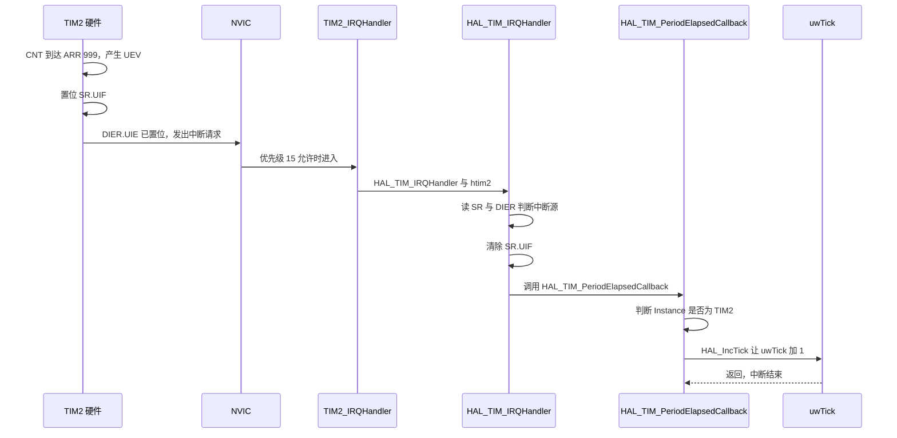
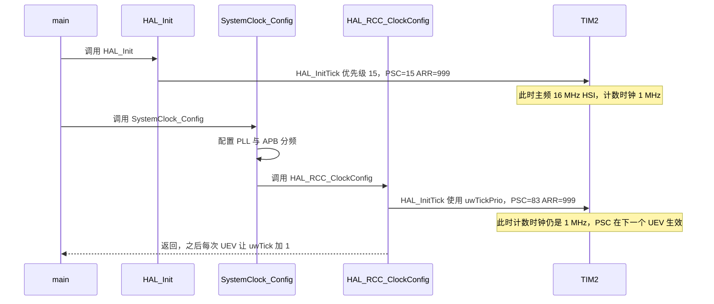
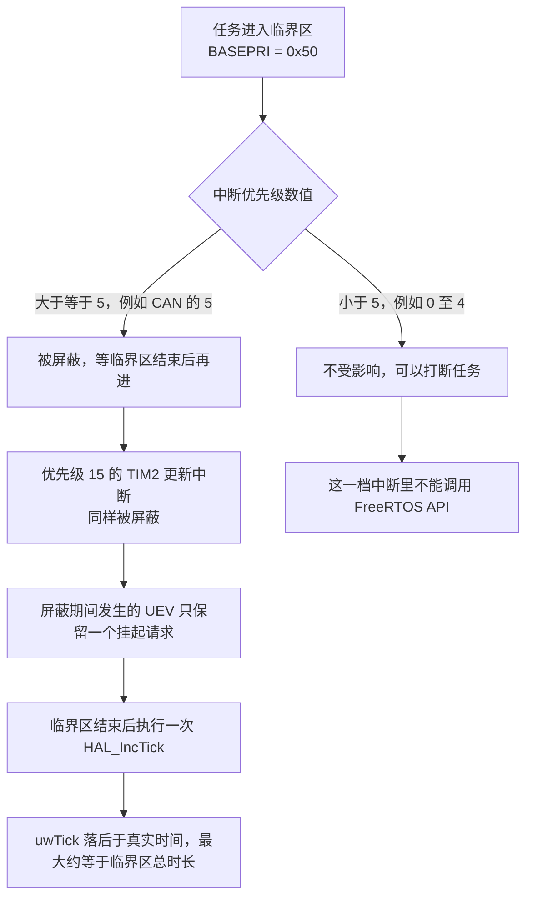

# 定时器中断与 HAL 时基

HAL 库的软件时基只有一个 32 位变量 `uwTick`，它由定时器的更新中断累加。本工程把这件事交给 TIM2，于是 Cortex-M4 内核的 SysTick 可以完全留给 FreeRTOS。这一章讲清两条链路：TIM2 中断如何一步步把 `uwTick` 加一，以及任务里的代码应该用哪一套时间。

> 源码索引

| 路径 | 作用 |
| --- | --- |
| `Core/Src/stm32f4xx_hal_timebase_tim.c` | 覆盖 `HAL_InitTick()`，用 TIM2 做时基 |
| `Core/Src/main.c` | `HAL_TIM_PeriodElapsedCallback()` 里调用 `HAL_IncTick()` |
| `Core/Src/stm32f4xx_it.c` | `TIM2_IRQHandler()` |
| `Core/Inc/stm32f4xx_hal_conf.h` | `TICK_INT_PRIORITY = 15` |
| `Core/Inc/FreeRTOSConfig.h` | `configTICK_RATE_HZ`、中断优先级阈值、句柄映射 |
| `Drivers/STM32F4xx_HAL_Driver/Src/stm32f4xx_hal.c` | `uwTick` 与 `HAL_IncTick()`、`HAL_GetTick()`、`HAL_Delay()` |
| `Middlewares/Third_Party/FreeRTOS/Source/portable/GCC/ARM_CM4F/port.c` | SysTick 重装值与内核中断优先级 |

## 1. HAL 时基的四个角色

| 名称 | 类型 | 含义 | 位置 |
| --- | --- | --- | --- |
| `uwTick` | `uint32_t` | 从启动累计的毫秒数 | `stm32f4xx_hal.c` |
| `uwTickFreq` | 枚举 | 每次中断给 `uwTick` 加多少，默认 1 kHz 档 | `stm32f4xx_hal.c` |
| `uwTickPrio` | `uint32_t` | 时基中断的优先级，供时钟重配时复用 | `stm32f4xx_hal.c` |
| `HAL_InitTick()` | `__weak` 函数 | 配置时基中断，本工程被覆盖 | `stm32f4xx_hal_timebase_tim.c` |

三个对外接口都很短。`HAL_IncTick()` 只做加法，`HAL_GetTick()` 只读变量：

```c
__weak void HAL_IncTick(void)
{
  uwTick += uwTickFreq;
}

__weak uint32_t HAL_GetTick(void)
{
  return uwTick;
}
```

`HAL_Delay()` 是忙等，它反复读 `HAL_GetTick()` 直到差值达到目标，等待期间不让出 CPU（`stm32f4xx_hal.c`）：

```c
__weak void HAL_Delay(uint32_t Delay)
{
  uint32_t tickstart = HAL_GetTick();
  uint32_t wait = Delay;
  if (wait < HAL_MAX_DELAY) {
    wait += (uint32_t)(uwTickFreq);
  }
  while ((HAL_GetTick() - tickstart) < wait) { }
}
```

HAL 库里默认的 `HAL_InitTick()` 用 SysTick 实现（`stm32f4xx_hal.c`），本工程用同名的非 weak 实现覆盖了它，所以默认版本不参与编译。

## 2. TIM2 更新中断的链路

一次 `uwTick` 的累加要经过四层调用：

| 层 | 代码 | 位置 |
| --- | --- | --- |
| 硬件 | CNT 计到 ARR，置位 `SR.UIF`，`DIER.UIE` 已置位则发中断请求 | TIM2 寄存器 |
| 向量 | `void TIM2_IRQHandler(void)` | `Core/Src/stm32f4xx_it.c` |
| HAL | `HAL_TIM_IRQHandler(&htim2)` 判标志、清标志、回调 | `stm32f4xx_hal_tim.c` |
| 应用 | `HAL_TIM_PeriodElapsedCallback()` 里按实例判断后调用 `HAL_IncTick()` | `Core/Src/main.c` |

应用层的回调是唯一与工程相关的一层：

```c
void HAL_TIM_PeriodElapsedCallback(TIM_HandleTypeDef *htim)
{
  if (htim->Instance == TIM2)
  {
    HAL_IncTick();
  }
}
```

这里的实例判断不能省。同一个回调是所有定时器更新中断的公共出口，TIM10 的基时中断一旦被谁打开，也会走到这个函数；只按实例名加 `HAL_IncTick()` 才能保证 `uwTick` 的累加速度不受影响。



清标志的动作在 HAL 层（`stm32f4xx_hal_tim.c` 的 `__HAL_TIM_CLEAR_FLAG(htim, TIM_FLAG_UPDATE)`），应用回调里不需要再清，重复清会掩盖漏中断的问题。

## 3. HAL_InitTick 的两次调用

`HAL_Init()` 与时钟重配都会调用 `HAL_InitTick()`，本工程因此配置过两次 TIM2：

| 次 | 触发点 | 当时的主频与总线 | 算出的 PSC | 说明 |
| --- | --- | --- | --- | --- |
| 第一次 | `HAL_Init()`（`stm32f4xx_hal.c`） | HSI 16 MHz，APB1 分频为 1 | $16/1-1=15$ | 与当时的时钟自洽 |
| 第二次 | `HAL_RCC_ClockConfig()` 末尾（`stm32f4xx_hal_rcc.c`） | PLL 168 MHz，APB1 为 42 MHz | $84/1-1=83$ | 最终生效的配置 |

第二次调用传进去的优先级是变量 `uwTickPrio`（第一次设置的 15），不是宏 `TICK_INT_PRIORITY`。两次配置之间 TIM2 一直在跑，重写 `PSC` 要等下一次 UEV 才生效，所以中间不会出现频率突跳的瞬间。



## 4. 为什么不用 SysTick

SysTick 属于 Cortex-M4 内核，HAL 与 FreeRTOS 都能用它，但两者需要的中断处理完全不同：HAL 要的是 `uwTick` 累加，FreeRTOS 要的是 `xTaskIncrementTick()` 加可能的上下文切换。同一个异常向量只能有一个处理函数。

FreeRTOS 的移植层用宏把内核句柄映射到 CMSIS 标准名（`Core/Inc/FreeRTOSConfig.h`）：

```c
#define vPortSVCHandler    SVC_Handler
#define xPortPendSVHandler PendSV_Handler
#define xPortSysTickHandler SysTick_Handler
```

这三行让 `SysTick_Handler` 执行的是 FreeRTOS 的 `xPortSysTickHandler()`。如果 HAL 的时基也放在 SysTick，`uwTick` 就没有人累加，`HAL_Delay()` 会永远等下去。把时基换成 TIM2 之后，两套节拍各走各的中断：

| 时间基 | 产生者 | 维护的变量 | 谁在用 | 中断优先级 |
| --- | --- | --- | --- | --- |
| 内核节拍 | SysTick | `xTickCount` | `osDelay()`、超时、时间片 | 15 |
| HAL 节拍 | TIM2 | `uwTick` | `HAL_GetTick()`、`HAL_Delay()` | 15 |

两个数值都是 1 ms 一格，但它们彼此独立，不会自动对齐。把 `uwTick` 的差值当作任务周期来算，得到的永远是近似值。

## 5. 中断优先级与临界区的关系

本工程的优先级配置可以分成三档：

| 对象 | 优先级数值 | 依据 |
| --- | --- | --- |
| 外设中断（CAN、DMA、USART、USB、TIM1_UP_TIM10） | 5 | `can.c`、`dma.c`、`usart.c`、`tim.c` 等 |
| TIM2 时基中断 | 15 | `stm32f4xx_hal_conf.h` 的 `TICK_INT_PRIORITY = 15` |
| PendSV 与 SysTick | 15 | `stm32f4xx_hal_msp.c`、`port.c` |

优先级分组是 `NVIC_PRIORITYGROUP_4`（`stm32f4xx_hal.c`），4 位全给抢占优先级，没有子优先级，所以 5 与 15 之间不存在同级别比较的问题。

FreeRTOS 的临界区把 `BASEPRI` 写成 `configMAX_SYSCALL_INTERRUPT_PRIORITY`，即 `5 << 4 = 0x50`（`FreeRTOSConfig.h、117`）。`BASEPRI` 屏蔽的是优先级数值大于等于 5 的中断，所以 5 到 15 全部被挡在外面，其中也包括优先级 15 的 TIM2 与 SysTick。



由此得到两条使用规则：

1. `HAL_TIM_PeriodElapsedCallback()` 里只做累加，不调用任何 FreeRTOS API。优先级 15 的中断禁止使用 `...FromISR()` 系列，否则会触发 `configASSERT`。
2. 临界区越长，`uwTick` 落后越多。因为挂起的中断只会执行一次，屏蔽期间发生 n 次 UEV，最终只累加 1 次，误差上界是临界区时长乘以 1 kHz。

## 6. 任务里的时间怎么用

两块板对 `HAL_GetTick()` 的使用分两类，都是读时间戳而不是等待：

| 位置 | 用法 | 说明 |
| --- | --- | --- |
| `Task/Src/FireTask.cpp` | 记录 `motor_1_last_ok_time`、`angle_reach_start_time` 等变量，用差值判断超时 | 状态机的时间判据 |
| `Task/Src/ControlCenterTask.cpp` | 自瞄模式计时 4000 ms，以及按 `HAL_GetTick()` 生成正弦测试目标 | 演示与调试逻辑 |
| `Task/Src/UsbConnectTask.cpp` | 记录 `last_receive_time` | 判断视觉小电脑是否掉线 |
| `BMI088/Src/BMI088.cpp` | 初始化里等待 SPI 数据的超时 | 调用时调度器尚未运行 |

这些写法都安全，因为 `uwTick` 由优先级 15 的中断维护，读它不需要关中断，也不会与调度冲突。要避免的是在任务里用 `HAL_Delay()`：它是忙等，等待期间任务一直占着 CPU，且不会让出给同优先级任务。

本工程实际的 `HAL_Delay()` 调用点只有两处，都不在任务的循环里：

- `USB_DEVICE/Target/usbd_conf.c` 的 `USBD_LL_Delay()` 内部调用 `HAL_Delay()`，但这个函数目前没有任何调用点，`USB_DEVICE/Target/usbd_conf.h` 的 `USBD_Delay` 宏也没有被使用；
- 底盘板 `Core/Src/main.c` 的 `HAL_Delay(50)`，位置在 `osKernelStart()` 之前，属于合法的忙等。

云台板 `Core/Src/main.c` 没有这一行，两个 `main.c` 在 USB 初始化与裁判系统上还有别的差异。

## 7. 32 位毫秒计数的回绕

`uwTick` 是 32 位，1 ms 一格，$2^{32}$ 毫秒约 49.71 天回绕一次。判断超时的正确写法是减法：

```c
if ((HAL_GetTick() - start_time) > ANGLE_REACH_TIMEOUT)
```

无符号减法在回绕处仍然正确。反过来写成 `HAL_GetTick() > start_time + TIMEOUT` 会在回绕附近出错，这一点在 `Task/Src/FireTask.cpp` 这类判据里已经被写成了差值形式。

## 8. 易错点

（1）在 `HAL_TIM_PeriodElapsedCallback()` 里调用 `osSignalSet()` 之类的 FreeRTOS API。优先级 15 的中断优先级数值大于 5，属于"不能调用内核 API"的一档。

（2）把 `uwTick` 当调度节拍。它由 TIM2 维护，与 `xTickCount` 相互独立，长时间运行会累积不同的误差。

（3）在任务里用 `HAL_Delay()`。虽然 `uwTick` 会被 TIM2 继续累加，延时不会死锁，但等待期间不让出 CPU，等于把任务变成忙等。

（4）以为 `HAL_InitTick()` 只调用一次。第二次由 `HAL_RCC_ClockConfig()` 触发，删掉或被覆盖会留下按 HSI 算出的旧分频。

（5）改 `TICK_INT_PRIORITY` 时只看 HAL。这个宏同时决定 TIM2 中断的优先级，改成小于 5 的值会让时基中断绕过 FreeRTOS 的临界区保护，改动前要先确认 `configLIBRARY_MAX_SYSCALL_INTERRUPT_PRIORITY`。

## 9. 小结

### 核心概念

- `uwTick` 由 TIM2 更新中断累加，累加动作在 `HAL_TIM_PeriodElapsedCallback()` 里按 `Instance == TIM2` 判断后调用 `HAL_IncTick()`。
- `HAL_InitTick()` 被调用两次，最终生效的是 `HAL_RCC_ClockConfig()` 末尾按 168 MHz 主频算出的 PSC=83。
- 用 TIM2 而非 SysTick 的原因只有一条：`SysTick_Handler` 已经被 FreeRTOS 的移植层占用，两者不能共用一个向量。
- `uwTick` 与 `xTickCount` 都是 1 ms 一格，但彼此独立，不能互相替代。
- 优先级 5 是外设中断与 FreeRTOS API 的阈值，优先级 15 是时基与内核中断的档位；`BASEPRI = 0x50` 会把 5 到 15 全部屏蔽，屏蔽期间丢失的节拍无法补回。
- `uwTick` 是 32 位毫秒计数，约 49.71 天回绕，判断超时用减法。

### 设计权衡

| 选择 | 本工程怎么选 | 代价与收益 |
| --- | --- | --- |
| 时基中断源 | TIM2 更新中断 | 多占一个定时器与中断向量，换来两套节拍完全解耦 |
| 时基中断优先级 | 15 | 与内核中断同档，改动简单；代价是临界区会推迟它 |
| 回调内的工作量 | 只调用 `HAL_IncTick()` | 中断极短，代价是任何需要周期执行的任务逻辑都得另找出口 |
| 任务里的等待 | `osDelay()` | 会让出 CPU，代价是 1 tick 的量化误差 |
| 时间戳来源 | `HAL_GetTick()` | 读一个变量，无锁无中断，代价是与调度节拍不同源 |

## 10. 练习

基础题

1. 计算 `configTICK_RATE_HZ` 改成 500 后 SysTick 的重装值，并说明 `uwTick` 的累加速度是否跟着变。
2. 说明把 `TICK_INT_PRIORITY` 从 15 改成 5 之后，TIM2 中断与 FreeRTOS 临界区的相对关系。
3. `HAL_GetTick()` 与 `osKernelGetTickCount()` 在系统运行 10 分钟后为什么不相等，给出两个可能的原因。

挑战题

4. 一个临界区持续 2 ms。计算这段时间内 `uwTick` 最多落后多少，并说明 `osDelay(10)` 的唤醒时刻是否也受影响。
5. `HAL_TIM_PeriodElapsedCallback()` 里加入一段 50 µs 的处理代码。评估它对 1 kHz 时基与 PWM 输出的影响（提示：考虑 TIM10 的 UEV 与中断优先级）。
6. 设计一个只用 `HAL_GetTick()` 与 `DWT_GetMicroseconds()` 的比较实验，用来测量 `uwTick` 相对真实时间的累计误差，并说明实验中需要避免哪些干扰。
