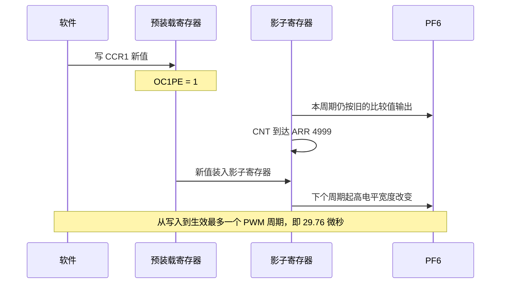
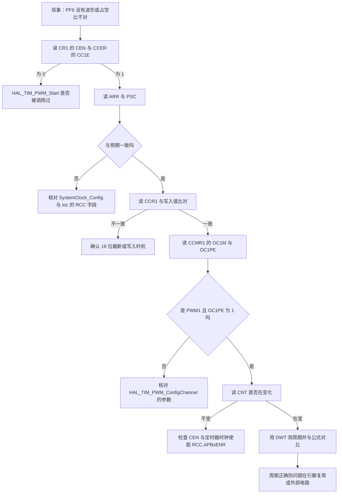
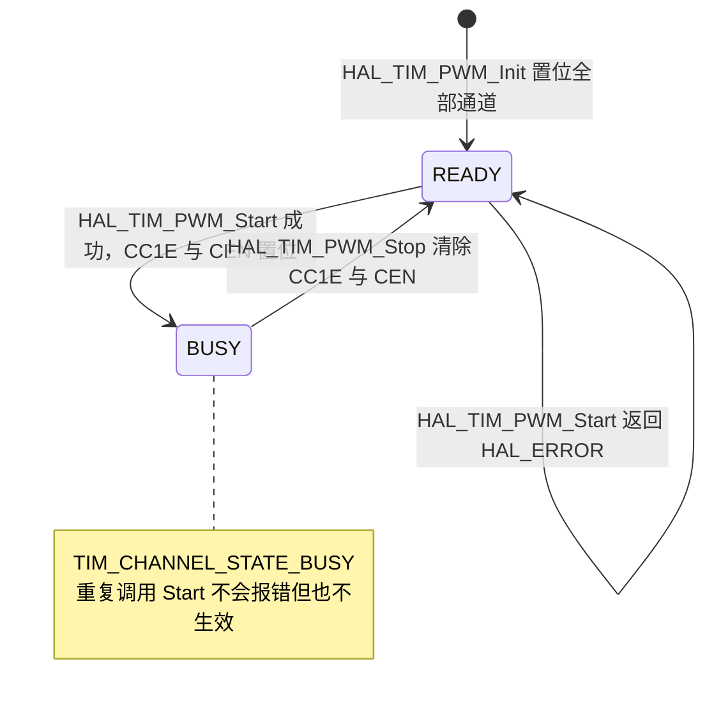

# 定时器易错点与排查

前四章说明了时基单元、PWM、本工程的实例分配与 HAL 时基。这一章按"看现象能否定位到寄存器"的顺序列出五个易错点，每个都给出云台板或底盘板里的实际代码位置，最后给出一套排查顺序。

## 1. 比较值与重装值的量纲

PWM 输出的两个参数由两个寄存器分别决定：`ARR` 决定周期，`CCR` 决定高电平宽度。两者共用同一个计数器刻度，所以比较值必须落在 0 到 `ARR+1` 之间才有调制效果：

| 条件 | 输出 |
| --- | --- |
| `CCR = 0` | 恒低，占空比 0 |
| `0 < CCR < ARR+1` | 正常调制，占空比 $CCR/(ARR+1)$ |
| `CCR \ge ARR+1` | 恒高，占空比 100% |

本工程的换算发生在 `BMI088/Src/ImuTempControl.cpp`：

```cpp
uint32_t duty = temp_pid_calculate(targetTemp, currentTemp, dt);
auto compare = static_cast<uint32_t>(htim_->Init.Period * duty);
__HAL_TIM_SET_COMPARE(htim_, channel_, compare);
```

`duty` 是温度环的输出，被限幅在 0 到 4500（`PID/Src/temp_pid.cpp` 的第四个构造参数是输出限幅）。`htim_->Init.Period` 是 4999，于是：

$$compare = 4999 \times duty,\quad duty \in [0, 4500]$$

只要 `duty` 大于 0，`compare` 至少是 4999，已经不小于 `ARR`，输出饱和成恒高。加热电路实际按通断方式工作，温度环的连续输出没有转换成连续占空比。

正确的换算需要两个量：满量程 `ARR+1 = 5000`，以及 `duty` 的满量程 4500。写成

$$CCR = \frac{(ARR+1)\times duty}{4500}$$

之后，`duty = 4500` 对应 100%，`duty = 2250` 对应 50%。

还有一层是寄存器位宽。`__HAL_TIM_SET_COMPARE()` 写入的是 32 位乘积，而 TIM10 的比较寄存器只有 16 位，高 16 位不会被保留，读回的值不再随 `duty` 单调变化。在调试器里读回 `CCR1` 与写入值比对即可确认，方法见第 6 节。

## 2. 影子寄存器的生效时刻

写入 `ARR` 或 `CCR` 之后，硬件未必马上按新值工作，取决于预装载开关：

| 寄存器 | 开关 | 本工程 | 生效时刻 |
| --- | --- | --- | --- |
| `ARR` | `CR1.ARPE` | 关闭（`tim.c`、`stm32f4xx_hal_timebase_tim.c`） | 立即 |
| `PSC` | 无 | 83 与 0 | 下一次 UEV |
| `CCR1` | `CCMR1.OC1PE` | 打开（HAL 强制置位，`stm32f4xx_hal_tim.c`） | 下一次 UEV |

两个后果需要在代码里照顾：

`ARR` 立即生效意味着运行时改周期有风险。若在 CNT 已经超过新 `ARR` 的时刻写入，计数器要一直计到 16 位溢出才会归零，本周期会被异常拉长。要消除这个风险，把 `.ioc` 的 `TIM10.AutoReloadPreload` 改成 `TIM_AUTORELOAD_PRELOAD_ENABLE`，让新周期在下一个 UEV 生效。

`CCR` 滞后一个 UEV 意味着占空比更新有延迟上界。本工程 TIM10 的 UEV 周期是 29.76 µs，IMU 任务周期是 1 ms，所以滞后可以忽略；如果 PWM 频率降到几百赫兹，滞后就会与控制周期同量级。



初始化时的装载是另一条路径。`TIM_Base_SetConfig()` 写完 `ARR` 与 `PSC` 后置位 `CR1.URS`，再通过 `EGR.UG` 产生一次更新事件把参数装入影子寄存器（`stm32f4xx_hal_tim.c`）。`URS = 1` 让这次更新不置 `UIF`，所以初始化不会触发中断。

## 3. 定时器时钟与 PWM 频率

最常见的算错来源是把总线时钟当成定时器时钟。F4 的规则是：APB 预分频系数不为 1 时，该总线上的定时器时钟是 $2\times PCLK$。本工程：

| 总线 | PCLK | 定时器时钟 | 挂在上面的实例 |
| --- | --- | --- | --- |
| APB1 | 42 MHz | 84 MHz | TIM2 |
| APB2 | 84 MHz | 168 MHz | TIM10 |

`.ioc` 里有两个字段直接给出结论：`RCC.APB1TimFreq_Value=84000000` 与 `RCC.APB2TimFreq_Value=168000000`。用总线时钟 42 MHz 去算 TIM2 会写出 PSC=41，而硬件给的计数时钟是 84 MHz 分频后的 2 MHz，更新频率从 1 kHz 变成 2 kHz；用 84 MHz 去算 TIM10 会把 33.6 kHz 算成 16.8 kHz。两种错误都能编译通过，只看代码看不出来。

时钟树一旦改动，所有由总线分频得到的时间量都会跟着变。一次 CAN 通信失败就是这种情况：按 36 MHz 的 APB1 算出 857142 Hz，而 `.ioc` 中 CAN1 与 CAN2 的 `Prescaler=2`、`BS1=CAN_BS1_15TQ`、`BS2=CAN_BS2_5TQ`、`CalculateBaudRate=1000000` 对应的是 APB1 为 42 MHz。位定时参数没变，波特率却随时钟树漂移。

排查这类问题的顺序是固定的：先确认 `SystemClock_Config()` 里的 `PLLM/PLLN/PLLP` 与 `APB1CLKDivider/APB2CLKDivider`（`Core/Src/main.c`），再用 `.ioc` 的 `RCC.*Freq_Value` 交叉核对，最后才看外设自己的分频寄存器。

## 4. NVIC 使能不等于有中断

`Core/Src/tim.c` 使能了 `TIM1_UP_TIM10_IRQn`：

```c
HAL_NVIC_SetPriority(TIM1_UP_TIM10_IRQn, 5, 0);
HAL_NVIC_EnableIRQ(TIM1_UP_TIM10_IRQn);
```

这是 CubeMX 按 `.ioc` 的 NVIC 配置生成的固定代码。让中断发生的是定时器的 `DIER.UIE`，而 `MX_TIM10_Init()` 只调用了 `HAL_TIM_Base_Init()`、`HAL_TIM_PWM_Init()` 与 `HAL_TIM_PWM_ConfigChannel()`，没有任何一处调用 `HAL_TIM_Base_Start_IT()`，所以 `DIER.UIE` 保持为 0，`TIM1_UP_TIM10_IRQHandler()` 不会被执行。

判断一个定时器到底有没有中断，看两个寄存器位而不是 NVIC：`DIER` 的 `UIE`，以及 `CR1` 的 `CEN`。NVIC 只是允许请求通过。

## 5. 三套时间基的混用

两块板同时存在三套独立的等待机制：

| 机制 | 依赖 | 是否让出 CPU | 失准条件 |
| --- | --- | --- | --- |
| `osDelay()` | SysTick 与调度器 | 是 | 调度器未启动时不可用；tick 被长时间屏蔽时延迟变长 |
| `HAL_Delay()` | TIM2 与 `uwTick` | 否，忙等 | 时基中断被长时间屏蔽时误差累积 |
| `DWT_Delay_us()` | `CYCCNT` | 否，忙等 | `CYCCNT` 未使能或被调试器挂起时失效 |

三者的组合会出问题。`ImuTask` 是唯一用忙等维持周期的任务：初始化阶段用 `DWT_Delay_ms(1000)`（`Task/Src/ImuTask.cpp`），主循环末尾用 `DWT_Delay_ms(1)`（同文件主循环末尾），其余任务用 `osDelay()`。把 `DWT_Delay_ms(1)` 换成 `HAL_Delay(1)` 不会让这个任务变得友善：等待源从 `CYCCNT` 换成 `uwTick` 之后它仍然不让出 CPU，同优先级任务的时间片照样被占。

还有一处容易忽略的差异：`uwTick` 与 `xTickCount` 虽然都是 1 ms 一格，但由两个中断分别维护，优先级同为 15 且都会在 FreeRTOS 临界区里被屏蔽。长时间运行后两者的差值会累积，不能用其中一个的差值去推断另一个的周期。

## 6. 排查顺序与手段

按"从寄存器到硬件"的顺序执行，每一步都能排除一半可能：



寄存器检查用 HAL 的宏最省事（`Drivers/STM32F4xx_HAL_Driver/Inc/stm32f4xx_hal_tim.h`）：

| 宏 | 读取或写入 | 用途 |
| --- | --- | --- |
| `__HAL_TIM_GET_COUNTER()` | `CNT` | 判断计数器是否在跑 |
| `__HAL_TIM_GET_AUTORELOAD()` | `ARR` | 核对周期 |
| `__HAL_TIM_SET_PRESCALER()` | `PSC` | 运行时改分频，注意下一个 UEV 生效 |
| `__HAL_TIM_GET_COMPARE()` | `CCR1` | 验证写入是否被截断 |

通道状态也能帮忙。HAL 为每个通道维护一个软件状态，`HAL_TIM_PWM_Start()` 要求它处于 READY：



状态机对应 `stm32f4xx_hal_tim.c` 的 1462-1468 行与 `HAL_TIM_PWM_Stop()` 的结尾。要重新启动一个通道，先 `Stop()` 把它退回 READY。

## 7. 小结

### 五个易错点速查

| 易错点 | 根因 | 现象 | 定位手段 |
| --- | --- | --- | --- |
| 量纲不一致 | 比较值没有除以满量程 | 占空比饱和在 0 或 100% | 比对 `CCR1` 与 `ARR` |
| 影子寄存器 | 预装载开关决定生效时刻 | 更新有延迟；改 `ARR` 出现异常周期 | 读 `CR1.ARPE` 与 `CCMR1.OC1PE` |
| 时钟算错 | 定时器时钟是 $2\times PCLK$ | 频率差一倍或出现非整数分频 | 核对 `SystemClock_Config()` 与 `RCC.*TimFreq_Value` |
| NVIC 使能不等于有中断 | `DIER.UIE` 未置位 | 中断处理函数从不执行 | 读 `DIER` 与 `CR1.CEN` |
| 时间基混用 | 三套等待各有依赖 | 任务被拖慢或周期不准 | 搜代码里的 `Delay` 与 `osDelay` |

### 核心概念

- 比较值的合法区间是 0 到 `ARR+1`，本工程的换算缺少满量程除法，输出只能停在两端。
- 预装载开关决定写入的生效时刻：`ARPE` 关时 `ARR` 立即生效，`OC1PE` 开时 `CCR` 等一个 UEV，`PSC` 永远等一个 UEV。
- 定时器时钟是 $2\times PCLK$，用总线时钟算分频会得到能跑但频率错误的配置。
- NVIC 的 `EnableIRQ` 只允许请求通过，是否产生请求由 `DIER` 决定。
- `osDelay()`、`HAL_Delay()`、`DWT_Delay_us()` 分别依赖 SysTick、TIM2、`CYCCNT`，任务循环里只用第一种。

### 设计权衡

| 选择 | 本工程怎么选 | 代价与收益 |
| --- | --- | --- |
| 占空比换算 | 直接乘重装值 | 代码短，代价是输出只有通断两态 |
| `ARR` 预装载 | 关闭 | 不需要额外配置，代价是运行时改频率有异常周期风险 |
| 时基中断优先级 | 15 | 与内核中断一致，代价是临界区会推迟 `uwTick` |
| TIM10 的 NVIC | 使能但不用中断 | 预留了改造成中断驱动的空间，代价是读代码时容易误判 |
| 排查入口 | 先读寄存器再查代码 | 结论确定，代价是需要能连调试器 |

## 8. 练习

基础题

1. TIM10 的 `ARR = 4999`，写出 `CCR1` 分别为 0、2500、5000、20000 时的占空比。
2. 说明把 `.ioc` 的 `TIM10.AutoReloadPreload` 改成 ENABLE 后，运行时修改 `ARR` 的行为变化。
3. `DIER = 0` 但 `CR1.CEN = 1`，说明此时 `SR.UIF` 置位后会发生什么。

挑战题

4. 软件写入 `CCR1` 的值是 `0x0157_9BCC`，调试器读回的是 `0x9BCC`，说明这两个数的关系，并判断此时 PF6 的占空比。
5. 给定现象"PF6 有 33.6 kHz 方波但占空比恒为 100%"，写出完整的排查步骤，并指出每一步期望的寄存器值。
6. 说明把 TIM10 改成用更新中断驱动占空比更新（每 33.6 µs 一次）在 168 MHz 的 F407 上是否可行，给出中断负载的估算。
