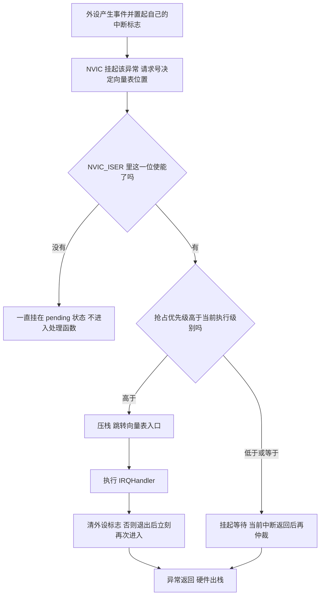
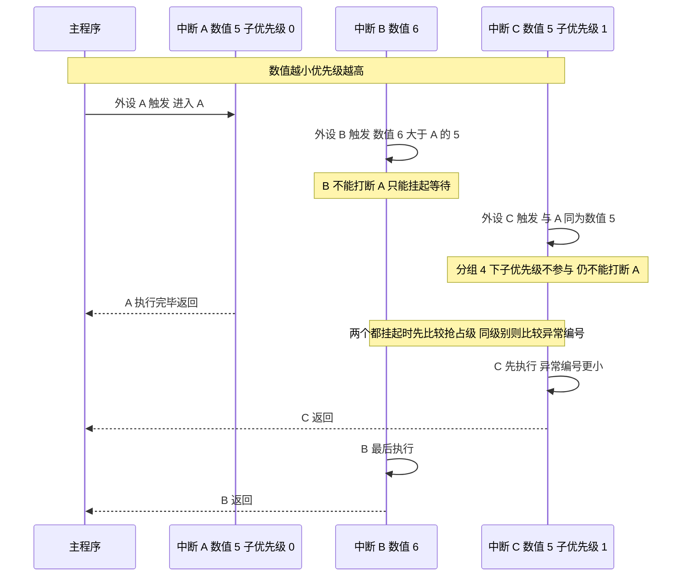

# NVIC 与优先级分组

> 本页对着三处源码：HAL 的分组设置（`Drivers/STM32F4xx_HAL_Driver/Src/stm32f4xx_hal.c`）、
> CMSIS 的优先级编码（`Drivers/CMSIS/Include/core_cm4.h`），以及本工程每个外设的 MspInit。
> 所有数字都可以在仓库里逐个核对。

## 1. 概念：异常、中断与 NVIC

Cortex-M4 把手头发生的事情统称为异常（Exception）。异常分两类：内核异常（复位、NMI、HardFault、SVC、PendSV、SysTick）和外部中断（IRQ0 到 IRQ239）。外设中断全部属于后一类，比如本工程的 `CAN1_RX0_IRQn` 与 `DMA1_Stream1_IRQn`。

异常发生时，硬件自动把当前寄存器压栈，跳到向量表里对应的入口。向量表在启动文件里：

```asm
/* startup_stm32f407xx.s:127-131 */
g_pfnVectors:
  .word  _estack
  .word  Reset_Handler
  .word  NMI_Handler
  .word  HardFault_Handler
```

表项顺序固定，第 n 个表项对应第 n 号异常。所以某个中断进不来这件事，可以拆成三段独立的检查：外设有没有产生事件、NVIC 有没有使能这一号异常、向量表这一项指向的函数有没有被实际实现。后两段都归 NVIC 管。

NVIC（Nested Vectored Interrupt Controller，嵌套向量中断控制器）对外提供四件事：使能与失能某一号中断、设置它的优先级、查询挂起状态、清除挂起状态。HAL 只把最常用的两件包成了函数：

```c
/* Core/Src/dma.c:48-49 */
HAL_NVIC_SetPriority(DMA1_Stream1_IRQn, 5, 0);
HAL_NVIC_EnableIRQ(DMA1_Stream1_IRQn);
```

第二行的含义是允许 NVIC 接受这个请求，与"外设是否发出请求"无关。外设侧的寄存器没有配好，NVIC 使能了也不会有中断。

## 2. 机制：4 位有效位与三段拆分

### 2.1 优先级寄存器只有高 4 位有效

STM32F407 的每号中断有一个 8 位的优先级寄存器 `NVIC_IPRx`，芯片只实现了高 4 位：

```c
/* Drivers/CMSIS/Device/ST/STM32F4xx/Include/stm32f407xx.h:49 */
#define __NVIC_PRIO_BITS          4U       /*!< STM32F4XX uses 4 Bits for the Priority Levels */
```

CMSIS 的写函数因此做了一次左移：

```c
/* Drivers/CMSIS/Include/core_cm4.h:1814-1822（节选） */
__STATIC_INLINE void __NVIC_SetPriority(IRQn_Type IRQn, uint32_t priority)
{
  if ((int32_t)(IRQn) >= 0)
  {
    NVIC->IP[((uint32_t)IRQn)] = (uint8_t)((priority << (8U - __NVIC_PRIO_BITS)) & (uint32_t)0xFFUL);
  }
  ...
}
```

所以调用时写 5，寄存器里存的是 $5 \ll 4 = 80 = 0\text{x}50$。直接操作寄存器的代码写 `NVIC_IPRx` 时经常漏掉这次左移，写进去的 5 落在低 4 位（无效位），实际优先级变成 0，也就是最高。优先级设了却没生效的现象，来源就在这一步。

### 2.2 分组：把 4 位切成抢占位与子优先级位

`AIRCR.PRIGROUP` 决定这 4 位怎么切。HAL 用五个常量表示切法：

| HAL 常量 | PRIGROUP 值 | 抢占优先级位 | 子优先级位 | 抢占级取值个数 | 同抢占级内的档位 |
| --- | --- | --- | --- | --- | --- |
| `NVIC_PRIORITYGROUP_0` | 7 | 0 | 4 | 1 | 16 |
| `NVIC_PRIORITYGROUP_1` | 6 | 1 | 3 | 2 | 8 |
| `NVIC_PRIORITYGROUP_2` | 5 | 2 | 2 | 4 | 4 |
| `NVIC_PRIORITYGROUP_3` | 4 | 3 | 1 | 8 | 2 |
| `NVIC_PRIORITYGROUP_4` | 3 | 4 | 0 | 16 | 1 |

常量定义见 `stm32f4xx_hal_cortex.h:88-96`，切法计算见 `core_cm4.h:1861-1868` 的 `NVIC_EncodePriority()`：

```c
/* Drivers/CMSIS/Include/core_cm4.h:1861-1870（节选） */
__STATIC_INLINE uint32_t NVIC_EncodePriority (uint32_t PriorityGroup, uint32_t PreemptPriority, uint32_t SubPriority)
{
  uint32_t PriorityGroupTmp = (PriorityGroup & (uint32_t)0x07UL);
  ...
  PreemptPriorityBits = ((7UL - PriorityGroupTmp) > (uint32_t)(__NVIC_PRIO_BITS)) ? (uint32_t)(__NVIC_PRIO_BITS) : (uint32_t)(7UL - PriorityGroupTmp);
  SubPriorityBits     = ((PriorityGroupTmp + (uint32_t)(__NVIC_PRIO_BITS)) < (uint32_t)7UL) ? (uint32_t)0UL : (uint32_t)((PriorityGroupTmp - 7UL) + (uint32_t)(__NVIC_PRIO_BITS));
  return ((((PreemptPriority & (uint32_t)((1UL << (PreemptPriorityBits)) - 1UL)) << SubPriorityBits)
           | ((SubPriority & (uint32_t)((1UL << (SubPriorityBits)) - 1UL)))));
}
```

以 `NVIC_PRIORITYGROUP_4` 为例：$PriorityGroupTmp = 3$，$PreemptPriorityBits = \min(4, 4) = 4$，$SubPriorityBits = \max(0, 3 + 4 - 7) = 0$。传进来的第三参数被完全丢掉。

### 2.3 两个字段各管一件事

抢占优先级（Preemption Priority）决定能否打断正在执行的中断。子优先级（Sub Priority）只在两个中断同时处于挂起、又处于同一抢占级时决定谁先执行，它不产生嵌套：子优先级低的中断开始执行之后，子优先级高的同抢占级中断不能抢断它。

两个字段都是数值越小优先级越高。0 最高，15 最低。

分组 4 下子优先级位数为 0，同一抢占级的多个中断之间没有软件可配的档位，硬件按异常编号仲裁：编号小的先执行。本工程所有外设中断都在同一个数值 5 上，这条规则决定它们之间的排队顺序。

### 2.4 一次中断的完整判定



### 2.5 同抢占级与不同抢占级的两种排队



## 3. 落到本项目

### 3.1 分组在 HAL_Init 里设定，早于任何外设初始化

```c
/* Core/Src/main.c:95-111（节选） */
HAL_Init();
SystemClock_Config();
MX_GPIO_Init();
MX_DMA_Init();
MX_CAN1_Init();
...

/* Drivers/STM32F4xx_HAL_Driver/Src/stm32f4xx_hal.c:157-179（节选） */
HAL_StatusTypeDef HAL_Init(void)
{
  ...
  HAL_NVIC_SetPriorityGrouping(NVIC_PRIORITYGROUP_4);
  HAL_InitTick(TICK_INT_PRIORITY);
  HAL_MspInit();
  ...
}
```

分组在 `HAL_Init()` 内部第 173 行写入，而 `MX_DMA_Init()` 等外设初始化在它之后执行，顺序上不会出现先设优先级、后改分组导致已写好的抢占位被重新解释的问题。

```c
/* Drivers/STM32F4xx_HAL_Driver/Src/stm32f4xx_hal_rcc.c:718-722 */
SystemCoreClock = HAL_RCC_GetSysClockFreq() >> AHBPrescTable[(RCC->CFGR & RCC_CFGR_HPRE) >> RCC_CFGR_HPRE_Pos];

/* Configure the source of time base considering new system clocks settings */
HAL_InitTick(uwTickPrio);
```

时钟树一变，`HAL_RCC_ClockConfig()` 会重新调一次 `HAL_InitTick()`，HAL 时基的分频按新频率重算。本工程时钟为 HSE 12 MHz 经 PLL 到 168 MHz，APB1 为 42 MHz，APB2 为 84 MHz，锁相环与分频的推导见本单元之外的《时钟树与 PLL》。

### 3.2 FreeRTOS 侧必须对齐位数

```c
/* Core/Inc/FreeRTOSConfig.h:95-100 */
#ifdef __NVIC_PRIO_BITS
 #define configPRIO_BITS         __NVIC_PRIO_BITS
#else
 #define configPRIO_BITS         4
#endif

/* Core/Inc/FreeRTOSConfig.h:104-117（节选） */
#define configLIBRARY_LOWEST_INTERRUPT_PRIORITY       15
#define configLIBRARY_MAX_SYSCALL_INTERRUPT_PRIORITY  5
#define configKERNEL_INTERRUPT_PRIORITY \
        ( configLIBRARY_LOWEST_INTERRUPT_PRIORITY << (8 - configPRIO_BITS) )
#define configMAX_SYSCALL_INTERRUPT_PRIORITY \
        ( configLIBRARY_MAX_SYSCALL_INTERRUPT_PRIORITY << (8 - configPRIO_BITS) )
```

$$configKERNEL\_INTERRUPT\_PRIORITY = 15 \ll 4 = 240 = 0\text{xF0}$$

$$configMAX\_SYSCALL\_INTERRUPT\_PRIORITY = 5 \ll 4 = 80 = 0\text{x}50$$

FreeRTOS 的 port 直接写 `BASEPRI` 寄存器，不做 CMSIS 那次左移，所以它的宏里必须自己左移 `8 - configPRIO_BITS` 位。这里依赖的 `configPRIO_BITS` 来自 CMSIS 的 `__NVIC_PRIO_BITS`，与 NVIC 分组来自同一个硬件事实。分组换成 `NVIC_PRIORITYGROUP_2` 时，`configPRIO_BITS` 仍然是 4，因为硬件有效位数没变，两者不会因此矛盾；但如果把 `configPRIO_BITS` 手写成 5 或 3，FreeRTOS 换算出的门槛就会落在错误的位上。

### 3.3 本工程全部中断的优先级

下表是两块板共同的分配。除 `PendSV_IRQn` 与 TIM2 之外，本工程设置的每一号外设中断都是 5。

| 中断 | HAL_NVIC_SetPriority 位置 | 数值 | 触发来源 |
| --- | --- | --- | --- |
| `DMA1_Stream1_IRQn` | `Core/Src/dma.c:48` | 5 | USART3 接收 DMA 的 HT/TC/TE |
| `DMA2_Stream1_IRQn` | `Core/Src/dma.c:51` | 5 | USART6 接收 DMA |
| `DMA2_Stream2_IRQn` | `Core/Src/dma.c:54` | 5 | SPI1 接收 DMA |
| `DMA2_Stream3_IRQn` | `Core/Src/dma.c:57` | 5 | SPI1 发送 DMA |
| `DMA2_Stream6_IRQn` | `Core/Src/dma.c:60` | 5 | USART6 发送 DMA |
| `CAN1_RX0_IRQn` | `Core/Src/can.c:125` | 5 | CAN1 FIFO0 收到报文 |
| `CAN1_RX1_IRQn` | `Core/Src/can.c:127` | 5 | CAN1 FIFO1 收到报文 |
| `CAN2_RX0_IRQn` | `Core/Src/can.c:158` | 5 | CAN2 FIFO0 收到报文 |
| `CAN2_RX1_IRQn` | `Core/Src/can.c:160` | 5 | CAN2 FIFO1 收到报文 |
| `TIM1_UP_TIM10_IRQn` | `Core/Src/tim.c:83` | 5 | TIM10 更新中断（本工程未启动计数） |
| `USART3_IRQn` | `Core/Src/usart.c:198` | 5 | USART3 空闲检测 |
| `USART6_IRQn` | `Core/Src/usart.c:262` | 5 | USART6 空闲检测 |
| `OTG_FS_IRQn` | `USB_DEVICE/Target/usbd_conf.c:94` | 5 | USB 端点事件 |
| `PendSV_IRQn` | `Core/Src/stm32f4xx_hal_msp.c:75` | 15 | 内核上下文切换 |
| `TIM2_IRQn` | `Core/Src/stm32f4xx_hal_timebase_tim.c:100` | `TICK_INT_PRIORITY` 为 15 | HAL 时基，1 ms |
| `SysTick_IRQn` | 由 `xPortSysTickHandler` 接管 | 15 | FreeRTOS 滴答 |

`SysTick_Handler` 与 `PendSV_Handler` 这两个名字在 `FreeRTOSConfig.h:127-133` 被重定向到了 port 自己的实现：

```c
/* Core/Inc/FreeRTOSConfig.h:127-133（节选） */
#define vPortSVCHandler    SVC_Handler
#define xPortPendSVHandler PendSV_Handler
/* ... to prevent overwriting SysTick_Handler defined within STM32Cube HAL */
#define xPortSysTickHandler SysTick_Handler
```

`Core/Src/stm32f4xx_it.c` 里因此找不到 `PendSV_Handler` 与 `SysTick_Handler` 的函数体，它们的实体在 `Middlewares/Third_Party/FreeRTOS/Source/portable/GCC/ARM_CM4F/port.c`。

### 3.4 数值 5 与 FreeRTOS 门槛的关系

数值 5 恰好等于 `configLIBRARY_MAX_SYSCALL_INTERRUPT_PRIORITY`。这一相等带来两个结论：

1. 全部外设中断都在内核可管理范围内，ISR 里调用 `FromISR` 版本的 API 是合法的。本工程唯一这样用的是 USB 中断里的 `xQueueSendFromISR`。
2. 裕量为零。任何一个外设中断的数值被改成 4，它就能在 FreeRTOS 临界区中间插进来，包括队列内部改读写指针的那几行。临界区与 BASEPRI 的完整推导在 01-FreeRTOS 单元的《临界区与中断安全》，本页只给出与 NVIC 相关的部分：

$$5 = configLIBRARY\_MAX\_SYSCALL\_INTERRUPT\_PRIORITY$$

$$\text{NVIC 数值} \ge 5 \Rightarrow \text{会被 BASEPRI} = 0\text{x}50 \text{ 屏蔽}$$

## 4. 易错点

### 4.1 把优先级数值当成越大越高

NVIC 里 0 最高、15 最低。写成 `HAL_NVIC_SetPriority(USART3_IRQn, 15, 0)` 是把它压到最低，与给串口高优先级的意图相反。

### 4.2 忘了 CMSIS 那次左移

写 `NVIC->IP[IRQn] = 5;` 得到的是优先级 0。判断方法：在调试器里看 `NVIC_IPRx` 的值，正确值的高 4 位是 5、低 4 位为 0。

### 4.3 把分组与库的配置位数混为一谈

分组决定 4 位怎么切，`configPRIO_BITS` 表示硬件有效位数。分组从 4 改成 2 时，`configPRIO_BITS` 仍是 4。需要同步的是抢占位宽这件事本身：分组 2 下第三参数才有意义，而本工程所有调用都传 0，所以改成 2 或 3 时行为无变化。

### 4.4 在 ISR 里靠子优先级做互斥

子优先级只在两个中断同时挂起时决定顺序，它不阻止嵌套。用子优先级分档来避免高优先级处理函数访问低速设备，做法不成立。分组 4 下子优先级位宽为 0，这个字段根本没有存储位置。

### 4.5 只使能 NVIC 就以为中断会来

`HAL_NVIC_EnableIRQ()` 只打开 NVIC 这一级的闸门。外设侧的中断使能位（例如 CAN 的 `CAN_IER_FMPIE0`、UART 的 `IDLEIE`、DMA 流的 `TCIE`）由各自的驱动打开。本工程 TIM10 是一个例子：`Core/Src/tim.c:83-84` 使能了 `TIM1_UP_TIM10_IRQn`，但全工程没有任何一处调用 `HAL_TIM_PWM_Start()` 或 `HAL_TIM_Base_Start_IT()` 去启动 `htim10`，计数器没有运行，更新中断使能位也一直没置起，这个向量实际从未进入过。

### 4.6 改 PRIO 位宽后没有重设阈值

`HAL_NVIC_SetPriorityGrouping()` 可以在运行期调用。调用之后已经写好的 `NVIC_IPRx` 内容不变，但抢占与子优先级的解释变了。本工程只在 `HAL_Init()` 里调用一次，运行期不改。如果要在运行期改，必须在改之前把相关中断的 NVIC 使能位关掉，否则正在挂起的请求会以新解释立刻进入。

### 4.7 中断服务函数体缺失

启动文件对每个向量都提供了弱符号：

```asm
/* startup_stm32f407xx.s:285-295（节选） */
  .weak      EXTI0_IRQHandler
  .thumb_set EXTI0_IRQHandler,Default_Handler
  .thumb_set EXTI1_IRQHandler,Default_Handler
  .thumb_set EXTI2_IRQHandler,Default_Handler
  .weak      EXTI3_IRQHandler
  .thumb_set EXTI3_IRQHandler,Default_Handler
```

`Default_Handler` 是死循环（`startup_stm32f407xx.s:111-115`）。没有自写 `EXTI0_IRQHandler` 时，使能了 EXTI0 的结果是第一次触发就停在里面。这是能编译、能下载、一上电就静止这类现象的一种成因。

## 5. 小结

### 5.1 核心概念

- 中断有三段独立的开关：外设事件标志、NVIC 使能位、向量表入口函数。任何一段缺失，现象都是函数不执行。
- 优先级数值越小越高，0 最高。STM32F407 每号中断只有高 4 位有效，CMSIS 写入时自动左移 `8 - 4 = 4` 位。
- `AIRCR.PRIGROUP` 把 4 位切成抢占位与子优先级位。分组 4 表示 4 位全给抢占，子优先级位宽为 0。
- 抢占优先级决定嵌套，子优先级只决定同抢占级中谁先执行，不产生嵌套。分组 4 下同抢占级按异常编号仲裁。
- 本工程分组为 `NVIC_PRIORITYGROUP_4`，全部外设中断取 5，`PendSV` 与 HAL 时基取 15，FreeRTOS 阈值也是 5。

### 5.2 设计权衡

| 决策 | 好处 | 代价 |
| --- | --- | --- |
| 分组取 4，只用抢占位 | 抢占关系一目了然，不存在设了子优先级却不生效的困惑 | 同抢占级内无法用软件排先后，只能靠异常编号 |
| 全部外设中断统一取 5 | 任意外设的 ISR 都能调用 `FromISR` API，配置统一 | 所有外设中断互不抢占，低延迟需求无法满足；对 FreeRTOS 阈值零裕量 |
| 阈值取 5 而不是更大 | 临界区屏蔽范围最小，CAN 与串口响应的延迟最低 | 一旦有人把某个外设改成 4，队列保护立刻失效 |
| `PendSV` 与 TIM2 取 15 | 任务切换与 HAL 时基不会打断任何外设中断 | HAL 时基在重负载下会被推迟，`HAL_Delay` 精度随之下降 |
| 运行期不改分组 | 优先级解释在编译期就固定，排查时无需考虑时序 | 需要动态调整抢占与子优先级的场景无法支持 |

结论：本工程的 NVIC 配置是一条很窄的路。它把所有外设压到同一个抢占级、正好等于 FreeRTOS 的阈值，用互不抢占加全部可调内核 API 换来统一性，代价是没有优先级层次可用。理解这一点之后再读 `stm32f4xx_it.c` 里的处理函数，就能预期它们的执行关系：任何一个 ISR 都不会被另一个外设 ISR 打断，本工程也没有比数值 5 更高的中断。

## 6. 练习

### 基础题

1. 手算 `NVIC_PRIORITYGROUP_4` 下 `HAL_NVIC_SetPriority(USART3_IRQn, 5, 0)` 写入的 `NVIC_IPR` 字节值，并说明它不是 5 的原因。
2. 列出 `NVIC_PRIORITYGROUP_0` 到 `NVIC_PRIORITYGROUP_4` 五种分组下抢占优先级的取值个数。
3. 给出 `configKERNEL_INTERRUPT_PRIORITY` 与 `configMAX_SYSCALL_INTERRUPT_PRIORITY` 的十进制值，并指出它们各自对应哪一号中断的优先级。
4. 用调试器读 `NVIC_ISER` 与 `NVIC_IPR`，核对本工程实际使能了哪些中断、优先级是否都是 5。

### 挑战题

5. 设计一套分层优先级。要求：CAN 接收与 USART3 空闲中断的响应延迟不超过 20 μs，USB 中断可以调用 `FromISR` API，任务切换不得延迟任一外设中断超过 5 μs。给出每一号中断的数值，并说明 FreeRTOS 阈值必须同步调整的原因。
6. 假设把分组改成 `NVIC_PRIORITYGROUP_3`，并把 USB 中断设为抢占 5、子优先级 1。分析 `xQueueSendFromISR` 内部的临界区还能否挡住它，以及 BASEPRI 此时写入的值。
7. 写一段运行期代码，把某个正在运行的中断从数值 5 改成数值 6，改之前先关掉它的 NVIC 使能位。说明改动瞬间如果该中断正处于挂起状态会发生什么。

## 附：本页引用的固件路径

| 路径 | 用途 |
| --- | --- |
| `/home/wyx/rm/2026SentriOmeniGimbal/2026OmniSentryGimbal/startup_stm32f407xx.s` | 向量表（:127-158）、`Default_Handler` 死循环（:111-115）、弱符号别名（:285-295） |
| `/home/wyx/rm/2026SentriOmeniGimbal/2026OmniSentryGimbal/Core/Src/main.c` | `HAL_Init()` 与初始化顺序（:95-131） |
| `/home/wyx/rm/2026SentriOmeniGimbal/2026OmniSentryGimbal/Core/Inc/FreeRTOSConfig.h` | `configPRIO_BITS`（:95-100）、阈值与内核优先级（:104-117）、异常处理函数重定向（:127-133） |
| `/home/wyx/rm/2026SentriOmeniGimbal/2026OmniSentryGimbal/Core/Src/dma.c` | 五个 DMA 向量的优先级与使能（:48-61） |
| `/home/wyx/rm/2026SentriOmeniGimbal/2026OmniSentryGimbal/Core/Src/can.c` | CAN 四个接收向量（:125-128、:158-161） |
| `/home/wyx/rm/2026SentriOmeniGimbal/2026OmniSentryGimbal/Core/Src/tim.c` | `TIM1_UP_TIM10_IRQn` 使能（:83-84）、TIM10 参数（:42-63） |
| `/home/wyx/rm/2026SentriOmeniGimbal/2026OmniSentryGimbal/Core/Src/usart.c` | `USART3_IRQn` 与 `USART6_IRQn`（:198-199、:262-263） |
| `/home/wyx/rm/2026SentriOmeniGimbal/2026OmniSentryGimbal/Core/Src/stm32f4xx_hal_msp.c` | `PendSV_IRQn` 取 15（:75） |
| `/home/wyx/rm/2026SentriOmeniGimbal/2026OmniSentryGimbal/Core/Src/stm32f4xx_hal_timebase_tim.c` | TIM2 时基与优先级（:41-112） |
| `/home/wyx/rm/2026SentriOmeniGimbal/2026OmniSentryGimbal/Core/Inc/stm32f4xx_hal_conf.h` | `TICK_INT_PRIORITY` 为 15（:151） |
| `/home/wyx/rm/2026SentriOmeniGimbal/2026OmniSentryGimbal/USB_DEVICE/Target/usbd_conf.c` | `OTG_FS_IRQn` 优先级（:94-95） |
| `/home/wyx/rm/2026SentriOmeniGimbal/2026OmniSentryGimbal/Drivers/STM32F4xx_HAL_Driver/Src/stm32f4xx_hal.c` | 分组设置（:173） |
| `/home/wyx/rm/2026SentriOmeniGimbal/2026OmniSentryGimbal/Drivers/STM32F4xx_HAL_Driver/Src/stm32f4xx_hal_cortex.c` | `HAL_NVIC_SetPriority()` 转 CMSIS（:163-174） |
| `/home/wyx/rm/2026SentriOmeniGimbal/2026OmniSentryGimbal/Drivers/STM32F4xx_HAL_Driver/Inc/stm32f4xx_hal_cortex.h` | 五个分组常量（:88-96） |
| `/home/wyx/rm/2026SentriOmeniGimbal/2026OmniSentryGimbal/Drivers/CMSIS/Include/core_cm4.h` | `__NVIC_SetPriority()`（:1814-1822）、`NVIC_EncodePriority()`（:1861-1870） |
| `/home/wyx/rm/2026SentriOmeniGimbal/2026OmniSentryGimbal/Drivers/CMSIS/Device/ST/STM32F4xx/Include/stm32f407xx.h` | `__NVIC_PRIO_BITS` 为 4（:49） |
| `/home/wyx/rm/2026SentriOmeniGimbal/2026OmniSentryGimbal/Chassis/`（同仓库对比） | 两份板的外设优先级设置一致 |
