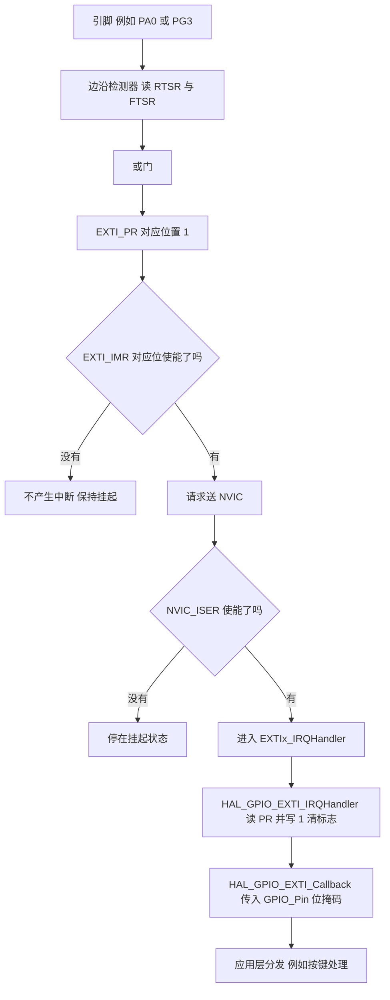
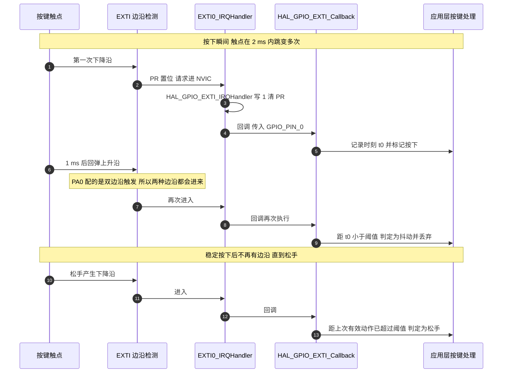

# EXTI 与中断回调

对照对象是 `Core/Src/gpio.c` 里的两个输入引脚，以及 HAL 的 GPIO 驱动 `Drivers/STM32F4xx_HAL_Driver/Src/stm32f4xx_hal_gpio.c`。

结论是本工程配了 EXTI 但没有接通，缺口有三处，第 3.3 节给出可直接落地的补全代码。下面先讲 EXTI 与 NVIC 的分工，再走一次边沿从寄存器到回调的完整路径。


## 1. EXTI 与 NVIC 的分工

**EXTI**（External interrupt/event controller，外部中断与事件控制器）负责把引脚上的电平变化变成一次挂起请求。它与 NVIC 的分工是：EXTI 管信号的采集与边沿判定，NVIC 管请求的使能与排队。

EXTI 有 23 条线（line），编号 0 到 22。

- 线 0 到 15 对应 GPIO：线 n 由 `SYSCFG_EXTICR` 选择接到哪一组的第 n 号引脚。`PA0`、`PB0`、`PC0` 全都连到线 0，同一时刻只能选其中之一。
- 线 16 到 22 接内部源：PVD 输出、RTC 闹钟、USB 唤醒、以太网唤醒等。

这个映射决定了两个后果。第一，线号等于引脚号，与端口无关，所以 PA0 和 PB0 共用同一号中断是硬件结构决定的。第二，同一条线的所有引脚共用一个中断服务函数，回调里必须按引脚位掩码区分来源。

本工程用到两组：`PA0`（`KEY_Pin`）与 `PG3`。

## 2. 一次边沿如何变成回调

### 2.1 EXTI 的五个寄存器与一次边沿

| 寄存器 | 作用 |
| --- | --- |
| `EXTI_IMR` | 中断屏蔽。某位置 1 表示这条线的请求会送进 NVIC |
| `EXTI_EMR` | 事件屏蔽。置 1 只产生事件脉冲，不产生中断 |
| `EXTI_RTSR` | 上升沿触发使能 |
| `EXTI_FTSR` | 下降沿触发使能 |
| `EXTI_PR` | 挂起标志。某条线发生指定边沿后由硬件置 1，软件写 1 清零 |

`EXTI_PR` 的每一位是该条线上所有选中引脚的边沿或结果。清 `PR` 只能整条线清，无法区分是哪一个引脚触发的。引脚级的区分只能靠读 `IDR` 或者靠回调里传入的位掩码。

信号从引脚到 CPU 的通路如下。



### 2.2 配置动作在 HAL_GPIO_Init 内部完成

把引脚设为 `GPIO_MODE_IT_RISING` 之类时，`HAL_GPIO_Init()` 会自动补齐 EXTI 侧的配置：

```c
/* Drivers/STM32F4xx_HAL_Driver/Src/stm32f4xx_hal_gpio.c（节选） */
if((GPIO_Init->Mode & EXTI_MODE) != 0x00U)
{
  /* Enable SYSCFG Clock */
  __HAL_RCC_SYSCFG_CLK_ENABLE();

  temp = SYSCFG->EXTICR[position >> 2U];
  temp &= ~(0x0FU << (4U * (position & 0x03U)));
  temp |= ((uint32_t)(GPIO_GET_INDEX(GPIOx)) << (4U * (position & 0x03U)));
  SYSCFG->EXTICR[position >> 2U] = temp;

  /* Clear Rising Falling edge configuration */
  temp = EXTI->RTSR;
  temp &= ~((uint32_t)iocurrent);
  if((GPIO_Init->Mode & TRIGGER_RISING) != 0x00U) { temp |= iocurrent; }
  EXTI->RTSR = temp;
  ...
  /* Clear EXTI line configuration */
  temp = EXTI->IMR;
  temp &= ~((uint32_t)iocurrent);
  if((GPIO_Init->Mode & EXTI_IT) != 0x00U) { temp |= iocurrent; }
  EXTI->IMR = temp;
}
```

顺序是：使能 SYSCFG 时钟、写 `EXTICR` 选端口、写边沿触发位、最后写 `IMR`。所以调用 `HAL_GPIO_Init()` 之后，EXTI 线已经使能，剩下的唯一缺口是 NVIC 与处理函数。

### 2.3 HAL 的回调链

HAL 把清标志与用户逻辑分成了两层：

```c
/* Drivers/STM32F4xx_HAL_Driver/Src/stm32f4xx_hal_gpio.c */
void HAL_GPIO_EXTI_IRQHandler(uint16_t GPIO_Pin)
{
  /* EXTI line interrupt detected */
  if(__HAL_GPIO_EXTI_GET_IT(GPIO_Pin) != RESET)
  {
    __HAL_GPIO_EXTI_CLEAR_IT(GPIO_Pin);
    HAL_GPIO_EXTI_Callback(GPIO_Pin);
  }
}

__weak void HAL_GPIO_EXTI_Callback(uint16_t GPIO_Pin)
{
  UNUSED(GPIO_Pin);
  /* NOTE: This function Should not be modified, when the callback is needed,
           the HAL_GPIO_EXTI_Callback could be implemented in the user file
   */
}
```

`HAL_GPIO_EXTI_Callback` 被声明为 **__weak**（弱符号）。链接器在同时看到弱定义和用户定义时选用户定义，所以用户只要在任意一个 `.c` 文件里重新写一遍同名函数，链路就接通了。这里没有运行期注册这一步，覆盖发生在链接期。

HAL 另外提供了一套运行期注册的形式，通过 `USE_HAL_GPIO_REGISTER_CALLBACKS` 宏开启，注册函数是 `HAL_GPIO_RegisterCallback()`。本工程没有开启，走的是弱符号这一条。

清标志在回调之前完成，这个顺序有明确含义：回调执行期间如果同一条线上再来一个边沿，`PR` 会重新置起，当前回调返回后 NVIC 会再次进入处理函数。事件不会因为回调还没结束就丢掉，但也不会被合并。

### 2.4 一次按键抖动的时序

机械按键的触点在闭合瞬间会产生多次跳变。下面的时序把两次真实跳变和多次抖动跳变画在一起。



## 3. 本工程的缺口与补全

### 3.1 两个引脚的配置

```c
/* Core/Src/gpio.c（节选） */
  /*Configure GPIO pin : PG3 */
  GPIO_InitStruct.Pin = GPIO_PIN_3;
  GPIO_InitStruct.Mode = GPIO_MODE_IT_RISING;
  GPIO_InitStruct.Pull = GPIO_PULLUP;
  HAL_GPIO_Init(GPIOG, &GPIO_InitStruct);
  ...
  /*Configure GPIO pin : KEY_Pin */
  GPIO_InitStruct.Pin = KEY_Pin;
  GPIO_InitStruct.Mode = GPIO_MODE_IT_RISING_FALLING;
  GPIO_InitStruct.Pull = GPIO_PULLUP;
  HAL_GPIO_Init(KEY_GPIO_Port, &GPIO_InitStruct);
```

`KEY_Pin` 在 `Core/Inc/main.h` 定义为 `PA0`：

```c
/* Core/Inc/main.h */
/* Private defines -----------------------------------------------------------*/
#define KEY_Pin GPIO_PIN_0
#define KEY_GPIO_Port GPIOA
```

`main.h` 里只定义了这一个引脚，其余引脚都在 `gpio.c` 与 `stm32f4xx_hal_msp.c` 里直接写端口与引脚号。

两个引脚进入 EXTI 之后的状态：

| 引脚 | EXTI 线 | 边沿 | 上下拉 | `IMR` 位 | 对应向量 |
| --- | --- | --- | --- | --- | --- |
| `PA0` | 线 0 | 上升与下降 | 上拉 | 已由 `HAL_GPIO_Init()` 置位 | `EXTI0_IRQn` |
| `PG3` | 线 3 | 上升 | 上拉 | 已由 `HAL_GPIO_Init()` 置位 | `EXTI3_IRQn` |

上拉说明两个引脚都是低电平有效：按键按下接地，`PG3` 的上升沿来自外部信号的上升。

### 3.2 缺口的三个位置

在全工程的应用代码里搜索 EXTI 只命中两处，都不是实现：

```bash
$ cd 2026OmniSentryGimbal
$ grep -rn "EXTI" Core/Src Core/Inc BSP Task Communication USB_DEVICE
./Core/Src/gpio.c: * EXTI
./Core/Inc/stm32f4xx_hal_conf.h: #define HAL_EXTI_MODULE_ENABLED
```

于是链路断在三处：

| 缺口 | 应有内容 | 本工程现状 |
| --- | --- | --- |
| NVIC 使能 | `HAL_NVIC_SetPriority(EXTI0_IRQn, 5, 0)` 与 `HAL_NVIC_EnableIRQ(EXTI0_IRQn)` | 没有任何一处调用 |
| 中断服务函数 | 形如 `void EXTI0_IRQHandler(void)` 并调用 `HAL_GPIO_EXTI_IRQHandler(GPIO_PIN_0)` | `Core/Src/stm32f4xx_it.c` 全文没有 EXTI 相关的函数 |
| 用户回调 | 重写 `HAL_GPIO_EXTI_Callback()` | 没有实现，用的是 HAL 的弱定义 |

三处缺口带来的现象各不相同，排查时可以据此缩小范围：

- 只缺回调：处理函数正常进入，`PR` 被清掉，程序不挂，但按键没有任何响应。
- 缺了中断服务函数但补上了 NVIC 使能：第一次触发跳进启动文件里的 `Default_Handler`，停在死循环。
- 连 NVIC 使能也没补：`PR` 会一直保持置位，CPU 完全没有感知，用调试器看 `EXTI_PR` 能看到第 0 位是 1。

### 3.3 补全后的最小实现

下面这段可以直接放进 `Core/Src/stm32f4xx_it.c` 与一个新的 `BSP/Src/bsp_key.cpp`，优先级取 5 与本工程其余外设一致。消抖阈值需要按实际按键实测后调整。

```c
/* Core/Src/stm32f4xx_it.c 追加 */
void EXTI0_IRQHandler(void)
{
  HAL_GPIO_EXTI_IRQHandler(GPIO_PIN_0);
}

void EXTI3_IRQHandler(void)
{
  HAL_GPIO_EXTI_IRQHandler(GPIO_PIN_3);
}

/* Core/Src/gpio.c 的 MX_GPIO_Init() 末尾追加 */
HAL_NVIC_SetPriority(EXTI0_IRQn, 5, 0);
HAL_NVIC_EnableIRQ(EXTI0_IRQn);
HAL_NVIC_SetPriority(EXTI3_IRQn, 5, 0);
HAL_NVIC_EnableIRQ(EXTI3_IRQn);
```

```c
/* BSP/Src/bsp_key.cpp 新增，回调里只做时间戳与计数 */
static volatile uint32_t s_last_edge_tick = 0;
static volatile uint8_t  s_key_pressed    = 0;

extern "C" void HAL_GPIO_EXTI_Callback(uint16_t GPIO_Pin)
{
  if (GPIO_Pin != GPIO_PIN_0) {
    return;                       /* 同一条 EXTI 线可能接入多个引脚，按位掩码分发 */
  }
  const uint32_t now = HAL_GetTick();
  if ((now - s_last_edge_tick) < 20u) {
    return;                       /* 抖动窗口，20 ms 是待实测的初值 */
  }
  s_last_edge_tick = now;
  s_key_pressed = (HAL_GPIO_ReadPin(KEY_GPIO_Port, KEY_Pin) == GPIO_PIN_RESET) ? 1u : 0u;
}
```

这段实现里有两个刻意的选择：回调不做延时、不做打印、不调用任何阻塞函数；按键状态交给任务侧读 `s_key_pressed`。原因是回调运行在优先级 5 的 ISR 里，与 CAN 接收、串口空闲检测同级，做重活会直接推迟它们。

## 4. 易错点

### 4.1 把 `GPIO_Pin` 当成引脚序号

回调参数是位掩码，`GPIO_PIN_0` 是 `0x0001`，`GPIO_PIN_3` 是 `0x0008`。用 `if (GPIO_Pin == 0)` 判断永远不成立。

### 4.2 只调 `HAL_GPIO_Init()` 就以为中断可用

`HAL_GPIO_Init()` 只把 EXTI 线配好并置起 `IMR`，NVIC 使能位与处理函数都不在它的职责范围。本工程的两个引脚正好停在这一步。

### 4.3 同一条线接了两个端口

`PA0` 与 `PB0` 都在线 0 上。如果两个引脚都配成输入中断，`EXTICR` 只会保留后写的那一个端口，先配的引脚从此不再产生中断，而 `IMR` 那一位仍然是使能的，看起来一切正常。

### 4.4 忘记清 `PR`

不调用 `HAL_GPIO_EXTI_IRQHandler()`、自己写处理函数却忘了清标志，退出后 `PR` 仍然是 1，处理器会立刻再次进入，表现为中断服务函数被反复执行、主程序几乎不前进。

### 4.5 回调里做重活

在回调里放 `HAL_Delay(10)` 会等不到 HAL 时基更新。HAL 时基是 TIM2，优先级 15，低于外设中断的 5，在优先级 5 的 ISR 里它进不来，`HAL_GetTick()` 的值不再变化，循环条件永远不会满足。要延时只能在任务侧做。

### 4.6 抖动当成多次按键

双边沿触发下，一次按下会产生多个上升沿与下降沿。没有时间窗过滤时，上层会收到多次事件。过滤的时间窗放在 ISR 里最省事，用一个 `HAL_GetTick()` 差值就够。

### 4.7 在 EXTI 上做高频计数

机械按键之外的信号（编码器或传感器的中断输出）如果接到 EXTI，每个边沿都是一次完整的中断进出。Cortex-M4 的最短中断延迟在 12 周期量级，加上压栈出栈与 HAL 的分层调用，实际开销远大于这个数。周期性采样或者用定时器计数更合适。

## 5. 小结

### 5.1 核心概念

- EXTI 负责采集引脚边沿并置起 `PR`，NVIC 负责使能与排队。`HAL_GPIO_Init()` 只做前者。
- 线号等于引脚号，与端口无关。线 n 的端口由 `SYSCFG_EXTICR` 选择，同一条线上只能同时接一个端口。
- HAL 的回调是链接期的弱符号覆盖，不是运行期注册。用户重写同名函数即可接通。
- `HAL_GPIO_EXTI_IRQHandler()` 先清 `PR` 再调回调，回调期间的新边沿会重新置起标志并在返回后再次进入。
- 本工程 `PA0` 与 `PG3` 的 EXTI 线段已配好，NVIC 使能、服务函数、用户回调三处都缺，所以两个引脚实际不产生任何软件可见的事件。

### 5.2 设计权衡

| 决策 | 好处 | 代价 |
| --- | --- | --- |
| 用 EXTI 处理按键 | 不占 CPU 轮询时间，松手与按下都能立刻响应 | 每个边沿一次中断，抖动期间中断密集；需要软件消抖 |
| 用双边沿触发 `PA0` | 一个引脚拿到按下与松手两种事件 | ISR 进入次数翻倍，消抖逻辑必须能区分方向 |
| 回调里只记时间戳 | ISR 驻留时间最短，不干扰同级的外设中断 | 上层需要自己读状态，逻辑分散在两处 |
| 保持与其余外设同为优先级 5 | 配置统一，可在 ISR 里安全调用 `FromISR` API | 按键响应不能抢占 CAN 与串口处理 |
| 依赖弱符号而不开运行期注册 | 代码量最小，不增加函数指针与内存 | 覆盖发生在链接期，同一回调只能有一份实现，多模块难以各管一段 |

结论：EXTI 的通路一共有五段（GPIO 配置、`EXTICR`、`IMR`、NVIC、处理函数与回调），`HAL_GPIO_Init()` 覆盖前两段。判断中断为什么不进来时，按这个顺序逐段核对比整体怀疑更快，而 `EXTI_PR` 与 `NVIC_ISER` 两个寄存器就能把范围切掉一半。

## 6. 练习

### 基础题

1. 说明 `PA0`、`PB0`、`PG0` 分别连到哪条 EXTI 线，以及同时配成输入中断的后果。
2. 写出 `HAL_GPIO_EXTI_IRQHandler()` 被调用时对 `EXTI_PR` 做了哪一步操作，以及写 1 而不是写 0 的原因。
3. `HAL_GPIO_EXTI_Callback()` 的参数在 `GPIO_PIN_0` 与 `GPIO_PIN_3` 两种情况下分别是多少。
4. 说明 `__weak` 与运行期回调注册两种机制在链接行为上的差别。

### 挑战题

5. 为本工程补全按键通路。要求：给出 `EXTI0_IRQHandler`、NVIC 使能代码、消抖实现，并论证消抖窗口放在 ISR 内部与放在任务侧的差别。
6. 现有 `PG3` 配的是上升沿触发，且没有接通中断。设计一个不依赖 EXTI 的替代方案，用定时器或任务轮询获取同样的信息，并对比两者在 CPU 占用与响应延迟上的量级。
7. 假设需要在同一条 EXTI 线上接三个引脚（例如 `PA0`、`PB0`、`PC0`）。说明无法实现的原因、`EXTICR` 的实际行为，并给出两种可行的绕开方式。

## 附：本页引用的固件路径

| 路径 | 用途 |
| --- | --- |
| `2026OmniSentryGimbal/Core/Src/gpio.c` | `PG3` 上升沿配置、`KEY_Pin` 双边沿配置 |
| `2026OmniSentryGimbal/Core/Inc/main.h` | `KEY_Pin` 与 `KEY_GPIO_Port` |
| `2026OmniSentryGimbal/Core/Src/stm32f4xx_it.c` | 全部中断服务函数，未见 EXTI 相关项 |
| `2026OmniSentryGimbal/startup_stm32f407xx.s` | `EXTI0_IRQHandler` 与 `EXTI3_IRQHandler` 的弱别名、`Default_Handler` |
| `2026OmniSentryGimbal/Drivers/STM32F4xx_HAL_Driver/Src/stm32f4xx_hal_gpio.c` | EXTI 分支配置、`HAL_GPIO_EXTI_IRQHandler()`、弱回调 |
| `2026OmniSentryGimbal/Core/Inc/stm32f4xx_hal_conf.h` | `HAL_EXTI_MODULE_ENABLED` |
| `第一章.md` | Cortex-M3/M4 的中断确定性延迟为 12 周期 |
| `2026OmniSentryChassis/Core/Src/gpio.c` | 底盘板同样的两个引脚配置，与云台板一致 |
