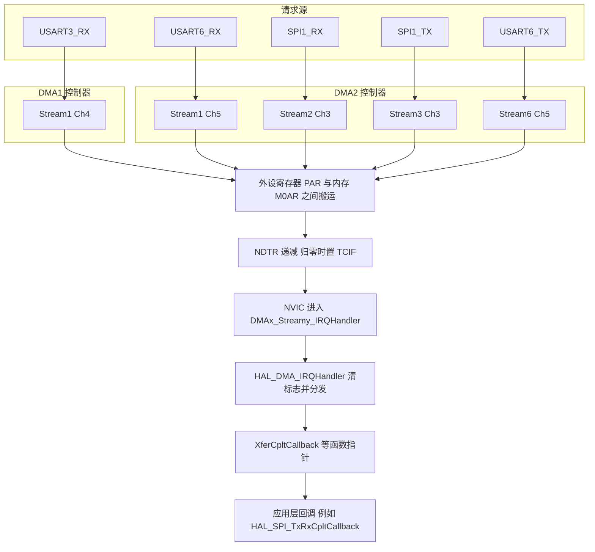
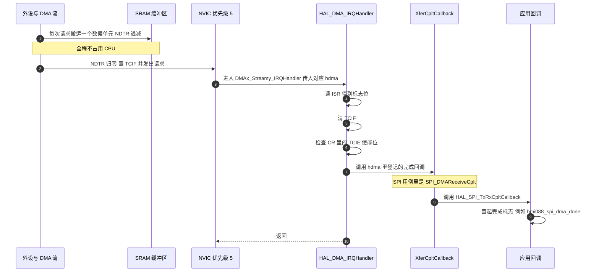

# DMA 原理与流选择

`Core/Src/dma.c`、各外设的 MspInit（`usart.c`、`spi.c`）与 HAL 的 DMA 驱动是核对对象，五条流的配置全部来自仓库，逐行可查。

DMA 把 CPU 从逐字节搬运里解放出来，代价是引入一套资源约束：流与通道的绑定、请求映射、优先级与带宽。资源结构先讲清，然后逐项过一条流的配置，最后收在本工程五条流的清单与一次 SPI 实例上。


## 1. DMA 解决的问题与它的资源结构

SPI 读一次 IMU 要搬 8 个字节，串口每来一帧遥控数据要搬 18 个字节。如果这些搬运都由 CPU 执行，每一次都要经历"读状态寄存器、判标志、读数据寄存器、写内存"四步，并且全程占用 CPU。DMA（Direct Memory Access，直接存储器访问）把这四步交给独立的控制器，CPU 只需要配置一次，然后在传输结束时收到一个中断。

STM32F407 有两个 DMA 控制器：**DMA1** 与 **DMA2**。每个控制器有 8 条流（stream），编号 0 到 7。每条流最多承载一个外设请求。请求源通过一个 8 选 1 的选择器接进来，这个选择器的输入叫通道（channel），编号 0 到 7。

这里的命名容易混：**stream** 是硬件资源，channel 是这个资源上的输入选择位。两者都要配对才能工作。

- 一个请求（例如 USART3_RX）固定落在某一条流上，没有别的选择。
- 该流上还要把 channel 选到该请求对应的编号，选错不会报错，只表现为永远没有传输、也没有中断。
- 同一时刻一条流只能服务一个请求。两个外设即使 channel 不同，只要抢同一条流，就只能用其中一个。

### 1.1 请求到内存的通路



## 2. 一条流的配置与工作模式

### 2.1 一条流的配置项

HAL 的 `DMA_HandleTypeDef.Init` 里每一项都对应寄存器里的一个字段，`HAL_DMA_Init()` 一次性写进 `CR` 与 `FCR`：

```c
/* Drivers/STM32F4xx_HAL_Driver/Src/stm32f4xx_hal_dma.c:231-246（节选） */
tmp &= ((uint32_t)~(DMA_SxCR_CHSEL | DMA_SxCR_MBURST | DMA_SxCR_PBURST | ...));
tmp |=  hdma->Init.Channel             | hdma->Init.Direction        |
        hdma->Init.PeriphInc           | hdma->Init.MemInc           |
        hdma->Init.PeriphDataAlignment | hdma->Init.MemDataAlignment |
        hdma->Init.Mode                | hdma->Init.Priority;
...
tmp |=  hdma->Init.MemBurst | hdma->Init.PeriphBurst;
```

| 结构体字段 | 寄存器位 | 含义 |
| --- | --- | --- |
| `Channel` | `CR.CHSEL` | 8 选 1 的请求选择，必须与该外设的固定映射一致 |
| `Direction` | `CR.DIR` | 外设到内存、内存到外设、内存到内存 |
| `PeriphInc` / `MemInc` | `CR.PINC` / `CR.MINC` | 地址是否自增。外设寄存器固定，所以 `PINC` 永远关；内存缓冲区要连续，所以 `MINC` 常开 |
| `PeriphDataAlignment` / `MemDataAlignment` | `CR.PSIZE` / `CR.MSIZE` | 单次搬运的宽度 |
| `Mode` | `CR.CIRC` | 单次（`DMA_NORMAL`）或循环（`DMA_CIRCULAR`） |
| `Priority` | `CR.PL` | 流之间的仲裁级别，四档 |
| `FIFOMode` | `FCR.DMDIS` | 直接模式或 FIFO 模式 |
| `FIFOThreshold` | `FCR.FTH` | FIFO 模式下触发搬运的水位 |

地址与长度的装载发生在启动时，由 `DMA_SetConfig()` 完成：

```c
/* Drivers/STM32F4xx_HAL_Driver/Src/stm32f4xx_hal_dma.c:1151 起（函数声明行） */
static void DMA_SetConfig(DMA_HandleTypeDef *hdma, uint32_t SrcAddress, uint32_t DstAddress, uint32_t DataLength)
```

`NDTR` 在装载后开始递减。读 `NDTR` 得到的是剩余量，已经搬运的字节数由下式得到：

$$N_{\text{moved}} = N_{\text{total}} - NDTR$$

这条式子在本工程的空闲中断处理里被直接使用（见《串口 DMA 与空闲中断》）。

### 2.2 直接模式与 FIFO 模式

FIFO 关闭时，DMA 处于直接模式：每收到一次请求，立刻在源与目标之间搬一次，源的宽度必须等于目标的宽度，否则一次请求搬不完整，硬件会给出传输错误标志 `TEIF`。本工程五条流的源与目标宽度都是字节，直接模式正好匹配。

FIFO 打开时，数据先进入一个 4 级 × 32 位的缓冲，攒到 `FIFOThreshold` 指定的水位再批量写入目标。这样允许源与目标宽度不同（硬件负责拆包与拼包），也允许突发（burst）访问以提高总线效率。代价是延迟增加，且在 `FIFOThreshold` 与突发长度不匹配时会置起 FIFO 错误 `FEIF`。

两种模式的取舍：

| 维度 | 直接模式 | FIFO 模式 |
| --- | --- | --- |
| 源目标宽度 | 必须相等 | 可以不同，硬件搬运 |
| 每次请求的延迟 | 立即搬运 | 等水位满足 |
| 总线效率 | 单次访问 | 支持突发，长传输更快 |
| 出错情形 | 宽度不等置 `TEIF` | 水位与突发不匹配置 `FEIF` |
| 本工程使用 | 五条流全部使用 | 没有使用 |

### 2.3 循环与单次

`DMA_NORMAL` 传输完 `NDTR` 个数据后自动关闭使能位，`TCIF` 只置一次。`DMA_CIRCULAR` 在 `NDTR` 归零后自动把 `NDTR` 重装为原值并从起始地址继续，`TCIF` 每绕一圈置一次。

循环模式适合"永远在收"的场景，例如串口接收 DMA。单次模式适合"搬完就结束"的场景，例如 SPI 读一次 IMU。本工程两种都有。

### 2.4 双缓冲：第三条路

双缓冲（Double Buffer Mode，DBM）在一条流上提供两个内存目标 `M0AR` 与 `M1AR`，由 `CR.CT` 指示当前目标。当前目标写满时，硬件自动切换到另一个，同时置 `TCIF`。这样处理数据的时间与接收数据的时间可以重叠。

本工程在串口接收上用了这个模式，而且是自己写函数启动的，没有走 HAL 的 `HAL_DMAEx_MultiBufferStart_IT()`，细节见《串口 DMA 与空闲中断》。

HAL 在双缓冲下的完成回调选择有一处反直觉的地方：`TCIF` 置起时硬件已经切换过 `CT`，所以 HAL 用 `CT` 的当前值去回调上一个缓冲区：

```c
/* Drivers/STM32F4xx_HAL_Driver/Src/stm32f4xx_hal_dma.c:878-898（节选） */
if(((hdma->Instance->CR) & (uint32_t)(DMA_SxCR_DBM)) != RESET)
{
  /* Current memory buffer used is Memory 0 */
  if((hdma->Instance->CR & DMA_SxCR_CT) == RESET)
  {
    if(hdma->XferM1CpltCallback != NULL) { hdma->XferM1CpltCallback(hdma); }
  }
  /* Current memory buffer used is Memory 1 */
  else
  {
    if(hdma->XferCpltCallback != NULL) { hdma->XferCpltCallback(hdma); }
  }
}
```

`CT` 为 0 时回调的是 M1，`CT` 为 1 时回调的是 M0。读这段代码时把 `CT` 的含义记成"当前正在写的目标"，就能推出为什么是反的。

### 2.5 中断标志与 HAL 的分发

每条流有五个中断源：半传输 `HTIF`、传输完成 `TCIF`、传输错误 `TEIF`、FIFO 错误 `FEIF`、直接模式错误 `DMEIF`。`HAL_DMA_IRQHandler()` 逐个标志检查 `CR` 里对应的中断使能位，清标志，更新 `ErrorCode`，再调用相应的函数指针：



### 2.6 优先级与带宽

流之间的仲裁由 `CR.PL` 决定，共四档：最高、高、中、低。同一档内按流编号排序。这个优先级只影响两个流同时请求时的先后，不影响 CPU 与 DMA 对总线的竞争：DMA 与 CPU 分时使用总线矩阵，DMA 搬运期间 CPU 访问同一块 SRAM 会被插入等待周期。搬运密度很低时这部分开销可以忽略，本工程的量级在下面算。

## 3. 五条流的配置与实例

### 3.1 五条流的配置清单

表里的每一行都能在源码里核对。

| 外设与方向 | 流 | Channel | 方向 | 模式 | 流优先级 | FIFO | 源码位置 |
| --- | --- | --- | --- | --- | --- | --- | --- |
| `USART3_RX` 遥控接收 | `DMA1_Stream1` | `DMA_CHANNEL_4` | 外设到内存 | 循环 | 高 | 关闭 | `Core/Src/usart.c:180-189` |
| `USART6_RX` 裁判接收 | `DMA2_Stream1` | `DMA_CHANNEL_5` | 外设到内存 | 单次 | 高 | 关闭 | `Core/Src/usart.c:226-235` |
| `USART6_TX` 裁判发送 | `DMA2_Stream6` | `DMA_CHANNEL_5` | 内存到外设 | 循环 | 高 | 关闭 | `Core/Src/usart.c:244-253` |
| `SPI1_RX` IMU 接收 | `DMA2_Stream2` | `DMA_CHANNEL_3` | 外设到内存 | 单次 | 最高 | 关闭 | `Core/Src/spi.c:99-108` |
| `SPI1_TX` IMU 发送 | `DMA2_Stream3` | `DMA_CHANNEL_3` | 内存到外设 | 单次 | 高 | 关闭 | `Core/Src/spi.c:117-126` |

五条流的 `PeriphInc` 全部是 `DMA_PINC_DISABLE`，`MemInc` 全部是 `DMA_MINC_ENABLE`，数据宽度两边都是 `DMA_PDATAALIGN_BYTE` 与 `DMA_MDATAALIGN_BYTE`。

同一控制器内不冲突：DMA2 上占用的是 Stream1、Stream2、Stream3、Stream6，各属不同流。DMA1 上只占用 Stream1。

关于映射表本身：F407 每个外设的请求落在哪条流、哪个 channel，由参考手册的 DMA 请求映射表给定，工程侧没有选择的余地。本表只列出本工程实际用到的五条，其余条目在写新驱动时需要查参考手册。

### 3.2 时钟与中断使能

```c
/* Core/Src/dma.c:39-62（节选） */
void MX_DMA_Init(void)
{
  /* DMA controller clock enable */
  __HAL_RCC_DMA2_CLK_ENABLE();
  __HAL_RCC_DMA1_CLK_ENABLE();

  /* DMA interrupt init */
  /* DMA1_Stream1_IRQn interrupt configuration */
  HAL_NVIC_SetPriority(DMA1_Stream1_IRQn, 5, 0);
  HAL_NVIC_EnableIRQ(DMA1_Stream1_IRQn);
  ...
}
```

两块板的 `dma.c` 内容完全一致，包括五个向量的优先级 5。这一文件只负责控制器时钟与 NVIC，流的参数在外设的 MspInit 里写。

### 3.3 从 DMA 完成到应用回调：SPI1 的实例

SPI 的 DMA 传输是"完成由 DMA 流报告"的典型例子。`HAL_SPI_TransmitReceive_DMA()` 内部把两个函数指针分别登记到收发两条流上：

```c
/* Drivers/STM32F4xx_HAL_Driver/Src/stm32f4xx_hal_spi.c:1707 与 :1817（节选） */
hspi->hdmatx->XferCpltCallback = SPI_DMATransmitCplt;
...
hspi->hdmarx->XferCpltCallback = SPI_DMAReceiveCplt;
```

接收完成时，调用链是 `DMA2_Stream2_IRQHandler` 里的 `HAL_DMA_IRQHandler(&hdma_spi1_rx)` 到 `SPI_DMAReceiveCplt()` 再到 `HAL_SPI_TxRxCpltCallback()`：

```c
/* Drivers/STM32F4xx_HAL_Driver/Src/stm32f4xx_hal_spi.c:3717-3738（节选） */
if (hspi->ErrorCode == HAL_SPI_ERROR_NONE)
{
  if (hspi->State == HAL_SPI_STATE_BUSY_RX)
  {
    hspi->State = HAL_SPI_STATE_READY;
    HAL_SPI_RxCpltCallback(hspi);
  }
  else
  {
    hspi->State = HAL_SPI_STATE_READY;
    HAL_SPI_TxRxCpltCallback(hspi);
  }
}
```

驱动侧的回调只做一件事：置标志。

```cpp
/* BMI088/Src/BMI088.cpp:15-17 */
static volatile uint8_t bmi088_spi_dma_done = 0;
static volatile uint8_t bmi088_spi_dma_error = 0;
static uint8_t bmi088_dma_tx_buf[BMI088_DMA_MAX_LEN];

/* BMI088/Src/BMI088.cpp:295-308（节选） */
if (HAL_SPI_TransmitReceive_DMA(&hspi1, bmi088_dma_tx_buf, buf, len) != HAL_OK) {
    return HAL_ERROR;
}

uint32_t t0 = HAL_GetTick();
const uint32_t timeout_ms = 10;
while (!bmi088_spi_dma_done && !bmi088_spi_dma_error) {
    if ((HAL_GetTick() - t0) > timeout_ms) {
        HAL_SPI_Abort(&hspi1);
        return HAL_TIMEOUT;
    }
}
```

`SPI1_IRQn` 在本工程里没有被使能，也不需要：整条链路的推进由 DMA 流的 TC 中断完成。

注意这里 DMA2 上没有 `DMA2_Stream1_IRQHandler` 服务 IMU，那条流属于 USART6_RX；IMU 用的是 `DMA2_Stream2_IRQHandler` 与 `DMA2_Stream3_IRQHandler`。

### 3.4 传输时间的量级

搬运一个字节的时间由外设的位速率决定，与 DMA 无关：

$$t_{\text{byte}} = \frac{b}{f_{\text{baud}}}$$

SPI1 的波特率预分频取自 `Core/Src/spi.c:49` 的 `SPI_BAUDRATEPRESCALER_64`，SPI1 挂在 APB2 的 84 MHz 上，所以

$$f_{\text{SPI1}} = \frac{84\ \text{MHz}}{64} = 1.3125\ \text{MHz}$$

一次读 8 个字节需要 $8 \times 8 / 1.3125\ \text{MHz} \approx 48.8\ \mu\text{s}$。USART3 是 100 kbaud、8 位数据加偶校验，每字节 11 位，18 字节的一帧需要 $18 \times 11 / 100\ \text{k} = 1.98\ \text{ms}$。USART6 是 115200、8N1，每字节 10 位，256 字节的整块缓冲需要 $256 \times 10 / 115200 \approx 22.2\ \text{ms}$。

这些毫秒级的时间全部由 DMA 承担，CPU 只在最后收一次中断。

## 4. 易错点

### 4.1 channel 写错

映射表里只有一对流与通道的组合有效。选错通道时 DMA 不产生任何传输，也不产生任何中断，外设侧的中断标志照常置起。判断方法：看 `NDTR` 是否在递减。它一直等于装载值，说明请求根本没进来。

### 4.2 两个外设抢同一条流

一条流只能服务一个请求。第二次 `HAL_DMA_Init()` 会改写 `CR.CHSEL` 与 `PAR`，先配的那个外设从此收不到数据，而两条驱动的返回值都是 `HAL_OK`。

### 4.3 在流使能时写 `NDTR`

`NDTR` 只在 `CR.EN` 为 0 时可以写。清 `EN` 之后硬件要到当前传输结束才把它清零，紧接着写 `NDTR` 可能落在 `EN` 仍为 1 的窗口里，这次写入不生效。本工程 `Communication/Src/usart_dma.cpp:86-96` 就是"清 `EN`、写 `NDTR`、置 `EN`"的顺序，其中的风险在《串口 DMA 与空闲中断》里单独讨论。

### 4.4 直接模式下宽度不等

源与目标宽度必须相同。外设是字节、内存用了半字，就会出现"每次请求搬不完"的传输错误，`TEIF` 置位。本工程两边都配成字节。

### 4.5 DMA 缓冲区是局部变量

`HAL_SPI_TransmitReceive_DMA(&hspi1, tx, rx, len)` 之后函数返回，DMA 仍然在写 `rx`。如果 `rx` 是栈上的局部数组，函数返回后这块栈空间随时会被别的调用覆盖。本工程的 DMA 目标 `gyro`、`accel` 是全局数组（`Task/Src/ImuTask.cpp:15`），发送缓冲 `bmi088_dma_tx_buf` 是静态数组，没有这个问题。

### 4.6 把双缓冲当单缓冲用

开了 `DBM` 之后 `M1AR` 才有意义，两块的切换由硬件完成。如果继续按单缓冲的思路只处理 `M0AR`，会有一半数据落在 `M1AR` 里从未被读出。

### 4.7 混用阻塞与 DMA 的 SPI 时序

`BMI088/Src/BMI088.cpp:217-219` 在调用 `BMI088_read_multiple_reg_dma()` 之前先用阻塞方式发送了一次寄存器地址，而该函数内部（`:288`）又会发一次同样的地址。这样的序列里前一次发送不经过 DMA，第二次才进入 DMA，两种时序混在同一次读操作里。它是否造成读回数据整体偏移一个寄存器，需要用逻辑分析仪核对实际 MOSI 与 MISO 波形，这一条标注为待实测。

### 4.8 在中断里调用阻塞式中止

`HAL_DMA_Abort()` 会循环等待 `EN` 清零。在 ISR 里调用它等于在中断里等硬件，虽然本工程的场合只有几个周期，但它把"中断里不做阻塞"的原则破坏掉了。需要中止时用 `HAL_DMA_Abort_IT()`。

### 4.9 FIFO 模式下水位与突发不匹配

`FIFOThreshold` 表示多少个数据单元触发一次搬运，`MemBurst` 表示一次搬运多少个单元。两者不匹配时会置起 `FEIF`。本工程没有开 FIFO，这一条属于改配置时才需要关注的项。

## 5. 小结

### 5.1 核心概念

- stream 是硬件资源，channel 是这条流上的请求选择器。一个请求固定落在一条流上，通道号必须与参考手册的映射一致。
- 直接模式要求源与目标宽度相同；FIFO 模式允许宽度不同并支持突发，代价是延迟与额外错误标志。
- `DMA_NORMAL` 传完自动关闭，`DMA_CIRCULAR` 自动重装 `NDTR`。双缓冲在一条流上提供两个目标，切换由硬件完成。
- 已经搬运的字节数等于 "装载值减 `NDTR`"。`NDTR` 只能在 `EN` 为 0 时写入。
- 完成通知由 DMA 流的 `TCIF` 完成，HAL 通过 `XferCpltCallback` 等函数指针向上传递，SPI 的用例最终落到 `HAL_SPI_TxRxCpltCallback()`。

### 5.2 设计权衡

| 决策 | 好处 | 代价 |
| --- | --- | --- |
| 五条流全部关闭 FIFO | 源目标宽度相同，无需考虑水位与突发，出错面最小 | 字节级单次访问，长传输的总线效率低于突发模式 |
| 串口接收用循环模式加双缓冲 | 接收永不停止，缓冲可整块交给解码 | 需要自己管理 `CT` 与 `NDTR`，比单缓冲复杂 |
| 串口发送用循环模式 | 配置与接收对称 | 与 `HAL_UART_Transmit_DMA()` 的完成逻辑不匹配，见《串口 DMA 与空闲中断》 |
| SPI 用单次模式 | 每次读操作的长度固定，搬完即结束，语义清晰 | 每读一次都要重新启动，启动开销计入任务周期 |
| 流优先级区分最高与高 | SPI 的 IMU 读取优先于其它流 | 优先级只影响流之间的仲裁，不改变外设的位速率 |

结论：DMA 的配置项里，容易出错的是两个"静默失败"的项：channel 选错与缓冲区生命周期。前者不产生任何异常现象，后者在函数返回后才会暴露。其余配置项出错一般会置起 `TEIF` 或 `FEIF`，可以在调试器里直接看到。

## 6. 练习

### 基础题

1. 写出本工程五条流的流号、通道号与方向，并指出哪一条属于 DMA1。
2. 说明已搬运字节数的计算方法，以及在调试器里读哪一个寄存器。
3. 对比直接模式与 FIFO 模式在源目标宽度、延迟、错误标志三方面的差别。
4. 说明 `DMA_NORMAL` 与 `DMA_CIRCULAR` 在 `NDTR` 归零后的行为差异。

### 挑战题

5. `HAL_SPI_TransmitReceive_DMA()` 只登记了接收流的完成回调，那么发送流的完成是如何参与最终判定的。请从 `stm32f4xx_hal_spi.c` 里找出证据并画出调用链。
6. 本工程 `USART6_TX` 用的是循环模式。假设有人调用 `Uart_Transmit_DMA(&huart6, buf, len)`，请推导 DMA 侧与 UART 侧各自会发生什么，并解释 `UsartDma::tx_busy_` 为什么不会被清回 0。
7. 设计一个"一次搬运 512 字节、源为半字、目标为字节"的配置。说明必须打开 FIFO 的原因，并给出 `FIFOThreshold` 与 `MemBurst` 的取值建议。

## 附：本页引用的固件路径

| 路径 | 用途 |
| --- | --- |
| `2026OmniSentryGimbal/Core/Src/dma.c` | DMA 控制器时钟与五个向量（:39-62） |
| `2026OmniSentryGimbal/Core/Src/usart.c` | USART3_RX 流与通道（:180-189）、USART6_RX（:226-235）、USART6_TX（:244-253） |
| `2026OmniSentryGimbal/Core/Src/spi.c` | SPI1 波特率预分频（:49）、SPI1_RX 流（:99-108）、SPI1_TX 流（:117-126） |
| `2026OmniSentryGimbal/Core/Src/stm32f4xx_it.c` | 五个 DMA 向量的处理函数（:177-354） |
| `2026OmniSentryGimbal/BMI088/Src/BMI088.cpp` | 完成标志与发送缓冲（:15-17）、DMA 启动与等待（:279-315）、完成回调（:355-369） |
| `2026OmniSentryGimbal/Task/Src/ImuTask.cpp` | 全局数组与 1 ms 循环（:14、:34-104） |
| `2026OmniSentryGimbal/Communication/Src/usart_dma.cpp` | 双缓冲启动与 `NDTR` 重置（:33-99、:118-178） |
| `2026OmniSentryGimbal/Drivers/STM32F4xx_HAL_Driver/Src/stm32f4xx_hal_dma.c` | `CR` 与 `FCR` 装载（:231-269）、中断分发（:746-921）、双缓冲回调选择（:878-898）、地址长度装载（:1151） |
| `2026OmniSentryGimbal/Drivers/STM32F4xx_HAL_Driver/Src/stm32f4xx_hal_spi.c` | DMA 回调登记（:1707、:1817）、完成分发（:3717-3738） |
| `2026OmniSentryChassis/Core/Src/dma.c` | 底盘板同配置（:39-62） |
