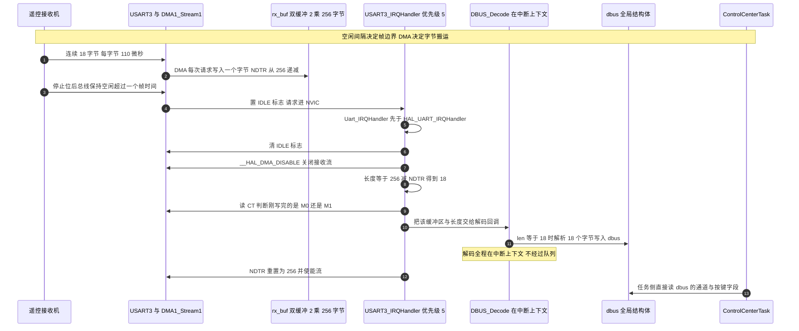
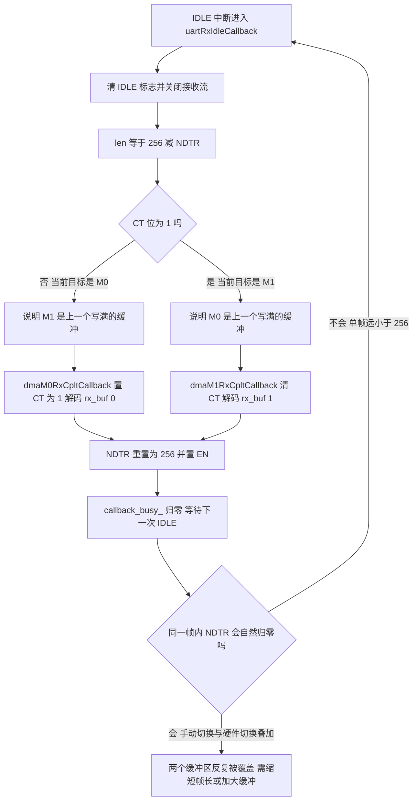

# 串口 DMA 与空闲中断

`Communication/Src/usart_dma.cpp` 这一个文件共 202 行，是把 DMA 与空闲中断接起来的地方。它用 DMA 加空闲中断实现串口整帧接收，两块板的遥控与裁判系统都走它。与之配套的协议解帧属于 04-串口通信与协议 单元，这里只讲到「把整块缓冲交给解码回调」这一层。

串口是字节流设备，帧边界要靠接收侧自己判断。空闲中断给出帧结束的硬件信号，DMA 负责把字节搬进缓冲，两者配合就能在不占用 CPU 的前提下收整帧。


## 1. 串口接收为什么要空闲中断

UART 是字节流设备。收到一帧数据的时刻不确定、帧与帧之间还有静默间隔，接收侧必须自己判断"这一帧到头了"。三种常见做法：

| 做法 | 定界依据 | 中断次数 | 适用场景 |
| --- | --- | --- | --- |
| 逐字节接收中断 | 应用层状态机 | 每字节一次 | 低波特率、帧很短 |
| 定长 DMA | 长度到达 `NDTR` 归零 | 每帧一次 | 帧长固定且连续发送 |
| DMA 加空闲中断 | 总线上出现一个完整帧时间的空闲 | 每帧一次 | 帧长已知但发送时刻不定 |

本工程的 DBUS 遥控帧是固定 18 字节，但接收机的发送时刻由遥控器决定，两次发送之间的间隔也不固定。定长 DMA 会在帧内对齐失败时错位，逐字节中断在 100 kbaud 下每 110 μs 进一次中断、开销偏高。空闲中断正好匹配：DMA 负责搬字节，IDLE 负责切帧。

IDLE 的硬件语义是"接收线在最后一个停止位之后保持空闲的时间超过一个完整帧"。检测到之后，硬件置起 `USART_SR.IDLE`，使能 `CR1.IDLEIE` 时产生中断。空闲时间不足一个帧时间不会置位，所以它天然不会把帧内的高频字节误判为帧尾。

## 2. UsartDma 的完整流程

### 2.1 初始化：五步

```cpp
/* Communication/Src/usart_dma.cpp:33-48 */
void UsartDma::Init()
{
    /* ========= 接收 DMA 初始化 ========= */
    __HAL_UART_CLEAR_IDLEFLAG(huart_);
    __HAL_UART_ENABLE_IT(huart_, UART_IT_IDLE);
    SET_BIT(huart_->Instance->CR3, USART_CR3_DMAR);

    DMAEx_MultiBufferStart_NoIT(huart_->hdmarx,
                                (uint32_t)&huart_->Instance->DR,
                                (uint32_t)rx_buf_[0],
                                (uint32_t)rx_buf_[1],
                                UART_RX_BUF_LEN);

    /* ========= 发送 DMA 初始化 ========= */
    SET_BIT(huart_->Instance->CR3, USART_CR3_DMAT);  // 允许 DMA 发送
}
```

五步依次是：清掉上电时可能残留的 IDLE 标志、打开 IDLE 中断、置 `CR3.DMAR` 让接收数据寄存器产生 DMA 请求、以双缓冲方式启动接收流、置 `CR3.DMAT` 允许发送 DMA。`UART_RX_BUF_LEN` 在 `Communication/Inc/usart_dma.h:8-10` 定义为 256。

第二步与第三步的顺序不能反。若先开 DMA 再清 IDLE，清标志时读 `DR` 有可能把刚搬进来的字节读走。代码里先清标志、后开中断使能、最后置 `DMAR`，三个动作都在 DMA 启动之前完成，这个顺序是正确的。

### 2.2 双缓冲的启动

`DMAEx_MultiBufferStart_NoIT()` 是自写函数，没有走 HAL 的 `HAL_DMAEx_MultiBufferStart_IT()`，主要差别在于它不打开任何中断：

```cpp
/* Communication/Src/usart_dma.cpp:144-177（节选） */
    // 设置 DMA 状态
    hdma->State = HAL_DMA_STATE_BUSY;
    hdma->ErrorCode = HAL_DMA_ERROR_NONE;

    // 启用双缓冲模式
    hdma->Instance->CR |= DMA_SxCR_DBM;

    // 设置两个内存缓冲区地址
    hdma->Instance->M0AR = DstAddress;
    hdma->Instance->M1AR = SecondMemAddress;

    // 设置传输大小
    hdma->Instance->NDTR = DataLength;

    // 设置外设地址
    if (hdma->Init.Direction == DMA_MEMORY_TO_PERIPH) { ... }
    else // PERIPH->MEM
    {
      hdma->Instance->PAR = SrcAddress;  // 外设寄存器地址
      hdma->Instance->M0AR = DstAddress; // 内存缓冲区 0
    }

    // 清除传输完成标志
    __HAL_DMA_CLEAR_FLAG(hdma, __HAL_DMA_GET_TC_FLAG_INDEX(hdma));

    // 启动 DMA
    __HAL_DMA_ENABLE(hdma);
```

两个缓冲区 `rx_buf_[0]` 与 `rx_buf_[1]` 各 256 字节，总共 512 字节静态内存。启动后 `CT` 为 0，DMA 往 `rx_buf_[0]` 写。

### 2.3 中断入口：实例查找与两个标志

```cpp
/* Communication/Src/usart_dma.cpp:50-72 */
void UsartDma::IRQHandler(UART_HandleTypeDef* huart)
{
    UsartDma* inst = findInstance(huart);
    if (!inst) { return; }

    //接收
    if (__HAL_UART_GET_FLAG(huart, UART_FLAG_IDLE) &&
        __HAL_UART_GET_IT_SOURCE(huart, UART_IT_IDLE))
    {
        if (inst->callback_busy_ == 0) {
            inst->uartRxIdleCallback();
        }
    }

    //发送
    if (__HAL_UART_GET_FLAG(huart, UART_FLAG_TC) &&
        __HAL_UART_GET_IT_SOURCE(huart, UART_IT_TC))
    {
        inst->uartTxCpltCallback();
    }
}
```

`findInstance()` 在最多 3 个实例的静态数组里按 `huart` 指针线性匹配（`usart_dma.cpp:13-31`，上限由 `DT7DMA_MAX_INSTANCES` 决定，`usart_dma.h:12-14`）。用线性查找换掉了容器，中断路径上没有动态分配。

每个条件都同时检查"标志置起"与"中断源使能"，这是 HAL 的通用写法：标志可能因为别的原因置起，只有使能位才说明这次挂起与本中断有关系。

### 2.4 IDLE 回调：一次中断完成一次收帧

```cpp
/* Communication/Src/usart_dma.cpp:81-99 */
void UsartDma::uartRxIdleCallback()
{
    callback_busy_ = 1;

    __HAL_UART_CLEAR_IDLEFLAG(huart_);
    __HAL_DMA_DISABLE(huart_->hdmarx);

    rx_data_len_ = UART_RX_BUF_LEN - huart_->hdmarx->Instance->NDTR;

    if (huart_->hdmarx->Instance->CR & DMA_SxCR_CT)
        dmaM1RxCpltCallback();
    else
        dmaM0RxCpltCallback();

    __HAL_DMA_SET_COUNTER(huart_->hdmarx, UART_RX_BUF_LEN);
    __HAL_DMA_ENABLE(huart_->hdmarx);

    callback_busy_ = 0;
}
```

七个动作按顺序是：置忙标志、清 IDLE 标志、关闭接收流、按 `NDTR` 算出本次收到的字节数、按 `CT` 选择刚写完的缓冲区并交给解码回调、把 `NDTR` 重置回 256、重新使能流、清忙标志。

缓冲区切换由两个回调完成，它们各自改写 `CT` 并调用解码：

```cpp
/* Communication/Src/usart_dma.cpp:106-116 */
void UsartDma::dmaM0RxCpltCallback()
{
    huart_->hdmarx->Instance->CR |= (uint32_t)(DMA_SxCR_CT);
    if (decode_cb_) decode_cb_(rx_buf_[0], rx_data_len_);
}

void UsartDma::dmaM1RxCpltCallback()
{
    huart_->hdmarx->Instance->CR &= ~(uint32_t)(DMA_SxCR_CT);
    if (decode_cb_) decode_cb_(rx_buf_[1], rx_data_len_);
}
```

### 2.5 手动切换 CT 与硬件自动切换的关系

硬件在双缓冲模式下有自动切换的机制：当前缓冲区写满（`NDTR` 归零）时，硬件自动把 `CT` 翻到另一个缓冲区并重装 `NDTR`。上面的代码又在回调里手动写了一次 `CT`，两次切换会叠加。

这套实现因此成立在一个前提上：单帧长度远小于缓冲区容量，`NDTR` 在两次 IDLE 之间不会归零。本工程 DBUS 一帧 18 字节、缓冲区 256 字节，余量是 14 倍，条件满足。此时硬件不会自动切换，`CT` 完全由回调里的手动写控制，缓冲区在两次 IDLE 之间交替使用。

反过来，如果某一帧超过 256 字节，硬件先切换一次、回调再切一次，结果是在同一个缓冲区上来回写，另一个缓冲区一直不被使用，表现为数据被覆盖。这个前提在改协议或改缓冲长度时必须重新核算。

### 2.6 中断服务函数里的调用顺序

```c
/* Core/Src/stm32f4xx_it.c:247-256 */
void USART3_IRQHandler(void)
{
  /* USER CODE BEGIN USART3_IRQn 0 */
  Uart_IRQHandler(&huart3);
  /* USER CODE END USART3_IRQn 0 */
  HAL_UART_IRQHandler(&huart3);
  /* USER CODE BEGIN USART3_IRQn 1 */

  /* USER CODE END USART3_IRQn 1 */
}
```

自定义处理在 HAL 之前执行，先清掉了 IDLE 标志，HAL 再进去时这个标志已经不在了。这里需要确认 HAL 是否可能"帮倒忙"，两条路径都不成立：

- HAL 的 IDLE 分支要求 `huart->ReceptionType == HAL_UART_RECEPTION_TOIDLE`（`stm32f4xx_hal_uart.c:2484-2486`）。这个字段只有 `HAL_UARTEx_ReceiveToIdle_DMA()` 会设置，本工程没有调用它，字段保持默认的标准模式，所以分支不进入。
- HAL 的错误分支要求 `CR3.EIE` 或 `CR1.RXNEIE` 与 `PEIE` 有置位（`:2376-2377`）。这两个使能位由 `HAL_UART_Receive_IT()` 与 `HAL_UART_Receive_DMA()` 设置（`:1524-1526`），本工程两个都没调用，所以错误分支也不进入。

结论是 `HAL_UART_IRQHandler(&huart3)` 在本工程里对这两个串口不产生任何副作用，包括不会中止自写的 DMA 流。这条结论依赖"不使用 HAL 的接收启动函数"这个前提，一旦有人在别处调用 `HAL_UART_Receive_DMA(&huart3, ...)`，HAL 就会在错误分支里对同一条流执行 `HAL_DMA_Abort_IT()`，自写的双缓冲接收会被拆掉。

### 2.7 一次接收的完整时序



### 2.8 双缓冲的切换判定



## 3. 两个串口的参数与预算

### 3.1 两个串口的参数与实例注册

`Core/Src/usart.c` 里两个串口的参数：

| 串口 | 用途 | 波特率 | 校验 | 模式 | 接收流与通道 | 缓冲 |
| --- | --- | --- | --- | --- | --- | --- |
| `USART3` | DBUS 遥控 | 100000 | 偶校验 | 只收 | `DMA1_Stream1` Ch4 循环 | 2 × 256 字节 |
| `USART6` | 裁判系统（底盘板） | 115200 | 无 | 收发 | `DMA2_Stream1` Ch5 单次 | 2 × 256 字节 |

实例注册在 `main()` 里完成：

```c
/* 云台板 Core/Src/main.c:126 */
Uart_Init(&huart3, MyUartCallbackFun); // huart3是连接遥控器的UART实例

/* 底盘板 Core/Src/main.c:126-127 */
Uart_Init(&huart3, MyUartCallbackFun); // huart3是连接遥控器的UART实例
Uart_Init(&huart6, RefereeUartCallback); // huart6是裁判系统
```

云台板只注册一个实例，底盘板注册两个，正好在 `DT7DMA_MAX_INSTANCES` 为 3 的范围内。底盘板的 `USART6_IRQHandler` 也在 HAL 之前插入了同一个自定义处理：

```c
/* 底盘板 Core/Src/stm32f4xx_it.c:359-368 */
void USART6_IRQHandler(void)
{
  /* USER CODE BEGIN USART6_IRQn 0 */
  Uart_IRQHandler(&huart6);
  /* USER CODE END USART6_IRQn 0 */
  HAL_UART_IRQHandler(&huart6);
  /* USER CODE BEGIN USART6_IRQn 1 */

  /* USER CODE END USART6_IRQn 1 */
}
```

### 3.2 解码回调在中断上下文里执行

```c
/* 云台板 Core/Src/main.c:72-76 */
void MyUartCallbackFun(volatile uint8_t* buf, int len) {
  // 调用DBUS解码
  DBUS_Decode(buf, len);
  // 现在全局变量dbus已更新，可以直接使用
}
```

```cpp
/* Communication/Src/dbus.cpp:11-34（节选） */
void dbus_decode(volatile uint8_t* buf, int len)
{
    if (len != 18) return; // DBUS 一帧固定 18 字节

    dbus.ch[0] = ((buf[0] | (buf[1] << 8)) & 0x07FF) - 1024;
    ...
}
```

调用链的终点是一个全局结构体 `dbus`，任务侧直接读它。这条链路没有队列、没有信号量、没有临界区，跨上下文的一致性由"中断写、任务读"这一个方向承担：单字段是天然原子的 `uint16_t`，多字段的一致性没有保证。这与 USB 入站路径（中断入队、任务排空）形成对照，两条路径的差异在 01-FreeRTOS 单元里已经核算过。

### 3.3 缓冲深度与时间预算

DBUS 每字节 11 位（起始位、8 位数据、偶校验位、停止位），一帧 18 字节：

$$t_{\text{frame}} = \frac{18 \times 11}{100\ \text{kbaud}} = 1.98\ \text{ms}$$

单个 256 字节缓冲区能装下的完整帧数：

$$n = \left\lfloor \frac{256}{18} \right\rfloor = 14$$

IDLE 的判定本身需要一个帧时间的空闲，也就是 110 μs。整个收帧序列里 CPU 需要参与的部分只有 IDLE 中断：清标志、关流、算长度、解码、重置、开流。这段代码必须在下一个字节到达之前完成，否则 DMA 被关着，字节会丢失并置起 `ORE`。在 100 kbaud 下窗口是 110 μs，在 168 MHz 的主频上相当于约 18000 个时钟周期，解码 18 字节的算术运算远小于这个量级，余量充足。

底盘板的裁判系统是 115200、8N1，每字节 86.8 μs，窗口略小，但仍在同一量级。

## 4. 易错点

### 4.1 先开 DMA 再清 IDLE 标志

清 IDLE 标志的实现是"读 `SR`、再读 `DR`"。如果 DMA 已经打开并且刚好搬走了字节，这次 `DR` 读操作会读到陈旧值；如果 DMA 还没搬完，这次读会把尚未搬走的字节取走，DMA 少收一个字节。顺序必须是先清标志、后开 DMA。

### 4.2 关闭 DMA 期间的字节丢失

`uartRxIdleCallback()` 里有一段"关流、解码、重置、开流"的窗口，期间 `CR3.DMAR` 仍然是置起的，外设继续发请求但没有流响应，下一个字节到达就会置起 `ORE` 并丢掉该字节。窗口内不能做任何耗时操作，包括打印与浮点运算。

### 4.3 在流使能时写 `NDTR`

`__HAL_DMA_DISABLE()` 只是清 `CR.EN`，硬件要到当前传输结束才停。紧接着的 `__HAL_DMA_SET_COUNTER()` 有可能落在 `EN` 仍为 1 的窗口里，这次写入不生效，缓冲区长度统计随之出错。HAL 的 `HAL_DMA_Abort()` 里有等待 `EN` 清零的循环，自写函数没有这一步。加固方式是在写 `NDTR` 之前加一段带超时的等待。

### 4.4 `callback_busy_` 在当前调用顺序下不可达

`callback_busy_` 的作用是防止解码回调被重入。当前的结构里它不可能为 1：整个 `USART3_IRQHandler` 与外设其余中断同为优先级 5，不会嵌套；`callback_busy_` 在函数返回前已经被清 0。所以这个分支永远走不到。需要防重入的场景是把解码放到更低优先级的中断里，或者改成两个不同优先级的串口共用一个实例。

### 4.5 `len != 18` 时静默丢弃

`dbus_decode()` 的第一行是长度检查，长度不对直接返回。这带来了对帧错位的免疫，代价是丢帧没有任何计数。若接收机波特率或校验位配置错误，现象就是 `dbus` 的通道值一直不变，而中断照常发生。

### 4.6 忘记清 IDLE 标志

清标志的动作在 `uartRxIdleCallback()` 内部，而不是在 `IRQHandler()` 的判定分支里。如果有人改造这段代码、把判定与处理拆到两个函数，容易留下"判定通过但没清标志"的路径，退出后立即再次进入，表现为死循环。

### 4.7 循环模式下的发送路径

`USART6_TX` 的 DMA 流配的是 `DMA_CIRCULAR`（`Core/Src/usart.c:251`），而 `UsartDma::Transmit_DMA()` 走的是 `HAL_UART_Transmit_DMA()`。HAL 在传输完成回调里按模式分流：

```c
/* Drivers/STM32F4xx_HAL_Driver/Src/stm32f4xx_hal_uart.c:3015-3041（节选） */
static void UART_DMATransmitCplt(DMA_HandleTypeDef *hdma)
{
  /* DMA Normal mode*/
  if ((hdma->Instance->CR & DMA_SxCR_CIRC) == 0U)
  {
    ATOMIC_CLEAR_BIT(huart->Instance->CR3, USART_CR3_DMAT);
    /* Enable the UART Transmit Complete Interrupt */
    ATOMIC_SET_BIT(huart->Instance->CR1, USART_CR1_TCIE);
  }
  /* DMA Circular mode */
  else
  {
    HAL_UART_TxCpltCallback(huart);
  }
}
```

循环模式走的是 `else` 分支：既不关 `CR3.DMAT`，也不打开 `TCIE`，DMA 会一直循环发送同一块内存。同时 `UsartDma::uartTxCpltCallback()` 依赖 UART 的 `TC` 标志与 `TCIE`，而 `TCIE` 在循环模式下从未被置起，`tx_busy_` 因此会一直保持 1，第二次调用 `Transmit_DMA()` 直接返回 `HAL_BUSY`。

本工程目前没有任何一处调用 `Uart_Transmit_DMA()`（两块板的全树搜索结果只有定义），所以这个问题还没有暴露。要启用串口 DMA 发送，必须先把该流改成单次模式。

### 4.8 实例表溢出

`registerInstance()` 在表满时返回 -1，构造函数把这个返回值丢弃（`usart_dma.cpp:7-8`）。之后 `findInstance()` 找不到该串口，中断进来直接返回，接收静默失效。新增第三个串口时要把 `DT7DMA_MAX_INSTANCES` 一起调大。

### 4.9 在解码回调里做重活

解码回调运行在优先级 5 的 ISR 里，而 DMA 处于关闭状态。放一句 `printf` 或者一次浮点矩阵运算，就会把关流窗口拉长到毫秒量级，丢字节与 `ORE` 随即出现。本工程的 `dbus_decode()` 只有移位与减法，属于合适的量级。

## 5. 小结

### 5.1 核心概念

- 空闲中断用"总线空闲一个完整帧时间"作为帧边界，与 DMA 配合后每帧只产生一次中断。
- `UsartDma` 用双缓冲接收：两个 256 字节缓冲区，`CT` 指示当前写入目标，回调里手动切换 `CT` 并解码另一个缓冲区。
- `NDTR` 的剩余值与装载值之差就是本帧收到的字节数，这是长度统计的唯一来源。
- 自定义处理函数在 `USART3_IRQHandler` 里排在 `HAL_UART_IRQHandler()` 之前，先清 IDLE 标志；HAL 的两个分支在本工程都不满足条件，因此不产生副作用。
- 解码在中断上下文完成，结果写进全局结构体 `dbus`，任务侧直接读取。
- `USART6_TX` 的循环模式与 `HAL_UART_Transmit_DMA()` 的完成逻辑不匹配，这是启用 DMA 发送前必须先解决的问题。

### 5.2 设计权衡

| 决策 | 好处 | 代价 |
| --- | --- | --- |
| 用 IDLE 加 DMA 定界 | 每帧一次中断，CPU 开销与波特率无关 | 帧尾判定依赖总线空闲，连续无间隔的发送会粘成一帧 |
| 双缓冲而不是单缓冲 | 收帧与解码的时间可以重叠，一个缓冲区在解码时另一个继续接收 | `CT` 与 `NDTR` 需要自己管理，手动与自动切换叠加的前提必须成立 |
| 解码放在中断上下文 | 延迟最低，不需要队列与唤醒机制 | 关流窗口内做重活会丢字节；多字段一致性没有保证 |
| 自写启动函数而不走 HAL | 不打开任何流中断，中断来源单一（只有 IDLE） | 失去 HAL 的中止与等待逻辑，`NDTR` 写入窗口没有保护 |
| 实例表用静态数组线性查找 | 中断路径无动态分配、无容器开销 | 实例个数上限固定，溢出时静默失效 |

结论：这套实现的核心是"把帧边界交给硬件、把字节搬运用 DMA、把解码放在中断里"。三个前提必须同时成立：单帧长度远小于缓冲容量、关流窗口远小于一个字节的到达间隔、不调用 HAL 的接收启动函数。任何一条被打破，现象都是丢字节且没有提示。

## 6. 练习

### 基础题

1. 说明 `UART_RX_BUF_LEN` 与 `rx_buf_` 的总内存占用，以及单个缓冲区能容纳多少帧 DBUS 数据。
2. 写出 `uartRxIdleCallback()` 里七个动作的顺序，并指出哪一步必须排在最前。
3. 解释 `NDTR` 与已收字节数的关系，并说明 `CT` 为 1 时解码的是哪一个缓冲区。
4. 说明 `USART3_IRQHandler` 里两个处理函数的调用顺序，以及调换顺序会出现什么问题。

### 挑战题

5. 把 `USART6_TX` 改成可用的 DMA 发送。要求：说明需要改动的配置项、给出 `tx_busy_` 的正确清零点，并论证为什么不能继续使用循环模式。
6. 设计一个带计数的 IDLE 接收方案。要求：统计每一帧的长度分布、累计 `len != 18` 的帧数、记录最近一次 `ORE` 的发生时刻，并说明这些计数变量为什么要加 `volatile`。
7. 论证"关流窗口必须小于一个字节的到达时间"这个约束。以 115200、8N1 为例，算出窗口的微秒数，并说明如果把解码改成 128 点的浮点 FFT 会发生什么。

## 附：本页引用的固件路径

| 路径 | 用途 |
| --- | --- |
| `2026OmniSentryGimbal/Communication/Src/usart_dma.cpp` | 初始化（:33-48）、中断入口（:50-72）、发送（:74-79）、IDLE 回调（:81-99）、缓冲区切换（:106-116）、双缓冲启动（:118-178）、C 接口（:180-202） |
| `2026OmniSentryGimbal/Communication/Inc/usart_dma.h` | 缓冲长度与实例上限（:8-14）、类成员与静态实例表（:35-63）、C 接口声明（:66-85） |
| `2026OmniSentryGimbal/Core/Src/usart.c` | USART3 参数与接收流（:75-90、:178-199）、USART6 参数与收发送流（:104-119、:224-263） |
| `2026OmniSentryGimbal/Core/Src/stm32f4xx_it.c` | `USART3_IRQHandler` 的自定义调用（:247-256）、`USART6_IRQHandler`（:359-368） |
| `2026OmniSentryGimbal/Core/Src/main.c` | 实例注册（:126）、解码回调（:72-76） |
| `2026OmniSentryGimbal/Communication/Src/dbus.cpp` | DBUS 解码与长度检查（:11-34） |
| `2026OmniSentryChassis/Core/Src/main.c` | 两个实例的注册（:126-127） |
| `2026OmniSentryChassis/Core/Src/stm32f4xx_it.c` | `USART6_IRQHandler` 接入自定义处理（:359-368） |
| `2026OmniSentryGimbal/Drivers/STM32F4xx_HAL_Driver/Src/stm32f4xx_hal_uart.c` | IDLE 分支的进入条件（:2484-2486）、错误分支条件（:2376-2377、:1524-1526）、发送完成分流（:3015-3041） |
| `2026OmniSentryGimbal/Drivers/STM32F4xx_HAL_Driver/Src/stm32f4xx_hal_dma.c` | 双缓冲回调选择（:878-898）、中止等待（:924-945） |
