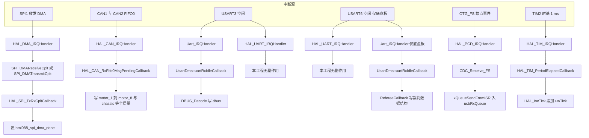
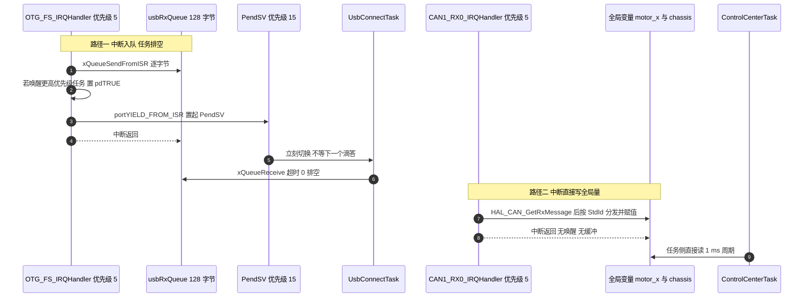

# 本项目中断与 DMA 清单

下面把结论收拢成可核对的清单：每一个中断服务函数的来源、优先级、回调落点，以及它是否真的会触发。

一条中断从产生到产生效果要经过六段，清单按这六段组织；末尾给出一张从硬件配置到代码逻辑的排查顺序表。


## 1. 清单怎么读

一条中断从产生到产生效果要经过六段，清单按这六段组织：

1. 中断源：外设侧的中断使能位是否打开。
2. 触发条件：外设的什么事件会置起标志。
3. 向量：哪一号异常，是否在 `NVIC_ISER` 里使能。
4. 优先级：`NVIC_IPR` 里的数值。
5. 处理函数：`Core/Src/stm32f4xx_it.c` 里的函数体，或者是启动文件里的 `Default_Handler`。
6. 回调与应用函数：HAL 的回调函数指针，以及最终被写到的数据。

前四段是配置，后两段是代码。清单里任何一段为空，中断就不会产生预期的效果。

## 2. 中断服务函数总表

`Core/Src/stm32f4xx_it.c` 共 372 行，实现了 14 个外设中断服务函数与 6 个内核异常处理函数。两份板子的这个文件只在 `USART6_IRQHandler` 一处不同。

| 中断源 | 向量 | 优先级 | 位置 | 处理函数内容 | 会触发吗 | 回调落点 |
| --- | --- | --- | --- | --- | --- | --- |
| USART3 空闲检测 | `USART3_IRQn` | 5 | `stm32f4xx_it.c` | `Uart_IRQHandler(&huart3)` 再 `HAL_UART_IRQHandler(&huart3)` | 会 | `UsartDma::uartRxIdleCallback()` → `DBUS_Decode()` |
| USART6 空闲检测 | `USART6_IRQn` | 5 | `stm32f4xx_it.c` | 云台板只有 `HAL_UART_IRQHandler(&huart6)`；底盘板前面还有 `Uart_IRQHandler(&huart6)` | 底盘板会 | 底盘板 `RefereeCallback()` |
| CAN1 收 FIFO0 | `CAN1_RX0_IRQn` | 5 | `stm32f4xx_it.c` | `HAL_CAN_IRQHandler(&hcan1)` | 会 | `HAL_CAN_RxFifo0MsgPendingCallback()` |
| CAN1 收 FIFO1 | `CAN1_RX1_IRQn` | 5 | `stm32f4xx_it.c` | `HAL_CAN_IRQHandler(&hcan1)` | 不会 | 未激活 FIFO1 通知 |
| CAN2 收 FIFO0 | `CAN2_RX0_IRQn` | 5 | `stm32f4xx_it.c` | `HAL_CAN_IRQHandler(&hcan2)` | 会 | `HAL_CAN_RxFifo0MsgPendingCallback()` |
| CAN2 收 FIFO1 | `CAN2_RX1_IRQn` | 5 | `stm32f4xx_it.c` | `HAL_CAN_IRQHandler(&hcan2)` | 不会 | 未激活 FIFO1 通知 |
| USART3 接收 DMA | `DMA1_Stream1_IRQn` | 5 | `stm32f4xx_it.c` | `HAL_DMA_IRQHandler(&hdma_usart3_rx)` | 不会 | 自写启动函数没有打开任何流中断 |
| USART6 接收 DMA | `DMA2_Stream1_IRQn` | 5 | `stm32f4xx_it.c` | `HAL_DMA_IRQHandler(&hdma_usart6_rx)` | 不会 | 同上 |
| SPI1 接收 DMA | `DMA2_Stream2_IRQn` | 5 | `stm32f4xx_it.c` | `HAL_DMA_IRQHandler(&hdma_spi1_rx)` | 会 | `SPI_DMAReceiveCplt()` → `HAL_SPI_TxRxCpltCallback()` |
| SPI1 发送 DMA | `DMA2_Stream3_IRQn` | 5 | `stm32f4xx_it.c` | `HAL_DMA_IRQHandler(&hdma_spi1_tx)` | 会 | `SPI_DMATransmitCplt()` → `HAL_SPI_TxRxCpltCallback()` |
| USART6 发送 DMA | `DMA2_Stream6_IRQn` | 5 | `stm32f4xx_it.c` | `HAL_DMA_IRQHandler(&hdma_usart6_tx)` | 不会 | `Uart_Transmit_DMA()` 全工程无人调用 |
| USB 端点事件 | `OTG_FS_IRQn` | 5 | `stm32f4xx_it.c` | `HAL_PCD_IRQHandler(&hpcd_USB_OTG_FS)` | 会 | `CDC_Receive_FS()` |
| TIM2 时基 | `TIM2_IRQn` | 15 | `stm32f4xx_it.c` | `HAL_TIM_IRQHandler(&htim2)` | 会 | `HAL_TIM_PeriodElapsedCallback()` → `HAL_IncTick()` |
| TIM10 更新 | `TIM1_UP_TIM10_IRQn` | 5 | `stm32f4xx_it.c` | `HAL_TIM_IRQHandler(&htim10)` | 不会 | 计数未启动，更新中断使能位为 0 |
| 内核异常 | `NMI`、`HardFault`、`MemManage`、`BusFault`、`UsageFault`、`DebugMon` | 由硬件固定 | `stm32f4xx_it.c` | 死循环 | 只在故障时 | 无 |
| 上下文切换 | `PendSV_IRQn` | 15 | 不在 `it.c` | `xPortPendSVHandler` | 会 | 内核 |
| 系统滴答 | `SysTick_IRQn` | 15 | 不在 `it.c` | `xPortSysTickHandler` | 会 | 内核 |

表里"不会触发"的五个向量有一个共同点：NVIC 使能位都置起了，缺的是外设侧的中断使能位或者触发条件。这类配置比"没写处理函数"更难发现，因为调试器里 `NVIC_ISER` 看起来是正常的。

### 2.1 六个内核异常处理函数

`NMI_Handler`、`HardFault_Handler`、`MemManage_Handler`、`BusFault_Handler`、`UsageFault_Handler` 的函数体都是 `while (1) {}`，`DebugMon_Handler` 是空函数。这五个死循环没有打印、没有保存现场，命中时唯一的线索是调试器里读出的故障寄存器（`CFSR`、`HFSR`、`BFAR`）。

`HardFault_Handler` 在  有一处 `USER CODE` 空位，可以在那里插入现场保存代码。

### 2.2 两份板子的差异

| 位置 | 云台板 | 底盘板 |
| --- | --- | --- |
| `USART6_IRQHandler` | 只有 `HAL_UART_IRQHandler(&huart6)` | 前面增加 `Uart_IRQHandler(&huart6)` |
| `main()` 里的实例注册 | 只有 `huart3` | `huart3` 与 `huart6` |
| `main()` 里的 `HAL_Delay(50)` | 没有 | 在 `MX_USB_DEVICE_Init()` 与 `BSP_CAN_Init()` 之间 |
| 其余中断配置 | 与底盘板一致 | 与云台板一致 |

云台板的 `USART6` 初始化了（波特率 115200、收发模式、两条 DMA 流都已配好），但没有注册 `UsartDma` 实例，也没有在 `it.c` 里接自定义处理。它的 `USART6_IRQn` 是使能的，可是 `IDLEIE` 从未置起，因此不会产生中断；两条 DMA 流同样没有被启动。

## 3. 从向量到应用函数的调用链

### 3.1 全工程中断源拓扑



### 3.2 两条跨上下文路径的对照



两条路径的差别在 01-FreeRTOS 单元里核算过：队列路径有同步、有缓冲、有唤醒；CAN 路径三样都没有，靠"单字段天然原子"和"周期任务定时读"维持。本单元只确认调用链的落点：CAN 的回调在 `BSP/Src/bsp_can.cpp` 开始，USB 的回调在 `USB_DEVICE/App/usbd_cdc_if.c` 开始。

### 3.3 唯一一处 FromISR

全工程应用代码里调用 `FromISR` 版本 API 的位置只有一处：

```c
/* USB_DEVICE/App/usbd_cdc_if.c（节选） */
static int8_t CDC_Receive_FS(uint8_t* Buf, uint32_t *Len)
{
  BaseType_t xHigherPriorityTaskWoken = pdFALSE;
  ...
  if (xQueueSendFromISR(usbRxQueue,
                        &Buf[i],
                        &xHigherPriorityTaskWoken) != pdPASS) {}
  ...
  portYIELD_FROM_ISR(xHigherPriorityTaskWoken);
  return USBD_OK;
}
```

它成立的前提是 `OTG_FS_IRQn` 的数值 5 不低于 FreeRTOS 的 `configLIBRARY_MAX_SYSCALL_INTERRUPT_PRIORITY`。其余中断的处理函数都不调用内核 API，所以优先级取 5 对它们只是统一配置，没有语义约束。

### 3.4 SPI 路径上的中断密度

`BMI088::readRawData()` 在一次读操作里发起三次 DMA 传输：加速度计 6 字节、陀螺仪 8 字节、温度 2 字节（`BMI088/Src/BMI088.cpp`）。`HAL_SPI_TransmitReceive_DMA()` 会在收发两条流上都打开 TC 中断（`Drivers/STM32F4xx_HAL_Driver/Src/stm32f4xx_hal_dma.c` 的 `DMA_IT_TC`），所以每次传输最多产生两次 DMA 中断，用户回调落在其中一条流的完成处理里。

`ImuTask` 的循环是 1 ms 一次（`Task/Src/ImuTask.cpp` 的 `DWT_Delay_ms(1)`），每次循环调用 `BMI088_Read()` 一遍。按三次传输、每次两条流计算，SPI 的 DMA 中断密度在每秒六千次量级。这是本工程中断密度最高的一条路径，也是把 DMA 流优先级设为"最高"与"高"的原因。

### 3.5 TIM2 的时基链

`TIM2_IRQHandler` 调用 `HAL_TIM_IRQHandler(&htim2)`，后者在更新事件上调用弱回调 `HAL_TIM_PeriodElapsedCallback()`，本工程的实现只做一件事：

```c
/* Core/Src/main.c（节选） */
void HAL_TIM_PeriodElapsedCallback(TIM_HandleTypeDef *htim)
{
  if (htim->Instance == TIM2)
  {
    HAL_IncTick();
  }
}
```

这一条链路支撑 `HAL_GetTick()`，也支撑上一页里 `BMI088` 的等待超时与 SP 单元的 `HAL_Delay()`。它的优先级是 15，低于所有外设中断：优先级 5 的 ISR 里调用 `HAL_GetTick()` 不会看到时间前进。

## 4. 中断不进来时的排查顺序

一次典型的 CAN 故障能说明这个顺序：两块 CAN 都无法进入回调、无法发送，而代码层面逐项核对都正常，最后定位到时钟树被改动、波特率计算随之出错。排查顺序可以固化成下面这张表，它按"从硬件配置到代码逻辑"排列，前面几项便宜且容易漏。

| 顺序 | 检查项 | 用什么确认 | 该案例 |
| --- | --- | --- | --- |
| 1 | 外设与总线时钟 | `.ioc` 与 `RCC` 相关寄存器，确认 APB 频率 | 根因：APB1 频率与原计算不符 |
| 2 | GPIO 复用配置 | 引脚是否在 MspInit 里配成对应复用功能 | 正常 |
| 3 | 外设初始化顺序与参数 | 波特率、位时序、过滤器等寄存器值 | 波特率数值与实际不符 |
| 4 | 外设中断使能位 | 例如 `CAN_IER.FMPIE0`、`CR1.IDLEIE`、`CR.TCIE` | `HAL_CAN_ActivateNotification()` 已正确调用 |
| 5 | NVIC 使能位与优先级 | `NVIC_ISER` 与 `NVIC_IPR` | 正常 |
| 6 | 向量表入口与函数体 | 调试器在函数首行下断点 | 函数存在且逻辑正确 |
| 7 | 标志清零 | 不清标志会反复进入；清错标志会漏事件 | 正常 |

故障报告里的结论在这里落地：代码能正常编译运行不代表外设配置正确。本单元的五页里，"不会触发"的五个向量都是第 4 类问题，第 5 类问题在本工程没有出现。

关于波特率的数值，报告里按 `Prescaler = 2`、`BS1 = 15TQ`、`BS2 = 5TQ` 算出 857142 Hz。这个结果对应 APB1 为 36 MHz：$36\ \text{MHz} / (2 \times 21) \approx 857\ \text{kHz}$。当前工程的 APB1 为 42 MHz，同样的位时序得到

$$f_{\text{CAN}} = \frac{42\ \text{MHz}}{2 \times (1 + 15 + 5)} = 1\ \text{Mbps}$$

两个数字的差别来自 APB1 频率，而不是位时序参数。这条对账关系在改动时钟树或 CAN 位时序时都要重算一次。

## 5. 易错点

1. 只看 `NVIC_ISER` 就判断中断已就绪。本工程有五个向量的 NVIC 使能位是 1 但永远不会触发。
2. 在同一号向量的处理函数里判断来源。`CAN1_RX0_IRQn` 与 `CAN1_RX1_IRQn` 都调用 `HAL_CAN_IRQHandler(&hcan1)`，区分发生在 HAL 内部检查标志位这一步。
3. 在 `it.c` 里加长逻辑。HAL 的处理函数已经把分发做完，用户代码应当放在回调里，而不是在 `HAL_xxx_IRQHandler()` 前后塞入延时或打印。
4. 忘记 `USER CODE` 区的位置约束。`it.c` 里的空位有 `USER CODE BEGIN x 0` 与 `USER CODE BEGIN x 1` 两处，分别对应 HAL 调用之前与之后；把自定义调用写在区内，重新生成代码时才会被保留。
5. 把 `HAL_Delay()` 当时间函数在 ISR 里用。它依赖 TIM2（数值 15），在数值 5 的 ISR 里不会前进。
6. 认为 `DMA` 的中断一定来自 DMA 向量。SPI 的用户回调虽然由 DMA 流触发，但 `SPI1_IRQn` 在本工程完全没有使能，也不需要。
7. 用 `HAL_IncTick()` 之外的路径推进 `uwTick`。一旦改动 `HAL_TIM_PeriodElapsedCallback()` 里的判断，所有依赖 `HAL_GetTick()` 的超时都会失效。

## 6. 小结

### 6.1 核心概念

- `it.c` 里 14 个外设中断服务函数都是"一行转发"，逻辑全部在 HAL 与回调里。
- 全部外设中断（包括 DMA 流）的优先级都是 5，`PendSV` 与 TIM2 时基是 15。
- 会触发的路径有六条：USART3 空闲、CAN1 RX0、CAN2 RX0、SPI1 收发 DMA、USB 端点、TIM2 时基；底盘板另有 USART6 空闲。
- 五个向量配置了但不会触发：两个串口接收 DMA 流（自写启动不带中断）、两个 CAN FIFO1、TIM10、以及未启用的 USART6 发送 DMA 流。
- 跨上下文的接口只有 USB 入站一处使用队列与 `FromISR`；CAN 与串口都在中断里直接写全局变量。
- 本工程中断密度最高的是 SPI1 的 DMA 完成路径，每秒六千次量级。
- 中断不触发时按"时钟、复用、外设参数、外设中断使能位、NVIC、处理函数、标志清零"的顺序查。

### 6.2 设计权衡

| 决策 | 好处 | 代价 |
| --- | --- | --- |
| 处理函数只做转发 | `it.c` 与 CubeMX 生成结果保持一致，重新生成不丢代码 | 每条链路都要跨三个文件才能读完，阅读成本高 |
| 全部外设为优先级 5 | 配置统一，ISR 里可安全调用 `FromISR` API | 六个来源互不抢占，SPI 的 DMA 中断会推迟 CAN 与串口 |
| 自写 DMA 启动函数不打开流中断 | USART3 只由 IDLE 一个中断驱动，时序简单 | `DMA1_Stream1_IRQn` 与 `DMA2_Stream1_IRQn` 的 NVIC 配置成为无用配置，容易误导排查 |
| 中断里直接写全局量（CAN 与串口） | 延迟最低，不需要队列与唤醒 | 多字段一致性无保证，且没有丢包计数 |
| 中断入队（USB） | 有缓冲、有背压、有唤醒 | 增加 208 字节堆空间与一次任务切换 |

结论：这份清单的价值在于把"配置"和"实际发生"分开。本工程有六个中断源在跑、五个向量配置了但不触发，二者的差别只能靠"外设侧中断使能位"这一列区分。改动任何一路中断前，先确认它在清单里的分类，再决定要动的是 NVIC、外设寄存器还是回调函数。

## 7. 练习

### 基础题

1. 列出 `it.c` 里全部 14 个外设中断服务函数及其向量，并标出哪些是"一行转发"。
2. 指出五个配置了但不会触发的向量，并分别说明缺的是哪一段。
3. 说明 `CAN1_RX0_IRQn` 与 `CAN1_RX1_IRQn` 为什么可以调用同一个处理函数。
4. 写出从 `TIM2_IRQn` 到 `HAL_GetTick()` 返回值的完整调用链。

### 挑战题

5. 为"五个不触发向量"逐个写出让它们开始触发所需的最小改动，并指出每个改动会影响哪些已有时序。
6. 把本工程的六条中断路径按"每秒中断次数"从高到低排序，给出估算依据，并指出哪一条最适合改成 DMA 传输完成中断之外的方式（例如定时器轮询）。
7. 设计一份中断健康面板。要求能暴露每个向量的调用计数与最近一次调用时刻，并说明计数变量放在哪里、如何区分"从未调用"与"计数溢出"两个状态。

## 附：本页引用的固件路径

| 路径 | 用途 |
| --- | --- |
| `2026OmniSentryGimbal/Core/Src/stm32f4xx_it.c` | 内核异常与外设中断的全部服务函数 |
| `2026OmniSentryGimbal/Core/Src/main.c` | 时基回调、实例注册 |
| `2026OmniSentryGimbal/Core/Src/dma.c` | 五个 DMA 向量 |
| `2026OmniSentryGimbal/Core/Src/can.c` | CAN 四个向量 |
| `2026OmniSentryGimbal/Core/Src/tim.c` | TIM10 配置与向量 |
| `2026OmniSentryGimbal/BSP/Src/bsp_can.cpp` | 通知激活与 FIFO0 回调 |
| `2026OmniSentryGimbal/BMI088/Src/BMI088.cpp` | 三次 DMA 读、完成回调 |
| `2026OmniSentryGimbal/Task/Src/ImuTask.cpp` | 1 ms 循环 |
| `2026OmniSentryGimbal/USB_DEVICE/App/usbd_cdc_if.c` | `CDC_Receive_FS` 与 `FromISR` |
| `2026OmniSentryGimbal/Drivers/STM32F4xx_HAL_Driver/Src/stm32f4xx_hal_dma.c` | `HAL_DMA_Start_IT()` 打开的流中断、中止说明 |
| `2026OmniSentryChassis/Core/Src/stm32f4xx_it.c` | `USART6_IRQHandler` 接入自定义处理 |
| `2026OmniSentryChassis/Core/Src/main.c` | 两个实例注册与 `HAL_Delay(50)` |
| `can通信波特率问题.md` | CAN 故障的排查过程与排查顺序 |
