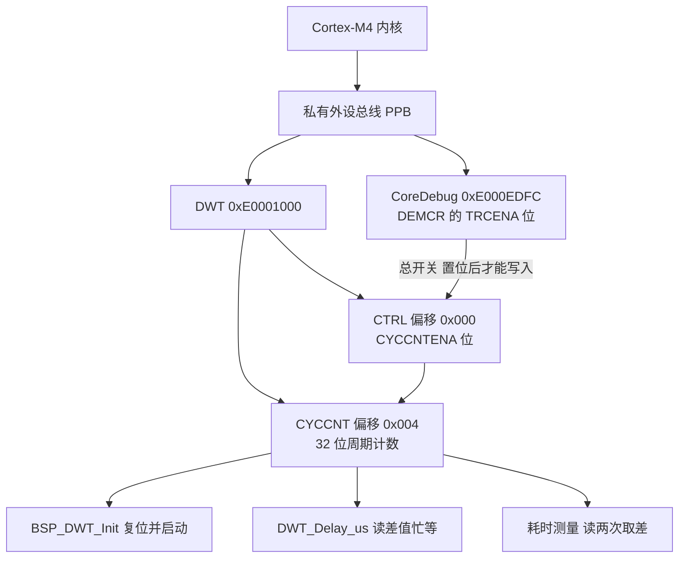
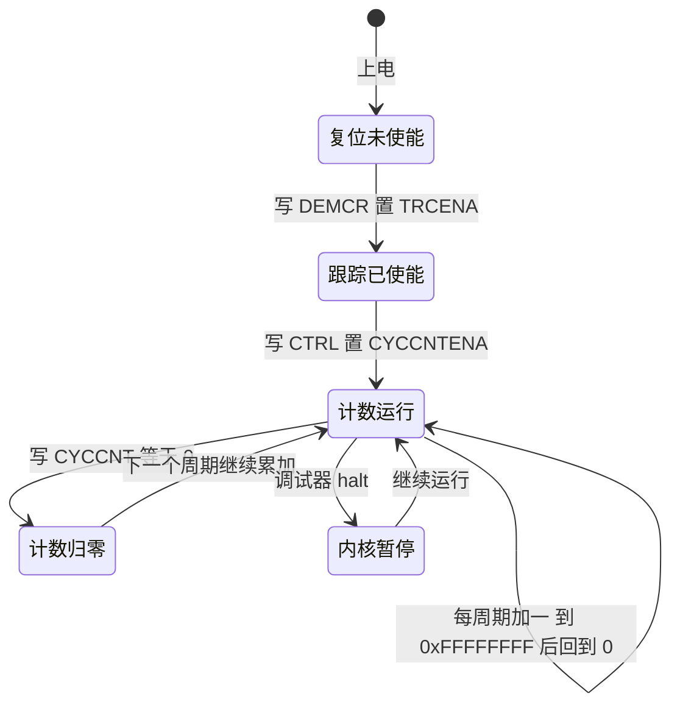
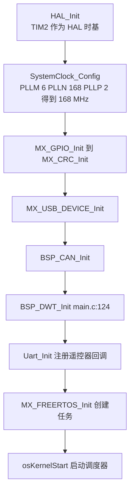

# DWT 与 CYCCNT

> 本工程有两套计时设施：HAL 的 1 ms 时基与 FreeRTOS 的 1 kHz 节拍。需要比毫秒更细的时间读数时，代码用的是内核里的 DWT 周期计数器。
>
> 本文说明 `CYCCNT` 的使能与量程，核对 `BSP/Src/bsp_dwt.cpp` 的五个函数、`Core/Src/main.c` 的调用点，并给出构建产物里的实测符号。固件源码位于 `/home/wyx/rm/2026SentriOmeniGimbal/2026OmniSentryGimbal`，两块板的 `bsp_dwt.cpp` 逐字节一致。

## 1. 概念：CYCCNT 在内核的哪一层

DWT（Data Watchpoint and Trace）是 Cortex-M 调试子系统的一部分，与 ITM、FPB、TPIU 同属 CoreSight 组件。CMSIS 把它封装成结构体指针，基地址固定在私有外设总线上：

```c
/* Drivers/CMSIS/Include/core_cm4.h:1552,1564 与 :907 */
#define DWT_BASE            (0xE0001000UL)                            /*!< DWT Base Address */
#define DWT                 ((DWT_Type       *)     DWT_BASE      )   /*!< DWT configuration struct */

__IOM uint32_t CYCCNT;                 /*!< Offset: 0x004 (R/W)  Cycle Count Register */
```

三个寄存器的位置与作用：

| 寄存器 | 地址 | 与本工程相关的位 |
| --- | --- | --- |
| `CoreDebug->DEMCR` | 0xE000EDFC | bit24 `TRCENA`，DWT 的总开关 |
| `DWT->CTRL` | 0xE0001000 | bit0 `CYCCNTENA` 启动计数；bit25 `NOCYCCNT` 只读，表示内核是否实现该计数器 |
| `DWT->CYCCNT` | 0xE0001004 | 32 位自由运行计数，读一次得到当前周期数 |



`CYCCNT` 数的是内核时钟周期。本工程 AHB 分频为 1（`Core/Src/main.c:184` 的 `AHBCLKDivider = RCC_SYSCLK_DIV1`），HCLK 与内核时钟同为 168 MHz，一个计数就是 $1/168\,\text{MHz} = 5.952\ \text{ns}$。

## 2. 机制：使能顺序与状态迁移

初始化只有三步，顺序不能换：

```c
/* BSP/Src/bsp_dwt.cpp:7-22 */
uint8_t BSP_DWT_Init(void)
{
    // 1. 使能 DWT
    CoreDebug->DEMCR |= CoreDebug_DEMCR_TRCENA_Msk;

    // 2. 复位计数器
    DWT->CYCCNT = 0;

    // 3. 启动 CYCCNT
    DWT->CTRL |= DWT_CTRL_CYCCNTENA_Msk;

    // 4. 检查是否正常运行（CYCCNT 是否变化）
    uint32_t c1 = DWT->CYCCNT;
    uint32_t c2 = DWT->CYCCNT;
    return (c2 == c1);  // 0=成功, 1=失败
}
```

`TRCENA` 是调试跟踪的总开关。它为 0 时，对 `DWT->CTRL` 的写入不生效，`CYCCNTENA` 位保持 0，计数器不动。第 2 步与第 3 步的先后不影响结果，计数器未启动时也能写入 `CYCCNT`。



`NOCYCCNT` 为 1 表示内核没有实现周期计数器，此时写 `CYCCNTENA` 无效。本工程用的是 STM32F407，该位为 0。

## 3. 落到本项目

### 3.1 调用点在时钟配置之后



云台板 `BSP_DWT_Init()` 位于 `Core/Src/main.c:124`，在 `SystemClock_Config()`（同文件 :102）之后。这个位置保证 `HAL_RCC_GetHCLKFreq()` 已经返回 168 000 000，延时函数里的频率换算才有正确的基数。底盘板的调用点在 `Core/Src/main.c:129`，相对位置相同。

### 3.2 三个时间源的分工

| 时间源 | 位宽与时钟 | 中断周期 | 自由运行时的回绕 | 中断优先级 | 用途 |
| --- | --- | --- | --- | --- | --- |
| DWT `CYCCNT` | 32 位，168 MHz | 无中断 | 25.57 s | 无 | 微秒延时、耗时测量 |
| TIM2 | 32 位，计数器 1 MHz | 1 ms | 计数器 71.6 min | 15 | HAL 时基 `uwTick` |
| SysTick | 24 位，168 MHz | 1 ms | 99.86 ms | 15 | FreeRTOS 的 1 kHz 节拍 |

TIM2 的优先级来自 `Core/Inc/stm32f4xx_hal_conf.h:151` 的 `TICK_INT_PRIORITY = 15`，在 `Core/Src/stm32f4xx_hal_timebase_tim.c:100` 写入 NVIC。SysTick 的优先级取 `configKERNEL_INTERRUPT_PRIORITY`（`Core/Inc/FreeRTOSConfig.h:114`，由 `configLIBRARY_LOWEST_INTERRUPT_PRIORITY = 15` 左移得到），在 `portable/GCC/ARM_CM4F/port.c:363` 写入。其余外设中断（CAN、DMA、USART、TIM10）的数值都是 5，与 `configLIBRARY_MAX_SYSCALL_INTERRUPT_PRIORITY = 5`（同文件 :110）相接。

优先级数值 15 低于 5，HAL 的 tick 中断不会打断 CAN 接收，也不会在 FreeRTOS 临界区里抢占。三条时基互不依赖，DWT 这一条完全不经过中断向量表。

### 3.3 量程与回绕

计数器从 0 数到 `0xFFFFFFFF` 再回到 0，周期是：

$$T_{\text{wrap}} = \frac{2^{32}}{168 \times 10^6} = 25.5653 \ \text{s}$$

`CYCCNT` 因此只适合表示 25.57 s 以内的间隔。`DWT_Delay_us` 用无符号减法 `(DWT->CYCCNT - start) < cycles` 规避回绕：只要间隔小于 $2^{32}$ 个周期，差值与中途是否跨过一次回绕无关。`DWT_GetMicroseconds()` 换算的是计数器绝对值，量程同样是 25.57 s，超过之后从头开始，所以它不能当系统运行时间使用。

### 3.4 链接后留下的函数

`bsp_dwt.h` 声明了六个函数，最终镜像里只有三个。构建使用 `-fdata-sections -ffunction-sections`（`cmake/gcc-arm-none-eabi.cmake:29`）加 `-Wl,--gc-sections`（同文件 :41），没有引用的函数会被回收：

```bash
$ arm-none-eabi-nm -S build/Debug/sentriomeni2026.elf | grep -i dwt
08010490 00000030 T DWT_Delay_ms
08010440 00000050 T DWT_Delay_us
080103ec 00000054 T BSP_DWT_Init
```

| 函数 | 是否进入镜像 | 字节数 | 引用者 |
| --- | --- | --- | --- |
| `BSP_DWT_Init` | 是 | 84 | `Core/Src/main.c:124` |
| `DWT_Delay_us` | 是 | 80 | `BMI088/Src/BMI088.cpp` 与 `DWT_Delay_ms` |
| `DWT_Delay_ms` | 是 | 48 | `Task/Src/ImuTask.cpp:37,100`，`BMI088.cpp:53,94` |
| `DWT_GetCycleCount` | 否 | 无 | 无 |
| `DWT_GetMicroseconds` | 否 | 无 | 无 |
| `DWT_GetSeconds` | 否 | 无 | 无 |

`build/Debug/sentriomeni2026.map` 里能看到 `.text.DWT_GetMicroseconds` 这类行，那部分列出的是各目标文件的输入段，不代表它们进入了最终镜像，全局符号表里没有对应的名字。底盘板的结果相同，地址不同（`BSP_DWT_Init` 在 `0x0800cc88`，`DWT_Delay_us` 在 `0x0800ccdc`）。

## 4. 易错点

| # | 现象或写法 | 后果 | 处理 |
| --- | --- | --- | --- |
| 1 | 只写 `DWT->CTRL \|= CYCCNTENA`，不写 `DEMCR` | `TRCENA` 为 0 时该位写不进去，计数器不动，延时函数立即返回 | 保留 `BSP_DWT_Init` 的三步顺序 |
| 2 | 把 `BSP_DWT_Init` 的返回值当精度判据 | 返回 0 只说明两次相邻读不相等，返回 1 也可能只是内核处在暂停状态 | 返回值可记录，再配合实测延时验证 |
| 3 | 认为 `CYCCNT` 是 64 位 | 超过 25.57 s 的绝对值读数错误 | 用两次读数相减，间隔控制在 25.57 s 内 |
| 4 | 在 `SystemClock_Config` 之前调用延时 | `HAL_RCC_GetHCLKFreq()` 返回复位后的默认频率，换算出的周期数偏小 | 初始化放在时钟配置之后 |
| 5 | 用它做长时间统计或时间戳 | 25.57 s 后归零，时间戳出现回退 | 长间隔用 `HAL_GetTick()` 或软件扩展高位 |
| 6 | 不检查 `NOCYCCNT` | 换到没有实现该计数器的内核上，代码静默失效 | 初始化后读 `DWT->CTRL` 的 bit25 |
| 7 | 认为调试器暂停时计数器继续累加 | 单步或 halt 期间的差值与实际执行时间不符 | 计时区间不要跨越断点 |

第 2 条的具体情况：`c1` 与 `c2` 是两次背靠背的读，168 MHz 下中间至少隔几个周期，正常情况下必然不等，函数返回 0。它只能发现计数器完全不动的极端情况。两个调用点都没有接收返回值，语句写成 `BSP_DWT_Init();`。

第 7 条依据 ARM 对 DWT 的说明：内核进入 halt 状态期间 `CYCCNT` 不递增。本工程没有实测这一条，只作为读数解释的参考。单步执行时计数器只累加被执行到的指令周期，所以单步调试中看到的时间差不等于真实运行耗时。

## 5. 小结

### 核心概念

| 概念 | 要点 |
| --- | --- |
| `TRCENA` | `CoreDebug->DEMCR` 的 bit24，DWT 的总开关 |
| `CYCCNTENA` | `DWT->CTRL` 的 bit0，置位后 `CYCCNT` 每周期加一 |
| `CYCCNT` | 32 位，地址 `0xE0001004`，本工程一个计数 5.952 ns |
| 回绕周期 | $2^{32}/168\,\text{MHz} = 25.5653\ \text{s}$ |
| 差值写法 | 无符号相减，间隔小于 25.57 s 时结果与是否跨回绕无关 |
| 三条时基 | DWT 无中断，TIM2 供 `uwTick`，SysTick 供 FreeRTOS 节拍，后两者优先级都是 15 |
| 链接结果 | 六个函数只有三个进入镜像，另外三个被 `--gc-sections` 回收 |

### 设计权衡

| 决策 | 收益 | 代价 |
| --- | --- | --- |
| 用 DWT 而不是定时器做微秒计时 | 分辨率 5.95 ns，不占中断和外设 | 依赖调试单元的可用性，量程只有 25.57 s |
| 把 DWT 封装成独立 BSP 文件 | 驱动层与任务层不必知道寄存器细节 | 六个接口中三个从未被调用，已被回收 |
| 初始化放在 `main` 的 USER CODE 段 | 不受 CubeMX 重新生成影响 | 依赖 `SystemClock_Config` 的位置，顺序被挪动就出错 |
| HAL 时基改用 TIM2 | SysTick 交给 FreeRTOS，两者节拍互不干扰 | 多占用一个 32 位定时器，优先级与其余外设不一致 |
| 保留初始化自检 | 启动时能发现计数器不动 | 判据粗糙，返回值未被使用 |

## 6. 练习

### 基础题

1. 按第 3.3 节的公式，若 HCLK 变成 84 MHz，`CYCCNT` 的回绕周期是多少秒？
2. 写出本工程一个 `CYCCNT` 计数对应多少纳秒的推导过程。
3. 阅读 `Core/Src/main.c:110-124` 的调用顺序，说明 `BSP_DWT_Init()` 能否放在 `MX_GPIO_Init()` 之前。

### 挑战题

4. 用 `DWT_GetCycleCount()` 把 32 位计数器扩展成 64 位软件计数器：每 1 ms 在 TIM2 的 `HAL_TIM_PeriodElapsedCallback` 里检查一次进位，并说明 168 MHz 下为什么不会漏掉进位。
5. 读 `Drivers/CMSIS/Include/core_cm4.h` 中 `DWT_Type` 的定义，写一段代码记录 `NUMCOMP`、`NOCYCCNT`、`CYCCNTENA` 三个位的值，说明各自含义。
6. 把 `BSP_DWT_Init` 的自检改成可靠版本：等 1 ms 后比较 `CYCCNT` 两次读数之差是否落在 168 000 附近，写出代码并说明哪里会误判。

---

### 附：本页引用的固件路径

| 路径 | 用途 |
| --- | --- |
| `/home/wyx/rm/2026SentriOmeniGimbal/2026OmniSentryGimbal/BSP/Inc/bsp_dwt.h` | 六个接口声明（:15-30） |
| `/home/wyx/rm/2026SentriOmeniGimbal/2026OmniSentryGimbal/BSP/Src/bsp_dwt.cpp` | 初始化与延时实现（:7-59） |
| `/home/wyx/rm/2026SentriOmeniGimbal/2026OmniSentryGimbal/Core/Src/main.c` | 调用点（:124）、时钟配置（:153-192） |
| `/home/wyx/rm/2026SentriOmeniGimbal/2026OmniSentryGimbal/Core/Src/stm32f4xx_hal_timebase_tim.c` | TIM2 时基与优先级（:41-112） |
| `/home/wyx/rm/2026SentriOmeniGimbal/2026OmniSentryGimbal/Core/Inc/stm32f4xx_hal_conf.h` | `TICK_INT_PRIORITY`（:151）、`HSE_VALUE`（:99） |
| `/home/wyx/rm/2026SentriOmeniGimbal/2026OmniSentryGimbal/Core/Inc/FreeRTOSConfig.h` | `configTICK_RATE_HZ`（:64）、中断优先级常量（:110-117） |
| `/home/wyx/rm/2026SentriOmeniGimbal/2026OmniSentryGimbal/Middlewares/Third_Party/FreeRTOS/Source/portable/GCC/ARM_CM4F/port.c` | SysTick 装载与优先级（:363、:695） |
| `/home/wyx/rm/2026SentriOmeniGimbal/2026OmniSentryGimbal/cmake/gcc-arm-none-eabi.cmake` | 回收相关的编译与链接选项（:29、:41） |
| `/home/wyx/rm/2026SentriOmeniGimbal/2026OmniSentryGimbal/build/Debug/sentriomeni2026.elf` | `nm` 实测的函数清单 |
| `/home/wyx/rm/2026SentriOmeniGimbal/2026OmniSentryGimbal/Drivers/CMSIS/Include/core_cm4.h` | `DWT_Type` 与基地址（:907、:1552、:1564） |
| `/home/wyx/rm/2026SentriOmeniChassis/2026OmniSentryChassis/BSP/Src/bsp_dwt.cpp` | 底盘板同源文件 |
| `/home/wyx/rm/2026SentriOmeniChassis/2026OmniSentryChassis/Core/Src/main.c` | 底盘板调用点（:129） |
