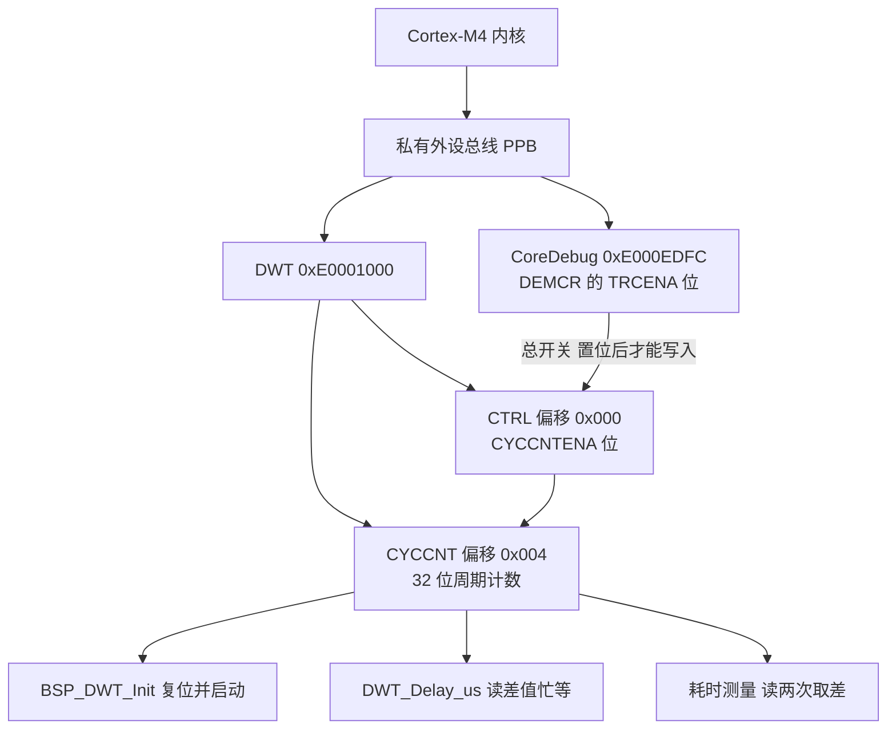
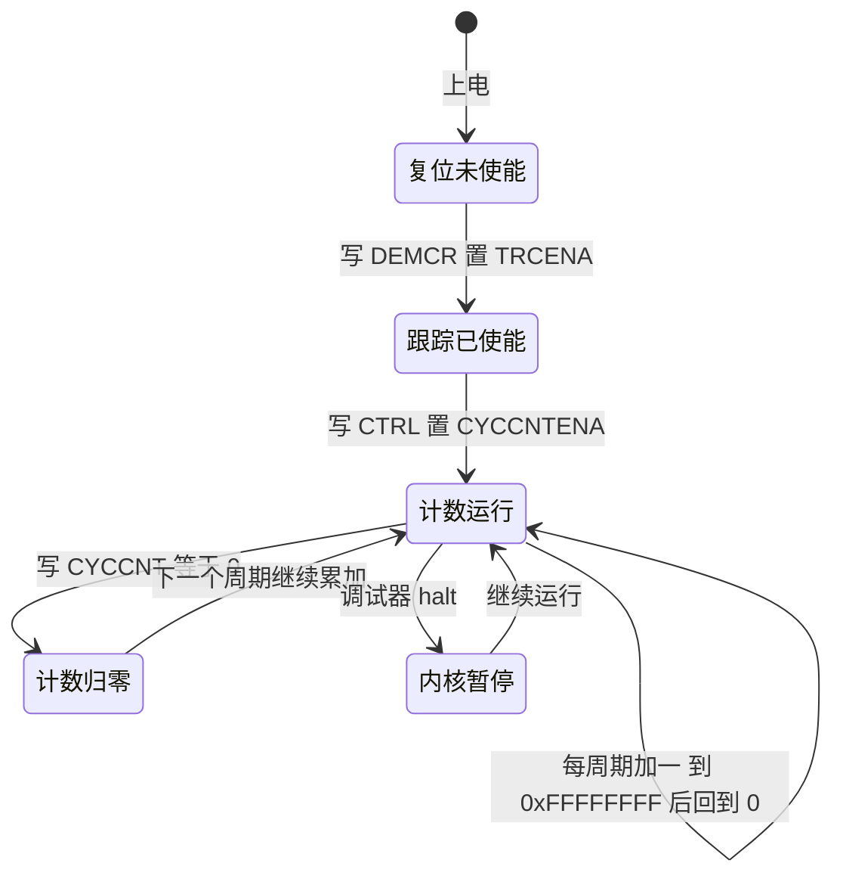
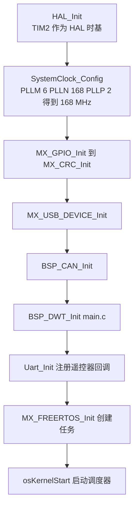

# DWT 与 CYCCNT

> 本工程有两套计时设施：HAL 的 1 ms 时基与 FreeRTOS 的 1 kHz 节拍。需要比毫秒更细的时间读数时，代码用的是内核里的 DWT 周期计数器。
>
> 本文说明 `CYCCNT` 的使能与量程，核对 `BSP/Src/bsp_dwt.cpp` 的五个函数、`Core/Src/main.c` 的调用点，并给出构建产物里的实测符号。固件源码位于 `/home/wyx/rm/2026SentriOmeniGimbal/2026OmniSentryGimbal`，两块板的 `bsp_dwt.cpp` 逐字节一致。

比毫秒更细的时间读数不能靠外设定时器：所有定时器中断都要占向量表、要配 NVIC，还要在中断里维护计数。内核里有一个自由运行的周期计数器，读它不需要中断，也不占任何应用外设。

## 1. CYCCNT 在私有外设总线上的位置

DWT（Data Watchpoint and Trace）是 Cortex-M 调试子系统的一部分，与 ITM、FPB、TPIU 同属 CoreSight 组件。CMSIS 把它封装成结构体指针，基地址固定在私有外设总线上：

```c
/* Drivers/CMSIS/Include/core_cm4.h,1564 与  */
#define DWT_BASE            (0xE0001000UL)                            /*!< DWT Base Address */
#define DWT                 ((DWT_Type       *)     DWT_BASE      )   /*!< DWT configuration struct */

__IOM uint32_t CYCCNT;                 /*!< Offset: 0x004 (R/W)  Cycle Count Register */
```

三个寄存器的位置与作用：

| 寄存器 | 地址 | 与本工程相关的位 |
| --- | --- | --- |
| `CoreDebug->DEMCR` | 0xE000EDFC | bit24 `TRCENA`，DWT 的总开关 |
| `DWT->CTRL` | 0xE0001000 | bit0 `CYCCNTENA` 启动计数；bit25 `NOCYCCNT` 只读，表示内核是否实现该计数器 |
| `DWT->CYCCNT` | 0xE0001004 | 32 位自由运行计数，读一次得到当前周期数 |



这三个地址都在 0xE0000000 起的系统区，与 GPIO、USART、CAN 所在的 AHB/APB 外设区不同。访问它们不经过时钟使能寄存器，也不出现在 CubeMX 的引脚配置里。

## 2. 168 MHz 下一个计数是 5.952 ns

`CYCCNT` 数的是内核时钟周期。本工程 AHB 分频为 1（`Core/Src/main.c` 的 `AHBCLKDivider = RCC_SYSCLK_DIV1`），HCLK 与内核时钟同为 168 MHz，一个计数就是 $1/168\,\text{MHz} = 5.952\ \text{ns}$。

$$\Delta t = \frac{1}{168 \times 10^6}\ \text{s} = 5.952\ \text{ns}$$

这个分辨率是 DWT 相对 HAL 时基的全部价值：`uwTick` 的最小刻度是 1 ms，比它小 5 个数量级。任何短于 1 ms 的耗时测量只能靠 `CYCCNT`。

频率前提还有一层：`CYCCNT` 的计数速率跟着内核时钟走，若时钟树被改成 144 MHz，同一个计数值对应的真实时间也随之变化。延时函数每次调用都重新取 `HAL_RCC_GetHCLKFreq()`，所以换算基数会跟着改，但已经记录的历史数据不会。

## 3. 初始化四步与状态迁移

初始化只有三步，顺序不能换，第四步是自检：

```c
/* BSP/Src/bsp_dwt.cpp */
uint8_t BSP_DWT_Init(void)
{
    // 1. 使能 DWT
    CoreDebug->DEMCR |= CoreDebug_DEMCR_TRCENA_Msk;

    // 2. 复位计数器
    DWT->CYCCNT = 0;

    // 3. 启动 CYCCNT
    DWT->CTRL |= DWT_CTRL_CYCCNTENA_Msk;

    // 4. 检查是否正常运行（CYCCNT 是否变化）
    uint32_t c1 = DWT->CYCCNT;
    uint32_t c2 = DWT->CYCCNT;
    return (c2 == c1);  // 0=成功, 1=失败
}
```

`TRCENA` 是调试跟踪的总开关。它为 0 时，对 `DWT->CTRL` 的写入不生效，`CYCCNTENA` 位保持 0，计数器不动。第 2 步与第 3 步的先后不影响结果，计数器未启动时也能写入 `CYCCNT`。



自检用两次连续读比较，但两次读之间只隔几条指令，正常情况下必然不相等。它只能发现计数器完全不动的情形，发现不了频率错误或方向错误。失败时返回 1，而调用方没有接收返回值，这一点在 `05-易错点与调试.md` 里单列。

## 4. 本工程在时钟配置之后调用



云台板 `BSP_DWT_Init()` 位于 `Core/Src/main.c`，在 `SystemClock_Config()`（同文件 ）之后。这个位置保证 `HAL_RCC_GetHCLKFreq()` 已经返回 168 000 000，延时函数里的频率换算才有正确的基数。底盘板的调用点在 `Core/Src/main.c`，相对位置相同。

调用顺序在 `Core/Src/main.c` 这一段里排在外设初始化之后。若把 `BSP_DWT_Init` 提前到 `SystemClock_Config` 之前，计数器本身仍然能跑（它不看 PLL），但任何在时钟配置完成前发生的延时都会按 HSI 频率换算，等待长度偏离预期。

## 5. 三套时基的分工

| 时间源 | 位宽与时钟 | 中断周期 | 自由运行时的回绕 | 中断优先级 | 用途 |
| --- | --- | --- | --- | --- | --- |
| DWT `CYCCNT` | 32 位，168 MHz | 无中断 | 25.57 s | 无 | 微秒延时、耗时测量 |
| TIM2 | 32 位，计数器 1 MHz | 1 ms | 计数器 71.6 min | 15 | HAL 时基 `uwTick` |
| SysTick | 24 位，168 MHz | 1 ms | 99.86 ms | 15 | FreeRTOS 的 1 kHz 节拍 |

TIM2 的优先级来自 `Core/Inc/stm32f4xx_hal_conf.h` 的 `TICK_INT_PRIORITY = 15`，在 `Core/Src/stm32f4xx_hal_timebase_tim.c` 写入 NVIC。SysTick 的优先级取 `configKERNEL_INTERRUPT_PRIORITY`（`Core/Inc/FreeRTOSConfig.h`，由 `configLIBRARY_LOWEST_INTERRUPT_PRIORITY = 15` 左移得到），在 `portable/GCC/ARM_CM4F/port.c` 写入。其余外设中断（CAN、DMA、USART、TIM10）的数值都是 5，与 `configLIBRARY_MAX_SYSCALL_INTERRUPT_PRIORITY = 5`（同文件 ）相接。

优先级数值 15 低于 5，HAL 的 tick 中断不会打断 CAN 接收，也不会在 FreeRTOS 临界区里抢占。三条时基互不依赖，DWT 这一条完全不经过中断向量表。

## 6. 25.57 s 的量程与回绕

`CYCCNT` 是 32 位向上计数，数满一圈的时间等于

$$T_{\text{wrap}} = \frac{2^{32}}{168 \times 10^6}\ \text{s} = 25.565\ \text{s}$$

回绕本身对差值测量没有影响：无符号减法在跨 0 时仍然给出正确的时间差，前提是两次读之间的间隔小于一个完整回绕周期。超过 25.57 s 的测量需要额外的圈数计数，本工程没有这种需求。

量程是选择计数器时的第一约束。1 ms 的测量窗口占用约 0.004% 的量程，25.57 s 足够覆盖任何单次函数耗时；反过来，若要测量分钟级的过程，DWT 不能单独使用。

## 7. 五个封装函数与链接结果

`BSP/Src/bsp_dwt.cpp` 里一共有五个函数：初始化、两个延时、两个读取。链接后的符号给出了每个函数的实际存在情况：

```bash
$ arm-none-eabi-nm -S build/Debug/sentriomeni2026.elf | grep -i dwt
08010490 00000030 T DWT_Delay_ms
08010440 00000050 T DWT_Delay_us
080103ec 00000054 T BSP_DWT_Init
```

三个符号在，说明 `DWT_Delay_us` 与 `DWT_Delay_ms` 都有调用点（`Task/Src/ImuTask.cpp`、 与 `BMI088/Src/BMI088.cpp` 等）。没有出现的两个读取函数（`DWT_GetCycleCount`、`DWT_GetMicroseconds`）没有调用点，被 `--gc-sections` 回收。`objdump` 里 `DWT_Delay_us` 的地址是 0x08010440，与符号表一致。

回收的判据是符号表而不是源码。源码里有定义、链接后没有符号，就说明没有引用；这两个函数因此属于“可用但当前不可调用”的设施。

## 8. 两块板的二进制一致性

两块板的 `bsp_dwt.cpp` 逐字节一致，初始化顺序与换算公式相同，差别只在调用点的位置和时钟前提。两板都在各自的 `main.c` 里初始化，两块板的 HCLK 都是 168 MHz，因此 1 µs 都是 168 个周期。

一致性带来一个好处：延时与测量的结论在两块板之间可以直接搬用，不需要分板核对换算系数。代价是若某一板的时钟配置被改动，另一板的结论会失效，排查时要先确认当前板的主频。

## 9. NOCYCCNT 与内核实现

`DWT->CTRL` 的 bit25 `NOCYCCNT` 为 1 表示内核没有实现周期计数器，此时写 `CYCCNTENA` 无效，`CYCCNT` 恒为 0。本工程用的是 STM32F407，Cortex-M4 的 DWT 带周期计数器，该位为 0。

这一位是移植到其他内核时的第一检查项。若在 `NOCYCCNT` 为 1 的核上调用延时函数，行为与“未初始化”完全相同：差值恒为 0，循环不返回。

## 10. 易错点

| # | 现象或写法 | 后果 | 处理 |
| --- | --- | --- | --- |
| 1 | 在 `BSP_DWT_Init` 之前调用延时 | 函数不返回 | 保证调用顺序，本工程在 `main.c` |
| 2 | 忽略 `BSP_DWT_Init` 的返回值 | 计数器没起来也照常运行 | 用全局变量承接返回值 |
| 3 | 认为 `CYCCNT` 计数与主频无关 | 时间换算整体偏移 | 先确认 `HAL_RCC_GetHCLKFreq()` 的值 |
| 4 | 用有符号变量存读数差值 | 跨回绕时得到负数 | 统一用 `uint32_t` |
| 5 | 把读取函数当成已链接 | 编译通过，链接后无此符号 | 查 `nm` 输出 |
| 6 | 复位 `CYCCNT` 以清零测量 | 破坏其他使用者的基准 | 只做差值，不复位 |
| 7 | 在时钟配置前测延时 | 按 HSI 换算，等待偏长 | 延时的调用点排在时钟配置之后 |
| 8 | 认为两块板需要分别标定 | 结论重复核对 | 两板 HCLK 相同，结论可搬用 |

## 11. 小结

### 核心概念

| 概念 | 要点 |
| --- | --- |
| 位置 | DWT 在 0xE0001000，属 CoreSight，不占应用外设 |
| 使能 | `DEMCR.TRCENA` 是总开关，`CTRL.CYCCNTENA` 启动计数 |
| 分辨率 | 168 MHz 下 5.952 ns 一个计数 |
| 量程 | 32 位向上计数，25.565 s 回绕，差值法跨回绕仍正确 |
| 调用点 | 云台板 `main.c`、底盘板 `main.c`，都在时钟配置之后 |
| 链接结果 | 三个函数有符号，两个读取函数被回收 |
| 内核前提 | `NOCYCCNT` 为 0 才有周期计数器 |

### 设计权衡

| 决策 | 收益 | 代价 |
| --- | --- | --- |
| 用 DWT 而不是外设定时器 | 不占外设、不进中断、分辨率高 | 依赖调试单元的可用性 |
| 在时钟配置后初始化 | 换算基数正确 | 时钟配置之前的延时不可用 |
| 自检只比较两次读数 | 实现短，能发现完全不动 | 发现不了频率与方向错误 |
| 两板共用同一份实现 | 结论可复用 | 任一板改时钟后结论失效 |
| 读取函数不接入调用点 | 镜像更小 | 想用时需要先加一次引用 |

## 12. 练习

### 基础题

1. 写出 168 MHz 下 1 µs、1 ms、1 s 各自的周期数。
2. 计算 `CYCCNT` 的回绕周期，并说明为什么差值测量在跨回绕时仍然正确。
3. 说明 `DEMCR.TRCENA` 为 0 时写 `DWT->CTRL` 会发生什么。

### 挑战题

4. 写一段代码，在运行时判断 `CYCCNT` 是否可用（考虑 `NOCYCCNT` 与 `TRCENA` 两种情况），并给出返回值语义。
5. 把 `BSP_DWT_Init` 的自检改成能发现频率错误：要求只用 `CYCCNT` 与已知周期数的空循环，说明判据与误判来源。
6. 若把主频从 168 MHz 改成 144 MHz，列出需要改动的源码位置与需要重新测量的历史数据。

## 附：本页引用的固件路径

| 路径 | 用途 |
| --- | --- |
| `/home/wyx/rm/2026SentriOmeniGimbal/2026OmniSentryGimbal/BSP/Src/bsp_dwt.cpp` | 初始化与自检 |
| `/home/wyx/rm/2026SentriOmeniGimbal/2026OmniSentryGimbal/Core/Src/main.c` | 调用点与 AHB 分频 |
| `/home/wyx/rm/2026SentriOmeniGimbal/2026OmniSentryGimbal/Drivers/CMSIS/Include/core_cm4.h` | `DWT_BASE` 与 `CYCCNT` 声明 |
| `/home/wyx/rm/2026SentriOmeniGimbal/2026OmniSentryGimbal/Core/Inc/stm32f4xx_hal_conf.h` | `TICK_INT_PRIORITY` |
| `/home/wyx/rm/2026SentriOmeniGimbal/2026OmniSentryGimbal/Core/Src/stm32f4xx_hal_timebase_tim.c` | TIM2 时基的 NVIC 设置 |
| `/home/wyx/rm/2026SentriOmeniGimbal/2026OmniSentryGimbal/Core/Inc/FreeRTOSConfig.h` | 内核中断优先级 |
| `/home/wyx/rm/2026SentriOmeniGimbal/2026OmniSentryGimbal/Middlewares/Third_Party/FreeRTOS/Source/portable/GCC/ARM_CM4F/port.c` | SysTick 优先级 |
| `/home/wyx/rm/2026SentriOmeniGimbal/2026OmniSentryGimbal/Task/Src/ImuTask.cpp` | 延时调用点 |
| `/home/wyx/rm/2026SentriOmeniGimbal/2026OmniSentryGimbal/BMI088/Src/BMI088.cpp` | 初始化期的短延时 |
| `/home/wyx/rm/2026SentriOmeniGimbal/2026OmniSentryGimbal/build/Debug/sentriomeni2026.elf` | `nm -S` 实测符号 |
| `/home/wyx/rm/2026SentriOmeniChassis/2026OmniSentryChassis/Core/Src/main.c` | 底盘板调用点 |
