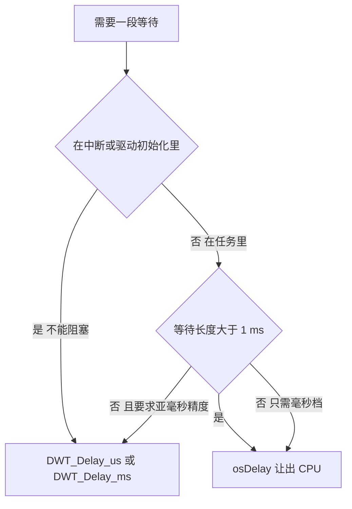
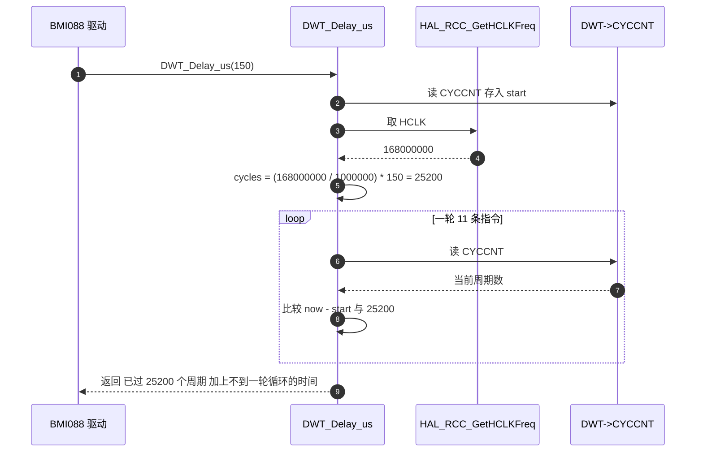

# 微秒级延时的实现与代价

> `BSP/Src/bsp_dwt.cpp` 里两个延时函数一共 32 行。周期数换算、量化误差、溢出边界和 CPU 占用都能从这 32 行里算出来。
>
> 本文按调用点逐条核算：BMI088 初始化期间的 150 µs 短延时与 80 ms 复位延时，以及 `ImuTask` 循环里的 1 ms 忙等。

## 1. 概念：三种等待的定位

| 写法 | 基准 | 分辨率 | 是否让出 CPU | 中断里能否调用 |
| --- | --- | --- | --- | --- |
| `DWT_Delay_us` / `DWT_Delay_ms` | `CYCCNT` | 5.95 ns | 否，纯空转 | 能 |
| `osDelay` | FreeRTOS 节拍 | 1 ms | 是 | 不能 |
| `HAL_Delay` | `uwTick`（TIM2） | 1 ms | 否，忙等 | 能，但不建议 |



判断依据只有两条：能否阻塞，以及精度要求。驱动初始化里不能阻塞，只能忙等；任务里等 1 ms 以上时，忙等会把同优先级任务的时间片一起占掉。

## 2. 机制：周期数换算与量化误差

```c
/* BSP/Src/bsp_dwt.cpp:24-36 */
void DWT_Delay_us(uint32_t us)
{
    uint32_t start = DWT->CYCCNT;
    uint32_t cycles = (HAL_RCC_GetHCLKFreq() / 1000000) * us;

    while ((DWT->CYCCNT - start) < cycles);
}

void DWT_Delay_ms(uint32_t ms)
{
    while (ms--)
        DWT_Delay_us(1000);
}
```

换算分成两步。先取每微秒的周期数：

$$k = \left\lfloor \frac{f_{\text{HCLK}}}{10^6} \right\rfloor = \frac{168\,000\,000}{10^6} = 168$$

再乘以微秒数，得到要等待的周期数 $N = k \cdot us$。168 MHz 下 1 µs 对应 168 个周期，1 ms 对应 168 000 个周期，80 ms 对应 13 440 000 个周期。

```bash
# 调试构建（-O0）下 DWT_Delay_us 的循环体，地址 0x08010466 到 0x0801047c
8010466: ldr  r3, [pc, #32]   @ 装载 DWT 基地址 0xE0001000
8010468: ldr  r2, [r3, #4]    @ 读 CYCCNT
801046a: ldr  r3, [r7, #12]   @ 取 start
801046c: subs r3, r2, r3      @ 无符号差值
801046e: ldr  r2, [r7, #8]    @ 取 cycles
8010470: cmp  r2, r3
8010472: ite  hi
8010474: movhi r3, #1
8010476: movls r3, #0
8010478: uxtb r3, r3
801047a: cmp  r3, #0
801047c: bne.n 8010466
```

循环体是 11 条指令。判断只在每轮结束时做一次，所以实际等待时间落在 $[N, N + \Delta)$ 之间，$\Delta$ 是一轮循环的指令周期数。等待只会偏长，不会偏短。

$N$ 很小时，$\Delta$ 的相对影响变大：请求 1 µs 是 168 个周期，而一轮循环本身就是十几到几十个周期，误差占比可观；请求 150 µs 是 25 200 个周期，$\Delta$ 占比降到千分之几。测量这个误差的做法是用 `CYCCNT` 前后各读一次，把实测周期数与 $N$ 相减，见下一篇。



两点细节：

1. `CYCCNT` 在 `Drivers/CMSIS/Include/core_cm4.h:907` 声明为 `__IOM uint32_t`，即 `volatile`，编译器不会把循环里的读提到循环外，所以空循环不会被优化掉。
2. 循环里每次重新装载基地址，是 `-O0` 的结果。换成 `-O2` 后这条 `ldr` 会被提到循环外，$\Delta$ 随构建类型变化。误差上界与构建类型绑定。

### 2.1 溢出边界

`cycles` 是 `uint32_t`，乘法在 32 位内完成。$168 \cdot us$ 超过 $2^{32}-1$ 时回绕：

$$us \geq \left\lceil \frac{2^{32}}{168} \right\rceil = 25\,565\,282$$

此时 `cycles` 变得很小，函数提前返回。一次调用的安全上限约为 25.57 s，与 `CYCCNT` 的回绕周期一致。`DWT_Delay_ms` 按 1 ms 分段调用，所以毫秒级延时的时长不受这个限制。

## 3. 落到本项目

### 3.1 BMI088 初始化期间的 16 次短延时

`BMI088/Src/BMI088.cpp` 的 `accelInit`（:41-79）与 `gyroInit`（:82-120）结构相同，各有 16 次 150 µs 与 1 次 80 ms：

| 位置 | 次数 | 单次 | 小计 |
| --- | --- | --- | --- |
| 通信检查 `:47,49` | 2 | 150 µs | 0.3 ms |
| 复位后检查 `:57,59` | 2 | 150 µs | 0.3 ms |
| 配置寄存器写后检查 `:70,72` 循环 6 次 | 12 | 150 µs | 1.8 ms |
| 软件复位 `:53` | 1 | 80 ms | 80 ms |
| 单个传感器合计 | 16 次短延时加 1 次长延时 | | 82.4 ms |

两个传感器合起来约 164.8 ms，全部是忙等。这段时间里 `BMI088_Init()` 在 CPU 上独占运行，SPI 传输时间另计。

### 3.2 ImuTask 的两处延时

| 位置 | 参数 | 上下文 | 代价 |
| --- | --- | --- | --- |
| `Task/Src/ImuTask.cpp:37` | `DWT_Delay_ms(1000)` | 任务启动，等传感器稳定 | 168 000 000 个周期，1 s 忙等 |
| `Task/Src/ImuTask.cpp:100` | `DWT_Delay_ms(1)` | 1 kHz 主循环节拍 | 每轮占用 1 ms CPU |

上电后 `ImuTask` 先做 `BMI088_Init()`（约 164.8 ms）加温度环初始化，再忙等 1 s，才进入主循环。它与其他任务同为 `osPriorityNormal`，这段时间里低优先级任务没有机会运行。

主循环的占用率可以直接写出来。设任务周期为 $T$、执行时间为 $T_{\text{exec}}$、忙等为 $T_{\text{wait}}$：

$$\eta_{\text{忙等}} = \frac{T_{\text{exec}} + T_{\text{wait}}}{T}, \qquad \eta_{\text{阻塞}} = \frac{T_{\text{exec}}}{T}$$

`ImuTask` 取 $T_{\text{wait}} = 1\ \text{ms}$，$T$ 略大于 1 ms，占用率接近 100%。换成 `osDelay(1)` 后同一时间片会还给其他任务，代价是采样间隔被 1 ms 的节拍量化，且不再严格等间隔。

## 4. 易错点

| # | 现象或写法 | 后果 | 处理 |
| --- | --- | --- | --- |
| 1 | 在 `BSP_DWT_Init()` 之前调用 `DWT_Delay_us` | `CYCCNT` 恒为 0，差值恒为 0，循环条件永真，函数不返回 | 保证初始化最先执行，本工程在 `main.c:124` |
| 2 | `DWT_Delay_us(25_565_282)` 及更大参数 | 乘法回绕，实际等待远短于预期 | 长延时改用 `DWT_Delay_ms` |
| 3 | 用 `int32_t` 保存 `start` | 相减变成有符号运算，跨 `0xFFFFFFFF` 时结果错误 | 与 `CYCCNT` 一样用 `uint32_t` |
| 4 | 把 `DWT_Delay_us(1)` 当 1 µs 的精确基准 | 实际值等于请求值加不到一轮循环的时间，请求越短相对误差越大 | 用 `CYCCNT` 实测后按需补偿 |
| 5 | 在 Release 构建下沿用调试图的误差结论 | `-O2` 会减少循环指令数，误差上界改变 | 误差按构建类型分别测量 |
| 6 | 在 1 kHz 以上的任务里用忙等做周期 | CPU 占用率接近 100%，同优先级任务被拖慢 | 任务中用 `osDelay`，忙等只留给驱动初始化 |
| 7 | 在中断里做毫秒级忙等 | 中断被拉长，其他中断被延迟或丢失 | 中断里只做微秒级等待 |

第 1 条是本文件里后果最严重的一条：未初始化时 `DWT->CYCCNT` 读到的是 0，`(0 - 0) < cycles` 恒成立（`cycles` 大于 0 时），函数进入死循环。判断方法是接调试器看 PC 是否一直在 `DWT_Delay_us` 内循环，或核对 `DWT->CTRL` 的 bit0。

## 5. 小结

### 核心概念

| 概念 | 要点 |
| --- | --- |
| 周期数换算 | $N = \lfloor f_{\text{HCLK}}/10^6 \rfloor \cdot us$，168 MHz 下 1 µs = 168 周期 |
| 量化误差 | 实际等待在 $[N, N+\Delta)$ 内，$\Delta$ 是一轮循环的指令周期数，只会偏长 |
| 循环体 | 调试构建下 11 条指令，含两次 `CYCCNT` 相关访问与基地址重载 |
| 溢出边界 | $us \geq 25\,565\,282$ 时乘法回绕；`DWT_Delay_ms` 分段调用不受影响 |
| 未初始化 | `CYCCNT` 恒为 0，差值恒为 0，函数不返回 |
| 本工程用例 | BMI088 初始化 164.8 ms，`ImuTask` 启动 1 s 与循环 1 ms |

### 设计权衡

| 决策 | 收益 | 代价 |
| --- | --- | --- |
| 用忙等而不是定时器中断做微秒延时 | 任意上下文可调用，不需要中断和外设 | 独占 CPU，占用率随延时长度线性上升 |
| `DWT_Delay_ms` 复用 `DWT_Delay_us(1000)` | 只有一份换算逻辑，溢出边界天然安全 | 每毫秒重复一次频率读取与函数调用 |
| `ImuTask` 用 1 ms 忙等保采样节拍 | 采样间隔均匀，不依赖节拍量化 | 同优先级任务被拖慢，占用率接近 100% |
| 在循环里重复装载 DWT 基地址（`-O0`） | 便于单步调试，寄存器读写可见 | 每轮多一条 `ldr`，量化步长变长 |
| SPI 短延时统一取 150 µs | 与官方推荐时序一致，不区分数值 | 6 个寄存器的初始化循环里多出 1.8 ms 忙等 |

## 6. 练习

### 基础题

1. 写出 150 µs、1 ms、80 ms 三个延时值在 168 MHz 下对应的周期数。
2. `DWT_Delay_us(1000)` 与 `DWT_Delay_ms(1)` 的结果是否完全一致，说明理由。
3. 若 `DWT_Delay_us` 的参数取 30 000 000，估算实际等待时间并解释原因。

### 挑战题

4. 用 `CYCCNT` 测量 `DWT_Delay_us(1)`、`DWT_Delay_us(10)`、`DWT_Delay_us(1000)` 的实际周期数，画出请求值与实测值的差，解释差值的来源。
5. 把 `ImuTask` 的 1 ms 忙等改成阻塞式等待，同时保持采样间隔尽量均匀：写出改动代码，说明引入的误差量级，并核算 CPU 占用率的变化。
6. 给 `DWT_Delay_us` 增加参数校验与返回值，要求：参数超过安全上限时返回错误而不是静默回绕，计数器未启动时立即返回错误。写出代码并说明如何在初始化阶段判断计数器已启动。

---

### 附：本页引用的固件路径

| 路径 | 用途 |
| --- | --- |
| `/home/wyx/rm/2026SentriOmeniGimbal/2026OmniSentryGimbal/BSP/Src/bsp_dwt.cpp` | 两个延时函数（:24-36） |
| `/home/wyx/rm/2026SentriOmeniGimbal/2026OmniSentryGimbal/BMI088/Src/BMI088.cpp` | 16 次短延时与 2 次长延时（:41-120） |
| `/home/wyx/rm/2026SentriOmeniGimbal/2026OmniSentryGimbal/BMI088/BMI088config.h` | `BMI088_COM_WAIT_SENSOR_TIME = 150`（:207）、`BMI088_LONG_DELAY_TIME = 80`（:206）、寄存器数（:197-198） |
| `/home/wyx/rm/2026SentriOmeniGimbal/2026OmniSentryGimbal/Task/Src/ImuTask.cpp` | 启动延时（:37）与循环延时（:100） |
| `/home/wyx/rm/2026SentriOmeniGimbal/2026OmniSentryGimbal/Task/Src/GimbalTask.cpp` | 同优先级任务的节拍来源 |
| `/home/wyx/rm/2026SentriOmeniGimbal/2026OmniSentryGimbal/build/Debug/sentriomeni2026.elf` | `objdump` 反汇编来源（`DWT_Delay_us` 在 0x08010440） |
| `/home/wyx/rm/2026SentriOmeniGimbal/2026OmniSentryGimbal/cmake/gcc-arm-none-eabi.cmake` | `-O0 -g3` 的调试构建选项（:31） |
| `/home/wyx/rm/2026SentriOmeniGimbal/2026OmniSentryGimbal/Drivers/CMSIS/Include/core_cm4.h` | `CYCCNT` 的 `__IOM` 声明（:907） |
| `/home/wyx/rm/2026SentriOmeniChassis/2026OmniSentryChassis/Task/Src/ImuTask.cpp` | 底盘板的两处延时（:36、:112） |
