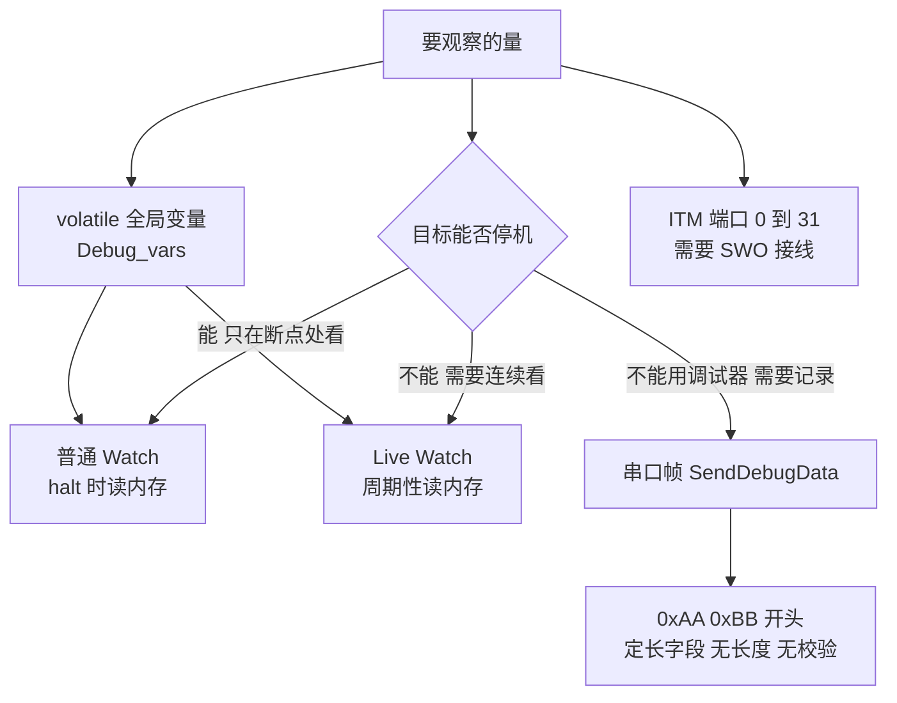
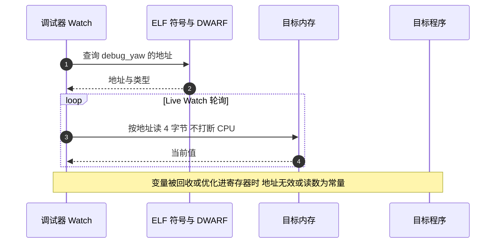

# 在线变量观测

> 不中断程序、不接串口也能看内部状态，靠的是调试器直接读内存：把要观察的量放在不会被优化的全局变量里，再用 Watch 窗口观察。本工程为此准备了两条路，一条是 `Debug_vars` 目录，一条是 `BSP/Src/debug.cpp` 的串口帧。
>
> 本文核对两条路的声明、定义、引用与链接结果，并给出最小可用的改法。核对结论是两条路当前都没有接上，原因各不相同。

在线观测的价值在于不改变被观察程序的时间行为：调试器按地址读内存，CPU 不需要停下来，也不需要多接一根线。代价是变量必须真的存在于镜像里。

## 1. 三条观测通道与各自的物理连接

| 通道 | 物理连接 | 是否需要目标停机 | 本工程状态 |
| --- | --- | --- | --- |
| 调试器 Watch / Live Watch | SWD 调试线 | Live Watch 不需要，普通 Watch 需要 | 变量未被引用，读不到有效地址 |
| 串口二进制帧 | UART（`huart1`，115200） | 不需要 | 发送函数未被调用，且帧格式无校验 |
| ITM / SWO | SWD 的 SWO 引脚 | 不需要 | 未使用 |



三条通道里只有串口帧能在没有调试器的现场使用，代价是要占用一个串口并实现一套帧协议。Watch 通道完全不动代码，但必须有调试器在线。

## 2. 观测生效的条件与帧格式

### 2.1 变量观测依赖三件事

1. 变量有独立的内存位置，不能被优化进寄存器。加 `volatile` 可以阻止编译器把它常驻寄存器，也阻止多次读被合并。
2. 变量进入最终的镜像。构建用 `-fdata-sections` 把每个变量放进独立的段，再用 `-Wl,--gc-sections` 回收没有被引用的段，没有被任何代码引用的变量会被删掉。
3. 调试器知道变量的地址。地址来自 ELF 的符号表与 DWARF 信息，目标运行时按地址读取。

第 2 条是这类机制最常见的失效原因。`volatile` 解决第 1 条，不解决第 2 条。条件 2 与条件 1 分别由链接器与编译器负责，任一条不满足都会让 Watch 看到无效地址或恒定值。

### 2.2 串口帧的定长字段

`BSP/Src/debug.cpp` 的 `SendDebugData(format, ...)` 按格式字符串逐字节打包：

| 格式字符 | 类型 | 字节数 | 取值方式 |
| --- | --- | --- | --- |
| `f` | `float` | 4 | `va_arg(args, double)` 再转 `float` |
| `i` | `int32_t` | 4 | `va_arg(args, int32_t)` |
| `u` | `uint32_t` | 4 | `va_arg(args, uint32_t)` |
| `s` | `int16_t` | 2 | `va_arg(args, int)` 再转 `int16_t` |
| `h` | `uint16_t` | 2 | `va_arg(args, int)` 再转 `uint16_t` |
| `c` | `uint8_t` | 1 | `va_arg(args, int)` 再转 `uint8_t` |

帧结构是两字节头 `0xAA 0xBB` 加按格式字符串顺序排列的定长字段，最后一次性 `HAL_UART_Transmit` 发出。没有长度字段，没有帧序号，没有校验。接收端必须知道发送时用的格式字符串，否则字段边界无从确定。

`f` 分支读 `double` 是正确的：C 的可变参数对 `float` 会做默认实参提升，传进来的是 8 字节 `double`，代码再截断成 4 字节 `float` 打包。

循环的边界条件是 `index < DEBUG_MAX_BUFFER_SIZE - 4`，`DEBUG_MAX_BUFFER_SIZE = 128`（`BSP/Inc/debug.h`）。每轮最多追加 4 字节，所以 `index` 不会超过 127，缓冲区是安全的。超时常量 `DEBUG_UART_TIMEOUT = 100` 在 `BSP/Inc/debug.h`，单位毫秒。

### 2.3 magictools.h 里的 clamp 模板

`BSP/magictools.h` 只有一个 C++ 模板函数：

```cpp
/* BSP/magictools.h */
template <typename T>
inline T clamp(T value, T min_val, T max_val) {
    if (value < min_val) return min_val;
    if (value > max_val) return max_val;
    return value;
}
```

它与在线观测无关，是 PID 里的限幅工具，被 `PID/PidBase.h,52` 与 `Task/Src/GimbalTask.cpp,102` 使用。头文件整体用 `#ifdef __cplusplus` 包住，C 文件包含它时得到空内容。

这个文件被放在 `BSP/` 根目录下，容易被误当作 BSP 的对外接口。核对 BSP 头文件清单时，按文件名把它排除即可。

## 3. 两条观测通道的实际状态

### 3.1 两个同名头文件

仓库里有两个 `debug_vars.h`：

| 路径 | 内容 | 谁包含它 |
| --- | --- | --- |
| `BSP/debug_vars.h` | 空壳，只有宏定义与空的 `extern "C"` 块 | `Task/Src/ImuTask.cpp`、`BSP/Src/bsp_can.cpp,9`、`Communication/Src/dbus.cpp`、`Communication/Src/usart_decode.cpp` |
| `Debug_vars/debug_vars.h` | 注释掉的变量框架与 9 条 `extern` 声明 | 只有 `Debug_vars/debug_vars.cpp` 自己 |

包含结果由编译参数决定：`CMakeLists.txt` 把 `BSP/Inc`与 `BSP`排在 `Debug_vars`之前，而引号包含会先找源文件所在目录。于是除定义变量的 `debug_vars.cpp` 之外，其余文件拿到的都是空壳。真身里的 9 条 `extern` 也全是注释状态，本来声明不了任何东西。

### 3.2 9 个变量的定义与下场

`Debug_vars/debug_vars.cpp` 定义了全部 9 个变量：

| 变量 | 类型 | 初始值 | 段 | 大小 | 是否进入镜像 |
| --- | --- | --- | --- | --- | --- |
| `debug_roll` | `volatile float` | 0.0f | .bss | 4 | 否 |
| `debug_pitch` | `volatile float` | 0.0f | .bss | 4 | 否 |
| `debug_yaw` | `volatile float` | 0.0f | .bss | 4 | 否 |
| `debug_actual_speed` | `volatile float` | -1.0f | .data | 4 | 否 |
| `debug_angle1` | `volatile uint16_t` | 0 | .bss | 2 | 否 |
| `debug_angle2` | `volatile int16_t` | 0 | .bss | 2 | 否 |
| `debug_angle3` | `volatile int16_t` | 0 | .bss | 2 | 否 |
| `debug_angle4` | `volatile int16_t` | 0 | .bss | 2 | 否 |
| `debug_st` | `volatile int16_t` | 0 | .bss | 2 | 否 |

段与大小的依据是 `build/Debug/sentriomeni2026.map` 的输入段列表，例如 `.bss.debug_roll 0x0 0x4` 与 `.data.debug_actual_speed 0x0 0x4`，非零初值的变量进 .data。「是否进入镜像」的依据是最终 ELF：

```bash
$ arm-none-eabi-nm build/Debug/sentriomeni2026.elf | grep -c debug_
0
$ arm-none-eabi-nm build/Debug/sentriomeni2026.elf | grep -iE 'roll|angle1|actual_speed'
$ echo $?
1
```

9 个变量全部被 `--gc-sections` 回收。代码里没有任何一处写它们：`BSP/Src/bsp_can.cpp` 只有一行被注释掉的 `//debug_angle1 = LK_motor_1.rotor_angle;`；`Communication_Summary.md` 说这些量在 `dbus_decode` 里更新，但当前固件的 `Communication/Src/dbus.cpp` 里没有对应的赋值。Watch 窗口因此拿不到有效地址。

### 3.3 串口通道的状态

`debug.cpp` 编译进了两块板，链接结果不同：

| 符号 | 云台板 | 底盘板 | 说明 |
| --- | --- | --- | --- |
| `DebugUART_Init` | 不在镜像 | 32 字节，`0x0800cd5c` | 底盘板 `Task/Src/ImuTask.cpp` 调用过 |
| `s_debug_huart` | 不在镜像 | 4 字节，`0x2000a41c` | 静态指针，被 `DebugUART_Init` 引用后保留 |
| `SendDebugData` | 不在镜像 | 不在镜像 | 两块板都没有调用点 |
| `DebugUART_GetHandle` | 不在镜像 | 不在镜像 | 没有调用点 |

云台板的 `Task/Src/ImuTask.cpp` 包含了 `debug.h`，但没有调用 `DebugUART_Init`，静态指针也没有被保留。即使调用了 `SendDebugData`，函数开头的 `if (s_debug_huart == NULL) return;`也会让它在指针为空时静默返回。

两块板的差别说明引用是逐符号生效的：同一个 `.cpp` 里，被调用的函数与其依赖的静态变量一起留下，没被调用的函数单独消失。

### 3.4 最小可用改法

要让 Watch 读到变量，需要同时满足有声明与被引用：

```cpp
/* Debug_vars/debug_vars.h：把 9 条声明改为生效 */
#ifdef __cplusplus
extern "C" {
#endif
extern volatile float debug_roll;
extern volatile float debug_pitch;
extern volatile float debug_yaw;
#ifdef __cplusplus
}
#endif
```

```cpp
/* 任一处运行期会执行的初始化代码，例如 Core/Src/main.c 的 USER CODE 2 段 */
#include "debug_vars.h"

debug_roll = 0.0f;   /* 一次引用就足以让该段被保留 */
```



改完要重新构建并复查 `nm`，确认符号出现。只改头文件而不加引用，符号仍然不会进镜像。

## 4. 易错点

| # | 现象或写法 | 后果 | 处理 |
| --- | --- | --- | --- |
| 1 | 全局变量没有任何引用 | `--gc-sections` 回收该段，Watch 显示无效地址 | 在初始化代码里引用一次 |
| 2 | 把 `extern` 声明留在注释里 | 其他文件无法引用，变量注定被回收 | 打开声明，或集中到一处管理 |
| 3 | 混用两个同名头文件 | 包含到的是空壳，编译期看不出差别 | 核对 `CMakeLists.txt` 的包含顺序与源文件目录 |
| 4 | 声明与定义的 `volatile` 不一致 | 类型不匹配，跨文件读写行为未定义 | 声明和定义都写 `volatile` |
| 5 | 只用普通 Watch 连续观察 | 普通 Watch 在目标运行时不会刷新 | 连续观察用 Live Watch，并接受几十毫秒的轮询间隔 |
| 6 | 指针为空时调用 `SendDebugData` | 函数静默返回，没有输出也没有报错 | 先调 `DebugUART_Init`，并保留发送计数用于确认 |
| 7 | 用串口帧做长时间记录 | 帧无长度与校验，丢一个字节后无法重新对齐 | 补上长度与校验，或改用 USB CDC 的既有协议 |
| 8 | 在 1 kHz 任务里发调试帧 | `HAL_UART_Transmit` 超时 100 ms，一次阻塞就是上百个控制周期 | 发送放在低频任务里，或改 DMA |
| 9 | 把过期的文档当依据 | `Communication_Summary.md` 描述的更新点在当前固件里不存在 | 以源码与 `nm` 输出为准 |
| 10 | 认为 `volatile` 就能保住变量 | `volatile` 只影响优化，不影响链接期回收 | 引用与 `volatile` 都要有 |

第 8 条的依据是 `BSP/Inc/debug.h` 的 `DEBUG_UART_TIMEOUT = 100`，单位毫秒，作为 `HAL_UART_Transmit` 的最后一个参数。

## 5. 小结

### 核心概念

| 概念 | 要点 |
| --- | --- |
| 在线观测的前提 | 变量有独立内存位置、进入镜像、地址可被调试器解析 |
| `volatile` 的作用范围 | 阻止优化，不阻止 `--gc-sections` 回收 |
| `Debug_vars` 现状 | 9 个变量全部定义，全部被回收；`extern` 声明为注释状态 |
| 两个同名头文件 | `BSP/debug_vars.h` 是空壳且先被包含，真身在 `Debug_vars/` |
| `SendDebugData` 帧 | `0xAA 0xBB` 加定长字段，无长度、无序号、无校验 |
| 串口通道现状 | 云台板两个符号都不在镜像，底盘板只保留初始化函数与静态指针 |
| `magictools.h` | 只有 C++ 的 `clamp` 模板，与观测无关 |

### 设计权衡

| 决策 | 收益 | 代价 |
| --- | --- | --- |
| 用 Watch 变量而不是串口打印 | 不占用外设，不需要协议与上位机 | 必须有调试器连接，无法事后回看 |
| 变量集中在一个 .cpp 里定义 | 命名统一，加变量只改一个文件 | 无引用时整批被回收，问题不易察觉 |
| 串口帧用格式字符串描述类型 | 实现简单，省掉结构体定义 | 无长度与校验，收发两端必须共享格式字符串 |
| `SendDebugData` 用阻塞发送 | 不需要 DMA 与环形缓冲 | 超时 100 ms，放在高频任务里会拖慢控制 |
| 保留空的 `BSP/debug_vars.h` | 旧的包含路径仍能编译通过 | 两个同名头文件容易混用，编译期无提示 |

## 6. 练习

### 基础题

1. 用 `arm-none-eabi-nm` 核对 `debug_roll` 是否在某个 ELF 里，写出命令与判据。
2. `volatile` 与 `--gc-sections` 各自解决什么问题，为什么两者都不能单独保证变量可被观察？
3. 说明 `SendDebugData("ffi", a, b, c)` 生成的帧长度，以及接收端如何确定第三个字段的位置。

### 挑战题

4. 给 `Debug_vars` 加一个心跳变量：每 1 ms 自增一次，用 Live Watch 确认刷新，并说明为什么普通 Watch 验证不了。
5. 设计一版带长度与校验的调试帧：给出帧头、长度、序号、载荷、校验的字段布局，写出收发两端的处理流程，并说明接收端丢字节后如何恢复同步。
6. 把 `SendDebugData` 改成非阻塞实现：用 DMA 加环形缓冲，给出缓冲区大小的估算方法与溢出策略，说明在 1 kHz 任务里调用时的最坏阻塞时间。

---

### 附：本页引用的固件路径

| 路径 | 用途 |
| --- | --- |
| `/home/wyx/rm/2026SentriOmeniGimbal/2026OmniSentryGimbal/BSP/debug_vars.h` | 空壳头文件 |
| `/home/wyx/rm/2026SentriOmeniGimbal/2026OmniSentryGimbal/Debug_vars/debug_vars.h` | 注释掉的声明框架 |
| `/home/wyx/rm/2026SentriOmeniGimbal/2026OmniSentryGimbal/Debug_vars/debug_vars.cpp` | 9 个变量的定义 |
| `/home/wyx/rm/2026SentriOmeniGimbal/2026OmniSentryGimbal/BSP/Inc/debug.h` | 超时与缓冲区常量、`SendDebugData` 声明 |
| `/home/wyx/rm/2026SentriOmeniGimbal/2026OmniSentryGimbal/BSP/Src/debug.cpp` | 帧打包与发送 |
| `/home/wyx/rm/2026SentriOmeniGimbal/2026OmniSentryGimbal/BSP/magictools.h` | `clamp` 模板 |
| `/home/wyx/rm/2026SentriOmeniGimbal/2026OmniSentryGimbal/CMakeLists.txt` | 包含路径顺序 |
| `/home/wyx/rm/2026SentriOmeniGimbal/2026OmniSentryGimbal/cmake/gcc-arm-none-eabi.cmake` | `-fdata-sections` 与 `--gc-sections` |
| `/home/wyx/rm/2026SentriOmeniGimbal/2026OmniSentryGimbal/BSP/Src/bsp_can.cpp` | 被注释掉的观测赋值 |
| `/home/wyx/rm/2026SentriOmeniGimbal/2026OmniSentryGimbal/Communication_Summary.md` | 已过期的调试说明 |
| `/home/wyx/rm/2026SentriOmeniGimbal/2026OmniSentryGimbal/Communication/Src/dbus.cpp` | 空壳头文件的包含点 |
| `/home/wyx/rm/2026SentriOmeniGimbal/2026OmniSentryGimbal/Communication/Src/usart_decode.cpp` | 空壳头文件的包含点 |
| `/home/wyx/rm/2026SentriOmeniGimbal/2026OmniSentryGimbal/Task/Src/ImuTask.cpp` | 头文件包含点 |
| `/home/wyx/rm/2026SentriOmeniGimbal/2026OmniSentryGimbal/PID/PidBase.h` | `clamp` 使用点 |
| `/home/wyx/rm/2026SentriOmeniGimbal/2026OmniSentryGimbal/Task/Src/GimbalTask.cpp` | `clamp` 使用点 |
| `/home/wyx/rm/2026SentriOmeniGimbal/2026OmniSentryGimbal/build/Debug/sentriomeni2026.elf` | `nm` 实测符号清单 |
| `/home/wyx/rm/2026SentriOmeniGimbal/2026OmniSentryGimbal/build/Debug/sentriomeni2026.map` | 输入段列表 |
| `/home/wyx/rm/2026SentriOmeniChassis/2026OmniSentryChassis/Task/Src/ImuTask.cpp` | 底盘板 `DebugUART_Init` 调用点 |
| `/home/wyx/rm/2026SentriOmeniChassis/2026OmniSentryChassis/build/Debug/sentriomeni2026.elf` | 底盘板 `nm` 结果 |
| 外部案例：一次 CAN 排查 | 用寄存器窗口做在线排查的过程 |
