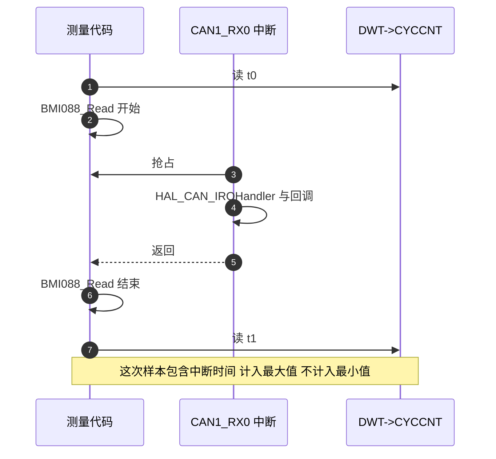
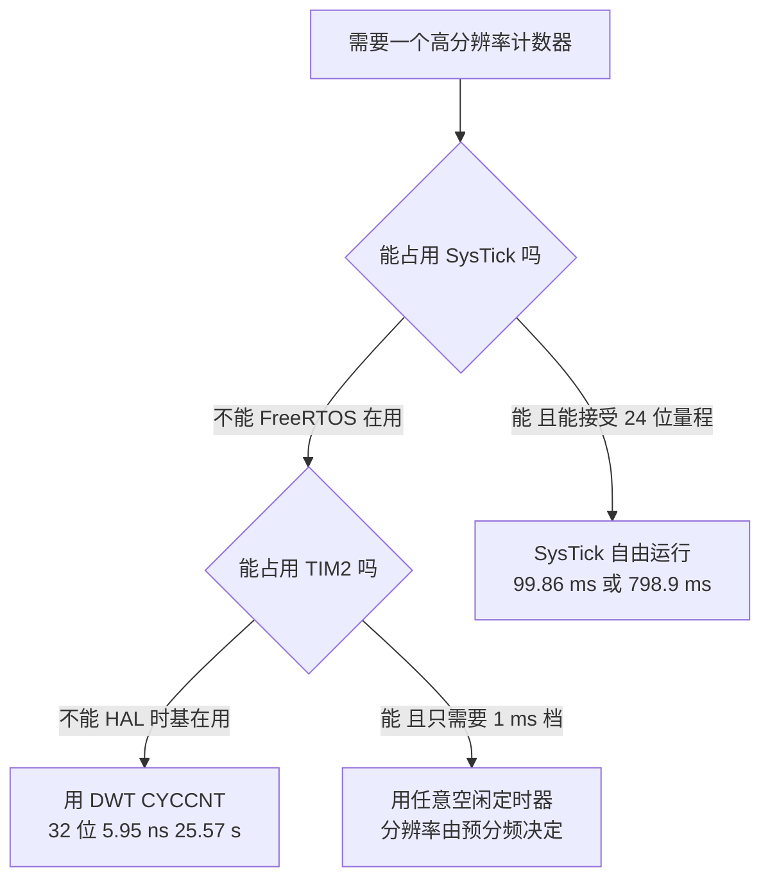

# 用 CYCCNT 测函数耗时

> 前面两篇说明 `CYCCNT` 的读法与延时代价。本工程目前没有一处测量代码：`DWT_GetCycleCount` 与 `DWT_GetMicroseconds` 都因为无引用被回收。本文给出可用的测量写法、判读口径与干扰来源，并说明为什么本工程只有 DWT 这一条计数通道可用。

## 1. 概念：一次测量要记的四件事

| 项目 | 含义 | 本工程的做法 |
| --- | --- | --- |
| 测量窗口 | 起止两次读 `CYCCNT` 之间的代码 | 只包住被测量的函数，窗口越短越容易被干扰放大 |
| 读数开销 | 两次读、减法、存储指令本身消耗的周期 | 需要实测标定，短窗口下不可忽略 |
| 样本存储 | 承接结果的变量 | 必须是会被引用的全局变量，否则被回收 |
| 干扰 | 窗口内发生的中断与任务切换 | 用最小值作为纯执行时间的估计 |

## 2. 机制

### 2.1 基本写法

```cpp
#include "bsp_dwt.h"

/* 承接结果的变量：全局且 volatile，避免被优化或被回收 */
volatile uint32_t prof_bmi088_min = 0xFFFFFFFFu;
volatile uint32_t prof_bmi088_last = 0;

void measure_bmi088(void)
{
    extern float gyro[3], accel[3], temp;

    uint32_t t0 = DWT->CYCCNT;
    BMI088_Read(gyro, accel, &temp);
    uint32_t dt = DWT->CYCCNT - t0;      /* 无符号差值，跨回绕也正确 */

    prof_bmi088_last = dt;
    if (dt < prof_bmi088_min) {
        prof_bmi088_min = dt;            /* 只保留最小值 */
    }
}
```

三个写法要点：

1. `t0` 与 `dt` 用 `uint32_t`。有符号数在跨 `0xFFFFFFFF` 时结果错误，无符号减法天然处理一次回绕。
2. 差值直接相减，不做 `DWT->CYCCNT = 0` 之类的复位。复位会破坏其他使用者的计时。
3. 结果变量必须是全局的、会被运行期引用的。局部变量在任务返回后就没了，静态局部变量也可能被回收。

### 2.2 换算与判读

周期数换成时间：

$$t_{\text{us}} = \frac{C}{f_{\text{HCLK}}/10^6} = \frac{C}{168}, \qquad
t_{\text{ms}} = \frac{C}{168\,000}$$

若用整数除法在 32 位内完成，先乘后除要小心溢出；写成 `(uint64_t)C * 1000000ull / HAL_RCC_GetHCLKFreq()` 更稳，这也是 `DWT_GetMicroseconds` 的写法（`BSP/Src/bsp_dwt.cpp:52`）。

判读口径决定结论：

| 统计量 | 含义 | 适用场合 |
| --- | --- | --- |
| 最小值 | 最接近纯执行时间，被抢占的次数最少 | 评估函数本身的耗时上界 |
| 最大值 | 含一次或多次中断与任务切换 | 评估对控制周期的冲击 |
| 平均值 | 混合值，取决于采样点的负载 | 评估 CPU 占用率 |
| 采样次数 | 结论的置信度依据 | 少于几百次的结论不可靠 |

### 2.3 读数开销与相对误差

一次测量至少包含两次 `CYCCNT` 读与一次减法，再加上结果存储。这些指令也占周期，设其总代价为 $C_{\text{ov}}$：

$$\varepsilon = \frac{C_{\text{ov}}}{C_{\text{窗口}}}$$

| 窗口长度 | 周期数 | 取整误差（1 周期） | 读数开销的影响 |
| --- | --- | --- | --- |
| 1 µs | 168 | 5.95 ns，相对 0.6% | 主导项，必须实测扣除 |
| 10 µs | 1 680 | 相对 0.06% | 明显，仍建议扣除 |
| 100 µs | 16 800 | 相对 0.006% | 可忽略 |
| 1 ms | 168 000 | 相对 0.0006% | 可忽略 |

$C_{\text{ov}}$ 的标定方法：连续两次测量同一段空代码，或者测量一个已知周期数的空循环。本工程没有做这一步，所以表中 `C_ov` 一列按实测需求填写。

### 2.4 干扰来源

测量窗口内任何中断都会拉长读数。按 NVIC 优先级分两类：

| 干扰源 | 优先级 | 触发频率 | 是否打断测量窗口 |
| --- | --- | --- | --- |
| CAN1_RX0 / CAN2_RX0 | 5 | 每个接收帧一次，1 Mbps 下每帧约 130 µs 总线时间 | 是 |
| USART3（DMA1_Stream1）与 USART6（DMA2_Stream1/Stream6） | 5 | 串口收发事件 | 是 |
| SPI1 的 DMA2_Stream2/Stream3 | 5 | 每次 IMU 读写 | 是 |
| OTG_FS | 5 | USB 事件 | 是 |
| TIM2 的 HAL tick 与 SysTick | 15 | 都是 1 kHz | 是，但可以预期 |
| PendSV | 15 | 每次任务切换 | 是，会显著拉长最大值 |
| TIM10 | 5 | 不产生中断（见下） | 否 |

TIM10 的 NVIC 中断在 `Core/Src/tim.c:83-84` 被使能，它也确实在跑：`BMI088/Src/ImuTempControl.cpp:15` 调用 `HAL_TIM_PWM_Start(&htim10, TIM_CHANNEL_1)` 驱动 IMU 加热。但 `HAL_TIM_PWM_Start` 只使能计数器与通道输出，不使能更新中断，代码里也没有其他位置打开 `TIM_IT_UPDATE`，所以 33.6 kHz 的更新事件不会进中断。



## 3. 落到本项目

### 3.1 可测对象与测量点

| 对象 | 所在文件 | 测量点建议 | 说明 |
| --- | --- | --- | --- |
| `BMI088_Read` | `BMI088/Src/BMI088.cpp:351` | `ImuTask` 循环内（`ImuTask.cpp:43`） | 含 SPI 传输与 DMA 等待 |
| `FusionAHRS::update` | `Algorithm/Src/FusionAHRS.cpp` | `ImuTask.cpp:50` 前后 | 纯计算，适合比较优化前后 |
| 云台 PID 计算 | `Task/Src/GimbalTask.cpp` | 1 ms 循环内 | 与电流输出一起看 |
| CAN 接收回调 | `BSP/Src/bsp_can.cpp` | 回调内部（中断上下文） | 只在调试时短期打开 |

测量点放在任务里时要注意：计数窗口不要跨越 `osDelay`，否则测到的是整个周期而不是执行时间。中断上下文（CAN 回调）里也能读 `CYCCNT`，但回调执行期间同优先级及更低优先级的中断不会发生，读数只反映自身长度。

### 3.2 与 24 位 SysTick 的差别

| 维度 | DWT `CYCCNT` | SysTick |
| --- | --- | --- |
| 位宽 | 32 位，向上计数 | 24 位，向下计数 |
| 时钟 | 内核 168 MHz | 内核 168 MHz 或内核/8 |
| 自由运行时的回绕 | 25.565 s | 99.862 ms（内核时钟），798.9 ms（内核/8） |
| 本工程实际装载 | 无 | 167 999，即 1 ms |
| 占用情况 | 空闲 | 已被 FreeRTOS 用作节拍 |

SysTick 的回绕时间算起来是：

$$T_{\text{SysTick}} = \frac{2^{24}}{168 \times 10^6} = 99.862 \ \text{ms}$$

FreeRTOS 的移植层在 `portable/GCC/ARM_CM4F/port.c:695` 把重装载值写成 `configSYSTICK_CLOCK_HZ / configTICK_RATE_HZ - 1`，本工程是 168 000 − 1，计数器每个周期只有 1 ms 的量程，回绕周期等于节拍周期。要拿它做自由计数，就必须先放弃 FreeRTOS 的节拍，代价不可接受。TIM2 已被 HAL 时基占用，同样不能挪用。



## 4. 易错点

| # | 现象或写法 | 后果 | 处理 |
| --- | --- | --- | --- |
| 1 | 测量窗口跨越 `osDelay` 或阻塞调用 | 读数是周期长度，不是执行时间 | 窗口只包住目标函数 |
| 2 | 用有符号变量存差值 | 跨回绕时得到负数 | 统一用 `uint32_t` |
| 3 | 复位 `CYCCNT` 后再测 | 破坏其他使用者的时间基准，且引入竞争 | 只做差值，不复位 |
| 4 | 只采一次就下结论 | 单次样本可能正好被中断命中 | 至少几百次，同时记录最小值与最大值 |
| 5 | 被测代码被内联或优化掉 | 窗口内没有实际工作，读数接近开销 | 核对反汇编，必要时加 `volatile` 或屏障 |
| 6 | 结果变量是局部或静态局部 | 被回收或读不到，Watch 显示无效 | 用会被引用的全局变量 |
| 7 | 在中断里做长时间测量并打印 | 中断被拉长，其他中断延迟或丢失 | 中断里只累加计数，打印放到任务 |
| 8 | 忽略任务切换的贡献 | 最大值偏大时误判为函数变慢 | 最大值需结合任务状态一起解释 |
| 9 | 把 1 ms 的 `HAL_GetTick()` 差当成耗时 | 分辨率只有 1 ms，短函数恒为 0 或 1 | 短耗时只能用 `CYCCNT` |
| 10 | 忘记换算里的整数除法 | 168 个周期以下恒为 0 µs | 保留周期数做统计，最后一步再换算 |

## 5. 小结

### 核心概念

| 概念 | 要点 |
| --- | --- |
| 窗口 | 两次 `CYCCNT` 读之间，只包住目标函数 |
| 换算 | $t_{\text{us}} = C/168$，保留周期数做统计更精确 |
| 判据 | 最小值接近纯执行时间，最大值反映干扰，平均值反映占用 |
| 读数开销 | 相对误差 $C_{\text{ov}}/C_{\text{窗口}}$，短窗口必须标定 |
| 干扰 | 优先级 5 的外设中断与任务切换都会拉长读数 |
| TIM10 | 33.6 kHz PWM 在跑，但更新中断未使能，不构成干扰 |
| 计数通道 | SysTick 与 TIM2 都被占用，只有 DWT 空闲 |

### 设计权衡

| 决策 | 收益 | 代价 |
| --- | --- | --- |
| 用 DWT 做性能测量 | 分辨率 5.95 ns，不影响其他外设 | 需要调试单元可用，量程 25.57 s |
| 只保留最小值 | 抗干扰，样本量要求低 | 看不到偶发的长尾，需要另存最大值 |
| 结果放全局变量 | 可用 Live Watch 观察，不需要串口 | 每个被测对象要占 8 字节左右，且必须被引用 |
| 测量点放在任务里 | 上下文可控，不影响中断时序 | 无法测量中断服务函数自身的耗时 |
| 不在中断里打印 | 不拉长中断 | 只能事后在任务里输出统计值 |

## 6. 练习

### 基础题

1. 一个函数测得 42 000 个周期，写出它对应的微秒数与毫秒数。
2. 窗口 1 µs 时，若读数开销为 40 个周期，相对误差是多少？
3. 说明为什么最小值比平均值更接近函数的纯执行时间。

### 挑战题

4. 给 `BMI088_Read` 加一套最小开销的统计：只记录最小值、最大值与采样次数，用 Live Watch 观察，并核算这套统计本身消耗多少周期。
5. 用 `CYCCNT` 测出 `DWT_Delay_us(1)` 的实际周期数，与理论值 168 相减，解释差值来源，并说明如何用这个差值反向标定读数开销。
6. 设计一个能区分「函数变慢」与「中断变多」的实验：要求只用一个计数器，给出采样策略与判读方法。

---

### 附：本页引用的固件路径

| 路径 | 用途 |
| --- | --- |
| `/home/wyx/rm/2026SentriOmeniGimbal/2026OmniSentryGimbal/BSP/Src/bsp_dwt.cpp` | 换算写法参考（:43-53） |
| `/home/wyx/rm/2026SentriOmeniGimbal/2026OmniSentryGimbal/BMI088/Src/BMI088.cpp` | `BMI088_Read`（:351）与 `readRawData`（:123） |
| `/home/wyx/rm/2026SentriOmeniGimbal/2026OmniSentryGimbal/Task/Src/ImuTask.cpp` | 采样与融合的调用点（:43、:50） |
| `/home/wyx/rm/2026SentriOmeniGimbal/2026OmniSentryGimbal/BMI088/Src/ImuTempControl.cpp` | TIM10 的 PWM 启动（:15、:27） |
| `/home/wyx/rm/2026SentriOmeniGimbal/2026OmniSentryGimbal/Core/Src/tim.c` | TIM10 参数与 NVIC（:42-56、:83-84） |
| `/home/wyx/rm/2026SentriOmeniGimbal/2026OmniSentryGimbal/Core/Src/stm32f4xx_it.c` | 中断入口清单（:177-365） |
| `/home/wyx/rm/2026SentriOmeniGimbal/2026OmniSentryGimbal/Core/Src/can.c` | CAN 接收中断优先级（:125-160） |
| `/home/wyx/rm/2026SentriOmeniGimbal/2026OmniSentryGimbal/Core/Src/dma.c` | DMA 中断优先级（:48-60） |
| `/home/wyx/rm/2026SentriOmeniGimbal/2026OmniSentryGimbal/Core/Src/usart.c` | 串口中断优先级（:198、:262） |
| `/home/wyx/rm/2026SentriOmeniGimbal/2026OmniSentryGimbal/USB_DEVICE/Target/usbd_conf.c` | USB 中断优先级（:94） |
| `/home/wyx/rm/2026SentriOmeniGimbal/2026OmniSentryGimbal/Middlewares/Third_Party/FreeRTOS/Source/portable/GCC/ARM_CM4F/port.c` | SysTick 重装载值（:695） |
| `/home/wyx/rm/2026SentriOmeniGimbal/2026OmniSentryGimbal/Core/Inc/FreeRTOSConfig.h` | 节拍频率（:64） |
| `/home/wyx/rm/2026SentriOmeniGimbal/2026OmniSentryGimbal/Core/Src/stm32f4xx_hal_timebase_tim.c` | TIM2 时基占用（:41-91） |
