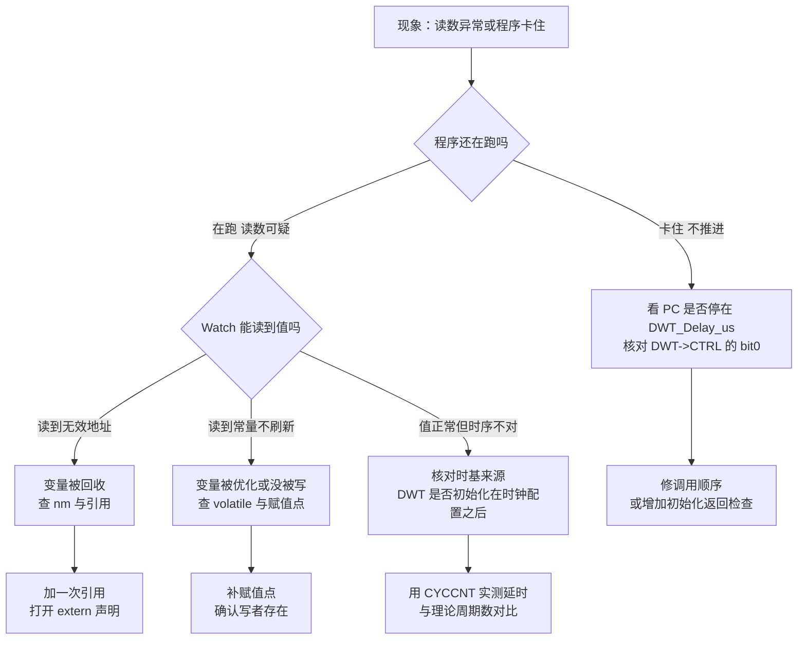
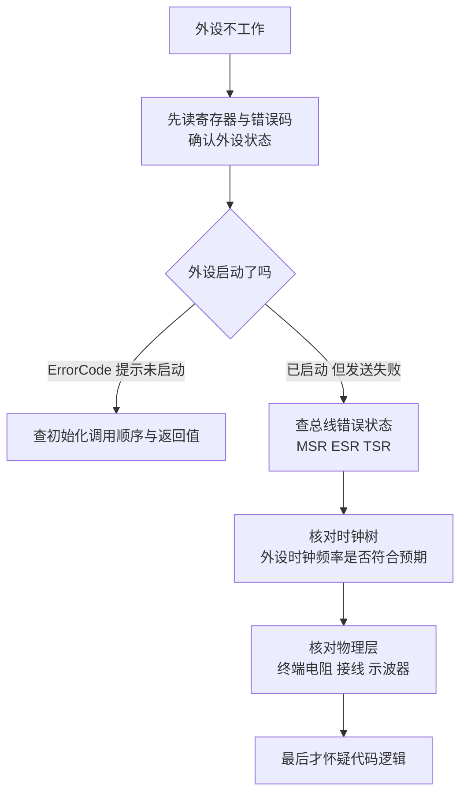

# DWT 与在线观测的易错点

> 核对源码时发现的问题汇成清单，每条附证据路径与复核命令。清单之后给一个从现象到定位的流程，以及一条来自工作记录的真实排查案例。

这份清单的共同特征是“失败不报错”：变量被回收、返回值被忽略、帧发不出去，都不会让编译或链接失败。因此每条都要有独立的复核手段，不能靠程序能不能跑来判断。

## 1. 核对清单

| # | 问题 | 现象 | 证据 | 复核命令 |
| --- | --- | --- | --- | --- |
| 1 | 调试变量被链接器回收 | Watch 读到无效地址或常量 | 9 个 `debug_*` 在 ELF 里零命中 | `arm-none-eabi-nm elf \| grep -c debug_` |
| 2 | `extern` 声明全部被注释 | 其他文件无法引用变量 | `Debug_vars/debug_vars.h:14-23` | `grep -n extern Debug_vars/debug_vars.h` |
| 3 | 同名头文件先命中空壳 | 包含到的头文件没有声明 | `BSP/debug_vars.h:1-12` 与包含顺序 | `grep -n 'BSP\|Debug_vars' CMakeLists.txt` |
| 4 | 延时未初始化即调用 | 函数永不返回 | `bsp_dwt.cpp:29` 的循环条件 | 调试器看 PC 是否停在 `DWT_Delay_us` |
| 5 | 初始化返回值被忽略 | 计数器没起来也照常运行 | `main.c:124` 未接收返回值 | `grep -n BSP_DWT_Init Core/Src/main.c` |
| 6 | 微秒延时参数溢出 | 实际等待远短于预期 | `bsp_dwt.cpp:27` 的 32 位乘法 | 代入 $us \geq 25\,565\,282$ |
| 7 | 空指针时调试发送静默返回 | 无输出也无报错 | `debug.cpp:55-57` | `grep -n s_debug_huart BSP/Src/debug.cpp` |
| 8 | 串口帧无长度与校验 | 丢字节后无法重新对齐 | `debug.cpp:63-64` 只有两字节头 | 读帧结构与发送代码 |
| 9 | 文档描述的更新点不存在 | 按文档设断点却永不命中 | `Communication_Summary.md:279` | `grep -n debug_yaw Communication/Src` |
| 10 | 忙等被当成普通延时 | 高频任务占用接近 100% | `ImuTask.cpp:100` | 算 $T_{\text{wait}}/T$ |

十条里前三条属于链接期问题，中间三条属于运行时状态问题，后四条属于协议与设计问题。复核命令的分工也按这个顺序：前三条看符号与预处理，中间三条看寄存器与寄存器窗口，后四条读代码。

## 2. 变量被回收的判据与命令

构建选项决定了这一点。`cmake/gcc-arm-none-eabi.cmake:29` 有 `-fdata-sections -ffunction-sections`，同文件 :41 有 `-Wl,--gc-sections`。每个全局变量单独成段，未被引用的段被删掉：

```bash
$ arm-none-eabi-nm build/Debug/sentriomeni2026.elf | grep -c debug_
0
$ arm-none-eabi-nm -S build/Debug/sentriomeni2026.elf | grep -i dwt
08010490 00000030 T DWT_Delay_ms
08010440 00000050 T DWT_Delay_us
080103ec 00000054 T BSP_DWT_Init
```

同一个文件里，被调用过的函数留下，没被调用过的三个读取函数消失。调试变量与它们同理。map 文件的输入段列表里能看到段名，全局符号表里没有，两者要分开看。

判据只有一条：以 `nm` 输出为准。看到源码里有定义就去 Watch 里找地址，是这类问题里最常见的误判起点。

## 3. 三处静默失败

| 位置 | 条件 | 行为 |
| --- | --- | --- |
| `debug.cpp:55-57` | `s_debug_huart == NULL` | 直接返回，无输出 |
| `main.c:124` 与底盘板 `:129` | `BSP_DWT_Init` 返回 1 | 不处理，继续运行 |
| `debug.cpp:102-104` | 未知格式字符 | 跳过该字符，帧长度与接收端预期不一致 |

三处的共同点是失败不产生可见信号。核对方式是为每处加一个可观测的计数变量：初始化返回值存入全局变量，发送函数统计成功与失败次数，未知格式字符计数。这些计数变量本身要被引用，否则回到第 1 条。

三处里最隐蔽的是第三处：格式字符写错一个，帧长度就变了，接收端按原格式解析会从错误位置取值，得到看似合理的数字。

## 4. 未初始化时的死循环

`bsp_dwt.cpp:24-30` 的循环条件是 `(DWT->CYCCNT - start) < cycles`。`BSP_DWT_Init` 之前计数器不动，两次读都是 0，差值是 0：

$$0 < N \quad (N > 0)$$

条件恒真，函数不返回。调用链上任何一次提前调用都会让任务卡在 `DWT_Delay_us` 里，表现是任务不再推进、看门狗不响应。定位方法是核对 `DWT->CTRL` 的 bit0，或检查调用顺序是否在 `SystemClock_Config` 与 `BSP_DWT_Init` 之后。

死循环的另一面是它看起来像“任务优先级问题”：同一个任务卡住后，其他任务也不再被调度，容易被误判为调度器故障。先看 PC 停在哪个函数，再谈调度。

## 5. 文档与代码的偏差

`Communication_Summary.md:277-280` 写「这些变量在 dbus_decode 中更新」。当前固件的 `Communication/Src/dbus.cpp` 与 `Communication/Src/usart_decode.cpp` 只包含了空壳头文件，没有任何 `debug_*` 赋值。`BSP/Src/bsp_can.cpp:652` 保留了唯一一处相关的注释代码：

```cpp
/* BSP/Src/bsp_can.cpp:652 */
//debug_angle1 = LK_motor_1.rotor_angle;
```

按文档设断点、加 Watch 都不会有结果。核对这类描述的方法是在源码树里搜符号，而不是信任文档：

```bash
$ grep -rn "debug_roll\|debug_yaw" Communication BSP Task Debug_vars
Debug_vars/debug_vars.cpp:11:volatile float debug_roll = 0.0f;
Debug_vars/debug_vars.h:15: // extern volatile float debug_roll;
```

搜出来的两处一个是定义、一个是注释，没有任何赋值点。文档偏差的判据就是这一条：符号出现在定义与注释里，不出现在可执行语句里。

## 6. 从现象到定位的分叉



分叉的第一个判据是“程序还在不在跑”。卡住与读数异常是两类完全不同的问题：前者看 PC 与寄存器，后者看符号与内存。

## 7. 一个真实案例：CAN 不上总线

工作记录 `/home/wyx/Work-Summary-and-Diary/工作记录/can通信波特率问题.md` 记了一次外设不工作的排查，方法与本文的在线观测同源：不打断程序，用调试器读寄存器和变量。

现象是 CAN1 与 CAN2 都无法进回调、无法发送，代码在假期前正常工作过。排查分三步：先查代码逻辑，初始化、过滤器、中断、回调、发送函数全部正常；再用调试器读寄存器；最后定位到时钟树。

| 寄存器或字段 | 读到的值 | 含义 |
| --- | --- | --- |
| `hcan2.ErrorCode` | `0x00200000` | `HAL_CAN_ERROR_NOT_STARTED` |
| `MSR` | `0x0C08` | `ERRI` 挂起，错误中断已触发 |
| `TSR` | `0x82000004` | 邮箱被占用，发送无法完成 |

三个读数给出的顺序是：外设曾经启动过，一次发送之后进入错误状态，之后邮箱一直不空。记录里的结论是时钟树被改动，波特率换算的基数随之改变。记录的波特率一栏写的是 857142 Hz，按位时间 $1 + 15 + 5 = 21$ 个时间单元、预分频 2 反推：

$$f_{\text{APB1}} = 857142 \times 2 \times 21 = 36.0 \ \text{MHz}$$

当前固件的 APB1 是 42 MHz（`Core/Src/main.c:185` 的 168 MHz 四分频），对应 1 Mbps。36 MHz 对应 SYSCLK 144 MHz，说明当时的时钟配置与现在不同。修复方式是改正 `.ioc` 里的时钟树并重新生成代码。



## 8. 从 CAN 案例迁移到 DWT 的两条经验

这个案例有两点可以迁移到 DWT 上：

1. 读寄存器能给出状态，但给不出事件顺序。要判断先后，需要在代码里埋计数变量或时间戳。
2. 排查顺序里时钟排在最前。DWT 的频率换算同样依赖 `HAL_RCC_GetHCLKFreq()`，时钟配置一改，延时的周期数就跟着变。

第一条对测量方案的影响是：单看 `DWT->CYCCNT` 的一个读数无法说明先后，要用两次读数的时间戳或一个自增计数把顺序记下来。第二条决定了排查任何时间问题时，先确认主频再谈数值。

## 9. 读寄存器时的副作用

用调试器读寄存器时要注意副作用。有些寄存器读操作会改变外设状态，例如 USART 的 `DR` 读操作会清 `RXNE` 并使能下一次接收；在暂停状态下读它，可能吞掉一个字节，让 DMA 环形缓冲的语义变化。读前先查参考手册里该寄存器是否有读副作用。

`CYCCNT` 与 `DWT->CTRL` 都是只读或读写无副作用的寄存器，读它们不会改变计数状态。这条差别决定了 DWT 适合放在 Watch 里连续观察，而外设数据寄存器不适合。

## 10. 小结

### 核心概念

| 概念 | 要点 |
| --- | --- |
| 回收 | `-fdata-sections` 加 `--gc-sections` 会删掉没有引用的变量与函数 |
| 判据 | 以 `nm` 输出的符号为准，map 的输入段列表不代表最终镜像 |
| 静默失败 | 空指针返回、返回值未处理、未知格式字符跳过，都不报错 |
| 死循环条件 | 计数器未启动时差值恒为 0，循环条件恒真 |
| 文档偏差 | `Communication_Summary.md` 的更新点在当前固件里不存在 |
| 寄存器排查 | 先状态后顺序，时钟优先于代码逻辑 |
| 读副作用 | 部分寄存器的读操作会清标志，暂停时读要谨慎 |

### 设计权衡

| 决策 | 收益 | 代价 |
| --- | --- | --- |
| 调试变量集中定义 | 加变量只改一个文件 | 无引用时整批被回收，问题成批出现 |
| 初始化返回值为 `uint8_t` 而不中断运行 | 启动流程不因自检失败停止 | 失败无信号，需要额外变量承接 |
| 调试发送在空指针时直接返回 | 不影响主流程 | 调用方无从知道帧没发出去 |
| 串口帧省略长度与校验 | 代码短，收发两端实现简单 | 丢字节后无法重新对齐 |
| 用寄存器窗口排查外设 | 不需要改代码，能看到硬件状态 | 只反映瞬间状态，读操作可能有副作用 |

## 11. 练习

### 基础题

1. 给出一条命令，判断 `DWT_Delay_us` 是否进入了某个 ELF。再给出一条命令，判断 `debug_st` 是否在同一个 ELF 里。
2. 说明 `debug.cpp:102-104` 跳过未知格式字符后，为什么接收端会错位。
3. 按第 7 节的方法反推：若记录里的波特率写成 1 000 000 Hz，APB1 应该是多少？

### 挑战题

4. 给三处静默失败各加一个计数变量，要求全部可用 Live Watch 观察，并说明每个变量的引用点放在哪里。
5. 写一份核对脚本：扫描源码树，列出所有被 `#ifdef` 或注释包住的 `extern` 声明、所有定义了但没有引用的全局变量，并说明脚本的误报来源。
6. 设计一个实验，用 `CYCCNT` 判断一次 CAN 发送失败发生在「邮箱未空」还是「总线错误」之后：要求给出测量点、时间戳存放位置与判读方法。

---

### 附：本页引用的固件路径

| 路径 | 用途 |
| --- | --- |
| `/home/wyx/rm/2026SentriOmeniGimbal/2026OmniSentryGimbal/BSP/Src/bsp_dwt.cpp` | 延时循环与 32 位乘法（:24-36） |
| `/home/wyx/rm/2026SentriOmeniGimbal/2026OmniSentryGimbal/BSP/Src/debug.cpp` | 静默返回与帧头（:55-57、:63-64、:102-104） |
| `/home/wyx/rm/2026SentriOmeniGimbal/2026OmniSentryGimbal/Debug_vars/debug_vars.h` | 注释状态的声明（:14-23） |
| `/home/wyx/rm/2026SentriOmeniGimbal/2026OmniSentryGimbal/BSP/debug_vars.h` | 空壳头文件（:1-12） |
| `/home/wyx/rm/2026SentriOmeniGimbal/2026OmniSentryGimbal/BSP/Src/bsp_can.cpp` | 唯一一处相关注释（:652） |
| `/home/wyx/rm/2026SentriOmeniGimbal/2026OmniSentryGimbal/Communication_Summary.md` | 与当前固件不符的调试说明（:277-280） |
| `/home/wyx/rm/2026SentriOmeniGimbal/2026OmniSentryGimbal/Communication/Src/dbus.cpp` | 无 `debug_*` 赋值 |
| `/home/wyx/rm/2026SentriOmeniGimbal/2026OmniSentryGimbal/Core/Src/main.c` | 初始化调用点与时钟分频（:124、:185） |
| `/home/wyx/rm/2026SentriOmeniGimbal/2026OmniSentryGimbal/Core/Src/can.c` | CAN1 与 CAN2 的位时间参数与中断 |
| `/home/wyx/rm/2026SentriOmeniGimbal/2026OmniSentryGimbal/build/Debug/sentriomeni2026.elf` | `nm` 实测符号清单 |
| `/home/wyx/rm/2026SentriOmeniGimbal/2026OmniSentryGimbal/cmake/gcc-arm-none-eabi.cmake` | `-fdata-sections` 与 `--gc-sections`（:29、:41） |
| `/home/wyx/Work-Summary-and-Diary/工作记录/can通信波特率问题.md` | CAN 排查案例（:18-47、:74-80） |
| `/home/wyx/rm/2026SentriOmeniChassis/2026OmniSentryChassis/Core/Src/main.c` | 底盘板初始化调用点（:129） |
