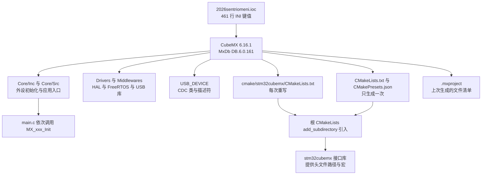
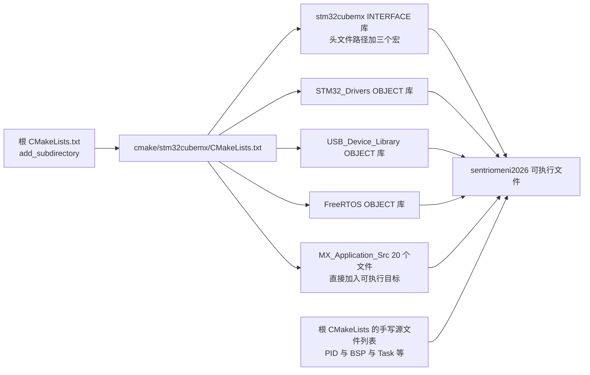

# .ioc 文件与工程生成

云台板（`2026OmniSentryGimbal`）与底盘板（`2026OmniSentryChassis`）各有一份同名的 CubeMX 配置文件 `2026sentriomeni.ioc`，分别是 461 行与 467 行。这份文件里没有一行可执行代码，却决定了全部外设的初始化参数与中断优先级。

CubeMX 界面上有三个面板，各管一段：IP 树管外设启停，时钟树管频率以及由频率派生的波特率，PCC 是功耗计算器。

> 源码索引（固件路径相对于各自仓库根目录）

| 文件 | 作用 |
| --- | --- |
| `2026sentriomeni.ioc` | 全部配置键值，461 行（云台）/ 467 行（底盘） |
| `.mxproject` | 上一次生成的文件清单缓存，两块板内容完全相同 |
| `Core/Inc`、`Core/Src` | 外设初始化与应用骨架，12 个头文件与 16 个源文件 |
| `cmake/stm32cubemx/CMakeLists.txt` | 生成产物的文件清单，每次生成重写（148 行） |
| `CMakeLists.txt` | 工程入口与手写源文件列表，只生成一次（163 行） |
| `CMakePresets.json`、`cmake/gcc-arm-none-eabi.cmake`、`cmake/starm-clang.cmake` | 构建预设与两套工具链文件 |

## 1. 配置源与生成物分离

CubeMX 作为代码生成器（code generator），数据流是单向的：`.ioc` 是输入，源码是输出，生成器不读也不改手写文件。两侧的交界是 **USER CODE** 标记围出的区域，标记之外的内容每次生成都会按模板重写。

三类文件在重新生成时的行为完全不同：

| 类别 | 例子 | 维护者 | 重新生成时的行为 |
| --- | --- | --- | --- |
| 配置源 | `2026sentriomeni.ioc` | 人工，通过 CubeMX 图形界面写回 | 只作为输入读取 |
| 生成物 | `Core/Src/can.c`、`cmake/stm32cubemx/CMakeLists.txt` | CubeMX | 覆盖，USER CODE 区内的文本保留 |
| 手写代码 | `BSP/Src/bsp_can.cpp`、`Task/Src/*.cpp` | 人工 | 完全不动 |

生成器版本记录在配置文件里：`MxCube.Version=6.16.1`（`2026sentriomeni.ioc`）与 `MxDb.Version=DB.6.0.161`，固件包是 `STM32Cube FW_F4 V1.28.3`。版本号决定了生成代码的模板形态，两块板用的是同一个版本。

单向数据流有一个直接后果：手写内容要在重新生成后存活，就必须落在标记区内；只在生成源码里改过、没有写回 `.ioc` 的配置，下一次生成就会把它抹掉。判断一处改动该落在哪一侧，因此有一条简单规则——先看它写在哪一类文件里。

两块板的 `.ioc` 分别有 461 行与 467 行，差值落在少量板级差异键上而非外设模板；`.mxproject` 描述的是工程结构，两块板内容完全相同。把配置源与生成物分开看，重新生成才是可预期的操作。

## 2. .ioc 的键值结构

文件首行是 `#MicroXplorer Configuration settings - do not modify`，正文是 `key=value` 逐行排列，没有节标题，靠键名前缀区分归属的 IP。带冒号的取值用反斜杠转义，NVIC 那一组就是这种写法。

| 前缀 | 内容 | 云台示例 |
| --- | --- | --- |
| `Mcu.` | 芯片型号、封装、引脚清单、启用的 IP | `Mcu.CPN=STM32F407IGH6`、`Mcu.PinsNb=33`、`Mcu.IPNb=16` |
| `RCC.` | 时钟树与派生频率 | `RCC.PLLM=6`、`RCC.APB1Freq_Value=42000000`、`RCC.HSE_VALUE=12000000` |
| `NVIC.` | 中断使能与抢占优先级 | `NVIC.CAN1_RX0_IRQn=true\:5\:0\:...`、`NVIC.PriorityGroup=NVIC_PRIORITYGROUP_4` |
| `Dma.` | DMA 请求、流与通道 | `Dma.USART3_RX.2.Instance=DMA1_Stream1`、`Dma.USART6_TX.1.Mode=DMA_CIRCULAR` |
| IP 名 | 该外设的全部参数 | `CAN1.Prescaler=2`、`TIM10.Period=4999`、`USART3.Parity=PARITY_EVEN` |
| `FREERTOS.` | 内核裁剪与内存配置 | `FREERTOS.configTICK_RATE_HZ=1000`、`FREERTOS.configMINIMAL_STACK_SIZE=256` |
| `ProjectManager.` | 生成器行为与目标工具链 | `ProjectManager.TargetToolchain=CMake`、`ProjectManager.KeepUserCode=true` |
| `PCC.` | 功耗计算器输入 | `PCC.Temperature=25`、`PCC.Vdd=3.3` |
| `CAD.` | 原理图导出视图状态 | 云台为空值，底盘为 `CAD.pinconfig=Dual` |

`Mcu.Pin0` 到 `Mcu.Pin32` 是引脚的枚举清单。新增一个引脚会让它后面的编号整体后移，底盘板因为多出 PA10，引脚列表从 `Mcu.Pin15` 开始就与云台错位。两块板的 `.ioc` 做 diff 时，引脚区的噪声主要来自这个编号规律，需要对照的字段是每行的 `*.Signal=` 与 `*.Mode=`。

## 3. 一次生成写出哪些文件

| 产物 | 内容 | 重新生成时 |
| --- | --- | --- |
| `Core/Inc/`（12 个） | `main.h`、各外设头、`FreeRTOSConfig.h`、`stm32f4xx_hal_conf.h` | 覆盖，USER CODE 区保留 |
| `Core/Src/`（16 个） | `main.c`、`gpio.c`、`can.c` 等初始化文件，以及 `stm32f4xx_it.c` | 覆盖；`syscalls.c`、`sysmem.c`、`system_stm32f4xx.c` 里没有 USER CODE 标记，整文件重写 |
| `Drivers/CMSIS`、`Drivers/STM32F4xx_HAL_Driver` | 全部 HAL 与 CMSIS 源码 | 整目录复制 |
| `Middlewares/Third_Party/FreeRTOS` | 内核、CMSIS-RTOS 包装层、`heap_4.c` | 整目录复制；`heap_4.c` 会被覆盖，因为 `FREERTOS.copyHeapFile=1` |
| `Middlewares/ST/STM32_USB_Device_Library` | USB 设备栈与 CDC 类 | 整目录复制 |
| `USB_DEVICE/App`、`USB_DEVICE/Target` | 描述符、接口实现、`usbd_conf.c` | 覆盖，USER CODE 区保留 |
| `startup_stm32f407xx.s`、`STM32F407XX_FLASH.ld` | 启动文件与链接脚本 | 整文件复制 |
| `cmake/stm32cubemx/CMakeLists.txt` | 生成物的文件清单与三个 OBJECT 库 | 每次重写 |
| `CMakeLists.txt`、`CMakePresets.json`、`cmake/*.cmake` | 工程入口、构建预设、工具链文件 | 首次生成后保留用户修改，见 [03-重新生成的正确姿势.md](03-重新生成的正确姿势.md) |
| `.mxproject` | `[PreviousLibFiles]`、`[PreviousUsedCMakes]`、`[PreviousGenFiles]` 三段 | 每次重写 |

`.mxproject` 只记录上一次生成写过的文件清单与头文件路径（`[PreviousGenFiles]` 段里的 `HeaderFiles#0=..\Core\Inc\gpio.h` 这类条目），不包含任何外设参数。云台与底盘的 `.mxproject` 逐字节相同，而两份 `.ioc` 有二十多处差异，这也说明它不是配置备份。

## 4. 从 .ioc 键到代码行

生成关系是逐键直译的，抽查几条：

| .ioc 键（云台） | 生成位置 |
| --- | --- |
| `CAN1.Prescaler=2` | `Core/Src/can.c` `hcan1.Init.Prescaler = 2;` |
| `CAN1.BS1=CAN_BS1_15TQ` | `Core/Src/can.c` `hcan1.Init.TimeSeg1 = CAN_BS1_15TQ;` |
| `NVIC.CAN1_RX0_IRQn` 的第二段数值 5 | `Core/Src/can.c` `HAL_NVIC_SetPriority(CAN1_RX0_IRQn, 5, 0);` |
| `Dma.USART6_TX.1.Mode=DMA_CIRCULAR` | `Core/Src/usart.c` `hdma_usart6_tx.Init.Mode = DMA_CIRCULAR;` |
| `RCC.PLLM=6`、`RCC.PLLN=168` | `Core/Src/main.c` |
| `TIM10.Period=4999` | `Core/Src/tim.c` |
| `USART3.Parity=PARITY_EVEN` | `Core/Src/usart.c` |
| `PA0-WKUP.GPIO_Label=KEY` | `Core/Inc/main.h` 的 `KEY_Pin` 与 `KEY_GPIO_Port` |
| `FREERTOS.configMINIMAL_STACK_SIZE=256` | `Core/Inc/FreeRTOSConfig.h` |

`main.h` 只承接带 `GPIO_Label` 的引脚，云台这边只有 PA0 有标签，所以头文件里只多出 `KEY_Pin` 一条。PA4、PB0、PG6、PH11、PG3 这些引脚没有标签，它们的模式与上下拉写在 `Core/Src/gpio.c` 与 `Core/Src/stm32f4xx_hal_msp.c` 里，看配置时不能只翻 `main.h`。

`ProjectManager.functionlistsort`记录初始化函数的排列，`main.c` 里 `MX_GPIO_Init()` 到 `MX_CRC_Init()` 的顺序与它一致（`Core/Src/main.c`）。两块板的 `main.c` 这一段逐行相同，都以 `MX_CRC_Init()` 结尾；而 `MX_USB_DEVICE_Init()` 不在这段生成代码里，两块板都写在 `USER CODE BEGIN 2` 区内（云台 `Core/Src/main.c`，底盘 `Core/Src/main.c`）。配置里唯一标 `HAL-false` 的两条是 `SystemClock_Config` 与 `MX_USB_DEVICE_Init`，其余 11 条都是 `HAL-true`，与它们不出现在这段生成代码里这一现象一致；字段的确切含义未从生成器源码验证。

## 5. cmake/stm32cubemx 的接入方式

根 `CMakeLists.txt` 用 `add_subdirectory(cmake/stm32cubemx)` 把生成部分拉进来，剩下三件事都在被引入的文件里完成：

1. `add_library(stm32cubemx INTERFACE)`（`cmake/stm32cubemx/CMakeLists.txt`）承载 12 条头文件路径与三个宏 `USE_HAL_DRIVER`、`STM32F407xx`、`$<$<CONFIG:Debug>:DEBUG>`；
2. 三个 OBJECT 库 `STM32_Drivers`、`USB_Device_Library`、`FreeRTOS` 分别编译 HAL、USB 设备栈与内核；
3. `MX_Application_Src` 里的 20 个源文件直接挂到可执行目标上。

根 `CMakeLists.txt` 里那份手写源文件清单由生成器维护不到，新增一个 `.cpp` 需要同时改 `add_executable` 与 `target_include_directories`。生成的 `stm32cubemx` 目标只负责 HAL 一侧的头文件路径，`Task/Inc`、`BSP/Inc` 这些目录来自根文件。

## 6. 易错点

- `cmake/stm32cubemx/CMakeLists.txt` 每次生成都会被重写。手写源文件只能加在根 `CMakeLists.txt` 里，加在生成文件里会丢。
- `.mxproject` 与 `.ioc` 的内容差异很大，前者不含配置项。判断某外设的参数应当读 `.ioc` 或生成代码，而不是读 `.mxproject`。
- `Mcu.Pin*` 的编号会随引脚增减整体平移，引脚区的 diff 需要逐行看 `Signal`，不能按行号对照。
- `Core/Src` 里有三个文件没有任何 USER CODE 标记：`syscalls.c`、`sysmem.c`、`system_stm32f4xx.c`。对它们的修改在下次生成时全部丢失。

## 7. 小结

### 核心概念

- `.ioc` 是唯一的配置源，按前缀分组：`Mcu.` 管芯片与引脚，`RCC.` 管时钟，`NVIC.` 管中断，`Dma.` 管 DMA，IP 名管各自参数，`FREERTOS.` 管内核，`ProjectManager.` 管生成器行为。
- 生成是单向覆盖，只有 USER CODE 标记围出的文本保留。
- `cmake/stm32cubemx/CMakeLists.txt` 与根 `CMakeLists.txt` 的职责不同：前者是生成物的清单，后者是工程入口与手写源文件清单。
- `.mxproject` 是上一次生成的文件清单缓存，两块板内容相同，不含配置。
- 配置键到代码行是一一对应的，排查参数时可以直接从 `.ioc` 行跳到 `Core/Src` 的对应行。

### 设计权衡

| 选择 | 本工程怎么选的 | 代价与收益 |
| --- | --- | --- |
| 生成器目标工具链 | `TargetToolchain=CMake` | 用 CMake 与 Ninja 构建，便于在 VS Code 与 CLion 里共用；代价是生成产物里多两套工具链文件需要理解 |
| 代码耦合方式 | `CoupleFile=true` | `.c` 与 `.h` 成对生成，结构整齐；代价是文件数量翻倍 |
| 重新生成前备份 | `BackupPrevious=false` | 生成目录干净；代价是生成瞬间的覆盖不可回退，只能靠版本控制 |
| 手写代码保护 | `KeepUserCode=true` | USER CODE 区内容跨生成保留；代价是把代码写在区外就会静默丢失 |
| heap_4.c 归属 | `copyHeapFile=1` | 内核源码随工程走，不依赖外部路径；代价是任何对 `heap_4.c` 的改动都会被覆盖 |

## 8. 练习

基础题

1. 在 `2026sentriomeni.ioc` 里找出使能 CAN1 的全部键，并指出哪一个决定了收发 FIFO 的中断优先级。
2. 说明 `Mcu.PinsNb=33` 与 `Mcu.Pin0` 到 `Mcu.Pin32` 的关系，并判断能否直接把 `Mcu.PinsNb` 改成 20。
3. 从 `.ioc` 读出 TIM10 的预分频与周期值，再在 `Core/Src/tim.c` 里找到对应行，写出 PWM 频率的表达式。

挑战题

4. 云台与底盘两份 `.ioc` 中，列出除 `FREERTOS.configMINIMAL_STACK_SIZE` 与 `FREERTOS.Tasks01` 之外的全部差异，并判断每一条差异属于哪一类：功能配置、视图状态、文件编号。
5. 在根 `CMakeLists.txt` 里新增一个 `Chassis/Src/GimbalAssist.cpp`，写出需要修改的两处，并说明为什么不能只改 `cmake/stm32cubemx/CMakeLists.txt`。
6. 假设把 `ProjectManager.KeepUserCode` 改成 `false` 后重新生成，列出会丢失的具体内容（至少举出 `main.c`、`stm32f4xx_it.c`、`USB_DEVICE/App/usbd_cdc_if.c` 各一处），并说明为什么这个开关不适合在调试阶段切换。
