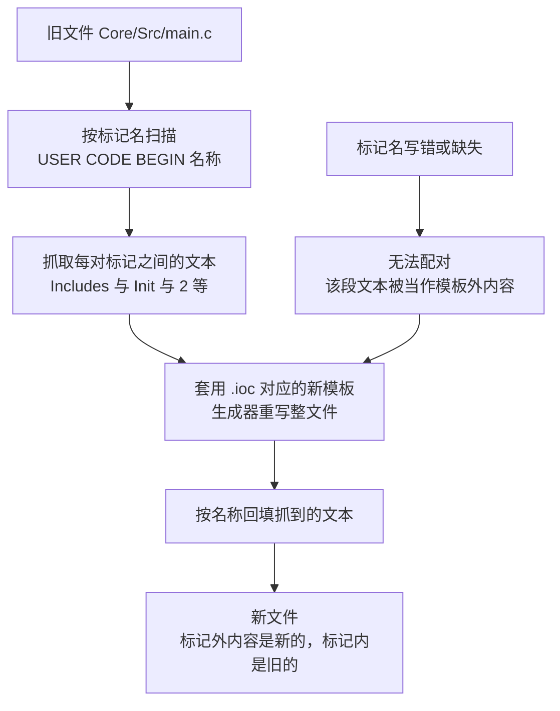
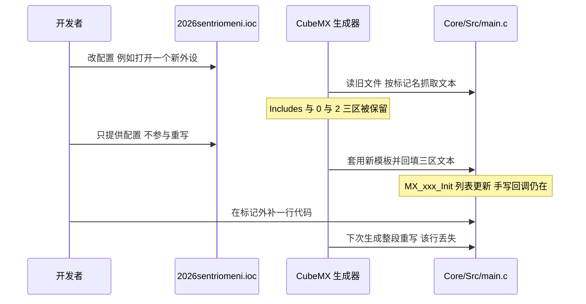

# USER CODE 区与手写代码保护

CubeMX 每次生成都会按模板重写 `Core` 与 `USB_DEVICE` 下的文件。手写代码能活下来，靠的是模板里预置的一对注释标记。这套机制简单，代价是规则的边界很硬：标记之外的一切都会被覆盖，标记名写错就失去保护。

> 源码索引（固件路径相对于各自仓库根目录）

| 文件 | 作用 |
| --- | --- |
| `Core/Src/main.c` | 区域数最多、手写内容最多的生成文件 |
| `Core/Src/stm32f4xx_it.c` | 中断服务函数，50 对标记 |
| `Core/Inc/FreeRTOSConfig.h` | 内核配置，5 对标记 |
| `USB_DEVICE/App/usbd_cdc_if.c` | USB 接收回调，16 对标记 |
| `Core/Src/syscalls.c`、`Core/Src/sysmem.c`、`Core/Src/system_stm32f4xx.c` | 完全没有标记的三个文件 |

## 1. 概念

生成文件里散落着成对的注释标记（marker）：

```c
/* USER CODE BEGIN 2 */
MX_USB_DEVICE_Init();
BSP_CAN_Init();
BSP_DWT_Init();
/* USER CODE END 2 */
```

生成器重新生成文件时的处理顺序是：读入旧文件、按标记名把每对标记之间的文本抓出来、用新模板覆盖文件、再把抓出来的文本填回同名标记之间。标记名由模板决定，例如 `main.c` 里的 `Includes`、`PD`、`PFP`、`0`、`1`、`Init`、`SysInit`、`2`、`WHILE`、`3`，`usbd_cdc_if.c` 里的 `INCLUDE`、`PV`、`PRIVATE_TYPES`、`5`、`6`、`7`、`13`。数字型名称出现在函数体内部，例如 `USER CODE BEGIN 3` 落在 `while (1)` 的花括号里。



## 2. 各文件的标记数量

云台板（`2026OmniSentryGimbal`）生成文件里的标记对数：

| 文件 | BEGIN | END | 手写内容 |
| --- | --- | --- | --- |
| `Core/Src/main.c` | 19 | 18 | 自定义回调、BSP 初始化、UART 注册 |
| `Core/Src/stm32f4xx_it.c` | 50 | 50 | USART3 中断里插入一次调用 |
| `Core/Src/usart.c` | 24 | 24 | 无（全部为空） |
| `Core/Src/can.c` | 17 | 17 | 无 |
| `Core/Src/freertos.c` | 17 | 17 | 队列与任务创建 |
| `Core/Src/tim.c` | 12 | 12 | 无 |
| `Core/Inc/FreeRTOSConfig.h` | 5 | 5 | `configASSERT` 定义 |
| `USB_DEVICE/App/usbd_cdc_if.c` | 16 | 16 | 接收回调、接收队列的 extern 声明 |
| `Core/Src/syscalls.c`、`Core/Src/sysmem.c`、`Core/Src/system_stm32f4xx.c` | 0 | 0 | 无保护，整文件重写 |

标记数量与手写内容没有关系。`usart.c` 的 24 对标记全是空的，因为外设参数由 `.ioc` 生成，不需要人工补充；`main.c` 只有 19 对，但手写代码集中在这里。判断一份生成文件有没有被改过，看标记内的内容比看行数可靠。

## 3. 落到本项目：标记区里实际放了什么

### 3.1 main.c

| 区域 | 位置 | 内容 |
| --- | --- | --- |
| `Includes` | `Core/Src/main.c:33-39` | `bsp_dwt.h`、`bsp_can.h`、`usart_dma.h`、`dbus.h` |
| `0` | `Core/Src/main.c:70-78` | 遥控器回调 `MyUartCallbackFun()`，内部调用 `DBUS_Decode()` |
| `Init` | `Core/Src/main.c:97-99` | 空，且结束标记名被写坏，见第 5 节 |
| `SysInit` | `Core/Src/main.c:104-107` | 空 |
| `2` | `Core/Src/main.c:121-128` | `MX_USB_DEVICE_Init()`、`BSP_CAN_Init()`、`BSP_DWT_Init()`、`Uart_Init(&huart3, MyUartCallbackFun)` |
| `3` | `Core/Src/main.c:144-146` | 空，位于 `while (1)` 内 |
| `Error_Handler_Debug` | `Core/Src/main.c:226-232` | 关中断加死循环 |

`Init` 与 `2` 两个区域的位置不同：`Init` 在 `HAL_Init()` 之后、`SystemClock_Config()` 之前，`2` 在所有 `MX_xxx_Init()` 之后。把 BSP 初始化写进 `Init` 会拿到一个时钟还没配好的系统，本工程把它放在 `2`。

### 3.2 stm32f4xx_it.c

唯一一处手写代码在 USART3 中断入口（`Core/Src/stm32f4xx_it.c:249-251`）：

```c
void USART3_IRQHandler(void)
{
  /* USER CODE BEGIN USART3_IRQn 0 */
  Uart_IRQHandler(&huart3);
  /* USER CODE END USART3_IRQn 0 */
  HAL_UART_IRQHandler(&huart3);
  ...
}
```

区域 0 在 HAL 处理之前，区域 1 在其后。DBUS 的 DMA 空闲检测放在 HAL 之前，先记下长度再让 HAL 去清标志。

### 3.3 usbd_cdc_if.c

两处手写内容分别放在头部的两个区域里：

```c
/* USER CODE BEGIN INCLUDE */
#include "../../Task/Inc/UsbConnectTask.h"  // 包含USB数据接收函数声明
/* USER CODE END INCLUDE */

/* USER CODE BEGIN PV */
/* Private variables ---------------------------------------------------------*/
extern QueueHandle_t usbRxQueue;
/* USER CODE END PV */
```

这里用的是相对路径 `../../Task/Inc/...`（`USB_DEVICE/App/usbd_cdc_if.c:25`），因为生成的 `stm32cubemx` 接口库只提供 HAL 与 FreeRTOS 一侧的头文件路径，`Task/Inc` 来自根 `CMakeLists.txt`。放在标记区内的这条 include 可以跨生成保留，但依赖目录层级，移动文件时要一起改。

### 3.4 FreeRTOSConfig.h

五个区域里只有一个填了内容（`Core/Inc/FreeRTOSConfig.h:121-123`）：

```c
/* USER CODE BEGIN 1 */
#define configASSERT( x ) if ((x) == 0) {taskDISABLE_INTERRUPTS(); for( ;; );}
/* USER CODE END 1 */
```

内核配置数值本身由 `.ioc` 的 `FREERTOS.*` 键生成，例如 `configTICK_RATE_HZ=1000`（`2026sentriomeni.ioc:127`）对应 `Core/Inc/FreeRTOSConfig.h:64` 的宏；而 `configASSERT` 不在 CubeMX 的配置面板里，只能写在标记区。两块板的这份文件逐行相同，只差 `configMINIMAL_STACK_SIZE`（云台 256、底盘 512）。



## 4. 区域命名规则

模板里出现的名称分三类，用途不同：

| 类型 | 例子 | 出现位置 |
| --- | --- | --- |
| 文件级段落 | `Header`、`Includes`、`PTD`、`PD`、`PM`、`PV`、`PFP`、`EV` | 文件顶部或函数声明之前 |
| 函数体分段 | `Init`、`SysInit`、`2`、`WHILE`、`3`、`4`、`6` | `main()` 与各回调函数内部 |
| 回调与 MSP | `CAN1_MspInit`、`USB_OTG_FS_MspInit`、`Error_Handler_Debug`、`Callback 0` | 对应外设或回调函数内部 |
| USB 专用 | `INCLUDE`、`PRIVATE_TYPES`、`PRIVATE_DEFINES`、`PRIVATE_VARIABLES`、`EXPORTED_VARIABLES`、`5` 到 `7`、`13` | `USB_DEVICE/App` 下的文件 |

名称只对同一文件内的模板有意义。把 `main.c` 的 `USER CODE BEGIN Includes` 抄到 `can.c` 里不会报错，但 `can.c` 的模板里没有这个名字，也就不会被回填。

## 5. 易错点

### 5.1 结束标记名被写坏

云台 `Core/Src/main.c` 的 `Init` 区结束标记写成了 `/* USER CODE _angleEND Init */`（`Core/Src/main.c:99`），正确的写法是 `/* USER CODE END Init */`。结果是全文件 `USER CODE BEGIN` 出现 19 次、`USER CODE END` 出现 18 次，`Init` 这一对无法配对。底盘板同一位置是正确的（`Core/Src/main.c:102`）。

这行是人工编辑留下的，git 历史里最早出现在提交 `88f2774`（自喵修复，尝试解决usb断连中）。当前 `Init` 区内没有内容，所以没有造成损失；一旦往里写代码，就会落在生成器的标记表之外，重新生成时被覆盖。生成器对这种不成对标记的具体回退行为没有从生成器源码验证。

### 5.2 代码写在标记外

生成文件的标记外部分包括函数签名、`MX_xxx_Init()` 的调用列表、外设参数赋值、`HAL_NVIC_SetPriority()` 调用。在这些位置手改参数，重新生成会被 `.ioc` 里的值覆盖。要改外设参数，改 `.ioc`；要改中断优先级，改 `.ioc` 的 NVIC 面板。

### 5.3 标记区内不是安全区

标记区能被保留，但不能保证能编译。区域内的代码引用了外部头文件或函数时，生成器只搬文本，不搬声明。`usbd_cdc_if.c` 的 `INCLUDE` 区用的是相对路径，一旦从 `USB_DEVICE/App` 之外引用这段代码就会失效。

### 5.4 三个没有保护的源文件

`Core/Src/syscalls.c`、`Core/Src/sysmem.c`、`Core/Src/system_stm32f4xx.c` 里连 `Header` 区都没有，整个文件由模板决定。`syscalls.c` 里带了 `#if defined(__PICOLIBC__)` 的分支（`Core/Src/syscalls.c:180-245`），这是生成器为 STARM 工具链准备的，不要在这三个文件里加自己的实现。

## 6. 小结

### 核心概念

- 保护机制是一对同名的注释标记，生成器按名称抓取与回填，名称由模板固定。
- 标记数量与手写内容无关：`usart.c` 有 24 对全空，`main.c` 有 19 对承载了全部 BSP 初始化。
- 区域的位置有语义：`Init` 在时钟配置之前，`2` 在所有外设初始化之后，`stm32f4xx_it.c` 的区域 0 在 HAL 处理之前。
- 三个文件完全没有标记，整文件重写。
- 标记名写错不会报错，只会静默失去保护。云台 `main.c:99` 是一处现存实例。

### 设计权衡

| 选择 | 本工程怎么选的 | 代价与收益 |
| --- | --- | --- |
| 保护方式 | 注释标记成对包裹 | 生成器与手写代码可共存于一个文件；代价是标记名写错不会报警 |
| 手写代码归属 | BSP 与 Task 放在独立目录，不进生成文件 | 结构清晰、可移植；代价是生成文件里仍必须保留少量桥接代码（`main.c` 的 `2` 区、`stm32f4xx_it.c` 的 `0` 区） |
| 桥接代码位置 | `main.c` 的 `2` 区 | 与生成的初始化列表相邻；代价是每次生成都会重排这段前后的代码，diff 需要逐行看 |
| `configASSERT` 位置 | `FreeRTOSConfig.h` 的 `1` 区 | 不依赖 `.ioc` 支持；代价是无法从 CubeMX 面板看到它 |

## 7. 练习

基础题

1. 数出 `Core/Src/main.c` 里所有 `USER CODE BEGIN` 的名称，并指出哪两个区域位于 `while (1)` 内部。
2. `Core/Src/usart.c` 有 24 对标记但内容全空。说明为什么外设参数不需要写在标记区里。
3. 判断 `USB_DEVICE/App/usbd_cdc_if.c` 的 `INCLUDE` 区里那条相对路径在删掉根 `CMakeLists.txt` 的 `Task/Inc` 之后是否还能编译，并说明原因。

挑战题

4. 把 `Core/Src/main.c:99` 的 `_angleEND` 改回 `END`，再在 `Init` 区内加一行 `volatile uint32_t probe = 0;`，说明为什么这一行放在 `Init` 区而不是 `2` 区。
5. 设计一个检查脚本思路：用 `USER CODE BEGIN` 与 `USER CODE END` 的出现次数与名称配对情况，找出所有写坏标记的文件。写出判定规则，并说明它对 `main.c:144-146` 这种 BEGIN 与 END 顺序颠倒的写法是否成立。
6. 假设要把云台的自定义回调 `MyUartCallbackFun()` 移到 `Communication/Src/dbus.cpp` 里，列出需要改动的生成文件区域与手写文件，并说明为什么这样改能让 `main.c` 的 `0` 区变空。
