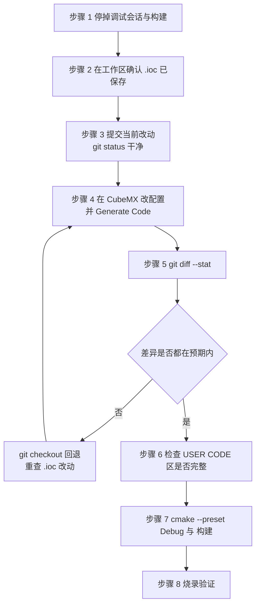
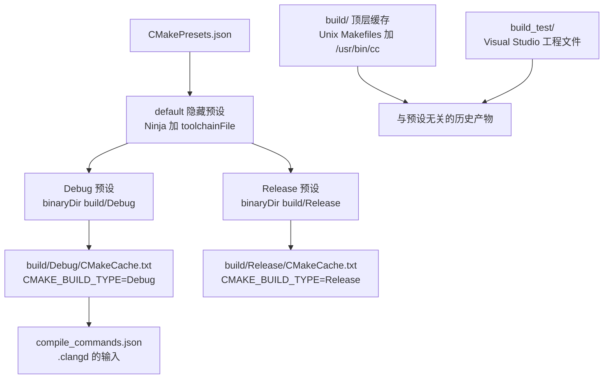

# 重新生成的正确姿势

重新生成（regenerate）指把 `.ioc` 里的配置重新铺成源码。它同时做两件事：用新模板覆盖生成文件，把 USER CODE 区里的旧文本填回去。第二件事只在标记名匹配时成立，所以生成前的仓库状态决定了这次操作是可控还是不可控。

> 源码索引（固件路径相对于各自仓库根目录）

| 文件 | 作用 |
| --- | --- |
| `2026sentriomeni.ioc` | 生成器行为开关与目标工具链 |
| `CMakePresets.json` | 两个配置预设与两个构建预设 |
| `cmake/gcc-arm-none-eabi.cmake` | 默认工具链文件 |
| `cmake/starm-clang.cmake` | 另一套工具链文件，当前未被预设引用 |
| `cmake/stm32cubemx/CMakeLists.txt` | 生成物的文件清单，每次重写 |
| `build/Debug`、`build/Release` | 预设实际使用的两个构建目录 |

## 1. 生成器的四个行为开关

`.ioc` 的 `ProjectManager.` 前缀下面有一组控制生成行为的键，两块板取值相同：

| 键 | 取值 | 作用 |
| --- | --- | --- |
| `KeepUserCode` | `true`（`2026sentriomeni.ioc`） | 保留 USER CODE 区内容 |
| `DeletePrevious` | `true` | 生成前删除上一次写出的文件 |
| `BackupPrevious` | `false` | 不生成备份 |
| `CoupleFile` | `true` | `.c` 与 `.h` 成对生成 |
| `MainLocation` | `Core/Src` | `main.c` 的落点 |
| `FirmwarePackage` | `STM32Cube FW_F4 V1.28.3` | HAL 固件包版本 |
| `TargetToolchain` | `CMake` | 生成 CMake 工程 |
| `CompilerLinker` | `GCC` | 编译器与链接器族 |

`DeletePrevious` 与 `BackupPrevious` 的组合是这次操作风险的主要来源：删除在前、无备份在后。关掉一个外设会让对应的 `Core/Src/xxx.c` 被删除，仓库里若没有提交记录就无法恢复。因此生成前先提交，是这套配置下唯一有效的保护手段。



四个开关里，`KeepUserCode` 与 `DeletePrevious` 管的是同一次生成的两个阶段：先按 `DeletePrevious` 删掉上一次写出的文件，再按 `KeepUserCode` 把标记区文本填回新模板。两者同时为真时，标记外的改动先消失，标记内的内容才谈得上保留。

`BackupPrevious` 为 `false`，生成前不落备份，回滚只能靠版本控制。这是本工程的选择：仓库里有完整提交历史，再放一份备份只会增加目录噪音。

## 2. 逐步操作

第 3 步与第 5 步的具体命令（在固件仓库根目录执行）：

```bash
# 生成前：确认工作区干净，并记下当前提交
git status --short
git rev-parse --short HEAD

# 生成后：先看规模，再看内容
git diff --stat
git diff -- Core/Src/main.c Core/Inc/FreeRTOSConfig.h
```

`git diff --stat` 先看哪些文件被改。正常的一次配置改动通常只影响两三个文件；如果 `Core/Src` 下十几个文件同时变动，多半是固件包版本或工具链设置被动了，需要先回退再查。

第 6 步的检查对象是两类内容：手写代码是否还在（`Core/Src/main.c` 的 BSP 初始化、`stm32f4xx_it.c` 的 `Uart_IRQHandler` 调用、`USB_DEVICE/App/usbd_cdc_if.c` 的 include），以及 `ProjectManager.functionlistsort`（`.ioc`）变化导致的 `MX_xxx_Init()` 调用顺序调整。

第 7 步用预设构建（在仓库根目录执行）：

```bash
cmake --preset Debug
cmake --build --preset Debug
```

## 3. CMakePresets 与 build 目录

`CMakePresets.json` 里有三个配置预设（configure preset）与两个构建预设（build preset），`default` 是隐藏的基础预设：

| 预设 | 继承 | 关键字段 |
| --- | --- | --- |
| `default` | 无（`hidden: true`） | `generator: Ninja`、`binaryDir: ${sourceDir}/build/${presetName}`、`toolchainFile: ${sourceDir}/cmake/gcc-arm-none-eabi.cmake` |
| `Debug` | `default` | `CMAKE_BUILD_TYPE=Debug` |
| `Release` | `default` | `CMAKE_BUILD_TYPE=Release` |

因为 `binaryDir` 里带了 `${presetName}`，两个配置分别落在 `build/Debug` 与 `build/Release`。仓库里这两个目录的 `CMakeCache.txt` 记录了实际使用的工具链：

| 构建目录 | 生成器 | 编译器 | 构建类型 |
| --- | --- | --- | --- |
| `build/Debug` | `Ninja` | 工具链文件 `cmake/gcc-arm-none-eabi.cmake` | `Debug` |
| `build/Release` | `Ninja` | 工具链文件 `cmake/gcc-arm-none-eabi.cmake` | `Release` |
| `build/` | `Unix Makefiles` | `/usr/bin/cc` | 空 |

两个缓存的 `CMAKE_MAKE_PROGRAM` 指向不同的 Ninja：`build/Debug` 是 `/usr/bin/ninja`，`build/Release` 是 STM32Cube 扩展包里的 `ninja/1.13.2+st.1/bin/ninja`，说明这两个目录并非同一次配置产生。

`build/` 顶层那份缓存是早期直接运行 `cmake .` 留下的，用的是主机编译器，与当前预设无关。云台仓库里还有一个 `build_test/`，里面是 Visual Studio 的 `.sln` 与 `.vcxproj`，属于另一次生成器尝试。这两个目录不要当成有效构建结果，删掉不影响预设流程。

根 `CMakeLists.txt` 打开了 `CMAKE_EXPORT_COMPILE_COMMANDS`，编译命令表落在对应的构建目录里。`.clangd` 指向 `CompilationDatabase: build/Debug`，因此 Debug 预设至少要成功配置过一次，编辑器里的跳转和诊断才准。



## 4. 两套工具链

`cmake/` 下有两个工具链（toolchain）文件，当前只有 gcc 那一个被 `CMakePresets.json` 引用：

| 项 | `gcc-arm-none-eabi.cmake` | `starm-clang.cmake` |
| --- | --- | --- |
| 编译器前缀 | `arm-none-eabi-` | `starm-` |
| 编译器 | `gcc` / `g++` | `clang` / `clang++` |
| 目标参数 | `-mcpu=cortex-m4 -mfpu=fpv4-sp-d16 -mfloat-abi=hard` | 同上 |
| Debug 优化 | `-O0 -g3` | `-Og -g3` |
| Release 优化 | `-Os -g0` | `-Oz -g0` |
| C++ 限制 | `-fno-rtti -fno-exceptions -fno-threadsafe-statics` | 同上 |
| 链接参数 | `--specs=nano.specs`、`-T STM32F407XX_FLASH.ld`、`--gc-sections`、`--print-memory-usage` | `-lcrt0-hosted -z norelro`、`-T STM32F407XX_FLASH.ld`、`-z noexecstack` |
| 库配置 | `TOOLCHAIN_LINK_LIBRARIES=m` | `STARM_TOOLCHAIN_CONFIG=STARM_PICOLIBC` |

`starm-clang.cmake` 里 `STARM_TOOLCHAIN_CONFIG` 有三个可选值：`STARM_HYBRID` 用 clang 编译加 GNU 链接器，`STARM_NEWLIB` 用 newlib 的 C 库，`STARM_PICOLIBC` 用 picolibc。当前取第三个（`cmake/starm-clang.cmake`），链接参数里的 `-lcrt0-hosted` 就是 picolibc 的启动代码。

生成代码对两套工具链都做了准备：`Core/Src/syscalls.c` 是 `#if defined(__PICOLIBC__)` 分支，里面是给 picolibc 用的 `starm_putc` 与 `starm_getc`。切到 starm-clang 不需要改 C 文件，只需要把预设里的 `toolchainFile` 指过去。

编辑器一侧的配置在 `.vscode/settings.json` 里（当前是工作区未提交的改动）：

| 项 | 取值 |
| --- | --- |
| `cmake.cmakePath` | `cube-cmake` |
| `cmake.configureArgs` | `-DCMAKE_MAKE_PROGRAM=/usr/bin/ninja`、`-DCMAKE_COMMAND=cube-cmake` |
| `cmake.environmentVariables.PATH` | STM32Cube 扩展包里的 `gnu-tools-for-stm32/14.3.1+st.2/bin`、`ninja/1.13.2+st.1/bin`、`stlink-gdbserver/7.13.0+st.3/bin` |
| `stm32cube-ide-clangd.path` | `cube`（即 `starm-clangd`），`--query-driver` 指向 `arm-none-eabi-gcc` 与 `arm-none-eabi-g++` |

也就是说，编译实际由 GCC 14.3.1 完成，语言服务由 starm-clangd 通过 GCC 的编译命令表提供。

## 5. 一次构建故障的启示

CubeMX 6.15 之后，在 CLion 里直接打开工程会出现一个现象：编译时报出与“简单项目或测试”相关的错误，解决办法是在 CMake 选项里显式指定

```bash
-DCMAKE_TOOLCHAIN_FILE=./cmake/gcc-arm-none-eabi.cmake
```

本工程的 `CMakePresets.json` 已经在 `default` 预设里通过 `toolchainFile` 填了同一个文件，所以走预设流程不会遇到这个问题。用 CLion 直接打开工程而绕过预设时，需要手工补上这一条。

## 6. 易错点

- 生成前不提交。`DeletePrevious=true` 加 `BackupPrevious=false`，生成的删除动作没有回退路径。
- 只看 `git diff` 的总行数，不看具体文件。一次正常的配置改动应集中在少数文件，`Core/Src` 全量变动通常意味着固件包或工具链被换过。
- 把 `build/` 顶层或 `build_test/` 当成有效构建目录。它们不是预设产出的，配置参数与工具链都不同。
- 在 starm-clang 与 gcc 之间切换时只改预设不改清理。两个工具链的目标文件不通用，切换后需要删掉对应构建目录重新配置。
- 用 CLion 打开工程后仍以为预设生效。CLion 自己维护一套 CMake 配置，工具链文件要手工指定。

## 7. 小结

### 核心概念

- 重新生成等于模板覆盖加标记回填，回填只在标记名匹配时发生。
- `.ioc` 里 `ProjectManager.` 一组键决定行为，其中 `DeletePrevious=true` 与 `BackupPrevious=false` 要求生成前必须有干净提交。
- `CMakePresets.json` 的 `binaryDir` 带 `${presetName}`，Debug 与 Release 落在两个目录；`.clangd` 读的是 `build/Debug`。
- 工程带两套工具链文件，预设只引用 gcc 那一套；starm-clang 与 gcc 的目标文件不能混用。
- 生成后的验证顺序是先看 `git diff --stat` 的规模，再看 USER CODE 区是否完整，最后构建。

### 设计权衡

| 选择 | 本工程怎么选的 | 代价与收益 |
| --- | --- | --- |
| 生成前备份 | 关（`BackupPrevious=false`） | 目录干净、不产生副本；代价是覆盖与删除只能靠版本控制兜底 |
| 构建预设 | 只做 Debug 与 Release 两个 | 配置简单；代价是没有专门的 `RelWithDebInfo`，发布版调试信息为 `-g0` |
| 工具链选择 | 预设固定 GCC | 与 STM32Cube 扩展包自带工具链一致；代价是 starm-clang 文件存在但无人维护，容易失效 |
| 语言服务 | starm-clangd 读 GCC 的编译命令表 | 不改构建即可获得诊断；代价是两者对扩展语法的支持不完全一致 |
| 构建目录 | 预设目录加历史遗留目录并存 | 历史构建结果可直接复用；代价是 `build/` 与 `build_test/` 容易误认为是当前配置 |

## 8. 练习

基础题

1. 由 `CMakePresets.json` 写出 `Debug` 预设的完整配置命令，并说明 `binaryDir` 展开后的绝对路径。
2. 说明 `ProjectManager.DeletePrevious=true` 时，把 `.ioc` 里的 I2C3 关掉后重新生成会发生什么。
3. 从两份工具链文件里找出 Debug 与 Release 的优化级别差异，并判断哪一套更适合调试会浮点运算的控制代码。

挑战题

4. 在现有预设基础上新增一个使用 `cmake/starm-clang.cmake` 的 `DebugStarm` 预设，要求构建目录不与现有两个冲突，并说明切换后为什么要先删掉旧目录。
5. 设计一次“只改中断优先级”的重新生成流程：从 `.ioc` 的哪一行改起、生成后要 diff 哪几个文件、验证哪些生成行，写出完整步骤。
6. 假设一次生成后 `Core/Src/usart.c` 里的 DMA 模式从 `DMA_CIRCULAR` 变成了 `DMA_NORMAL`，而 `.ioc` 显示 `Dma.USART3_RX.2.Mode=DMA_CIRCULAR`。列出三种可能的原因与各自的核对手段。
