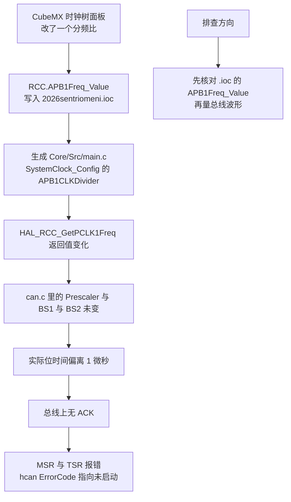
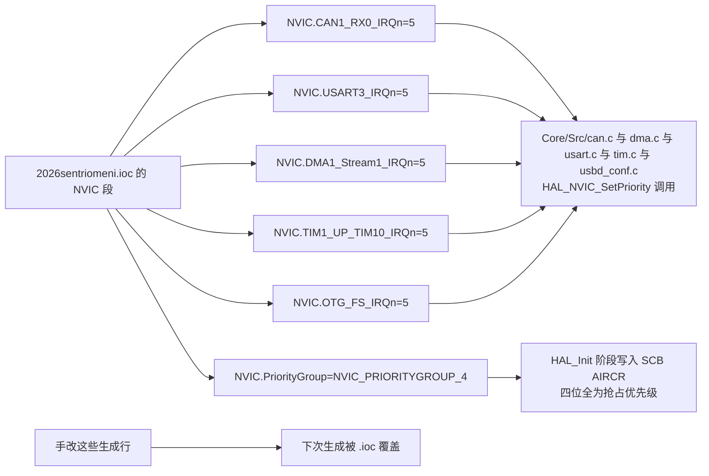

# 常见易错点

这一节集中处理六类问题，每一条都给出云台或底盘固件里的实际证据，并标出哪些结论是核实的、哪些是推测。涉及外设参数的原始值都来自 `2026sentriomeni.ioc`。

> 源码索引（固件路径相对于各自仓库根目录）

| 文件 | 作用 |
| --- | --- |
| `2026sentriomeni.ioc` | 配置源，含 `RCC.`、`NVIC.`、`CAN1.`、`CRC` 相关键 |
| `Core/Inc/stm32f4xx_hal_conf.h` | `HSE_VALUE` 的定义处 |
| `Core/Src/main.c` | USB 初始化位置、`USER CODE` 标记 |
| `Core/Src/can.c`、`dma.c`、`usart.c`、`tim.c` | 中断优先级写入点 |
| `USB_DEVICE/Target/usbd_conf.c` | USB OTG 中断优先级写入点 |
| `云台串口协议.md` | 上位机 CRC 代码示例的所在文件 |

## 1. crc.hpp 的出处核实

先给结论：`2026sentriomeni.ioc` 里没有 `#include` 语句。`.ioc` 是键值文件，全文不含 `#` 开头的预处理指令，唯一以 `#` 开头的行是第一行注释 `#MicroXplorer Configuration settings - do not modify`。在整个云台与底盘仓库里检索 `crc.hpp`，只有一处命中：

```c
/* 云台串口协议.md，上位机 crc 生成及检验源码一节 */
#include "crc.hpp"
```

该文件是飞书文档导出的协议说明，`crc.hpp` 属于上位机侧的 C++ 示例，与固件的生成流程无关。

容易与它混淆的是固件里真实存在的两套 CRC：

| 对象 | 位置 | 来源 |
| --- | --- | --- |
| HAL 的 CRC 外设 | `Core/Src/crc.c`、`Core/Inc/crc.h` | 由 `.ioc` 的 `Mcu.IP2=CRC`生成，`main.c` 自动 `#include "crc.h"` |
| 工程自带的校验算法 | `Algorithm/Inc/CRC8.h`、`Algorithm/Inc/CRC16.h` | 人工编写，编译进可执行文件 |

HAL 的 CRC 外设在本工程里只完成初始化：`hcrc` 只出现在 `Core/Src/crc.c` 内部（、、、），全工程没有任何 `HAL_CRC_Calculate()` 或 `HAL_CRC_Accumulate()` 调用。协议里的校验走 `Algorithm` 目录下的查表实现。保留这个外设的代价是 `STM32_Drivers` 里多编译一个 `stm32f4xx_hal_crc.c`（`cmake/stm32cubemx/CMakeLists.txt`），收益是暂时没有。

这六条问题的共同点在于：现象出现在生成产物里，根因却在配置源或生成规则上。排查顺序因此固定为「先确认值写在哪一类文件，再看它会不会被下一次生成覆盖」。顺序反过来做，容易在生成文件里改出一个临时能用的版本，然后被下一次重新生成还原。

## 2. HSE_VALUE 的传播路径

`HSE_VALUE` 在 `.ioc` 里是 `RCC.HSE_VALUE=12000000`（`2026sentriomeni.ioc`），生成后落在 `Core/Inc/stm32f4xx_hal_conf.h`：

```c
#if !defined  (HSE_VALUE)
  #define HSE_VALUE    12000000U /*!< Value of the External oscillator in Hz */
#endif /* HSE_VALUE */
```

`#if !defined` 的存在意味着它允许被编译宏覆盖，本工程的编译宏里没有 `HSE_VALUE`（`cmake/stm32cubemx/CMakeLists.txt` 只有 `USE_HAL_DRIVER`、`STM32F407xx`、`DEBUG`），所以 12 MHz 来自头文件。两块板一致，云台首次提交（`6492d5b`）时就是 12000000。

这个值参与三处计算，改错会同时出问题：

| 使用方 | 依赖方式 |
| --- | --- |
| `SystemClock_Config()` | `PLLM=6` 按 HSE 分频得到 2 MHz 的 VCO 输入（`Core/Src/main.c`） |
| `HAL_RCC_GetHCLKFreq()` 一族 | 由 HSE 与 PLL 参数反推总线频率，DWT 延时与波特率计算都基于它 |
| `RCC.RTCHSEDivFreq_Value=6000000`（`.ioc`） | 12 MHz 的一半，时钟树面板里的派生值 |

云台与底盘的实际配置是 HSE 12 MHz 经 `PLLM=6`、`PLLN=168`、`PLLP=2` 得到 168 MHz，APB1 除以 4 得 42 MHz，APB2 除以 2 得 84 MHz。若把 `.ioc` 里的 `HSE_VALUE` 改成 8 MHz 后重新生成，HAL 会按 8 MHz 反推 SYSCLK，而实际晶振仍是 12 MHz，所有由 `HAL_RCC_GetPCLK1Freq()` 派生的波特率都会偏低三分之一。

## 3. 时钟树改动打掉 CAN 波特率

一次典型的故障是这样的：底盘 CAN1 与 CAN2 全部无法收发，第一次发送返回 `HAL_OK`，之后返回 `HAL_ERROR`，`hcan2.ErrorCode` 为 `0x00200000`（`HAL_CAN_ERROR_NOT_STARTED`），`MSR` 为 `0x0C08`（错误中断挂起）。代码层排查全部正常，根因是时钟树配置被改动，导致波特率计算错误。

CAN 位时间（bit time）的计算方式是

$$t_{bit} = Prescaler \times (1 + BS1 + BS2) \times \frac{1}{f_{APB1}}$$

当前配置是 `Prescaler=2`、`BS1=CAN_BS1_15TQ`、`BS2=CAN_BS2_5TQ`、`SJW=CAN_SJW_1TQ`（`.ioc`），APB1 为 42 MHz，于是

$$t_{bit} = 2 \times 21 \times \frac{1}{42\ \text{MHz}} = 1\ \mu\text{s} \quad \Rightarrow \quad 1\ \text{Mbps}$$

`.ioc` 自己算出的两个派生值可以交叉验证：`CAN1.CalculateTimeQuantum=47.61904761904762`等于 $\frac{2}{42\ \text{MHz}} = 47.619\ \text{ns}$，一个位时间 21 个 TQ 即 `CAN1.CalculateTimeBit=1000`（，单位 ns）。

记录里给出的 `857142 Hz` 反推回来是 $f_{APB1} = 857142 \times 42 = 36\ \text{MHz}$，即当时 APB1 不是 42 MHz。波特率不匹配时，CAN 帧得不到 ACK，节点进入错误状态并锁定，于是出现“首次发送进邮箱、后续全部失败”的现象。



## 4. 中断优先级写在生成文件里

本工程的中断优先级全部落在生成代码里，没有一处写在手写文件中：

| 中断 | 写入位置 |
| --- | --- |
| `CAN1_RX0`、`CAN1_RX1`、`CAN2_RX0`、`CAN2_RX1` | `Core/Src/can.c` |
| 五个 DMA 流 | `Core/Src/dma.c` |
| `USART3`、`USART6` | `Core/Src/usart.c` |
| `TIM1_UP_TIM10` | `Core/Src/tim.c` |
| `OTG_FS` | `USB_DEVICE/Target/usbd_conf.c` |
| `PendSV` | `Core/Src/stm32f4xx_hal_msp.c` |
| `TIM2` | `Core/Src/stm32f4xx_hal_timebase_tim.c`，取 `HAL_InitTick()` 的入参 |

这些行都在标记之外，重新生成时按 `.ioc` 的 `NVIC.*` 键重写。外设中断的数值统一是 5，与 `FREERTOS.configLIBRARY_MAX_SYSCALL_INTERRUPT_PRIORITY=5`（`.ioc`，生成到 `Core/Inc/FreeRTOSConfig.h`）一致；优先级组是 `NVIC.PriorityGroup=NVIC_PRIORITYGROUP_4`（`.ioc`），四个位全部用于抢占优先级（preemption priority），所以 5 这个数值在编码后仍表示抢占优先级 5。

`PendSV` 与 `SysTick` 的配置有个例外。`.ioc` 里两者都是 15（、），而 FreeRTOS 的移植层在 `xPortStartScheduler()` 里会再写一次优先级寄存器（`Middlewares/Third_Party/FreeRTOS/Source/portable/GCC/ARM_CM4F/port.c`），写入值来自 `configKERNEL_INTERRUPT_PRIORITY`（`Core/Inc/FreeRTOSConfig.h`，即 `configLIBRARY_LOWEST_INTERRUPT_PRIORITY=15` 左移 4 位）。因此这两行的作用是在调度器启动之前维持一个较弱的优先级设定，把 `.ioc` 里它们的值改小，在调度器启动后不生效。



## 5. USER CODE 结束标记被写坏

云台 `Core/Src/main.c` 里有一行 `/* USER CODE _angleEND Init */`，与模板要求的 `/* USER CODE END Init */` 不同。全文件统计为 `USER CODE BEGIN` 19 次、`USER CODE END` 18 次，唯一不成对的就是 `Init` 区。底盘同一位置是正常写法（`Core/Src/main.c`）。

git 检索这一行最早出现在提交 `88f2774`（自喵修复，尝试解决usb断连中）。当前 `Init` 区内没有内容，未造成损失。生成器对不成对标记的具体处理方式没有从生成器源码验证，可确认的是名称与模板不一致时无法配对。

对比两块板的写法可以看出这类损坏很难靠肉眼发现：两个文件在编辑器里看起来都是规整的注释行，只有把 `USER CODE BEGIN` 与 `USER CODE END` 按名称做配对检查才会暴露。

## 6. 引脚定义不都在 main.h 里

云台的 `Core/Inc/main.h` 只定义了一个引脚：

```c
/* Core/Inc/main.h */
#define KEY_Pin GPIO_PIN_0
#define KEY_GPIO_Port GPIOA
```

PA4、PB0、PG6、PH11 是普通输出，PG3 是上升沿中断，它们的模式、上下拉与初始电平都直接写在 `Core/Src/gpio.c` 里，没有对应的宏：

| 引脚 | 配置 | 位置 |
| --- | --- | --- |
| PA4 | 推挽输出，初始置位 | `Core/Src/gpio.c` |
| PB0 | 推挽输出，初始置位 | `Core/Src/gpio.c` |
| PG6、PH11 | 推挽输出，初始复位 | `Core/Src/gpio.c` |
| PG3 | 上升沿中断，上拉 | `Core/Src/gpio.c` |
| PA0 | 上升沿加下降沿中断，上拉 | `Core/Src/gpio.c`，宏来自 `main.h` |

可观察到的一致性是只有带 `GPIO_Label` 的引脚会生成 `*_Pin` 宏，`.ioc` 里只有 `PA0-WKUP.GPIO_Label=KEY`这一条；这条规则的完整定义未从生成器源码验证。查引脚配置时先看 `gpio.c`，再看 `stm32f4xx_hal_msp.c`，`main.h` 只能提供其中一个。

## 7. 小结

### 核心概念

- `.ioc` 是键值文件，不含预处理指令；`crc.hpp` 来自 `云台串口协议.md` 的上位机示例，与生成流程无关。
- HAL 的 CRC 外设由 `.ioc` 使能并生成 `crc.c`，本工程没有调用它的任何计算函数，校验走 `Algorithm/Inc/CRC16.h`。
- `HSE_VALUE` 定义在 `stm32f4xx_hal_conf.h`，被 `#if !defined` 包住；改动它会同时影响系统时钟反推与全部派生波特率。
- CAN 位时间是 $t_{bit} = Prescaler \times (1+BS1+BS2)/f_{APB1}$，当前配置给出 1 Mbps；总线波特率不匹配的典型现象是首次发送成功、随后错误状态锁定。
- 外设中断优先级写在生成文件里，改优先级要改 `.ioc` 的 NVIC 段；`PendSV` 与 `SysTick` 的数值在调度器启动后由移植层覆盖。
- 手写代码只能放在 USER CODE 区，标记名写错会静默失去保护。

### 设计权衡

| 选择 | 本工程怎么选的 | 代价与收益 |
| --- | --- | --- |
| CRC 实现 | 不用 HAL 外设，用 `Algorithm` 下的查表实现 | 校验逻辑与协议完全对应；代价是 `.ioc` 里多一个空转的 CRC 外设与一份 HAL 源文件 |
| HSE 取值来源 | 写在 `.ioc` 并生成到头文件 | 单一来源、可追溯；代价是头文件里的 12 MHz 与实物晶振的一致性只能靠人工保证 |
| 中断优先级来源 | 全部由 `.ioc` 生成 | 与外设配置同源，便于统一检查；代价是无法在代码里随手微调 |
| 引脚宏 | 只给带标签的引脚生成宏 | `main.h` 干净；代价是查引脚配置要跨 `gpio.c` 与 `stm32f4xx_hal_msp.c` |
| USER CODE 保护 | 依赖注释标记 | 不引入额外工具；代价是标记损坏不会报错，只能靠配对检查发现 |

## 8. 练习

基础题

1. 由 `.ioc` 里的 `CAN1.Prescaler`、`CAN1.BS1`、`CAN1.BS2` 与 `RCC.APB1Freq_Value` 计算 CAN1 的位时间与波特率，并与 `CAN1.CalculateBaudRate` 对照。
2. 说明把 `CAN1.BS1` 从 `CAN_BS1_15TQ` 改成 `CAN_BS1_13TQ` 后波特率变成多少，以及需要同时改哪个值才能保持 1 Mbps。
3. 列出 `Core/Src/main.c` 里所有位于生成区的中断优先级调用，并指出它们在哪个文件里被配置。

挑战题

4. 已知 `hcan2.ErrorCode` 为 `0x00200000`、`MSR` 为 `0x0C08`。写出从这两个值到“时钟树被改动”的推理链，并给出两条能排除纯硬件故障的验证手段。
5. 把 `HSE_VALUE` 从 12000000 改成 8000000，重新生成后不修改其他任何配置。分析 `SystemCoreClock`、DWT 延时、CAN1 波特率、USART3 波特率四项的结果，并说明哪一项会先暴露问题。
6. 设计一个在生成后自动运行的配对检查：读 `Core/Src` 与 `Core/Inc` 下所有文件，按名称配对 `USER CODE BEGIN` 与 `USER CODE END`，输出不成对的位置。要求说明为什么检查要按文件而不是按目录进行。
