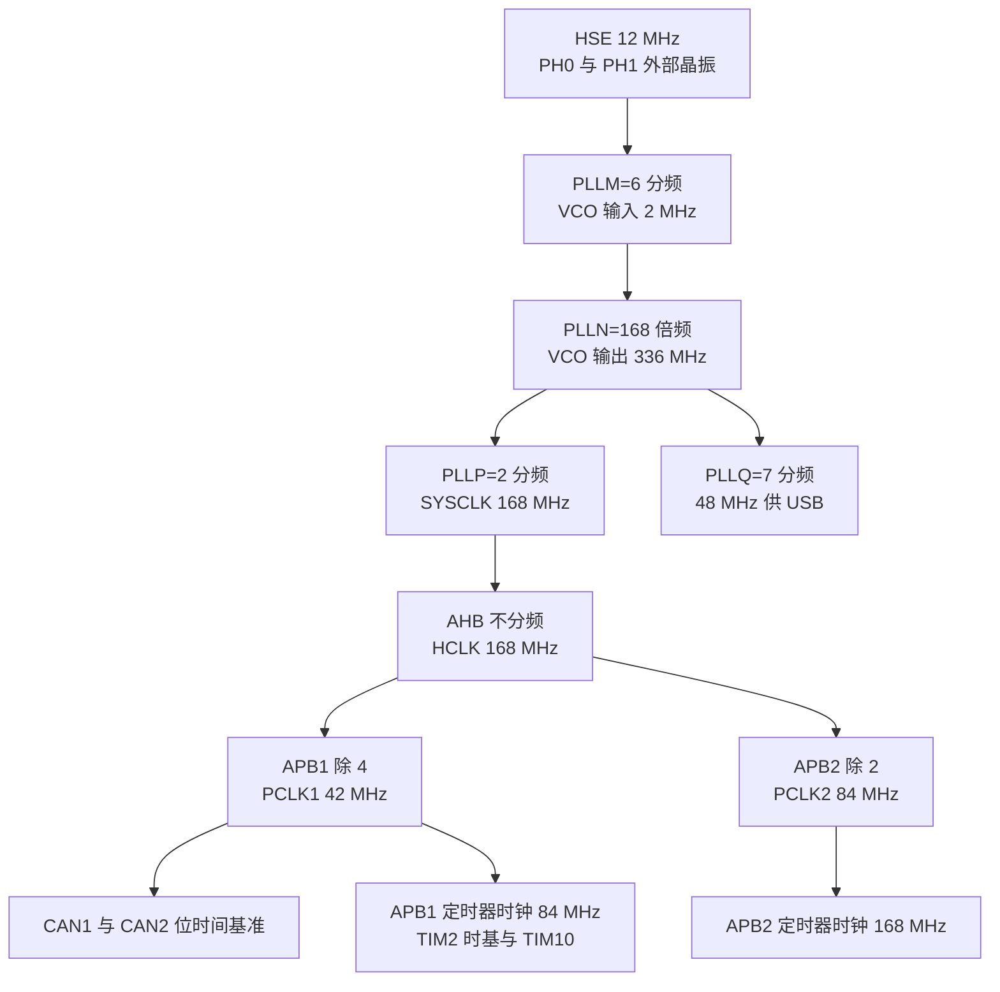
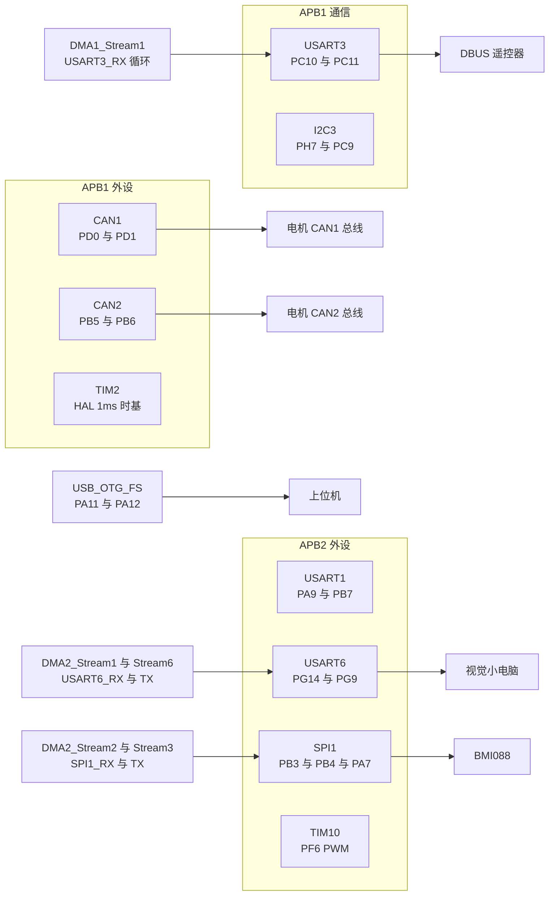
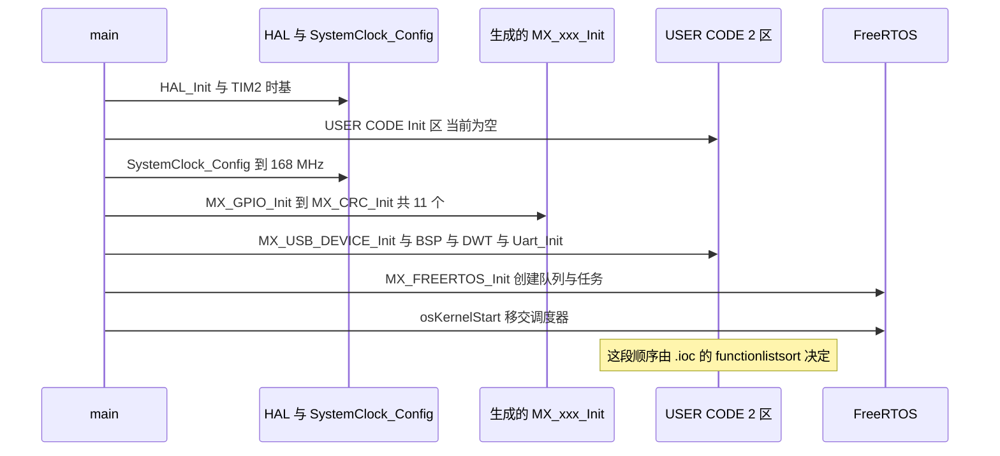
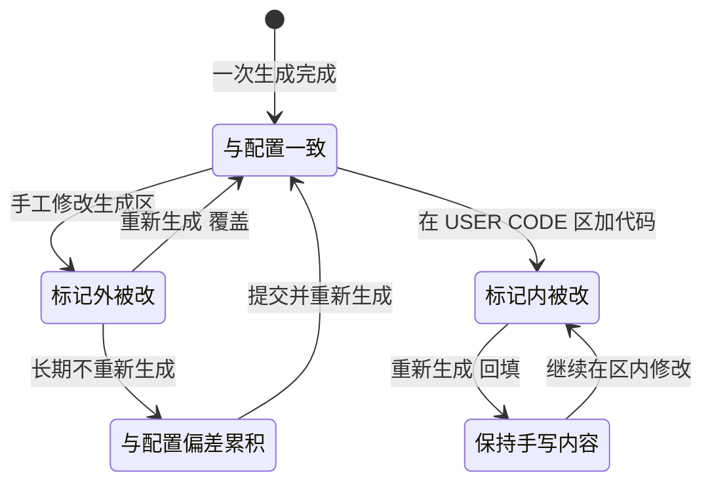

# 本项目 CubeMX 配置清单

两份配置文件的文件名相同，芯片型号相同，外设集合相同，差异集中在少量参数上。这一节把 `2026sentriomeni.ioc` 里的全部有效配置整理成表，便于和生成代码或实物接线对照。

> 源码索引（固件路径相对于各自仓库根目录）

| 文件 | 作用 |
| --- | --- |
| `2026sentriomeni.ioc` | 云台 461 行、底盘 467 行，配置来源 |
| `Core/Src/main.c` | `SystemClock_Config()` 与 `MX_xxx_Init()` 调用顺序 |
| `Core/Src/gpio.c`、`Core/Src/stm32f4xx_hal_msp.c` | 引脚模式与外设引脚复用 |
| `Core/Inc/FreeRTOSConfig.h` | 内核配置的生成结果 |
| `Core/Src/freertos.c` | `defaultTask` 的优先级与栈 |

## 1. 芯片与工程

| 键 | 取值 | 位置 |
| --- | --- | --- |
| `Mcu.CPN` | `STM32F407IGH6` | `.ioc:159` |
| `Mcu.Package` | `UFBGA176` | `.ioc:179` |
| `Mcu.UserName` | `STM32F407IGHx` | `.ioc:216` |
| `Mcu.PinsNb`、`Mcu.IPNb` | 33、16（底盘 34、16） | `.ioc:213`、`:177` |
| `Mcu.ThirdPartyNb` | 0 | `.ioc:214` |
| `MxCube.Version`、`MxDb.Version` | 6.16.1、DB.6.0.161 | `.ioc:217-218` |
| `File.Version` | 6 | `.ioc:147` |
| `ProjectManager.FirmwarePackage` | `STM32Cube FW_F4 V1.28.3` | `.ioc:338` |
| `ProjectManager.TargetToolchain` | `CMake` | `.ioc:355` |
| `ProjectManager.MainLocation` | `Core/Src` | `.ioc:346` |
| `ProjectManager.StackSize`、`HeapSize` | `0x400`、`0x200` | `.ioc:354`、`:342` |
| `board`、`rtos.0.ip` | `custom`、`FREERTOS` | `.ioc:460-461` |

## 2. 启用的 IP

`Mcu.IP0` 到 `Mcu.IP15`（`.ioc:161-176`）共 16 项，两块板完全一致：

| IP | 类别 | 关键参数 |
| --- | --- | --- |
| `RCC` | 时钟 | HSE 12 MHz，PLL 到 168 MHz |
| `SYS` | 系统 | 时基 `TIM2`，SWD 两线 |
| `NVIC` | 中断 | 优先级组 4，外设中断统一 5 |
| `DMA` | DMA | 5 个请求 |
| `CAN1`、`CAN2` | 通信 | 1 Mbps，正常模式 |
| `USART1` | 通信 | 115200，8N1 |
| `USART3` | 通信 | 100000，8E1，仅接收 |
| `USART6` | 通信 | 115200，8N1，收发 |
| `SPI1` | 通信 | 主机，模式 3，1.3125 Mbps |
| `I2C3` | 通信 | 400 kHz，7 位地址 |
| `TIM10` | 定时器 | PWM1，50 Hz 级周期 |
| `CRC` | 校验 | 仅初始化，未被调用 |
| `FREERTOS` | 内核 | CMSIS-RTOS V1 封装 |
| `USB_OTG_FS`、`USB_DEVICE` | 通信 | 设备模式，CDC 类 |

GPIO 不在 `Mcu.IPn` 列表里，只要有引脚被配置，就会生成 `Core/Inc/gpio.h` 与 `Core/Src/gpio.c`。`NVIC`、`RCC`、`SYS` 同样属于配置项。

## 3. 时钟树

| 项 | 取值 | 位置 |
| --- | --- | --- |
| HSE | 12 MHz | `.ioc:375` |
| `PLLM`、`PLLN`、`PLLQ` | 6、168、7 | `.ioc:383-385` |
| PLLP | 2（生成代码为 `RCC_PLLP_DIV2`） | `Core/Src/main.c:172` |
| SYSCLK、HCLK | 168 MHz | `.ioc:389`、`:374` |
| APB1 分频与频率 | `RCC_HCLK_DIV4`、42 MHz | `.ioc:363-364` |
| APB2 分频与频率 | `RCC_HCLK_DIV2`、84 MHz | `.ioc:366-367` |
| APB1 定时器时钟 | 84 MHz | `.ioc:365` |
| APB2 定时器时钟 | 168 MHz | `.ioc:368` |
| 48 MHz 时钟（USB） | 48 MHz，由 `PLLQ=7` 得到 | `.ioc:361`、`:386` |
| Flash 等待周期 | `FLASH_LATENCY_5` | `.ioc:372` |

派生关系是 $f_{SYSCLK} = \frac{12\ \text{MHz}}{6} \times 168 \div 2 = 168\ \text{MHz}$，APB1 定时器时钟为 $42 \times 2 = 84\ \text{MHz}$，APB2 定时器时钟为 $84 \times 2 = 168\ \text{MHz}$。CAN 挂在 APB1 上，用 42 MHz 计算位时间。

## 4. 中断配置

`NVIC` 段（`.ioc:219-248`）里与固件相关的是外设条目，数值段的第一项是抢占优先级：

| 中断 | 优先级 | 位置 |
| --- | --- | --- |
| `CAN1_RX0`、`CAN1_RX1`、`CAN2_RX0`、`CAN2_RX1` | 5 | `.ioc:220-223` |
| `DMA1_Stream1`、`DMA2_Stream1`、`DMA2_Stream2`、`DMA2_Stream3`、`DMA2_Stream6` | 5 | `.ioc:224-228` |
| `OTG_FS` | 5 | `.ioc:234` |
| `TIM1_UP_TIM10` | 5 | `.ioc:242` |
| `USART3`、`USART6` | 5 | `.ioc:246-247` |
| `TIM2`（HAL 时基） | 15 | `.ioc:243` |
| `PendSV`、`SysTick` | 15 | `.ioc:235`、`:241` |
| `HardFault` 与 `MemManage` 与 `BusFault` 与 `UsageFault` 与 `SVCall` | 0 | `.ioc:231-233`、`:237`、`:248` |

其余开关：`NVIC.PriorityGroup=NVIC_PRIORITYGROUP_4`（`:236`）、`NVIC.TimeBase=TIM2_IRQn`（`:244`）、`NVIC.TimeBaseIP=TIM2`（`:245`）、`NVIC.ForceEnableDMAVector=true`（`:230`）。最后一项保证五个 DMA 流的中断向量被强制使能，否则生成代码可能只使能外设而不使能向量。

## 5. DMA 分配

`Dma.RequestsNb=5`（`.ioc:40`），每个请求对应一个流：

| 请求 | 流与通道 | 方向 | 模式 | 优先级 |
| --- | --- | --- | --- | --- |
| `USART6_RX` | `DMA2_Stream1` 通道 5 | 外设到内存 | `NORMAL` | `HIGH` |
| `USART6_TX` | `DMA2_Stream6` 通道 5 | 内存到外设 | `CIRCULAR` | `HIGH` |
| `USART3_RX` | `DMA1_Stream1` 通道 4 | 外设到内存 | `CIRCULAR` | `HIGH` |
| `SPI1_RX` | `DMA2_Stream2` 通道 3 | 外设到内存 | `NORMAL` | `VERY_HIGH` |
| `SPI1_TX` | `DMA2_Stream3` 通道 3 | 内存到外设 | `NORMAL` | `HIGH` |

USART3 与 USART6_TX 用循环模式，前者服务 DBUS 遥控器的连续接收，后者持续发送视觉数据；SPI1 的一对用普通模式，每次读寄存器重新启动。

## 6. 外设参数

| 外设 | 参数 | 位置 |
| --- | --- | --- |
| CAN1 / CAN2 | `Prescaler=2`、`BS1=15TQ`、`BS2=5TQ`、`SJW=1TQ`、`Mode=NORMAL`、`NART=ENABLE`、`ABOM=ENABLE` | `.ioc:5-19`、`:20-34` |
| USART1 | 115200、8 位、无校验、收发 | `Core/Src/usart.c:46-51` |
| USART3 | 100000、8 位、偶校验、仅接收 | `.ioc:428-435` |
| USART6 | 115200、8 位、无校验、收发 | `.ioc:436-443` |
| SPI1 | 主机、8 位、`POLARITY_HIGH`、`PHASE_2EDGE`、软件 NSS、`PRESCALER_64` | `.ioc:401-413` |
| I2C3 | 400 kHz、`DUTYCYCLE_2`、7 位地址、`OwnAddress=0` | `.ioc:149-157` |
| TIM10 | `Prescaler=0`、`Period=4999`、`PWM1`、`Pulse=0`、通道 1 | `.ioc:414-425` |
| CRC | 只调用 `MX_CRC_Init()` | `.ioc:450-451` |
| USB_DEVICE | CDC 类，全速 | `.ioc:444-447` |

TIM10 的计数时钟是 APB2 定时器时钟 168 MHz，`Prescaler=0` 时计数频率 168 MHz，`Period=4999` 时更新频率

$$f_{PWM} = \frac{168\ \text{MHz}}{(0+1) \times (4999+1)} = 33.6\ \text{kHz}$$

`Pulse=0` 表示初始占空比（duty cycle）为 0，实际占空比由运行期写 `__HAL_TIM_SET_COMPARE()` 决定。

## 7. 引脚分配

云台板 33 项引脚，其中 5 项是虚拟引脚（virtual pin，`VP_` 前缀，表示外设与中间件的连接关系，不对应物理管脚）：

| 外设 | 引脚 | 位置 |
| --- | --- | --- |
| CAN1 | PD0 `CAN1_RX`、PD1 `CAN1_TX` | `.ioc:300-305` |
| CAN2 | PB5 `CAN2_RX`、PB6 `CAN2_TX` | `.ioc:279-284` |
| USART1 | PA9 `USART1_TX`、PB7 `USART1_RX` | `.ioc:269-270`、`:285-286` |
| USART3 | PC10 `USART3_TX`、PC11 `USART3_RX` | `.ioc:287-290` |
| USART6 | PG14 `USART6_TX`、PG9 `USART6_RX` | `.ioc:308-309`、`:316-317` |
| SPI1 | PB3 `SCK`、PB4 `MISO`、PA7 `MOSI` | `.ioc:275-278`、`:267-268` |
| I2C3 | PH7 `SCL`、PC9 `SDA` | `.ioc:324-325`、`:291-292` |
| TIM10 | PF6 `TIM10_CH1` | `.ioc:306-307` |
| USB OTG FS | PA11 `DM`、PA12 `DP` | `.ioc:255-258` |
| SWD | PA13 `SWDIO`、PA14 `SWCLK` | `.ioc:259-262` |
| 外部中断 | PA0 `KEY`、PG3 `GPXTI3` | `.ioc:249-254`、`:310-313` |
| 普通输出 | PA4、PB0、PG6、PH11 | `.ioc:263-266`、`:271-274`、`:314-315`、`:322-323` |
| 晶振 | PH0、PH1 | `.ioc:318-321` |

5 项虚拟引脚的名称分别是 `VP_CRC_VS_CRC`、`VP_FREERTOS_VS_CMSIS_V1`、`VP_SYS_VS_tim2`、`VP_TIM10_VS_ClockSourceINT`、`VP_USB_DEVICE_VS_USB_DEVICE_CDC_FS`。`VP_SYS_VS_tim2` 就是 HAL 时基选 TIM2 的记录，它决定了会生成 `Core/Src/stm32f4xx_hal_timebase_tim.c`。

## 8. FreeRTOS 配置

`FREERTOS.` 前缀下的键（`.ioc:91-146`）生成到 `Core/Inc/FreeRTOSConfig.h`：

| 键 | 云台 | 底盘 | 生成位置 |
| --- | --- | --- | --- |
| `HEAP_NUMBER`、`MEMORY_ALLOCATION` | 4、2 | 同 | `heap_4.c` 与动态分配 |
| `configTOTAL_HEAP_SIZE` | 40960 | 同 | `FreeRTOSConfig.h:67` |
| `configTICK_RATE_HZ` | 1000 | 同 | `FreeRTOSConfig.h:64` |
| `configMAX_PRIORITIES` | 7 | 同 | `FreeRTOSConfig.h:65` |
| `configMINIMAL_STACK_SIZE` | 256 | 512 | `FreeRTOSConfig.h:66` |
| `configLIBRARY_LOWEST_INTERRUPT_PRIORITY` | 15 | 同 | `FreeRTOSConfig.h:104` |
| `configLIBRARY_MAX_SYSCALL_INTERRUPT_PRIORITY` | 5 | 同 | `FreeRTOSConfig.h:110` |
| `configUSE_MUTEXES`、`configUSE_TASK_NOTIFICATIONS` | 1、1 | 同 | 内核功能开关 |
| `INCLUDE_vTaskDelayUntil` | 0 | 同 | 无严格周期延时 |
| `configUSE_TRACE_FACILITY`、`configCHECK_FOR_STACK_OVERFLOW` | 0、0 | 同 | 无任务列表与栈检查 |
| `Tasks01` | `defaultTask,0,256` | `defaultTask,-3,512` | `Core/Src/freertos.c` |

`Tasks01` 的第二段是优先级，第三段是栈字数。云台生成 `osPriorityNormal` 与 256 words（`Core/Src/freertos.c:123`），底盘生成 `osPriorityIdle` 与 512 words（`Core/Src/freertos.c:121`）。

## 9. 两块板的差异

两份 `.ioc` 的全部差异如下，其余内容逐行相同：

| 差异 | 云台 | 底盘 | 归属 |
| --- | --- | --- | --- |
| `CAD.formats`、`CAD.pinconfig`、`CAD.provider` | 空、空、空 | `[]`、`Dual`、`Component Search Engine` | 视图状态 |
| `FREERTOS.Tasks01` | `defaultTask,0,256` | `defaultTask,-3,512` | 功能配置 |
| `FREERTOS.configMINIMAL_STACK_SIZE` | 256 | 512 | 功能配置 |
| 引脚数量 | 33 | 34（多 PA10） | 功能配置 |
| PA10 用途 | 未使用 | `USB_OTG_FS_ID` | 功能配置 |
| `NVIC.OTG_FS_IRQn` 的一个布尔段 | `true` | `false` | 字段含义未验证 |
| `NVIC.SysTick_IRQn` 的一个布尔段 | `false` | `true` | 字段含义未验证 |
| `ProjectManager.functionlistsort` | USB 在 13、CRC 在 12 | USB 在 12、CRC 在 13 | 生成顺序记录 |
| `USB_DEVICE` 描述符 | 默认 | `PID=202`、`shaobing_chassis`、`Virtual ComPort` | 功能配置 |
| 其余 `Mcu.Pin*` 编号 | 从 `Mcu.Pin15` 起 | 整体后移一位 | 编号 |

`USB_DEVICE` 的三条描述符键落在 `USB_DEVICE/App/usbd_desc.c:67-69` 的宏上，是两块板枚举出不同设备名与 PID 的原因。

## 10. 生成产物与标记数

| 文件 | 行数 | USER CODE 标记对 | 手写内容 |
| --- | --- | --- | --- |
| `Core/Src/main.c` | 249 | 19 与 18（不成对） | 回调与 BSP 初始化 |
| `Core/Src/stm32f4xx_it.c` | 372 | 50 | USART3 中断一处调用 |
| `Core/Src/usart.c` | 344 | 24 | 无 |
| `Core/Src/can.c` | 224 | 17 | 无 |
| `Core/Src/freertos.c` | 162 | 17 | 队列与任务创建 |
| `Core/Src/tim.c` | 139 | 12 | 无 |
| `Core/Src/gpio.c` | 112 | 4 | 无 |
| `Core/Src/dma.c` | 68 | 4 | 无 |
| `Core/Inc/FreeRTOSConfig.h` | 139 | 5 | `configASSERT` |
| `Core/Inc/main.h` | 71 | 7 | 无 |
| `USB_DEVICE/App/usbd_cdc_if.c` | 350 | 16 | 接收回调与队列声明 |
| `Core/Src/syscalls.c` | 245 | 0 | 无保护 |

`osPriorityIdle` 与 `osPriorityNormal` 之外，两块板的默认任务差异还体现在栈字数上，这一点与 `configMINIMAL_STACK_SIZE` 同向变化，都指向底盘板留了更多余量。

## 11. 小结

### 核心概念

- 两块板同芯片、同封装、同 16 个 IP、同时钟树，全部差异集中在 FreeRTOS 栈大小、默认任务优先级、一个引脚、USB 描述符与若干视图字段上。
- CAN 位时间由 APB1 的 42 MHz 决定，`Prescaler=2` 与 21 个 TQ 给出 1 Mbps。
- 外设中断统一 5，`PendSV`、`SysTick` 与 HAL 时基 `TIM2` 为 15，与 FreeRTOS 的规则一致。
- 5 个 DMA 请求里，USART3_RX 与 USART6_TX 用循环模式，SPI1 的两个流用普通模式。
- `VP_SYS_VS_tim2` 这条虚拟引脚决定生成 `stm32f4xx_hal_timebase_tim.c`，是 HAL 用 TIM2 而不是 SysTick 作时基的记录。
- `.ioc` 里只有 `PA0-WKUP` 带 `GPIO_Label`，因此 `main.h` 只有 `KEY_Pin` 一个引脚宏。

### 设计权衡

| 选择 | 本工程怎么选的 | 代价与收益 |
| --- | --- | --- |
| CAN 速率 | 1 Mbps | 匹配 DJI 电机与底盘总线；代价是总线长度与终端电阻要求更严 |
| HAL 时基 | 独立 TIM2 | 与内核 SysTick 分离；代价是多占一个定时器与一个中断 |
| 外设中断优先级 | 统一 5 | 满足 FreeRTOS 的中断安全调用阈值；代价是无法用优先级区分实时性 |
| SPI1 速度 | `PRESCALER_64`，1.3125 Mbps | 与 BMI088 的时序余量充足；代价是 IMU 采样频率上限受限 |
| DMA 模式 | 通信接收用循环，SPI 用普通 | 循环模式省去重复启动；代价是需要空闲中断配合确定帧边界 |
| 默认任务 | 云台 Normal 加 256 words，底盘 Idle 加 512 words | 底盘给初始化留足栈；代价是两块板行为不完全一致 |
| CRC 外设 | 使能但不使用 | 保留了硬件校验的选项；代价是多编译一份 HAL 源文件 |

## 12. 练习

基础题

1. 由 `RCC.APB1Freq_Value` 与 `TIM10` 的两个参数计算 TIM10 的 PWM 频率，并说明它挂在 APB1 还是 APB2 的定时器时钟上。
2. 列出 5 个 DMA 请求的流与通道，并指出哪些是循环模式。
3. 说明 `Mcu.PinsNb` 从 33 变成 34 时，`.ioc` 里哪几行会变化，为什么这些变化会让 diff 难以阅读。

挑战题

4. 已知底盘 `defaultTask` 的优先级是 `osPriorityIdle`、栈 512 words。分析它与 `MX_USB_DEVICE_Init()` 放在 `USER CODE 2` 区这一安排之间的关系，并说明为什么这块板把默认任务降到最低优先级仍然能完成初始化。
5. 把云台的 `configTOTAL_HEAP_SIZE` 从 40960 改成 20480，列出会受影响的任务与队列，并说明如何在不烧录的情况下先估算是否够用。
6. 从两份 `.ioc` 的差异表里挑出会导致两块板行为不同的全部条目，并为每一条给出一个可验证的现象。
