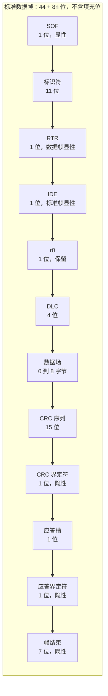
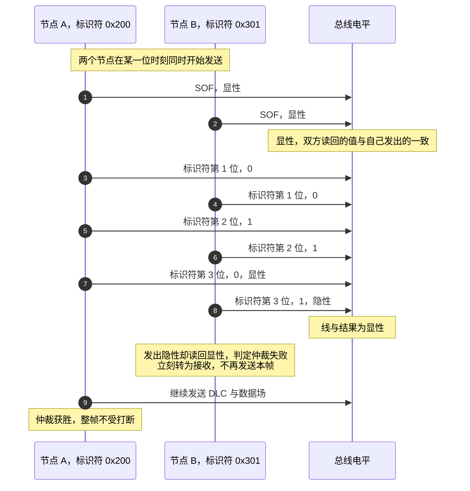
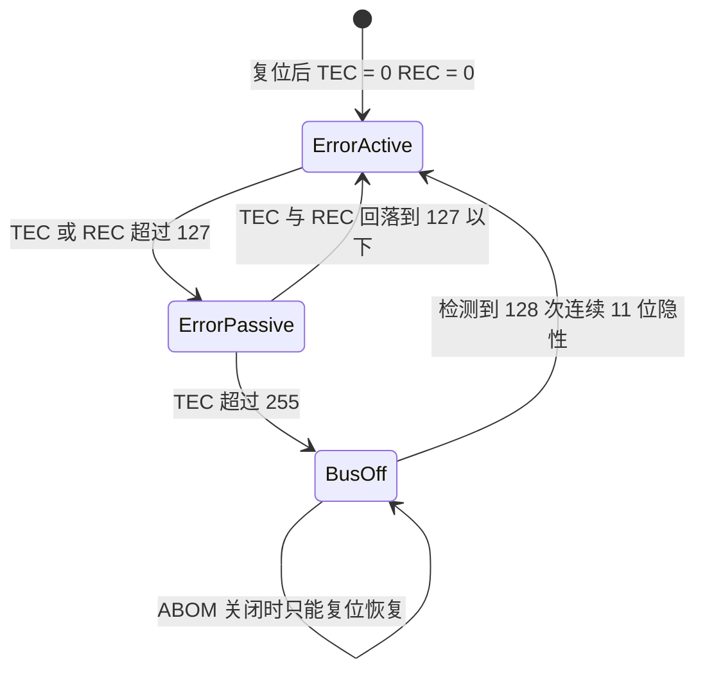

# CAN 协议与帧格式

两块板都用 STM32F407 的两个 bxCAN 控制器，初始化参数在 `Core/Src/can.c` 里逐字相同。协议层要覆盖的是帧类型、数据帧的逐位结构、仲裁与位填充、错误检测与总线状态；外设寄存器与过滤器放在 `02-STM32 的 CAN 外设与过滤器`，位定时放在 `04-波特率与采样点`。

读完后应当能回答三件事：本工程为什么用 CAN 接电机，标准帧的哪一位决定优先级，以及一帧最坏多少位、占多少总线时间。


## 1. CAN 连接电机的理由

云台板与底盘板之间的命令、电机反馈、裁判系统数据都走 CAN。与常用的串行总线对比：

| 总线 | 电气形式 | 拓扑 | 寻址方式 | 错误检测 | 多节点冲突 |
| --- | --- | --- | --- | --- | --- |
| UART | 单端，点对点 | 两设备 | 无，靠约定 | 奇偶校验（可选） | 不存在，接第三根线就冲 |
| SPI | 单端，片选 | 一主多从 | 片选线 | 无 | 不存在，从机不能主动发 |
| I2C | 单端，开漏 | 多主多从 | 7 / 10 位地址 | 应答位 | 仲裁，但速率低、抗干扰弱 |
| CAN | 差分，CAN_H / CAN_L | 多主多从 | 11 / 29 位标识符 | CRC 15 位 + 位监控 + 位填充 + 应答 | 逐位非破坏性仲裁 |

机器人上选 CAN 的三个直接原因：

1. 差分传输配合终端电阻，电机线束与电源线并行布线时抗共模干扰能力明显强于单端信号；
2. 一帧既承载数据也承载优先级。12 个电机共用一条总线，反馈帧与命令帧靠标识符区分，不需要额外的片选或地址协商；
3. 出错帧会被发送方自动重传，控制器同时维护发送错误计数与接收错误计数，总线健康度可以从寄存器读到。

代价也明确：单帧最多 8 字节有效载荷，总线速率与线长、节点数相关，本项目选 1 Mbps。

## 2. 帧类型

CAN 2.0B 定义了四种帧，加上帧间隔组成一次完整的总线活动：

| 帧类型 | 用途 | 本项目是否使用 |
| --- | --- | --- |
| 数据帧 Data Frame | 携带 0 到 8 字节数据 | 使用，全部发送函数都是数据帧 |
| 遥控帧 Remote Frame | 请求别节点发送指定标识符的数据帧 | 不使用 |
| 错误帧 Error Frame | 检测到错误时打断当前帧 | 由硬件自动发送，代码不可见 |
| 过载帧 Overload Frame | 接收方需要延迟下一帧 | 由硬件自动发送，代码不可见 |
| 帧间隔 Intermission | 帧与帧之间强制 3 位隐性 | 由硬件自动插入 |

本项目所有发送函数都把帧头写成同一组值，以云台板 `BSP/Src/bsp_can.cpp` 为例：

```c
TxHeader.StdId = 0x200; //标准标识符
TxHeader.IDE = CAN_ID_STD;
TxHeader.RTR = CAN_RTR_DATA;
TxHeader.DLC = 8;
```

四个字段里 `IDE` 决定标准帧还是扩展帧，`RTR` 决定数据帧还是遥控帧。全部 30 多个发送函数都取 `CAN_ID_STD` 与 `CAN_RTR_DATA`，所以本项目的总线上不存在扩展帧与遥控帧。

## 3. 数据帧的逐位结构

### 3.1 标准帧的字段

STM32F407 只支持经典 CAN 2.0B，不支持 CAN FD。标准数据帧的位序列如下：



这张表里的固定位宽决定了一帧在最好情况下占用多少位，后面的位填充规则会在这个基础上继续加位，所以最坏帧长从这里算起。字段顺序也有工程含义：越靠前的位越早参与仲裁，标识符排在数据场之前，就意味着先决定谁有权发送。

| 字段 | 位宽 | 作用 | 本项目的取值 |
| --- | --- | --- | --- |
| SOF | 1 | 帧起始，必须是显性位 | 硬件填 |
| 标识符 Identifier | 11 | 报文身份，同时决定仲裁优先级 | 0x141 到 0x501 |
| RTR | 1 | 0 表示数据帧，1 表示遥控帧 | 0 |
| IDE | 1 | 0 表示标准帧，1 表示扩展帧 | 0 |
| r0 | 1 | 保留位 | 0 |
| DLC | 4 | 数据长度，取值 0 到 8 | 8 |
| 数据场 | 0 到 64 | 有效载荷 | 8 字节 |
| CRC 序列 | 15 | 由 SOF 到数据场计算的校验 | 硬件填 |
| CRC 界定符 | 1 | 固定隐性 | 硬件填 |
| 应答槽 | 1 | 所有正确接收的节点拉显性 | 硬件填 |
| 应答界定符 | 1 | 固定隐性 | 硬件填 |
| 帧结束 | 7 | 固定隐性 | 硬件填 |

### 3.2 标准帧与扩展帧的差别

扩展帧把 11 位标识符换成 11 位基址、SRR 位、IDE 位与 18 位扩展标识符的组合，控制场多出 20 位：

$$L_{std} = 44 + 8n \qquad L_{ext} = 64 + 8n \quad \text{（不含填充位）}$$

| 差别 | 标准帧 | 扩展帧 |
| --- | --- | --- |
| 标识符位宽 | 11 | 29 |
| 帧开销 | 44 位 | 64 位 |
| 同 8 字节数据的总长 | 108 位 | 128 位 |
| DMA 或软件解析的字段 | `RxHeader.StdId` | `RxHeader.ExtId` |
| 本项目 | 全部使用 | 不使用 |

同样的数据量，扩展帧要多占 20 位总线时间。本项目标识符总数不到 20 个，11 位足够，选标准帧在总线时间上是划算的。

### 3.3 本项目的一帧实例

云台板向 `0x200` 发一帧 8 字节数据，四个电机电流按大端拼接（`BSP/Src/bsp_can.cpp`）：

```c
TxHeader.StdId = 0x200;
TxData[0] = (motor1 >> 8) & 0xFF;
TxData[1] = (motor1 & 0xFF);
// motor2 到 motor4 同样各占两个字节
```

总线上的位序列是 $44 + 64 = 108$ 位，加上位填充最多 24 位，最坏 132 位。在 1 Mbps 下，这一帧占用的总线时间是 $108\ \mu s$ 到 $132\ \mu s$。

## 4. 仲裁

### 4.1 显性位与隐性位

CAN 总线是线与逻辑：只要有一个节点输出显性，总线就是显性。

| 逻辑值 | 名称 | 总线电平 | 收发器表现 |
| --- | --- | --- | --- |
| 0 | 显性 Dominant | CAN_H 高于 CAN_L | 任一节点拉显性即胜出 |
| 1 | 隐性 Recessive | CAN_H 与 CAN_L 电位接近 | 所有节点都发隐性才成立 |

仲裁利用这两条规则：节点在发送标识符的同时读回总线电平，若自己发隐性而读到显性，说明有更高优先级的节点在同时发送，本节点立即退出发送、转为接收，且不需要重发。

### 4.2 逐位仲裁过程

标识符数值越小，二进制中靠前的显性位越多，优先级越高。



仲裁只发生在标识符与 RTR 位期间，数据场不参与。这一点决定了一个工程事实：同一总线上两帧标识符相同时，数据场冲突不会被仲裁解决。

### 4.3 本项目的标识符分布

标识符数值同时决定仲裁优先级，分配原则因此是：延迟敏感的功能拿小数值，状态类数据拿大数值。下面按功能分三组，表只作为出处的附证。

第一组是电机命令与反馈。执行器的延迟直接进入控制品质，命令帧要在总线拥塞时优先发出去，反馈帧紧随其后才能形成闭环，所以这一组占数值最小、优先级最高的一段。

| 标识符 | 方向 | 内容 | 出处 |
| --- | --- | --- | --- |
| 0x141 | 云台板发出 | 瓴控 LK 电机的使能、转矩、速度、位置命令 | `bsp_can.cpp` 起 |
| 0x1FF | 云台板发出 | 大疆 5 到 8 号电机电流 | `bsp_can.cpp` |
| 0x200 | 两板发出 | 大疆 1 到 4 号电机电流 | `bsp_can.cpp`、`148` |
| 0x201 到 0x20x | 电机反馈 | 大疆电机状态 | `bsp_can.cpp` 起 |
| 0x2FF | 云台板发出 | 大疆 9 到 11 号电机电流 | `bsp_can.cpp` |

第二组是操作输入与板间状态。遥控器通道决定操作意图，云台 yaw 角与弹量供另一块板做状态估计，它们的更新率比电机环低一档，晚一点到达不影响稳定，因此排在中段。

| 标识符 | 方向 | 内容 | 出处 |
| --- | --- | --- | --- |
| 0x301 | 两板互发 | 遥控器通道与开关 | `bsp_can.cpp` |
| 0x302 | 云台板发出 | 云台 yaw 角 | `bsp_can.cpp` |
| 0x303 | 底盘板发出 | 累计弹量与弹速 | 底盘 `bsp_can.cpp` |

第三组是底盘传感器数据。底盘 IMU 姿态与旋转速度用于上层决策，变化尺度比控制环慢，允许被其他帧抢先，于是取数值最大、仲裁优先级最低的一档。

| 标识符 | 方向 | 内容 | 出处 |
| --- | --- | --- | --- |
| 0x401 | 底盘板发出 | 底盘 IMU 姿态 | `bsp_can.cpp` |
| 0x501 | 底盘板发出 | 底盘旋转速度 | `bsp_can.cpp` |

按数值排序就是优先级排序。电机反馈的 0x201 到 0x20x 排在命令帧 0x1FF 与 0x200 之后，0x301 的板间遥控帧排在最后。这个次序决定了总线拥塞时，命令帧先于板间状态帧获得发送机会。

## 5. 位填充

### 5.1 规则与范围

发送方在 SOF 到 CRC 序列（含）之间，每检测到 5 个连续同值位就插入 1 个相反位。接收方在同样范围内自动剔除填充位。填充位不参与 CRC 计算。

| 项目 | 内容 |
| --- | --- |
| 填充范围 | SOF 到 CRC 序列，共 $34 + 8n$ 位 |
| 填充规则 | 连续 5 个同值位后插入 1 个反值位 |
| 接收方检查 | 连续 6 个同值位即判位填充错误，发错误帧 |
| 不填充的字段 | CRC 界定符、应答场、帧结束、帧间隔 |

位填充的作用是让总线在长时间无跳变时仍有边沿可供接收方做重同步。代价是帧长不固定，接收方无法用固定长度判断帧结束，只能靠帧结束的 7 位隐性序列。

### 5.2 最坏帧长

一帧的位数是确定的上下界。设数据字节数为 $n$，填充位最多为

$$S_{max} = \left\lfloor \frac{34 + 8n - 1}{4} \right\rfloor$$

代入 $n = 8$：

$$S_{max} = \left\lfloor \frac{97}{4} \right\rfloor = 24 \ \text{位}$$

于是长度 8 的标准数据帧在 1 Mbps 下的占用时间落在 108 微秒到 132 微秒之间。总线负载估算必须用 132 微秒这个上界，用 108 微秒会低估约 18%。

### 5.3 从帧长看总线余量

以云台板 CAN1 为例，控制中心任务每 1 ms 发 4 帧（`Task/Src/ControlCenterTask.cpp`），再计入 yaw 电机 1 kHz 的反馈帧，负载是：

$U_{CAN1} \approx (4000 + 1000) \times 132\ \mu s \approx 66.0\%$

这个数字的量级说明两点：1 Mbps 在当前轮询频率下上界占用已经到三分之二，余量主要留给突发与重传；若把控制周期再压到 0.5 ms，命令帧部分翻倍，负载升到约 92%，实际可用性取决于总线上的错误率。

> 电机反馈的确切周期取自大疆电机的用户手册，固件里读不到发送侧的分频设置，此处按 1 kHz 计。若实际为 500 Hz，上面的比例按比例减半。

## 6. 错误检测与总线状态

### 6.1 五类错误

| 错误类型 | 检测方 | 触发条件 |
| --- | --- | --- |
| 位错误 Bit Error | 发送方 | 回读电平与自己发出的不同 |
| 填充错误 Stuff Error | 收发双方 | 填充范围内出现 6 个连续同值位 |
| CRC 错误 CRC Error | 接收方 | 计算值与 CRC 序列不符 |
| 格式错误 Form Error | 接收方 | 固定电平字段出现非法值 |
| 应答错误 Acknowledgment Error | 发送方 | 应答槽没有收到显性 |

### 6.2 错误计数与三种状态

每个 CAN 控制器维护两个计数器：发送错误计数 TEC 与接收错误计数 REC。发送出错加 8，接收出错加 1，成功收发减 1（或减 8，取决于具体条件）。状态由这两个数决定：



三态的行为差别：

| 状态 | 发送错误帧的形式 | 能否继续通信 |
| --- | --- | --- |
| 错误主动 Error Active | 主动错误标志，6 个显性位 | 能 |
| 错误被动 Error Passive | 被动错误标志，6 个隐性位 | 能，但出错后要等额外 8 位才发下一帧 |
| 总线关闭 Bus Off | 不发送，脱离总线 | 不能，直到恢复 |

本项目两块板都配了 `AutoBusOff = ENABLE`（`Core/Src/can.c`、`can.c`），HAL 把它转成 `CAN_MCR_ABOM` 置位（`Drivers/STM32F4xx_HAL_Driver/Src/stm32f4xx_hal_can.c`）。于是进入 Bus Off 后，硬件在监测到 128 次连续 11 位隐性后自动回到错误主动状态，不需要软件介入。这条配置掩盖了一类问题：总线故障恢复后代码看不到任何痕迹，只能靠 `hcan->ErrorCode` 与 ESR 寄存器事后判断。

## 7. 帧头字段与协议字段的对应

HAL 的 `CAN_TxHeaderTypeDef` 与协议字段一一对应，没有额外抽象：

| HAL 字段 | 协议字段 | 本项目取值 |
| --- | --- | --- |
| `StdId` | 标准标识符 | 见第 4.3 节 |
| `ExtId` | 扩展标识符 | 未使用 |
| `IDE` | IDE 位 | `CAN_ID_STD` |
| `RTR` | RTR 位 | `CAN_RTR_DATA` |
| `DLC` | DLC 字段 | 8 |
| `TransmitGlobalTime` | 时间触发模式下的时间戳 | 未使用 |

接收侧同样是直接映射，`RxHeader.StdId` 就是仲裁场里的 11 位标识符（`stm32f4xx_hal_can.c`）。回调里用 `switch(RxHeader.StdId)` 分派，等价于按标识符做一次精确匹配（`BSP/Src/bsp_can.cpp`）。

字节序在项目里不统一，两块板各自成对，需要按帧查表：

| 帧 | 字段 | 拼接方式 | 出处 |
| --- | --- | --- | --- |
| 0x200 / 0x1FF / 0x2FF | 电机电流，`int16_t` | 大端，先高字节 | `bsp_can.cpp` |
| 0x141 | 命令字在字节 0，电流在字节 4 到 5 | 小端 | `bsp_can.cpp` |
| 0x301 | 三个通道各占两字节 | 大端 | `bsp_can.cpp` |
| 0x302 | `float` 拆四字节 | 大端，先高字节 | `bsp_can.cpp` |
| 0x303 | 前两字节 `int16_t`，字节 2 到 5 为 `float` | 前者大端，后者按本机小端顺序 | 底盘 `bsp_can.cpp` |
| 0x303 接收 | 同上 | `(RxData[5]<<24)|(RxData[4]<<16)|(RxData[3]<<8)|RxData[2]` 还原 `float` | `bsp_can.cpp` |

0x303 在同一帧里混用了两种字节序。发送端用位移取高字节写 `int16_t`，用指针取 `float` 的原始字节写后续四字节；接收端相应地用位移读 `int16_t`，用反向拼装还原 `float`。两侧写对时结果正确，但这一帧的格式无法从字段本身看出，改动任何一侧都要同步改另一侧。

## 8. 易错点

| 易错点 | 现象 | 本项目的对应位置 |
| --- | --- | --- |
| 把标识符当设备地址 | 认为 `0x200` 是"1 号电机" | `0x200` 是四个电机共享的一条广播帧，ID 在数据场的字节位置上 |
| 忘记标识符决定优先级 | 高优先级传感器帧被命令帧挤占 | 0x1FF 与 0x200 小于所有反馈标识符 |
| 用扩展帧承载 8 字节数据 | 总线时间多 20 位 | 全部函数都用 `CAN_ID_STD` |
| 认为一帧长度固定 | 负载估算用 108 微秒 | 最坏 132 微秒，差 22% |
| 认为 CAN FD 可用 | 配了更高的数据段速率 | F407 的 bxCAN 只支持经典帧，没有 BRS 与数据段速率 |
| 混用字节序且不写注释 | 0x303 的 `float` 与 `int16_t` 拼接方向不同 | 见第 7 节表格 |
| 用整型保存百分之一单位的角度 | 小数被截断 | `BSP/Src/bsp_can.cpp` 把除以 100 的结果写进 `int16_t` 字段 |
| 依赖 Bus Off 自动恢复的静默性 | 故障现场没有记录 | `ABOM` 置位后恢复过程不被记录，需软件读 ESR |

## 9. 小结

### 核心概念

- CAN 是差分、多主、广播总线，一帧同时表达数据与优先级。
- 显性位（0）在线上获胜，逐位仲裁让数值小的标识符优先，仲裁失败方不重发、不丢帧。
- 标准数据帧长 $44 + 8n$ 位，位填充最多再加 $\lfloor (34 + 8n - 1)/4 \rfloor$ 位，8 字节帧最长为 132 位。
- 位填充覆盖 SOF 到 CRC 序列，作用是保证接收方有足够的跳变做重同步。
- 错误靠位监控、位填充、CRC、格式、应答五类机制检测，TEC 与 REC 决定错误主动、错误被动、总线关闭三种状态。
- 本项目全部使用标准数据帧，标识符集中在 0x141 到 0x501，帧头字段由硬件填充，代码只写 `StdId`、`IDE`、`RTR`、`DLC`。

### 设计权衡

| 决策 | 选择 | 收益 | 代价 |
| --- | --- | --- | --- |
| 帧格式 | 标准帧 11 位标识符 | 每帧省 20 位总线时间 | 标识符空间只有 2048 个，跨车复用时要重新分配 |
| 载荷 | 固定 8 字节 | 电机电流一帧装四个 | 小数据帧也占满 108 位 |
| 字节序 | 电机数据大端，命令字小端 | 与电机的公开协议一致 | 同一工程两套约定，改动需两侧同步 |
| 帧率 | 命令帧与反馈帧都在 1 kHz 量级 | CAN1 上界负载约 66% | 命令帧与反馈帧合计占用大部分总线时间 |
| Bus Off 恢复 | `AutoBusOff` 置位 | 总线故障后可自愈 | 恢复过程不留痕迹 |
| 错误帧统计 | 未采集 | 无需额外代码 | 无法从应用层看到 TEC 与 REC 的变化 |

## 10. 练习

### 基础题

1. 计算一个数据长度为 3 的标准数据帧在不含填充位时的位数，并写出最坏填充位数与最长位数。
2. 标识符 0x1FF 与 0x200 同时开始发送，写出在第几个标识符位上分出胜负，以及 0x1FF 的二进制形式。
3. 云台板 CAN1 每 1 ms 发 4 帧、每 1 ms 收到一帧 yaw 电机反馈，按 132 微秒的上界计算总线占用率。
4. 一个 8 字节数据帧的 CRC 计算范围覆盖哪些字段？位填充是否参与 CRC？

### 挑战题

5. 若把云台板的控制周期再压到 0.5 ms，按 132 微秒上界重新计算 CAN1 的占用率，并判断是否还能容纳第二块板新增的 1 kHz 反馈帧。
6. 错误被动状态的节点在准备发送时，必须在帧间隔之后额外等待 8 位时间。推导这一规定对总线利用率的影响，并说明错误被动状态对总线的干扰比错误主动状态更小的原因。
7. 0x303 帧的 `float` 字段在发送侧按本机小端字节序写出。若未来把该帧移植到一台大端处理器上，接收侧需要改哪一行？给出修改后的表达式。

---

### 附：本页引用的固件路径

| 路径 | 用途 |
| --- | --- |
| `2026OmniSentryGimbal/Core/Src/can.c` | CAN1 与 CAN2 初始化参数、`AutoBusOff` |
| `2026OmniSentryGimbal/BSP/Src/bsp_can.cpp` | 发送帧头、反馈解析 |
| `2026OmniSentryChassis/2026OmniSentryChassis/BSP/Src/bsp_can.cpp` | 0x303 与 0x309 发送 |
| `2026OmniSentryGimbal/Drivers/STM32F4xx_HAL_Driver/Src/stm32f4xx_hal_can.c` | `ABOM` 写入、`StdId` 读取 |
| `2026OmniSentryGimbal/Task/Src/ControlCenterTask.cpp` | 命令帧发送节奏 |
| `can通信波特率问题.md` | 波特率与时钟树的排障记录 |
