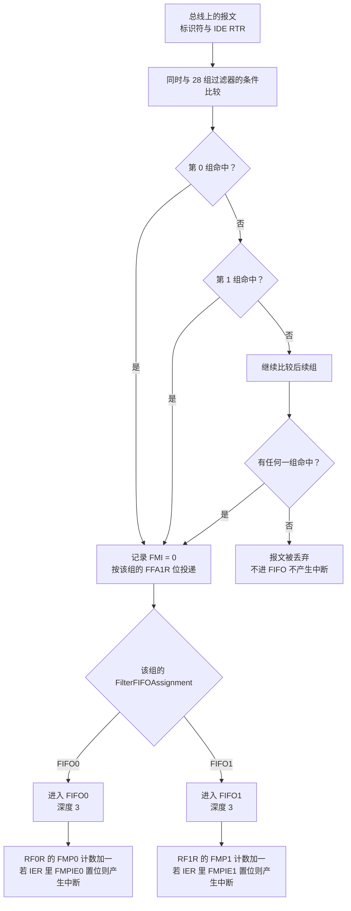
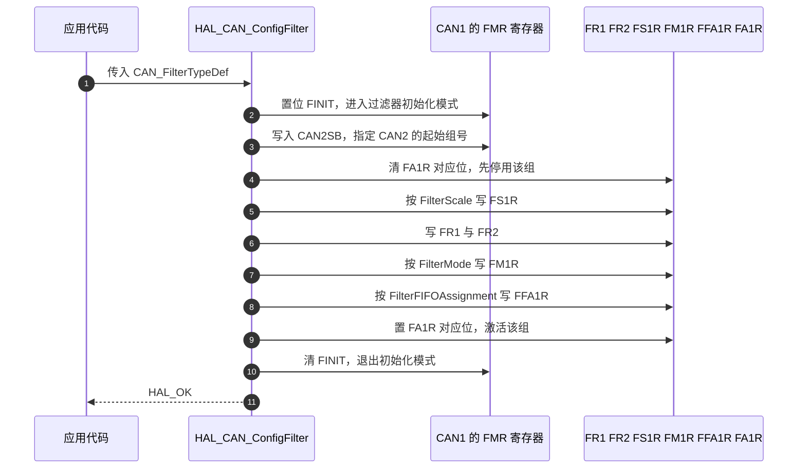
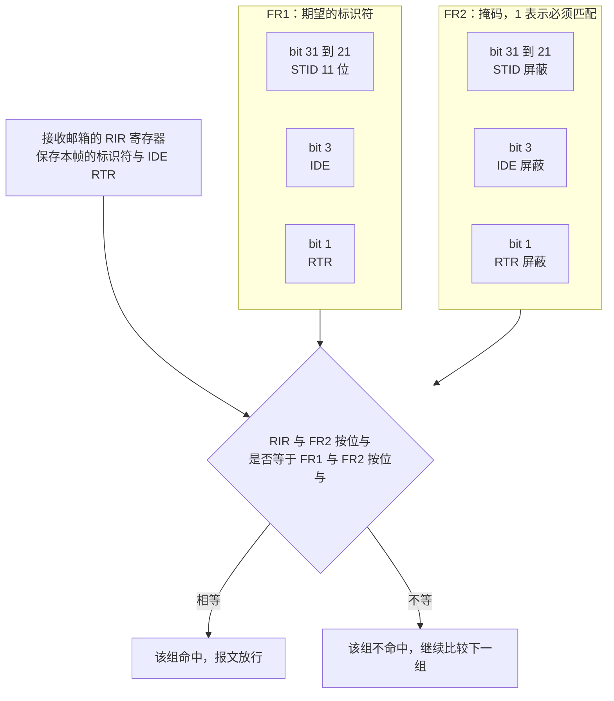

# STM32 的 CAN 外设与过滤器

> 对象是云台板固件 `2026OmniSentryGimbal` 与底盘板固件 `2026OmniSentryChassis`。两块板的过滤器代码逐字相同。
>
> 前一篇讲协议里的标识符与仲裁，这一篇讲标识符进入外设之后经过什么筛选。位定时参数放在 `04-波特率与采样点`。

## 1. 概念：bxCAN 的硬件资源清单

STM32F407 上的 CAN 由名为 bxCAN 的控制器实现，它比通用串行口多出一层标识符筛选。它的资源在 `stm32f407xx.h` 的 `CAN_TypeDef` 里可以看到（`Drivers/CMSIS/Device/ST/STM32F4xx/Include/stm32f407xx.h:249-273`）：

| 资源 | 数量 | 说明 | 出处 |
| --- | --- | --- | --- |
| CAN 控制器 | 2 | CAN1 与 CAN2，CAN1 是主，CAN2 是从 | `can.c:27-28` |
| 过滤器组 Filter Bank | 28 | 两个控制器共享，编号 0 到 27 | `stm32f407xx.h:272` |
| 每个过滤器组的寄存器 | FR1 / FR2 | 两个 32 位寄存器 | `stm32f407xx.h:240-243` |
| 发送邮箱 Tx Mailbox | 每控制器 3 个 | 可排队 3 帧 | `stm32f407xx.h:260` |
| 接收 FIFO | 每控制器 2 个 | FIFO0 与 FIFO1 | `stm32f407xx.h:261` |
| 每个 FIFO 的深度 | 3 | 满 3 帧后按 RFLM 决定覆盖还是丢弃 | 参考手册 bxCAN 章节 |
| 过滤器匹配号 FMI | 每帧 8 位 | 记录是哪一组过滤器放行的 | 接收邮箱的 RDTR 寄存器 |

28 个过滤器组是两块板的公共资源。这个数字决定了过滤粒度：需要精确放行的标识符越多，能编出的过滤规则就越少。

## 2. 机制与原理

### 2.1 报文从总线到 FIFO 的通路

过滤器不筛选数据，只筛选标识符以及 IDE 与 RTR 位。一帧报文进入控制器后先经过全部已激活的过滤器组，命中哪一组由硬件决定，命中的组决定这帧进 FIFO0 还是 FIFO1：



两个结论：

1. 过滤器组可以同时激活多组，硬件把它们当成或的关系，任一命中即放行。
2. 一帧最多命中一组。编号小的不会自动优先，FMI 记录的是实际命中的那一组。

### 2.2 过滤器组的寄存器

| 寄存器 | 位宽 | 作用 |
| --- | --- | --- |
| FR1 | 32 | 标识符或第一个列表项 |
| FR2 | 32 | 掩码或第二个列表项 |
| FS1R | 每组建 1 位 | 0 表示 16 位尺度，1 表示 32 位尺度 |
| FM1R | 每组建 1 位 | 0 表示掩码模式，1 表示列表模式 |
| FFA1R | 每组建 1 位 | 0 表示投递到 FIFO0，1 表示投递到 FIFO1 |
| FA1R | 每组建 1 位 | 过滤器激活位 |
| FMR | 全局 | FINIT 过滤器初始化模式位，CAN2SB 从机起始组号 |

HAL 的 `HAL_CAN_ConfigFilter()` 把这几个寄存器写一遍，顺序是固定的（`Drivers/STM32F4xx_HAL_Driver/Src/stm32f4xx_hal_can.c:840-963`）：



FINIT 必须在写过滤器寄存器前后成对操作。FINIT 置位期间过滤器不参与筛选，退出后新配置立即生效。

### 2.3 32 位掩码模式

32 位掩码模式下，一组过滤器只放行一个条件：报文标识符按掩码位比较，掩码为 1 的位必须与 FR1 相同，掩码为 0 的位不关心。



判定式是：

$$(RIR \ \&\ FR2) = (FR1 \ \&\ FR2) \Rightarrow \text{命中}$$

三种典型取值：

| FR1 标识符 | FR2 掩码 | 放行的报文 |
| --- | --- | --- |
| 0x00000000 | 0x00000000 | 全部，任何标识符都满足 $0 = 0$ |
| 0x200 << 21 | 0x7FF << 21 | 只放行标准标识符 0x200 |
| 0x200 << 21 | 0x7F0 << 21 | 放行 0x200 到 0x20F |

第二行与第三行的差别只在掩码的低 4 位。把低 4 位置 0，等于把 16 个连续标识符合并成一条规则。本项目电机反馈占用 0x201 到 0x208，用第三条规则一条就能覆盖。

### 2.4 四种尺度与模式的组合

| FilterScale | FilterMode | 每组容量 | 存储方式 |
| --- | --- | --- | --- |
| 32 位 | 掩码 | 1 条规则 | FR1 标识符，FR2 掩码 |
| 32 位 | 列表 | 2 个标识符 | FR1 与 FR2 各放一个 32 位标识符，都是精确匹配 |
| 16 位 | 掩码 | 2 条规则 | FR1 的高低半字各一组，FR2 对应掩码 |
| 16 位 | 列表 | 4 个标识符 | FR1 与 FR2 各两个半字，都是精确匹配 |

28 组的最大过滤能力是 $28 \times 4 = 112$ 个 16 位列表项。16 位尺度只能表达标准标识符与 IDE、RTR，不能表达扩展标识符。

16 位模式下 HAL 原样写入半字，不做位移（`stm32f4xx_hal_can.c:927-935`）：

```c
can_ip->sFilterRegister[sFilterConfig->FilterBank].FR1 =
  ((0x0000FFFFU & (uint32_t)sFilterConfig->FilterMaskIdLow) << 16U) |
  (0x0000FFFFU & (uint32_t)sFilterConfig->FilterIdLow);
```

所以 16 位模式下传入的标识符必须自己左移 5 位。这是 HAL 层面容易写错的一处：32 位模式自动对齐，16 位模式手动对齐。

### 2.5 CAN2 的过滤器归属

28 个过滤器组的物理寄存器只在 CAN1 的地址空间里。CAN2 使用哪些组由 FMR 的 CAN2SB 字段决定：编号小于 CAN2SB 的组归 CAN1，大于等于的归 CAN2。

HAL 的处理方式是无论传入哪个句柄，一律写 CAN1（`stm32f4xx_hal_can.c:879-882`）：

```c
#elif defined(CAN2)
    /* CAN1 and CAN2 are dual instances with 28 common filters banks */
    /* Select master instance to access the filter banks */
    can_ip = CAN1;
```

这一段里 hcan 只参与状态检查与错误码记录，不参与寄存器寻址。于是两个后果：

1. 配置 CAN2 的过滤器时传 `&hcan1` 或 `&hcan2` 效果相同，代码里那句"必须用 hcan1 配置 CAN2 过滤器"描述的是习惯而非硬件限制；
2. CAN2 的过滤器寄存器挂在 CAN1 上，所以必须使能 CAN1 的外设时钟。本工程的 `HAL_CAN_MspInit` 用一个引用计数保证这一点（`Core/Src/can.c:95-110`、`can.c:139-143`）：

```c
static uint32_t HAL_RCC_CAN1_CLK_ENABLED=0;
...
HAL_RCC_CAN1_CLK_ENABLED++;
if(HAL_RCC_CAN1_CLK_ENABLED==1){
  __HAL_RCC_CAN1_CLK_ENABLE();
}
```

计数器的作用是：CAN1 与 CAN2 的 MspInit 都会请求 CAN1 时钟，只有第一次置位；对应的 MspDeInit 里减到 0 时才关闭（`can.c:177-180`、`can.c:202-205`）。

### 2.6 过滤器编组方案

28 组怎么分配没有标准答案，取决于需要精确放行的标识符集合。

| 方案 | 组数占用 | 能力 | 适用 |
| --- | --- | --- | --- |
| 全接收 | 2 组 | CAN1 与 CAN2 各一条规则放行全部 | 总线上的设备都在自己控制范围内，需要抓原始报文 |
| 按标识符精确放行 | 每条 32 位掩码规则 1 组 | 只放行已定义的标识符 | 总线上有第三方设备，或需要按 ID 分流到两个 FIFO |
| 按区间合并 | 每条规则覆盖 16 个连续标识符 | 同一类电机的反馈共一条规则 | 电机编号连续，如 0x201 到 0x208 |
| 双 FIFO 分流 | 按 FFA1R 拆成两组规则 | 高优先级帧进 FIFO0，低优先级帧进 FIFO1 | 需要不同的中断响应时间 |
| 列表模式精确匹配 | 32 位列表每组 2 个标识符 | 标识符稀疏且无规律 | 标识符分散，掩码合并会误放行 |

本工程用的是第一种，收益与代价在第 3 节展开。

## 3. 落到本项目

### 3.1 引脚与时钟

| 控制器 | 引脚 | 复用 | 出处 |
| --- | --- | --- | --- |
| CAN1 | PD0 接收，PD1 发送 | `GPIO_AF9_CAN1` | `Core/Src/can.c:112-122` |
| CAN2 | PB5 接收，PB6 发送 | `GPIO_AF9_CAN2` | `Core/Src/can.c:145-155` |

两个引脚都配成 `GPIO_MODE_AF_PP` 与 `GPIO_SPEED_FREQ_VERY_HIGH`。CAN 收发器外置，MCU 侧看到的是普通推挽输出。

中断方面，四个接收中断全部使能，优先级都是 5（`can.c:125-128`、`can.c:158-161`）：

| 中断向量 | 优先级 | 说明 |
| --- | --- | --- |
| `CAN1_RX0_IRQn` | 5 | CAN1 的 FIFO0 非空 |
| `CAN1_RX1_IRQn` | 5 | CAN1 的 FIFO1 非空 |
| `CAN2_RX0_IRQn` | 5 | CAN2 的 FIFO0 非空 |
| `CAN2_RX1_IRQn` | 5 | CAN2 的 FIFO1 非空 |

RX1 的向量被使能了但不会触发，因为过滤器只把报文投递到 FIFO0，且 `CAN_IT_RX_FIFO1_MSG_PENDING` 没有被激活。这是 CubeMX 勾选 CAN 后默认生成的两条中断，删掉不影响功能。

### 3.2 过滤器配置逐行

云台板 `BSP/Src/bsp_can.cpp:62-86`，底盘板 `BSP/Src/bsp_can.cpp:56-79`，内容一致：

```c
void bsp_can::BSP_CAN_FilterConfig()
{
    CAN_FilterTypeDef filter;

    /** ------------ CAN1：过滤器 0-13 全部接收 ------------ */
    filter.FilterActivation       = ENABLE;
    filter.FilterMode             = CAN_FILTERMODE_IDMASK;
    filter.FilterScale            = CAN_FILTERSCALE_32BIT;
    filter.FilterFIFOAssignment   = CAN_FILTER_FIFO0;

    filter.FilterIdHigh           = 0x0000;
    filter.FilterIdLow            = 0x0000;
    filter.FilterMaskIdHigh       = 0x0000;
    filter.FilterMaskIdLow        = 0x0000;

    filter.FilterBank             = 0;       // CAN1 的第一个过滤器组
    filter.SlaveStartFilterBank   = 14;      // 14 之后给 CAN2 用

    HAL_CAN_ConfigFilter(&hcan1, &filter);

    /** ------------ CAN2：过滤器 14-27 全部接收 ------------ */
    filter.FilterBank = 14;                 // CAN2 的第一个过滤器组
    HAL_CAN_ConfigFilter(&hcan1, &filter);  // 注意：必须用 hcan1 配置 CAN2 过滤器
}
```

逐项推导：

| 字段 | 取值 | 推导 |
| --- | --- | --- |
| FilterScale | 32 位 | 32 位掩码模式一组一条规则，够用 |
| FilterMode | 掩码 | 掩码全 0 时掩码模式退化成全接收，不需要列表模式 |
| FilterIdHigh 与 FilterIdLow | 0x0000 | 期望标识符为 0 |
| FilterMaskIdHigh 与 FilterMaskIdLow | 0x0000 | 掩码全 0，判定式退化为 $0 = 0$，恒成立 |
| FilterFIFOAssignment | FIFO0 | 与 `CAN_IT_RX_FIFO0_MSG_PENDING` 对应 |
| FilterBank | 0 与 14 | 0 属于 CAN1，14 是 CAN2SB 的默认值，属于 CAN2 |
| SlaveStartFilterBank | 14 | 每次调用都会写进 FMR 的 CAN2SB 字段 |
| FilterActivation | ENABLE | 置位 FA1R 的对应位 |
| 句柄 | 两次都是 `&hcan1` | 寄存器只挂在 CAN1 上，第 2.5 节已说明 |

代码注释写着过滤器 0 到 13 全部接收，与行为一致：只配了第 0 组，其余 13 组保持复位后的未激活状态。14 到 27 同理，只配了第 14 组。

### 3.3 全接收的实际效果

只有两组装了规则，却覆盖了两个控制器的全部入站报文：

| 现象 | 结果 |
| --- | --- |
| 收到未定义的标识符 | 不丢弃，仍然进 FIFO0 并触发中断，回调的 switch 落到 `default` 分支 |
| 收到扩展帧 | 同样放行，因为掩码里 IDE 位也是 0 |
| 收到遥控帧 | 同样放行，回调读出的 `RxHeader.RTR` 为 `CAN_RTR_REMOTE`，代码并不检查 |
| 总线报错帧 | 不经过过滤器，由硬件处理 |

代价是三条：非法报文会消耗 FIFO 的 3 个位置与中断时间；回调里必须靠 `default` 分支兜住；总线上一旦出现第三方设备，它也会被当成有效反馈进入解析逻辑。

### 3.4 过滤器容量占用

| 控制器 | 已用组 | 剩余组 | 当前规则数 |
| --- | --- | --- | --- |
| CAN1 | 第 0 组 | 1 到 13，共 13 组 | 1 条，全接收 |
| CAN2 | 第 14 组 | 15 到 27，共 13 组 | 1 条，全接收 |

按每 32 位掩码组 1 条规则算，还有 26 条规则可用。若改用 32 位列表模式，每组 2 个精确标识符，容量翻倍到 52 个；改用 16 位列表模式，每组 4 个，容量是 104 个。当前的精确规则需求是 0 条，所以容量不是限制。

## 4. 易错点

| 易错点 | 原因 | 本项目的位置 |
| --- | --- | --- |
| 在 CAN 未初始化时配过滤器 | HAL 要求状态为 READY 或 LISTENING | `bsp_can.cpp:40` 先配过滤器，`bsp_can.cpp:43` 再 Start，顺序正确 |
| 认为 CAN2 的过滤器要用 `&hcan2` 配置 | HAL 内部一律写 CAN1 | `bsp_can.cpp:85` 用的是 `&hcan1` |
| 只开 CAN2 时钟不开 CAN1 | 过滤器寄存器在 CAN1 地址空间 | `can.c` 的引用计数覆盖了这种顺序 |
| 16 位模式忘记左移 5 位 | HAL 原样写半字 | 本工程用 32 位模式，避开这一处 |
| 把掩码当成标识符 | 掩码为 1 的位是必须匹配，不是必须不同 | 全接收配置里两者都是 0，容易忽略差别 |
| 只配 CAN1 的过滤器就以为 CAN2 也能收 | FilterBank 必须落在 14 到 27 | 第 2.5 节的 CAN2SB 规则 |
| 认为命中的过滤器组由编号决定优先级 | 硬件按或处理，FMI 只记录实际命中组 | 全接收时 FMI 恒为 0 或 14 |
| 开了 RX1 中断却没配 FIFO1 的过滤器 | 中断使能了但永远不会 pending | `can.c:127`、`can.c:160` |

## 5. 小结

### 核心概念

- bxCAN 有 28 个过滤器组，两个控制器共享，硬件用或的方式并行比较，任一命中即放行。
- 一组过滤器的行为由 FS1R（16 或 32 位）、FM1R（掩码或列表）、FFA1R（投递到哪个 FIFO）、FA1R（是否激活）四个位决定。
- 32 位掩码模式的判定式是 $(RIR \ \&\ FR2) = (FR1 \ \&\ FR2)$。标识符与掩码全 0 时恒成立，等价于全接收。
- 16 位尺度下 HAL 原样写入半字，标识符需要调用方自行移位；32 位尺度不需要。
- CAN2 的过滤器寄存器物理上属于 CAN1，由 FMR 的 CAN2SB 字段划分归属。使能 CAN2 之前必须先有 CAN1 的时钟。
- 本工程只用了第 0 组与第 14 组做全接收，26 组闲置，过滤器容量不是当前的设计约束。

### 设计权衡

| 决策 | 选择 | 收益 | 代价 |
| --- | --- | --- | --- |
| 过滤粒度 | 全接收，掩码全 0 | 新增标识符不需要改代码，调试期能看到全部报文 | 非法报文进入回调与 FIFO，占用中断时间 |
| 尺度 | 32 位掩码 | 不需要手动移位，可直接写 32 位组合 | 每组只放行 1 条规则 |
| FIFO 分配 | 全部投递 FIFO0 | 只需维护一个回调 | 高优先级与低优先级帧共用队列，无法分流 |
| 组号划分 | CAN1 用 0，CAN2 用 14 | 与 CAN2SB 的默认值一致 | 编号 1 到 13 与 15 到 27 长期闲置 |
| CAN2 句柄 | 两次都传 `&hcan1` | 与硬件归属一致，读代码时不会误判 | 注释需要解释，否则像是笔误 |
| CAN1 时钟管理 | 引用计数 | 两个控制器独立初始化的顺序不受限 | 多一个静态变量，DeInit 路径也要同步减一 |

## 6. 练习

### 基础题

1. 写出只放行标准标识符 0x301 的 32 位掩码过滤器四个字段的取值，并解释掩码为什么要把 IDE 与 RTR 位也置 1。
2. 若把 SlaveStartFilterBank 从 14 改成 20，CAN1 分到哪些组，CAN2 分到哪些组？
3. 本工程用 32 位掩码模式。若改成 32 位列表模式且保持全接收语义，需要几个组、每组放什么值？全接收语义能否用列表模式表达？
4. 说明 `HAL_CAN_MspInit` 需要 `HAL_RCC_CAN1_CLK_ENABLED` 这个静态计数器的原因，去掉它会有什么现象。

### 挑战题

5. 设计一套过滤器方案，要求：0x141 与 0x1FF 进 FIFO0，0x301 与 0x302 进 FIFO1，电机反馈 0x201 到 0x208 进 FIFO0，其余标识符全部丢弃。给出组号分配表、每组四个字段的取值与位掩码，并说明用了几组。
6. 把第 5 题的方案改成尽可能少的组数，写出合并思路与由此引入的误放行标识符集合。
7. 若总线上新增一台第三方设备以 500 Hz 发送标识符 0x700 的扩展帧，当前的过滤配置会把它放进 FIFO0。写出两种修改方式：一种保留全接收但排除扩展帧，一种改成只放行已定义标识符，并比较两者对现有代码的影响面。

---

### 附：本页引用的固件路径

| 路径 | 用途 |
| --- | --- |
| `2026OmniSentryGimbal/Core/Src/can.c` | GPIO 复用（:112-155）、CAN1 时钟引用计数（:95-110）、中断优先级（:125-128、:158-161） |
| `2026OmniSentryGimbal/Core/Inc/can.h` | hcan1 与 hcan2 的声明（:35-37） |
| `2026OmniSentryGimbal/BSP/Src/bsp_can.cpp` | 过滤器配置（:62-86） |
| `2026OmniSentryChassis/2026OmniSentryChassis/BSP/Src/bsp_can.cpp` | 过滤器配置（:56-79） |
| `2026OmniSentryGimbal/Drivers/STM32F4xx_HAL_Driver/Src/stm32f4xx_hal_can.c` | HAL_CAN_ConfigFilter 全文（:840-963）、16 位写入（:927-935）、主从主体选择（:879-882） |
| `2026OmniSentryGimbal/Drivers/STM32F4xx_HAL_Driver/Inc/stm32f4xx_hal_can.h` | CAN_FilterTypeDef 字段说明（:101-150） |
| `2026OmniSentryGimbal/Drivers/CMSIS/Device/ST/STM32F4xx/Include/stm32f407xx.h` | CAN_TypeDef（:249-273）、CAN_FMR 位定义（:2313-2318） |
