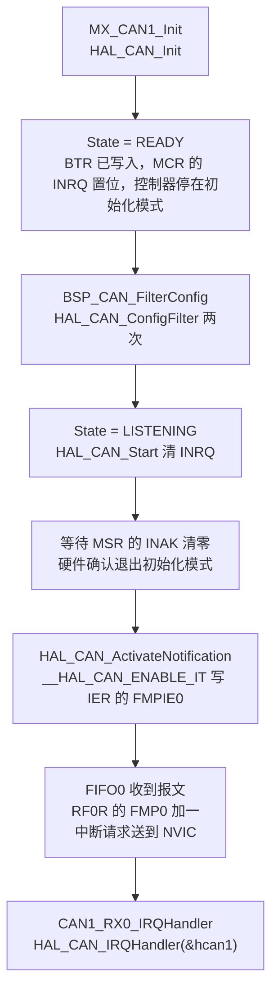
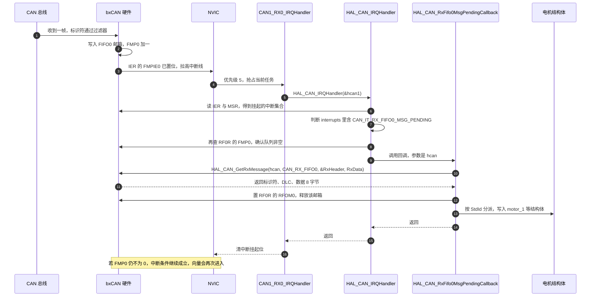
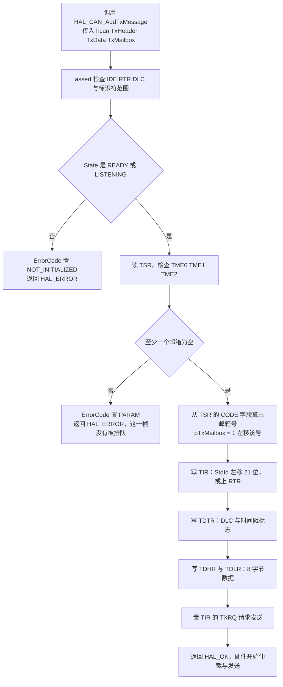

# 收发与中断回调

过滤器决定哪些报文能进 FIFO；接下去是报文进了 FIFO 之后怎么被取出来，以及发出去的帧经过哪些环节。对象是两块板的 `BSP/Src/bsp_can.cpp`。

一次收发涉及四类对象：CAN 句柄与状态机、接收 FIFO 与中断、HAL 回调、发送邮箱。下面先从复位走到能收发，再走接收路径到回调里的实际工作，最后看发送邮箱与返回值的处理。


## 1. 一次收发涉及的对象

CAN 的收发不用寄存器轮询，硬件替软件做好了排队：

| 对象 | 数量 | 作用 | 相关寄存器 |
| --- | --- | --- | --- |
| 发送邮箱 Tx Mailbox | 每控制器 3 个 | 软件写入一帧后置 TXRQ，硬件按优先级发送 | TIR / TDTR / TDLR / TDHR，状态在 TSR |
| 接收 FIFO | 每控制器 2 个 | 硬件收到并过滤后的报文排队 | RF0R / RF1R |
| FIFO 深度 | 每 FIFO 3 个邮箱 | 满 3 帧后按 RFLM 决定覆盖还是丢弃 | MCR 的 RFLM 位 |
| 中断使能 | 每控制器一组 | 决定哪些事件产生中断 | IER |
| 回调 | 每类事件一个 | HAL 在中断服务里调用 | 用户实现，覆盖 HAL 的 weak 版本 |

本项目只用了其中一条通路：中断使能只开了 FIFO0 非空（`CAN_IT_RX_FIFO0_MSG_PENDING`），接收回调只实现了 FIFO0 的版本，发送侧完全靠邮箱排队、不使用发送中断。

## 2. 从复位到能收发

### 2.1 四步顺序

`HAL_CAN_Init` 与 `HAL_CAN_ConfigFilter` 在 CubeMX 生成的初始化里完成，剩下两步在 `BSP_CAN_Init()` 里。云台板 `BSP/Src/bsp_can.cpp:36-59`：

```c
void bsp_can::bsp_can_init()
{
    static bsp_can can;
    // 1. 配置 CAN 过滤器
    can.BSP_CAN_FilterConfig();

    // 2. 启动 CAN 外设
    if (HAL_CAN_Start(&hcan1) != HAL_OK) {
        Error_Handler();
    }
    if (HAL_CAN_Start(&hcan2) != HAL_OK) {
        Error_Handler();
    }

    // 3. 激活 CAN 接收中断（当 FIFO0 中有新消息时触发）
    if (HAL_CAN_ActivateNotification(&hcan1, CAN_IT_RX_FIFO0_MSG_PENDING) != HAL_OK) {
        Error_Handler();
    }
    if (HAL_CAN_ActivateNotification(&hcan2, CAN_IT_RX_FIFO0_MSG_PENDING) != HAL_OK) {
        Error_Handler();
    }
}
```

`BSP_CAN_Init()` 是一个 `extern "C"` 包装（`bsp_can.cpp:721-723`），在 `main()` 里被调用：云台板 `Core/Src/main.c:123`，底盘板 `Core/Src/main.c:128`。两处都排在 `MX_CAN1_Init()` 与 `MX_CAN2_Init()` 之后。

### 2.2 状态迁移与中断使能

`HAL_CAN_Init` 结束时把状态置为 `HAL_CAN_STATE_READY`（`stm32f4xx_hal_can.c:445`）。此后每一步都要求状态合法：



| 步骤 | 函数 | 前置状态 | 结果状态 | 出处 |
| --- | --- | --- | --- | --- |
| 初始化 | `HAL_CAN_Init` | RESET | READY | `stm32f4xx_hal_can.c:275-449` |
| 配过滤器 | `HAL_CAN_ConfigFilter` | READY 或 LISTENING | 不变 | `stm32f4xx_hal_can.c:840-963` |
| 启动 | `HAL_CAN_Start` | READY | LISTENING | `stm32f4xx_hal_can.c:1036-1078` |
| 开中断 | `HAL_CAN_ActivateNotification` | READY 或 LISTENING | 不变 | `stm32f4xx_hal_can.c:1663-1686` |

`HAL_CAN_ActivateNotification` 的实现只有一行有效代码（`stm32f4xx_hal_can.c:1674`）：

```c
__HAL_CAN_ENABLE_IT(hcan, ActiveITs);
```

宏展开是 `IER |= CAN_IT_RX_FIFO0_MSG_PENDING`（`stm32f4xx_hal_can.h:572`）。`CAN_IT_RX_FIFO0_MSG_PENDING` 的值就是 `CAN_IER_FMPIE0`，即 IER 的第 0 位。所以"激活通知"这一步的实质是把 IER 的 FMPIE0 置 1，与 NVIC 里 `CAN1_RX0_IRQn` 的使能是两件独立的事，缺一不可。

## 3. 接收：从中断向量到回调

### 3.1 完整路径

`CAN1_RX0_IRQHandler` 在 `Core/Src/stm32f4xx_it.c:191-198`，函数体只有一行有效代码：

```c
void CAN1_RX0_IRQHandler(void)
{
  HAL_CAN_IRQHandler(&hcan1);
}
```

四个向量都是同样的形式：`CAN1_RX1_IRQHandler`（`stm32f4xx_it.c:205`）、`CAN2_RX0_IRQHandler`（`stm32f4xx_it.c:303`）、`CAN2_RX1_IRQHandler`（`stm32f4xx_it.c:317`）。



### 3.2 HAL 里的三个关键判断

`HAL_CAN_IRQHandler` 从 `stm32f4xx_hal_can.c:1727` 开始，FIFO0 非空的分支在 `:1903-1916`：

```c
if ((interrupts & CAN_IT_RX_FIFO0_MSG_PENDING) != 0U)
{
  if ((hcan->Instance->RF0R & CAN_RF0R_FMP0) != 0U)
  {
    HAL_CAN_RxFifo0MsgPendingCallback(hcan);
  }
}
```

三个判断各有用处：

| 判断 | 位置 | 作用 |
| --- | --- | --- |
| `interrupts & CAN_IT_RX_FIFO0_MSG_PENDING` | `:1903` | 确认 FIFO0 非空是本次中断的来源之一 |
| `RF0R & CAN_RF0R_FMP0` | `:1906` | 确认此刻队列仍有未读报文，避免空读 |
| `HAL_CAN_RxFifo0MsgPendingCallback(hcan)` | `:1914` | 调用回调 |

第三行调用的是弱符号版本。HAL 在文件中提供了一份空实现（`stm32f4xx_hal_can.c:2240`），本项目在 `bsp_can.cpp` 里给出同名强符号，链接器用强符号覆盖弱符号。`stm32f4xx_hal_conf.h:158` 把 `USE_HAL_CAN_REGISTER_CALLBACKS` 配成 0，所以走的是弱符号这条路，而不是注册函数指针那条路。

一次中断只调一次回调。HAL 在进入时检查 FMP0，说明它假定中断会在队列未空时再次进入。事实也确实如此：FIFO0 非空这个中断条件是电平型的，回调读完一帧后 FMP0 若仍大于 0，中断请求依旧有效，CPU 退出中断后会立刻再次进入同一个向量，直到队列读空。

> 这一条是从 HAL 的 FMP0 检查与 bxCAN 的 FIFO 非空中断条件推出的，固件里没有直接证据；若哪天发现回调每次只处理一帧且队列积压不下降，就是这里的前提不成立。

### 3.3 `HAL_CAN_GetRxMessage` 做了什么

`stm32f4xx_hal_can.c:1510-1600`：

| 步骤 | 位置 | 内容 |
| --- | --- | --- |
| 检查状态 | `:1516` | 必须是 READY 或 LISTENING |
| 检查队列非空 | `:1523-1530` | FIFO0 的 FMP0 为 0 时置 `HAL_CAN_ERROR_PARAM` 并返回 HAL_ERROR |
| 读标识符 | `:1548` | `StdId` 从 RIR 取，扩展帧走 `ExtId` |
| 读 DLC 与 FMI | `:1560-1565` | DLC 超过 8 时截断为 8，FMI 记录命中的过滤器组 |
| 读数据 | `:1572-1576` | 固定填满 `aData[0]` 到 `aData[7]` |
| 释放邮箱 | `:1582` | 置 `RF0R` 的 RFOM0 |

两点需要单独说明：

1. 数据场固定填 8 个字节，与 DLC 无关。HAL 从 `RDLR` 与 `RDHR` 两个寄存器里各取 4 字节，不判断 DLC。传入的数组长度必须是 8，且不能假定 DLC 之外的位置有意义。本项目的接收缓冲都是 `uint8_t RxData[8]`，所有帧的 DLC 也是 8，暂时不构成问题。
2. 释放邮箱靠写 RFOM0 完成。写完这一位，FIFO 里的下一个报文前移，FMP0 减一。回调里对 `RxHeader` 与 `RxData` 的任何使用都要在 `HAL_CAN_GetRxMessage` 之后，因为这两个结构是软件副本，与 FIFO 无关。

## 4. 回调里做的事

云台板的回调在 `BSP/Src/bsp_can.cpp:590-715`，底盘板在 `BSP/Src/bsp_can.cpp:583-689`。结构相同：

```c
void HAL_CAN_RxFifo0MsgPendingCallback(CAN_HandleTypeDef *hcan) {
    CAN_RxHeaderTypeDef RxHeader;
    uint8_t RxData[8];
    if (HAL_CAN_GetRxMessage(hcan, CAN_RX_FIFO0, &RxHeader, RxData) == HAL_OK) {
        if(hcan->Instance == CAN2) {
            switch(RxHeader.StdId) {
                case 0x201: { /* 摩擦轮右 */ ... break; }
                case 0x202: { /* 摩擦轮左 */ ... break; }
                default: break;
            }
        }
        if(hcan->Instance == CAN1) {
            switch(RxHeader.StdId) { /* 0x205 0x206 0x181 0x303 0x309 0x401 0x501 */ }
        }
    }
}
```

### 4.1 分派方式

两个 `if` 判断控制器实例，每个控制器内一个 `switch(RxHeader.StdId)`。这是把标识符当消息类型的典型写法：标识符只用来选分支，数据场里的字节位置才是字段含义。

云台板的标识符到字段的映射如下：

| 控制器 | 标识符 | 数据布局 | 写入的目标 | 出处 |
| --- | --- | --- | --- | --- |
| CAN2 | 0x201 | 角度 2 字节，速度 2 字节，电流 2 字节，温度 1 字节 | `motor_1` | `bsp_can.cpp:599-606` |
| CAN2 | 0x202 | 同上 | `motor_2` | `bsp_can.cpp:607-613` |
| CAN1 | 0x205 | 同上，并调用圈数累计 | `motor_5` | `bsp_can.cpp:631-640` |
| CAN1 | 0x206 | 同上，并调用圈数累计 | `motor_6` | `bsp_can.cpp:620-629` |
| CAN1 | 0x181 | 字节 0 是命令字，其余为温度、电流、速度、角度 | `LK_motor_1` | `bsp_can.cpp:643-673` |
| CAN1 | 0x303 | 弹量 2 字节，弹速 4 字节 | `TotalAmmoShooted`、`AmmoSpeed` | `bsp_can.cpp:675-683` |
| CAN1 | 0x309 | 热量 2 字节，底盘旋转速度 4 字节 | `hot_17mm`、`control_target.chassis_wz` | `bsp_can.cpp:685-692` |
| CAN1 | 0x401 | roll / pitch / yaw 各 2 字节 | `imu_data_chassis` | `bsp_can.cpp:694-705` |
| CAN1 | 0x501 | 旋转速度 2 字节 | `chassis.spinvelocity` | `bsp_can.cpp:707-710` |
| 两个 | 其他 | 无 | 落到 `default: break;` | `bsp_can.cpp:614`、`:711` |

`0x181` 的 LK 电机反馈还有一层内层 `switch`，用 `RxData[0]` 的命令字再分一次支（`bsp_can.cpp:644-671`）。这是同一帧承载多种反馈类型的做法：标识符区分设备，首字节区分命令。

### 4.2 圈数累计放在中断里

大疆电机的转子角度只有 12 位或 16 位，跨零点时会回绕。云台板在回调里直接更新累计角度（`bsp_can.cpp:559-587`）：

```c
int32_t diff = static_cast<int32_t>(new_ecd) - static_cast<int32_t>(motor->last_angle);
if (diff > 4096) {
    motor->round_count--;
}
else if (diff < -4096) {
    motor->round_count++;
}
motor->total_angle = motor->round_count * (int32_t)8192 + (int32_t)new_ecd;
motor->last_angle = new_ecd;
```

这段代码在中断上下文里执行，被 `update_motor_total_angle(&motor_5, ...)` 与 `update_motor_total_angle(&motor_6, ...)` 两处调用。它写入了 `round_count`、`total_angle`、`last_angle` 三个字段，任务侧读 `total_angle` 时没有临界区保护。单个 `int32_t` 的读写是原子操作，不会读到半个数，但多字段之间不保证一致。

## 5. 发送：邮箱、优先级与返回值

### 5.1 `HAL_CAN_AddTxMessage` 的流程

`stm32f4xx_hal_can.c:1252-1334`：



关键位置：邮箱空闲判断在 `:1277-1280`，邮箱选择在 `:1282-1285`，标识符写入在 `:1290`，请求发送在 `:1322`，邮箱满的错误分支在 `:1327-1333`。

### 5.2 三个邮箱与发送顺序

云台板的 CAN1 在 1 ms 内要发 4 帧（`Task/Src/ControlCenterTask.cpp:106-108` 一轮循环发出：0x1FF、0x141、0x301、0x302），CAN2 发 1 帧（同一轮的 0x200）。3 个邮箱在正常情况下够用：每帧在 1 Mbps 上占用 108 到 132 微秒，4 帧串行发送不到 0.6 ms，仍小于 1 ms 的周期，但余量只剩不到一半。

`TransmitFifoPriority` 配的是 DISABLE（`Core/Src/can.c:52`、`can.c:84`），HAL 把它转成 `MCR` 的 TXFP 位清零（`stm32f4xx_hal_can.c:427-435`）。TXFP 为 0 时，多个待发邮箱之间按标识符优先级排队，而不是按请求先后。于是同一时刻有 0x1FF 与 0x301 两个待发帧时，0x1FF 先上总线。

### 5.3 返回值被忽略

所有发送函数的返回值都是 `HAL_CAN_AddTxMessage` 的结果（例如 `bsp_can.cpp:112`、`bsp_can.cpp:521`），而调用点全部丢掉了返回值：

```c
bsp_can2_djimotorcmd(control_output_motor_1, control_output_motor_2, 0., 0);
bsp_can1_djimotorcmdfive2eight(yaw_current_out, control_output_motor_3, 0, 0);
bsp_can1_lkmotortorquecmd(pitch_current_out);
```

邮箱连续三轮都满时，`HAL_CAN_AddTxMessage` 返回 HAL_ERROR 并把 `ErrorCode` 置为 `HAL_CAN_ERROR_PARAM`，这一帧被静默丢弃。三个邮箱在 1 ms 周期内被填满的可能是：总线被持续占用（例如某节点一直重发）、波特率不匹配导致发送停在错误状态、或 `AutoRetransmission` 开着而对方不回应答。这三种情况下丢帧都不会被应用层看到。

## 6. 易错点

| 易错点 | 现象 | 本项目的位置 |
| --- | --- | --- |
| 只开 NVIC 不开 IER | 中断向量使能了但永远不进 | `can.c:125-128` 与 `bsp_can.cpp:52-57` 两步都做了 |
| 只开 IER 不开 NVIC | FIFO 满了也没有中断 | 同上 |
| 在 `HAL_CAN_Start` 之前激活通知 | 返回值 HAL_ERROR 并置 NOT_INITIALIZED | 本工程顺序正确，Start 在 ActivateNotification 之前 |
| 忘记实现回调 | 报文一直在 FIFO 里累积，中断反复进入空转 | 两块板都实现了 `HAL_CAN_RxFifo0MsgPendingCallback` |
| 回调里读超过 DLC 的字节 | 读到 `RDLR` / `RDHR` 里上一次的残留 | 本工程所有帧 DLC 都是 8，未暴露 |
| 读满 8 字节却不检查 DLC | 与上一条同源 | `bsp_can.cpp:601-604` 固定取字节 6 作温度 |
| `switch` 缺少 `break` | 一个帧进两个分支，后一个分支用错的字节 | 底盘 `bsp_can.cpp:640-645` 的 0x301 缺 `break`，会落入 0x302 的解析 |
| 发送返回值不检查 | 邮箱满时静默丢帧 | `Task/Src/ControlCenterTask.cpp:132-136` |
| 中断里调用非 ISR 版 API | 破坏事件链表或触发断言 | 本工程回调里没有调用任何 FreeRTOS API |
| 中断优先级越过 syscall 边界 | 若回调里加了 FreeRTOS API 会触发断言 | 四个 CAN 中断都是优先级 5，等于 `configLIBRARY_MAX_SYSCALL_INTERRUPT_PRIORITY` |
| 中断里更新多字段结构体 | 任务侧读到角度与速度不同步的组合 | `bsp_can.cpp:601-604` 分四次写 `motor_1` |
| 认为中断一次只来一帧 | FIFO 一次可以攒 3 帧 | 电平型中断会连续进入，回调每次处理一帧 |

## 7. 小结

### 核心概念

- 能收发的完整条件有三层：NVIC 使能向量、IER 使能事件、过滤器放行报文。三层缺一不可。
- `HAL_CAN_Init` 把状态置为 READY，`HAL_CAN_Start` 清 INRQ 并等 INAK 清零后置为 LISTENING，其他操作都要求状态合法。
- `HAL_CAN_ActivateNotification(hcan, CAN_IT_RX_FIFO0_MSG_PENDING)` 的实质是把 IER 的 FMPIE0 置 1。
- 中断路径是 `CANx_RX0_IRQHandler` → `HAL_CAN_IRQHandler` → 检查 IER 与 RF0R → `HAL_CAN_RxFifo0MsgPendingCallback`。最后一个是弱符号，本项目用强符号覆盖。
- `HAL_CAN_GetRxMessage` 固定填满 8 字节数据并写 RFOM0 释放邮箱；DLC 不影响填充长度。
- 发送侧有 3 个邮箱，`TXFP = 0` 时按标识符优先级排队。邮箱全满时 `HAL_CAN_AddTxMessage` 返回 HAL_ERROR，本工程没有检查返回值。
- 回调在中断上下文执行，写入的是全局电机结构体，任务侧读这些字段没有临界区保护。

### 设计权衡

| 决策 | 选择 | 收益 | 代价 |
| --- | --- | --- | --- |
| 接收方式 | FIFO0 非空中断 | 无需轮询，电机反馈到达即更新 | 回调在中断里执行，必须控制耗时 |
| 回调粒度 | 一次中断处理一帧 | 单次中断时间短，最短约几微秒 | 依赖中断反复进入把 FIFO 读空 |
| FIFO 分流 | 只用 FIFO0 | 只有一个回调要维护 | 无法按优先级区分中断响应 |
| 数据缓冲 | 回调内声明 `RxData[8]` | 无全局缓冲，不占静态内存 | 每次中断在栈上多 8 字节 |
| 状态更新 | 中断里直接写全局结构体 | 延迟最低，任务侧读到的是最新值 | 多字段更新的原子性没有保证 |
| 发送等待 | 不等待、不检查返回值 | 发送不阻塞控制循环 | 邮箱满时丢帧不可观测 |
| 发送优先级 | `TXFP = 0`，按标识符 | 命令帧优先于状态帧 | 无法保证同优先级帧的先后 |

## 8. 练习

### 基础题

1. 写出让 CAN1 能收到报文的三个使能条件，以及每个条件对应的寄存器或代码位置。
2. `HAL_CAN_GetRxMessage` 在 FIFO0 为空时返回什么？`ErrorCode` 会被置成哪个值？
3. CAN1 在 1 ms 内连续调用 4 次发送函数，每次调用之间不做等待。按 1 Mbps 下最坏 132 微秒每帧计算，3 个邮箱是否够用？
4. 说明 `RxData[8]` 在 DLC 为 2 时，`RxData[2]` 到 `RxData[7]` 的内容来源。

### 挑战题

5. 底盘板 `bsp_can.cpp:640-645` 的 `case 0x301` 缺少 `break`。写出收到 0x301 帧时实际执行的分支序列，并说明这会给哪个全局变量写入什么值。
6. 设计一个"丢帧可观测"方案：要求不改变发送函数的签名，在任务侧能读到累计丢帧数与最近一次丢帧的标识符。给出实现思路与需要改动的函数。
7. 把接收从"一次中断一帧"改成"一次中断读空 FIFO"。写出回调的改造思路，并说明这样改动之后中断次数与任务侧读到数据的一致性各有什么变化。
8. 回调在中断里更新 `motor_5` 的四个字段，任务侧同时读这四项。设计一个方案让任务读到自洽的一组数据，要求中断里的执行时间不显著增加。

---

### 附：本页引用的固件路径

| 路径 | 用途 |
| --- | --- |
| `2026OmniSentryGimbal/BSP/Src/bsp_can.cpp` | 初始化顺序（:36-59）、C 接口（:721-723）、接收回调（:590-715）、圈数累计（:559-587） |
| `2026OmniSentryChassis/2026OmniSentryChassis/BSP/Src/bsp_can.cpp` | 初始化顺序（:30-53）、接收回调（:583-689） |
| `2026OmniSentryGimbal/Core/Src/stm32f4xx_it.c` | 四个 CAN 中断向量（:191、:205、:303、:317） |
| `2026OmniSentryGimbal/Core/Src/can.c` | NVIC 优先级与使能（:125-128、:158-161）、TXFP 配置（:52、:84） |
| `2026OmniSentryGimbal/Core/Src/main.c` | `BSP_CAN_Init()` 调用点（:123） |
| `2026OmniSentryChassis/2026OmniSentryChassis/Core/Src/main.c` | `BSP_CAN_Init()` 调用点（:128） |
| `2026OmniSentryGimbal/Drivers/STM32F4xx_HAL_Driver/Src/stm32f4xx_hal_can.c` | `HAL_CAN_IRQHandler`（:1727-1916）、`HAL_CAN_GetRxMessage`（:1510-1600）、`HAL_CAN_AddTxMessage`（:1252-1334）、弱回调（:2240）、`HAL_CAN_Start`（:1036）、`ActivateNotification`（:1663） |
| `2026OmniSentryGimbal/Drivers/STM32F4xx_HAL_Driver/Inc/stm32f4xx_hal_can.h` | `__HAL_CAN_ENABLE_IT` 宏（:572） |
| `2026OmniSentryGimbal/Core/Inc/stm32f4xx_hal_conf.h` | `USE_HAL_CAN_REGISTER_CALLBACKS` = 0（:158） |
| `2026OmniSentryGimbal/Task/Src/ControlCenterTask.cpp` | 发送调用点（:131-137） |
