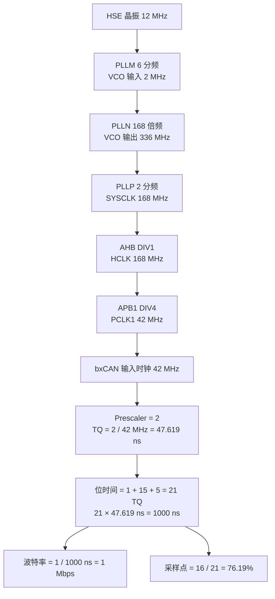
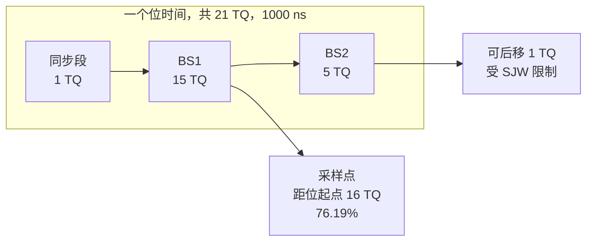
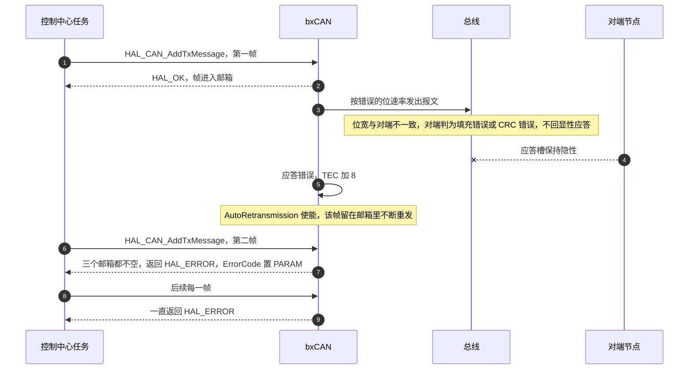

# 波特率与采样点

`Core/Src/can.c` 里的四个位定时参数可以算到底，得到 1 Mbps 与采样点的完整推导，再复盘一次「代码没动、通信失效」的排查记录。两块板的参数逐字相同，文件分别是云台板 `Core/Src/can.c` 与底盘板同名文件。

位时间由同步段、传播段、相位缓冲段一与相位缓冲段二组成，波特率与采样点都从这里算出来。改动时钟树会连带改掉波特率，这是本单元最容易忽略的耦合。


## 1. 位时间由四段构成

CAN 的每一位是一段按时间份额（Time Quantum，缩写 TQ）划分的位时间，各段长度由配置决定。一个位时间包含三段：

| 段 | 长度 | 作用 |
| --- | --- | --- |
| 同步段 SYNC_SEG | 固定 1 TQ | 位跳变应当发生在这里，用于与总线边沿对齐 |
| 时间段 1 BS1 | 1 到 16 TQ | 覆盖传播延迟与正相位误差，采样点在它的末尾 |
| 时间段 2 BS2 | 1 到 8 TQ | 吸收负相位误差，给重同步留出后移空间 |
| 重同步跳转宽度 SJW | 1 到 4 TQ | 一次重同步最多调整的 TQ 数，要求 $SJW \le BS2$ |

位时间是

$$t_{bit} = (1 + BS1 + BS2) \cdot TQ$$

采样点的位置是

$$p_{s} = \frac{1 + BS1}{1 + BS1 + BS2}$$

TQ 的时长由外设时钟与预分频决定：

$$TQ = \frac{Prescaler}{f_{PCLK1}}$$

于是波特率是

$$f_{baud} = \frac{f_{PCLK1}}{Prescaler \cdot (1 + BS1 + BS2)}$$

## 2. 从 HSE 到 1 Mbps 的完整链路

### 2.1 时钟树

`Core/Src/main.c` 里的分频参数：

| 参数 | 取值 | 结果 |
| --- | --- | --- |
| `HSE_VALUE` | 12 MHz | 外部晶振，定义在 `Core/Inc/stm32f4xx_hal_conf.h` |
| `PLLM` | 6 | VCO 输入 = $12 / 6 = 2$ MHz |
| `PLLN` | 168 | VCO 输出 = $2 \times 168 = 336$ MHz |
| `PLLP` | 2 | SYSCLK = $336 / 2 = 168$ MHz |
| `AHBCLKDivider` | DIV1 | HCLK = 168 MHz |
| `APB1CLKDivider` | `RCC_HCLK_DIV4` | PCLK1 = 42 MHz |
| `APB2CLKDivider` | `RCC_HCLK_DIV2` | PCLK2 = 84 MHz |

CAN1 与 CAN2 挂在 APB1 上，时钟使能写的是 `RCC->APB1ENR` 的 CAN1EN 与 CAN2EN 位（`stm32f4xx_hal_rcc_ex.h`），所以 bxCAN 的输入时钟就是 PCLK1 = 42 MHz。



### 2.2 位定时的四个参数

`Core/Src/can.c`：

```c
hcan1.Init.Prescaler = 2;
hcan1.Init.Mode = CAN_MODE_NORMAL;
hcan1.Init.SyncJumpWidth = CAN_SJW_1TQ;
hcan1.Init.TimeSeg1 = CAN_BS1_15TQ;
hcan1.Init.TimeSeg2 = CAN_BS2_5TQ;
```

| 参数 | 取值 | 含义 |
| --- | --- | --- |
| `Prescaler` | 2 | TQ 是 PCLK1 周期的 2 倍 |
| `SyncJumpWidth` | 1 TQ | 一次重同步最多挪动 1 TQ |
| `TimeSeg1` | 15 TQ | 即 BS1 |
| `TimeSeg2` | 5 TQ | 即 BS2 |

代入公式：

$$TQ = \frac{2}{42 \times 10^{6}} = 47.619\ \text{ns}$$

$$t_{bit} = 21 \times 47.619\ \text{ns} = 1000\ \text{ns}$$

$$f_{baud} = \frac{1}{1000\ \text{ns}} = 1\ \text{Mbps}$$

$$p_{s} = \frac{1 + 15}{21} = 76.19\%$$



### 2.3 与 CubeMX 的数值对照

`2026sentriomeni.ioc` 里保存了同一组参数的计算结果：

| ioc 键 | 值 | 与手算的关系 |
| --- | --- | --- |
| `CAN1.Prescaler` | 2 | 同上 |
| `CAN1.BS1` | `CAN_BS1_15TQ` | 同上 |
| `CAN1.BS2` | `CAN_BS2_5TQ` | 同上 |
| `CAN1.SJW` | `CAN_SJW_1TQ` | 同上 |
| `CAN1.CalculateTimeQuantum` | 47.61904761904762 | 与 $2/42\ \text{MHz}$ 一致 |
| `CAN1.CalculateTimeBit` | 1000 | 与 $21 \times 47.619$ 一致 |
| `CAN1.CalculateBaudRate` | 1000000 | 与 $1/t_{bit}$ 一致 |

这些数值是 CubeMX 按当时的时钟树算出来并存进 ioc 的。它们不会随时钟树自动更新，是这次故障能在事后被定位的关键证据。

### 2.4 从 BTR 寄存器反推

`HAL_CAN_Init` 把四个参数直接写进 `BTR` 寄存器（`stm32f4xx_hal_can.c`）：

```c
WRITE_REG(hcan->Instance->BTR, (uint32_t)(hcan->Init.Mode           |
                                          hcan->Init.SyncJumpWidth  |
                                          hcan->Init.TimeSeg1       |
                                          hcan->Init.TimeSeg2       |
                                          (hcan->Init.Prescaler - 1U)));
```

| BTR 位域 | 位 | 寄存器里存的值 | 对应的物理量 |
| --- | --- | --- | --- |
| BRP | 9:0 | Prescaler − 1 = 1 | 分频系数 2 |
| TS1 | 19:16 | BS1 − 1 = 14 | BS1 = 15 TQ |
| TS2 | 22:20 | BS2 − 1 = 4 | BS2 = 5 TQ |
| SJW | 25:24 | SJW − 1 = 0 | SJW = 1 TQ |
| SILM / LBKM | 31:30 | 0 | 正常模式 |

于是 BTR 的期望值是 `0x004E0001`。用调试器读回这个值，就能确认波特率配置与预期一致；若时钟树被改而 BTR 不变，读回来的仍然是 `0x004E0001`，但实际波特率已经变了。这是这次故障最难判断的地方：寄存器值正确，物理速率错误。

## 3. 采样点的取值空间

### 3.1 相同波特率下的不同组合

APB1 为 42 MHz 时，Prescaler 必须整除 42，且总 TQ 数 $1 + BS1 + BS2$ 不超过 $1 + 16 + 8 = 25$。可行的组合：

| Prescaler | TQ | 总 TQ | BS1 | BS2 | 采样点 | SJW 上限 |
| --- | --- | --- | --- | --- | --- | --- |
| 2 | 47.619 ns | 21 | 15 | 5 | 76.19% | 4 |
| 2 | 47.619 ns | 21 | 16 | 4 | 80.95% | 4 |
| 2 | 47.619 ns | 21 | 14 | 6 | 71.43% | 4 |
| 3 | 71.429 ns | 14 | 11 | 2 | 85.71% | 2 |
| 3 | 71.429 ns | 14 | 10 | 3 | 78.57% | 3 |
| 6 | 142.857 ns | 7 | 5 | 1 | 85.71% | 1 |
| 6 | 142.857 ns | 7 | 4 | 2 | 71.43% | 2 |
| 7 | 171.429 ns | 6 | 4 | 1 | 83.33% | 1 |

本项目取的是第一行。三点推论：

1. BS1 最大 16 TQ，所以在 21 TQ 的方案里采样点最高只能到 80.95%，取不到 87.5%；
2. 想靠近 87.5% 需要换 Prescaler，第 4 行的 85.71% 是可行的次优解，代价是 BS2 只剩 2 TQ；
3. SJW 的上限由 BS2 决定，BS2 越小，能吸收的相位偏差越小。本项目 BS2 = 5 TQ，SJW 取 1 TQ 留了充足余量。

### 3.2 采样点的两难

采样点位置同时影响两件事：

| 采样点提前（BS1 短） | 采样点推后（BS1 长） |
| --- | --- |
| 采样后留给 BS2 的时间更多，能吸收更大的负相位误差 | 留给 BS2 的时间更少，负相位误差异常时更容易出错 |
| 从发送到采样的时间更短，对传播延迟与晶振偏差的容忍度更低 | 波形有更长时间稳定到采样点，适合长总线与多节点 |
| 适合短总线、节点少的总线 | 适合线长较长、节点较多的总线 |

业界常见的目标值是 87.5%，CANopen 明确取这个值；也有资料给出 75% 到 87.5% 的可接受区间。本项目取 76.19%，落在该区间的下沿。

> 87.5% 与 75% 到 87.5% 这两个数字来自 CiA 与 Bosch 的公开资料，不是固件里能查到的参数；本项目在 1 Mbps、线束长度不足一米、节点数不超过 10 的条件下，76.19% 与 80.95% 都能正常通信，实际选用值由 CubeMX 的默认计算给出。

### 3.3 SJW 的作用范围

SJW 决定重同步的强度。硬件在每个位的跳变处比较期望边沿与实际边沿：实际边沿来得早，就把 BS1 延长；来得晚，就把 BS1 缩短。单次调整量不超过 SJW。

| SJW | 单次可调整 | 适用 |
| --- | --- | --- |
| 1 TQ | 位时间的 1/21 ≈ 4.8% | 晶振精度高、总线短 |
| 2 到 4 TQ | 最多 4/21 ≈ 19% | 晶振偏差较大或线束较长 |

本项目两块板用同一型号晶振，取 1 TQ。若两块板的晶振精度差异较大，或者总线延长到数米，应把 SJW 提到 2 到 4 TQ，同时确认 BS2 不小于 SJW。

## 4. 一次波特率失效的复盘

### 4.1 现场

工作记录 `can通信波特率问题.md` 记录的现象是：底盘 CAN1 与 CAN2 都收不到报文，发送函数第一次返回 HAL_OK，之后一直返回 HAL_ERROR；代码在假期前正常工作，期间没有人修改过代码。

排查过程里被逐项排除的环节：

| 检查项 | 结论 |
| --- | --- |
| CAN 初始化调用 | `MX_CAN_Init()` 与 `BSP_CAN_Init()` 都调用了 |
| 过滤器配置 | 0 到 13 给 CAN1，14 到 27 给 CAN2，全接收 |
| 中断激活 | `HAL_CAN_ActivateNotification()` 已激活 FIFO0 中断 |
| 中断处理 | `HAL_CAN_IRQHandler()` 被正常调用 |
| 回调函数 | `HAL_CAN_RxFifo0MsgPendingCallback()` 存在且逻辑正确 |
| 发送函数 | `HAL_CAN_AddTxMessage()` 调用正确 |

记录里读到的寄存器值：

| 寄存器 | 读回值 |
| --- | --- |
| `hcan2.ErrorCode` | `0x00200000` |
| MSR | `0x0C08` |
| TSR | `0x82000004` |

### 4.2 从寄存器值还原失效链路

把 HAL 头文件里的位定义与读回值对上：

| 读回值 | 按头文件解析 | 含义 |
| --- | --- | --- |
| TSR `0x82000004` | bit 2 = `ALST0`，bit 24 与 25 组成 CODE = 2，bit 26 到 28 = TME0/1/2 全为 0，bit 31 = `LOW2` | 邮箱 0 仲裁失败，三个邮箱都没有空位 |
| ErrorCode `0x00200000` | 等于 `HAL_CAN_ERROR_PARAM`（`stm32f4xx_hal_can.h`） | 最近一次失败的调用是参数类失败，对应 `HAL_CAN_AddTxMessage` 的邮箱全满分支（`stm32f4xx_hal_can.c`） |
| MSR `0x0C08` | bit 3 = `WKUI`，bit 10 = `SAMP`，bit 11 = `RX` | 唤醒中断挂起，采样值为隐性，控制器处于接收状态 |

这三条放在一起，指向一条自洽的链路：



这条链路解释了记录里最反常的一条：为什么第一次发送成功、之后全部失败。第一次进邮箱是软件动作，与总线无关；之后失败是因为第一帧一直占着邮箱不肯离开。`AutoRetransmission = ENABLE`（`Core/Src/can.c`、`can.c`）把自动重传打开，配合波特率错误，就形成了"邮箱被一帧长期占用"的局面。

> 需要标注一处不一致：工作记录把这个 `ErrorCode` 值写成 `HAL_CAN_ERROR_NOT_STARTED`，把 MSR `0x0C08` 描述为 ERRI 位挂起。按 `stm32f4xx_hal_can.h`，`HAL_CAN_ERROR_NOT_STARTED` 是 `0x00100000`，`0x00200000` 是 `HAL_CAN_ERROR_PARAM`；ERRI 是 MSR 的 bit 2，`0x0C08` 里这一位为 0。上表的解析按头文件为准，记录中的文字描述可能来自当时的另一种读法。

### 4.3 根因

记录给出的根因是时钟树配置被修改，导致 APB1 频率变化，波特率随之偏离。用第 1 节的公式可以把偏离量算出来。若 APB1 从 42 MHz 变成 36 MHz：

$$TQ = \frac{2}{36 \times 10^{6}} = 55.556\ \text{ns}$$

$$t_{bit} = 21 \times 55.556\ \text{ns} = 1166.67\ \text{ns}$$

$$f_{baud} = \frac{1}{1166.67\ \text{ns}} = 857143\ \text{bps}$$

857143 bps 与记录里写下的"计算波特率 = 857142 Hz"一致，与目标 1 Mbps 相差 14.29%。@.ioc` 里的 `CAN1.CalculateBaudRate=1000000` 是按 42 MHz 算的，时钟树一改，这个数值就不再反映实际速率。

修复方式记录里写得很直接：核对并修正 ioc 中的时钟树，重新生成代码，使 APB1 回到与计算一致的频率。

### 4.4 排查顺序

记录里给出的优先级次序，与第 3.2 节的推导一致：波特率依赖时钟树，时钟树排在外设配置之前。

| 顺序 | 检查对象 | 判据 |
| --- | --- | --- |
| 1 | 时钟树与 APB1 频率 | 读 RCC 的 CFGR，或核对 `HAL_RCC_GetPCLK1Freq()` |
| 2 | GPIO 复用与引脚 | `can.c` 里的 AF9 配置 |
| 3 | 外设初始化顺序 | `HAL_CAN_Init` → 过滤器 → `HAL_CAN_Start` |
| 4 | 中断配置与使能 | NVIC 向量与 IER 位 |
| 5 | 物理层 | 接线、终端电阻、收发器供电 |
| 6 | 应用逻辑 | 回调与解析代码 |

其中第 5 项在记录里被列为需要示波器确认的环节：若总线上一帧都没有，先量 CAN_H 与 CAN_L 的差分波形，再判断问题在 MCU 侧还是在收发器侧。

## 5. 易错点

| 易错点 | 现象 | 定位方式 |
| --- | --- | --- |
| 改时钟树不重新核对波特率 | 寄存器值正确、物理速率错误 | 用 `HAL_RCC_GetPCLK1Freq()` 反算实际波特率 |
| 只看 ioc 里的 CalculateBaudRate | 它不随时钟树更新 | 手算 $f_{PCLK1}/(Prescaler \cdot (1+BS1+BS2))$ |
| 把 BS1 与 BS2 当寄存器原值 | BTR 里存的是减一后的值 | 反推时 TS1 位域加 1 |
| 采样点取在 87.5% 却受 BS1 上限限制 | 21 TQ 方案里取不到 87.5% | 先确定总 TQ 再选 BS1 |
| SJW 大于 BS2 | 重同步越界，报文出错 | 校验 $SJW \le BS2$ |
| 认为 AutoRetransmission 一定有利 | 波特率错误时邮箱被长期占用 | 观察 TSR 的 TME 位是否长期为 0 |
| 用 ErrorCode 的数值猜错误类型 | 位定义与文字描述容易记混 | 查 `stm32f4xx_hal_can.h` |
| 忽略 Prescaler 的取值约束 | 1 到 1024，且 BTR 里存减一值 | 反推时 BRP 位域加 1 |

## 6. 小结

### 核心概念

- 位时间 $t_{bit} = (1 + BS1 + BS2) \cdot TQ$，$TQ = Prescaler / f_{PCLK1}$。
- 采样点位置 $p_s = (1 + BS1)/(1 + BS1 + BS2)$，本项目的 15 与 5 得到 21 TQ 与 76.19%。
- 本项目 APB1 = 42 MHz（168 MHz 经 `RCC_HCLK_DIV4`），Prescaler = 2，TQ = 47.619 ns，位时间 1000 ns，波特率 1 Mbps。
- bxCAN 的 BS1 上限是 16 TQ，BS2 上限是 8 TQ，所以同一波特率下采样点不能随意取到 87.5%。
- BTR 寄存器存的是减一值：BRP = Prescaler − 1，TS1 = BS1 − 1，TS2 = BS2 − 1，SJW = SJW − 1；本项目的期望值是 `0x004E0001`。
- 波特率与 APB1 绑定。时钟树一改，BTR 不变而物理速率改变，表现为"第一次发送成功、之后邮箱全满"。
- ErrorCode 与寄存器位定义以 HAL 头文件为准，工作记录里的文字描述有两处与头文件不符。

### 设计权衡

| 决策 | 选择 | 收益 | 代价 |
| --- | --- | --- | --- |
| Prescaler | 2 | TQ 最小，位内分段最细，组合最多 | 采样点上限被 BS1 = 16 TQ 限制在 80.95% |
| BS1 与 BS2 | 15 与 5 | BS2 留 5 TQ，重同步余量充足 | 采样点 76.19%，比 87.5% 偏前 |
| SJW | 1 TQ | 与高精度晶振匹配，重同步不过冲 | 晶振偏差大的现场容易出错 |
| 参数来源 | CubeMX 计算并写入 ioc | 生成代码与 ioc 一致，便于核对 | ioc 数值不会随时钟树更新 |
| 波特率 | 1 Mbps | 单帧 108 到 132 微秒，1 kHz 量级的命令与反馈帧合计上界约 66% | 线束长度与节点数受限，频率再翻倍余量就很小 |
| 自动重传 | 使能 | 偶发仲裁失败或错误后能自恢复 | 波特率错误时邮箱被长期占用，现象具有误导性 |

## 7. 练习

### 基础题

1. 用第 1 节的公式复算：若 Prescaler 改为 3、BS1 = 11、BS2 = 2，位时间与波特率是多少？采样点是多少？
2. 本项目的 BTR 寄存器期望值 `0x004E0001`，请逐位写出 BRP、TS1、TS2、SJW 四个位域的取值及对应的物理量。
3. 说明 `CAN1.CalculateBaudRate=1000000` 这个 ioc 键为什么不能作为波特率正确的证据。
4. 若把 `APB1CLKDivider` 从 `RCC_HCLK_DIV4` 改成 `RCC_HCLK_DIV2`，PCLK1 变成多少？此时不修改位定时参数，实际波特率是多少？

### 挑战题

5. 已知目标波特率 1 Mbps、PCLK1 = 42 MHz、BS1 上限 16 TQ、BS2 上限 8 TQ。列出所有可行的 Prescaler 与 BS1、BS2 组合，并给出采样点落在 80% 到 88% 之间的方案。
6. 设计一套"波特率自检"流程：要求在上电后不依赖外部设备，仅靠寄存器与错误计数判断总线速率是否与对端一致。写出用到的寄存器、判据与失败时的处理。
7. 若两块板的 CAN 波特率相差 5%（一块 1 Mbps，另一块 950 kbps），推导通信是否可能成功，并说明错误计数会如何变化。
8. 本项目 BS2 = 5 TQ、SJW = 1 TQ。推导把 SJW 提到 4 TQ 后，对采样点位置、重同步能力与位时间三项分别有什么影响。

---

### 附：本页引用的固件路径

| 路径 | 用途 |
| --- | --- |
| `2026OmniSentryGimbal/Core/Src/can.c` | 位定时参数、自动重传 |
| `2026OmniSentryGimbal/Core/Src/main.c` | 时钟树参数 |
| `2026OmniSentryGimbal/Core/Inc/stm32f4xx_hal_conf.h` | `HSE_VALUE` |
| `2026OmniSentryGimbal/2026sentriomeni.ioc` | CubeMX 保存的位定时计算结果（第 5 至 34 行） |
| `2026OmniSentryGimbal/Drivers/STM32F4xx_HAL_Driver/Src/stm32f4xx_hal_can.c` | BTR 写入、邮箱全满分支 |
| `2026OmniSentryGimbal/Drivers/STM32F4xx_HAL_Driver/Inc/stm32f4xx_hal_can.h` | 错误码定义 |
| `2026OmniSentryGimbal/Drivers/CMSIS/Device/ST/STM32F4xx/Include/stm32f407xx.h` | BTR 位域、TSR 位域、MSR 位域 |
| `2026OmniSentryGimbal/Drivers/STM32F4xx_HAL_Driver/Inc/stm32f4xx_hal_rcc_ex.h` | CAN1 与 CAN2 的 APB1 时钟使能 |
| `can通信波特率问题.md` | 失效现象、寄存器读回值与根因记录 |
