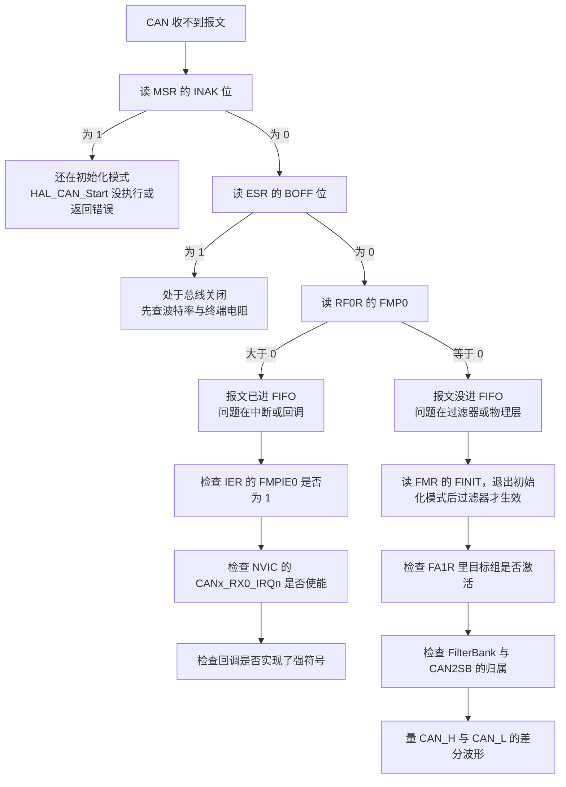
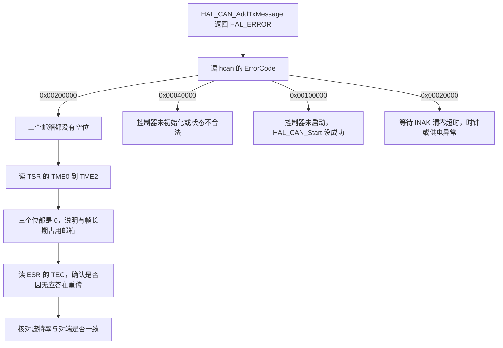
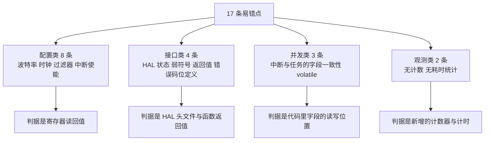

# 易错点与调试

> 前三篇讲清了协议、过滤器与收发路径。本文把它们归纳成两张判断树与一份核对清单，用于现场定位。所有判据都来自可以读到的寄存器与 HAL 错误码，不依赖额外的调试工具。

## 1. 概念：排查从时钟开始

CAN 出问题时，应用代码排在优先怀疑对象之外。工作记录 `/home/wyx/Work-Summary-and-Diary/工作记录/can通信波特率问题.md` 给出的优先级次序如下，理由在 `04-波特率与采样点` 已经算过：波特率由时钟树派生，时钟树一改，配置正确也可能通信不了。

| 顺序 | 检查对象 | 本项目的具体位置 | 判据 |
| --- | --- | --- | --- |
| 1 | 时钟配置 | `Core/Src/main.c:170-188` | `HAL_RCC_GetPCLK1Freq()` 是否为 42 MHz |
| 2 | GPIO 复用 | `Core/Src/can.c:112-122`、`:145-155` | PD0/PD1 与 PB5/PB6 是否配成 AF9 |
| 3 | 外设初始化顺序 | `BSP/Src/bsp_can.cpp:36-59` | 过滤器、Start、中断激活三步是否都返回 HAL_OK |
| 4 | 中断配置与使能 | `Core/Src/can.c:125-161` | NVIC 向量与 IER 位是否都开 |
| 5 | 物理层连接 | 板外线束与收发器 | 终端电阻与差分波形 |
| 6 | 应用逻辑 | `BSP/Src/bsp_can.cpp:590-715` | 回调与解析代码 |

这条次序的含义是：1 到 4 都能用寄存器确认，5 需要示波器，只有 6 才是读代码。

## 2. 六个关键寄存器

### 2.1 位定义

| 寄存器 | 关键字段 | 位 | 含义 |
| --- | --- | --- | --- |
| MSR | `INAK` | 0 | 1 表示仍在初始化模式，收发都不工作 |
| MSR | `SLAK` | 1 | 1 表示睡眠模式 |
| MSR | `ERRI` | 2 | 1 表示有错误中断挂起 |
| MSR | `SAMP` | 10 | 最近一次采样的电平，1 表示隐性 |
| MSR | `RX` | 11 | 1 表示控制器正在接收报文 |
| ESR | `EWGF` | 0 | 1 表示 TEC 或 REC 达到 96 |
| ESR | `EPVF` | 1 | 1 表示错误被动状态 |
| ESR | `BOFF` | 2 | 1 表示总线关闭 |
| ESR | `LEC` | 6:4 | 最近一次错误类型，0 表示无错 |
| ESR | `TEC` | 23:16 | 发送错误计数 |
| ESR | `REC` | 31:24 | 接收错误计数 |
| TSR | `RQCP0` 到 `RQCP2` | 0 / 8 / 16 | 各邮箱的请求完成标志 |
| TSR | `TXOK0` 到 `TXOK2` | 1 / 9 / 17 | 各邮箱发送成功 |
| TSR | `ALST0` 到 `ALST2` | 2 / 10 / 18 | 各邮箱仲裁失败 |
| TSR | `TERR0` 到 `TERR2` | 3 / 11 / 19 | 各邮箱发送出错 |
| TSR | `CODE` | 25:24 | 待发邮箱的编号 |
| TSR | `TME0` 到 `TME2` | 26 / 27 / 28 | 各邮箱为空，1 表示可写 |
| RF0R | `FMP0` | 1:0 | FIFO0 里的报文数，0 到 3 |
| RF0R | `FULL0` | 3 | FIFO0 已满 |
| RF0R | `FOVR0` | 4 | FIFO0 溢出，有报文被丢弃 |
| RF0R | `RFOM0` | 5 | 写 1 释放 FIFO0 的一个邮箱 |
| BTR | BRP / TS1 / TS2 / SJW | 9:0 / 19:16 / 22:20 / 25:24 | 位定时，存的都是减一值 |

以上定义来自 `stm32f407xx.h` 的 `CAN_MSR_*`（`:1804-1829`）、`CAN_TSR_*`（`:1833-1905`）、`CAN_BTR_*`（`:2007-2026`）。

### 2.2 HAL 的错误码

`hcan->ErrorCode` 是 HAL 自己维护的一个位集合，与 ESR 不同，它记录的是驱动层最近遇到的失败（`stm32f4xx_hal_can.h:292-319`）：

| 错误码 | 值 | 触发位置 |
| --- | --- | --- |
| `HAL_CAN_ERROR_EWG` | 0x00000001 | 协议错误告警，TEC 或 REC 达到 96 |
| `HAL_CAN_ERROR_BOF` | 0x00000004 | 总线关闭 |
| `HAL_CAN_ERROR_STF` | 0x00000008 | 位填充错误 |
| `HAL_CAN_ERROR_ACK` | 0x00000020 | 应答错误 |
| `HAL_CAN_ERROR_CRC` | 0x00000100 | CRC 错误 |
| `HAL_CAN_ERROR_RX_FOV0` | 0x00000200 | FIFO0 溢出 |
| `HAL_CAN_ERROR_TIMEOUT` | 0x00020000 | 等待超时 |
| `HAL_CAN_ERROR_NOT_INITIALIZED` | 0x00040000 | 控制器未初始化 |
| `HAL_CAN_ERROR_NOT_READY` | 0x00080000 | 状态不是 READY |
| `HAL_CAN_ERROR_NOT_STARTED` | 0x00100000 | 状态不是 LISTENING |
| `HAL_CAN_ERROR_PARAM` | 0x00200000 | 参数错误，含三个邮箱全满 |

注意最后两行：`0x00100000` 与 `0x00200000` 只差一个二进制位，写记录时容易互换。`0x00200000` 对应的是邮箱全满这一分支，在 `stm32f4xx_hal_can.c:1327-1333`。

### 2.3 位定时的反查

`BTR` 是唯一一个能同时确认时钟与分频的寄存器。本项目的期望值是 `0x004E0001`（推导见 `04-波特率与采样点` 第 2.4 节）。读回来的值正确，只能说明配置没被改；若时钟树变了，实际速率仍然错。

## 3. 收不到报文：判断树



判断树的分界点是 `FMP0`。它把问题一刀切成"报文进来了"与"报文没进来"两类，两类的原因集合几乎不重叠：

| FMP0 | 可能原因 | 继续查 |
| --- | --- | --- |
| 大于 0 | IER 没开、NVIC 没开、回调是弱符号 | 第 2.1 节的 MSR 与 `bsp_can.cpp` 的回调定义 |
| 等于 0 | 过滤器未激活、组号归属错、物理层断线、波特率不匹配 | FMR、FA1R、示波器 |

第三种情况是 `FMP0` 为 0 且 `ESR` 的 `BOFF` 也为 1。这时的报文根本没上总线，先按 `04` 的办法核对波特率。

## 4. 发不出去：判断树



本项目最接近第二棵树末端的情形，就是 `04` 复盘的那次时钟树改动：一帧因为无应答而不断重传，三个 `TME` 位长期为 0，此后每次调用都返回 `HAL_CAN_ERROR_PARAM`。

## 5. 落到本项目：逐条核对清单

| 编号 | 易错点 | 现象 | 定位手段 | 本项目的状态 |
| --- | --- | --- | --- | --- |
| 1 | 波特率与 APB1 不一致 | 首次发送成功，之后一直失败 | 读 BTR 与 RCC，手算波特率 | 已修复，见 `04` |
| 2 | 只开 NVIC 不开 IER | FMP0 增长但从不进中断 | 读 IER 的 bit 0 | `bsp_can.cpp:52-57` 已开 |
| 3 | 只开 IER 不开 NVIC | 同上，`NVIC_ISER` 对应位为 0 | 读 NVIC 使能寄存器 | `can.c:125-128` 已开 |
| 4 | 过滤器配到 CAN1 却想收 CAN2 的报文 | 只有一个控制器能收 | 检查 FilterBank 与 CAN2SB | `bsp_can.cpp:84-85` 用了 14 |
| 5 | 只开 CAN2 时钟 | 过滤器写入无效或总线错误 | 读 `RCC->APB1ENR` 的 CAN1EN | `can.c:139-143` 由引用计数保证 |
| 6 | 回调只实现弱版本 | 中断反复进入但结构体不更新 | 搜索回调函数定义 | 两块板都实现了强符号 |
| 7 | 中断优先级高于 syscall 上限 | 若回调里加了 FreeRTOS API 会断言死循环 | 读 NVIC 优先级 | 四个 CAN 中断都是 5，等于上限 |
| 8 | `switch` 缺 `break` | 一帧进两个分支 | 复查回调的每个 `case` | 底盘 `bsp_can.cpp:640-645` 的 0x301 缺 `break` |
| 9 | 发送返回值不检查 | 邮箱满时静默丢帧 | 检查调用点 | `ControlCenterTask.cpp:132-136` 全部忽略 |
| 10 | 中断里更新多字段结构体 | 任务侧读到角度与速度不同步的组合 | 复查回调写入的字段数 | `bsp_can.cpp:601-604` 分四次写 |
| 11 | 不检查 DLC 就读满 8 字节 | 读到上一次邮箱的残留 | 复查解析代码 | 本工程所有帧 DLC 都是 8，未暴露 |
| 12 | 全接收过滤器放进未定义标识符 | 回调的 `default` 分支被触发 | 在 `default` 里计数 | 当前无计数 |
| 13 | RX1 中断使能但无对应过滤器 | 中断永不触发，占一个 NVIC 表项 | 读 IER 的 FMPIE1 | `can.c:127-128`、`can.c:160-161` 使能了 RX1 |
| 14 | 终端电阻缺失 | 偶发错误，TEC 缓慢上升 | 量总线静态差分电阻，应为约 60 欧 | 板外线束，固件不可见 |
| 15 | 对端未上电 | 无应答，TEC 快速上升直至总线关闭 | 读 ESR 的 TEC 与 BOFF | 上电顺序相关 |
| 16 | 中断负载随帧数增长 | 1 kHz 反馈乘节点数，回调占用 CPU | 用 DWT 计时回调 | 未统计 |
| 17 | 中断写入的变量未加 `volatile` | 跨编译单元访问时编译器一般会重新加载，同文件内循环读可能被优化 | 复查变量声明与访问方式 | `bsp_can.cpp:19-26` 的电机结构体未加 `volatile` |

第 17 条需要限定范围：`motor_1` 这类变量在 `bsp_can.cpp` 里定义，在任务文件里通过 `extern` 声明后读取。跨编译单元访问时编译器无法假定它不变，通常会重新加载；只有在同一编译单元内被循环密集读取时才可能被优化掉。把它标成"需要按访问方式逐个确认"，而不是"一定出错"。

### 5.1 从记录里继承的排查手段

工作记录里列出四种手段，都适用于本项目：

| 手段 | 用途 | 本项目可读的对象 |
| --- | --- | --- |
| 寄存器直接观察 | 判断外设状态，不依赖代码路径 | MSR、ESR、TSR、RF0R、RF1R、BTR |
| 错误码分析 | 区分驱动层失败与协议层失败 | `hcan1.ErrorCode`、`hcan2.ErrorCode` |
| 示波器测量 | 确认物理层是否有信号 | CAN_H 与 CAN_L 差分波形 |
| 对比测试 | 比较首次与后续发送的差异 | 第一次 `HAL_CAN_AddTxMessage` 与后续调用的返回值 |

对比测试在这次故障里起了决定作用：第一次返回 HAL_OK 说明了初始化与调用链没问题，后续返回 HAL_ERROR 说明失败发生在总线交互之后。这个分界点把问题从"代码"推到了"时钟"。

### 5.2 可以补上的可观测性

当前回调对未定义标识符完全静默。低成本的做法是在 `default` 分支里累加一个计数器，并通过 `Debug_vars` 暴露出来：

```c
static volatile uint32_t can_unknown_id_cnt = 0;

/* 回调的 default 分支 */
default:
    can_unknown_id_cnt++;
    break;
```

`volatile` 保证计数被实际写入内存，但 `++` 是读改写三步，中断里与任务侧同时读会有 ±1 的误差。统计用途下这个误差可以接受；若要精确，应在中断里只置标志、由任务侧累计。

## 6. 易错点的共性

把第 5 节的 17 条按成因归类，只有四类：



配置类与接口类的判据都在外部（寄存器与头文件），可以离线核对；并发类与观测类只能靠代码复查与新增埋点。这也是为什么现场排查的前四步可以完全脱离源代码进行。

## 7. 小结

### 核心概念

- 排查次序从时钟树开始，最后才轮到应用逻辑；波特率是时钟树的派生量。
- `FMP0` 把"收不到"一刀切成"报文进来了"与"报文没进来"两类，两类的原因集合几乎不重叠。
- `BTR` 能同时确认时钟与分频，期望值 `0x004E0001`；它正确不代表实际速率正确。
- `ErrorCode` 是 HAL 驱动层维护的位集合。`HAL_CAN_ERROR_NOT_STARTED` 是 `0x00100000`，`HAL_CAN_ERROR_PARAM` 是 `0x00200000`，两者只差一个二进制位。
- `TSR` 的 `TME0` 到 `TME2` 长期为 0 表示邮箱被占用。配合 `AutoRetransmission = ENABLE`，无应答会让一帧长期重传。
- 本项目的 17 条易错点归为配置、接口、并发、观测四类，前两类的判据不依赖源代码。
- 未定义标识符目前被静默丢弃，加一个 `volatile` 计数器就能把这类报文变成可观测的。

### 设计权衡

| 决策 | 选择 | 收益 | 代价 |
| --- | --- | --- | --- |
| 过滤策略 | 全接收 | 新增标识符不改代码，调试期看得到全部报文 | 未定义报文静默进入回调，需要 `default` 兜住 |
| 自动重传 | 使能 | 偶发错误后可自恢复 | 波特率错误时现象具有误导性 |
| 总线关闭恢复 | `AutoBusOff` 使能 | 故障消除后自动回到错误主动状态 | 恢复过程不被记录 |
| 错误观测 | 未采集 | 无需额外代码 | TEC、REC、LEC 的变化只能靠调试器读 |
| 中断优先级 | 5，等于 syscall 上限 | 拿到规则允许范围内最高的实时性 | 回调里一旦加入 FreeRTOS API 就会触发断言 |
| 回调节奏 | 一次中断处理一帧 | 单次中断时间短 | 依赖中断反复进入把 FIFO 读空 |
| 接收数据结构 | 全局结构体、中断内直接写 | 延迟最低 | 多字段一致性没有保证 |

## 8. 练习

### 基础题

1. 用第 3 节的判断树说明：若 `FMP0` 为 2、`ESR` 的 `BOFF` 为 0、中断从未进入，应当检查哪三个位置，按什么顺序。
2. `HAL_CAN_ERROR_PARAM` 与 `HAL_CAN_ERROR_NOT_STARTED` 的十六进制值分别是多少？写出它们的二进制形式并指出差哪一位。
3. `BTR` 读回 `0x004E0001` 时，Prescaler、BS1、BS2、SJW 各是多少？
4. 说明为什么 `MSR` 的 `INAK` 位为 1 时，读写过滤器不会生效。

### 挑战题

5. 设计一套 CAN 健康度埋点：要求在任务侧能读到每个控制器的 TEC、REC、LEC、FOVR 累计次数、未知标识符计数、回调用时的最大值。给出需要新增的变量、读取位置与暴露方式，并说明哪些量必须在中断里采集。
6. 底盘板 `bsp_can.cpp:640-645` 的 0x301 分支缺少 `break`。给出两种修复方式：一种补 `break`，一种把两个分支的参数改写成一个公共函数；比较两种方式对现有行为的影响。
7. 本项目两块板的 CAN 中断优先级都是 5，回调用时没有统计。估算 12 个电机以 1 kHz 反馈时，回调占用的 CPU 时间比例，给出需要的假设与测量方案。
8. 设计一个"总线速率自检"的上电流程：不用外部设备，仅靠发一帧到总线并观察 `ESR` 的 `ACK` 与 `TEC` 判定对端是否在线且速率一致。写出判据与超时逻辑。

---

### 附：本页引用的固件路径

| 路径 | 用途 |
| --- | --- |
| `2026OmniSentryGimbal/BSP/Src/bsp_can.cpp` | 初始化顺序（:36-59）、接收回调（:590-715）、电机结构体定义（:19-26）、圈数累计（:559-587） |
| `2026OmniSentryChassis/2026OmniSentryChassis/BSP/Src/bsp_can.cpp` | 接收回调与 0x301 分支（:583-689） |
| `2026OmniSentryGimbal/Core/Src/can.c` | GPIO 复用（:112-155）、NVIC 使能（:125-128、:158-161）、位定时与自动重传（:42-52） |
| `2026OmniSentryGimbal/Core/Src/main.c` | 时钟树（:170-188）与 `BSP_CAN_Init()` 调用点（:123） |
| `2026OmniSentryGimbal/Task/Src/ControlCenterTask.cpp` | 发送调用点（:131-137） |
| `2026OmniSentryGimbal/Drivers/STM32F4xx_HAL_Driver/Inc/stm32f4xx_hal_can.h` | 错误码定义（:292-319） |
| `2026OmniSentryGimbal/Drivers/STM32F4xx_HAL_Driver/Src/stm32f4xx_hal_can.c` | 邮箱全满分支（:1327-1333）、状态检查与超时（:275-449、:1036-1078） |
| `2026OmniSentryGimbal/Drivers/CMSIS/Device/ST/STM32F4xx/Include/stm32f407xx.h` | MSR 位域（:1804-1829）、TSR 位域（:1833-1905）、BTR 位域（:2007-2026） |
| `/home/wyx/Work-Summary-and-Diary/工作记录/can通信波特率问题.md` | 排查次序、寄存器读回值与四种调试手段 |
