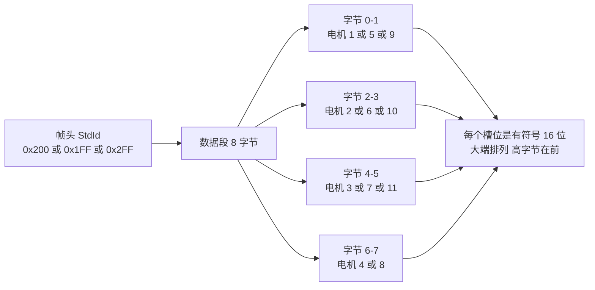
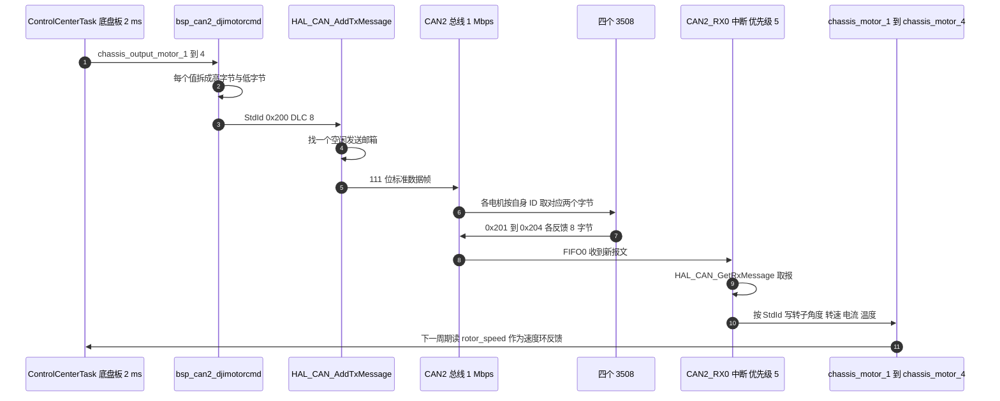

# 帧格式与 ID 分配

哨兵的两块板把 DJI 电机分布在两条 CAN 总线上。底盘板 CAN2 挂四个轮子电机，云台板 CAN2 挂两个摩擦轮，CAN1 挂拨弹盘与 yaw。这些电机接受同一种控制指令：一个标准数据帧携带 8 字节，里面放四个 16 位的转矩电流值。本文说明这个帧结构的由来、帧头与电机 ID 的对应关系，以及本工程两块板上的实际分配。

> 云台板路径为 `/home/wyx/rm/2026SentriOmeniGimbal/2026OmniSentryGimbal`，底盘板路径为 `/home/wyx/rm/2026SentriOmeniChassis/2026OmniSentryChassis`。下文表格中的相对路径都相对于这两个根目录。

## 1. 一帧装四个电机

3508 的控制指令只传一个量：转矩电流指令（torque current command）。电机内部已经闭环了电流环，主控给出的是电流目标；占空比与母线电压由电机内部决定。一个电流目标用有符号 16 位表示，取值范围 ±16384。

$$N_{\text{电机}} = \frac{8\ \text{字节}}{2\ \text{字节/电机}} = 4$$

四个电机共用一帧的条件是它们的 ID 落在同一段连续区间（1 到 4、5 到 8、9 到 11），代价是其中任何一个电机的指令更新都会让同帧的其余电机跟着刷新。收益是总线占用低：一帧 111 位就够。

标准数据帧的位构成（不计位填充）：

| 字段 | 位数 |
| --- | --- |
| 帧起始 SOF | 1 |
| 标识符 StdId | 11 |
| RTR、IDE、r0 | 3 |
| DLC | 4 |
| 数据段 | 64 |
| CRC 与 CRC 定界 | 16 |
| ACK 槽与 ACK 定界 | 2 |
| 帧结束 EOF | 7 |
| 帧间隔 IFS | 3 |
| 合计 | 111 |

在 1 Mbps 下：

$$T_{\text{帧}} = \frac{111\ \text{位}}{10^6\ \text{位/秒}} = 111\ \mu\text{s}$$

本工程的位定时来自 `Core/Src/can.c` 的 `MX_CAN1_Init` 与 `MX_CAN2_Init`（`:42-46` 与 `:74-78`）：预分频 2、BS1 选 15TQ、BS2 选 5TQ、SJW 选 1TQ。APB1 为 42 MHz，于是

$$f_{\text{CAN}} = \frac{42\ \text{MHz}}{2 \times (1 + 15 + 5)} = 1\ \text{Mbps}$$

APB1 频率的来历见时钟树一页；这里的数值与 `2026sentriomeni.ioc` 里 CAN1 与 CAN2 的 `CalculateBaudRate=1000000` 一致（`:9` 与 `:24`）。



## 2. 帧头与 ID 的对应

| 电机 ID | 控制帧头 | 数据段槽位 | 反馈帧头 |
| --- | --- | --- | --- |
| 1 到 4 | 0x200 | 字节 0-7，四个槽位 | 0x201 到 0x204 |
| 5 到 8 | 0x1FF | 字节 0-7，四个槽位 | 0x205 到 0x208 |
| 9 到 11 | 0x2FF | 字节 0-5，三个槽位 | 0x209 到 0x20B |

0x1FF 有一段历史歧义：3508 的 ID 5 到 8 用 0x1FF，而 6020（电压控制，取值 ±30000）的 ID 1 到 4 也用 0x1FF。两者靠电机型号与配置的 ID 区分，不能只看帧头。本工程云台板的 yaw 电机属于 6020，摩擦轮与拨弹盘属于 3508，归属见第 3 节。

## 3. 落到本工程

### 3.1 云台板

`BSP/Src/bsp_can.cpp` 里六个发送函数各自固定一个帧头：

| 函数 | 帧头 | 总线句柄 | 行号 |
| --- | --- | --- | --- |
| `BSP_CAN2_DJIMotorCmd` | 0x200 | `hcan2` | `:89-113` |
| `BSP_CAN2_DJIMotorCmdFive2Eight` | 0x1FF | `hcan2` | `:116-140` |
| `BSP_CAN1_DJIMotorCmd` | 0x200 | `hcan1` | `:141-165` |
| `BSP_CAN1_DJIMotorCmdFive2Eight` | 0x1FF | `hcan1` | `:168-192` |
| `BSP_CAN2_DJIMotorCmdNine2Eleven` | 0x2FF | `hcan2` | `:194-216` |
| `BSP_CAN1_DJIMotorCmdNine2Eleven` | 0x2FF | `hcan1` | `:217-239` |

数据填充的写法（`bsp_can.cpp:102-109`）：

```c
TxData[0] = (motor1 >> 8) & 0xFF;
TxData[1] = (motor1 & 0xFF);
TxData[2] = (motor2 >> 8) & 0xFF;
TxData[3] = (motor2 & 0xFF);
TxData[4] = (motor3 >> 8) & 0xFF;
TxData[5] = (motor3 & 0xFF);
TxData[6] = (motor4 >> 8) & 0xFF;
TxData[7] = (motor4 & 0xFF);
```

高字节写到低地址，这是大端排列，与电机手册一致。CAN2 版本用 `& 0xFF` 取字节，CAN1 版本直接右移后赋值，对 `int16_t` 参数而言两者结果相同；两组函数的区别只在最后传给 `HAL_CAN_AddTxMessage` 的句柄（`:112` 与 `:164`）。

调用点在云台板 `Task/Src/ControlCenterTask.cpp:132-133`：

```c
bsp_can2_djimotorcmd(control_output_motor_1, control_output_motor_2,0.,0);
bsp_can1_djimotorcmdfive2eight(yaw_current_out,control_output_motor_3,0,0);
```

第一行发 0x200 给 CAN2 上的两个摩擦轮（ID1、ID2），第三、四个槽位填 0；第二行发 0x1FF 给 CAN1 上的第 1、2 个槽位：第 1 槽是 yaw（按 3508 编号即 ID5；若 yaw 实为 GM6020，则按 6020 编号为 ID1，两者是同槽位、同反馈 0x205），第 2 槽是拨弹盘 ID6，后两个槽位填 0。这两行在 `osDelay(5)`（`:137`）的循环里执行，所以云台的控制帧周期是 5 ms。

### 3.2 底盘板

底盘四轮用同一个函数组，但走 CAN2（`BSP/Src/bsp_can.cpp:83-108`），调用点在 `Task/Src/ControlCenterTask.cpp:150`：

```c
bsp_can2_djimotorcmd(chassis_output_motor_1,chassis_output_motor_2,chassis_output_motor_3,chassis_output_motor_4);
```

四个槽位全部用完，周期为 `osDelay(2)`（`:154`）给出的 2 ms。同一循环里还有两帧板间报文 `bsp_can1_sendreferee` 与 `bsp_can1_sendreferee_hot`（`:152-153`），它们占用 CAN1。

### 3.3 实际 ID 分配

| 板 | 电机 | ID | 总线与引脚 | 控制帧 | 反馈帧 | 依据 |
| --- | --- | --- | --- | --- | --- | --- |
| 底盘 | 右前轮 | 1 | CAN2，PB5/PB6 | 0x200 | 0x201 | `bsp_can.cpp:592-599`、`项目概述.md:13` |
| 底盘 | 左前轮 | 2 | CAN2 | 0x200 | 0x202 | `:600-606` |
| 底盘 | 左后轮 | 3 | CAN2 | 0x200 | 0x203 | `:607-613` |
| 底盘 | 右后轮 | 4 | CAN2 | 0x200 | 0x204 | `:614-620` |
| 云台 | 摩擦轮右 | 1 | CAN2，PB5/PB6 | 0x200 | 0x201 | `bsp_can.cpp:599-606` |
| 云台 | 摩擦轮左 | 2 | CAN2 | 0x200 | 0x202 | `:607-613` |
| 云台 | 拨弹盘 | 6 | CAN1，PD0/PD1 | 0x1FF 槽位 2 | 0x206 | `:620-629` |
| 云台 | yaw | 5 | CAN1 | 0x1FF 槽位 1 | 0x205 | `:631-640` |

引脚分配在 `Core/Src/can.c:117-122`（CAN1 用 PD0/PD1）与 `:150-155`（CAN2 用 PB5/PB6）。

> 待现场确认：`项目概述.md:12` 把拨弹盘记作 3508 ID2，而云台固件按 0x206 解析它的反馈（即 ID6），两者不一致。两份材料的冲突以固件代码为准，现场应当核对拨弹盘电机实际的 ID 拨码。

### 3.4 一次控制周期的完整时序



## 4. 易错点

| # | 易错点 | 表现 | 源码位置 |
| --- | --- | --- | --- |
| 1 | 把 0x1FF 当成 6020 专用 | 3508 的 ID 5 到 8 也用 0x1FF，看帧头无法判断型号 | `bsp_can.cpp:118` |
| 2 | 高字节与低字节写反 | 电机收到的电流值被放大或缩小 256 倍 | `bsp_can.cpp:97-104` |
| 3 | 认为同一 ID 在两条总线上会冲突 | CAN1 与 CAN2 是两个独立总线，ID 各自编号 | `can.c:112-155` |
| 4 | 0x2FF 帧只填 6 字节而 DLC 仍为 8 | 后两字节保持局部数组的未初始化值 | `bsp_can.cpp:196`、`:202-207` |
| 5 | DLC 不等于 8 | 电机丢弃整帧，表现为电机不受控 | `bsp_can.cpp:94` |
| 6 | 不检查 `HAL_CAN_AddTxMessage` 的返回值 | 发送邮箱占满时静默丢帧 | `bsp_can.cpp:107` |
| 7 | 把帧头当作某个电机的 ID | 0x200 是 ID 1 到 4 的共用帧头 | `bsp_can.cpp:91` |
| 8 | 认为三个 0x2FF 函数在本工程里有调用点 | 两块板都只有定义，没有调用 | 全树搜索 `nine2eleven` 只有定义 |

## 5. 小结

### 核心概念

- 3508 的控制指令是标准数据帧加 8 字节，8 字节里放四个有符号 16 位的转矩电流值，取值 ±16384。
- 帧头由 ID 所在段决定：ID 1 到 4 用 0x200，ID 5 到 8 用 0x1FF，ID 9 到 11 用 0x2FF。
- 数据段是大端排列，高字节在前。
- 本工程的分配：底盘四轮 ID1 到 4 在 CAN2 用 0x200；云台摩擦轮 ID1、ID2 在 CAN2 用 0x200；拨弹盘 ID6 与 yaw（3508 编号 ID5，若为 GM6020 则编号 ID1）在 CAN1 用 0x1FF 的两个槽位。
- 1 Mbps 下 111 位的一帧约 111 µs，这是后面算总线负载率的基本单位。
- 发送层不做数值限幅，限幅责任在调用方，见电流控制下发一页。

### 设计权衡

| 权衡点 | 本工程的选择 | 代价与收益 |
| --- | --- | --- |
| 一帧带四个电机 | 采用原厂约定 | 总线占用低；代价是四个电机的 ID 必须同段，更新粒度被绑定 |
| 沿用原厂 ID 段 | 采用 | 不需要额外协议；代价是 0x1FF 与 6020 的 ID 段重叠，必须按型号区分 |
| 空闲槽位填 0 | 底盘与摩擦轮采用 | 无副作用；0x2FF 的两个尾字节没有显式赋值 |
| 发送前不限幅 | 在 `bsp_can` 层不做 | 分层清晰；代价是限幅上移到 PID 与功率控制，遗漏一处就会把 ±32767 送出去 |
| 两条总线各一套函数 | 采用 | 调用点明确；代价是同一个帧头在四个函数里重复实现 |

## 6. 练习

### 基础题

1. 写出 ID 为 3 的 3508 的反馈帧头、控制帧头，以及它在数据段中占用的字节下标。
2. 按位填充最坏情况（约为原始位数的 1.2 倍）估算一帧 0x200 在 1 Mbps 下的最长占用时间。
3. 底盘四个轮子中只有 ID2 的接线松动，0x200 帧的发送与其余三个电机的行为分别会出现什么现象。

### 挑战题

4. 把 `BSP_CAN2_DJIMotorCmdNine2Eleven` 改成显式填充 8 字节，并论述 DLC 应当填 8 还是 6，以及两种选择的后果。
5. 设底盘四轮反馈为 1 kHz、控制帧周期 2 ms，用一条公式给出 CAN2 的总线负载率，并判断是否需要降低反馈频率或改用更高的波特率。

### 附：本页引用的固件路径

| 路径 | 用途 |
| --- | --- |
| `/home/wyx/rm/2026SentriOmeniGimbal/2026OmniSentryGimbal/BSP/Src/bsp_can.cpp` | 六个 DJI 发送函数（`:89-239`）、FIFO0 接收回调（`:590-715`） |
| `/home/wyx/rm/2026SentriOmeniGimbal/2026OmniSentryGimbal/Task/Src/ControlCenterTask.cpp` | 云台控制帧调用点（`:132-133`）、`osDelay(5)`（`:137`） |
| `/home/wyx/rm/2026SentriOmeniChassis/2026OmniSentryChassis/BSP/Src/bsp_can.cpp` | 底盘 DJI 发送函数（`:83-211`）、FIFO0 接收回调（`:583-689`） |
| `/home/wyx/rm/2026SentriOmeniChassis/2026OmniSentryChassis/Task/Src/ControlCenterTask.cpp` | 底盘控制帧调用点（`:150`）、`osDelay(2)`（`:154`） |
| `/home/wyx/rm/2026SentriOmeniGimbal/2026OmniSentryGimbal/Core/Src/can.c` | CAN1 与 CAN2 位定时（`:42-46`、`:74-78`）、引脚（`:117-122`、`:150-155`） |
| `/home/wyx/rm/2026SentriOmeniChassis/2026OmniSentryChassis/2026sentriomeni.ioc` | `CalculateBaudRate=1000000`（`:9`、`:24`） |
| `/home/wyx/rm/2026SentriOmeniChassis/2026OmniSentryChassis/项目概述.md` | 轮子 ID 与帧头（`:5-6`）、总线接线（`:13`） |
