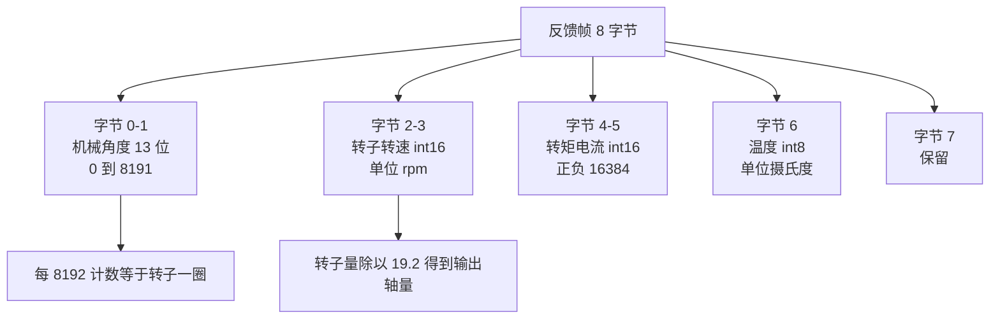
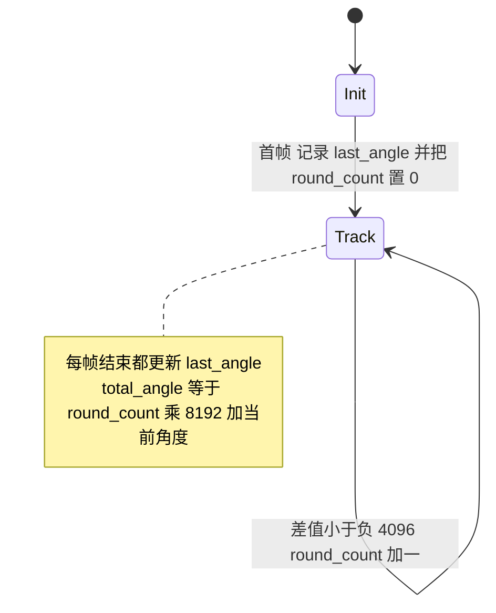
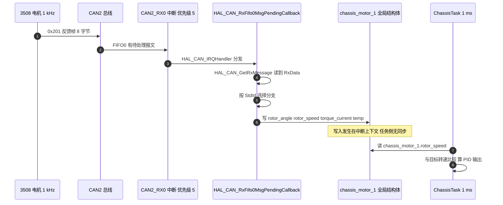

# 反馈报文解析

控制帧把电流目标发下去，电机用另一帧把当时的转子状态发回来。3508 的反馈帧头是 `0x200 + ID`，同样是 8 字节，但四个字段各有自己的量纲，彼此并不同构。本文说明这 8 字节的布局、还原方式、各部分对应的物理意义，以及本工程在 CAN 接收中断里怎么用它们。

## 1. 8 字节的布局

| 字节 | 字段 | 类型 | 物理意义 | 取值范围 |
| --- | --- | --- | --- | --- |
| 0 到 1 | 转子机械角度 `rotor_angle` | 无符号 16 位，有效 13 位 | 转子转过的角度，一圈计 8192 | 0 到 8191 |
| 2 到 3 | 转子转速 `rotor_speed` | 有符号 16 位 | 转子转速，单位 rpm | 约 ±9.4×10³ |
| 4 到 5 | 转矩电流 `torque_current` | 有符号 16 位 | 实际转矩电流，与控制指令同量纲 | -16384 到 16384 |
| 6 | 温度 `temp` | 有符号 8 位 | 电机内部温度，单位摄氏度 | -128 到 127 |
| 7 | 保留 | 无 | 未使用 | 无 |

角度与转速都是转子的量，换算到减速箱输出轴要除以减速比 19.2（该数值来自 RoboMaster M3508 规格书，仓库代码里没有体现）：

$$\theta_{out} = \frac{raw}{8192} \times \frac{360}{19.2}, \qquad n_{out} = \frac{n_{rotor}}{19.2}$$

角度字段只有 13 位有效，所以 `rotor_angle` 永远落在 0 到 8191；转速与电流字段是有符号的，还原时必须按补码解释。



## 2. 大端还原

两块板的还原写法完全一致（云台板与底盘板同名的 `BSP/Src/bsp_can.cpp`）：

```c
motor_1.rotor_angle    = ((RxData[0] << 8) | RxData[1]);
motor_1.rotor_speed    = ((RxData[2] << 8) | RxData[3]);
motor_1.torque_current = ((RxData[4] << 8) | RxData[5]);
motor_1.temp           =   RxData[6];
```

高字节在 `RxData[0]`，左移 8 位后与低字节按位或。`RxData` 是 `uint8_t`，参与运算前会整型提升为 `int`，所以 `(RxData[0] << 8) | RxData[1]` 的结果在 0 到 65535 之间；赋给 `int16_t` 成员时按补码回绕，正是有符号量的还原方式。`rotor_angle` 只有 13 位，回绕不会发生。

第 7 字节在 3508 的反馈分支里没有被读取，云台板的 `0x205`、`0x206` 与底盘板的 `0x201` 到 `0x204` 都只用到 `RxData[0]` 到 `RxData[6]`。云台板的 LK 电机分支会读到 `RxData[7]`（`bsp_can.cpp`），那属于另一套协议。

## 3. 累计角度与过零计数

单帧的角度只有一圈内的信息，位置环需要连续角度。`update_motor_total_angle` 用差分加圈数计数把它拼成连续值（云台板与底盘板同名的 `BSP/Src/bsp_can.cpp`）：

```c
int32_t diff = static_cast<int32_t>(new_ecd) - static_cast<int32_t>(motor->last_angle);

if (diff > 4096) {
    motor->round_count--;          /* 新角度远小于上次 说明向下跨过零点 */
} else if (diff < -4096) {
    motor->round_count++;          /* 新角度远大于上次 说明向上跨过零点 */
}

motor->total_angle = motor->round_count * (int32_t)8192 + (int32_t)new_ecd;
```

判据是半个转子圈（4096 计数）。这个阈值把跨圈和正常转动分开，代价是两次读数之间的转角不能超过半圈，否则圈数会算错方向。设采样周期为 $T_s$，能正确计数的转速上限是

$$n_{\max} = \frac{4096 \times 60}{8192 \times T_s} = \frac{30}{T_s}$$

代入本工程的采样条件：

| 反馈周期 $T_s$ | 转速上限 $n_{\max}$ | 相对 M3508 空载转速的裕量 |
| --- | --- | --- |
| 1 ms（厂默认） | 30000 rpm | 约 3.2 倍 |
| 2 ms | 15000 rpm | 约 1.6 倍 |
| 4 ms | 7500 rpm | 低于空载转速，判据失效 |




## 4. 落到本工程

### 4.1 接收路径

反馈帧的解析全部发生在 CAN 接收中断里，回调是 `HAL_CAN_RxFifo0MsgPendingCallback`（云台板与底盘板同名的 `bsp_can.cpp`）。两块板的 CAN1 与 CAN2 共用一个回调，靠 `hcan->Instance` 分流。



### 4.2 两块板的结构体差异

`DJI_motor_info` 在云台板与底盘板的名字相同，但 `total_angle` 的类型不同：

| 字段 | 云台板 `BSP/Inc/bsp_can.h` | 底盘板 `BSP/Inc/bsp_can.h` |
| --- | --- | --- |
| `rotor_angle` | `int16_t` | `int16_t` |
| `rotor_speed` | `int16_t` | `int16_t` |
| `torque_current` | `int16_t` | `int16_t` |
| `temp` | `int8_t` | `int8_t` |
| `total_angle` | `int32_t` | `int16_t` |
| `round_count` | `int32_t` | `int32_t` |

底盘板这个 `int16_t` 是真实缺陷：`update_motor_total_angle` 在两条板上都算 `round_count * 8192 + new_ecd`，赋给 `int16_t` 时会在第 4 圈附近回绕（$32767 / 8192 \approx 4$）。底盘板上调用它的只有 yaw 电机（`bsp_can.cpp`），而这个值被 `ControlCenterTask.cpp` 用来算 `delta_angel`，所以 yaw 转过约 4 圈后角度差会跳变。云台板同一字段是 `int32_t`，没有这个问题。

### 4.3 各字段的使用情况

| 字段 | 写入点 | 读取点 |
| --- | --- | --- |
| `rotor_angle` | 每帧写入 | 仅经 `update_motor_total_angle` 使用 |
| `rotor_speed` | 每帧写入 | 底盘速度环（`ChassisTask.cpp`）、云台摩擦轮与拨弹盘（`FireTask.cpp`） |
| `torque_current` | 每帧写入 | 全工程无读取点 |
| `temp` | 每帧写入 | 全工程无读取点 |
| `total_angle` | 过零计数更新 | 云台拨弹盘（`FireTask.cpp`）、底盘 yaw（`ControlCenterTask.cpp`） |

转矩电流与温度两个字段目前只写不读，属于可用的观测余量。

## 5. 易错点

| # | 易错点 | 表现 | 源码位置 |
| --- | --- | --- | --- |
| 1 | 把角度当无符号 16 位整圈 | 角度实际只有 13 位，范围 0 到 8191 | `bsp_can.cpp` |
| 2 | 把一圈当成 65536 计数 | 累计角度换算全部偏差 8 倍 | `bsp_can.cpp` |
| 3 | 把转速当成输出轴转速 | 反馈是转子转速，输出轴要除以 19.2 | `bsp_can.cpp` |
| 4 | `temp` 用无符号类型接收 | 温度超过 127 摄氏度时变成负数 | `bsp_can.h` |
| 5 | 底盘板 `total_angle` 用 `int16_t` | 约 4 圈后回绕，角度差跳变 | 底盘板 `bsp_can.h` |
| 6 | 反馈周期拉到 4 ms 以上 | 过零判据的 4096 阈值不够用，圈数算错 | `bsp_can.cpp` |
| 7 | 中断里直接写全局结构体且不加同步 | 任务侧可能读到半新半旧的字段组合 | `bsp_can.cpp` |
| 8 | 认为反馈帧与指令帧同长度就可以混用解析 | 两者的字节含义完全不同 | `bsp_can.cpp` |

## 6. 小结

### 核心概念

- 3508 的反馈帧头是 `0x200 + ID`，8 字节依次是机械角度、转子转速、转矩电流、温度与一个保留字节。
- 角度是 13 位无符号量，一圈 8192 计数；转速与电流是有符号 16 位；温度是有符号 8 位。
- 还原方式是大端拼接后按补码解释，两块板的代码相同。
- 连续角度靠差分加圈数计数得到，判据是半个转子圈，因此两次读数之间的转角不能超过半圈。
- 本工程反馈解析全部在 CAN 接收中断里完成，中断优先级 5，与任务之间没有同步。
- 底盘板的 `total_angle` 是 `int16_t`，会在约 4 圈后回绕，这是两块板结构体唯一的类型差异。

### 设计权衡

| 权衡点 | 本工程的选择 | 代价与收益 |
| --- | --- | --- |
| 解析放在中断里 | 放在 `HAL_CAN_RxFifo0MsgPendingCallback` | 时延最低；代价是中断里写了跨上下文的全局状态 |
| 过零判据用固定 4096 | 采用 | 不需要额外状态；代价是采样周期一拉长，可测转速上限就降到 7500 rpm |
| 温度与电流只收不用 | 保留字段 | 调试时可以直接读；代价是这两项没有做范围检查 |
| 两块板结构体同名不同宽 | 采用 | 代码可以复用；代价是底盘板的 `total_angle` 存在回绕缺陷 |

## 7. 练习

### 基础题

1. 说明 `(RxData[2] << 8) | RxData[3]` 在转速为 -1 rpm 时得到的十进制值，以及赋给 `int16_t` 后的结果。
2. 电机从静止加速到 6000 rpm，在 1 ms 的反馈周期下每次读数的角度增量是多少计数。
3. 解释为什么角度字段按无符号解释而转速字段按有符号解释。

### 挑战题

4. 把 `update_motor_total_angle` 改成基于转速的辅助校验（例如用 `rotor_speed` 预测本帧应跨过的圈数），写出判据并说明它如何处理丢帧。
5. 设计一个在任务侧读取 `torque_current` 与 `temp` 的观测方案，要求不改变中断里的写入逻辑，并说明并发读取时可能读到的值。
6. 论证把 `total_angle` 统一改成 `int32_t` 后底盘板 `delta_angel` 的计算范围（提示：8192 计数一圈，$2^{31}$ 覆盖多少圈）。

### 附：本页引用的固件路径

| 路径 | 用途 |
| --- | --- |
| `BSP/Src/bsp_can.cpp` | 反馈解析分支、`update_motor_total_angle` |
| `BSP/Inc/bsp_can.h` | `DJI_motor_info` 定义 |
| `Task/Src/FireTask.cpp` | 读转速与累计角度 |
| `底盘板 BSP/Src/bsp_can.cpp` | 四轮反馈解析、`update_motor_total_angle` |
| `底盘板 BSP/Inc/bsp_can.h` | 底盘版 `DJI_motor_info`（含 `total_angle` 字段） |
| `底盘板 Task/Src/ChassisTask.cpp` | 读转速构成速度环 |
| `底盘板 Task/Src/ControlCenterTask.cpp` | yaw 累计角度的使用 |
