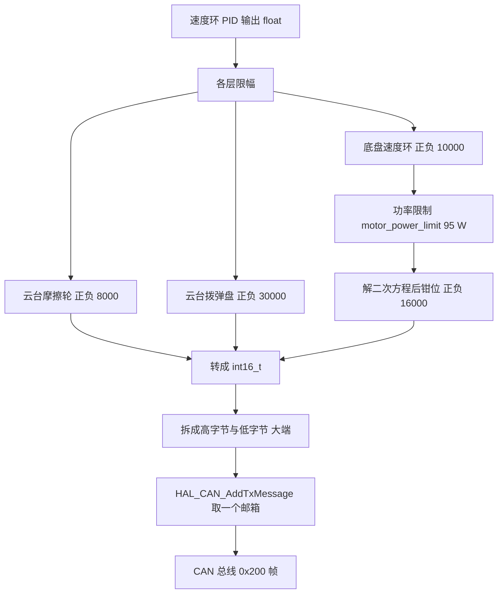
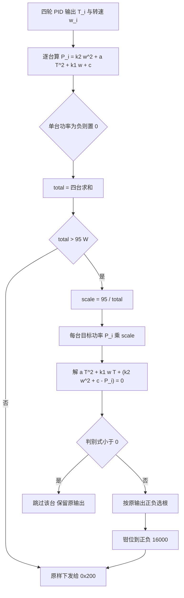

# 电流控制下发

控制帧的 8 字节里放的是电流目标。本工程从速度环算出的浮点输出到总线上那 8 个字节，中间要经过限幅、功率分配、取整与大端拆分。本文说明编码值与电流的对应关系、限幅责任落在哪一层，以及底盘板功率限制的二次模型。

## 1. 编码值与电流的对应

3508 的电流指令是有符号 16 位编码，±16384 对应电机的最大转矩电流 ±20 A（该数值来自 RoboMaster M3508 规格书，仓库代码里没有体现）。编码与电流是线性的：

$$I = \frac{code}{16384} \times 20\ \text{A}$$

$$1\ \text{LSB} = \frac{20\ \text{A}}{16384} = 1.22\ \text{mA}$$

电机内部已经闭环了电流环，主控只需要把电流目标编码后发出去，不需要把安培数写进数据段，也不需要知道电机母线的实时电压。这个分工决定了上层 PID 的输出量纲：速度环的输出直接就是电流编码，中间不做单位换算。

## 2. 限幅责任链

限幅不在发送层做。`bsp_can` 的发送函数直接把 `int16_t` 形参拆成两个字节（`BSP/Src/bsp_can.cpp:89-113`），不检查范围。限幅分布在两处：

| 环节 | 位置 | 限幅值 |
| --- | --- | --- |
| 底盘速度环输出 | `Task/Src/ChassisTask.cpp:41` 的 `OUT_BOUNDARY` | 正负 10000 |
| 底盘功率限制 | `Algorithm/Src/motor_power_control.c:40-43` | 正负 16000 |
| 云台摩擦轮速度环输出 | `Task/Src/FireTask.cpp:32-33` | 正负 8000 |
| 云台拨弹盘速度环输出 | `Task/Src/FireTask.cpp:39` | 正负 30000 |
| `bsp_can` 发送层 | `BSP/Src/bsp_can.cpp:89-113` | 无 |
| 函数形参本身 | 同上，类型是 `int16_t` | 正负 32767，超出即截断 |

云台拨弹盘的 30000 超过了 3508 的 16384 编码上限，超出部分由电机侧的电流环自己饱和，不会损坏通道，但会让上层 PID 的积分在饱和区继续累积，见速度环与 PID 一页。



## 3. 大端拆分与发送

底盘板的发送函数（`BSP/Src/bsp_can.cpp:83-108`）：

```c
HAL_StatusTypeDef bsp_can::BSP_CAN2_DJIMotorCmd(int16_t motor1, int16_t motor2, int16_t motor3, int16_t motor4) {
    CAN_TxHeaderTypeDef TxHeader;
    uint8_t TxData[8];
    uint32_t TxMailbox;

    TxHeader.StdId = 0x200;
    TxHeader.IDE = CAN_ID_STD;
    TxHeader.RTR = CAN_RTR_DATA;
    TxHeader.DLC = 8;

    TxData[0] = (motor1 >> 8) & 0xFF;
    TxData[1] = (motor1 & 0xFF);
    /* 另外三个电机按同样方式填入字节 2 到字节 7 */

    return HAL_CAN_AddTxMessage(&hcan2, &TxHeader, TxData, &TxMailbox);
}
```

`HAL_CAN_AddTxMessage` 是非阻塞的：它找三个发送邮箱里的一个空闲项，写入后立即返回。三个邮箱都占用时返回 `HAL_BUSY`，这一帧不会排队等待，调用点也不重试。发送一个 111 位的帧在 1 Mbps 下占约 111 µs，而底盘每 1 ms 只发一帧 0x200，邮箱不会成为瓶颈。一旦总线出现错误帧触发自动重传（`AutoRetransmission = ENABLE`，`Core/Src/can.c:50`），邮箱占用时间会成倍增长，这是返回值无人检查时最先出问题的地方。

调用点与周期（底盘板 `Task/Src/ControlCenterTask.cpp:133-154`）：

| 步骤 | 代码 | 行号 |
| --- | --- | --- |
| 读四轮转速 | `chassis.motor_chassis[i].speed_rpm = chassis_motor_i.rotor_speed` | `:133-136` |
| 写入本轮 PID 输出 | `chassis.motor_speed_pid[i].out` 赋值为对应的 `chassis_output_motor_i` | `:138-141` |
| 功率限制 | `motor_power_limit(&chassis, 95.0f)` | `:143` |
| 取回受限后的值 | `chassis_output_motor_i = (int16_t)chassis.motor_speed_pid[i].out` | `:145-148` |
| 下发 | `bsp_can2_djimotorcmd` 四路一次 | `:150` |
| 周期 | `osDelay(1)` | `:128` |

云台板的发送节奏不同：`Task/Src/ControlCenterTask.cpp:106-108` 每 1 ms 发一帧 0x200（两个摩擦轮）与一帧 0x1FF（yaw 与拨弹盘），`:111` 的 `osDelay(1)` 决定周期。

## 4. 功率限制的二次模型

底盘板的功率限制在 `Algorithm/Src/motor_power_control.c`，模型与系数：

| 系数 | 值 | 来源行 | 对应物理量 |
| --- | --- | --- | --- |
| `k1` | `1.99688994e-6f` | `:3` | 转速一次项 |
| `k2` | `1.453e-07f` | `:4` | 转速平方项 |
| `a` | `1.23e-07f` | `:5` | 转矩电流平方项 |
| `constant` | `4.081f` | `:6` | 静态项 |

单台电机的功率估计（`:17`）：

$$P_i = k_2 \omega_i^2 + a T_i^2 + k_1 \omega_i + c$$

其中 $T_i$ 是本轮速度环的电流编码输出，$\omega_i$ 是本次读到的转子转速（rpm）。三项分别对应铜损、铁损与风阻、机械与静态损耗。四台电机求和后与限值比较（`:22`），超限时先算缩放比：

$$s = \frac{P_{\max}}{P_{\text{total}}}, \qquad P_i' = s \, P_i$$

再对每台电机反解电流编码。把 $P_i'$ 代回模型并整理成 $T$ 的二次方程：

$$a T_i^2 + k_1 \omega_i T_i + \left(k_2 \omega_i^2 + c - P_i'\right) = 0$$

$$T_i = \frac{-k_1 \omega_i \pm \sqrt{(k_1 \omega_i)^2 - 4a\left(k_2 \omega_i^2 + c - P_i'\right)}}{2a}$$

根的符号按原输出的正负选择，保证电流方向不变；判别式小于 0 时跳过这台电机（`:36`），解出的值再钳到 ±16000（`:40-43`）。

```c
if (total > max_power_W) {
    fp32 scale = max_power_W / total;

    for (uint8_t i = 0; i < 4; i++) {
        if (power[i] <= 0) continue;

        fp32 target_power = power[i] * scale;
        fp32 T_orig = chassis->motor_speed_pid[i].out;
        fp32 w = chassis->motor_chassis[i].speed_rpm;

        fp32 b = k1 * w;
        fp32 c = k2 * w * w - target_power + constant;
        fp32 disc = b * b - 4.0f * a * c;

        if (disc < 0) continue;

        if (T_orig > 0) {
            fp32 T_new = (-b + sqrtf(disc)) / (2.0f * a);
            chassis->motor_speed_pid[i].out = (T_new > 16000.0f) ? 16000.0f : T_new;
        } else {
            fp32 T_new = (-b - sqrtf(disc)) / (2.0f * a);
            chassis->motor_speed_pid[i].out = (T_new < -16000.0f) ? -16000.0f : T_new;
        }
    }
}
```

模型的输入来自调用方填好的一张表（`Task/Src/ControlCenterTask.cpp:133-143`）:

| 结构体字段 | 填入内容 | 行号 |
| --- | --- | --- |
| `motor_chassis[i].speed_rpm` | 四轮本次反馈的 `rotor_speed` | `:133-136` |
| `motor_speed_pid[i].out` | 四轮本轮速度环输出 | `:138-141` |
| 限值 | `95.0f` | `:143` |

注意 `:132` 的注释写的是 100W，而 `:143` 的实参是 `95.0f`，两者不一致，本文以代码为准。




## 5. 易错点

| # | 易错点 | 表现 | 源码位置 |
| --- | --- | --- | --- |
| 1 | 认为发送层会限幅 | 形参是 `int16_t`，超过 32767 会被截断并可能反号 | `bsp_can.cpp:89-113` |
| 2 | 云台拨弹盘的 30000 超出编码上限 | 电机电流环饱和，PID 积分继续累积 | `FireTask.cpp:39` |
| 3 | 高字节与低字节写反 | 电机得到的电流与期望相差 256 倍 | `bsp_can.cpp:97-104` |
| 4 | 不检查 `HAL_CAN_AddTxMessage` 的返回值 | 邮箱占满时该帧静默丢弃 | `bsp_can.cpp:107`，调用点 `ControlCenterTask.cpp:150` |
| 5 | 先下发再限幅 | 顺序反了等于没有功率限制 | `ControlCenterTask.cpp:143` 与 `:150` |
| 6 | 把功率模型里的 w 当成底盘线速度 | 模型里的 w 是转子 rpm | `motor_power_control.c:15` |
| 7 | 把注释当作限值 | 注释写 100W，实参是 95.0f | `ControlCenterTask.cpp:132` 与 `:143` |
| 8 | 判别式小于 0 时不处理 | 该台电机保留未缩放的原输出，总功率可能仍超限 | `motor_power_control.c:36` |

## 6. 小结

### 核心概念

- 3508 的电流编码范围是 ±16384，对应最大转矩电流 ±20 A（规格书数值），1 个编码约 1.22 mA。
- 发送层不做任何数值检查，限幅责任分布在速度环输出限幅、功率限制、`int16_t` 形参截断三处。
- `HAL_CAN_AddTxMessage` 非阻塞，只有三个发送邮箱，返回 `HAL_BUSY` 时这一帧直接丢弃。
- 底盘功率模型是 $P = k_2\omega^2 + aT^2 + k_1\omega + c$，总功率超过 95 W 时按比例缩放并逐台解二次方程，结果钳位到 ±16000。
- 模型的输入顺序是：先填 `speed_rpm` 与 `out`，再调用 `motor_power_limit`，最后把受限后的值读回并下发。

### 设计权衡

| 权衡点 | 本工程的选择 | 代价与收益 |
| --- | --- | --- |
| 限幅放在发送层还是上层 | 放在上层 | 发送函数保持单一职责；代价是每个调用点都要自己保证范围 |
| 功率用解析模型还是标定表 | 用二次解析式 | 不需要标定实验；代价是系数固定，换电机或换减速比要重新拟合 |
| 超限时等比缩放 | 采用 | 四轮的牵引力比例保持不变；代价是限额被最耗电的一台拉低时，其余三轮一起变慢 |
| 判别式为负就跳过 | 采用 | 不会解出无意义的根；代价是这一台不再受限，总功率可能仍然超限 |
| 限值写成浮点字面量 | `95.0f` | 便于调整；代价是与同段注释的 100W 不一致 |

## 7. 练习

### 基础题

1. 计算 1 个编码误差对应的电流误差，单位用 mA。
2. 设四台电机的电流编码都是 8000、转速都是 6000 rpm，用 `motor_power_control.c:3-6` 的系数算出总功率，判断是否需要缩放。
3. 说明为什么限幅顺序必须是先功率限制、后转 `int16_t` 下发。

### 挑战题

4. 给出二次方程取根符号的几何解释（提示：抛物线开口方向与对称轴位置）。
5. 把限值从 95 W 改成 80 W，分析四轮转速相同但负载不同时输出的变化。
6. 设计一个在 `debug_vars` 中观测本周期实际总功率的方案，要求不改变 `motor_power_control.c` 的接口。

### 附：本页引用的固件路径

| 路径 | 用途 |
| --- | --- |
| `/home/wyx/rm/2026SentriOmeniChassis/2026OmniSentryChassis/Algorithm/Src/motor_power_control.c` | 功率模型与解算（`:3-45`） |
| `/home/wyx/rm/2026SentriOmeniChassis/2026OmniSentryChassis/Algorithm/Inc/motor_power_control.h` | `chassis_move_t` 与 `motor_pid_t` 定义（`:11-28`） |
| `/home/wyx/rm/2026SentriOmeniChassis/2026OmniSentryChassis/BSP/Src/bsp_can.cpp` | 0x200 发送与大端拆分（`:83-108`） |
| `/home/wyx/rm/2026SentriOmeniChassis/2026OmniSentryChassis/Task/Src/ChassisTask.cpp` | 速度环输出限幅与增益（`:38-52`） |
| `/home/wyx/rm/2026SentriOmeniChassis/2026OmniSentryChassis/Task/Src/ControlCenterTask.cpp` | 限制调用与下发顺序（`:133-154`） |
| `/home/wyx/rm/2026SentriOmeniGimbal/2026OmniSentryGimbal/Task/Src/FireTask.cpp` | 云台摩擦轮与拨弹盘的限幅（`:32-39`） |
| `/home/wyx/rm/2026SentriOmeniGimbal/2026OmniSentryGimbal/BSP/Src/bsp_can.cpp` | 云台 0x200 与 0x1FF 发送（`:89-192`） |
| `/home/wyx/rm/2026SentriOmeniGimbal/2026OmniSentryGimbal/Core/Src/can.c` | `AutoRetransmission` 配置（`:50`） |
