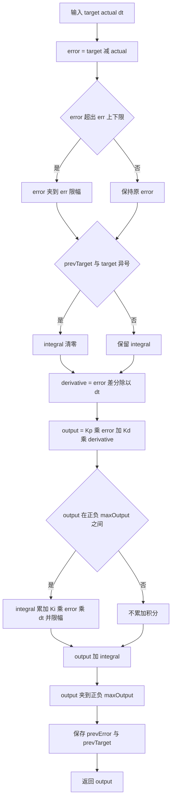
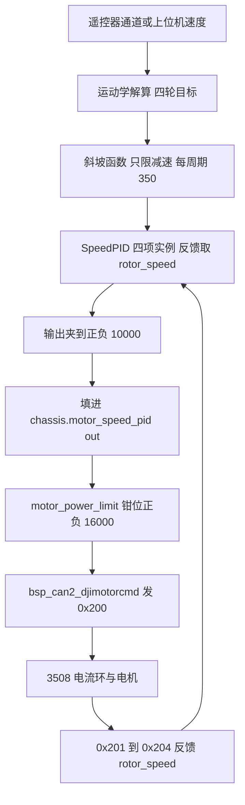
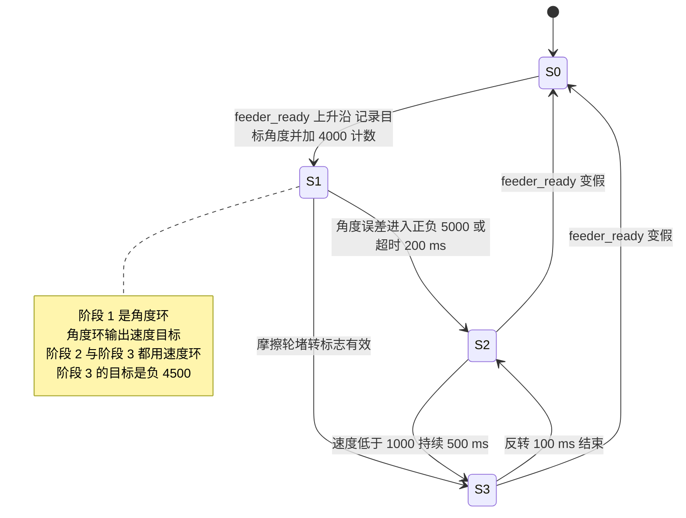

# 速度环与 PID

3508 把电流环放在电机内部，主控要做的只是速度环：读反馈转速，与目标比较，输出电流编码。本工程的速度环由 `SpeedPID` 类实现，底盘四轮、云台两个摩擦轮与拨弹盘各持有一个实例。本文说明这个类的算法、dt 参数与实际周期的偏差，以及三处用法的差异。

## 1. 电流环与速度环的分工

| 环 | 位置 | 输入 | 输出 |
| --- | --- | --- | --- |
| 电流环 | 电机内部 | 转矩电流编码 | 三相电流 |
| 速度环 | 主控任务 | 目标转速与反馈转速 | 转矩电流编码 |
| 位置环 | 主控任务，拨弹盘使用 | 目标角度与累计角度 | 目标转速 |

分界点在 `0x200` 帧上：主控发出去的是电流编码，收回来的是转速与角度。所以速度环的反馈量与输出量都不需要跨总线的单位换算，量纲由上层约定，这一点在第 4 节讨论。

## 2. SpeedPID 的算法

基类实现在 `PID/PidBase.h`：

```c
virtual float Calculate(float target, float actual, float dt) {
    float error = target - actual;

    if ((prevTarget * target) < 0.0f) {
        integral = 0.0f;
    }

    float derivative = (error - prevError) / dt;
    float output = Kp * error + Kd * derivative;

    if (output < maxOutput && output > -maxOutput) {
        integral += Ki * error * dt;
        integral = clamp(integral, -maxIntegral, maxIntegral);
    }

    output += integral;
    output = clamp(output, -maxOutput, maxOutput);

    prevError = error;
    prevTarget = target;
    return output;
}
```

写成离散形式，第 $k$ 个周期的输出是

$$u_k = K_p e_k + K_d \frac{e_k - e_{k-1}}{dt} + I_k$$

其中积分项为

$$I_k = \mathrm{clamp}\left(I_{k-1} + K_i e_k \, dt,\ -I_{\max},\ I_{\max}\right)$$

积分只在 `output < maxOutput && output > -maxOutput` 时累积。被判断的对象是比例项与微分项之和，与加上积分之后的总输出无关，所以积分项一旦把总输出推到饱和，条件仍然可能成立，积分会继续涨到 `maxIntegral` 为止。抗饱和的最终界限由积分限幅兜住。

另外两个特性决定了它对目标突变的响应：

| 特性 | 代码 | 作用 |
| --- | --- | --- |
| 目标方向穿越清积分 | `PidBase.h` | 目标从正变负时清掉历史积分，避免换向时先被旧积分拖住 |
| 输出限幅 | `PidBase.h` | 每周期输出都夹在正负 `maxOutput` 内 |

`SpeedPID` 在派生类里覆写了 `Calculate`（`PID/Src/speed_pid.cpp`），在基类逻辑前加了一层误差限幅：

```c
float error = target - actual;

if (error > error_max_) {
    error = error_max_;
} else if (error < error_min_) {
    error = error_min_;
}
```

误差限幅把一次大阶跃拆成多个周期完成，代价是误差被截断后，比例项与积分项看到的都不是真实误差。底盘实例的误差限幅是 25000，远大于正常工作范围，平时不生效。



## 3. dt 传参与实际周期的偏差

`SpeedPID` 的 `dt` 由调用方在每次计算时显式传入，类内部不维护采样时间。三处调用点的传参与任务周期如下：

| 使用处 | 传入的 dt | 任务周期 |
| --- | --- | --- |
| 底盘四轮 | `0.01`，来自全局变量 `dt` | `osDelay(1)`，即 1 ms |
| 云台摩擦轮 | `0.01f` | `osDelay(1)`，即 1 ms |
| 云台拨弹盘 | `0.01f` | `osDelay(1)`，即 1 ms |

传参 10 ms 与实际 1 ms 不一致，积分与微分两个环节各偏一个方向：

$$\Delta I_{\text{每秒}} = \frac{K_i e \cdot dt_{\text{参数}}}{T_{\text{实际}}} = K_i e \cdot \frac{0.01}{T_{\text{实际}}}$$

| 使用处 | 每秒积分增量相对真实值 | 微分项相对真实值 |
| --- | --- | --- |
| 底盘四轮，1 ms | 10 倍 | 缩小 10 倍 |
| 云台摩擦轮与拨弹盘，1 ms | 10 倍 | 缩小 10 倍 |

积分被放大等于有效 $K_i$ 被放大同样的倍数，微分被缩小等于有效 $K_d$ 被缩小同样的倍数。工程上这两个效应被增益值本身吸收了一部分：底盘的 $K_i$ 取到 `0.001`，云台摩擦轮的 $K_d$ 取到 `0.09`，都比常见取值大。要判断真实增益，应当用实际周期重算 $K_i \times 0.01 / T_{\text{实际}}$。

## 4. 底盘四轮速度环

底盘四轮的增益与限幅（`Task/Src/ChassisTask.cpp`）：

| 参数 | 值 | 含义 |
| --- | --- | --- |
| `KP` | `4.0f` | 比例增益 |
| `KI` | `0.001f` | 积分增益 |
| `KD` | `0.001f` | 微分增益 |
| `OUT_BOUNDARY` | `10000.0f` | 输出限幅 |
| `ERR_BOUNDARY` | `25000.0f` | 误差限幅 |
| `ramp_rate` | `350.0f` | 每周期最大减速量 |

四个实例用同一组参数创建，反馈取四轮结构体的 `rotor_speed`：

```c
chassis_output_motor_1 = motor_1_PID.Calculate(motor_1_target, chassis_motor_1.rotor_speed, dt);
chassis_output_motor_2 = motor_2_PID.Calculate(motor_2_target, chassis_motor_2.rotor_speed, dt);
chassis_output_motor_3 = motor_3_PID.Calculate(motor_3_target, chassis_motor_3.rotor_speed, dt);
chassis_output_motor_4 = motor_4_PID.Calculate(motor_4_target, chassis_motor_4.rotor_speed, dt);
```

目标值先经过一个斜坡函数：

```c
auto ramp = [](float current, float target, float rate) {
    if (target >= current) {
        return target;              /* 加速分支 直接给目标 */
    }
    float diff = target - current;
    if (diff < -rate) return current - rate;
    return target;
};
```

加速方向直接返回目标，减速方向每周期最多减 `350`。这个函数只限制减速斜率，不限制加速斜率，与"斜坡"这个名字给人的印象不同。四轮目标全为 0 时对四个实例调用 `Clear()`，其余情况不清积分。

两处实现差异要留意：

| 项目 | 底盘板 `PID/Src/speed_pid.cpp` | 云台板 `PID/Src/speed_pid.cpp` |
| --- | --- | --- |
| 积分限幅 |  被注释掉 |  生效 |
| 效果 | 积分只受条件积分约束，没有硬上限 | 积分被夹到 `maxIntegral` |

目标量纲是一个隐性约定。四轮目标在 `Task/Src/ControlCenterTask.cpp` 由运动学算出，输入来自遥控器通道乘 `5.3f`或上位机速度乘 `2000.0f`，算出的值与 `rotor_speed`（单位 rpm）直接比较。也就是说这套目标值经过了一轮手工标定，数值上接近 rpm 但没有物理单位定义，改动减速比或通道系数时要整体重新标定。



## 5. 云台摩擦轮与拨弹盘

云台的摩擦轮是双轮对转：右轮目标 5800 rpm，左轮目标 -5800 rpm（`Task/Src/FireTask.cpp`）：

| 参数 | 值 | 位置 |
| --- | --- | --- |
| 摩擦轮增益 | `20.0f`、`0.11f`、`0.09f` | `FireTask.cpp` |
| 摩擦轮输出限幅 | ±8000 | `FireTask.cpp` |
| 摩擦轮误差限幅 | ±250 | `FireTask.cpp` |
| 前馈 | 左 500、右 -500 | `FireTask.cpp` |
| 差值环增益 | `15.0f`、`0.5f`、`0.05f` | `FireTask.cpp` |
| 差值环输出限幅 | ±300 | `FireTask.cpp` |

差值环的作用是把两个轮子的转速和压到 0：因为两轮反向转，转速和的理想值是 0，实测和不为 0 就说明两轮受力不一致。送入差值环之前先做一阶低通：

$$y_k = 0.2\,x_k + 0.8\,y_{k-1}$$

堵转判定基于时间窗：右轮转速连续 1 s 低于 5000 rpm 就进入反转分支，反转持续到误差时间超过 2 s 再恢复。这套判据依赖 `HAL_GetTick()`，与电机自身状态无关。

拨弹盘是串级结构：角度环输出速度目标，速度环跟踪该目标：

| 环节 | 参数 | 位置 |
| --- | --- | --- |
| 角度环 `AnglePID` | `5.0f`、`0.5f`、`0.0f`，输出限幅 5000，积分限幅 3000 | `FireTask.cpp` |
| 速度环 `SpeedPID` | `30.0f`、`0.5f`、`0.0f`，输出限幅 ±30000，误差限幅 ±2500 | `FireTask.cpp` |
| 每周期目标增量 | 4000 计数 | `FireTask.cpp` |

拨弹盘的四阶段状态机：




## 6. 易错点

| # | 易错点 | 表现 | 源码位置 |
| --- | --- | --- | --- |
| 1 | dt 传 0.01 而任务周期是 1 ms | 积分每秒多累积 10 倍，微分偏小同样倍数 | `ChassisTask.cpp` |
| 2 | 底盘版积分限幅被注释 | 积分只受条件积分约束，没有硬上限 | 底盘板 `speed_pid.cpp` |
| 3 | 把条件积分当成输出饱和检测 | 判断对象是比例加微分，总输出饱和后积分仍可能增长 | `PidBase.h` |
| 4 | 把斜坡函数当成双向限速 | 只有减速被限制，加速分支直接给目标 | `ChassisTask.cpp` |
| 5 | 误差限幅掩盖真实误差 | err 被截断后，比例项与积分项看到的都不是真实值 | `speed_pid.cpp` |
| 6 | 只在四轮目标全 0 时清积分 | 三轮停车而一轮仍在动时不清积分 | `ChassisTask.cpp` |
| 7 | 把目标量纲当作物理 rpm | 目标由标定系数得来，没有单位定义 | `ControlCenterTask.cpp` |
| 8 | 拨弹盘输出限幅 30000 超过编码上限 | 电机电流环饱和，积分继续累积 | `FireTask.cpp` |
| 9 | 方向穿越判据用乘积比较 | prevTarget 为 0 时乘积为 0，条件不成立 | `PidBase.h` |
| 10 | 微分项取自误差差分 | 目标阶跃时会得到一个冲激型微分量 | `PidBase.h` |

## 7. 小结

### 核心概念

- 3508 的电流环在电机内部，主控只做速度环；拨弹盘在速度环外再套一层角度环。
- `SpeedPID` 的计算顺序是：误差限幅、方向穿越清积分、微分、比例加微分、条件积分、输出限幅。
- 条件积分只看比例加微分是否在限幅内，抗饱和的最终界限由积分限幅提供；底盘版的积分限幅被注释掉，云台版保留。
- dt 由调用方传入，三处都传 `0.01`，而实际周期是 1 ms，积分按 10 倍累积，微分按同样倍数缩小。
- 底盘四轮取 `KP = 4`、`KI = 0.001`、`KD = 0.001`，输出限幅 ±10000，减速斜坡每周期 350；积分清除只在四轮目标全 0 时执行。
- 云台摩擦轮取 `KP = 20`、`KI = 0.11`、`KD = 0.09`，并配前馈与差值环；拨弹盘是角度环加速度环的串级，状态机分四个阶段。

### 设计权衡

| 权衡点 | 本工程的选择 | 代价与收益 |
| --- | --- | --- |
| 速度环自己做还是交给电机 | 自己做 | 参数可以随时调整；代价是占用任务周期，且受反馈时延影响 |
| dt 固定传 0.01 | 采用 | 代码简单；代价是与实际周期不符，等效增益偏离标称值 10 倍 |
| 条件积分抗饱和 | 采用 | 不需要额外的饱和检测；代价是判断对象为比例加微分，总输出饱和后积分仍会增长 |
| 底盘积分不设硬上限 | 注释掉积分限幅 | 低速时积分可以顶住静摩擦；代价是长时间堵转会让积分无界增长 |
| 拨弹盘用串级 | 角度环加速度环 | 兼顾位置精度与速度平稳；代价是两套参数加一个四阶段状态机 |
| 目标量纲用手工标定系数 | 采用 | 不需要标定减速比与轮径；代价是换机械结构后必须重新整定 |

## 8. 练习

### 基础题

1. 计算底盘四轮在实际周期 1 ms 条件下，等效积分增益与等效微分增益分别是标称值的多少倍。
2. 某周期底盘四轮误差为 500、积分项为 300，按 `PidBase.h` 的条件判断该周期积分是否累加，并给出累加后的值，取 $K_i = 0.001$、$dt = 0.01$。
3. 说明摩擦轮差值环的目标为什么取 0，以及两轮转速和不为 0 的两种可能原因。

### 挑战题

4. 把三处 `dt` 参数改成与实际周期一致，用第 3 节的倍数关系算出需要同步调整的增益。
5. 设计一个实验区分"误差限幅在起作用"与"PID 增益不足"两种现象，要求只观测 CAN 反馈与 `debug_vars`。
6. 拨弹盘在角度环阶段用 `AnglePID`、速度环阶段用 `SpeedPID`。论证把它合并成单一串级结构后有哪些变化。

### 附：本页引用的固件路径

| 路径 | 用途 |
| --- | --- |
| `PID/PidBase.h` | `Calculate` 基类实现 |
| `PID/Src/speed_pid.cpp` | `SpeedPID::Calculate` 与 C 接口 |
| `PID/Inc/speed_pid.h` | `SpeedPID` 声明 |
| `Task/Src/FireTask.cpp` | 摩擦轮与拨弹盘速度环 |
| `PID/Src/angle_pid.cpp` | 角度环与过零处理 |
| `底盘板 Task/Src/ChassisTask.cpp` | 底盘四轮速度环 |
| `底盘板 Task/Src/ControlCenterTask.cpp` | 四轮目标生成与下发 |
| `底盘板 PID/Src/speed_pid.cpp` | 底盘版积分限幅被注释 |
